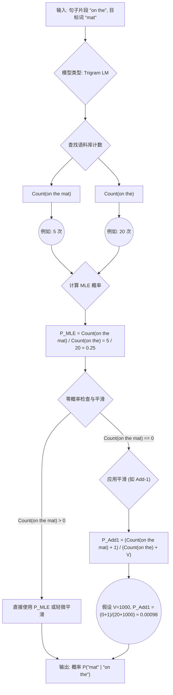

语料库 corpus
文本预处理 Tokenization

# 语言模型
 1. 简单来说，语言模型就是一个**计算“一句话有多大可能性出现”的数学模型**。更严谨地说，它是一个**计算词语序列（句子）概率分布**的模型。
 2. 语言模型的核心是概率。我们要计算一个词序列 $W = (w_1, w_2, ..., w_n)$ 出现的概率，记作 $P(W) = P(w_1, w_2, ..., w_n)$。这个概率值越大，说明这个句子越“自然”、越常见。
	链式法则思想： 把一长串事件同时发生的概率，拆解成一系列“条件概率”的乘积。就像走楼梯，要到达第 3 级，你得先到第 1 级，再从第 1 级上到第 2 级，再从第 2 级上到第 3 级。
	公式（直观理解版）：
	$P(w_1, w_2, ..., w_n) = P(w_1) \times P(w_2 | w_1) \times P(w_3 | w_1, w_2) \times ... \times P(w_n | w_1, ..., w_{n-1})$
	$P(w_1)$: 第一个词是 $w_1$ 的概率（比如一句话以 "The" 开头的概率）。
	$P(w_2 | w_1)$: 在第一个词是 $w_1$ 的条件下，第二个词是 $w_2$ 的概率（比如，知道第一个词是 "The"，下一个词是 "cat" 的概率）。
	$P(w_3 | w_1, w_2)$: 在前两个词是 $w_1, w_2$ 的条件下，第三个词是 $w_3$ 的概率（比如，知道是 "The cat"，下一个词是 "sat" 的概率）。
	...以此类推，直到最后一个词。
3. 简化：马尔可夫假设 (Markov Assumption) - N-gram 模型的基础
	链式法则虽然拆解了问题，但 $P(w_n | w_1, ..., w_{n-1})$ 这个条件概率还是太复杂了，因为条件部分 $w_1, ..., w_{n-1}$ 可能非常长，导致数据稀疏（大部分长序列在训练数据里根本没出现过）。
	怎么办？ 做个简化假设！马尔可夫假设认为：下一个词的出现，只跟它前面固定个数（N-1个）的词有关，跟更早的词没关系。
	比喻： 就像一个“健忘”的预测器，它只记得最近发生的几个词。
	N=1 (Unigram): $P(w_i)$，每个词的出现都相互独立（只看单个词的频率，不看上下文）。这显然太简单了。
	N=2 (Bigram): $P(w_i | w_{i-1})$，下一个词只跟前一个词有关。例如，计算 $P(\text{"sat"} | \text{"cat"})$。
	N=3 (Trigram): $P(w_i | w_{i-2}, w_{i-1})$，下一个词只跟前两个词有关。例如，计算 $P(\text{"mat"} | \text{"on the"})$。
### N-gram 概率的极大似然估计 (Maximum Likelihood Estimation, MLE)
>这是最基础的计算方法，思想是：我们观察到的**频率就是最好的概率估计**。

公式 (以 **Bigram** 为例):
$P_{MLE}(w_i | w_{i-1}) = \frac{\text{Count}(w_{i-1}, w_i)}{\text{Count}(w_{i-1})}$
$P(w_i | w_{i-1})$: 我们想求的，在看到词 $w_{i-1}$ 之后，下一个词是 $w_i$ 的概率。
$\text{Count}(w_{i-1}, w_i)$: 在语料库中，词对 $(w_{i-1}, w_i)$ 连续出现的次数。例如 Count("cat", "sat") 就是 "cat sat" 这个组合出现了多少次。
$\text{Count}(w_{i-1})$: 在语料库中，词 $w_{i-1}$ 出现的总次数。例如 Count("cat") 就是 "cat" 这个词出现了多少次。
整个公式的含义： 用 “$w_{i-1}$ 后面跟着 $w_i$ 的次数” 除以 “$w_{i-1}$ 出现的总次数”，得到一个比例，这个比例就作为 $w_i$ 在 $w_{i-1}$ 之后出现的条件概率估计。
比喻： 假设你观察了 10 次你家猫（"cat"），发现有 8 次它跳到了垫子上（"sat on the mat"）。那么你估计下次看到猫时，它“坐下”（"sat"）的概率就是 8/10 = 0.8。这就是 MLE 的直观想法。

推广到 N-gram:
$P_{MLE}(w_i | w_{i-N+1}, ..., w_{i-1}) = \frac{\text{Count}(w_{i-N+1}, ..., w_{i-1}, w_i)}{\text{Count}(w_{i-N+1}, ..., w_{i-1})}$
分子： 完整的 N 个词序列出现的次数。
分母： 前 N-1 个词的序列出现的次数。
### 数据稀疏 (Sparsity) 与 零概率问题 (Zero Probability Problem)
>问题： 如果一个词序列（N-gram）在你的训练语料库中从未出现过，那么它的 Count 就是 0，用 MLE 计算出来的概率也是 0！
严重性： 这非常糟糕！

不合理： 没见过不代表不可能发生。一个完全合乎语法的句子，可能因为某个词搭配没在训练数据里见过，就被判为概率 0。
计算问题： 在计算整个句子的概率（连乘）或评估指标（如 Perplexity，后面会讲）时，任何一项是 0 都会导致整个结果是 0 或无效。

比喻： 你只在动物园见过棕熊和北极熊，从没见过熊猫。难道熊猫出现的概率就是 0 吗？显然不是。我们需要给“未见过”的事件也分配一个（很小的）概率。
### 平滑技术 (Smoothing Techniques): 拉普拉斯平滑 (Laplace Smoothing / Add-one Smoothing)
>**为了解决零概率问题**，人们发明了平滑技术。最简单常用的一种是**拉普拉斯平滑**。

核心思想： 给所有可能的 N-gram 的计数都加 1（或者加一个小数 $\alpha$）。就好像我们“假装”每个可能的组合都至少见过一次。

公式 (以 Bigram + Add-1 为例):
$P_{Laplace}(w_i | w_{i-1}) = \frac{\text{Count}(w_{i-1}, w_i) + 1}{\text{Count}(w_{i-1}) + V}$

$\text{Count}(w_{i-1}, w_i) + 1$: 原来的计数加上 1。
$\text{Count}(w_{i-1}) + V$: 分母也要调整。$V$ 代表词汇表 (Vocabulary) 的大小，也就是语料库中不同词的总数。为什么要加 $V$？因为对于 $w_{i-1}$ 后面可能跟的每一种词 $w_k$（总共有 $V$ 种可能），我们都在分子上加了 1，所以总数（分母）也要相应增加 $V \times 1 = V$，以保证所有 $P(w_k | w_{i-1})$ 加起来仍然等于 1。（也就是说将词汇表中的每个词（一共V个）数量都+1）
作用： 即使 $\text{Count}(w_{i-1}, w_i)$ 是 0，加 1 后分子也不会是 0，从而避免了零概率。它把原来属于“见过”的 N-gram 的一部分概率，“平滑”地分给了那些“没见过”的 N-gram。
比喻： 考试前老师给每个同学（包括没及格的）的基础分都加了 1 分，保证最低分不是 0。

N-gram 的 Add-1 Smoothing:
$P_{Laplace}(w_i | w_{i-N+1}, ..., w_{i-1}) = \frac{\text{Count}(w_{i-N+1}, ..., w_i) + 1}{\text{Count}(w_{i-N+1}, ..., w_{i-1}) + V}$
### 模型评估：困惑度 (Perplexity, PPL)
>我们怎么知道一个语言模型好不好？用困惑度来衡量。

目标： 衡量语言模型对**未见过**的测试数据（Test Set）的预测能力。

直观含义： Perplexity 可以理解为模型在预测下一个词时，**平均有多少种等可能性**的选择。**Perplexity 越低，说明模型越确定，预测能力越好。**

比喻：
	一个好的语言模型（低 PPL），看到 "The cat sat on the..." 时，非常肯定下一个词**大概率**是 "mat"，可能还有很**小概率**是 "chair", "floor" 等，它不“困惑”。
	一个差的语言模型（高 PPL），看到同样的前缀，可能觉得 "mat", "apple", "sky", "running" 等等很多词都有**差不多**的可能性，它非常“困惑”。
	如果 PPL = 10，大致可以理解为模型在每个词上的不确定性，相当于是在 10 个词里面等概率地随机猜一个。

公式（基于测试集 W = (w1, w2, ..., wN)）：
$\text{Perplexity}(W) = P(w_1, w_2, ..., w_N)^{-\frac{1}{N}}$

$P(w_1, w_2, ..., w_N)$: 模型计算出的整个测试集文本序列的概率（用链式法则和 N-gram 概率算）。
$N$: 测试集中的总词数。
$-\frac{1}{N}$: 取概率的 N 次方根的倒数。这个数学形式确保了 PPL 的值落在合理的范围，并且具有我们上面说的“平均分支因子”的解释。

另一个等价的常用公式（基于交叉熵 Cross-Entropy H(p, q)）：
$\text{Perplexity}(W) = 2^{H(p, q)} = 2^{-\frac{1}{N} \sum_{i=1}^{N} \log_2 P(w_i | \text{context}_i)}$

$P(w_i | \text{context}_i)$: 模型根据上下文 $\text{context}_i$ (例如 $w_{i-1}$ for Bigram) 预测 $w_i$ 的概率。
$\log_2 P(...)$: 取以 2 为底的对数。概率越接近 1，对数越接近 0；概率越接近 0，对数越趋近负无穷。
$-\frac{1}{N} \sum ...$: 计算平均负对数似然，这就是交叉熵。它衡量了模型预测的概率分布与真实下一个词（概率为1）之间的“距离”或“差异”。
	$2^{H}$: 将交叉熵转换回 Perplexity。交叉熵越低，表示模型预测越准，Perplexity 也越低。

 