# 1. JUC概述及回顾

## 1.1. JUC是什么？

在 Java 5.0 提供了 `java.util.concurrent`(简称JUC)包，在此包中增加了在并发编程中很常用的工具类。此包包括了几个小的、已标准化的可扩展框架，并提供一些功能实用的类，没有这些类，一些功能会很难实现或实现起来冗长乏味。

参照JDK文档：  https://docs.oracle.com/en/java/javase/17/docs/api/java.base/module-summary.html


## 1.2. 进程和线程

**进程：**进程是一个具有一定独立功能的程序关于某个数据集合的一次运行活动。它是操作系统动态执行的基本单元，在传统的操作系统中，进程既是基本的分配单元，也是基本的执行单元。

**线程：**通常在`一个进程中可以包含一个或若干个线程`。线程可以利用进程所拥有的资源，在引入线程的操作系统中。


通常都是把`进程作为分配资源的基本单位`，而把`线程作为独立运行和独立调度的基本单位`，由于线程比进程更小，基本上不拥有系统资源，故对它的调度所付出的开销就会小得多，能更高效的提高系统多个程序间并发执行的程度。


**生活实例：**

- 大四的时候写论文，用word写论文，同时用QQ音乐放音乐，同时用QQ聊天，这些是多个进程。

- 使用QQ，查看进程一定有一个QQ.exe的进程，我可以用qq和A文字聊天，和B视频聊天，给C传文件，给D发一段语言，QQ支持录入信息的搜索，这些是进程中的线程。
- word如没有保存，停电关机，再通电后打开word可以恢复之前未保存的文档，word也会检查你的拼写，其中包含两个线程：容灾备份，语法检查


**面试题：何为进程和线程？**


## 1.3. 并行和并发

**并发：**

同一时刻多个线程在访问同一个资源，多个线程对一个点

`例子：`

- 华为手机今天上午10点，限量抢购
- 春运抢票
-  电商秒杀
- ...


**并行：**

多项工作一起执行，之后再汇总

 `例子：`

泡方便面，电水壶烧水，一边撕调料倒入桶中


## 1.4、同步和异步


同步和异步是两种不同的工作方式，用于处理任务的执行方式：

**同步：** 在同步操作中，任务按照顺序依次执行，每个任务必须等待前一个任务完成后才能开始执行。这意味着任务之间是连续的、有序的，一个任务的完成通常会阻塞后续任务的执行，直到它自己完成。

`例子：`想象你在餐馆点餐，每个顾客都必须等待前面的顾客点完餐并完成付款，然后才能点餐。这是一个同步的过程，每个任务（点餐和付款）按顺序执行，一个任务完成后才能开始下一个。


**异步：** 在异步操作中，任务可以同时执行，而不需要等待前一个任务完成。任务的执行不按照固定的顺序，可以随时开始和结束，任务之间是相互独立的。

`例子：`想象你使用手机上的社交媒体应用，你可以同时发送消息给多个朋友，而不必等待一个朋友回复后才能给下一个朋友发送消息。这是一个异步的过程，每个任务（发送消息给不同的朋友）可以独立执行，而不会相互阻塞。

总之，同步是按照顺序执行任务，而异步是任务可以同时执行而不受顺序限制。在计算机编程和生活中的许多情况下，都可以看到这两种不同的工作方式。


## 1.5、线程的状态

1. 新建（New）：线程被创建但尚未启动执行。
2. 就绪（Runnable）：线程等待CPU时间片以便执行，也就是处于就绪状态。
3. 阻塞（Blocked）：线程暂停执行，通常是因为等待某些条件满足，例如等待I/O操作完成、等待锁释放等。
4. 无限期等待（Waiting）：线程无限期地等待某个条件的发生，通常需要其他线程来唤醒它。
5. 有限期等待（Timed Waiting）：线程等待一段时间，超过指定时间后会自动唤醒。
6. 终止（Terminated）：线程执行完成或者异常终止，进入终止状态。


Thead类中的源码里可以看到线程的以下状态：

```java
public enum State {
    /**
     * Thread state for a thread which has not yet started.
     */
    NEW, //新建

    /**
     * Thread state for a runnable thread.  A thread in the runnable
     * state is executing in the Java virtual machine but it may
     * be waiting for other resources from the operating system
     * such as processor.
     */
    RUNNABLE, //就绪

    /**
     * Thread state for a thread blocked waiting for a monitor lock.
     * A thread in the blocked state is waiting for a monitor lock
     * to enter a synchronized block/method or
     * reenter a synchronized block/method after calling
     * {@link Object#wait() Object.wait}.
     */
    BLOCKED, //阻塞

    /**
     * Thread state for a waiting thread.
     * A thread is in the waiting state due to calling one of the
     * following methods:
     * <ul>
     *   <li>{@link Object#wait() Object.wait} with no timeout</li>
     *   <li>{@link #join() Thread.join} with no timeout</li>
     *   <li>{@link LockSupport#park() LockSupport.park}</li>
     * </ul>
     *
     * <p>A thread in the waiting state is waiting for another thread to
     * perform a particular action.
     *
     * For example, a thread that has called {@code Object.wait()}
     * on an object is waiting for another thread to call
     * {@code Object.notify()} or {@code Object.notifyAll()} on
     * that object. A thread that has called {@code Thread.join()}
     * is waiting for a specified thread to terminate.
     */
    WAITING, //不见不散

    /**
     * Thread state for a waiting thread with a specified waiting time.
     * A thread is in the timed waiting state due to calling one of
     * the following methods with a specified positive waiting time:
     * <ul>
     *   <li>{@link #sleep Thread.sleep}</li>
     *   <li>{@link Object#wait(long) Object.wait} with timeout</li>
     *   <li>{@link #join(long) Thread.join} with timeout</li>
     *   <li>{@link LockSupport#parkNanos LockSupport.parkNanos}</li>
     *   <li>{@link LockSupport#parkUntil LockSupport.parkUntil}</li>
     * </ul>
     */
    TIMED_WAITING, //过时不候

    /**
     * Thread state for a terminated thread.
     * The thread has completed execution.
     */
    TERMINATED; //终止
}
```


## 1.6. 创建线程回顾

**创建线程常用的两种方式**：

1. 继承Thread：java是单继承，资源宝贵，要用接口方式
2. 实现Runable接口


**继承Thread抽象类**：

```java
class T1 extends Thread{
    @Override
    public void run() {
        System.out.println("Thread....");
        super.run();
    }
}

public class ThreadDemo {
    public static void main(String[] args) {
        
        T1 t1 = new T1();
        t1.start();
    }
}
```


**实现Runnable接口**的方式：

1. 新建类实现runnable接口：这种方法会新增类，有更好的方法

```java
class T2 implements Runnable{
    @Override
    public void run() {
        System.out.println(Thread.currentThread().getName() +" runnable....");
    }
}

public class ThreadDemo {
    public static void main(String[] args) {
        
        new Thread(new T2(), "线程名").start();
    }
}
```

2. 匿名内部类。

```java
new Thread(new Runnable() {
    @Override
    public void run() {
 		// 调用资源方法，完成业务逻辑
    }
}, "your thread name").start();
```

3、lambda表达式

```java
new Thread(()->{
    // 调用资源方法，完成业务逻辑
}, "your thread name").start();
```


## 1.7. synchronized回顾

> 如何编写企业需要的工程化多线程代码？


**多线程编程模板：**

- 高内聚 低耦合 线程 操作 资源类

**实现步骤：**

1. 创建资源类
2. 资源类里创建同步方法、同步代码块
3. 多线程调用


**例子：**卖票程序

创建类：SaleTicket.java

```java
package com.atguigu.demojuc.chap01;


//资源类中内聚操作资源的方法，降低线程操作资源的耦合性
class Ticket{

    //  定义一个票数
    private int number = 20;

    //  定义一个卖票的方法: 出现了资源抢占；
    //  synchronized: 使用synchronized同步方法解决
    public synchronized void sale(){

        //  判断
        if (number<=0){
            System.out.println(Thread.currentThread().getName() + "票已售罄！");
            return;
        }

        try {
            System.out.println(Thread.currentThread().getName() + "开始售票，当前票数：" + number);
            Thread.sleep(200);
            System.out.println(Thread.currentThread().getName() + "买票售票，剩余票数：" + --number);

        } catch (InterruptedException e) {
            e.printStackTrace();
        }
    }
}


public class SaleTicket {

    public static void main(String[] args) {
        //  创建资源类对象
        Ticket ticket = new Ticket();

        //  创建线程
        new Thread(()->{
            for (int i = 0; i < 21; i++) {
                ticket.sale();
            }
        },"A").start();

        new Thread(()->{
            for (int i = 0; i < 21; i++) {
                ticket.sale();
            }
        },"B").start();

        new Thread(()->{
            for (int i = 0; i < 21; i++) {
                ticket.sale();
            }
        },"C").start();
    }
}
```


## 1.8. synchronized的8锁问题

> synchronized锁的是什么？


看下面这段儿代码，回答多线程的8个问题：

1. 先访问短信，再访问邮件，先打印短信还是邮件
2. 停4秒在短信方法内，先打印短信还是邮件
3. 先访问短信，再访问hello方法，是先打短信还是hello
4. 现在有两部手机，第一部发短信，第二部发邮件，先打印短信还是邮件
5. 两个静态同步方法，1部手机，先打印短信还是邮件
6. 两个静态同步方法，2部手机，先打印短信还是邮件
7. 1个静态同步方法，1个普通同步方法，1部手机，先打印短信还是邮件
8. 1个静态同步方法，1个普通同步方法，2部手机，先打印短信还是邮件

```java
package com.atguigu.demojuc.chap01;

class Phone {

    public synchronized void sendSMS() {
        //TimeUnit.SECONDS.sleep(4);
        System.out.println("sendSMS");
    }
    

    public synchronized void sendEmail() {
        System.out.println("sendEmail");
    }

    public void hello() {
        System.out.println("hello");
    }

}

public class Lock8 {
    
    public static void main(String[] args) {

        //  线程操作资源类
        Phone phone = new Phone();

        //  调用短信
        new Thread(()->{
            phone.sendSMS();
        }).start();

        //  调用邮件
        new Thread(()->{
            phone.sendEmail();
        }).start();
    }
}
```


```
1. 先访问短信，再访问邮件，先打印短信还是邮件
    先短信再邮件！
    两个方法都是属于同步方法：正常按照顺序执行，本质：cup 资源抢占， 都有锁！同时这个两个方法使用的锁是同一把锁！

2. 停4秒在短信方法内，先打印短信还是邮件
    先短信再邮件！
    原因：短信与邮件使用的是同一把锁 ，那么这个锁是谁？ this

3. 先访问短信，再访问hello方法，是先打短信还是hello
    先hello ，再短信！
    原因：一个有锁，一个没有锁！然后按照顺序执行, 短信中有睡眠,hello 中没有，先执行hello！

4. 现在有两部手机，第一部发短信，第二部发邮件，先打印短信还是邮件
    Phone phone = new Phone();
    Phone phone2 = new Phone();
    先邮件，再短信！
    原因：两个同步方法使用的不是同一把锁：因为对象变了 ，phone ,phone2

5. 两个静态同步方法，1部手机，先打印短信还是邮件
    先短信，再邮件
    因为同一把锁，那么这个锁是谁? Phone.class

    静态方法随着类的加载而加载，此时没有对象！

6. 两个静态同步方法，2部手机，先打印短信还是邮件
    先短信，再邮件：
       Phone phone = new Phone();    Phone phone2 = new Phone();
    原因：同一把锁！    phone and phone2 都是来自于同一个元模板： Phone.class

7. 1个静态同步方法，1个普通同步方法，1部手机，先打印短信还是邮件
    先邮件，再短信
    原因：短信锁，Phone.class  邮件锁，this

8. 1个静态同步方法，1个普通同步方法，2部手机，先打印短信还是邮件
    先邮件，再短信
    原因：短信锁Phone.class  邮件锁this
```


Java中的每一个对象都可以作为锁。具体表现为以下3种形式：

1. 对于普通同步方法，锁是`当前实例对象`。
2. 对于`静态`同步方法，锁是当`前类的Class对象`。
3. 对于同步代码块，锁是Synchonized括号里配置的对象
4. 而静态同步方法（Class对象锁）与非静态同步方法（实例对象锁）之间是不会有竞争的。


# 2. Lock锁

首先看一下JUC的重磅武器——锁（Lock）

相比同步锁，JUC包中的Lock锁的功能更加强大，他是一个接口，提供了各种各样的锁（公平锁，非公平锁，共享锁，独占锁……），所以使用起来很灵活。

这里主要有三个实现：ReentrantLock、ReentrantReadWriteLock.ReadLock、ReentrantReadWriteLock.WriteLock


## 2.1. ReentrantLock可重入锁

`ReentrantLock`是可重入的互斥锁，虽然具有与`synchronized`相同功能，但是会比`synchronized`有更多的方法，因此更加灵活。
`ReentrantLock`使用方式参照官方文档：

使用ReentrantLock改造卖票程序：只需改造Ticket类
**注意：if语句中不要忘记lock.unlock();**
```java
class Ticket{
    private final ReentrantLock lock = new ReentrantLock();
    //  定义一个票数
    private int number = 1;
    //  定义一个卖票的方法:
    public void sale(){
        lock.lock();
        //  判断
        if (number<=0){
            System.out.println(Thread.currentThread().getName() + "票已售罄！");
            lock.unlock();
            System.out.println("return");
            return;
        }
        try {
            System.out.println(Thread.currentThread().getName() + "开始买票，当前票数：" + number);
            Thread.sleep(200);
            System.out.println(Thread.currentThread().getName() + "买票结束，剩余票数：" + --number);
        } catch (InterruptedException e) {
            e.printStackTrace();
        } finally {
            System.out.println("finally");
            lock.unlock();
        }
    }
}
```


### 2.1.1. 测试可重入性

可重入锁又名递归锁，是指在同一个线程中，外层方法获取锁的时候，再进入该线程的内层方法会自动获取锁。Java中ReentrantLock和synchronized都是可重入锁，可重入锁的一个优点是`可一定程度避免死锁`。


**例如下面代码：**

ReentrantLockDemo类中有两个普通同步方法，都需要对象a的锁。`如果是不可重入锁的话`，a方法首先获取到锁，a方法在执行的过程中需要调用b方法，此时锁被a方法占有，b方法无法获取到锁，这样就会导致b方法无法执行，a方法也无法执行，出现了死锁情况。可重入锁可避免这种死锁的发生。


使用synchronized实现可重入锁：

```java
package com.atguigu.demojuc.chap02;

public class ReentrantLockDemo {

    public synchronized void a(){
        this.b();
        System.out.println("a");
    }

    public synchronized void b(){
        System.out.println("b");
    }

    public static void main(String[] args) {
        new ReentrantLockDemo().a();
    }
}
```


使用ReentrantLock实现可重入锁：：

```java
package com.atguigu.demojuc.chap02;

public class ReentrantLockDemo2 {

    private final ReentrantLock lock = new ReentrantLock();

    public void a(){

        lock.lock();
        this.b();
        System.out.println("a");
        lock.unlock();
    }

    public void b(){
        lock.lock();
        System.out.println("b");
        lock.unlock();
    }

    public static void main(String[] args) {
        new ReentrantLockDemo().a();
    }
}
```


在抢票案例中测试：

```java
class Ticket{

    private final ReentrantLock lock = new ReentrantLock();

    //  定义一个票数
    private int number = 1;

    //  定义一个卖票的方法:
    public void sale(){

        lock.lock();

        //  判断
        if (number<=0){
            System.out.println(Thread.currentThread().getName() + "票已售罄！");
            lock.unlock();
            System.out.println("return");
            return;
        }

        try {
            System.out.println(Thread.currentThread().getName() + "开始买票，当前票数：" + number);
            Thread.sleep(200);
            System.out.println(Thread.currentThread().getName() + "买票结束，剩余票数：" + --number);

            // 调用check方法测试锁的可重入性
            check();

        } catch (InterruptedException e) {
            e.printStackTrace();
        } finally {
            System.out.println("finally");
            lock.unlock();
        }
    }

    /**
     * 为了测试可重入锁，添加检查余票方法
     */
    public void check(){
        lock.lock();
        System.out.println("检查余票。。。。");
        lock.unlock();
    }
}
```

可以发现程序可以正常执行，说明该锁确实可重入。
### 2.1.2. 测试公平锁

ReentrantLock还可以实现公平锁。所谓公平锁，也就是在锁上等待时间最长的线程优先获得锁的使用权。通俗的理解就是谁排队时间最长谁先获取锁。

```java
private ReentrantLock lock = new ReentrantLock(true);
```


**测试结果**可以看到ABC三个线程是按顺序买票成功的。


### 2.1.3. 限时等待

这个是什么意思呢？也就是通过我们的tryLock方法来实现，可以选择传入时间参数，表示等待指定的时间，无参则表示立即返回锁申请的结果：true表示获取锁成功，false表示获取锁失败。我们可以将这种方法用来解决死锁问题。

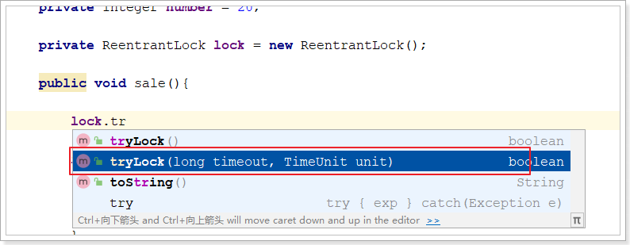


**一个死锁的例子：**

```java
package com.atguigu.demojuc.chap02;

public class DeadlockDemo {

    private static final Object lock1 = new Object();
    private static final Object lock2 = new Object();

    public static void main(String[] args) {

        new Thread(() -> {
            synchronized (lock1) {
                System.out.println("Thread 1: Holding lock 1...");
                try {
                    Thread.sleep(500); // Simulate some work
                } catch (InterruptedException e) {
                    e.printStackTrace();
                }
                System.out.println("Thread 1: Waiting for lock 2...");
                synchronized (lock2) {
                    System.out.println("Thread 1: Both locks acquired.");
                }
            }
        }).start();

        new Thread(() -> {
            synchronized (lock2) {
                System.out.println("Thread 2: Holding lock 2...");
                try {
                    Thread.sleep(500); // Simulate some work
                } catch (InterruptedException e) {
                    e.printStackTrace();
                }
                System.out.println("Thread 2: Waiting for lock 1...");
                synchronized (lock1) {
                    System.out.println("Thread 2: Both locks acquired.");
                }
            }
        }).start();

    }
}
```


**使用ReentrantLock解决死锁问题：**

```java
package com.atguigu.demojuc.chap02;

import java.util.concurrent.locks.ReentrantLock;

public class DeadlockDemo2 {

    private static ReentrantLock lock1 = new ReentrantLock();
    private static ReentrantLock lock2 = new ReentrantLock();

    public static void main(String[] args) {

        new Thread(() -> {

            boolean result1 = lock1.tryLock();
            if (result1){
                try {
                    System.out.println("Thread 1: Holding lock 1...");
                    try {
                        Thread.sleep(500); // Simulate some work
                    } catch (InterruptedException e) {
                        e.printStackTrace();
                    }

                    System.out.println("Thread 1: Waiting for lock 2...");

                    boolean result2 = lock2.tryLock();
                    if(result2){
                        try {
                            System.out.println("Thread 1: Both locks acquired.");
                        } finally {
                            lock2.unlock();
                        }
                    }else {
                        System.out.println("Thread 1: 未获取到锁2");
                    }
                }finally {
                    lock1.unlock();
                }
            }else{
                System.out.println("Thread 1: 未获取到锁1");
            }
        }).start();

        new Thread(() -> {

            boolean result2 = lock2.tryLock();

            if(result2){
                try {

                    System.out.println("Thread 2: Holding lock 2...");
                    try {
                        Thread.sleep(500); // Simulate some work
                    } catch (InterruptedException e) {
                        e.printStackTrace();
                    }
                    System.out.println("Thread 2: Waiting for lock 1...");


                    boolean result1 = lock1.tryLock();
                    if(result1){
                        try {
                            System.out.println("Thread 2: Both locks acquired.");
                        } finally {
                            lock1.unlock();
                        }
                    }else {
                        System.out.println("Thread 2: 未获取到锁1");
                    }
                }finally {
                    lock2.unlock();
                }
            }else{
                System.out.println("Thread 2: 未获取到锁2");
            }

        }).start();

    }
}
```


### 2.1.4. ReentrantLock和synchronized区别

（1）synchronized是`独占锁`，加锁和解锁的过程自动进行，易于操作，但不够灵活。ReentrantLock也是`独占锁`，加锁和解锁的过程需要手动进行，不易操作，但非常灵活。
 
（2）synchronized可重入，因为加锁和解锁自动进行，不必担心最后是否释放锁；ReentrantLock也可重入，但加锁和解锁需要手动进行，且次数需一样，否则其他线程无法获得锁。

（3）synchronized不可响应中断，一个线程获取不到锁就一直等着；ReentrantLock可以响应中断。

（4）synchronized不具备设置公平锁的特点，ReentrantLock可以成为公平锁。


## 2.2. ReentrantReadWriteLock读写锁

在并发场景中用于解决线程安全的问题，我们几乎会高频率的使用到`独占式锁`，通常使用java提供的关键字synchronized或者concurrents包中实现了Lock接口的ReentrantLock。它们都是独占式获取锁，也就是在同一时刻只有一个线程获取锁。而在一些业务场景中，`大部分只是读数据，写数据很少`，如果仅仅是读数据的话并不会影响数据正确性，而如果在这种业务场景下，依然使用独占锁的话，很显然这将是出现性能瓶颈的地方。针对这种读多写少的情况，java还提供了另外一个实现Lock接口的`ReentrantReadWriteLock`(读写锁)。`读写锁允许同一时刻被多个读线程访问，但是在写线程访问时，所有的读线程和其他的写线程都会被阻塞。`

读写锁的特点：

1. 写写不可并发
2. 读写不可并发
3. 读读可以并发


### 2.2.1. 读写问题

接下来以缓存为例用代演示读写锁，重现问题：

```java
package com.atguigu.demojuc.chap02;

class MyCache{

    private Map<String, String> cache= new HashMap<>();

    //只有一个读线程一个写线程的时候加synchronized锁是有用的，但是如果有并发线程，那么synchronized就不起作用了
    
    //写
    public synchronized void put(String key, String value){
        try {
            System.out.println(Thread.currentThread().getName() + " 开始写入！");
            Thread.sleep(300);
            cache.put(key, value);
            System.out.println(Thread.currentThread().getName() + " 写入成功！");
        } catch (InterruptedException e) {
            e.printStackTrace();
        }
    }

    //读
    public synchronized void get(String key){
        try {
            System.out.println(Thread.currentThread().getName() + " 开始读出！");
            Thread.sleep(300);
            String value = cache.get(key);
            System.out.println(Thread.currentThread().getName() + " 读出成功！" + value);
        } catch (InterruptedException e) {
            e.printStackTrace();
        }
    }
}

public class ReentrantReadWriteLockDemo {

    public static void main(String[] args) {

        MyCache cache = new MyCache();

        for (int i = 1; i <= 5; i++) {
            String num = String.valueOf(i);
            // 开启5个写线程
            new Thread(()->{
                cache.put(num, num);
            }, num).start();
        }

        for (int i = 1; i <= 5; i++) {
            String num = String.valueOf(i);
            // 开启5个读线程
            new Thread(()->{
                cache.get(num);
            }, num).start();
        }
    }
}
```


打印结果：如果偶尔不出现问题，多测试几次


### 2.2.2. 读写锁的使用
改造MyCache，加入读写锁：
```java
class MyCache{

    // 加入读写锁
    ReentrantReadWriteLock rwlock = new ReentrantReadWriteLock();

    private Map<String, String> cache= new HashMap<>();

    public void put(String key, String value){

        // 加写锁
        rwlock.writeLock().lock();

        try {
            System.out.println(Thread.currentThread().getName() + " 开始写入！");
            Thread.sleep(300);
            cache.put(key, value);
            System.out.println(Thread.currentThread().getName() + " 写入成功！");
        } catch (InterruptedException e) {
            e.printStackTrace();
        } finally {
            // 释放写锁
            rwlock.writeLock().unlock();
        }
    }

    public void get(String key){
        // 加入读锁
        rwlock.readLock().lock();
        try {
            System.out.println(Thread.currentThread().getName() + " 开始读出！");
            Thread.sleep(300);
            String value = cache.get(key);
            System.out.println(Thread.currentThread().getName() + " 读出成功！" + value);
        } catch (InterruptedException e) {
            e.printStackTrace();
        }finally {
            // 释放读锁
            rwlock.readLock().unlock();
        }
    }
}
```


### 2.2.3. 锁降级

这里可以举个例子：`在当前线程拥有写锁的情况下，获取到读锁，随后释放写锁的过程就是锁降级`。

```java
public void test(){
    rwlock.writeLock().lock();
    System.out.println("获取到写锁。。。。");
    rwlock.readLock().lock();
    System.out.println("获取到读锁----------");
    rwlock.writeLock().unlock();
    System.out.println("释放写锁==============");
    rwlock.readLock().unlock();
    System.out.println("释放读锁++++++++++++++++");
}
```

打印效果：


锁降级是一种多线程编程中的一种锁策略，它指的是在持有某个锁的同时，降低该锁的粒度，也就是将一个较大粒度的锁替换为一个较小粒度的锁。这通常是为了减少锁的竞争，提高程序的并发性能。

锁降级的典型场景是在持有某个写锁时，释放写锁并获取读锁。这样做的好处是在执行读操作期间，其他线程可以同时执行读操作，提高了并发性能。


在这个例子中，我们首先创建了一个`LockDowngradingDemo`对象，并启动了一个写线程（writerThread）和一个读线程（readerThread）。写线程首先获取写锁，更新数据，然后将锁降级为读锁。读线程在获取读锁后读取数据。这个过程演示了锁降级的概念，允许多个线程在持有读锁的情况下同时访问数据，提高了并发性能。`请注意，在锁降级期间，我们要确保数据的一致性，即在降级为读锁之前和之后都可以正确读取数据。这是锁降级的关键部分。（先获取读锁，再释放写锁）`

```java
package com.atguigu.demojuc.chap02;

public class LockDowngradingDemo {

    private final ReentrantReadWriteLock rwLock = new ReentrantReadWriteLock();
    private final Lock readLock = rwLock.readLock();
    private final Lock writeLock = rwLock.writeLock();
    private int data = 0;

    public int readData() {
        readLock.lock();
        try {
            return data;
        } finally {
            readLock.unlock();
        }
    }

    public void updateData(int newData) {
        writeLock.lock();
        try {
            data = newData; // 更新数据
            System.out.println("Data updated to: " + newData);

            // 锁降级
            readLock.lock(); // 获取读锁
            System.out.println("Lock downgraded to read lock.");
        } finally {
            writeLock.unlock(); // 释放写锁
        }

        try {
            // 在持有读锁的情况下执行其他操作
            int currentData = readData();
            System.out.println("Read data: " + currentData);
        } finally {
            readLock.unlock(); // 释放读锁
        }
    }

    /**
     * @param args
     */
    public static void main(String[] args) {

        LockDowngradingDemo example = new LockDowngradingDemo();

        new Thread(() -> {
            example.updateData(42);
        }).start();

        new Thread(() -> {
            int currentData = example.readData();
            System.out.println("Reader got data: " + currentData);
        }).start();
    }
}
```


### 2.2.4. 读写锁总结

1. 支持公平/非公平策略

   

2. 支持可重入
   - 同一读线程在获取了读锁后还可以获取读锁
   - 同一写线程在获取了写锁之后既可以再次获取写锁又可以获取读锁
   - 同一读线程在获取了读锁后**不可以**获取读锁

   

3. 支持锁降级，不支持锁升级

4. 读写锁如果使用不当，很容易产生“饥饿”问题：

   在读线程非常多，写线程很少的情况下，很容易导致写线程“饥饿”，虽然使用“公平”策略可以一定程度上缓解这个问题，但是“公平”策略是以牺牲系统吞吐量为代价的。

> 锁饥饿（Lock Starvation）是指在多线程编程中的一种情况，其中某些线程可能无法获得所需的锁，而一直等待下去，从而无法继续执行，即线程被"饿死"在等待锁的过程中。这可能会导致应用程序的性能问题和不稳定性。


# 3. 线程间通信

**面试题**两个线程，一个线程打印1-52，另一个打印字母A-Z打印顺序为12A34B...5152Z，要求用线程间通信


## 3.1. 回顾线程通信
**简单案例：**
两个线程操作一个初始值为0的变量，实现一个线程对变量增加1，一个线程对变量减少1，交替10轮。
**线程间通信模型：**
1. 生产者+消费者
2. 通知等待唤醒机制
**多线程编程模板：**
1. 判断
2. 干活
3. 通知

代码实现：

```java
package com.atguigu.demojuc.chap03;

class ShareDataOne{
    private Integer number = 0;

    /**
     *  增加1
     */
    public synchronized void increment() throws InterruptedException {
        // 1. 判断
        if (number != 0) {
            this.wait();// 进入等待状态
        }

        // 2. 干活
        number++;
        System.out.println(Thread.currentThread().getName() + ": " + number);

        // 3. 通知
        this.notifyAll(); // 通知其他线程（唤醒其他线程）
    }

    /**
     * 减少1
     */
    public synchronized void decrement() throws InterruptedException {
        // 1. 判断
        if (number != 1) {
            this.wait();
        }

        // 2. 干活
        number--;
        System.out.println(Thread.currentThread().getName() + ": " + number);

        // 3. 通知
        this.notifyAll();
    }
}

/**
 * 现在两个线程，
 * 可以操作初始值为零的一个变量，
 * 实现一个线程对该变量加1，一个线程对该变量减1，
 * 交替，10轮。
 *
 * 笔记：Java里面如何进行工程级别的多线程编写
 * 1 多线程变成模板（套路）
 *    1.1  线程    操作    资源类
 *    1.2  高内聚  低耦合
 * 2 多线程变成模板（套路）
 *    2.1  判断
 *    2.2  干活
 *    2.3  通知
 */
public class NotifyWaitDemo {

    public static void main(String[] args) {
        ShareDataOne shareDataOne = new ShareDataOne();

        new Thread(()->{
            for (int i = 0; i < 10; i++) {
                try {
                    shareDataOne.increment();
                } catch (InterruptedException e) {
                    e.printStackTrace();
                }
            }
        }, "AAA").start();

        new Thread(()->{
            for (int i = 0; i < 10; i++) {
                try {
                    shareDataOne.decrement();
                } catch (InterruptedException e) {
                    e.printStackTrace();
                }
            }
        }, "BBB").start();

    }
}
```

部分打印结果：AAA和BBB交互执行，执行结果是1 0 1 0... 一共10轮

```
AAA: 1
BBB: 0
AAA: 1
BBB: 0
AAA: 1
BBB: 0
AAA: 1
BBB: 0
。。。。
```


**如果换成4个线程会怎样？**

改造mian方法，加入CCC和DDD两个线程：

```java
public class NotifyWaitDemo {

    public static void main(String[] args) {
        ShareDataOne shareDataOne = new ShareDataOne();

        new Thread(()->{
            for (int i = 0; i < 10; i++) {
                try {
                    shareDataOne.increment();//+1
                } catch (InterruptedException e) {
                    e.printStackTrace();
                }
            }
        }, "AAA").start();

        new Thread(()->{
            for (int i = 0; i < 10; i++) {
                try {
                    shareDataOne.decrement();//-1
                } catch (InterruptedException e) {
                    e.printStackTrace();
                }
            }
        }, "BBB").start();

        new Thread(()->{
            for (int i = 0; i < 10; i++) {
                try {
                    shareDataOne.increment();//+1
                } catch (InterruptedException e) {
                    e.printStackTrace();
                }
            }
        }, "CCC").start();

        new Thread(()->{
            for (int i = 0; i < 10; i++) {
                try {
                    shareDataOne.decrement();//-1
                } catch (InterruptedException e) {
                    e.printStackTrace();
                }
            }
        }, "DDD").start();

    }
}
```

打印结果，依然会有概率是，10101010...。

但是，多执行几次，也会出现错乱的现象：

```
AAA: 1
BBB: 0
CCC: 1
AAA: 2
CCC: 3
BBB: 2
CCC: 3
DDD: 2
AAA: 3
DDD: 2
CCC: 3
BBB: 2
```


## 3.2. 虚假唤醒

换成4个线程会导致错误，**虚假唤醒**

**原因**在java多线程判断时，不能用if，程序出事出在了判断上面。

**注意**消费者被唤醒后是从wait()方法（被阻塞的地方）后面执行，而不是重新从同步块开头。


如下图： 出现-1的情况分析！


解决虚假唤醒：查看API，java.lang.Object的wait方法

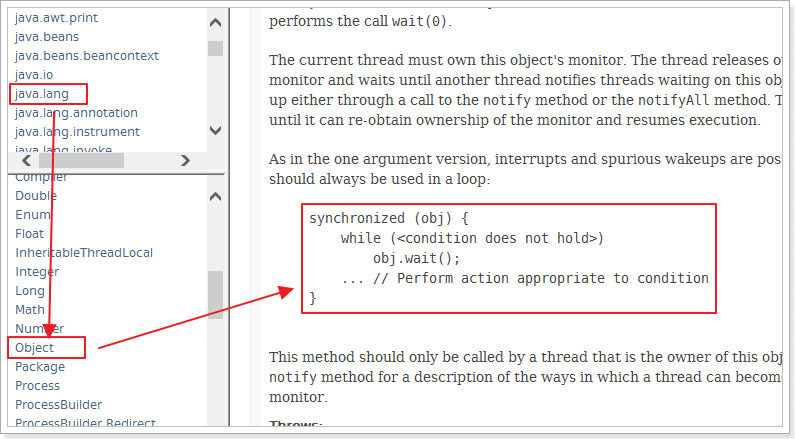

中断和虚假唤醒是可能产生的，所以要用循环，if只判断一次，while是只要唤醒就要重新再判断一次。

**if换成while**

```java
// 1. 判断
while (number != 0) {
    this.wait();
}

// 1. 判断
while (number != 1) {
    this.wait();
}
```

再次测试，完美解决
## 3.3. 线程通信（Condition）

对标synchronized：

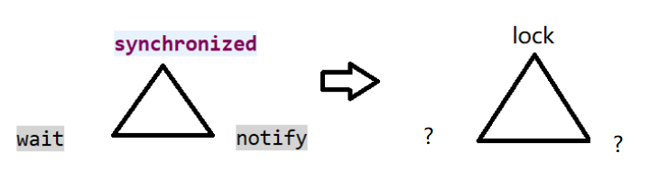

Condition：查看API，java.util.concurrent.locks


并提供了实现案例：


使用Condition实现线程通信，改造之前的代码：

**只需要改造ShareDataOne：注意要删掉increment和decrement方法的synchronized**

```java
class ShareDataOne{
    private Integer number = 0;

    final Lock lock = new ReentrantLock(); // 初始化lock锁
    final Condition condition = lock.newCondition(); // 初始化condition对象

    /**
     *  增加1
     */
    public void increment() throws InterruptedException {

        lock.lock(); // 加锁

        try{
            // 1. 判断
            while (number != 0) {
                // this.wait();
                condition.await();
            }

            // 2. 干活
            number++;
            System.out.println(Thread.currentThread().getName() + ": " + number);

            // 3. 通知
            // this.notifyAll();
            condition.signalAll(); //唤醒所有等待的线程
        } catch (InterruptedException e) {
            e.printStackTrace();
        } finally {
            lock.unlock();
        }
    }

    /**
     * 减少1
     */
    public void decrement() throws InterruptedException {

        lock.lock(); // 加锁

        try{

            // 1. 判断
            while (number != 1) {
                // this.wait();
                condition.await();
            }

            // 2. 干活
            number--;
            System.out.println(Thread.currentThread().getName() + ": " + number);

            // 3. 通知
            // this.notifyAll();
            condition.signalAll(); //唤醒所有等待的线程
        } catch (InterruptedException e) {
            e.printStackTrace();
        } finally {
            lock.unlock();
        }
    }
}
```


```java
condition.signal(); // 唤醒一个等待的线程    
condition.signalAll();  //唤醒所有等待的线程
```


## 3.4. 定制化调用通信

案例：

​		多线程之间按顺序调用，实现AA->BB->CC。三个线程启动，要求如下：

​		AA打印5次，BB打印10次，CC打印15次

​		接着

​		AA打印5次，BB打印10次，CC打印15次

​		。。。打印10轮


分析实现方式：

1. 有一个锁Lock，3把钥匙Condition
2. 有顺序通知（切换线程），需要有标识位
3. 判断标志位
4. 输出线程名 + 内容
5. 修改标识符，通知下一个


具体实现：

 

内容：

```java
class ShareDataTwo {

    private Integer flag = 1; // 线程标识位，通过它区分线程切换
    private final Lock lock = new ReentrantLock();
    private final Condition condition1 = lock.newCondition();
    private final Condition condition2 = lock.newCondition();
    private final Condition condition3 = lock.newCondition();

    public void print5() {
        lock.lock();
        try {
            while (flag != 1) {
                condition1.await();
            }
            for (int i = 0; i < 5; i++) {
                System.out.println(Thread.currentThread().getName() + "\t" + (i + 1));
            }
            flag = 2;
            condition2.signal();
        } catch (Exception e) {
            e.printStackTrace();
        } finally {
            lock.unlock();
        }
    }
    
    public void print10() {
        lock.lock();
        try {
            while (flag != 2) {
                condition2.await();
            }
            for (int i = 0; i < 10; i++) {
                System.out.println(Thread.currentThread().getName() + "\t" + (i + 1));
            }
            flag = 3;
            condition3.signal();
        } catch (Exception e) {
            e.printStackTrace();
        } finally {
            lock.unlock();
        }
    }
    
    public void print15() {
        lock.lock();
        try {
            while (flag != 3) {
                condition3.await();
            }
            for (int i = 0; i < 15; i++) {
                System.out.println(Thread.currentThread().getName() + "\t" + (i + 1));
            }
            flag = 1;
            condition1.signal();
        } catch (Exception e) {
            e.printStackTrace();
        } finally {
            lock.unlock();
        }
    }
}

/**
 * 多线程之间按顺序调用，实现A->B->C
 * 三个线程启动，要求如下：
 * AA打印5次，BB打印10次，CC打印15次
 * 接着
 * AA打印5次，BB打印10次，CC打印15次
 * ......来10轮
 */
public class ThreadOrderAccess {

    public static void main(String[] args) {

        ShareDataTwo sdt = new ShareDataTwo();

        new Thread(()->{
            for (int i = 0; i < 10; i++) {
                sdt.print5();
            }
        }, "AAA").start();
        new Thread(()->{
            for (int i = 0; i < 10; i++) {
                sdt.print10();
            }
        }, "BBB").start();
        new Thread(()->{
            for (int i = 0; i < 10; i++) {
                sdt.print15();
            }
        }, "CCC").start();
    }
}
```


在Java中，一个`ReentrantLock`可以与多个`Condition`对象一起使用，每个`Condition`对象可以用于不同的线程协调和通信场景，以便更精细地控制多线程之间的执行顺序和互斥访问。


# 4. 并发容器类

**面试题**请举例说明集合类是不安全的。


## 4.1. 重现线程不安全：List

首先以List作为演示对象，创建多个线程，对List接口的常用实现类ArrayList进行add操作。


内容：

```java
package com.atguigu.demojuc.chap04;

public class NotSafeDemo {

    public static void main(String[] args) {

        List<String> list = new ArrayList<>();

        for (int i = 0; i < 100; i++) {
            new Thread(()->{
                list.add(UUID.randomUUID().toString().substring(0, 8));//线程不安全
                System.out.println(list);//调用了ArrayList的迭代方法
            }, String.valueOf(i)).start();
        }
    }
}
```


测试结果：**出现了线程不安全错误**


ArrayList在多个线程同时对其进行修改的时候，就会抛出`java.util.ConcurrentModificationException异常（并发修改异常）`，因为ArrayList的add及其他方法都是线程不安全的，有源码佐证：


**解决方案：**

List接口有很多实现类，除了常用的ArrayList之外，还有Vector和SynchronizedList。

 

他们都有synchronized关键字，说明都是线程安全的。


改用Vector或者synchronizedList试试：

```java
    public static void main(String[] args) {

        //List<String> list = new Vector<>();
        List<String> list = Collections.synchronizedList(new ArrayList<>());

        for (int i = 0; i < 200; i++) {
            new Thread(()->{
                list.add(UUID.randomUUID().toString().substring(0, 8));
                System.out.println(list);
            }, String.valueOf(i)).start();
        }
    }
```

即可解决！
**Vector和Synchronized的缺点：**
- Vector：内存消耗比较大，适合一次增量比较大的情况（Vector每次扩容是原来容量的一倍，ArrayList是原来的1.5倍）
- SynchronizedList：迭代器涉及的代码没有加上线程同步代码

```java
//Vector：读取加锁！
public synchronized ListIterator<E> listIterator() {
	return new ListItr(0);
}
//synchronizedList： 读取数据：读取数据没有加锁！
public ListIterator<E> listIterator() {
	return list.listIterator(); // Must be manually synched by user
}
```


## 4.2. CopyOnWrite容器

什么是CopyOnWrite容器

**CopyOnWrite容器**（简称COW容器）即**写时复制**的容器。通俗的理解是当我们往一个容器添加元素的时候，不直接往当前容器添加，而是先将当前容器进行Copy，复制出一个新的容器，然后新的容器里添加元素，添加完元素之后，再将原容器的引用指向新的容器。这样做的好处是我们可以对CopyOnWrite容器进行并发的读，而不需要加锁，因为当前容器不会添加任何元素。所以`CopyOnWrite容器也是一种读写分离的思想，读和写不同的容器`。


从JDK1.5开始Java并发包里提供了两个使用CopyOnWrite机制实现的并发容器,它们是`CopyOnWriteArrayList`和`CopyOnWriteArraySet`。

先看看CopyOnWriteArrayList类：发现它的本质就是数组


再来看看CopyOnWriteArrayList的add方法：发现该方法是线程安全的

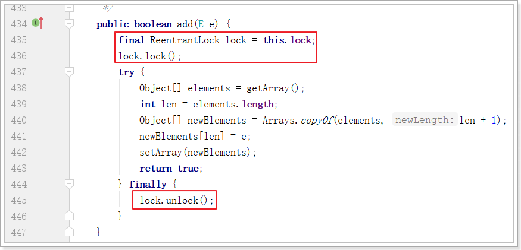

使用CopyOnWriteArrayList改造main方法：

```java
    public static void main(String[] args) {

        //List<String> list = new Vector<>();
        //List<String> list = Collections.synchronizedList(new ArrayList<>());
        List<String> list = new CopyOnWriteArrayList<>();

        for (int i = 0; i < 200; i++) {
            new Thread(()->{
                list.add(UUID.randomUUID().toString().substring(0, 8));
                System.out.println(list);
            }, String.valueOf(i)).start();
        }
    }
```


`CopyOnWrite并发容器用于读多写少的并发场景`。比如：白名单，黑名单。假如我们有一个搜索网站，用户在这个网站的搜索框中，输入关键字搜索内容，但是某些关键字不允许被搜索。这些不能被搜索的关键字会被放在一个黑名单当中，黑名单一定周期才会更新一次。


**缺点：**

1. 内存占用问题。写的时候会创建新对象添加到新容器里，而旧容器的对象还在使用，所以有两份对象内存。
2. 数据一致性问题。CopyOnWrite容器只能保证数据的最终一致性，不能保证数据的实时一致性。所以如果你希望写入的数据，马上能读到，请不要使用CopyOnWrite容器。


## 4.3. 扩展类比：Set和Map

HashSet和HashMap也都是线程不安全的，类似于ArrayList，也可以通过代码证明。

```java

private static void notSafeSet() {
    Set<String> set = new HashSet<>();

    for (int i = 0; i < 30; i++) {
        new Thread(()->{
            set.add(UUID.randomUUID().toString().substring(0, 8));
            System.out.println(set);
        }, String.valueOf(i)).start();
    }
}

private static void notSafeMap() {
    Map<String, String> map = new HashMap<>();

    for (int i = 0; i < 30; i++) {
        new Thread(()->{
            map.put(String.valueOf(Thread.currentThread().getName()), UUID.randomUUID().toString().substring(0, 8));
            System.out.println(map);
        }, String.valueOf(i)).start();
    }
}
```

都会报：ConcurrentModificationException异常信息。


Collections提供了方法synchronizedList保证list是同步线程安全的，Set和Map呢？


JUC提供的CopyOnWrite容器实现类有：CopyOnWriteArrayList和CopyOnWriteArraySet。


## 4.4、ConcurrentHashMap

有没有Map的实现：


**ConcurrentHashMap的特点：**

1. **并发性**：`ConcurrentHashMap` 允许多个线程同时访问，读操作不会被阻塞，不需要加锁。这意味着多个线程可以并发地读取其中的数据，而不会发生竞争或锁定。
2. **分段锁**：`ConcurrentHashMap` 内部使用了分段锁（Segment Locking）的技术，将哈希表分成多个段（Segment），每个段拥有自己的锁。这种设计允许多个线程同时进行读操作，只有在写操作时才需要锁定相应的段，以确保线程安全。这提高了并发性能，因为不同段之间的操作不会相互阻塞。

总之，`ConcurrentHashMap` 是一个用于高并发环境的非常有用的数据结构，它提供了高效的并发访问支持，允许多个线程同时读取和写入数据，而不需要显式的锁定。这使得它在并发编程中非常有价值，特别是在需要高效地处理共享数据的情况下。


**最终实现：**

```java
package com.atguigu.demojuc.chap04;

public class NotSafeDemo {

    public static void main(String[] args) {
        notSafeList();
        notSafeSet();
        notSafeMap();
    }

    private static void notSafeMap() {
        //Map<String, String> map = new HashMap<>();
        //Map<String, String> map = Collections.synchronizedMap(new HashMap<>());
        Map<String, String> map = new ConcurrentHashMap<>();//加入了分段锁

        for (int i = 0; i < 100; i++) {
            new Thread(()->{
                map.put(String.valueOf(Thread.currentThread().getName()), UUID.randomUUID().toString().substring(0, 8));
                System.out.println(map);
            }, String.valueOf(i)).start();
        }
    }

    private static void notSafeSet() {
        //Set<String> set = new HashSet<>();
        //Set<String> set = Collections.synchronizedSet(new HashSet<>());
        Set<String> set = new CopyOnWriteArraySet<>();

        for (int i = 0; i < 100; i++) {
            new Thread(()->{
                set.add(UUID.randomUUID().toString().substring(0, 8));
                System.out.println(set);
            }, String.valueOf(i)).start();
        }
    }

    private static void notSafeList() {
        //List<String> list = new ArrayList<>();
        //List<String> list = new Vector<>();
        //List<String> list = Collections.synchronizedList(new ArrayList<>());
        List<String> list = new CopyOnWriteArrayList<>();

        for (int i = 0; i < 100; i++) {
            new Thread(()->{
                list.add(UUID.randomUUID().toString().substring(0, 8));
                System.out.println(list);
            }, String.valueOf(i)).start();
        }
    }
}
```


# 5. JUC强大的辅助类

JUC的多线程辅助类非常多，这里我们介绍三个：

1. CountDownLatch（倒计数器）
2. CyclicBarrier（循环栅栏）
3. Semaphore（信号量）


## 5.1. CountDownLatch

CountDownLatch是一个非常实用的多线程控制工具类，应用非常广泛。

例如：在手机上安装一个应用程序，假如需要5个子线程检查服务授权，那么主线程会维护一个计数器，初始计数就是5。用户每同意一个授权该计数器减1，当计数减为0时，主线程才启动，否则就只有阻塞等待了。

CountDownLatch中count down是倒数的意思，latch则是门闩的含义。整体含义可以理解为倒数的门栓，似乎有一点“三二一，芝麻开门”的感觉。CountDownLatch的作用也是如此。

常用的就下面几个方法：

```java
new CountDownLatch(int count) //实例化一个倒计数器，count指定初始计数
countDown() // 每调用一次，计数减一
await() //等待，当计数减到0时，阻塞线程（可以是一个，也可以是多个）并行执行
```


案例：6个同学陆续离开教室后值班同学才可以关门。

 

```java
package com.atguigu.demojuc.chap05;

public class CountDownLatchDemo {

    /**
     * main方法也是一个进程，在这里是主进程，即上锁的同学
     *
     * @param args
     */
    public static void main(String[] args) throws InterruptedException {

        // 初始化计数器，初始计数为6
        CountDownLatch countDownLatch = new CountDownLatch(6);

        for (int i = 0; i < 6; i++) {
            new Thread(()->{
                try {
                    // 每个同学墨迹几秒钟
                    TimeUnit.SECONDS.sleep(new Random().nextInt(5));
                    System.out.println(Thread.currentThread().getName() + " 同学出门了");
                    // 调用countDown()计算减1
                    countDownLatch.countDown();
                } catch (InterruptedException e) {
                    e.printStackTrace();
                }
            }, String.valueOf(i)).start();
        }

        // 调用计算器的await方法，等待6位同学都出来
        countDownLatch.await();

        System.out.println("值班同学锁门了");
    }
}
```

打印结果：

```
同学3 出来了
同学1 出来了
同学0 出来了
同学2 出来了
同学5 出来了
同学4 出来了
值班同学锁门了
```


**面试：**CountDownLatch 与 join 方法的区别

调用一个子线程的 `join()`方法后，该线程会`一直被阻塞直到该线程运行完毕`。 CountDownLatch 则使用计数器允许子线程运行完毕或者运行中时候递减计数，也就是 `CountDownLatch 可以在子线程运行任何时候让 await 方法返回`而不一定必须等到线程结束；countDownLatch 相比 Join 方法让我们对线程同步有更灵活的控制。


使用join实现上面功能的代码案例：

```java
package com.atguigu.demojuc.chap05;

public class JoinDemo {

    /**
     * main方法也是一个进程，在这里是主进程，即上锁的同学
     *
     * @param args
     */
    public static void main(String[] args) throws InterruptedException {

        Runnable runnable = () -> {
            try {
                // 每个同学墨迹几秒钟
                TimeUnit.SECONDS.sleep(new Random().nextInt(5));
                System.out.println(Thread.currentThread().getName() + " 同学出门了");
            } catch (InterruptedException e) {
                e.printStackTrace();
            }
        };


        Thread t1 = new Thread(runnable);
        t1.start();

        Thread t2 = new Thread(runnable);
        t2.start();

        Thread t3 = new Thread(runnable);
        t3.start();

        Thread t4 = new Thread(runnable);
        t4.start();

        Thread t5 = new Thread(runnable);
        t5.start();

        Thread t6 = new Thread(runnable);
        t6.start();

        //子线程并入主线程
        t1.join();
        t2.join();
        t3.join();
        t4.join();
        t5.join();
        t6.join();

        System.out.println("值班同学锁门了");
    }
}
```


## 5.2. CyclicBarrier

从字面上的意思可以知道，这个类的中文意思是“循环栅栏”。大概的意思就是一个可循环利用的屏障。是 Java 中用于多线程编程的同步工具之一，它的主要作用是在`多个线程相互等待达到某个共同点之后再一起继续执行`。CyclicBarrier 是一个同步辅助类，通常用于协调多个线程之间的任务分配和执行。

常用方法：

1. CyclicBarrier(int parties, Runnable barrierAction) 创建一个CyclicBarrier实例，parties指定参与相互等待的线程数，barrierAction一个可选的Runnable命令，该参数只在每个屏障点运行一次，可以在执行后续业务之前共享状态。该操作由最后一个进入屏障点的线程执行。
2. CyclicBarrier(int parties) 创建一个CyclicBarrier实例，parties指定参与相互等待的线程数。
3. await() 该方法被调用时表示当前线程已经到达屏障点，当前线程阻塞进入休眠状态，`直到所有线程都到达屏障点`，当前线程才会被唤醒。

案例：组队打boss过关卡游戏。

 

```java
package com.atguigu.demojuc.chap05;

public class CyclicBarrierDemo {

    public static void main(String[] args) {

        CyclicBarrier cyclicBarrier = new CyclicBarrier(3, () -> {

            System.out.println(Thread.currentThread().getName() + " 所有人过关了");
            System.out.println("------------------------");
        });

        for (int i = 0; i < 3; i++) {
            new Thread(()->{
                try {
                    System.out.println(Thread.currentThread().getName() + " 开始第一关");
                    TimeUnit.SECONDS.sleep(new Random().nextInt(4));
                    System.out.println(Thread.currentThread().getName() + " 通过第一关");
                    cyclicBarrier.await();

                    System.out.println(Thread.currentThread().getName() + " 开始第二关");
                    TimeUnit.SECONDS.sleep(new Random().nextInt(4));
                    System.out.println(Thread.currentThread().getName() + " 通过第二关");
                    cyclicBarrier.await();

                    System.out.println(Thread.currentThread().getName() + " 开始第三关");
                    TimeUnit.SECONDS.sleep(new Random().nextInt(4));
                    System.out.println(Thread.currentThread().getName() + " 通过第三关");
                    cyclicBarrier.await();

                } catch (Exception e) {
                    e.printStackTrace();
                }
            }, String.valueOf(i)).start();
        }
    }
}
```


输出：

```
0 开始第一关
1 开始第一关
2 开始第一关
0 通过第一关
2 通过第一关
1 通过第一关
1 所有人过关了
------------------------
1 开始第二关
0 开始第二关
2 开始第二关
2 通过第二关
1 通过第二关
0 通过第二关
0 所有人过关了
------------------------
0 开始第三关
2 开始第三关
2 通过第三关
1 开始第三关
1 通过第三关
0 通过第三关
0 所有人过关了
------------------------
```

**注意：所有的"过关了"都是由最后到达await方法的线程执行打印的**


**面试：**CyclicBarrier和CountDownLatch的区别？

- CountDownLatch允许一个或多个线程等待一组事件的产生，而CyclicBarrier用于等待其他线程运行到栅栏位置
- CountDownLatch的计数器只能使用一次，而CyclicBarrier的计数器可以使用多次
- 所以CyclicBarrier能够处理更为复杂的场景


## 5.3. Semaphore

Semaphore翻译成字面意思为 信号量，Semaphore可以控制同时访问的线程个数。非常适合需求量大，而资源又很紧张的情况。比如给定一个资源数目有限的资源池，假设资源数目为N，每一个线程均可获取一个资源，但是当资源分配完毕时，后来线程需要阻塞等待，直到前面已持有资源的线程释放资源之后才能继续。

**常用方法：**

```java
public Semaphore(int permits) // 构造方法，permits指资源数目（信号量）
public void acquire() throws InterruptedException // 占用资源，当一个线程调用acquire操作时，它要么通过成功获取信号量（信号量减1），要么一直等下去，直到有线程释放信号量，或超时。
public void release() // （释放）实际上会将信号量的值加1，然后唤醒等待的线程。
```


信号量主要用于两个目的：

1. 多个共享资源的互斥使用。
2. 用于并发线程数的控制。保护一个关键部分不要一次输入超过N个线程。`（限流）`


**案例：**6辆车抢占3个车位

 

```java
public class SemaphoreDemo {

    public static void main(String[] args) {
        // 初始化信号量，3个车位
        Semaphore semaphore = new Semaphore(3);

        // 6个线程，模拟6辆车
        for (int i = 0; i < 6; i++) {
            new Thread(()->{
                try {
                    // 抢占一个停车位
                    semaphore.acquire();
                    System.out.println(Thread.currentThread().getName() + " 抢到了一个停车位！！");

                    // 停一会儿车
                    TimeUnit.SECONDS.sleep(new Random().nextInt(10));

                    // 开走，释放一个停车位
                    System.out.println(Thread.currentThread().getName() + " 离开停车位！！");
                    semaphore.release();

                } catch (InterruptedException e) {
                    e.printStackTrace();
                }
            }, String.valueOf(i)).start();
        }
    }
}
```

打印结果：

```
0 抢到了一个停车位！！
1 抢到了一个停车位！！
2 抢到了一个停车位！！
1 离开停车位！！
3 抢到了一个停车位！！
2 离开停车位！！
4 抢到了一个停车位！！
0 离开停车位！！
5 抢到了一个停车位！！
5 离开停车位！！
3 离开停车位！！
4 离开停车位！！
```


# 6. Callable接口

`Thread类、Runnable接口`使得多线程编程简单直接。

但Thread类和Runnable接口都`不允许声明检查型异常`，`也不能定义返回值`。没有返回值这点稍微有点麻烦。不能声明抛出检查型异常则更麻烦一些。

以上两个问题现在都得到了解决。从java5开始，提供了Callable接口，是Runable接口的增强版。`用Call()方法作为线程的执行体，增强了之前的run()方法。`因为call方法可以有返回值，也可以声明抛出异常。


## 6.1. Callable和Runable对比

先初步认识一下Callable接口：这是一个函数式接口，因此可以用作lambda表达式或方法引用的赋值对象。


具体代码实现对比：创建一个CallableDemo.java

 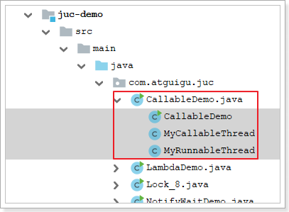

内容：

```java
class MyRunnableThread implements Runnable{
    @Override
    public void run() {

    }
}

class MyCallableThread implements Callable<Integer>{

    @Override
    public Integer call() throws Exception {
        return null;
    }
}

public class CallableDemo {

    public static void main(String[] args) {
        // 创建多线程
    }
}
```

该如何使用Callable创建Thread对象，如果使用Runnable是：

```java
public class CallableDemo {

    public static void main(String[] args) {
        // 创建多线程
        new Thread(new MyRunnableThread(), "threadName").start();
    }
}
```

现在能不能直接把MyRunnableThread换成MyCallableThread。当然不行，thread的构造方法参数需要Runnable类型的数据模型，而MyCallableThread属于Callable类型的。

那么到底怎么使用Callable创建thread对象呢？


## 6.2. Callable的使用

这里需要一个FutureTask，先认识该类，上源码：


发现：FutureTask其实可以充当了一个中间人的角色

```java
package com.atguigu.demojuc.chap06;

class MyRunnableThread implements Runnable{
    @Override
    public void run() {
        System.out.println(Thread.currentThread().getName() + " Runnable");
    }
}

/**
 * 1. 创建Callable的实现类，并重写call()方法，该方法为线程执行体，并且该方法有返回值
 */
class MyCallableThread implements Callable<Integer> {

    @Override
    public Integer call() throws Exception {
        
        int i;
        for (i = 0; i < 10; i++) {
            Thread.sleep(300);
            System.out.println(Thread.currentThread().getName() + " 执行了！" + i);
        }

        return i;
    }
}

public class CallableDemo {

    public static void main(String[] args) throws InterruptedException, ExecutionException {

        // 创建多线程
        new Thread(new MyRunnableThread(), "threadName").start();

        //new Thread(new MyCallableThread(), "threadName").start();
        // 2. 创建Callable的实例，并用FutureTask类来包装Callable对象
        // 3. 创建FutureTask对象，需要一个Callable类型的参数
        FutureTask task = new FutureTask<>(new MyCallableThread());
        // 4. 创建多线程，由于FutureTask的本质是Runnable的实现类，所以第一个参数可以直接使用task
        new Thread(task, "MyCallableThread").start();

        //取消任务
//        Thread.sleep(1000);
//        task.cancel(true); //线程运行时可以被打断吗
//        boolean cancelled = task.isCancelled();
//        System.out.println("cancelled " + cancelled);

        //等待任务执行完毕
//        while (!task.isDone()) { //也可以使用task.isDone()判断子线程是否执行完毕
//            Thread.sleep(100);
//            System.out.println("wait...");
//        }

        //获取结果
        System.out.println(task.get());//get方法阻塞主线程，因为需要返回子线程的结果
        System.out.println(Thread.currentThread().getName() + " over!");

    }
}
```


`FutureTask` 是 Java 中的一个类，它实现了 `Future` 和 `Runnable` 接口，用于表示一个可取消的异步计算任务。`FutureTask` 的主要作用是允许您在一个线程中计算结果，然后在另一个线程中获取该计算的结果，同时还支持任务的取消操作。以下是 `FutureTask` 的一些主要作用：

1. **异步计算**：`FutureTask` 允许您在一个线程中执行耗时的计算任务，而不会阻塞主线程。这对于需要执行计算密集型操作或长时间等待外部资源的应用程序非常有用，因为它可以让主线程继续执行其他任务。
2. **获取计算结果**：通过调用 `get()` 方法，您可以获取 `FutureTask` 的计算结果。如果计算尚未完成，`get()` 方法会阻塞当前线程，直到计算完成为止。
3. **取消任务**：`FutureTask` 允许您通过调用 `cancel(boolean mayInterruptIfRunning)` 方法来取消任务的执行。您可以选择是否允许在任务运行时中断任务。取消操作可以用于管理任务的生命周期和资源释放。
4. **任务状态查询**：`FutureTask` 提供了一些方法来查询任务的状态，例如 `isDone()` 用于检查任务是否已完成，`isCancelled()` 用于检查任务是否已被取消。
5. **异常处理**：如果异步任务抛出了异常，`FutureTask` 会捕获异常并在后续调用 `get()` 方法时重新抛出。这使得您可以在获取计算结果时处理可能的异常情况。

总之，`FutureTask` 是一个强大的工具，用于管理异步计算任务的执行和结果获取。它提供了异步计算、取消任务、异常处理和任务状态查询等功能，可以帮助编写更加灵活和高效的多线程应用程序。


**注意：**

1. **为了防止主线程阻塞，建议get方法放到最后**

2. **只计算一次**，FutureTask会复用之前计算过的结果

创建多个线程，会怎样？

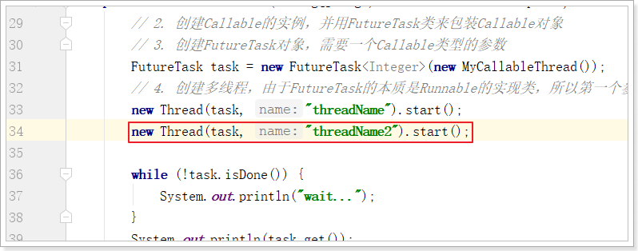

运行结果依然只有一个，就是首先执行的线程，可能是ThreadName，也可能是ThreadName2。

如果想打印threadName2的结果（重新执行call方法中的内容），怎么办？**再创建一个FutureTask对象即可。**


## 6.3. 面试题

**面试题：callable接口与runnable接口的区别？**

- 相同点：都是接口，都可以编写多线程程序，都采用Thread.start()启动线程


- 不同点：


1. 具体方法不同：一个是run，一个是call
2. Runnable没有返回值；Callable可以返回执行结果，是个泛型
3. Callable接口的call()方法允许抛出异常；Runnable的run()方法异常只能在内部消化，不能往上继续抛


**面试题：**获得多线程的方法几种？

（1）继承thread类（2）runnable接口

如果只回答这两个你连被问到juc的机会都没有 

`正确答案如下：`

- 传统的是继承thread类和实现runnable接口
- java5以后又有实现callable接口和java的线程池


# 7. 阻塞队列（BlockingQueue）

栈与队列简单回顾：

栈：先进后出，后进先出

队列：先进先出


## 7.1. 什么是BlockingQueue

在多线程领域：所谓**阻塞**，在某些情况下会**挂起线程**（即阻塞），一旦条件满足，被挂起的线程又会自动被唤起。

BlockingQueue即阻塞队列，是java.util.concurrent下的一个接口，因此不难理解，BlockingQueue是为了解决多线程中数据高效安全传输而提出的。从阻塞这个词可以看出，在某些情况下对阻塞队列的访问可能会造成阻塞。


**被阻塞的情况主要有如下两种：**

1. 当队列`满`了的时候，依然进行`入队`列操作

2. 当队列`空`了的时候，依然进行`出队`列操作


因此，当一个线程试图对一个已经满了的队列进行入队列操作时，它将会被阻塞，除非有另一个线程做了出队列操作；

同样，当一个线程试图对一个空队列进行出队列操作时，它将会被阻塞，除非有另一个线程进行了入队列操作。

**阻塞队列主要用在生产者/消费者的场景**，下面这幅图展示了一个线程生产、一个线程消费的场景：

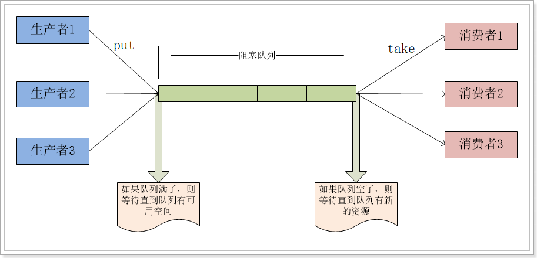


**为什么需要BlockingQueue**

多线程环境中，通过队列可以很容易实现数据共享，比如经典的“生产者”和“消费者”模型中，通过队列可以很便利地实现两者之间的数据共享。

假设我们有若干生产者线程，另外又有若干个消费者线程。如果生产者线程需要把准备好的数据共享给消费者线程，利用队列的方式来传递数据，就可以很方便地解决他们之间的数据共享问题。

但如果生产者和消费者在某个时间段内，万一发生数据处理速度不匹配的情况呢？理想情况下，`如果生产者产出数据的速度大于消费者消费的速度，并且当生产出来的数据累积到一定程度的时候，那么生产者必须暂停等待一下（阻塞生产者线程）`，以便等待消费者线程把累积的数据处理完毕，`反之亦然`。然而，在concurrent包发布以前，在多线程环境下，我们每个程序员都必须去自己控制这些细节，尤其还要兼顾效率和线程安全，而这会给我们的程序带来不小的复杂度。

`这也是我们在多线程环境下，为什么需要BlockingQueue的原因。作为BlockingQueue的使用者，我们再也不需要关心什么时候需要阻塞线程，什么时候需要唤醒线程，因为这一切BlockingQueue都给你一手包办了。`

## 7.2. 认识BlockingQueue

java.util.concurrent 包里的 BlockingQueue是一个接口，继承Queue接口，Queue接口继承 Collection。


BlockingQueue接口主要有以下7个实现类：

1. `ArrayBlockingQueue：由数组结构组成的有界阻塞队列。`使用一个固定大小的数组来存储元素。它需要在创建时指定容量，不支持动态扩展。
2. `LinkedBlockingQueue：由链表结构组成的有界阻塞队列。`使用一个链表来存储元素，它可以是无界的（未指定容量）或有界的（在创建时指定容量）。当使用无界队列时，它可以一直增长（最大值是Integer.MAX_VALUE），不会导致生产者或消费者被阻塞。对于有界队列，当队列满时，生产者会被阻塞，直到有空间可用，当队列为空时，消费者会被阻塞，直到有元素可取出。
3. PriorityBlockingQueue：支持优先级排序的无界阻塞队列。
4. DelayQueue：使用优先级队列实现的延迟无界阻塞队列。
5. `SynchronousQueue：不存储元素的阻塞队列，也即单个元素的队列。`
6. LinkedTransferQueue：由链表组成的无界阻塞队列。
7. LinkedBlockingDeque：由链表组成的双向阻塞队列。


BlockingQueue接口有以下几个方法：


阻塞队列提供以下**4种处理方法**：

|                  | 抛出异常  | 特殊值   | 阻塞   | 超时                 |
| ---------------- | --------- | -------- | ------ | -------------------- |
| **插入**         | add(e)    | offer(e) | put(e) | offer(e, time, unit) |
| **移除**         | remove()  | poll()   | take() | poll(time, unit)     |
| **检查（获取）** | element() | peek()   | 不可用 | 不可用               |

**抛出异常**

​		add正常执行返回true，element（不删除）和remove（删除）返回阻塞队列中的第一个元素
​		当阻塞队列满时，再往队列里add插入元素会抛IllegalStateException:Queue full
​		当阻塞队列空时，再从队列里remove移除元素会抛NoSuchElementException
​		当阻塞队列空时，再调用element检查元素会抛出NoSuchElementException


**特殊值**
		插入方法，成功ture失败false
		移除方法，成功返回出队列的元素，队列里没有就返回null
		检查方法，成功返回队列中的元素，没有返回null


**阻塞**

​		如果试图的操作无法立即执行，该方法调用将会发生阻塞，直到能够执行。
​		当阻塞队列满时，再往队列里put元素，队列会一直阻塞生产者线程，直到put数据or响应中断退出
​		当阻塞队列空时，再从队列里take元素，队列会一直阻塞消费者线程，直到队列可用


**超时**

​		如果试图的操作无法立即执行，该方法调用将会发生阻塞，直到能够执行，但等待时间不会超过给定值。
​		返回一个特定值以告知该操作是否成功(典型的是 true / false)。


## 7.3. 代码演示

创建BlockingQueueDemo类：

 


**阻塞队列的操作：**

```java
package com.atguigu.demojuc.chap07;

public class BlockingQueueDemo {

    public static void main(String[] args) throws InterruptedException {

        //阻塞队列是线程安全的，读取和写入的时候，无需考虑并发的问题
        BlockingQueue<String> queue = new ArrayBlockingQueue<>(3);

        // 第一组方法：add remove element
        System.out.println(queue.add("a")); //入队,正常则返回true
        System.out.println(queue.add("b"));
        System.out.println(queue.add("c"));
        // System.out.println(queue.add("d")); //队列已满仍然入队，报异常
        System.out.println(queue.element()); //获取队列中的第一个元素，并返回
        System.out.println(queue.remove()); //出队第一个元素，返回出队元素
        System.out.println(queue.remove());
        System.out.println(queue.remove());
        //System.out.println(queue.remove()); //队列已空仍然出队，报异常
        //System.out.println(queue.element()); //队列已空仍然获取元素，报异常


        // 第二组：offer poll peek
        /*System.out.println(queue.offer("a")); //入队,正常则返回true
        System.out.println(queue.offer("b"));
        System.out.println(queue.offer("c"));
        System.out.println(queue.offer("d")); //队列已满仍然入队, 返回false
        System.out.println(queue.peek()); //获取队列中的第一个元素，并返回
        System.out.println(queue.poll()); //出队第一个元素，返回出队元素
        System.out.println(queue.poll());
        System.out.println(queue.poll());
        System.out.println(queue.poll()); //队列已空仍然出队，返回null
        System.out.println(queue.peek());  //队列已空仍然获取元素，返回null*/

        // 第三组：put take
        /*queue.put("a"); //入队
        queue.put("b");
        queue.put("c");
        System.out.println(queue.take()); //出队第一个元素，返回出队元素，则后面代码不会阻塞
        queue.put("d"); //队列已满仍然入队, 发生阻塞
        System.out.println(queue.take()); //出队第一个元素，返回出队元素
        System.out.println(queue.take());
        System.out.println(queue.take());
        System.out.println(queue.take()); //队列已空仍然出队，发生阻塞*/

        // 第四组：offer poll
        /*System.out.println(queue.offer("a")); //入队,正常则返回true
        System.out.println(queue.offer("b"));
        System.out.println(queue.offer("c"));
        System.out.println(queue.offer("d", 5, TimeUnit.SECONDS)); //队列已满仍然入队,超时返回false
        System.out.println(queue.poll()); //出队第一个元素，返回出队元素
        System.out.println(queue.poll());
        System.out.println(queue.poll());
        System.out.println(queue.poll(5, TimeUnit.SECONDS)); //队列已空仍然出队，,超时返回null*/
    }
}
```


## 7.4. 生产者消费者案例

```java
package com.atguigu.demojuc.chap07;

public class BlockingQueueDemo2 {

    public static void main(String[] args) {
        LinkedBlockingQueue<Integer> queue = new LinkedBlockingQueue<>(5); // 创建一个最大容量为5的阻塞队列
        
        
        //阻塞队列是线程安全的，这里加锁的目的是让打印输出的结果变得合理
        Object o1 = new Object();
        Object o2 = new Object();

        // 生产者线程
        new Thread(() -> {
            try {
                for (int i = 1; i <= 10; i++) {
                    synchronized (o1){
                         System.out.println("生产第" + i + "个馒头");
                         queue.put(i);
                         System.out.println("目前还剩" + queue.size() + "个馒头");
                         TimeUnit.SECONDS.sleep(1);
                     }
                }
            } catch (InterruptedException e) {
                Thread.currentThread().interrupt();
            }
        }).start();

        // 消费者线程
        new Thread(() -> {
            try {
                for (int i = 1; i <= 10; i++) {
                    synchronized (o2) {
                        Integer take = queue.take();
                        System.out.println("消费第" + take + "个馒头");
                        System.out.println("目前还剩" + queue.size() + "个馒头");
                        TimeUnit.SECONDS.sleep(3);
                    }
                }
            } catch (InterruptedException e) {
                Thread.currentThread().interrupt();
            }
        }).start();

    }
}
```


# 8. ThreadPool线程池

线程池是多线程编程中的一个重要概念，它的主要作用是有效地管理和复用线程，以提高多线程应用程序的性能和资源利用率。以下是线程池的主要作用和优点：

1. **线程复用**：线程池会在池中维护一组可重用的线程，这些线程可以反复执行任务。线程的复用减少了线程创建和销毁的开销，提高了执行任务的效率。
2. **任务队列**：线程池通常与任务队列结合使用，将待执行的任务排队等待执行。这允许任务按顺序执行，控制并发度，防止任务过多导致资源耗尽。
3. **线程生命周期管理**：线程池可以管理线程的生命周期，包括线程的创建、销毁、超时处理等。这有助于减少资源泄漏和提高系统的稳定性。
4. **可控性**：线程池允许您控制线程的数量、最大并发数、线程优先级等参数，以满足不同应用场景的需求。

总之，线程池是一种重要的多线程编程工具，它可以帮助您更有效地管理线程资源，提高多线程应用程序的性能和稳定性。在大多数情况下，使用线程池是编写高效且可维护的多线程应用程序的最佳实践之一。


## 8.1. 架构说明

Java中的线程池是通过Executor框架实现的，该框架中用到了**Executor，ExecutorService，ThreadPoolExecutor**这几个类。


Executor接口是顶层接口，只有一个execute方法，过于简单。通常不使用它，而是使用ExecutorService接口：

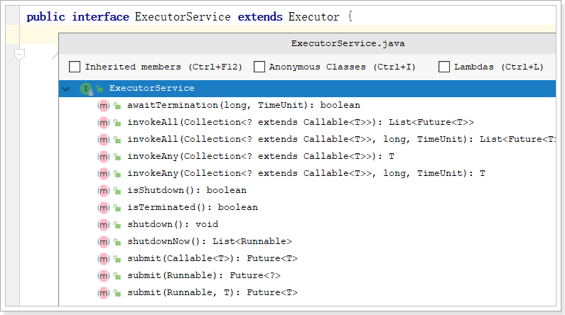

那么问题来了，怎么创建一个线程池对象呢？通常使用Executors工具类


## 8.2. Executors工具类

架构图可以看到Executors工具类，可以用它快速创建线程池。

```java
List list = Arrays.asList("");
ExecutorService threadPool = Executors.newCachedThreadPool();
```


直接编码演示：每种线程池的效果

```java
package com.atguigu.demojuc.chap08;

public class ThreadPoolDemo {

    public static void main(String[] args) {


        //1、基本使用
        ExecutorService threadPool = Executors.newSingleThreadExecutor();// 单一线程池
        //ExecutorService threadPool = Executors.newFixedThreadPool(3); //固定大小线程池

        //可以在线程中设置一下睡眠时间控制承受并发的能力（调整睡眠时间长短看效果）
        //ExecutorService threadPool = Executors.newCachedThreadPool(); // 无限大小线程池（遇强则强）

        try {
            for (int i = 0; i < 1000; i++) {
                threadPool.execute(()->{
                    System.out.println(Thread.currentThread().getName() + "开始执行业务逻辑");
                    try {
                        TimeUnit.MILLISECONDS.sleep(5);
                    } catch (InterruptedException e) {
                        throw new RuntimeException(e);
                    }
                    System.out.println(Thread.currentThread().getName() + "结束");
                });
            }
        } catch (Exception e) {
            e.printStackTrace();
        } finally {
            threadPool.shutdown();
        }


        //可以使用线程池实现定时任务
        //2、延迟5秒执行
      /*  ScheduledExecutorService scheduledExecutorService = Executors.newScheduledThreadPool(3);
        System.out.println(new Date());
        scheduledExecutorService.schedule(() -> {
            System.out.println("这是一个定时任务 " + new Date());
        }, 5,  TimeUnit.SECONDS);*/


        //3、延迟5秒执行，每10秒执行一次
       /* ScheduledExecutorService scheduledExecutorService2 = Executors.newScheduledThreadPool(3);
        System.out.println(new Date());
        scheduledExecutorService2.scheduleAtFixedRate(() -> {
            System.out.println("这是一个定时任务 " + new Date());
        }, 5, 1,  TimeUnit.SECONDS);*/

    }
}
```


## 8.3. 底层原理

上述案例中的三个方法的本质都是ThreadPoolExecutor的实例化对象，只是具体参数值不同。


### 8.3.1. 线程池的7个重要参数


1. corePoolSize：线程池中的常驻核心线程数
2. maximumPoolSize：线程池中能够容纳同时 执行的最大线程数，此值必须大于等于1
3. keepAliveTime：多余的空闲线程的存活时间 当前池中线程数量超过corePoolSize时，当空闲时间达到keepAliveTime时，多余线程会被销毁直到 只剩下corePoolSize个线程为止
4. unit：keepAliveTime的单位 
5. workQueue：任务队列，被提交但尚未被执行的任务
6. threadFactory：表示生成线程池中工作线程的线程工厂， 用于创建线程，`一般默认的即可`
7. handler：拒绝策略，表示当队列满了，并且工作线程等于线程池的最大线程数（maximumPoolSize）时，如何来拒绝 请求执行的runnable的策略


### 8.3.2. 线程池底层工作原理

具体流程：


重要的事情说三遍：<font color="red">以下重要：以下重要：以下重要：</font>

1. 在创建了线程池后，线程池中的`线程数为零`。

2. 当调用execute()方法添加一个请求任务时，线程池会做出如下判断：

   1. 如果正在运行的线程数量小于`corePoolSize`，那么`马上创建线程`运行这个任务；
   2. 如果正在运行的线程数量`大于或等于corePoolSize`，那么`将这个任务放入队列`；
   3. 如果这个时候`队列满了`且正在`运行的线程数量还小于maximumPoolSize`，那么还是要`创建非核心线程`立刻运行这个任务；
   4. 如果`队列满了`且正在`运行的线程数量等于maximumPoolSize`，那么线程池会`启动饱和拒绝策略`来执行。

3. 当一个线程完成任务时，它会从队列中取下一个任务来执行。

4. 当一个线程无事可做超过一定的时间（keepAliveTime）时，线程会判断：

   - 如果当前运行的线程数大于corePoolSize，那么这个线程就被停掉。
   - 线程池的所有任务完成后，`它最终会收缩到corePoolSize的大小`。


### 8.3.3. 拒绝策略

一般我们创建线程池时，`为防止资源被耗尽，任务队列都会选择创建有界任务队列`，但这种模式下如果出现任务队列已满且线程池创建的线程数达到你设置的最大线程数时，这时就需要你指定ThreadPoolExecutor的RejectedExecutionHandler参数即合理的拒绝策略，`来处理线程池"超载"的情况`。


**ThreadPoolExecutor自带的拒绝策略如下：**

1. AbortPolicy(默认)：直接抛出RejectedExecutionException异常阻止系统正常运行
2. CallerRunsPolicy：“调用者运行”一种调节机制，该策略既不会抛弃任务，也不会抛出异常，而是将某些任务回退到调用者，从而降低新任务的流量。
3. DiscardOldestPolicy：抛弃队列中等待最久的任务，然后把当前任务加人队列中，尝试再次提交当前任务。
4. DiscardPolicy：该策略默默地丢弃无法处理的任务，不予任何处理也不抛出异常。 如果允许任务丢失，这是最好的一种策略。


以上内置的策略均实现了RejectedExecutionHandler接口，`也可以自己扩展RejectedExecutionHandler接口`，定义自己的拒绝策略


## 8.4. 自定义线程池

​		在《阿里巴巴java开发手册》中指出了`线程资源必须通过线程池提供`，不允许在应用中自行显示的创建线程，这样一方面是线程的创建更加规范，可以合理控制开辟线程的数量；另一方面线程的细节管理交给线程池处理，优化了资源的开销。而线程池不允许使用Executors去创建，而要通过ThreadPoolExecutor方式，这一方面是由于jdk中Executor框架虽然提供了如newFixedThreadPool()、newSingleThreadExecutor()、newCachedThreadPool()等创建线程池的方法，但都有其局限性，不够灵活；使用ThreadPoolExecutor有助于大家明确线程池的运行规则，创建符合自己的业务场景需要的线程池，避免资源耗尽的风险。

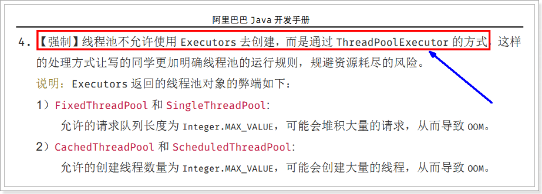


自定义线程池：

```java
package com.atguigu.demojuc.chap08;

class MyRunnable implements Runnable{

    private int param;

    public MyRunnable(int param) {
        this.param = param;
    }

    @Override
    public void run() {
        System.out.println("Runnable......" + param);
    }
}

public class CustomizeThreadPoolDemo {

    public static void main(String[] args) {

        // 自定义连接池
        ExecutorService threadPool = new ThreadPoolExecutor(2, 5,
                2, TimeUnit.SECONDS, new ArrayBlockingQueue<>(3),
                Executors.defaultThreadFactory(),
                new ThreadPoolExecutor.AbortPolicy() //抛出异常
                //new ThreadPoolExecutor.CallerRunsPolicy() //main线程来执行任务
                //new ThreadPoolExecutor.DiscardOldestPolicy() //丢弃等待最久的请求
                //new ThreadPoolExecutor.DiscardPolicy() //丢弃被拒绝的任务
                /*new RejectedExecutionHandler() {
                    @Override
                    public void rejectedExecution(Runnable r, ThreadPoolExecutor executor) {
                        System.out.println("自定义拒绝策略");
                    }
                }*/
        );

        try {
            for (int i = 0; i < 9; i++) {
                threadPool.execute(() -> {
                    //threadPool.submit(() -> { //这里也可以使用submit
                    System.out.println(Thread.currentThread().getName() + "执行了业务逻辑");
                });
            }
        } catch (Exception e) {
            e.printStackTrace();
        } finally {
            threadPool.shutdown();
        }

    }
}
```


**execute和submit的区别**

1. execute是Executor接口的方法，而submit是ExecutorService的方法，并且ExecutorService接口继承了Executor接口。
2. execute只接受Runnable参数，没有返回值；而submit可以接受Runnable参数和Callable参数，并且返回了Future对象，可以进行任务取消、获取任务结果、判断任务是否执行完毕/取消等操作。
3. 通过execute方法提交的任务无法获取具体的异常信息；而submit方法可以通过Future对象获取异常信息。


# 9. 多线程高并发底层原理

## 9.1、Java内存模型

计算机运行架构图，如下：


由于cpu的运行程序速度远大于主存储的速度，所以会在主存RAM和CPU之间加多级高速缓存，缓存的速度接近cpu的运行速度，这样会大大提高计算机的运行速度。

**CPU 通过CPU缓存和CPU寄存器来提高数据访问速度，减少对RAM的访问次数，提高对RAM的访问效率，从而提高计算机的性能。**


`JMM即为JAVA 内存模型（Java Memory Model）`。因为在不同的硬件生产商和不同的操作系统下，内存的访问逻辑有一定的差异，结果就是当你的代码在某个系统环境下运行良好，并且线程安全，但是换了个系统就出现各种问题。Java内存模型，就是为了屏蔽系统和硬件的差异，让一套代码在不同平台下能到达相同的访问结果。JMM从java 5开始的JSR-133发布后，已经成熟和完善起来。


JMM规定了内存主要划分为**主内存**和**工作内存**两种。**主内存对应的是硬件的物理内存，工作内存对应的是寄存器和高速缓存**。


- **共享变量**：如果一个变量被多个线程使用，那么这个变量会在每个线程的工作内存中保有一个副本，这种变量就是共享变量。
- **主内存**：保存了所有的共享变量。
- **工作内存**：每个线程都有自己的工作内存，线程独享，保存了线程用到的变量副本（主内存共享变量的一份拷贝）。


JMM对共享内存的操作做出了如下两条规定：

- 线程对共享内存的所有操作都必须在自己的工作内存中进行，不能直接从主内存中读写；
- 不同线程无法直接访问其他线程工作内存中的变量，因此共享变量的值传递需要通过主内存完成。


**Java内存模型的三大特性**

- 原子性
- 可见性
- 有序性


## 9.2. volatile关键字

### 9.2.1. 可见性

验证volatile关键字保证内存可见性：

```java
package com.atguigu.demojuc.chap09;

public class VolatileDemo {

    private static Integer flag = 1;

    public static void main(String[] args)  throws InterruptedException {

        new Thread(new Runnable() {
            @Override
            public void run() {
                System.out.println("子线程工作内存读取到的flag的值：" + flag);
                while(flag == 1){}
                System.out.println("子线程工作内存读取到的flag的最新的值..." + flag);
            }
        }).start();

        Thread.sleep(500);

        flag = 2; //主线程修改flag的值
        System.out.println("我是主线程工作内存flag的值：" + flag);
    }
}
```

这是没有添加volatile关键字，打印效果如下：


子线程读取不到主线程修改后的flag值，陷入死循环程序无法结束。

接下来添加volatile关键字再试试：

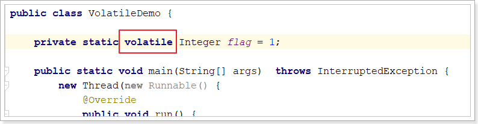

打印结果如下：子线程可以读取的新值并结束子线程


### 9.2.2. 有序性

**注意：此特性需要在jdk1.8环境中做测试**

```java
public class VolatileOrderDemo {

    static int a,b;
    static int x,y;

    public static void main(String[] args) throws InterruptedException {

        int i = 0;
        while (true){
            i++;
            a = b = x = y = 0;
            Thread thread1 = new Thread(() -> {
                a = 1;
                x = b;
            }, "");	
            Thread thread2 = new Thread(() -> {
                b = 1;
                y = a;
            }, "");

            thread1.start();
            thread2.start();

            thread1.join();
            thread2.join();

            System.out.println("第" + i + "次打印：x=" + x + ", y=" + y);

            if (x == 0 && y == 0){
                break;
            }
        }
    }
}
```

**分析，正常情况下：**

如果thread1先执行，xy的值是[0, 1] ；a=1 x=b {b:0} b=1 y=a {a:1};  x=0,y=1

如果thread2先执行是[1, 0]  b = 1 y=a {a:0} a=1 x=b{b:1}

如果出现[0, 0]，则说明进行了指令重排 { 因为JMM的工作内存和主内存之间存在延迟}。


给a, b添加volatile关键字


### 9.2.3. 不具备原子性

编写如下程序：

```java
class DataOne{

    private Integer number = 0;

    public Integer incr(){
        return ++number;
    }
}

public class VolatileAtomicDemo {

    public static void main(String[] args) {

        DataOne dataOne = new DataOne();

        for (int i = 0; i < 1000; i++) {
            new Thread(() -> {
                System.out.println(dataOne.incr());
            }).start();
        }
    }
}
```

执行效果如下：


1000个线程执行++number操作，如果++number操作具备原子性，最后的值应该是1000。说明++number**不具备原子性**。


接下来，给number添加volatile关键字：


测试结果依然不是1000，如下：


**说明volatile关键字不能保证原子性。**

给incr方法`添加同步锁`试试：


测试：

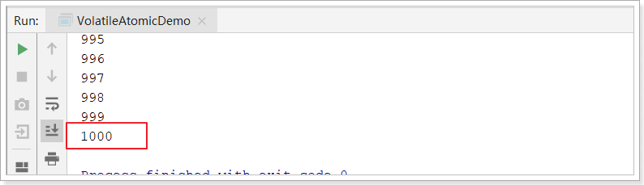

效果完美！


### 9.2.4. volatile原理

Java语言提供了一种`稍弱的同步机制`，即volatile变量，用来`确保将变量的更新操作通知到其他线程`。当把变量声明为volatile类型后，编译器与运行时都会注意到这个变量是共享的，因此不会将该变量上的操作与其他内存操作一起重排序。

`在访问volatile变量时不会执行加锁操作，因此也就不会使执行线程阻塞，因此volatile变量是一种比synchronized关键字更轻量级的同步机制。`


当一个变量定义为 volatile 之后，将具备两种特性：

- 保证此变量对所有的线程的可见性。

- 禁止指令重排序优化。有volatile修饰的变量，赋值后多执行了一个“load addl $0x0, (%esp)”操作，这个操作相当于一个`内存屏障（`指令重排序时不能把后面的指令重排序到内存屏障之前的位置），只有一个CPU访问内存时，并不需要内存屏障。
- `不保证变量的原子性`


volatile 性能：volatile 的读性能消耗与普通变量几乎相同，但是写操作稍慢，因为它需要在本地代码中插入许多内存屏障指令来保证处理器不发生乱序执行。


## 9.3. CAS

### 9.3.1. CAS

**CAS：Compare and Swap。**比较并交换的意思。

`CAS (Compare-and-Swap) 是一种原子操作指令，用于解决多线程并发安全问题。CAS 操作是一种乐观锁算法，它用于实现并发控制，特别是在多线程环境下。`因为它在对共享变量更新之前，会先比较当前值是否与更新前的值一致，如果一致则更新，如果不一致则重新获取共享变量的值，再次判断当前值是否与更新前的值一致，循环执行，直到当前值与更新前的值一致为止，才执行更新。

CAS操作有3个基本参数：内存地址V，旧值A，新值B。它的作用是将指定内存地址V的内容与所给的旧值A相比，如果相等，则将其内容替换为指令中提供的新值B；如果不等，则更新失败。


### 9.3.2. Unsafe

**Unsafe提供硬件级别的原子操作**

这个类存在于sun.misc中，其内部方法可以像C、C++的指针一样，**直接操作内存**


以下方法的作用：从内存中获取var1对象的var2属性的值，如果取到的值是预期的var4，则将var2的值修改为var5

```java
// 对象、对象的属性地址偏移量、预期值、修改值1
public final native boolean compareAndSetInt(Object var1, long var2, int var4, int var5);
```


### 9.3.3. 基本代码演示

在JUC下有个atomic包，有很多原子操作的包装类：

 

这里以AtomicInteger这个类来演示：

```java
public class CasDemo {

    public static void main(String[] args) {
        //乐观锁原理
        AtomicInteger i = new AtomicInteger(1);
        System.out.println("第一次更新：" + i.compareAndSet(1, 200));
        System.out.println("第一次更新后i的值：" + i.get());
        System.out.println("第二次更新：" + i.compareAndSet(1, 300));
        System.out.println("第二次更新后i的值：" + i.get());
        System.out.println("第三次更新：" + i.compareAndSet(200, 300));
        System.out.println("第三次更新后i的值：" + i.get());
    }
}
```

输出结果如下：

```
第一次更新：true
第一次更新后i的值：200
第二次更新：false
第二次更新后i的值：200
第三次更新：true
第三次更新后i的值：300
```

结果分析：

```
第一次更新：i的值（1）和预期值（1）相同，所以执行了更新操作，把i的值更新为200
第二次更新：i的值（200）和预期值（1）不同，所以不再执行更新操作
第三次更新：i的值（200）和预期值（1）相同，所以执行了更新操作，把i的值更新为300
```


### 9.3.4. 验证原子性

还是改造之前的验证volatile关键字的案例如下：**不使用synchronized的前提下如何保证多线程并发安全?**


测试结果如下：


也很完美！ 


### 9.3.5. 缺点

**开销大**：在并发量比较高的情况下，如果反复尝试更新某个变量，却又一直更新不成功，会给CPU带来较大的压力

**ABA问题**：当变量从A修改为B再修改回A时，变量值等于期望值A，但是无法判断是否修改，CAS操作在ABA修改后依然成功。 

 **不能保证代码块的原子性**：CAS机制所保证的只是`一个变量`的原子性操作，而不能保证整个代码块的原子性。


