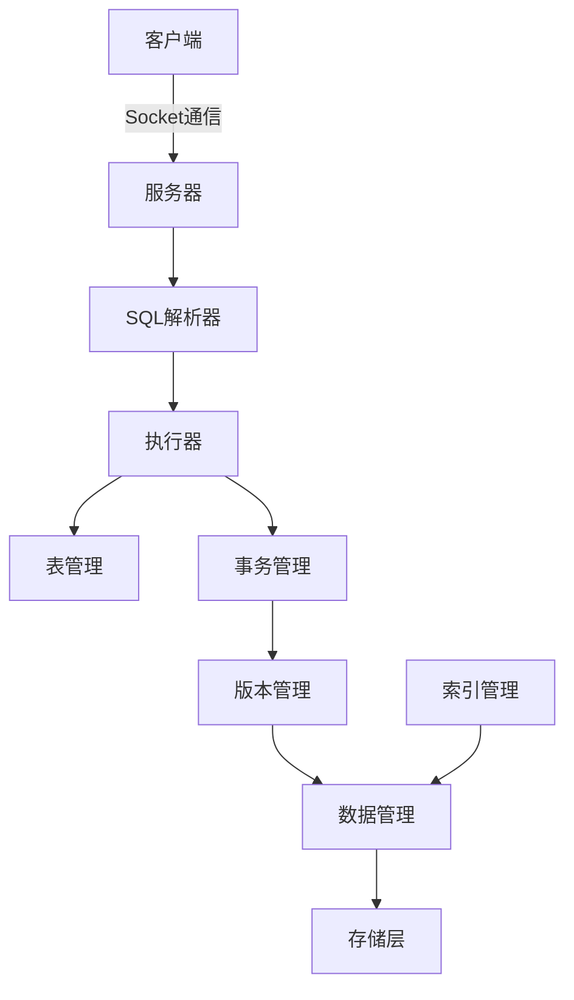

## 项目介绍

`MYDB` 是一个用 Java 实现的简单数据库，参照了 MySQL、PostgreSQL 和 SQLite 的部分原理。它旨在提供一个轻量级的数据库系统，适合学习和理解数据库的核心概念。以下是 `MYDB` 项目的主要目的、关键特性和学习目标：

### 目的
- **教育与学习**：`MYDB` 的主要目的是帮助开发者理解数据库系统的基本原理和实现方式，通过一个简化的模型展示数据库的核心功能。
- **实践与探索**：提供一个可以动手实践的平台，让用户能够深入研究数据库内部机制，如数据存储、事务处理和并发控制。

### 关键特性
- **数据可靠性与恢复**：实现了数据的持久化存储和故障恢复机制，确保数据不会因系统崩溃而丢失。
- **两段锁协议（2PL）**：通过两段锁协议实现可串行化调度，确保事务执行的正确性和一致性。
- **多版本并发控制（MVCC）**：支持多版本并发控制，允许多个事务同时读取数据，提高并发性能。
- **事务隔离级别**：实现了两种事务隔离级别——读提交（Read Committed）和可重复读（Repeatable Read），帮助用户理解事务隔离的概念。
- **死锁处理**：包含死锁检测和解决机制，防止事务因资源竞争而陷入僵局。
- **表和字段管理**：提供简单的表和字段管理功能，支持基本的数据库结构定义。
- **SQL 解析**：实现了简陋的 SQL 解析功能，支持基本的数据库操作语句。
- **客户端-服务器架构**：基于 socket 实现服务器和客户端，支持远程连接和交互式命令行操作。

### 学习目标
- **理解数据库架构**：掌握数据库系统的整体架构，了解各模块（如数据管理、事务管理、版本管理）的职责和协作方式。
- **深入核心原理**：学习数据库核心技术，如数据存储、事务处理、并发控制和恢复机制的实现原理。
- **实践操作**：通过运行和调试 `MYDB`，熟悉数据库的启动、连接和基本操作流程。
- **模块间协作**：重点关注模块间的交互，理解数据如何在不同组件之间流动，以及如何协同工作以完成数据库操作。

## 学习计划

以下是一个系统化的学习计划，旨在帮助您逐步掌握 `MYDB` 项目，按照代码模块和各个类的编写顺序安排学习内容。每个步骤都包含具体的任务和目标，细化到具体类的学习。

### 阶段 1：项目概述与环境搭建
- **目标**：熟悉 `MYDB` 的基本概念，搭建运行环境。
- **任务**：
  - [ ] 阅读 `README.md` 文件，了解项目的背景和功能。
  - [ ] 按照说明编译源码（`mvn compile`）。
  - [ ] 创建数据库实例（`mvn exec:java -Dexec.mainClass="top.guoziyang.mydb.backend.Launcher" -Dexec.args="-create /tmp/mydb"`）。
  - [ ] 启动数据库服务（`mvn exec:java -Dexec.mainClass="top.guoziyang.mydb.backend.Launcher" -Dexec.args="-open /tmp/mydb"`）。
  - [ ] 启动客户端并连接数据库（`mvn exec:java -Dexec.mainClass="top.guoziyang.mydb.client.Launcher"`），尝试执行简单的 SQL 语句。
- **成果**：成功运行 `MYDB` 并进行基本操作。

### 阶段 2：基础模块 - 数据管理（`dm`）
- **目标**：理解数据存储和访问的基本原理，按类编写顺序学习。
- **任务**：
  1. **工具类和基础结构**：
     - [ ] 阅读 `SubArray.java`，了解数据分片的基本结构。
  2. **页面和缓存管理**：
     - [ ] 阅读 `Page.java` 和 `PageImpl.java`，掌握数据页的基本实现。
     - [ ] 阅读 `PageCache.java` 和 `PageCacheImpl.java`，理解页面缓存机制。
     - [ ] 阅读 `PageOne.java` 和 `PageX.java`，学习特定页面类型的实现。
  3. **数据项管理**：
     - [ ] 阅读 `dataItem/DataItem.java` 和 `dataItem/DataItemImpl.java`，理解数据项的定义和操作。
  4. **日志管理**：
     - [ ] 阅读 `logger/Logger.java` 和 `logger/LoggerImpl.java`，掌握日志记录机制。
  5. **页面索引**：
     - [ ] 阅读 `pageIndex/PageIndex.java` 和 `pageIndex/PageInfo.java`，了解页面索引结构。
  6. **数据管理核心**：
     - [ ] 阅读 `DataManager.java` 和 `DataManagerImpl.java`，理解数据管理的接口和实现。
  7. **数据恢复**：
     - [ ] 阅读 `Recover.java`，学习数据恢复和日志解析的实现。
- **成果**：总结数据管理模块的功能，记录数据存储和恢复的关键流程。

### 阶段 3：核心模块 - 事务管理（`tm`）
- **目标**：掌握事务的创建、提交和回滚过程，按类编写顺序学习。
- **任务**：
  1. **事务管理接口和实现**：
     - [ ] 阅读 `TransactionManager.java`，了解事务管理的基本接口。
     - [ ] 阅读 `TransactionManagerImpl.java`，理解事务管理的具体实现，关注事务状态更新和检查机制。
- **成果**：记录事务管理模块的核心功能，理解事务生命周期。

### 阶段 4：并发控制 - 版本管理（`vm`）
- **目标**：学习多版本并发控制（MVCC）和事务隔离级别，按类编写顺序学习。
- **任务**：
  1. **基础结构**：
     - [ ] 阅读 `Entry.java`，理解版本条目的定义和操作。
     - [ ] 阅读 `Transaction.java`，掌握事务对象的结构和快照机制。
  2. **并发控制机制**：
     - [ ] 阅读 `LockTable.java`，了解锁表和死锁检测的实现。
     - [ ] 阅读 `Visibility.java`，学习版本可见性和隔离级别的判断逻辑。
  3. **版本管理核心**：
     - [ ] 阅读 `VersionManager.java`，了解版本管理的接口。
     - [ ] 阅读 `VersionManagerImpl.java`，理解版本管理的具体实现，关注事务版本控制流程。
- **成果**：总结版本管理模块的功能，绘制 MVCC 和锁机制的流程图。

### 阶段 5：数据结构管理 - 表管理（`tbm`）
- **目标**：了解表和字段的定义和管理，按类编写顺序学习。
- **任务**：
  1. **基础结构**：
     - [ ] 阅读 `BeginRes.java` 和 `FieldCalRes.java`，了解表管理中的辅助类。
     - [ ] 阅读 `Field.java`，学习字段定义和操作。
     - [ ] 阅读 `Table.java`，掌握表对象的结构和功能。
  2. **表管理核心**：
     - [ ] 阅读 `Booter.java`，了解表管理启动逻辑。
     - [ ] 阅读 `TableManager.java` 和 `TableManagerImpl.java`，理解表管理的接口和实现。
- **成果**：记录表管理模块的功能，理解数据库结构如何组织。

### 阶段 6：索引管理 - B+树实现（`im`）
- **目标**：理解索引结构和操作，按类编写顺序学习。
- **任务**：
  1. **基础结构**：
     - [ ] 阅读 `Node.java`，了解 B+树节点结构和操作。
  2. **索引核心**：
     - [ ] 阅读 `BPlusTree.java`，掌握 B+树的实现和索引管理逻辑。
- **成果**：总结索引管理模块的功能，理解 B+树在数据库中的应用。

### 阶段 7：查询处理 - SQL 解析（`parser`）
- **目标**：理解 SQL 语句的解析和执行过程，按类编写顺序学习。
- **任务**：
  1. **基础结构**：
     - [ ] 阅读 `Tokenizer.java`，了解词法分析的基本实现。
     - [ ] 阅读 `statement/` 目录下的类（如 `Select.java`、`Insert.java`、`Create.java`、`Delete.java`、`Update.java`、`Drop.java`、`Begin.java`、`Commit.java`、`Abort.java`、`Show.java`），理解不同 SQL 语句的解析结构。
     - [ ] 阅读 `Where.java` 和 `SingleExpression.java`，掌握查询条件和表达式的解析。
  2. **解析核心**：
     - [ ] 阅读 `Parser.java`，理解 SQL 解析的整体逻辑和语句转换过程。
- **成果**：总结 SQL 解析模块的功能，记录从 SQL 到执行的转换过程。

### 阶段 8：服务与通信 - 服务器和客户端
- **目标**：掌握客户端-服务器架构和通信机制，按类编写顺序学习。
- **任务**：
  1. **通信基础**：
     - [ ] 阅读 `transport/Encoder.java`，了解数据编码机制。
     - [ ] 阅读 `transport/Package.java`，掌握数据包结构。
     - [ ] 阅读 `transport/Transporter.java` 和 `transport/Packager.java`，理解数据传输的实现。
  2. **服务器端**：
     - [ ] 阅读 `server/Server.java`，了解服务器启动和监听逻辑。
     - [ ] 阅读 `server/Executor.java`，掌握请求执行的实现。
  3. **客户端**：
     - [ ] 阅读 `client/RoundTripper.java`，了解客户端通信逻辑。
     - [ ] 阅读 `client/Client.java` 和 `client/Shell.java`，理解客户端连接和交互界面实现。
     - [ ] 阅读 `client/Launcher.java`，掌握客户端启动流程。
  4. **服务启动**：
     - [ ] 阅读 `backend/Launcher.java`，理解数据库服务的启动入口和参数解析。
- **成果**：总结通信模块的功能，绘制客户端-服务器交互流程图。

### 阶段 9：通用工具和错误处理
- **目标**：了解项目中的通用工具类和错误处理机制，按类编写顺序学习。
- **任务**：
  1. **缓存基础**：
     - [ ] 阅读 `common/AbstractCache.java`，了解缓存抽象实现。
  2. **错误处理**：
     - [ ] 阅读 `common/Error.java`，掌握错误定义和处理机制。
  3. **工具类**：
     - [ ] 阅读 `utils/Panic.java`，了解异常终止处理。
     - [ ] 阅读 `utils/Parser.java` 和 `utils/ParseStringRes.java`，掌握字符串解析工具。
     - [ ] 阅读 `utils/RandomUtil.java`，了解随机数生成工具。
     - [ ] 阅读 `utils/Types.java`，学习类型定义和转换工具。
- **成果**：总结工具类和错误处理模块的功能，理解其在项目中的作用。

### 阶段 10：整体架构与模块协作
- **目标**：整合各模块知识，理解整体架构和协作机制。
- **任务**：
  - [ ] 跟踪一个完整 SQL 查询的执行流程：从客户端请求到服务器解析，再到数据操作和结果返回。
  - [ ] 分析模块间的依赖和调用关系，理解数据如何在 `dm`、`tm`、`vm`、`im` 和 `tbm` 之间流动。
- **成果**：绘制完整的架构图和数据流图，全面掌握 `MYDB` 的运作机制。

### 阶段 11：实践与调试
- **目标**：通过调试和修改代码加深理解。
- **任务**：
  - [ ] 在关键类中添加日志，观察模块间的调用顺序和数据变化。
  - [ ] 模拟一个事务冲突场景，调试 `LockTable` 和 `Visibility` 类，理解死锁检测和版本控制的实际运作。
  - [ ] 尝试扩展功能，例如添加一个简单的 SQL 命令，观察从解析到执行的全过程。
- **成果**：记录调试过程中的发现和心得，特别是模块协作中的关键点。

### 阶段 12：总结与反思
- **目标**：总结学习成果，反思数据库设计的复杂性。
- **任务**：
  - [ ] 撰写一篇学习总结，涵盖 `MYDB` 的整体架构、模块功能和协作机制。
  - [ ] 对比 `MYDB` 与真实数据库（如 MySQL）的异同，思考简化模型的优缺点。
  - [ ] 提出改进建议，例如如何优化性能或增加功能。
- **成果**：完成总结文档，形成对数据库系统设计的深刻理解。

## 架构图示例

以下是一个简单的 Mermaid 架构图，展示 `MYDB` 的整体结构和模块关系：

通过以上学习计划，您将系统地掌握 `MYDB` 项目，按照代码模块和各个类的编写顺序逐步深入，全面理解数据库系统的设计和实现。