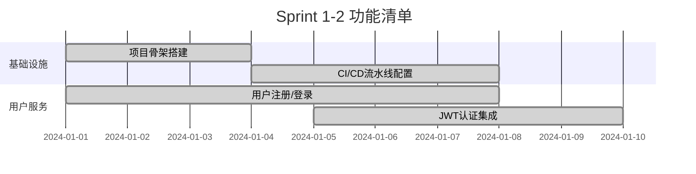
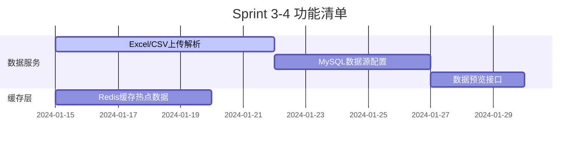
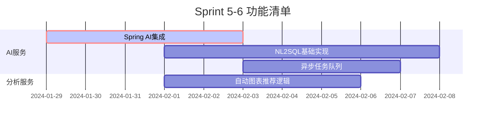
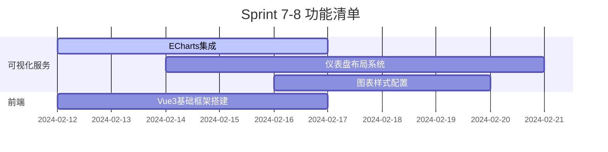
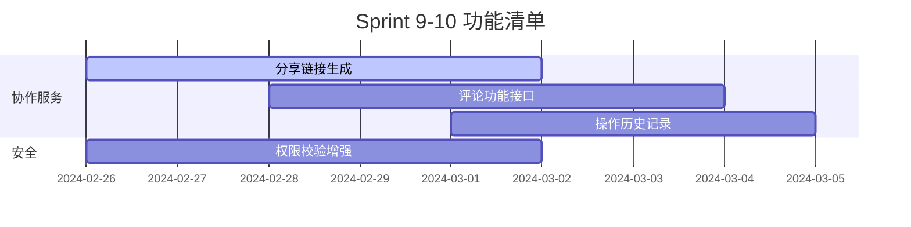
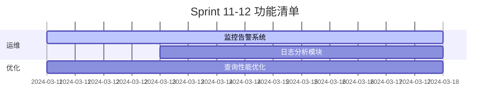
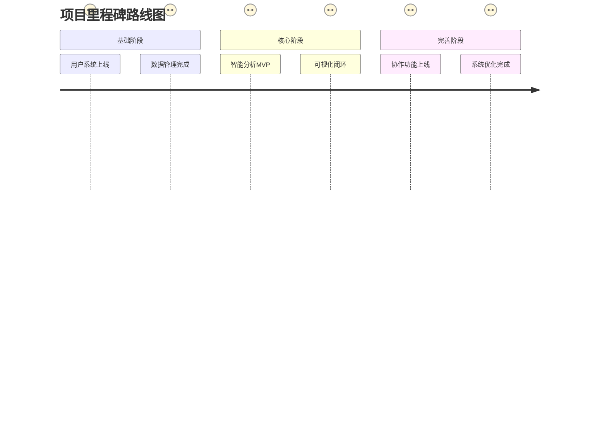

以下是针对学生开发者设计的智能BI平台开发周期计划，结合敏捷开发思想，将核心功能拆解为可交付的迭代版本：

---

### **总开发周期：16周（4个月）**
采用双周迭代制（Sprint），每个Sprint聚焦2-3个核心功能模块

---

### **迭代计划表**

#### **Sprint 1-2：基础架构搭建（2周）**
**目标**：完成技术选型验证和基础框架搭建


#### **Sprint 3-4：数据管理核心（2周）**
**目标**：实现基础数据流转能力


#### **Sprint 5-6：智能分析初版（2周）**
**目标**：实现基础的自然语言分析能力


#### **Sprint 7-8：可视化呈现（2周）**
**目标**：完成数据可视化闭环


#### **Sprint 9-10：协作增强（2周）**
**目标**：实现团队协作能力


#### **Sprint 11-12：系统完善（2周）**
**目标**：提升系统健壮性


---

### **详细功能拆解表**
| 模块          | 子功能                  | 技术实现要点                          | 预计工时 | 依赖项       |
|---------------|-------------------------|---------------------------------------|----------|--------------|
| **用户服务**  | 1. 手机号注册           | Spring Security+短信验证码            | 8h       | Redis        |
|               | 2. RBAC权限管理         | MyBatis-Plus动态SQL                   | 12h      | MySQL        |
| **数据服务**  | 1. CSV分片上传          | EasyExcel+分片上传                    | 16h      | MinIO        |
|               | 2. 数据清洗管道         | 自定义注解+规则引擎                   | 20h      | Drools       |
| **AI服务**    | 1. 自然语言查询         | Spring AI Prompt工程                  | 24h      | OpenAI API   |
|               | 2. 自动洞察生成         | 模版引擎+大模型微调                   | 32h      | LangChain    |
| **可视化服务**| 1. 图表联动             | ECharts事件总线                       | 16h      | Vue3         |
|               | 2. 仪表盘持久化         | JSON Schema+版本控制                  | 12h      | MySQL JSON列 |

---

### **每日开发节奏建议**
```markdown
8:00-9:00  昨日进度回顾 & 当日计划
9:00-11:30 核心功能开发（专注编码）
13:30-15:00 单元测试编写
15:00-17:00 技术难点攻关
17:00-17:30 代码提交 & MR创建
19:00-20:00 技术文档编写
```

---

### **关键里程碑节点**


---

### **学生开发者特别建议**
1. **技术聚焦策略**：
   - 前端：主攻Vue3+Element Plus
   - 后端：深耕Spring Boot+MyBatis-Plus
   - AI：专注Prompt工程，暂不深入模型训练

2. **简化方案**：
   - 使用SQLite替代MySQL初期版本
   - 采用LocalAI替代云端大模型
   - 使用内存缓存替代Redis初期版本

3. **学习资源**：
   ```markdown
   - [Spring AI官方文档](https://spring.io/projects/spring-ai)
   - [ECharts案例库](https://echarts.apache.org/examples/)
   - [MyBatis-Plus指南](https://baomidou.com/)
   ```

按照此计划，每周保持25-30小时的有效开发时间，可在4个月内完成可演示的智能BI平台。建议使用GitHub Project进行任务跟踪，每个功能创建独立issue并进行任务拆解。