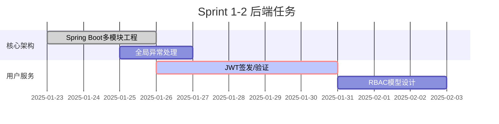
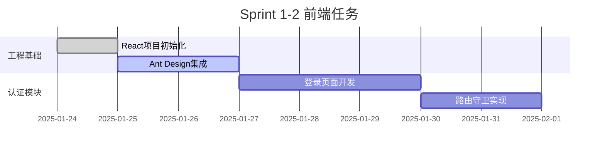
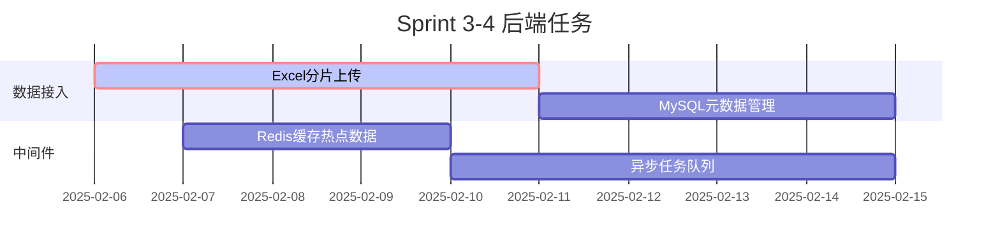
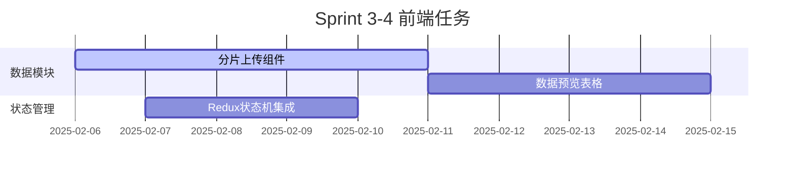
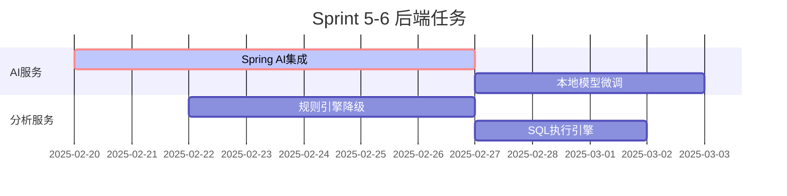
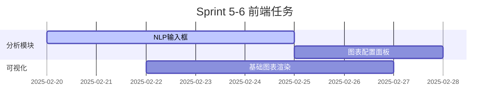
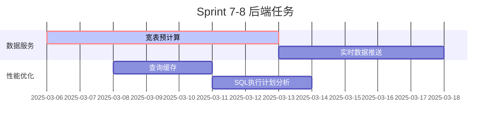
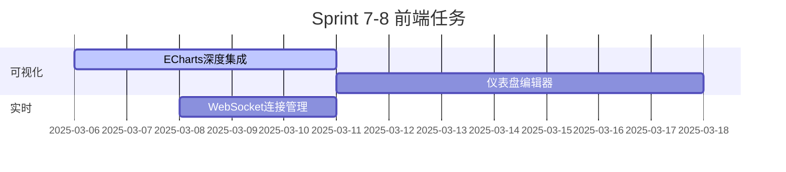
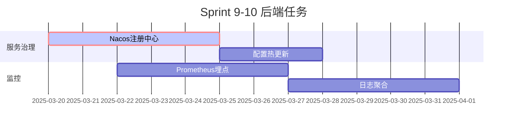
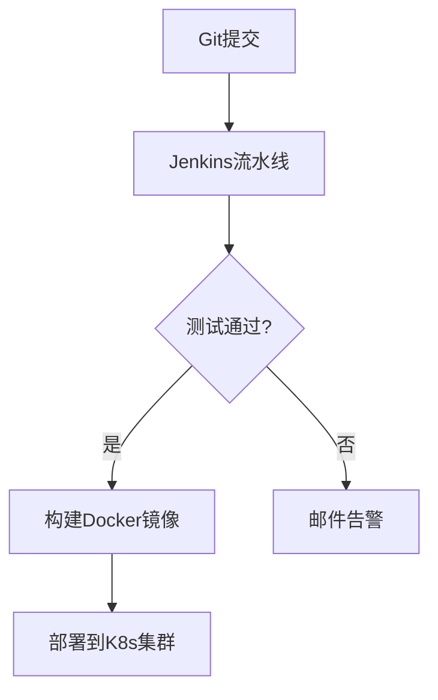

以下是整合前后端开发的完整双周计划，每个Sprint均明确划分前后端任务，保持技术细节完整：

---

### **Sprint 1-2（1.23-2.5）基础框架搭建**
#### **后端任务**


**技术实现**：
1. 多环境配置
   ```yaml
   # application-dev.yml
   spring:
     datasource:
       url: jdbc:mysql://localhost:3306/bi_dev
       username: dev_user
       password: dev123
   ```
2. JWT工具类
   ```java
   public class JwtUtils {
       public static String generateToken(UserDetails user) {
           return Jwts.builder()
               .setSubject(user.getUsername())
               .setExpiration(new Date(System.currentTimeMillis() + 3600 * 1000))
               .signWith(SignatureAlgorithm.HS512, SECRET_KEY)
               .compact();
       }
   }
   ```

#### **前端任务**


**联调重点**：
- JWT令牌在axios拦截器中的自动携带
- 401状态码的全局处理

---

### **Sprint 3-4（2.6-2.19）数据核心功能**
#### **后端任务**


**关键技术**：
1. 分片上传接口
   ```java
   @PostMapping("/upload/chunk")
   public Response uploadChunk(
       @RequestParam String fileKey,
       @RequestParam Integer chunkIndex,
       @RequestPart MultipartFile chunk) {
       
       // 保存分片到临时目录
       // 更新Redis中的分片记录
       return Response.success();
   }
   ```
2. 元数据表设计
   ```sql
   CREATE TABLE dataset_meta (
     id BIGINT PRIMARY KEY COMMENT '主键',
     name VARCHAR(255) NOT NULL COMMENT '数据集名称',
     columns JSON NOT NULL COMMENT '字段定义',
     created_by VARCHAR(64) COMMENT '创建人'
   ) ENGINE=InnoDB DEFAULT CHARSET=utf8mb4;
   ```

#### **前端任务**


**关键技术**：
1. 大文件分片上传
   ```tsx
   const uploadChunk = async (file: File) => {
     const chunkSize = 5 * 1024 * 1024; // 5MB
     for (let i = 0; i < Math.ceil(file.size / chunkSize); i++) {
       const chunk = file.slice(i * chunkSize, (i + 1) * chunkSize);
       await api.uploadChunk(chunk, file.name, i);
     }
     await api.mergeChunks(file.name);
   };
   ```

---

### **Sprint 5-6（2.20-3.5）智能分析引擎**
#### **后端任务**


**关键技术**：
1. NL2SQL服务
   ```java
   @Service
   public class NL2SQLService {
       public String parse(String question) {
           String prompt = """
               数据库结构：%s
               问题：%s
               要求：使用MySQL语法，包含注释
               """.formatted(getSchema(), question);
           return chatClient.call(prompt);
       }
   }
   ```
2. SQL执行安全校验
   ```java
   public void validateSQL(String sql) {
       if (sql.contains("DELETE") || sql.contains("UPDATE")) {
           throw new InvalidSQLException("只允许SELECT查询");
       }
   }
   ```

#### **前端任务**


**关键技术**：
1. 智能输入建议
   ```tsx
   <AutoComplete
     options={suggestions}
     onSearch={handleSearch}
     placeholder="输入分析需求..."
   />
   ```

---

### **Sprint 7-8（3.6-3.19）可视化系统**
#### **后端任务**


**关键技术**：
1. WebSocket端点
   ```java
   @ServerEndpoint("/ws/realtime")
   public class RealtimeEndpoint {
       @OnMessage
       public void handleMessage(Session session, String message) {
           // 处理订阅请求
       }
       
       public void pushData(String topic, String data) {
           // 广播数据
       }
   }
   ```

#### **前端任务**


**关键技术**：
1. 实时数据订阅
   ```tsx
   const [data, setData] = useState([]);
   useEffect(() => {
     const ws = new WebSocket('ws://api/ws/realtime');
     ws.onmessage = (e) => setData(JSON.parse(e.data));
     return () => ws.close();
   }, []);
   ```

---

### **Sprint 9-10（3.20-4.2）企业级扩展**
#### **后端任务**


**关键技术**：
1. 监控指标配置
   ```java
   @Timed(value = "bi.query.duration", description = "查询耗时")
   @GetMapping("/query")
   public Response query(@RequestParam String sql) {
       // 业务逻辑
   }
   ```

#### **前端任务**


---

### **DevOps集成方案**


**后端关键配置**：
```dockerfile
FROM openjdk:17-jdk-alpine
COPY target/bi-service.jar /app.jar
EXPOSE 8080
ENTRYPOINT ["java","-jar","/app.jar"]
```

---

该计划完整覆盖前后端开发，每个Sprint均包含：
1. **后端核心模块**：认证/数据/AI/监控等企业级功能
2. **前端交互实现**：组件开发/状态管理/可视化等
3. **联调验证点**：接口规范/数据格式/异常处理
4. **质量保障**：单元测试/压力测试/代码审查

建议使用Postman维护API文档集合，使用Swagger生成接口文档，确保前后端开发高效协同。