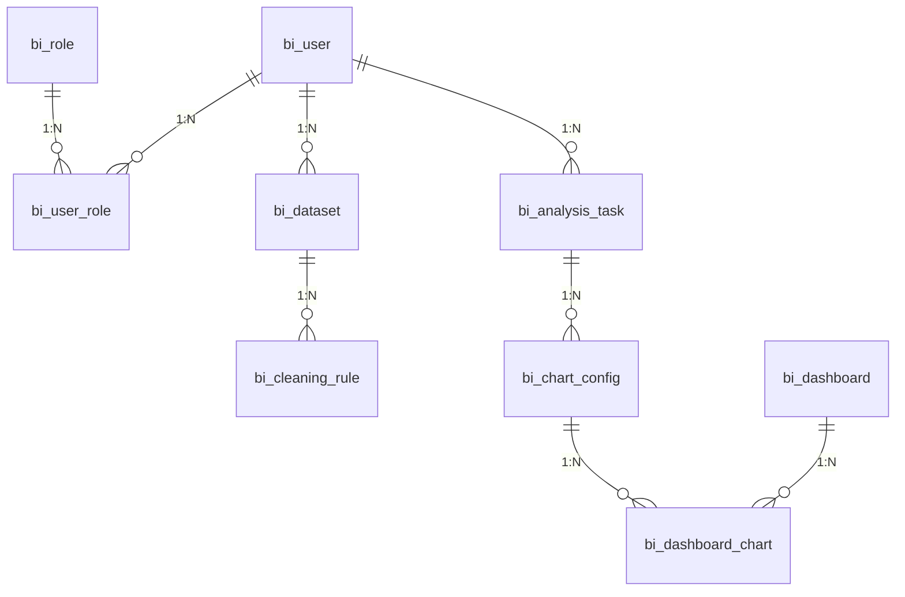

### **数据库设计规范**
1. **存储引擎**：InnoDB（支持事务、行级锁）
2. **字符集**：`utf8mb4`（支持Emoji及生僻字）
3. **命名规范**：
   - 表名：`snake_case`，模块前缀（如`bi_user`）
   - 字段名：`snake_case`
   - 主键：`bigint`自增，命名`id`
4. **索引规范**：
   - 唯一索引：`uk_字段名`
   - 普通索引：`idx_字段名`
   - 联合索引：`idx_字段1_字段2`

---

### **核心表结构设计**

#### **1. 用户模块**
```sql
-- 用户表
CREATE TABLE bi_user (
  id BIGINT PRIMARY KEY AUTO_INCREMENT COMMENT '主键',
  username VARCHAR(64) NOT NULL COMMENT '用户名',
  password VARCHAR(128) NOT NULL COMMENT '加密密码',
  email VARCHAR(128) UNIQUE COMMENT '邮箱',
  phone VARCHAR(20) UNIQUE COMMENT '手机号',
  status TINYINT NOT NULL DEFAULT 1 COMMENT '状态（1启用 0禁用）',
  create_time DATETIME NOT NULL DEFAULT CURRENT_TIMESTAMP COMMENT '创建时间',
  update_time DATETIME ON UPDATE CURRENT_TIMESTAMP COMMENT '更新时间',
  INDEX idx_username (username),
  INDEX idx_status (status)
) COMMENT '用户表';

-- 角色表
CREATE TABLE bi_role (
  id INT PRIMARY KEY AUTO_INCREMENT COMMENT '主键',
  role_name VARCHAR(64) NOT NULL UNIQUE COMMENT '角色名称',
  role_desc VARCHAR(255) COMMENT '角色描述'
) COMMENT '角色表';

-- 用户角色关联表
CREATE TABLE bi_user_role (
  user_id BIGINT NOT NULL COMMENT '用户ID',
  role_id INT NOT NULL COMMENT '角色ID',
  PRIMARY KEY (user_id, role_id),
  FOREIGN KEY (user_id) REFERENCES bi_user(id),
  FOREIGN KEY (role_id) REFERENCES bi_role(id)
) COMMENT '用户角色关联表';
```

---

#### **2. 数据管理模块**
```sql
-- 数据集元数据表
CREATE TABLE bi_dataset (
  id BIGINT PRIMARY KEY AUTO_INCREMENT COMMENT '主键',
  dataset_name VARCHAR(255) NOT NULL COMMENT '数据集名称',
  source_type TINYINT NOT NULL COMMENT '来源类型（1:文件 2:数据库）',
  storage_path VARCHAR(512) COMMENT '文件存储路径',
  schema_definition JSON NOT NULL COMMENT '字段结构定义',
  created_by BIGINT NOT NULL COMMENT '创建人',
  created_time DATETIME NOT NULL DEFAULT CURRENT_TIMESTAMP,
  updated_time DATETIME ON UPDATE CURRENT_TIMESTAMP,
  INDEX idx_created_by (created_by),
  FOREIGN KEY (created_by) REFERENCES bi_user(id)
) COMMENT '数据集元数据表';

-- 数据清洗规则表
CREATE TABLE bi_cleaning_rule (
  id BIGINT PRIMARY KEY AUTO_INCREMENT,
  dataset_id BIGINT NOT NULL COMMENT '数据集ID',
  field_name VARCHAR(128) NOT NULL COMMENT '字段名称',
  rule_type VARCHAR(50) NOT NULL COMMENT '规则类型（regex, range等）',
  rule_config JSON NOT NULL COMMENT '规则配置',
  FOREIGN KEY (dataset_id) REFERENCES bi_dataset(id),
  INDEX idx_dataset_field (dataset_id, field_name)
) COMMENT '数据清洗规则表';
```

---

#### **3. 分析任务模块**
```sql
-- 分析任务表
CREATE TABLE bi_analysis_task (
  id BIGINT PRIMARY KEY AUTO_INCREMENT,
  task_name VARCHAR(255) NOT NULL COMMENT '任务名称',
  original_query TEXT NOT NULL COMMENT '原始查询语句',
  generated_sql TEXT COMMENT '生成的SQL',
  status TINYINT NOT NULL DEFAULT 0 COMMENT '状态（0:待处理 1:执行中 2:成功 3:失败）',
  execute_result JSON COMMENT '执行结果',
  created_by BIGINT NOT NULL,
  created_time DATETIME DEFAULT CURRENT_TIMESTAMP,
  completed_time DATETIME COMMENT '完成时间',
  INDEX idx_status (status),
  INDEX idx_created_by (created_by),
  FOREIGN KEY (created_by) REFERENCES bi_user(id)
) COMMENT '分析任务表';

-- 图表配置表
CREATE TABLE bi_chart_config (
  id BIGINT PRIMARY KEY AUTO_INCREMENT,
  task_id BIGINT NOT NULL COMMENT '任务ID',
  chart_type VARCHAR(50) NOT NULL COMMENT '图表类型',
  style_config JSON COMMENT '样式配置',
  data_source JSON NOT NULL COMMENT '数据源配置',
  FOREIGN KEY (task_id) REFERENCES bi_analysis_task(id)
) COMMENT '图表配置表';
```

---

#### **4. 可视化模块**
```sql
-- 仪表盘表
CREATE TABLE bi_dashboard (
  id BIGINT PRIMARY KEY AUTO_INCREMENT,
  dashboard_name VARCHAR(255) NOT NULL COMMENT '仪表盘名称',
  layout_config JSON NOT NULL COMMENT '布局配置',
  created_by BIGINT NOT NULL,
  created_time DATETIME DEFAULT CURRENT_TIMESTAMP,
  updated_time DATETIME ON UPDATE CURRENT_TIMESTAMP,
  FOREIGN KEY (created_by) REFERENCES bi_user(id)
) COMMENT '仪表盘表';

-- 仪表盘-图表关联表
CREATE TABLE bi_dashboard_chart (
  dashboard_id BIGINT NOT NULL,
  chart_id BIGINT NOT NULL,
  position JSON NOT NULL COMMENT '位置配置',
  PRIMARY KEY (dashboard_id, chart_id),
  FOREIGN KEY (dashboard_id) REFERENCES bi_dashboard(id),
  FOREIGN KEY (chart_id) REFERENCES bi_chart_config(id)
) COMMENT '仪表盘图表关联表';
```

---

#### **5. 系统管理模块**
```sql
-- 操作日志表
CREATE TABLE bi_operation_log (
  id BIGINT PRIMARY KEY AUTO_INCREMENT,
  user_id BIGINT NOT NULL COMMENT '操作用户',
  module VARCHAR(50) NOT NULL COMMENT '操作模块',
  operation_type VARCHAR(50) NOT NULL COMMENT '操作类型',
  detail TEXT COMMENT '操作详情',
  ip_address VARCHAR(45) COMMENT 'IP地址',
  operate_time DATETIME DEFAULT CURRENT_TIMESTAMP,
  INDEX idx_user_module (user_id, module),
  FOREIGN KEY (user_id) REFERENCES bi_user(id)
) COMMENT '操作日志表';

-- API访问密钥表
CREATE TABLE bi_api_key (
  id BIGINT PRIMARY KEY AUTO_INCREMENT,
  user_id BIGINT NOT NULL,
  access_key VARCHAR(64) NOT NULL UNIQUE COMMENT '访问密钥',
  secret_key VARCHAR(128) NOT NULL COMMENT '加密密钥',
  expire_time DATETIME COMMENT '过期时间',
  status TINYINT DEFAULT 1 COMMENT '状态（1启用 0禁用）',
  created_time DATETIME DEFAULT CURRENT_TIMESTAMP,
  INDEX idx_user (user_id),
  FOREIGN KEY (user_id) REFERENCES bi_user(id)
) COMMENT 'API密钥表';
```

---

### **高级特性扩展表**

#### **1. 数据血缘表**
```sql
CREATE TABLE bi_data_lineage (
  id BIGINT PRIMARY KEY AUTO_INCREMENT,
  source_dataset_id BIGINT COMMENT '源数据集ID',
  target_dataset_id BIGINT NOT NULL COMMENT '目标数据集ID',
  transform_type VARCHAR(50) NOT NULL COMMENT '转换类型（join/filter等）',
  transform_config JSON NOT NULL COMMENT '转换配置',
  created_time DATETIME DEFAULT CURRENT_TIMESTAMP,
  FOREIGN KEY (source_dataset_id) REFERENCES bi_dataset(id),
  FOREIGN KEY (target_dataset_id) REFERENCES bi_dataset(id)
) COMMENT '数据血缘表';
```

#### **2. 数据缓存表**
```sql
CREATE TABLE bi_query_cache (
  id BIGINT PRIMARY KEY AUTO_INCREMENT,
  query_hash VARCHAR(64) NOT NULL UNIQUE COMMENT '查询语句哈希',
  result_snapshot JSON NOT NULL COMMENT '结果快照',
  expire_time DATETIME NOT NULL COMMENT '过期时间',
  created_time DATETIME DEFAULT CURRENT_TIMESTAMP,
  INDEX idx_expire (expire_time)
) COMMENT '查询缓存表';
```

---

### **设计要点说明**
1. **JSON字段使用**：合理利用MySQL 8.0+的JSON类型存储动态结构数据
   ```sql
   -- 查询JSON字段示例
   SELECT dataset_name, schema_definition->'$.fields' 
   FROM bi_dataset WHERE id = 1;
   ```
   
2. **索引优化策略**：
   - 高频查询字段：`status`, `created_time`
   - 组合索引：`(user_id, module)` 用于操作日志查询
   - 唯一约束：`access_key`, `email`, `phone`

3. **安全设计**：
   ```sql
   -- 密码加密存储示例
   INSERT INTO bi_user (username, password) 
   VALUES ('admin', AES_ENCRYPT('password', 'secret_key'));
   ```

4. **分区建议**：
   ```sql
   -- 按时间分区（日志类表）
   ALTER TABLE bi_operation_log 
   PARTITION BY RANGE COLUMNS(operate_time) (
     PARTITION p202301 VALUES LESS THAN ('2023-02-01'),
     PARTITION p202302 VALUES LESS THAN ('2023-03-01')
   );
   ```

---

### **ER图关键关系**


---

该设计方案满足智能BI平台核心业务需求，同时为扩展保留灵活性。建议配合以下优化策略：
1. 定期执行`ANALYZE TABLE`更新统计信息
2. 使用`EXPLAIN`分析慢查询
3. 重要业务表开启Binlog用于数据同步
4. 敏感字段加密存储（如密码、API密钥）