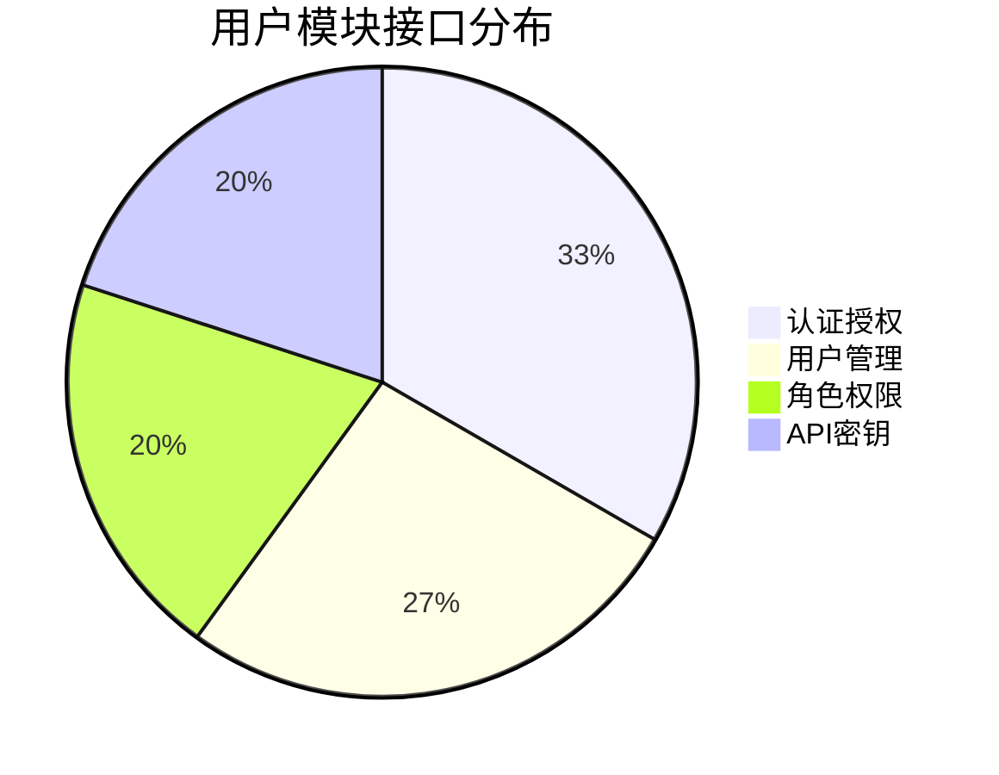
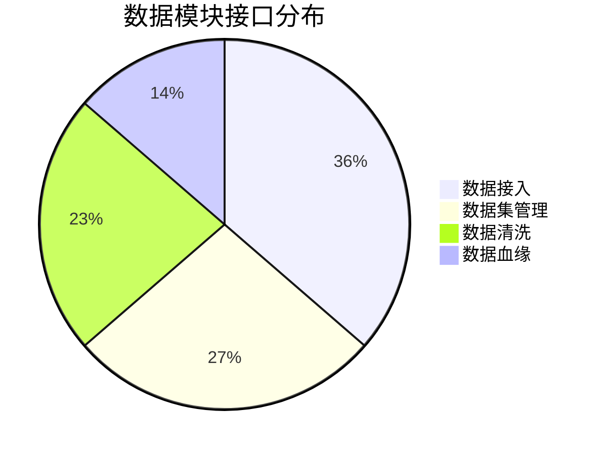
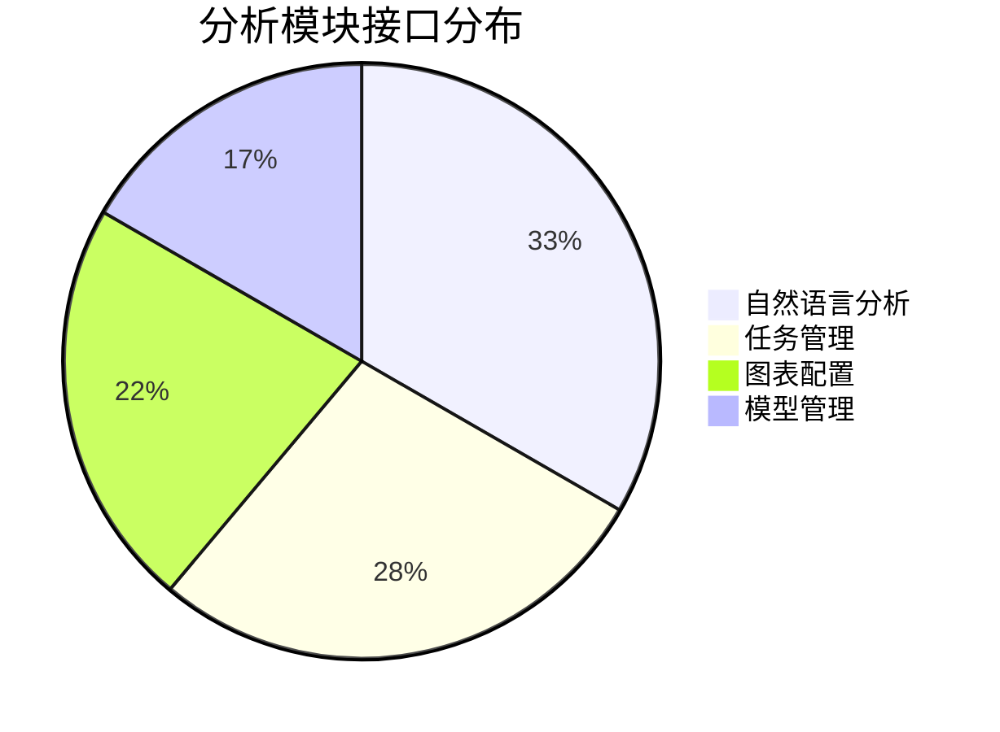
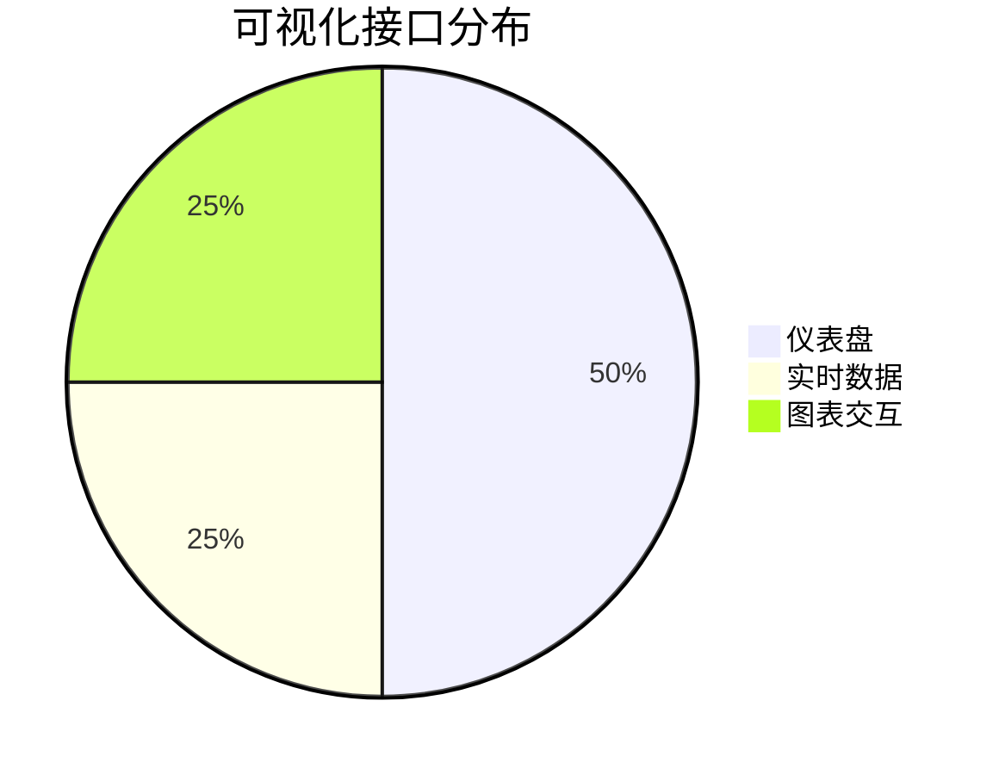
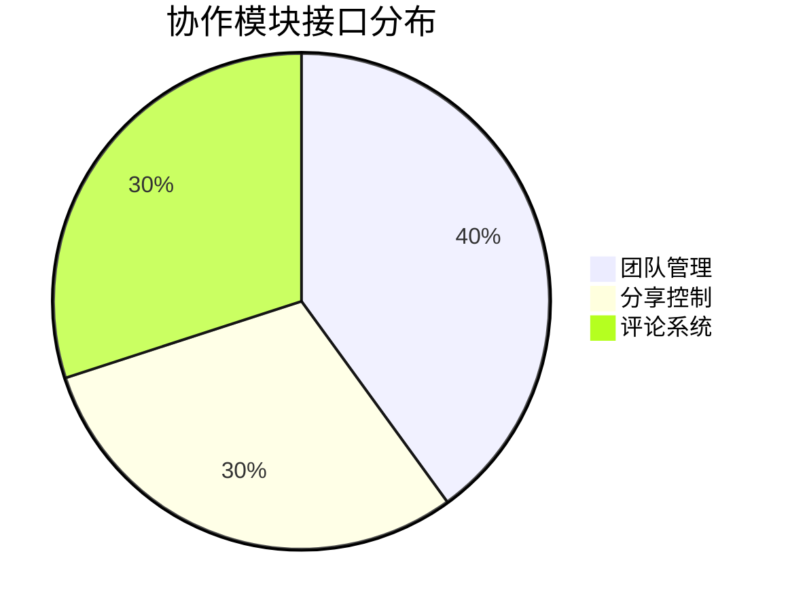
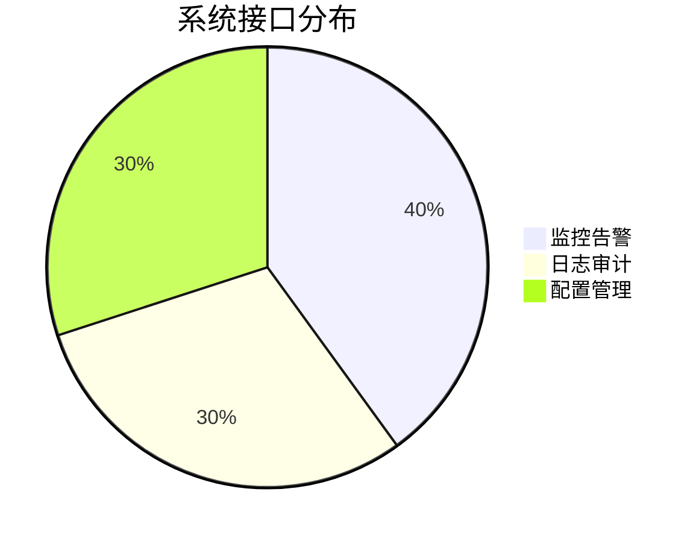
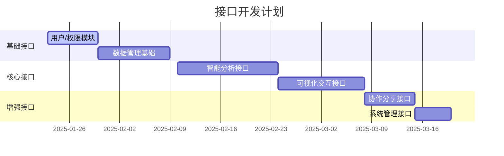

### **接口总量预估：约60-80个RESTful接口**
（根据功能复杂度会有±15%的调整空间）

---

### **按模块接口分布**

#### **1. 用户与权限模块（12-15个接口）**


**典型接口示例**：
- `POST /api/auth/login` 用户登录
- `POST /api/auth/refresh` 令牌刷新
- `GET /api/users/{userId}` 获取用户详情
- `PUT /api/roles/{roleId}/permissions` 修改角色权限
- `POST /api/apikeys` 生成API密钥

---

#### **2. 数据管理模块（18-22个接口）**


**典型接口**：
- `POST /api/datasets/upload-chunk` 分片上传
- `POST /api/datasets/{datasetId}/preview` 数据预览
- `PUT /api/datasets/{datasetId}/cleaning-rules` 更新清洗规则
- `GET /api/datasets/{datasetId}/lineage` 获取数据血缘

---

#### **3. 智能分析模块（15-18个接口）**


**典型接口**：
- `POST /api/analysis/nl2sql` 自然语言转SQL
- `GET /api/tasks/{taskId}/progress` 获取任务进度
- `POST /api/charts/{chartId}/export` 导出图表配置
- `PUT /api/models/{modelId}` 更新模型参数

---

#### **4. 可视化模块（10-12个接口）**


**典型接口**：
- `POST /api/dashboards` 创建仪表盘
- `PUT /api/dashboards/{dashboardId}/layout` 更新布局
- `GET /api/realtime/{metricId}/subscribe` 订阅实时数据
- `POST /api/charts/{chartId}/drill` 图表钻取操作

---

#### **5. 协作与分享（8-10个接口）**


**典型接口**：
- `POST /api/teams` 创建团队
- `PUT /api/shares/{shareId}/permission` 修改分享权限
- `DELETE /api/comments/{commentId}` 删除评论
- `GET /api/activities` 获取操作历史

---

#### **6. 系统管理（7-10个接口）**


**典型接口**：
- `GET /api/monitor/metrics` 获取系统指标
- `POST /api/alerts/rules` 创建告警规则
- `GET /api/logs/operations` 查询操作日志
- `PUT /api/configs/{configKey}` 更新系统配置

---

### **接口复杂度分级**
| 级别 | 说明                      | 占比  | 示例接口                         |
|------|--------------------------|-------|----------------------------------|
| S级  | 涉及事务/分布式锁         | 15%   | 数据分片上传提交                 |
| A级  | 复杂业务逻辑              | 30%   | 自然语言查询解析                 |
| B级  | 常规CRUD操作              | 45%   | 用户信息修改                     |
| C级  | 简单查询接口              | 10%   | 获取仪表盘列表                   |

---

### **接口开发工作量估算**


---

### **接口文档管理建议**
1. **工具选择**：
   - Swagger UI 3.0 自动生成文档
   - Postman 维护接口测试集合
   - Redoc 生成可发布文档

2. **版本控制**：
   ```bash
   # 接口版本管理
   /api/v1/auth/login
   /api/v2/datasets/upload
   ```

3. **安全规范**：
   - 敏感接口增加速率限制
   - 批量操作接口添加防重放机制
   - 数据导出接口进行内容扫描

---

该预估基于标准业务场景，实际接口数量可能因以下因素变化：
1. 第三方系统集成需求（如企业微信/钉钉登录）
2. 是否需要支持GraphQL端点
3. 是否采用微服务拆分架构
4. 数据导入导出格式的多样性要求

建议采用接口优先（API-First）开发模式，使用OpenAPI规范先设计后实现，可有效控制接口数量和质量。