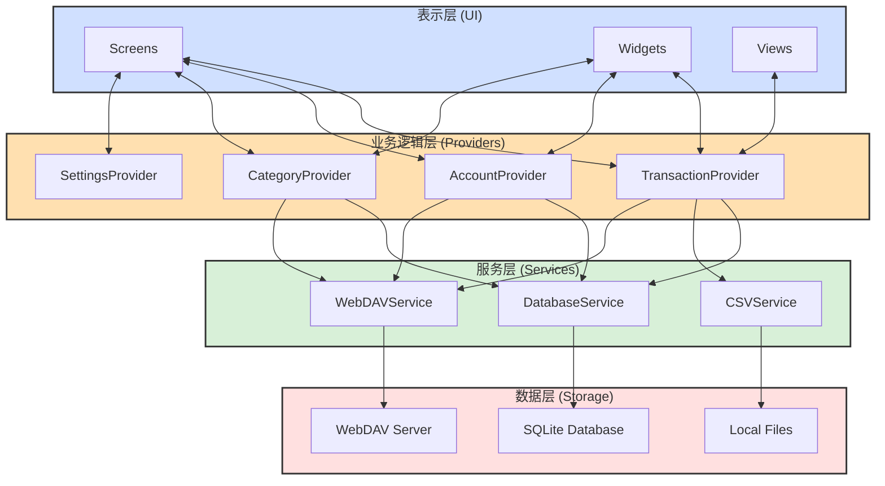
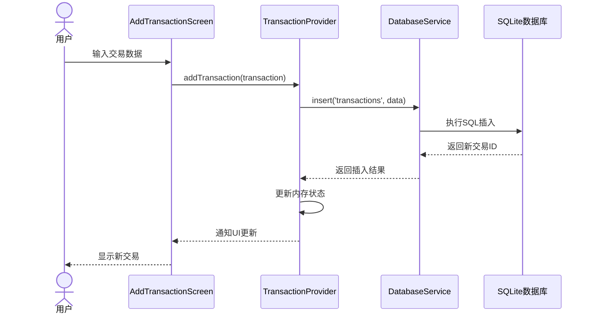
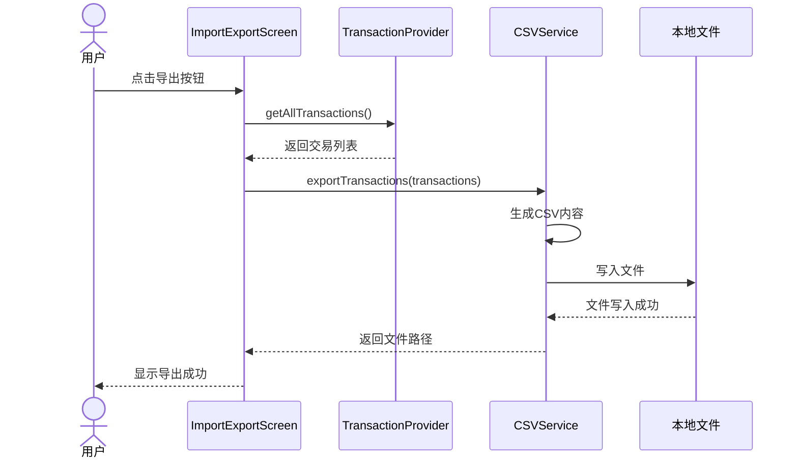
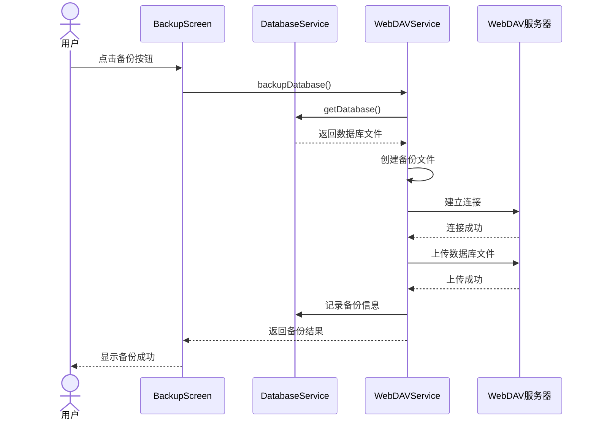
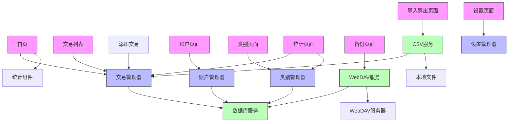
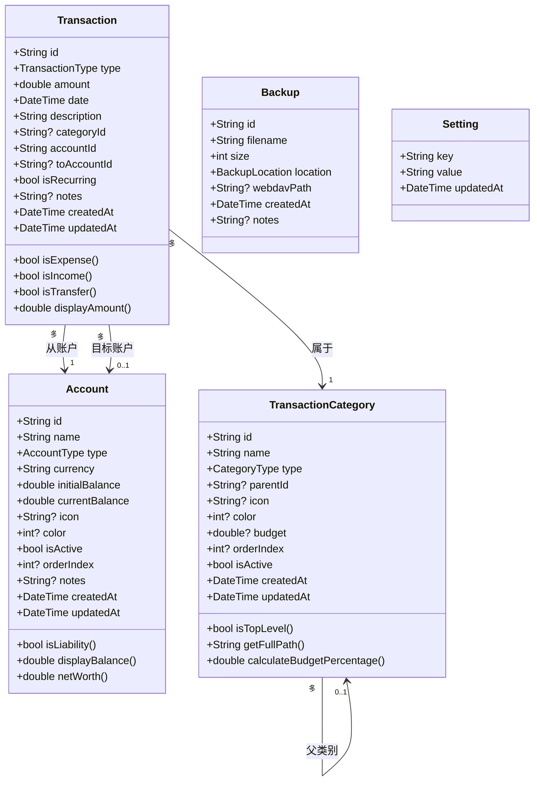
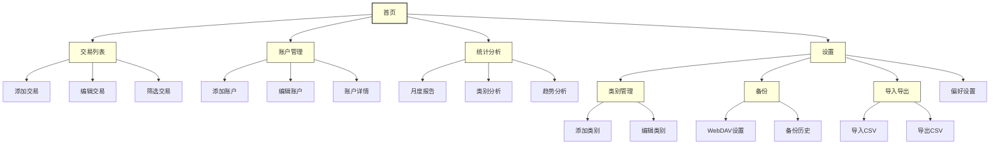

# 财务跟踪器 - 架构图

  

## 系统架构图

  

下面是财务跟踪器应用的系统架构图，展示了各个组件之间的关系和数据流。

  

  

## 数据流程图

  

以下是应用程序中典型数据流程的图示：

  

### 1. 添加交易流程

  

  

### 2. 导出CSV流程

  

  

### 3. WebDAV备份流程

  

  

## 组件关系图

  

下面是主要组件之间的关系图：

  

  

## 数据模型关系图

  

财务跟踪器应用中的数据模型之间的关系如下：

  

  

## 用户界面导航图

  

应用程序的屏幕导航结构如下：

  

