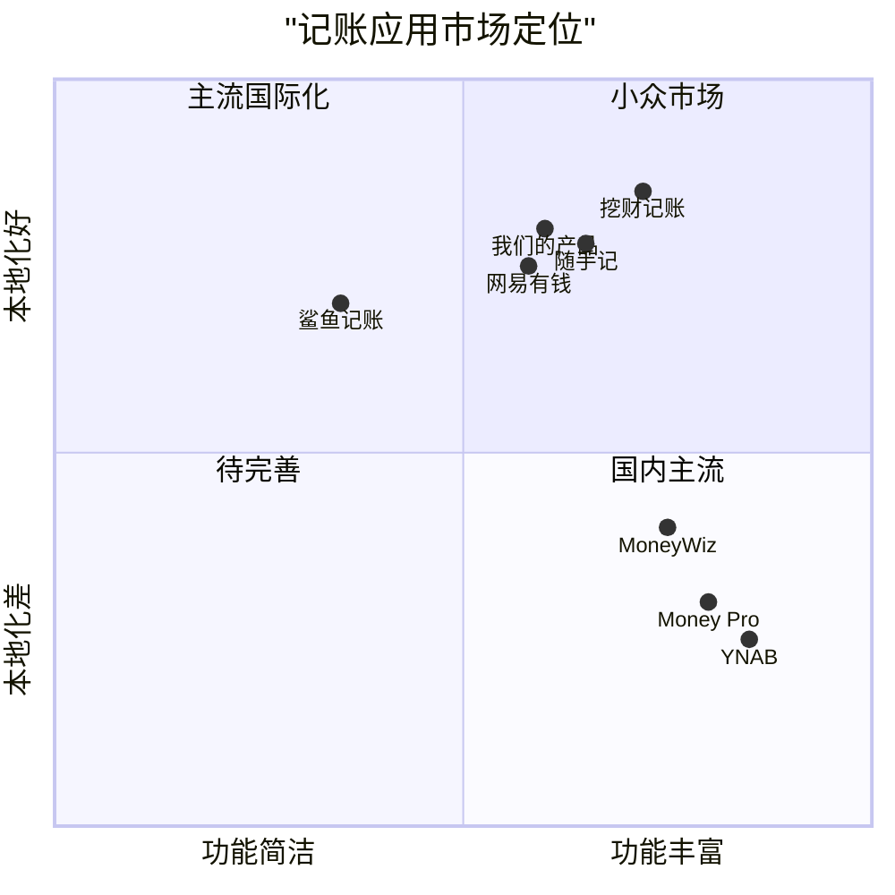

# 跨平台记账应用产品需求文档 (PRD)

## 项目信息

- **编程语言**: React, JavaScript
- **技术栈**: React + Tauri + Ant Design Mobile
- **项目名称**: expense_tracker
- **需求概述**: 开发一款跨平台记账应用，完美符合iOS风格，提供导入导出CSV数据功能、WebDAV同步功能、中文界面和简单的数据可视化分析

## 产品定义

### 产品目标

1. **简化记账流程**: 提供直观、高效的记账体验，使用户能够快速记录日常收支
2. **增强数据可视化**: 通过图表和分析工具帮助用户更好地理解自己的财务状况
3. **确保数据安全与同步**: 使用WebDAV技术实现多设备间的安全数据同步，保障用户数据安全

### 用户故事

1. **作为普通用户**，我希望能够轻松记录日常收支，以便于追踪我的财务状况
2. **作为注重数据分析的用户**，我希望能够通过可视化图表了解我的消费模式，以便于更好地规划预算
3. **作为多设备用户**，我希望能够在不同设备之间同步我的记账数据，以便于随时随地管理我的财务
4. **作为数据敏感的用户**，我希望能够导入导出我的记账数据，以便于备份或迁移到其他平台
5. **作为忙碌的职场人士**，我希望有简洁明了的界面和操作流程，以便于高效记账

### 竞品分析

1. **随手记**
   - 优点：功能全面，社区活跃，多平台支持
   - 缺点：界面复杂，广告较多，同步需要账号

2. **挖财记账**
   - 优点：智能导入账单，AI智能分类
   - 缺点：同步功能有限，iOS风格不够纯粹

3. **鲨鱼记账**
   - 优点：界面简洁，操作流畅
   - 缺点：数据分析不够深入，导出功能有限

4. **网易有钱**
   - 优点：多种图表分析，多账户管理
   - 缺点：WebDAV同步不支持，iOS风格适配不足

5. **Money Pro**
   - 优点：美观的iOS风格，强大的预算功能
   - 缺点：价格较高，本地化不足

6. **YNAB (You Need A Budget)**
   - 优点：优秀的预算管理理念，详细的分析报告
   - 缺点：订阅制价格高，WebDAV同步不支持

7. **MoneyWiz**
   - 优点：强大的报表功能，支持多种同步方式
   - 缺点：界面过于复杂，中文支持不够完善

### 竞品象限图



## 技术规格

### 需求分析

本记账应用需要实现以下关键功能：

1. **账目管理**
   - 记录收入和支出
   - 分类管理
   - 标签系统
   - 账户管理
   - 定期交易

2. **数据同步**
   - WebDAV同步功能
   - 多设备数据同步
   - 自动与手动同步选项

3. **数据导入导出**
   - CSV格式导入
   - CSV格式导出
   - 数据备份与恢复

4. **数据可视化**
   - 收支趋势图
   - 分类占比图
   - 月度预算进度
   - 年度财务概览

5. **用户界面**
   - iOS风格设计
   - 中文界面
   - 适配多种屏幕尺寸
   - 深色模式支持

### 需求池

#### P0级需求（必须实现）

1. **基础记账功能**
   - 必须支持添加、编辑、删除收支记录
   - 必须支持基础的收支分类
   - 必须支持多账户管理

2. **CSV导入导出**
   - 必须支持导出账目数据为CSV格式
   - 必须支持从CSV格式导入账目数据

3. **WebDAV同步**
   - 必须支持配置WebDAV服务器信息
   - 必须支持手动触发数据同步

4. **数据可视化**
   - 必须支持基础的收支占比饼图
   - 必须支持月度收支趋势图

5. **中文界面**
   - 必须提供完整的中文界面
   - 必须符合中文使用习惯

#### P1级需求（应该实现）

1. **高级记账功能**
   - 应该支持自定义分类和子分类
   - 应该支持添加标签
   - 应该支持记录备注和图片

2. **高级数据同步**
   - 应该支持自动定时同步
   - 应该支持冲突解决机制

3. **高级数据分析**
   - 应该支持年度财务报告
   - 应该支持自定义时间段的数据分析
   - 应该支持按分类/标签的消费分析

4. **界面增强**
   - 应该支持深色模式
   - 应该支持自定义应用主题色
   - 应该优化移动设备和桌面设备的使用体验

#### P2级需求（可以实现）

1. **高级功能**
   - 可以支持预算管理
   - 可以支持定期交易自动记录
   - 可以支持语音记账

2. **社交功能**
   - 可以支持多人共享账本
   - 可以支持财务目标设定和分享

3. **高级数据处理**
   - 可以支持OCR识别票据自动录入
   - 可以支持导入银行电子对账单
   - 可以支持导出更多数据格式

4. **其他增强**
   - 可以支持小组件快速记账
   - 可以支持财务数据密码保护
   - 可以支持自定义账本封面

### UI设计草图

#### 主界面布局

主界面将采用标准的iOS风格，包含以下元素：

- 顶部：状态栏、标题栏
- 中部：账目列表（时间轴形式）
- 底部：标签栏（首页、统计、添加、账户、设置）

#### 主要界面功能描述

1. **首页**
   - 当月收支概览
   - 最近交易记录（时间轴形式）
   - 快速添加按钮
   - 搜索功能

2. **统计页面**
   - 饼图展示分类占比
   - 折线图展示收支趋势
   - 时间段选择器
   - 详细数据表格

3. **添加记录页面**
   - 金额输入键盘
   - 分类选择器
   - 账户选择器
   - 日期选择器
   - 备注输入框
   - 图片添加功能

4. **账户页面**
   - 账户列表
   - 账户余额
   - 账户编辑功能

5. **设置页面**
   - WebDAV配置
   - 导入导出功能
   - 主题设置
   - 分类管理
   - 数据备份

### 开放问题

1. **性能优化**：如何确保在数据量大时保持良好的性能？
2. **安全性**：如何保证WebDAV同步的安全性和数据加密？
3. **用户体验**：如何在保持iOS风格的同时，确保跨平台的一致体验？
4. **同步冲突**：当多设备同时编辑同一条记录时，如何处理同步冲突？
5. **离线模式**：如何处理离线状态下的数据缓存和后续同步？

## 数据结构

### 核心数据模型

1. **交易记录 (Transaction)**
   ```json
   {
     "id": "唯一标识符",
     "type": "收入/支出/转账",
     "amount": "金额",
     "currency": "货币类型",
     "categoryId": "分类ID",
     "accountId": "账户ID",
     "date": "日期时间",
     "description": "描述",
     "tags": ["标签1", "标签2"],
     "pictures": ["图片URL1", "图片URL2"],
     "createdAt": "创建时间",
     "updatedAt": "更新时间",
     "syncStatus": "同步状态"
   }
   ```

2. **账户 (Account)**
   ```json
   {
     "id": "唯一标识符",
     "name": "账户名称",
     "type": "账户类型",
     "currency": "货币类型",
     "initialBalance": "初始余额",
     "currentBalance": "当前余额",
     "icon": "图标",
     "color": "颜色",
     "order": "排序权重",
     "isArchived": "是否归档",
     "createdAt": "创建时间",
     "updatedAt": "更新时间"
   }
   ```

3. **分类 (Category)**
   ```json
   {
     "id": "唯一标识符",
     "name": "分类名称",
     "type": "收入/支出",
     "parentId": "父分类ID",
     "icon": "图标",
     "color": "颜色",
     "order": "排序权重",
     "isDefault": "是否默认分类",
     "createdAt": "创建时间",
     "updatedAt": "更新时间"
   }
   ```

4. **标签 (Tag)**
   ```json
   {
     "id": "唯一标识符",
     "name": "标签名称",
     "color": "颜色",
     "createdAt": "创建时间",
     "updatedAt": "更新时间"
   }
   ```

5. **WebDAV配置 (WebDAVConfig)**
   ```json
   {
     "serverURL": "服务器URL",
     "username": "用户名",
     "password": "密码(加密存储)",
     "syncPath": "同步路径",
     "autoSync": "是否自动同步",
     "syncInterval": "同步间隔(分钟)",
     "lastSyncTime": "上次同步时间",
     "syncOnWifiOnly": "是否仅在WiFi环境下同步"
   }
   ```

## 功能流程

### 记账流程

1. 用户点击主界面的"+"按钮
2. 进入记账页面，选择记账类型（收入/支出/转账）
3. 输入金额
4. 选择分类
5. 选择账户
6. 设置日期（默认为当前日期）
7. 添加备注、标签、图片（可选）
8. 点击保存按钮完成记账
9. 数据保存到本地数据库
10. 如果启用了自动同步，触发WebDAV同步流程

### CSV导入流程

1. 用户进入设置页面，选择"导入数据"
2. 选择CSV文件来源（本地文件/WebDAV）
3. 选择目标CSV文件
4. 系统解析CSV文件结构
5. 展示CSV字段与系统字段的映射界面
6. 用户确认字段映射关系
7. 系统导入数据，显示导入进度
8. 导入完成后，展示导入结果统计（成功/失败数量）
9. 用户确认后返回设置页面

### CSV导出流程

1. 用户进入设置页面，选择"导出数据"
2. 选择导出数据范围（全部/时间段）
3. 选择导出目标（本地文件/WebDAV）
4. 系统导出数据为CSV格式，显示导出进度
5. 导出完成后，提供文件保存选项
6. 用户确认后返回设置页面

### WebDAV同步流程

1. 用户配置WebDAV服务器信息（URL、用户名、密码、同步路径）
2. 系统验证WebDAV连接是否成功
3. 用户选择同步选项（自动/手动，同步间隔）
4. 同步触发时（手动/自动）：
   - 系统检查网络连接状态
   - 系统获取远程数据文件列表
   - 比较本地和远程数据的更新时间戳
   - 解决数据冲突（如果存在）
   - 上传新增/修改的本地数据
   - 下载新增/修改的远程数据
   - 合并数据
   - 更新本地和远程数据文件
   - 记录同步时间和状态

### 数据可视化流程

1. 用户进入统计页面
2. 系统默认展示当月数据分析
3. 用户可选择不同时间段（日/周/月/年/自定义）
4. 系统根据选择的时间段展示：
   - 收支占比饼图
   - 收支趋势折线图
   - 分类消费排行榜
   - 月度预算进度条（如果设置了预算）
5. 用户可点击图表上的数据点查看详细信息
6. 用户可通过左右滑动切换不同的统计视图

## 非功能需求

### 性能要求

1. **启动时间**：应用启动至可操作界面显示时间不超过3秒
2. **交互响应**：用户操作响应时间不超过200毫秒
3. **数据处理**：1000条记录的导入/导出处理时间不超过10秒
4. **同步速度**：在良好网络条件下，100条记录的同步时间不超过5秒

### 兼容性要求

1. **操作系统**：支持Windows 10+, macOS 10.13+, Linux (主流发行版)
2. **屏幕适配**：支持桌面和平板电脑屏幕尺寸，最小支持分辨率为1280x720
3. **语言支持**：完全支持中文界面，预留其他语言扩展能力

### 安全要求

1. **数据加密**：本地存储的敏感数据（密码、金融信息）必须加密
2. **传输安全**：WebDAV同步必须使用HTTPS加密传输
3. **隐私保护**：不收集用户隐私数据，所有数据处理在本地完成

### 可靠性要求

1. **数据备份**：提供手动和自动备份功能，防止数据丢失
2. **错误恢复**：发生错误时能够恢复到上一个稳定状态
3. **离线工作**：确保无网络条件下基本功能正常使用

## 实现方案

### 技术栈选择

- **前端框架**：React
- **桌面应用打包**：Tauri
- **UI组件库**：Ant Design Mobile
- **状态管理**：Redux
- **本地数据库**：SQLite/IndexedDB
- **图表库**：ECharts/Chart.js

### 关键技术点

1. **Tauri与React集成**
   - 使用Tauri的API访问文件系统
   - 实现文件导入导出功能
   - 管理本地存储和数据库

2. **WebDAV同步实现**
   - 使用WebDAV客户端库实现同步功能
   - 处理数据冲突和合并
   - 确保数据一致性

3. **CSV处理**
   - 实现CSV解析和生成
   - 处理字段映射和数据转换
   - 支持批量导入导出

4. **数据可视化**
   - 使用图表库实现数据展示
   - 支持交互式数据分析
   - 优化移动设备上的图表体验

5. **iOS风格实现**
   - 基于Ant Design Mobile自定义iOS风格组件
   - 实现iOS风格的动画效果
   - 优化触控体验

## 用户体验设计

### 设计原则

1. **简洁明了**：界面简洁，功能一目了然，减少用户学习成本
2. **高效便捷**：常用功能触手可及，减少操作步骤
3. **可理解性**：使用通俗易懂的语言和图标，避免专业术语
4. **一致性**：保持iOS风格的设计语言一致性
5. **反馈及时**：操作后提供及时的视觉和触觉反馈

### 关键交互设计

1. **快速记账**：首页提供快速记账入口，最多3步完成记账
2. **数据展示**：使用卡片式布局和可视化图表直观展示财务状况
3. **手势操作**：支持左滑删除、下拉刷新等常见iOS手势
4. **键盘优化**：为金额输入提供专用数字键盘
5. **跨设备体验**：针对不同设备屏幕尺寸优化布局

## 测试策略

### 测试类型

1. **功能测试**：验证所有功能是否按预期工作
2. **性能测试**：验证应用在不同数据量下的性能表现
3. **兼容性测试**：验证应用在不同操作系统和屏幕尺寸下的表现
4. **安全测试**：验证数据加密和隐私保护措施
5. **用户体验测试**：收集用户反馈，优化交互设计

### 测试场景

1. **基础记账**：添加、编辑、删除记账记录
2. **数据同步**：测试WebDAV同步功能，包括冲突处理
3. **数据导入导出**：测试CSV导入导出功能
4. **数据可视化**：测试不同数据规模下的图表展示
5. **离线使用**：测试无网络环境下的应用表现

## 发布计划

### Phase 1: MVP版本（估计2个月）

- 完成基础记账功能
- 实现CSV导入导出
- 实现基础数据可视化
- 完成中文界面

### Phase 2: 完整版本（估计1个月）

- 实现WebDAV同步功能
- 增强数据可视化能力
- 优化iOS风格界面

### Phase 3: 增强版本（估计1个月）

- 添加预算管理功能
- 实现定期交易功能
- 增加高级数据分析工具

## 结论

本PRD详细定义了一款跨平台记账应用的产品需求，包括功能规格、技术实现方案和发布计划。该应用将使用React+Tauri+Ant Design Mobile技术栈实现，完美符合iOS风格，并提供导入导出CSV数据功能、WebDAV同步功能、中文界面和简单的数据可视化分析。

通过满足这些需求，该应用将为用户提供一个高效、可靠的个人财务管理工具，帮助用户更好地掌控自己的财务状况。