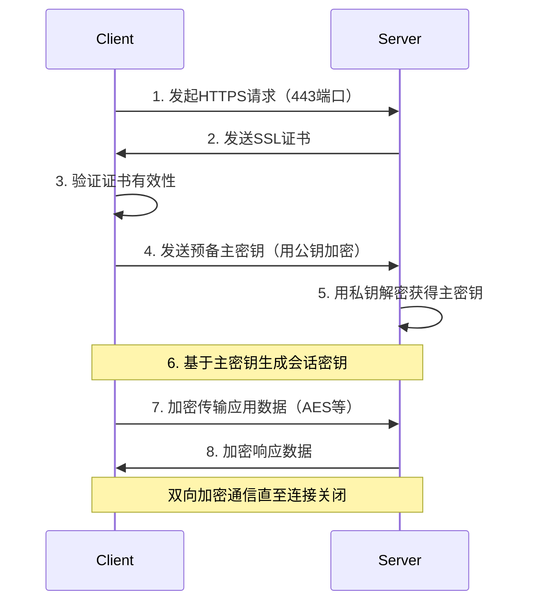

# OSI 七层模型

## 概述
- OSI（Open Systems Interconnection）模型是由国际标准化组织（ISO）制定的一个用于描述计算机网络通信的分层架构。
- 该模型将网络通信过程划分为七个相互关联的层次，每一层都承担特定的功能，确保不同系统和设备之间的有效通信。

## 详细

### 1. 物理层 (Physical Layer)
- **功能：** 在物理媒介（如电缆、光纤、无线电）上传输原始的比特流（0和1）。
- **数据单元：** 比特（Bit）。
- **设备：** **网卡**、集线器、中继器、调制解调器、电缆、光纤。
- **关注点：** 电压、信号速率、接口类型、传输介质等。

### 2. 数据链路层 (Data Link Layer)
- **功能：** 在物理层之上提供可靠的节点间数据传输。负责**帧的封装**、地址识别、错误检测与纠正、流量控制。
  - **MAC 子层：** 介质访问控制，处理物理地址（MAC地址），控制对共享介质的访问。
  - **LLC 子层：** 逻辑链路控制，提供错误恢复和流量控制。
- **数据单元：** 帧（Frame）。
- **设备：** 交换机、网桥、网络接口卡（NIC）。
- **协议示例：** 以太网（Ethernet）、Wi-Fi (802.11)、PPP。

### 3. 网络层 (Network Layer)
- **功能：** 处理数据包的**路由选择和转发**，管理逻辑地址（如IP地址），提供不同网络之间的**通信**。
- **数据单元：** 数据包（Packet）。
- **设备：** 路由器、三层交换机。
- **协议示例：** **IP（IPv4、IPv6）**、ICMP、IPsec、路由协议（OSPF、BGP）。

### 4. 传输层 (Transport Layer)
- **功能：** 提供**端到端的通信服务，确保数据的可靠传输和顺序**。负责分段、传输控制、错误检测与恢复、流量控制。
- **数据单元：** 段（Segment，对于TCP）或数据报（Datagram，对于UDP）。
- **协议示例：** **TCP（Transmission Control Protocol，面向连接、可靠）、UDP（User Datagram Protocol，无连接、不可靠）。**

### 5. 会话层 (Session Layer)
- **功能：** 管理用户会话，负责建立、维护和终止通信会话。提供对话控制、同步和会话恢复机制。
- **数据单元：** 数据（Data）。
- **应用：** 远程登录（如SSH）、会话管理服务。

### 6. 表示层 (Presentation Layer)
- **功能：** 处理数据的**格式化、编码、加密**，确保不同系统之间的数据可理解。
- **数据单元：** 数据（Data）。
- **应用：** 数据格式转换（如ASCII到UTF-8）、数据压缩、数据加密（如**SSL/TLS**）。

### 7. 应用层 (Application Layer)
- **功能：** 为用户和应用程序提供网络服务接口，支持各种网络应用和协议。
- **数据单元：** 数据（Data）。
- **协议和服务：** **HTTP、HTTPS、WebSocket、**FTP、SMTP、DNS、Telnet、SSH等。

## 数据传输过程（封装与解封装）
- **发送端（封装）：** 数据从应用层向下逐层传递，每一层都会添加自己的头部（和可能的尾部），形成该层的协议数据单元（PDU）。
    - 应用层：数据
    - 表示层：数据
    - 会话层：数据
    - 传输层：段（Segment）或 数据报（Datagram）
    - 网络层：数据包（Packet）
    - 数据链路层：帧（Frame）
    - 物理层：比特流（Bits）
- **接收端（解封装）：** 数据从物理层向上逐层传递，每一层都会解析并去除自己的头部（和可能的尾部），提取出上一层的数据。

## 实例：浏览器访问网站
1.  **应用层：** 浏览器构建HTTP请求报文。
2.  **表示层：** （可选）对HTTP请求进行加密（如HTTPS）。
3.  **会话层：** （可选）建立和管理会话（如TLS会话）。
4.  **传输层：** 将HTTP请求分割成TCP段，**每个段都添加TCP头部**（源/目标端口、序列号等）。
5.  **网络层：** 为每个段都添加IP头部（源/目标IP地址），将每个TCP段封装成IP数据包。
6.  **数据链路层：** 将IP数据包封装成**以太网**帧，添加MAC头部和尾部（源/目标MAC地址、FCS）。
7.  **物理层：** 将以太网帧转换为比特流，通过物理介质传输。

接收端过程相反，逐层解封装，最终提取出HTTP请求，Web服务器处理并返回HTTP响应。

## 重要概念
- **封装 (Encapsulation)：** 数据从上层向下层传输时，每一层添加头部（和可能的尾部）的过程。
- **解封装 (Decapsulation)：** 数据从下层向上层传输时，每一层去除头部（和可能的尾部）的过程。
- **协议数据单元 (PDU)：** 每一层的数据单元，例如帧、数据包、段。
- **TCP/IP 模型：** 实际网络中更常用的模型，通常分为四层：应用层、传输层、网络层、网络接口层（对应OSI的数据链路层和物理层）。

# 网络综合
## 浏览器输入URL请求资源过程
1. **DNS解析**：将域名解析成对应的IP地址
2. **建立TCP连接**：三次握手建立TCP连接
3. 向服务器发送请求
4. 服务器处理请求，响应客户端请求
5. 浏览器解析并渲染页面
6. **断开连接**：TCP四次挥手，断开连接

## DNS 解析过程
1. 浏览器缓存
2. 操作系统缓存
3. 本地DNS解析器缓存
4. 递归查询: 本地DNS服务器（一般由互联网提供商提供，如：中国移动）向根域名服务器（.com）、TLD域名服务器(baidu.com)、权威域名服务器(www.baidu.com)依次查询。
5. 返回IP地址
6. 浏览器使用IP地址访问网站

## Socket
- 操作系统提供的底层网络编程接口
- 应用程序通过Socket API使用TCP/UDP协议

## WebSocket
- 是应用层的协议
- 基于HTTP协议进行握手，建立连接
- 后续直接基于TCP进行双向的持久通信，不再依赖HTTP
# HTTP
## HTTP状态码
- 1XX: 信息性
- 2XX: 成功 (200 OK)
- 3XX: 重定向 (301永久, 302临时)
- 4XX: 客户端错误 (400, 401, 403, 404)
- 5XX: 服务器错误 (500, 502, 503)

## HTTP请求方法
- GET: 获取资源
- POST: 提交数据
- PUT: 更新资源
- DELETE: 删除资源
- ...

## HTTP版本
- HTTP/1.0: 每个请求/响应一个TCP连接
- HTTP/1.1: 持久连接（**TCP连接复用，存在队头阻塞**）, Host头更加复杂
- HTTP/2.0: 多路复用（同一个TCP连接中可以并发请求响应，但是如果出现丢包，整个TCP上的流传输都会被阻塞，仍然存在队头阻塞）。**二进制分帧**。 头部压缩。 服务器推送
- HTTP/3.0: 基于QUIC协议（QUIC 基于 UDP，自己实现了可靠传输和拥塞控制，一个流卡住不影响其他流）, 解决了TCP队头阻塞。内置TLS 1.3

## HTTPS
- HTTP + TLS/SSL（在HTTP应用层和TCP连接层之间添加的TLS/SSL协议）
- TLS握手建立安全连接
	- 信息加密，无法被窃取
	- 通过一系列校验机制，使得通信信息无法被篡改
	- **身份证书**：证明这个网站是真实的合法的
- **加密HTTP请求和响应数据**
- 默认传输数据（TCP连接）端口号为443，而HTTP是80

## URI, URL, URN
- URI: **统一资源标识符**，标识资源，**是一个抽象的概念**
- URL: 统一资源定位符，URI的子集，不仅有标识资源的效果，**还可以定位资源**（如：/index.html?name=test#section）
- URN: 统一资源名称，URI的子集，**持久标识资源**，但不提供定位信息
## HTTP长连接和超时机制
### 基本概念
- 短连接：单次请求即断开
- 长连接：复用TCP连接
### 实现方式
1. 协议层支持
   - HTTP/1.1默认
   - HTTP/1.0需显式声明
2. 参数控制
   - Keep-Alive头(`Keep-Alive: timeout=60, max=100`)
   - 服务端配置(如：使用nginx)
### 超时机制
1. 服务端超时
   - 空闲超时
   - 最大请求数
2. 客户端超时
   - 浏览器限制（Chrome是五分钟）
   - 编程超时设置(如axios的`timeout`参数)
3. 中间设备
   - 防火墙/NAT超时
## HTTPS工作流程

### 连接建立阶段
1. TCP三次握手（443端口）
2. TLS握手协议
   - 证书验证（CA链校验）

### 加密通信阶段
1. 会话密钥生成
   - 生成一个随机的对称秘钥，用证书的公钥加密。然后发送到服务器
2. 对称加密传输
   - 服务器接收到客户端发送的加密秘钥之后使用自己保存的私钥进行
   非对称解密得到客户端的秘钥。
   - 服务端使用客户端的秘钥对返回数据进行对称加密，即使用密文传输
   - 客户端接收到密文后使用自己的密钥进行对称解密

## 关键技术组成
- 非对称加密：证书验证
- 对称加密：数据传输
- 数字证书：身份认证