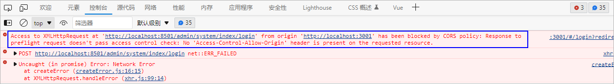
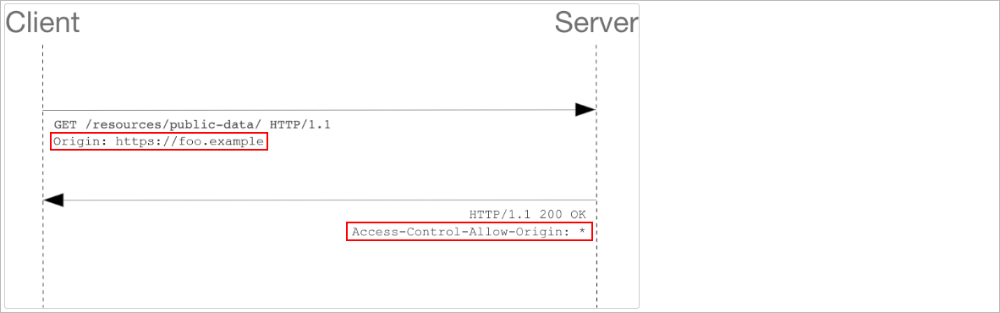
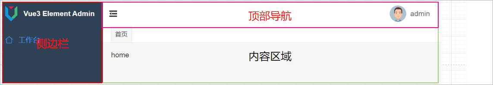
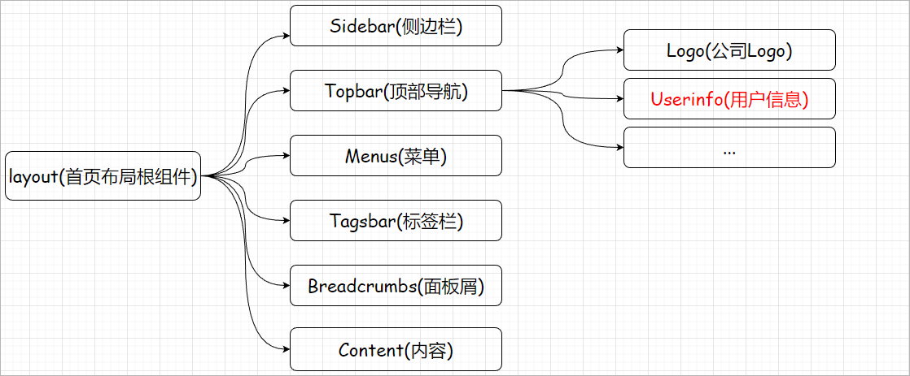

# 1 前端接入登录

当后端接口开发好了以后就可以让前端去请求该登录接口完成登录操作。

## 1.1 修改前端代码

修改src/utils/request.js更改基础请求路径

```javascript
const service = axios.create({
  baseURL: 'http://localhost:8501',    // 后端服务的ip地址和端口号
  timeout: 10000,
  withCredentials: true,
})
```

修改src/api/login.js更改登录接口地址

```javascript
// 登录接口
export const Login = data => {
  return request({
    url: '/admin/system/index/login',
    method: 'post',
    data,
  })
}
```

发送登录请求，那么此时会报一个错误：

 

报错的原因是因为此时的请求是一个跨域的请求。

## 1.2 跨域请求

### 1.2.1 跨域请求简介

跨域请求：通过一个域的JavaScript脚本和另外一个域的内容进行交互

域的信息：协议、域名、端口号

 

同域：当两个域的协议、域名、端口号均相同

如下所示：

 

**同源【域】策略**：在浏览器中存在一种安全策略就是同源策略，同源策略（Sameoriginpolicy）是一种约定，它是浏览器最核心也最基本的安全功能，如果缺少了同源策略，则浏览器的正常功能可能都会受到影响。可以说Web是构建在同源策略基础之上的，浏览器只是针对同源策略的一种实现。同源策略会阻止一个域的javascript脚本和另外一个域的内容进行交互。

### 1.2.2 COSR概述

#### （1）CORS简介

官网地址：https://developer.mozilla.org/en-US/docs/Web/HTTP/CORS

* CORS的全称为Cross-origin Resource Sharing，中文含义是**跨域资源共享**，

* CORS 是跨域的一种解决方案，CORS 给了web服务器一种权限：服务器可以选择是否允许跨域请求访问到它们的资源。

#### （2）CORS原理

* 浏览器将CORS请求分成两类：**简单请求** 和 **非简单请求**。

* 浏览器先根据同源策略对前端页面和后台交互地址做匹配，若同源，则直接发送数据请求；若不同源，则发送跨域请求。

* 当我们发起跨域请求时，如果是非简单请求，浏览器会帮我们自动触发预检请求，也就是 OPTIONS 请求，从而获知服务端是否允许该跨域请求，服务器确认允许之后，才发起实际的 HTTP 请求。

* 如果是简单请求，则不会触发预检，直接发出正常请求。

* 服务器收到浏览器跨域请求后，根据自身配置返回对应文件头。若未配置过任何允许跨域，则文件头里不包含 Access-Control-Allow-origin 字段，若配置过域名，则返回 Access-Control-Allow-origin + 对应配置规则里的域名的方式。

* 浏览器根据接收到的响应头里的 Access-Control-Allow-origin 字段做匹配，若无该字段，说明不允许跨域，从而抛出一个错误；若有该字段，则对字段内容和当前域名做比对，

* 如果同源，则说明可以跨域，浏览器接受该响应；

* 若不同源，则说明该域名不可跨域，浏览器不接受该响应，并抛出一个错误。

#### （3）简单请求

* 我们先来看两个条件：

```java
(1)HTTP请求方法是以下三种之一：
    ·HEAD
    ·GET
    ·POST
(2)只包含简单HTTP请求头，即：
    ·Accept,
    ·Accept-Language,
    ·Content-Language,
    ·Content-Type并且值是 application/x-www-form-urlencoded, multipart/form-data, 或者 text/plain之一的（忽略参数）。
```

```
注意：请求方式HEAD与GET和POST不同的是，Head请求并不会返回请求的资源，而是只返回该资源的头部信息，常用于需要得到服务器端文件的一些元数据信息，如文件大小、类型等，而不需要实际获取文件内容本身
```

* 当请求满足上面的两个条件时，则该请求被视为简单请求，否则被视为非简单请求。简单请求与非简单请求的最主要区别就是**跨域请求是否需要发送预检请求**（preflight request）。

* 简单请求的跨域请求响应流程：

 

在进行跨域请求时，如果是**简单请求**，则浏览器会在请求中增加一个**Origin请求头**之后直接发送CORS请求，服务器检查该请求头的值是否在服务器设置的CORS许可范围内，如果在许可范围内，则服务器同意本次请求，如果不在许可范围内，则服务会返回一个没有包含Access-Control-Allow-Origin 响应头的HTTP响应。

#### （4）非简单请求

非简单请求的跨域请求响应流程：


* 浏览器给服务器发送一个OPTIONS 方法的请求，该请求会携带下面两个内容：
   Access-Control-Request-Method: 实际请求要用到的方法
   Access-Control-Request-Headers: 实际请求会携带哪些头部字段

* 若是服务器接受后续请求，则这次预请求的响应体中会携带下面的一些内容：
  
   Access-Control-Allow-Methods表明服务 器允许客户端使用什么方法发起请求
   **Access-Control-Allow-Origin 允许跨域请求的域名，如果要允许所有域名则设置为***
   Access-Control-Allow-Headers将实际请 求所携带的首部字段告诉服务器
   Access-Control-Max-Age 指定了预检请求的结果能够被缓存多久，在有效时间内浏览器无需再为同一个请求发送预检请求

* 预检请求完毕之后，再发送实际请求

### 1.2.3 CORS解决跨域

后端服务器开启跨域支持：

方案一：在IndexController上添加**@CrossOrigin**注解

```java
@RestController
@RequestMapping(value = "/admin/system/index")
@CrossOrigin(allowCredentials = "true" , originPatterns = "*" , allowedHeaders = "*") // maxAge默认值是30min
public class IndexController {

}
```

弊端：每一个controller类上都来添加这样的一个接口影响开发效率、维护性较差

方案二：添加一个配置类配置跨域请求

```java
// com.atguigu.spzx.manager.config
@Component
public class WebMvcConfiguration implements WebMvcConfigurer {

    @Override
    public void addCorsMappings(CorsRegistry registry) {
        registry.addMapping("/**")      // 添加路径规则
                .allowCredentials(true)               // 是否允许在跨域的情况下传递Cookie
                .allowedOriginPatterns("*")           // 允许请求来源的域规则
                .allowedMethods("*")
                .allowedHeaders("*") ;                // 允许所有的请求头
    }

}
```

```
WebMvcConfigurer配置类其实是Spring内部的一种配置方式，采用JavaBean的形式来代替传统的xml配置文件形式进行针对框架个性化定制，可以自定义一些Handler，Interceptor，ViewResolver，MessageConverter。基于java-based方式的spring mvc配置，需要创建一个配置类并实现WebMvcConfigurer 接口；

扩展：
ClassPathXmlApplicationContext：基于XML 配置文件通常是使用ClassPathXmlApplicationContext来配置容器
AnnotationConfigApplicationContext：Java-based方式使用AnnotationConfigApplicationContext
```

# 2 图片验证码

## 2.1 图片验证码意义

验证码是全自动区分计算机和人类的图灵测试的缩写，是一种区分用户是计算机还是人的公共全自动程序，可以防止恶意破解密码、刷票、论坛灌水，有效防止某个黑客对某一个特定注册用户用特定程序暴力破解方式进行不断的登录尝试。

页面效果如下所示：

 

## 2.2 实现思路

整体的实现思路，如下图所示：

 

## 2.3 后端接口编写

### 2.3.1 实体类创建

创建一个实体类封装，给前端返回的验证码数据：

```java
// com.atguigu.spzx.model.vo.system;
@Data
public class ValidateCodeVo {

    private String codeKey ;        // 验证码的key
    private String codeValue ;      // 图片验证码对应的字符串数据

}
```

### 2.3.2 IndexController

在IndexController中添加获取验证码接口方法：

```java
@Autowired
private ValidateCodeService validateCodeService;

@GetMapping(value = "/generateValidateCode")
public Result<ValidateCodeVo> generateValidateCode() {
    ValidateCodeVo validateCodeVo = validateCodeService.generateValidateCode();
    return Result.build(validateCodeVo , ResultCodeEnum.SUCCESS) ;
}
```

### 2.3.3 ValidateCodeService

业务层代码实现：

```java
// com.atguigu.spzx.manager.service
public interface ValidateCodeService {

    // 获取验证码图片
    public abstract ValidateCodeVo generateValidateCode();

}

// com.atguigu.spzx.manager.service.impl
@Service
public class ValidateCodeServiceImpl implements ValidateCodeService {

    @Autowired
    private RedisTemplate<String , String> redisTemplate ;

    @Override
    public ValidateCodeVo generateValidateCode() {

        // 使用hutool工具包中的工具类生成图片验证码
        //参数：宽  高  验证码位数 干扰线数量
        CircleCaptcha circleCaptcha = CaptchaUtil.createCircleCaptcha(150, 48, 4, 20);
        String codeValue = circleCaptcha.getCode();
        String imageBase64 = circleCaptcha.getImageBase64();

        // 生成uuid作为图片验证码的key
        String codeKey = UUID.randomUUID().toString().replace("-", "");

        // 将验证码存储到Redis中
        redisTemplate.opsForValue().set("user:login:validatecode:" + codeKey , codeValue , 5 , TimeUnit.MINUTES);

        // 构建响应结果数据
        ValidateCodeVo validateCodeVo = new ValidateCodeVo() ;
        validateCodeVo.setCodeKey(codeKey);
        validateCodeVo.setCodeValue("data:image/png;base64," + imageBase64);

        // 返回数据
        return validateCodeVo;
    }

}
```

```
知识点补充：data:image/png;base64

data:image/png;base64, 字符串... 这个表示什么意思，又有什么作用呢？
其实这就是所谓的 Data URI scheme。 直译过来的意思是：URI 数据处理方案.

作用：
Data URI scheme 是在 RFC2397 中定义的，目的是将一些小的数据，直接嵌入到网页中，从而不用再从外部文件载入。减少对 HTTP 的请求次数。达到优化网页的效果。
实质：
base64 后面那一串字符，其实是一张图片，将这些字符串复制粘贴到浏览器的中打开，就能看到图片了
```

## 2.4 前端接入

### 2.4.1 实现思路

整体实现思路：

1、登录表单中添加验证码表单项，绑定对应的数据模型

2、添加验证码输入框校验规则

3、在api/login.js中添加请求后端获取验证码接口方法

4、在首页中使用vue的onMounted钩子函数发送请求获取图片验证码

### 2.4.2 代码实现

#### （1）修改登录页面

修改views/login/index.vue

```html
<!--登录页面-->
<template>
  <div class="login">
    <el-form class="form" :model="model" :rules="rules" ref="loginForm">
      <h1 class="title">尚品甄选后台管理系统</h1>
      <el-form-item prop="userName">
        <el-input
          class="text"
          v-model="model.userName"
          prefix-icon="User"
          clearable
          :placeholder="$t('login.username')"
        />
      </el-form-item>
      <el-form-item prop="password">
        <el-input
          class="text"
          v-model="model.password"
          prefix-icon="Lock"
          show-password
          clearable
          :placeholder="$t('login.password')"
        />
      </el-form-item>

      <el-form-item prop="captcha">
          <div class="captcha">
              <el-input
                        class="text"
                        v-model="model.captcha"
                        prefix-icon="Picture"
                        placeholder="请输入验证码"
                        ></el-input>
              
          </div>
      </el-form-item>

      <el-form-item>
        <el-button
          :loading="loading"
          type="primary"
          class="btn"
          size="large"
          @click="submit"
        >
          {{ btnText }}
        </el-button>
      </el-form-item>
    </el-form>
  </div>
  <div class="change-lang">
    <change-lang />
  </div>
</template>

<script>
import {
  defineComponent,
  getCurrentInstance,
  reactive,
  toRefs,
  ref,
  computed,
  onMounted,
  watch,
} from 'vue'
import { Login , GetValidateCode } from '@/api/login'
import { useRouter, useRoute } from 'vue-router'
import ChangeLang from '@/layout/components/Topbar/ChangeLang.vue'
import useLang from '@/i18n/useLang'
import { useApp } from '@/pinia/modules/app'

export default defineComponent({
  components: { ChangeLang },
  name: 'login',
  setup() {
    const { proxy: ctx } = getCurrentInstance() // 可以把ctx当成vue2中的this
    const router = useRouter()
    const route = useRoute()
    const { lang } = useLang()
    watch(lang, () => {
      state.rules = getRules()
    })
    const getRules = () => ({
      userName: [
        {
          required: true,
          message: ctx.$t('login.rules-username'),
          trigger: 'blur',
        },
      ],
      password: [
        {
          required: true,
          message: ctx.$t('login.rules-password'),
          trigger: 'blur',
        },
        {
          min: 6,
          max: 12,
          message: ctx.$t('login.rules-regpassword'),
          trigger: 'blur',
        },
      ],
      captcha: [
        {
            required: true,
            message: ctx.$t('login.rules-validate-code'),
            trigger: 'blur',
        },
      ],

    })

    // onMounted钩子函数
    onMounted(() => {
      state.refreshCaptcha()
    })

    const state = reactive({
      model: {
        userName: 'admin',
        password: '111111',
        captcha: '',      // 用户输入的验证码
        codeKey: ''       // 后端返回的验证码key
      },
      rules: getRules(),
      loading: false,
      captchaSrc: "" ,
      refreshCaptcha: async () => {
          const { data } = await GetValidateCode() ;
          state.model.codeKey = data.codeKey
          state.captchaSrc = data.codeValue
      },
      btnText: computed(() =>
        state.loading ? ctx.$t('login.logining') : ctx.$t('login.login')
      ),
      loginForm: ref(null),
      submit: () => {
        if (state.loading) {
          return
        }
        state.loginForm.validate(async valid => {
          if (valid) {
            state.loading = true
            const { code, data, message } = await Login(state.model)
            if (+code === 200) {
              ctx.$message.success({
                message: ctx.$t('login.loginsuccess'),
                duration: 1000,
              })

              const targetPath = decodeURIComponent(route.query.redirect)
              if (targetPath.startsWith('http')) {
                // 如果是一个url地址
                window.location.href = targetPath
              } else if (targetPath.startsWith('/')) {
                // 如果是内部路由地址
                router.push(targetPath)
              } else {
                router.push('/')    // 请求成功以后，进入到首页
              }
              useApp().initToken(data)
            } else {
              ctx.$message.error(message)
            }
            state.loading = false
          }
        })
      },
    })

    return {
      ...toRefs(state),
    }
  },
})
</script>

<style lang="scss" scoped>
.login {
  transition: transform 1s;
  transform: scale(1);
  width: 100%;
  height: 100%;
  overflow: hidden;
  background: #2d3a4b;
  .form {
    width: 520px;
    max-width: 100%;
    padding: 0 24px;
    box-sizing: border-box;
    margin: 160px auto 0;
    :deep {
      .el-input__wrapper {
        box-shadow: 0 0 0 1px rgba(255, 255, 255, 0.1) inset;
        background: rgba(0, 0, 0, 0.1);
      }
      .el-input-group--append > .el-input__wrapper {
        border-top-right-radius: 0;
        border-bottom-right-radius: 0;
      }
      .el-input-group--prepend > .el-input__wrapper {
        border-top-left-radius: 0;
        border-bottom-left-radius: 0;
      }
    }
    .title {
      color: #fff;
      text-align: center;
      font-size: 24px;
      margin: 0 0 24px;
    }
    .text {
      font-size: 16px;
      :deep(.el-input__inner) {
        color: #fff;
        height: 48px;
        line-height: 48px;
        &::placeholder {
          color: rgba(255, 255, 255, 0.2);
        }
      }
    }
    .btn {
      width: 100%;
    }
  }
}

.captcha {
  display: flex;
  align-items: center;
  justify-content: space-between;
  margin-bottom: 10px;
}

.captcha img {
  cursor: pointer;
  margin-left: 20px;
}

.change-lang {
  position: fixed;
  right: 20px;
  top: 20px;
  :deep {
    .change-lang {
      height: 24px;
      &:hover {
        background: none;
      }
      .icon {
        color: #fff;
      }
    }
  }
}
</style>
```

#### （2）修改国际化文件

在国际化文件(i18n/locals/zh-cn/login.js)中添加提示信息：

```json
'rules-validate-code': '验证码不能为空'
```

#### （3）修改login.js

在api/login.js中添加请求后端获取验证码接口方法

```java
// 获取验证码
export const GetValidateCode = () => {
  return request({
    url: "/admin/system/index/generateValidateCode",
    method: 'get'
  })
}
```

## 2.5 校验验证码

对之前的登录方法进行修改，添加校验验证码的逻辑代码。

步骤：

1、实体类修改

```java
// com.atguigu.spzx.model.dto.system
@Data
public class LoginDto {

    private String userName ;
    private String password ;
    private String captcha ;
    private String codeKey ;

}
```

2、SysUserServiceImpl登录login方法修改

```java
@Override
public LoginVo login(LoginDto loginDto) {

    // 校验验证码是否正确
    String captcha = loginDto.getCaptcha();     // 用户输入的验证码
    String codeKey = loginDto.getCodeKey();     // redis中验证码的数据key

    // 从Redis中获取验证码
    String redisCode = redisTemplate.opsForValue().get("user:login:validatecode:" + codeKey);
    if(StrUtil.isEmpty(redisCode) || !StrUtil.equalsIgnoreCase(redisCode , captcha)) {
        throw new GuiguException(ResultCodeEnum.VALIDATECODE_ERROR) ;
    }

    // 验证通过删除redis中的验证码
    redisTemplate.delete("user:login:validatecode:" + codeKey) ;

//..................
```

# 3 获取用户信息接口

## 3.1 前端源码分析

需求说明：当登录成功以后，那么此时会调用后端接口获取登录成功以后的用户信息，然后在首页面展示

前置路由守卫：在当前的系统中提供了前置路由守卫，在该前置路由守卫中会调用后端服务器端口获取用户信息。

### 3.1.1 请求发送分析

前置路由守卫的配置在permission.js，该文件以及被main.js引入。因此查看源码以当前js为入口进行分析：

**permission.js**

```javascript
// vue-router4的路由守卫不再是通过next放行，而是通过return返回true或false或者一个路由地址
router.beforeEach(async to => {

  if (!window.localStorage[TOKEN]) {  // 如果token不存在，此时跳转到登录页面
    return {
      name: 'login',
      query: {
        redirect: to.fullPath, // redirect是指登录之后可以跳回到redirect指定的页面
      },
      replace: true,
    }
  } else {        // token存在
    const { userinfo, getUserinfo } = useAccount()        // 从pinia的用于账户模块解析出userinfo，getUserInfo方法
    // 获取用户角色信息，根据角色判断权限
    if (!userinfo) {
      try {
        // 获取用户信息
        await getUserinfo()        // 调用getUserInfo方法获取用户数据
      } catch (err) {
        loadingInstance.close()
        return false
      }
      return to.fullPath
    }
  }
})
```

**pinia/modules/account.js**源码分析

```javascript
import { GetUserinfo } from '@/api/login'
export const useAccount = defineStore('account', {
  state: () => ({
    userinfo: null,     // pinia账户模块存储的用户信息
    permissionList: [],
  }),
  actions: {
    // 清除用户信息
    clearUserinfo() {
      this.userinfo = null
    },
    // 获取用户信息
    async getUserinfo() {
      const { code, data } = await GetUserinfo()  // 调用/api/login.js中的GetUserinfo方法，请求后端接口
      if (+code === 200) {
        this.userinfo = data
        return Promise.resolve(data)
      }
    },
  },
})
```

**api/login.js**源码分析：

```javascript
// 获取登录用户信息
export const GetUserinfo = () => {
  return request({
    url: '/api/userinfo',        // 请求后端的接口地址，后期需要将其更改为
    method: 'get',
  })
}
```

### 3.1.2 用户信息使用

获取到当前登录成功以后的用户信息，将用户信息存储到Pinia的account模块中以后，该用户信息会在首页的进行使用。首页布局分析，以及对应的组

件说明：

 

涉及到的核心组件关系说明：

 

layout/components/Topbar/Userinfo.vue组件源码分析：

```javascript
<template>
  <el-dropdown trigger="hover">
    <div class="userinfo">
      <template v-else>
          <!-- 从user对象中获取avatar属性值 -->
        {{ userinfo.name }}  <!-- 从user对象中获取name属性值 -->
      </template>
    </div>
  </el-dropdown>
</template>
<script>
import { useUserinfo } from '@/components/Avatar/hooks/useUserinfo'  // 导入该目录下useUserinfo.文件
export default defineComponent({
  setup() {
    const { userinfo } = useUserinfo()  // 调用导入的js文件中的useUserinfo方法，从Pinia中获取用户数据 
    return {
      userinfo,
    }
  },
})
</script>
```

通过源码查询得出结论：后端返回的数据中需要至少包含两个属性：avatar【用户头像的url】、name【用户名】

### 3.1.3 token传递

当登录成功以后，后端会给前端返回token数据。前端会将token数据存储到Pinia的app模块中。并且会将token数据保存到localStorage中。当再次请

求获取登录用户信息接口的时候，就需要将token传递到后端。

token的传递是通过axios的请求前置拦截器进行完成的，源码如下所示：utils/request.js

```javascript
// 拦截请求
service.interceptors.request.use(
  config => {
    const { authorization } = useApp()   // 从Pinia的app模块中获取登录成功以后的用户数据
    if (authorization) {

      // 添加一个请求头Authorization ， 该请求头所对应的值为：Bearer token数据
      //config.headers.Authorization = `Bearer ${authorization.token}`

      // 上传传递方式后端解析太麻烦，因此可以更改传递token方式为如下方式
      config.headers.token = `${authorization.token}`

    }
    return config
  },
  error => {
    // console.log(error);
    return Promise.reject(error)
  }
)
```

```
JWT授权为啥要在 Authorization标头里加个Bearer 呢
设计 API 授权，或者调用第三方 API 时，经常会接触到：

Authorization : Bearer Toke

有没有疑惑为何不直接写成这样就得了：
Authorization : Token

这是因为 W3C 的 HTTP 1.0 规范，Authorization 的格式是：
Authorization: <type> <authorization-parameters>
所以 Bearer 是授权的类型，常见的授权类型还有：

Basic 用于 http-basic 认证；
Bearer 常见于 OAuth 和 JWT 授权；
Digest MD5 哈希的 http-basic 认证 (已弃用)
AWS4-HMAC-SHA256 AWS 授权
```

## 3.2 后端接口

### 3.2.1 IndexController

IndexController中添加如下接口方法：

```java
@GetMapping(value = "/getUserInfo")
public Result<SysUser> getUserInfo(@RequestHeader(name = "token") String token) {
    SysUser sysUser = sysUserService.getUserInfo(token) ;
    return Result.build(sysUser , ResultCodeEnum.SUCCESS) ;
}
```

### 3.2.2 SysUserService

SysUserService添加根据token获取用户数据接口方法：

```java
// com.atguigu.spzx.manager.service.impl.SysUserServiceImpl
public SysUser getUserInfo(String token) {
    String userJson = redisTemplate.opsForValue().get("user:login:" + token);
    return JSON.parseObject(userJson , SysUser.class) ;
}
```

## 3.3 前端接入

更改前端发送请求的接口地址：api/login.js

```javascript
// 获取登录用户信息
export const GetUserinfo = () => {
  return request({
    url: '/admin/system/index/getUserInfo',
    method: 'get',
  })
}
```

# 4 进入首页

获取登录用户信息的接口开发完毕以后，此时还是无法进入到首页。因为在前置路由守卫中还存一段代码是获取当前登录用户的菜单信息，源码如下所示：permission.js

```javascript
// 生成菜单（如果你的项目有动态菜单，在此处会添加动态路由）
const { menus, generateMenus } = useMenus()
if (menus.length <= 0) {
    try {
        await generateMenus()
        return to.fullPath // 添加动态路由后，必须加这一句触发重定向，否则会404
    } catch (err) {
        loadingInstance.close()
        return false
    }
}
```

当前先不做动态菜单的功能，因此需要把获取动态菜单的代码注释掉：pinia/modules/menu.js

```javascript
const generateMenus = async () => {

    // // 方式一：只有固定菜单
    const menus = getFilterMenus(fixedRoutes)
    setMenus(menus)

    // 方式二：有动态菜单
    // 从后台获取菜单
    // const { code, data } = await GetMenus()

    // if (+code === 200) {
    //   // 添加路由之前先删除所有动态路由
    //   asyncRoutes.forEach(item => {
    //     router.removeRoute(item.name)
    //   })
    //   // 过滤出需要添加的动态路由
    //   const filterRoutes = getFilterRoutes(asyncRoutes, data)
    //   filterRoutes.forEach(route => router.addRoute(route))

    //   // 生成菜单
    //   const menus = getFilterMenus([...fixedRoutes, ...filterRoutes])
    //   setMenus(menus)
    // }

}
```

# 5 退出功能

## 5.1 需求分析

需求：用户在首页点击退出按钮，那么此时请求后端接口完成退出

实现思路：

1、后端根据token从Redis中删除用户数据

2、前端清空Pinia中保存的用户数据、从localStorage中删除用户token

## 5.2 代码实现

### 5.2.1 后端接口

#### IndexController

在IndexController中添加接口方法

标记：可以改为delete方式

```java
@GetMapping(value = "/logout")
public Result logout(@RequestHeader(value = "token") String token) {
    sysUserService.logout(token) ;
    return Result.build(null , ResultCodeEnum.SUCCESS) ;
}
```

#### SysUserService

```java
@Override
public void logout(String token) {
    redisTemplate.delete("user:login:" + token) ;
}
```

### 5.2.2 前端接入

#### login.js

在src\api\login.js文件中添加如下代码：

```javascript
// 退出功能
export const Logout = () => {
    return request({
        url: '/admin/system/index/logout',
        method: 'get',
    })
}
```

#### Userinfo.vue

修改layout\components\Topbar\Userinfo.vue的退出方法代码：

```vue
<script>
import { useRouter } from 'vue-router'
import { useUserinfo } from '@/components/Avatar/hooks/useUserinfo'
import LockModal from './LockModal.vue'
import { useApp } from '@/pinia/modules/app'

import { defineComponent , getCurrentInstance} from 'vue'
import { Logout } from '@/api/login'

export default defineComponent({
  components: {
    LockModal,
  },
  setup() {
    const router = useRouter()

    const { userinfo } = useUserinfo()

    const { proxy: ctx } = getCurrentInstance() // 可以把ctx当成vue2中的this

    // 退出
    const logout = async () => {
        const { code ,  data , message } = await Logout() ;
        if(code == 200) {
            // 清除token
            useApp().clearToken()

            router.push('/login')
        }else {
            ctx.$message.error(message)
        }

    }

    return {
        userinfo,
        logout,
    }
  },
})
</script>
```

# 6 登录校验

## 6.1 需求说明

后台管理系统中除了登录接口、获取验证码的接口在访问的时候不需要验证用户的登录状态，其余的接口在访问的时候都必须要求用户登录成功以后才可以进行访问。

## 6.2 实现思路

具体的实现流程如下所示：

  

注意：

1、请求url的判断可以通过拦截规则配置进行实现

2、更新Redis中数据的存活时间的主要目的就是为了保证用户在使用该系统的时候，Redis中会一直保证用户的登录状态，如果用户在30分钟之内没有使用该系统，那么此时登录超时。此时用户就需要重新进行登录。

3、将从Redis中获取到的用户存储到ThreadLocal中，这样在一次请求的中就可以在controller、service、mapper中获取用户数据

## 6.3 ThreadLocal

完成该功能需要使用到ThreadLocal，ThreadLocal是jdk所提供的一个线程工具类，叫做线程变量，意思是ThreadLocal中填充的变量属于当前线程，该变量对其他线程而言是隔离的，也就是说该变量是当前线程独有的变量，使用该工具类可以实现在同一个线程进行数据的共享。

代码如下所示：

```java
public class ThreadLocalTest {

    // 创建一个ThreadLocal对象
    private static final ThreadLocal<SysUser> threadLocal = new ThreadLocal<>() ;

    public static void main(String[] args){

        // 在主线程中创建SysUser对象
        SysUser sysUser = new SysUser() ;
        sysUser.setUserName("admin");
        sysUser.setAvatar("https://oss.aliyuncs.com/aliyun_id_photo_bucket/default_handsome.jpg");
        sysUser.setId(1L);

        // 将数据存储到ThreadLocal中
        threadLocal.set(sysUser);

        // 调用show方法,由于show方法main方法使用的是同一个线程，因此show方法中可以直接从ThreadLocal中获取数据
        show() ;

    }

    private static void show() {
        SysUser sysUser = threadLocal.get();
        System.out.println(sysUser);
    }

}
```

## 6.4 AuthContextUtil

在common-util模块中中创建一个AuthContextUtil类对ThreadLocal进行封装，代码如下所示：

```java
// com.atguigu.spzx.utils
public class AuthContextUtil {

    // 创建一个ThreadLocal对象
    private static final ThreadLocal<SysUser> threadLocal = new ThreadLocal<>() ;

    // 定义存储数据的静态方法
    public static void set(SysUser sysUser) {
        threadLocal.set(sysUser);
    }

    // 定义获取数据的方法
    public static SysUser get() {
        return threadLocal.get() ;
    }

    // 删除数据的方法
    public static void remove() {
        threadLocal.remove();
    }

}
```

## 6.5 拦截器使用

### 6.5.1 拦截器开发

在spzx-manager服务中创建一个拦截器，代码如下：

包：com.atguigu.spzx.interceptor

```java
@Component
public class LoginAuthInterceptor implements HandlerInterceptor {

    @Autowired
    private RedisTemplate<String , String> redisTemplate ;

    @Override
    public boolean preHandle(HttpServletRequest request, HttpServletResponse response, Object handler) throws Exception {

        // 获取请求方式
        String method = request.getMethod();
        if("OPTIONS".equals(method)) {      // 如果是跨域预检请求，直接放行
            return true ;
        }

        // 获取token
        String token = request.getHeader("token");
        if(StrUtil.isEmpty(token)) {
            responseNoLoginInfo(response) ;
            return false ;
        }

        // 如果token不为空，那么此时验证token的合法性
        String sysUserInfoJson = redisTemplate.opsForValue().get("user:login:" + token);
        if(StrUtil.isEmpty(sysUserInfoJson)) {
            responseNoLoginInfo(response) ;
            return false ;
        }

        // 将用户数据存储到ThreadLocal中
        SysUser sysUser = JSON.parseObject(sysUserInfoJson, SysUser.class);
        AuthContextUtil.set(sysUser);

        // 重置Redis中的用户数据的有效时间
        redisTemplate.expire("user:login:" + token , 30 , TimeUnit.MINUTES) ;

        // 放行
        return true ;
    }

    //响应208状态码给前端
    private void responseNoLoginInfo(HttpServletResponse response) {
        Result<Object> result = Result.build(null, ResultCodeEnum.LOGIN_AUTH);
        PrintWriter writer = null;
        response.setCharacterEncoding("UTF-8");
        response.setContentType("text/html; charset=utf-8");
        try {
            writer = response.getWriter();
            writer.print(JSON.toJSONString(result));
        } catch (IOException e) {
            e.printStackTrace();
        } finally {
            if (writer != null) writer.close();
        }
    }

    @Override
    public void afterCompletion(HttpServletRequest request, HttpServletResponse response, Object handler, Exception ex) throws Exception {
        AuthContextUtil.remove();  // 移除threadLocal中的数据
    }
}
```

### 6.5.2 拦截器注册

想让拦截器生效，那么此时就需要将拦截器注册到Spring MVC中，具体的代码如下所示：

```java
@Component
public class WebMvcConfiguration implements WebMvcConfigurer {

    @Autowired
    private LoginAuthInterceptor loginAuthInterceptor ;

    @Override
    public void addInterceptors(InterceptorRegistry registry) {
        registry.addInterceptor(loginAuthInterceptor)
                .excludePathPatterns("/admin/system/index/login" , "/admin/system/index/generateValidateCode")
                .addPathPatterns("/**");
    }
}
```

## 6.6 代码优化

### 6.6.1 配置优化

关于不需要验证登录的请求url， 需要将其定义到对应的配置文件中，以提高代码的维护性。

具体步骤：

1、application-dev.yml添加如下自定义配置

```yaml
# 自定义配置
spzx:
  auth:
    noAuthUrls:
      - /admin/system/index/login
      - /admin/system/index/generateValidateCode
```

2、实体类定义

```java
// com.atguigu.spzx.manager.properties;

@Data
@ConfigurationProperties(prefix = "spzx.auth")      // 前缀不能使用驼峰命名
public class UserAuthProperties {
    private List<String> noAuthUrls ;
}
```

3、启动类添加注解：**@EnableConfigurationProperties(value = {UserAuthProperties.class})**

4、配置类代码修改

```java
@Component
public class WebMvcConfiguration implements WebMvcConfigurer {

    @Autowired
    private UserAuthProperties userAuthProperties ;        // 注入实体类对象

    @Autowired
    private LoginAuthInterceptor loginAuthInterceptor ;

    @Override
    public void addInterceptors(InterceptorRegistry registry) {
        registry.addInterceptor(loginAuthInterceptor)
                .excludePathPatterns(userAuthProperties.getNoAuthUrls())
                .addPathPatterns("/**");
    }

}
```

注意：封装配置文件内容的实体类，此时会存在一个警告信息，解决方案就是参考官网访问，添加一个依赖

 

```
<dependency>
    <groupId>org.springframework.boot</groupId>
    <artifactId>spring-boot-configuration-processor</artifactId>
    <optional>true</optional>
</dependency>
```

```
作用：
spring-boot-configuration-processor的作用就是将自己的配置你自己创建的配置类生成元数据信息，这样就能在你自己的配置文件中显示出来非常的方便
```

### 6.6.2 代码优化

后端获取用户信息的接口就无需获取token，然后根据token从Redis中进行查询。可以直接从ThreadLocal中获取用户信息，然后进行返回。

代码如下所示：

```java
// com.atguigu.spzx.manager.controller
@GetMapping(value = "/getUserInfo")
public Result<SysUser> getUserInfo() {
    return Result.build(AuthContextUtil.get()  , ResultCodeEnum.SUCCESS) ;
}
```

### 6.6.3 前端修改

更改axios响应拦截器代码，如下所示：utils\request.js

```javascript
response => {        // service.interceptors.response.use第一个参数
    const res = response.data
    if (res.code == 208) {
        const redirect = encodeURIComponent(window.location.href)  // 当前地址栏的url
        router.push(`/login?redirect=${redirect}`)
        return Promise.reject(new Error(res.message || 'Error'))
    }
    return res 
}
```

测试：通过前端登录成功以后，进入首页。删除Redis中的登录用户信息，刷新页面此时会跳转到登录页面。
