# 1 Gateway组件

## 1.1 Gateway简介

### 1.1.1 官网

* https://docs.spring.io/spring-cloud-gateway/docs/4.0.x/reference/html/


### 1.1.2 概述

* Gateway是在spring生态系统之上构建的API网关服务，基于Spring5，SpringBoot2和Project Reactor等技术。Gateway旨在提供一种简单而有效的方式来对API进行路由，以及提供一些强大的过滤器功能，例如：熔断、限流、重试等
* SpringCloud Gateway是SpringCloud的一个全新项目，基于Spring5.X+SpringBoot2.X和Project Reactor等技术开发的网关，它旨在为微服务架构提供一种简单有效的统一的API路由管理方式。
* 为了提升网关的性能，SpringCloud Gatway是基于WebFlux框架实现的，而WebFlux框架底层则使用了高性能的Reactor模式通讯框架Netty。
* SpringCloud Gateway的目标提供统一的路由方式且基于Filter链的方式提供了网关基本的功能，例如：安全、监控/指标、和限流。


### 1.1.3 架构图

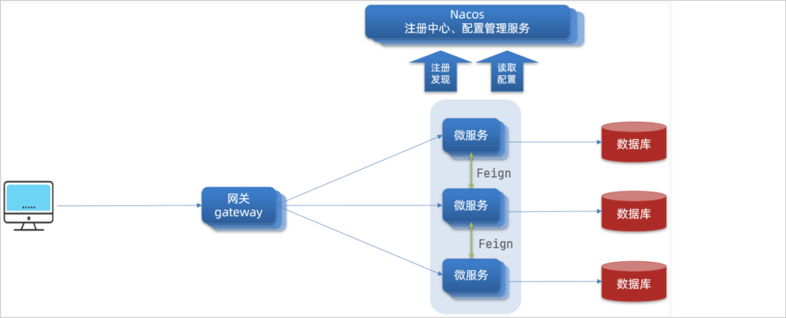 

 网关的作用：

 1.路由转发

2.认证鉴权

3.限流

4.实现微服务体系中的功能配置 例如：跨域

## 1.2 三大核心概念

### 1.2.1 Route(路由)

路由是构建网关的基本模块，它由ID，目标URI，一系列的断言和过滤器组成，如果断言为true则匹配该路由


### 1.2.2 Predicate（断言）

参考的是java8的java.util.function.Predicate开发人员可以匹配HTTP请求中的所有内容（例如请求头或请求参数），如果请求与断言相匹配则进行路由


### 1.2.3 Filter（过滤）

指的是Spring框架中GatewayFilter的实例，使用过滤器，可以在请求被路由前或者之后对请求进行修改。


## 1.3 工作流程


* 客户端向Spring Cloud Gateway发出请求。然后在Gateway Handler Mapping中找到与请求匹配的路由，将其发送到Gateway Web Handler.
* Handler再通过指定的过滤器链来将请求发送给我们实际的服务执行业务逻辑，然后返回。
* 过滤器之间用虚线分开是因为过滤器可能会在发送代理请求之前（"pre"）或之后("post")执行业务逻辑。
* Filter在"pre"类型的过滤器可以做参数校验、权限校验、流量监控、日志输出、协议转换等，在"post"类型的过滤器中可以做响应内容、响应头的修改，日志的输出，流量控制等有着非常重要的作用


## 1.4 Gateway入门

下面，我们就演示下网关的基本路由功能。基本步骤如下：

* 1、在spzx-cloud-parent下创建子模块spzx-cloud-gateway


* 2、引入如下依赖：

```xml
<!--网关-->
<dependency>
    <groupId>org.springframework.cloud</groupId>
    <artifactId>spring-cloud-starter-gateway</artifactId>
</dependency>

<!--nacos服务发现依赖-->
<dependency>
    <groupId>com.alibaba.cloud</groupId>
    <artifactId>spring-cloud-starter-alibaba-nacos-discovery</artifactId>
</dependency>

<!-- 负载均衡组件 -->
<dependency>
    <groupId>org.springframework.cloud</groupId>
    <artifactId>spring-cloud-loadbalancer</artifactId>
</dependency>
```


* 3、编写启动类

```java 
// com.atguigu.spzx.cloud.gateway
@SpringBootApplication
public class GatewayApplication {

	public static void main(String[] args) {
		SpringApplication.run(GatewayApplication.class, args);
	}
}
```

* 4、在application.yml配置文件中编写基础配置和路由规则

```yaml
server:
  port: 8222
spring:
  application:
    name: spzx-cloud-gateway
  cloud:
    gateway:
      discovery:
        locator:
          enabled: true  #开启和注册中心整合
      routes:
        - id: spzx-cloud-user  # 路由id，可以自定义，只要唯一即可
          uri: lb://spzx-cloud-user  # 路由的目标地址 lb就是负载均衡，后面跟服务名称
          predicates:
            - Path=/*/user/** # 路径匹配
        - id: spzx-cloud-order
          uri: lb://spzx-cloud-order
          predicates:
            - Path=/*/order/** # 路径匹配
    nacos:
      discovery:
        server-addr: 127.0.0.1:8848
```

* 5、重启测试

重启网关，访问http://localhost:8222/api/user/findUserByUserId/1时，符合`/api/user/**`规则，

请求转发到uri：http://spzx-cloud-user/api/user/findUserByUserId/1，得到了结果：

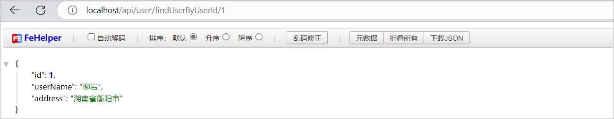 


## 1.5 Predicate的使用

* 启动网关服务后，在控制台可以看到如下信息：


* 思考问题：我们在配置文件中只是配置了一个访问路径的规则，怎么就可以实现路由呢?

底层原理：框架底层会自动读取配置文件中的内容，然后通过制定的路由工厂将其转换成对应的判断条件，然后进行判断。在Gateway中提供了很多的路由工厂如下所示：https://docs.spring.io/spring-cloud-gateway/docs/4.0.6/reference/html/#gateway-request-predicates-factories

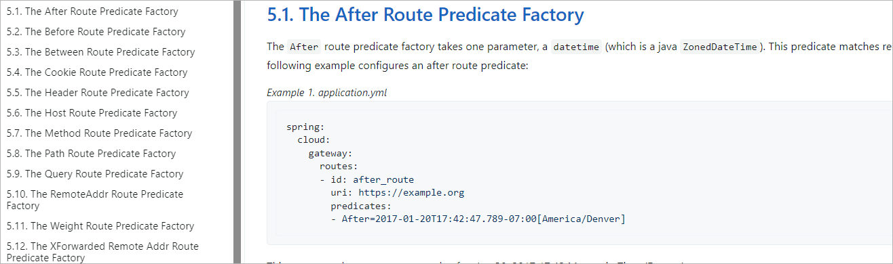 

大致有12个，每一种路由工厂的使用Spring Cloud的官网都给出了具体的示例代码，我们可以参考示例代码进行使用。以After Route Predicate 

Factory路由工厂举例，如下所示：

```yaml
spring:
  cloud:
    gateway:
      routes:
        - id: spzx-cloud-user
          uri: lb://spzx-cloud-user
          predicates:
            - Path=/api/user/**
            - After=2023-07-21T10:23:06.978038800+08:00[Asia/Shanghai]  # 系统时间在2023-07-21之后才可以进行访问        
```

```java
//获取当前时区时间代码
ZonedDateTime zonedDateTime = ZonedDateTime.now();
System.out.println(zonedDateTime);

注： ZonedDateTime类是Java 8中日期时间功能里,用于表示带时区的日期与时间信息的类。
```


* 总结

Spring Cloud Gateway将路由匹配作为Spring WebFlux HandlerMapper基础框架的一部分。

~~~
Spring WebFlux是Spring Framework 5.0中引入的新的响应式Web框架。与Spring MVC不同，它不需要Servlet API，完全异步且无阻塞。基于jdk8的管道流（Lamda表达式）完成异步无阻塞。

~~~

Spring Cloud Gateway包括许多内置的Route Predicate工厂。所有这些Predicate都与HTTP请求的不同属性匹配。多个Route Predicate工厂可以进行组合
Spring Cloud Gateway创建Route对象时，使用RoutePredicateFactory创建Predicate对象，Predicate对象可以赋值给 Route。Spring Cloud Gateway包含许多内置的Route Predicate Factories。所有这些谓词都匹配HTTP请求的不同属性。多种谓词工厂可以组合，并通过逻辑and 。


## 1.6 过滤器

### 1.6.1 过滤器简介

在gateway中要实现其他的功能：权限控制、流量监控、统一日志处理等。就需要使用到gateway中所提供的过滤器了。过滤器，可以对进入网关的请求和微服务返回的响应做处理：

 


### 1.6.2 内置过滤器

spring gateway提供了31种不同的过滤器。

官网地址：https://docs.spring.io/spring-cloud-gateway/docs/2.2.9.RELEASE/reference/html/#gatewayfilter-factories

例如：

| **名称**             | **说明**                     |
| -------------------- | ---------------------------- |
| AddRequestHeader     | 给当前请求添加一个请求头     |
| RemoveRequestHeader  | 移除请求中的一个请求头       |
| AddResponseHeader    | 给响应结果中添加一个响应头   |
| RemoveResponseHeader | 从响应结果中移除有一个响应头 |
| RequestRateLimiter   | 限制请求的流量               |

在Gateway中提供了三种级别的类型的过滤器：

1、路由过滤器：只针对当前路由有效

2、默认过滤器：针对所有的路由都有效

3、全局过滤器：针对所有的路由都有效，需要进行自定义


### 1.6.3 路由过滤器

需求：给所有进入spzx-cloud-user的请求添加一个请求头：Truth=atguigu

实现：

1、修改gateway服务的application.yml文件，添加路由过滤

```yaml
spring:
  cloud:
    gateway:
      routes:
        - id: spzx-cloud-user
          uri: lb://spzx-cloud-user
          predicates:
            - Path=/api/user/**
          filters:
            - AddRequestHeader=Truth, atguigu		# 配置路由基本的过滤器，给访问user微服务的所有接口添加Truth请求头
```

当前过滤器写在spzx-cloud-user路由下，因此仅仅对访问spzx-cloud-user的请求有效。

2、在spzx-cloud-user的接口方法中读取请求头数据，进行测试

```java
@GetMapping(value = "/findUserByUserId/{userId}")
public User findUserByUserId(@PathVariable(value = "userId") Long userId , @RequestHeader(name = "Truth")String header) {
    log.info("UserController...findUserByUserId方法执行了... ,header: {} " , header);
    return userService.findUserByUserId(userId) ;
}
```


### 1.6.4 默认过滤器

如果要对所有的路由都生效，则可以将过滤器工厂写到default下。格式如下：

```yml
spring:
  cloud:
    gateway:
      routes:
        - id: spzx-cloud-user
          uri: lb://spzx-cloud-user
          predicates:
            - Path=/api/user/**
            - After=2017-01-20T17:42:47.789-07:00[America/Denver]
      default-filters:
        - AddRequestHeader=Truth, atguigu is good
```


### 1.6.5 全局过滤器

* 概述

上述的过滤器是gateway中提供的默认的过滤器，每一个过滤器的功能都是固定的。但是如果我们希望拦截请求，做自己的业务逻辑，默认的过滤器就没办法实现。此时就需求使用全局过滤器，全局过滤器的作用也是处理一切进入网关的请求和微服务响应，与GatewayFilter的作用一样。区别在于GatewayFilter通过配置定义，处理逻辑是固定的；而GlobalFilter的逻辑需要自己写代码实现。


* 需求：定义全局过滤器，拦截请求，判断请求的参数是否满足下面条件：

**请求参数中是否有username，如果同时满足则放行，否则拦截**


* 步骤分析：

1、定义一个类实现GlobalFilter接口

2、重写filter方法

3、将该类纳入到spring容器中

4、实现Ordered接口定义该过滤器的顺序


* 实现代码：

```java
@Component
public class AuthorizationFilter implements GlobalFilter, Ordered {

    //实现过滤器逻辑
    @Override
    public Mono<Void> filter(ServerWebExchange exchange, GatewayFilterChain chain) {
        String username = exchange.getRequest().getQueryParams().getFirst("username");
        if(!StringUtils.hasText(username)){
            exchange.getResponse().setStatusCode(HttpStatus.UNAUTHORIZED);
            return exchange.getResponse().setComplete();
        }
        return chain.filter(exchange);
    }

    //定义该过滤器的顺序
    @Override
    public int getOrder() {
        return 0;
    }
}
```


### 1.6.6 过滤器执行顺序

请求进入网关会碰到三类过滤器：当前路由的过滤器、DefaultFilter、GlobalFilter

请求路由后，会将当前路由过滤器和DefaultFilter、GlobalFilter，合并到一个过滤器链（集合）中，排序后依次执行每个过滤器：

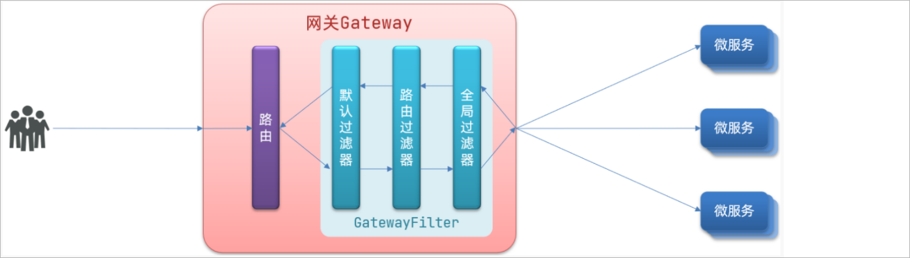 

排序的规则是什么呢？

1、按照order的值进行排序，order的值越小，优先级越高，执行顺序越靠前。

2、路由过滤器和默认过滤器会按照order的值进行排序，这个值由spring进行指定，默认是按照声明顺序从1递增

3、当过滤器的order值一样时，会按照 globalFilter > defaultFilter > 路由过滤器的顺序执行


核心源码分析：org.springframework.cloud.gateway.handler.FilteringWebHandler#handle方法会加载全局过滤器，与前面的过滤器合并后根据order排序，组织过滤器链

```java
public Mono<Void> handle(ServerWebExchange exchange) {
    Route route = (Route)exchange.getRequiredAttribute(ServerWebExchangeUtils.GATEWAY_ROUTE_ATTR);
    
    // 获取路由级别的过滤器和默认过滤器的集合
    List<GatewayFilter> gatewayFilters = route.getFilters();
    
    // 获取全局过滤器的集合
    List<GatewayFilter> combined = new ArrayList(this.globalFilters);
    
    // 将取路由级别的过滤器和默认过滤器的集合中的元素添加到全局过滤器的集合中
    combined.addAll(gatewayFilters);
    
    // 进行排序
    AnnotationAwareOrderComparator.sort(combined);
    if (logger.isDebugEnabled()) {
        logger.debug("Sorted gatewayFilterFactories: " + combined);
    }

    // 调用过滤器链中的filter方法
    return (new DefaultGatewayFilterChain(combined)).filter(exchange);
}
```


# 2 Nacos配置中心

Nacos除了可以做注册中心，同样可以做配置管理来使用。

## 2.1 统一配置管理

当微服务部署的实例越来越多，达到数十、数百时，逐个修改微服务配置就显得十分的不方便，而且很容易出错。我们需要一种统一配置管理方案，可以集中管理所有实例的配置。

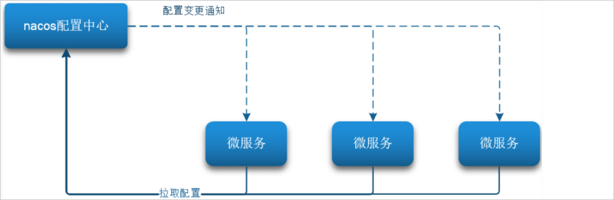 

nacos一方面可以将配置集中管理，另一方可以在配置变更时，及时通知微服务，实现配置的热更新。


## 2.2 Nacos入门

### 2.2.1 Nacos中添加配置

在Nacos服务端创建一个配置，如下所示：

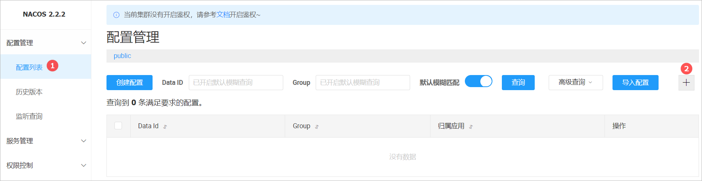 

然后在弹出的表单中，填写配置信息：


~~~yaml
pattern:
 dateformat: yyyy-MM-dd HH:mm:ss
~~~


### 2.2.2 微服务集成配置中心

微服务需要进行改造，从Nacos配置中心中获取配置信息进行使用。

步骤：

1、在spzx-cloud-user微服务中，引入spring-cloud-starter-alibaba-nacos-config依赖

```xml
<!-- nacos作为配置中心时所对应的依赖 -->
<dependency>
    <groupId>com.alibaba.cloud</groupId>
    <artifactId>spring-cloud-starter-alibaba-nacos-config</artifactId>
</dependency>
```

2、在spzx-cloud-user项目的 /src/main/resources/application.yml 配置文件中配置 Nacos Config 地址并引入服务配置

```yml
# 配置数据库的连接信息
spring:
  cloud:
    nacos:
      config:
        server-addr: 192.168.136.142:8848
  config:
    import:
      - nacos:spzx-cloud-user-dev.yml
```

### 2.2.3 读取自定义配置

#### @Value

通过@Value注解读取自定义配置，如下所示：

```java
@RestController
@RequestMapping(value = "/api/user")
@Slf4j
public class UserController {

    @Autowired
    private UserService userService ;

    @Value("${pattern.dateformat}")
    private String pattern ;

    @GetMapping(value = "/findUserByUserId/{userId}")
    public User findUserByUserId(@PathVariable(value = "userId") Long userId , @RequestHeader(name = "Truth")String header) {
        log.info("UserController...findUserByUserId方法执行了... ,header: {} , dateformat: {} " , header , pattern);
        return userService.findUserByUserId(userId) ;
    }

}
```

#### @ConfigurationProperties

也可以通过实体类，配合@ConfigurationProperties注解读取自定义配置，代码如下所示：

1、定义一个实体类，代码如下所示：

```java
@Data
@ConfigurationProperties(prefix = "pattern")
public class PatternProperties {

    private String dateformat ;

}
```

2、在启动类上添加@EnableConfigurationProperties注解，如下所示：

```java
@SpringBootApplication
@EnableConfigurationProperties(value = { PatternProperties.class })
public class UserApplication {

    public static void main(String[] args) {
        SpringApplication.run(UserApplication.class , args) ;
    }

}
```

3、使用该实体类，代码如下所示：

```java
@RestController
@RequestMapping(value = "/api/user")
@Slf4j
public class UserController {

    @Autowired
    private UserService userService ;

    @Value("${pattern.dateformat}")
    private String pattern ;

    @Autowired   // 注入实体类
    private PatternProperties patternProperties ; 

    @GetMapping(value = "/findUserByUserId/{userId}")
    public User findUserByUserId(@PathVariable(value = "userId") Long userId , @RequestHeader(name = "Truth")String header) {
        log.info("UserController...findUserByUserId方法执行了... ,header: {} , dateformat: {} " , header , patternProperties.getDateformat());
        return userService.findUserByUserId(userId) ;
    }

}
```


## 2.3 配置热更新

我们最终的目的，是修改Nacos中的配置后，微服务中无需重启即可让配置生效，也就是**配置热更新**。实现配置的热更新有两种方式：

> 方式一：在@Value注入的变量所在类上添加注解**@RefreshScope**

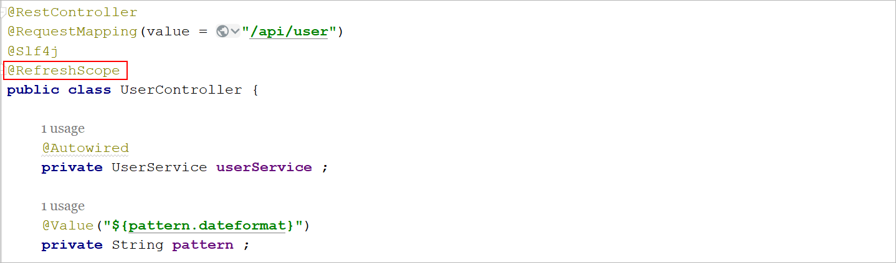 

> 方式二：通过实体类，配合@ConfigurationProperties注解读取配置信息，**自动**支持热更新


## 2.4 配置优先级

思考问题：如果在application.yml文件中和Nacos配置中心中都定义了相同的配置内容，那么哪一个配置的优先级较高呢?

优先级顺序：Nacos配置中心的配置(后导入的配置 > 先导入的配置) > application.yml


# 3 Sentinel组件

## 3.1 初识sentinel

### 3.1.1 雪崩效应

概述：在微服务系统架构中，服务间调用关系错综复杂，一个微服务往往依赖于多个其它微服务。一个服务的不可用导致整个系统的不可用的现象就被称之为雪崩效应。

如下图所示：

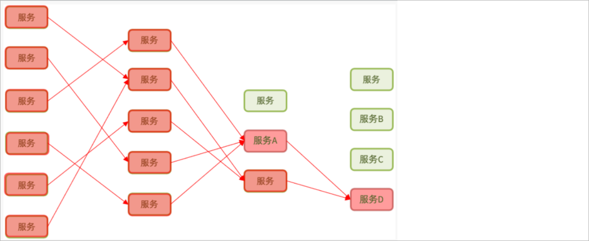 

当服务D出现了问题了以后，调用服务D的服务A的线程就得不到及时的释放，在高并发情况下，随着时间的不断推移服务A的系统资源会被线程耗尽，最终导致服务A出现了问题，同理就会导致其他的服务也不能进行访问了。


### 3.1.2 解决方案

#### 超时处理

超时处理：设定超时时间，请求超过一定时间没有响应就返回错误信息，不会无休止等待

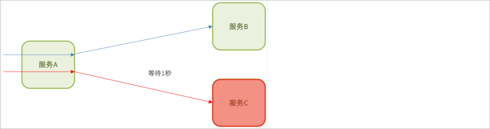 


#### 隔离处理

隔离处理：将错误隔离在可控的范围之内，不要让其影响到其他的程序的运行。

这种设计思想，来源于船舱的设计，如下图所示：

 

船舱都会被隔板分离为多个独立空间，当船体破损时，只会导致部分空间进入，将故障控制在一定范围内，避免整个船体都被淹没。于此类似，我们业务系统也可以使用这种思想来防止出现雪崩效应，常见的隔离方式：线程隔离

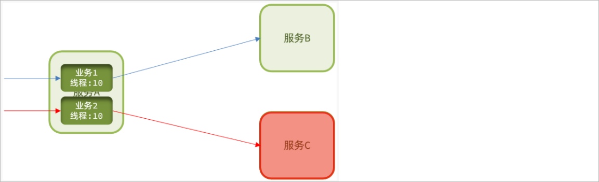 


#### 熔断处理

熔断处理：由**断路器**统计业务执行的异常比例，如果超出阈值则会**熔断**该业务，拦截访问该业务的一切请求。

断路器会统计访问某个服务的请求数量，异常比例如下所示：

 

请求了三次，两次出现异常，一次成功。当发现访问服务D的请求异常比例过高时，认为服务D有导致雪崩的风险，会拦截访问服务D的一切请求，形成熔断：

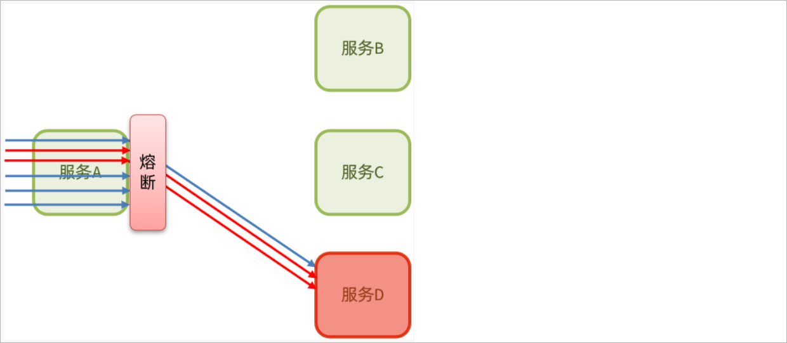 

触发熔断了以后，当在访问服务A的时候，就不会在通过服务A去访问服务D了，立马给用户进行返回，返回的是一种默认值，这种返回就是一种兜底方案。这种兜底方案也将其称之为降级逻辑。


#### 流量控制

流量控制：限制业务访问的QPS(每秒的请求数)，避免服务因流量的突增而故障。 

 

限流是一种**预防**措施，避免因瞬间高并发流量而导致服务故障，进而避免雪崩。其他的处理方式是一种**补救**措施，在部分服务故障时，将故障控制在一定范围，避免雪崩。


### 3.1.3 sentinel介绍

官网地址：https://sentinelguard.io/zh-cn/

随着微服务的流行，服务和服务之间的稳定性变得越来越重要。Sentinel 以流量为切入点，从流量控制、熔断降级、系统负载保护等多个维度保护服务的稳定性。

* Sentinel 的历史：

\- 2012 年，Sentinel 诞生，主要功能为入口流量控制。

\- 2013-2017 年，Sentinel 在阿里巴巴集团内部迅速发展，成为基础技术模块，覆盖了所有的核心场景。Sentinel 也因此积累了大量的流量归整场景以及生产实践。

\- 2018 年，Sentinel 开源，并持续演进。

\- 2019 年，Sentinel 朝着多语言扩展的方向不断探索，推出 C++ 原生版本，同时针对 Service Mesh 场景也推出了 Envoy 集群流量控制支持，以解决 Service Mesh 架构下多语言限流的问题。

\- 2020 年，推出 Sentinel Go 版本，继续朝着云原生方向演进。


* Sentinel 分为两个部分:

\- 核心库（Java 客户端）不依赖任何框架/库，能够运行于所有 Java 运行时环境，同时对 Dubbo / Spring Cloud 等框架也有较好的支持。

\- 控制台（Dashboard）基于 Spring Boot 开发，打包后可以直接运行，不需要额外的 Tomcat 等应用容器。

 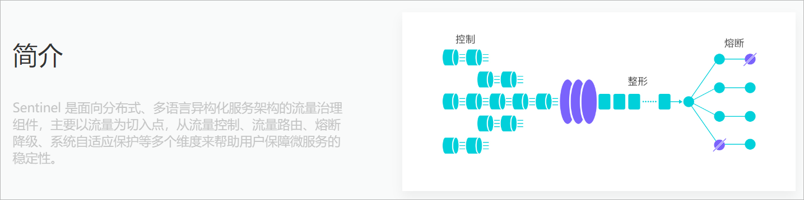 

具有的特征:

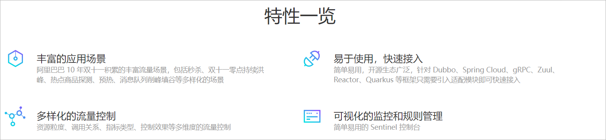 


## 3.2 sentinel入门

### 3.2.1 下载sentinel控制台

sentinel管理后台下载地址：https://github.com/alibaba/Sentinel/releases

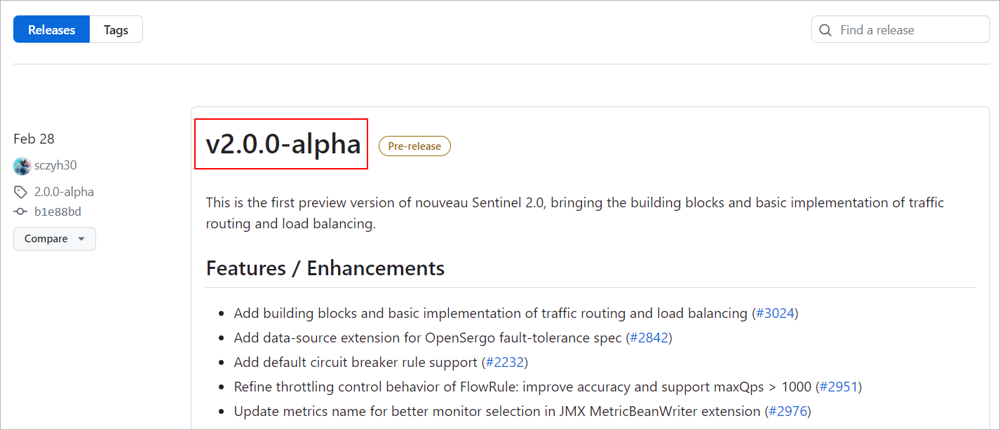 

下载完毕以后就会得到一个jar包

 


### 3.2.2 启动sentinel

* 将jar包放到任意非中文目录，执行命令：

```shell
java -jar sentinel-dashboard-2.0.0-alpha-preview.jar
```

* 如果要修改Sentinel的默认端口、账户、密码，可以通过下列配置：

| **配置项**                       | **默认值** | **说明**   |
| -------------------------------- | ---------- | ---------- |
| server.port                      | 8080       | 服务端口   |
| sentinel.dashboard.auth.username | sentinel   | 默认用户名 |
| sentinel.dashboard.auth.password | sentinel   | 默认密码   |

* 例如，修改端口：

```sh
java -Dserver.port=8090 -jar sentinel-dashboard-2.0.0-alpha-preview.jar
```


### 3.2.3 访问sentinel

访问http://localhost:8080页面，就可以看到sentinel的控制台了：

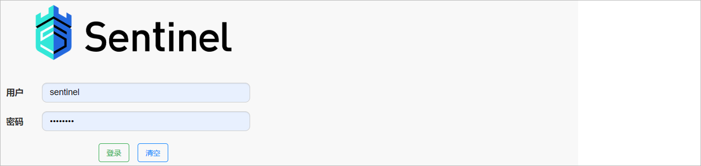 

需要输入账号和密码，默认都是：sentinel

登录后，发现一片空白，什么都没有：因为还没有监控任何服务。另外，sentinel是懒加载的，如果服务没有访问，看不到该服务信息。

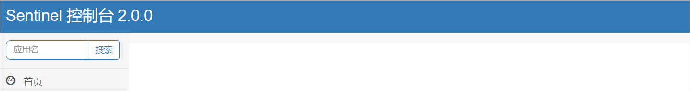 


### 3.2.4 整合sentinel

我们在spzx-cloud-user中整合sentinel，并连接sentinel的控制台，步骤如下：

1、引入sentinel依赖

```xml
<!--sentinel-->
<dependency>
    <groupId>com.alibaba.cloud</groupId> 
    <artifactId>spring-cloud-starter-alibaba-sentinel</artifactId>
</dependency>
```

2、配置控制台

修改application.yaml文件，添加下面内容

```yml
spring:
  cloud:
    sentinel:
      transport:
        dashboard: localhost:8080  # 配置sentinel控制台地址
```

3、访问spzx-cloud-user的任意接口

打开浏览器，访问http://localhost:10100/api/user/findUserByUserId/1，这样才能触发sentinel的监控。然后再访问sentinel的控制台，查看效果：

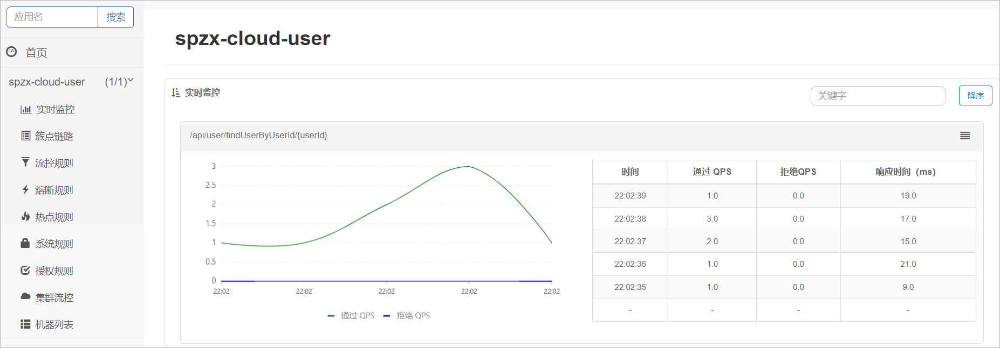 


## 3.3 流量控制

雪崩问题虽然有四种方案，但是限流是避免服务因突发的流量而发生故障，是对微服务雪崩问题的预防。我们先学习这种模式。

### 3.3.1 相关概念

**簇点链路**：当请求进入微服务时，首先会访问DispatcherServlet，然后进入Controller、Service、Mapper，这样的一个调用链就叫做簇点链路。

**资源**：簇点链路中被监控的每一个接口就是一个资源，流控、熔断等都是针对簇点链路中的资源来设置的。

默认情况下sentinel会监控spring mvc的每一个端点（Endpoint，也就是controller中的方法），因此spring mvc的每一个端点就是调用链路中的一个资源。

例如，我们刚才访问的spzx-cloud-user中的UserController中的端点：/api/user/findUserByUserId/{userId}

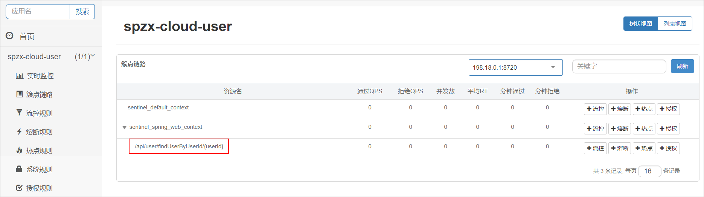 

我们可以点击对应资源后面的按钮来设置规则：

1、流控：流量控制

2、降级：降级熔断

3、热点：热点参数限流，是限流的一种

4、授权：请求的权限控制


### 3.3.2 快速入门

需求：给 /api/user/findUserByUserId/{userId}这个资源设置流控规则，QPS不能超过 5，然后测试。

步骤：

1、首先在sentinel控制台添加限流规则

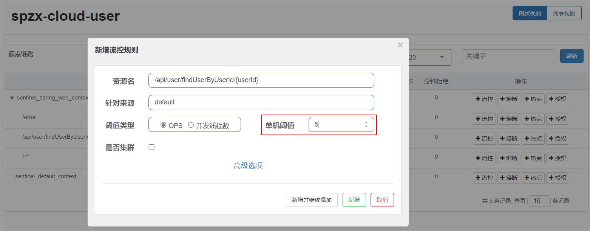 

2、利用jmeter测试(模拟并发请求)

> Apache JMeter 是 Apache 组织基于 Java 开发的压力测试工具，用于对软件做**压力测试**。
>
> 下载地址：https://archive.apache.org/dist/jmeter/binaries/

课前资料提供了编写好的Jmeter测试样例

 

通过如下命令打开jmeter

```shell
java -jar ApacheJMeter.jar
```

导入课前资料提供的测试样例

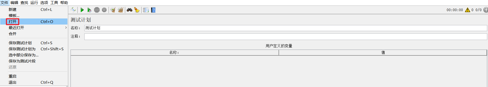

选择流控入门

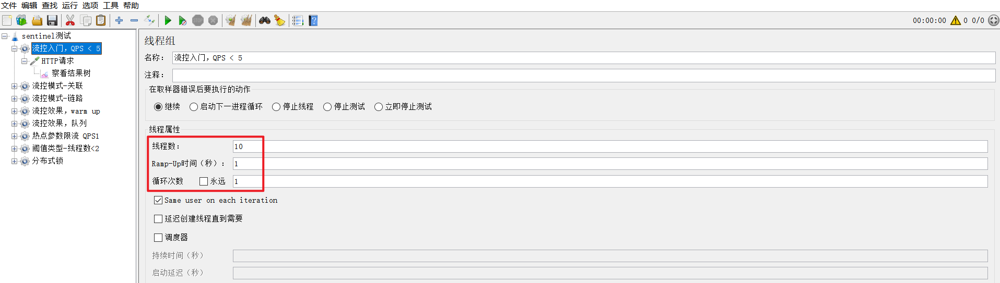

10个线程，1秒内运行完，QPS是10，超过了5。

选中**流控入门，QPS<5**右键运行

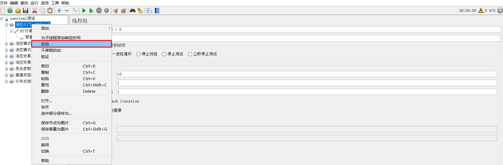

注意：不要点击菜单中的执行按钮来运行。

点击查看结果树，理想的请求执行结果应该如下所示：

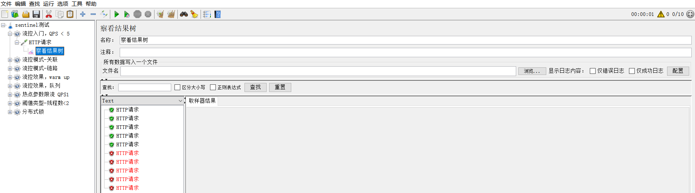

可以看到，成功的请求每次只有5个。

**注意：如果测试结果不是上述情况，那是因为sentinel在统计请求的时候，把一部分的请求统计到了下一秒中导致的。**


### 3.3.3 流控模式

#### 流控模式简介

在添加限流规则时，点击高级选项，可以选择三种**流控模式**：

1、直接：统计当前资源的请求，触发阈值时对当前资源直接限流，也是默认的模式

2、关联：统计与当前资源相关的另一个资源，触发阈值时，对当前资源限流

3、链路：统计从指定链路访问到本资源的请求，触发阈值时，对指定链路限流

如下所示：

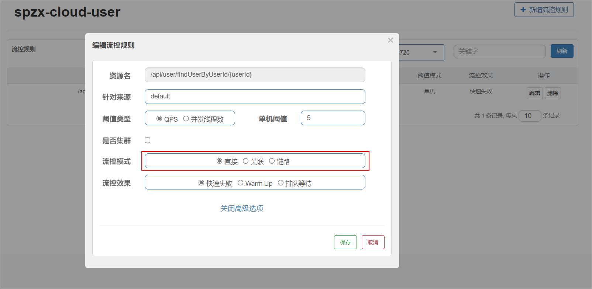 

快速入门测试的就是直接模式。


#### 关联模式

关联模式：统计与当前资源相关的另一个资源，触发阈值时，对当前资源限流

配置方式：

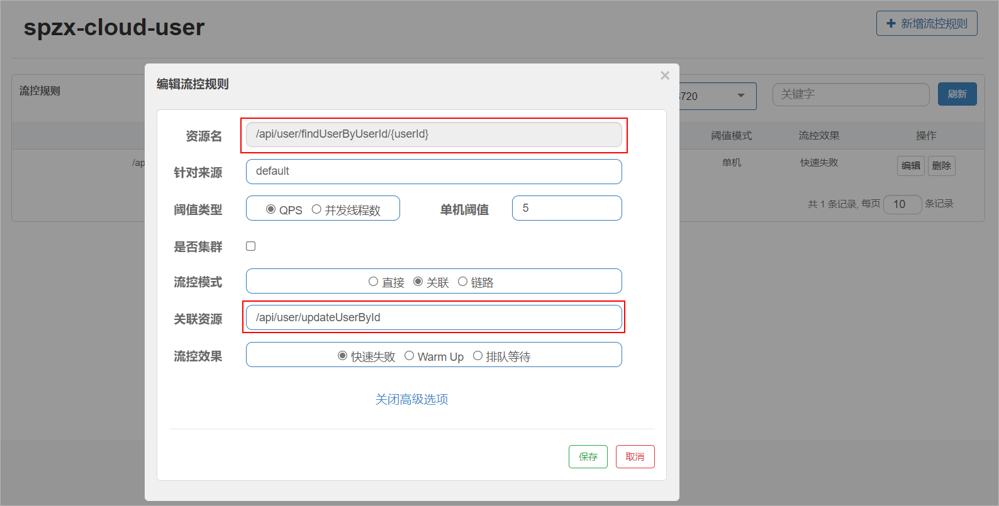 

语法说明：对/api/user/updateUserById资源的请求进行统计，当访问流量超过阈值时，就对/api/user/findUserByUserId/{userId}进行限流，避免影响/api/user/updateUserById资源。

使用场景：比如用户支付时需要修改订单状态，同时用户要查询订单。查询和修改操作会争抢数据库锁，产生竞争。业务需求是优先支付和更新订单的业务，因此当修改订单业务触发阈值时，需要对查询订单业务限流。


案例实现：

1、在UserController新建一个端点：/api/user/updateUserById，无需实现业务

```java
// 修改用户数据端点
@GetMapping(value = "/updateUserById")
public String updateUserById() {
    return "修改用户数据成功";
}
```

2、重启服务，访问对应的端点，让其产生簇点链路

 

3、配置流控规则，当/api/user/updateUserById资源被访问的QPS超过5时，对/api/user/findUserByUserId/1请求限流。对哪个端点限流，就点击哪个端点后面的按钮。我们是对用户查询/api/user/findUserByUserId/1限流，因此点击它后面的按钮：

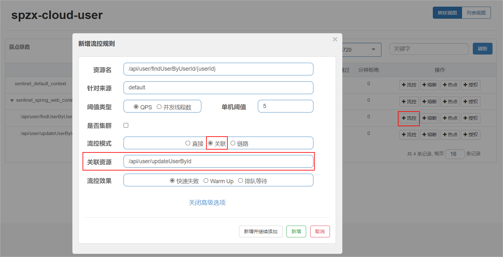 

4、在Jmeter中进行测试

选择《流控模式-关联》：

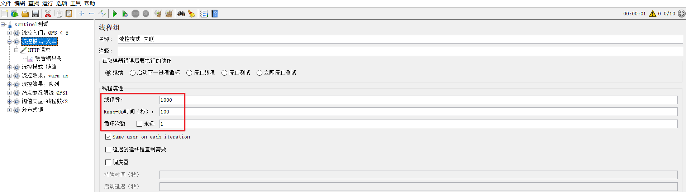

可以看到1000个线程，100秒，因此QPS为10，超过了我们设定的阈值：5

查看http请求：

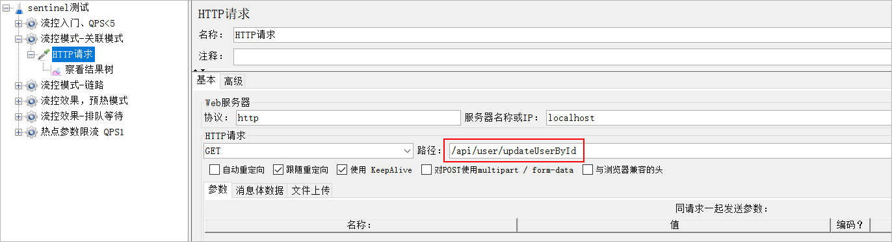  

请求的目标是/api/user/updateUserById，这样这个端点就会触发阈值。但限流的目标是/api/user/findUserByUserId/1，我们在浏览器访问，可以发现：

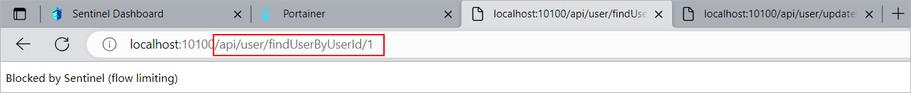 

确实被限流了。

关联流控模式的使用场景：

1、两个有竞争关系的资源

2、一个优先级较高，一个优先级较低

对高优先级的资源的流量进行统计，当超过阈值对低优先级的资源进行限流。


#### 链路模式

链路模式：只针对从指定链路访问到本资源的请求做统计，判断是否超过阈值，如果超过阈值对从该链路请求进行限流。

配置方式：

1、/api/user/save --> users

2、/api/user/query --> users

如果只希望统计从/api/user/query进入到users的请求，并进行限流操作，则可以这样配置：

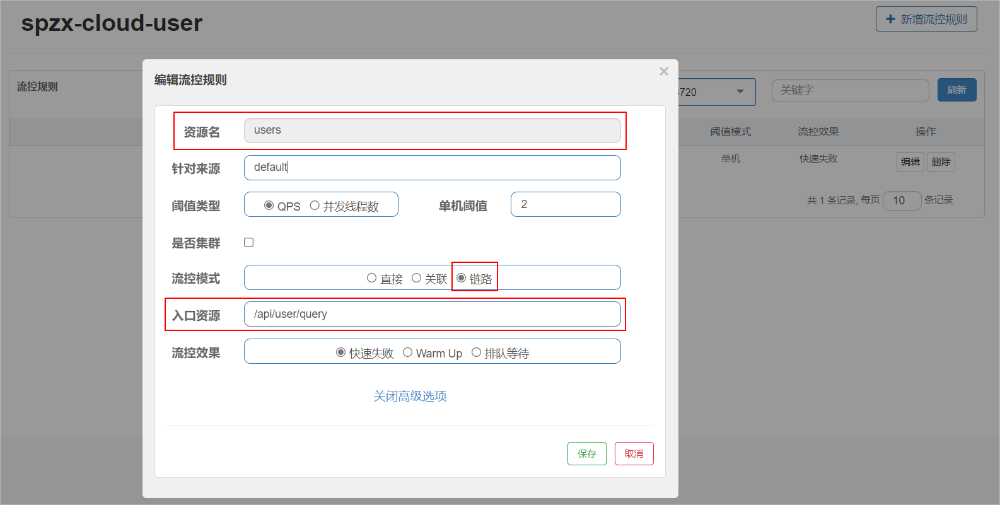 

案例实现：

1、在UserService中添加一个queryUsers方法，不用实现业务

```java
public void queryUsers(){
    System.err.println("查询用户");
}
```

2、在UserController中，添加两个端点，在这两个端点中分别调用UserService中的queryUsers方法

```java
@GetMapping(value = "/save")
public String save() {
    userService.queryUsers();
    System.out.println("保存用户");
    return "订单保存成功" ;
}

@GetMapping(value = "/query")
public String query() {
    userService.queryUsers();
    System.out.println("查询用户");
    return "查询用户成功" ;
}
```

4、通过**@SentinelResource**标记UserService中的queryUsers方法为一个sentinel监控的资源(默认情况下，sentinel只监控controller方法)

```java
@SentinelResource("users")
public void queryUsers(){
    System.err.println("查询用户");
}
```

5、更改application.yml文件中的sentinel配置

链路模式中，是对不同来源的两个链路做监控。但是sentinel默认会给进入spring mvc的所有请求设置同一个root资源，会导致链路模式失效。因此需要关闭这种资源整合。

```yml
spring:
  cloud:
    sentinel:
      web-context-unify: false # 关闭context整合
```

6、重启服务，访问/api/user/save和/api/user/query，可以查看到sentinel的簇点链路规则中，出现了新的资源

 

7、添加流控规则

点击users资源后面的流控按钮，在弹出的表单中填写下面信息：

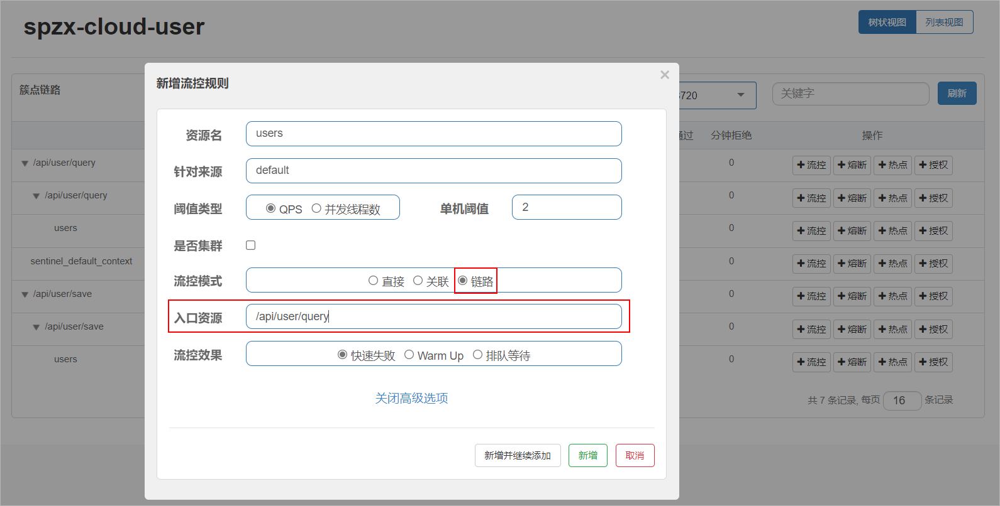 

只统计从/api/user/query进入/users的资源，QPS阈值为2，超出则被限流。

8、jmeter测试

选择《流控模式-链路》

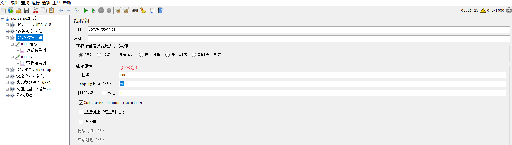

可以看到这里200个线程，50秒内发完，QPS为4，超过了我们设定的阈值2。

一个http请求是访问/api/user/save

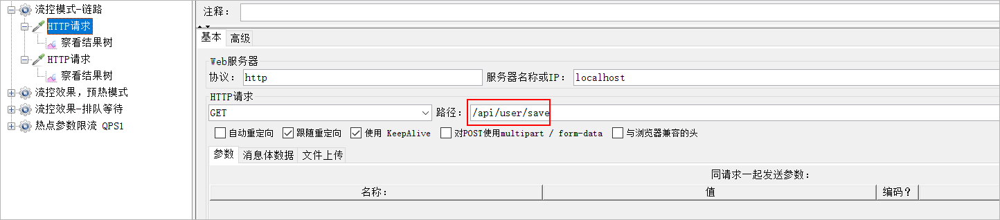 

另一个是访问/api/user/query

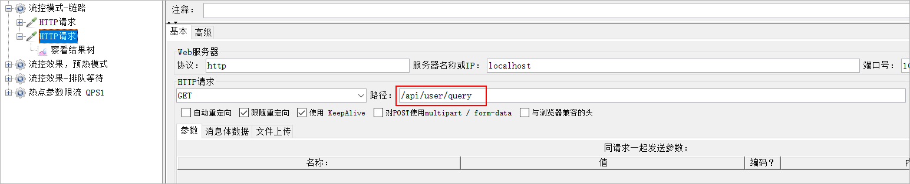 

运行测试，察看结果树：

访问/api/user/save,没有进行限流

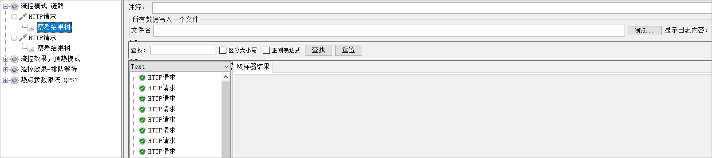 

访问/api/user/query,进行限流了

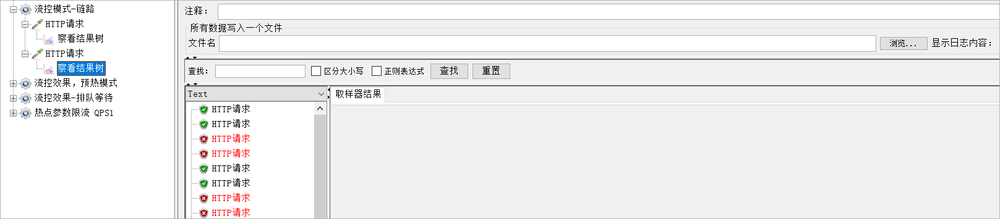 


### 3.3.4 流控效果

在流控的高级选项中，还有一个流控效果选项

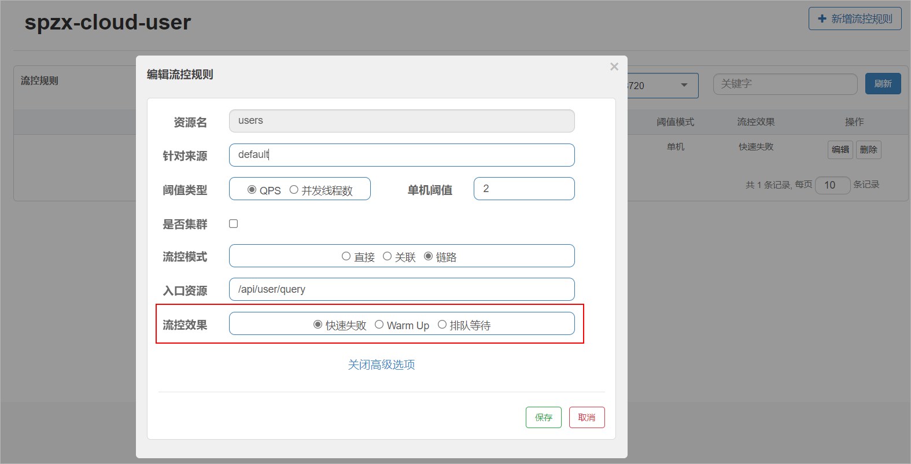 

流控效果是指请求达到流控阈值时应该采取的措施，包括三种：

1、快速失败：达到阈值后，新的请求会被立即拒绝并抛出FlowException异常，是默认的处理方式

2、warm up：预热模式，对超出阈值的请求同样是拒绝并抛出异常，但这种模式阈值会动态变化，从一个较小值逐渐增加到最大阈值

3、排队等待：让所有的请求按照先后次序进入到一个队列中进行排队，当某一个请求最大的预期等待时间超过了所设定的超时时间时同样是拒绝并抛

出异常

#### warm up

阈值一般是一个微服务能承担的最大QPS，但是一个服务刚刚启动时，一切资源尚未初始化（**冷启动**），如果直接将QPS跑到最大值，可能导致服务瞬间宕机。

warm up也叫**预热模式**，是应对服务冷启动的一种方案。**阈值会动态变化**，从一个较小值逐渐增加到最大阈值。

**工作特点**：请求阈值初始值是 maxThreshold / coldFactor, 持续指定时长(预热时间)后，逐渐提高到maxThreshold值，而coldFactor的默认值是3。

例如，我设置QPS的maxThreshold为10，预热时间为5秒，那么初始阈值就是 10 / 3 ，也就是3，然后在5秒后逐渐增长到10。


**案例需求**：给/api/user/findUserByUserId/{userId}这个资源设置限流，最大QPS为10，利用warm up效果，预热时长为5秒

1、配置流控规则

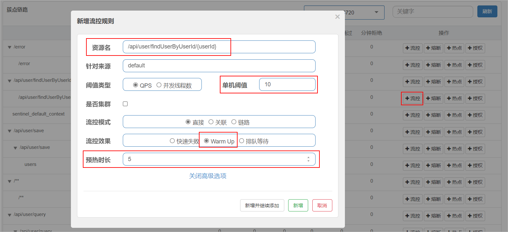 

2、jmeter测试

选择《流控效果，warm up》

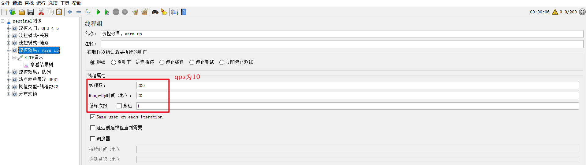

QPS为10

刚刚启动时，大部分请求失败，成功的只有3个，说明QPS被限定在3：


随着时间推移，成功比例越来越高

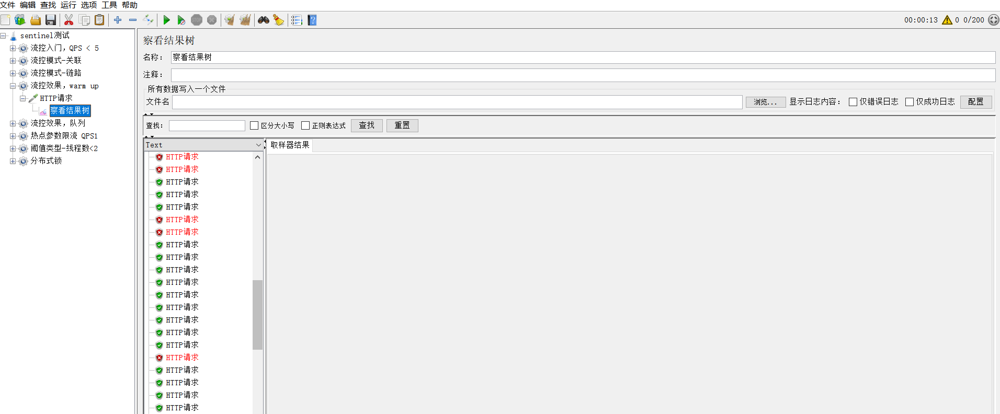

到sentinel控制台查看实时监控

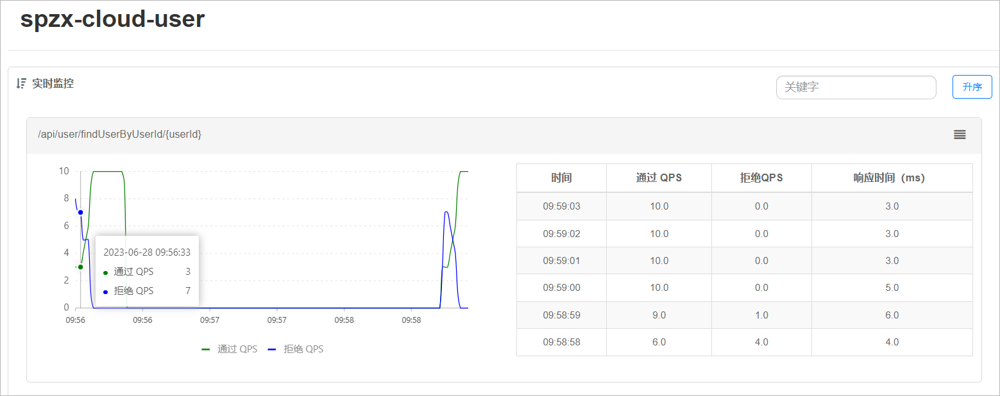 


#### 排队等待

**排队等待**：让所有的请求按照先后次序进入到一个队列中进行排队，当某一个请求最大的预期等待时间超过了所设定的超时时间时同样是拒绝并抛出异常

例如：QPS = 5，意味着每200ms处理一个队列中的请求；timeout = 2000，意味着**预期等待时长**超过2000ms的请求会被拒绝并抛出异常。

那什么叫做预期等待时长呢？

比如现在一下子来了12 个请求，因为每200ms执行一个请求，那么：

1、第6个请求的**预期等待时长** =  200 * （6 - 1） = 1000ms

2、第12个请求的预期等待时长 = 200 * （12-1） = 2200ms

现在，第1秒同时接收到10个请求，但第2秒只有1个请求，此时QPS的曲线这样的：

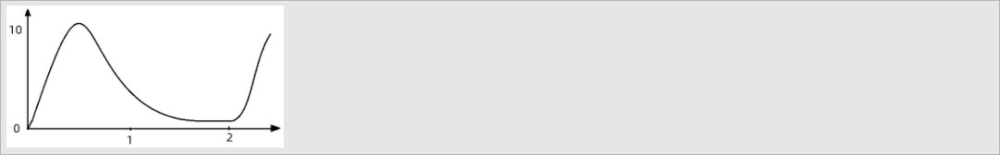 

如果使用队列模式做流控，所有进入的请求都要排队，以固定的200ms的间隔执行，QPS会变的很平滑

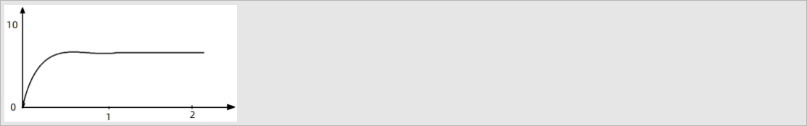 

平滑的QPS曲线，对于服务器来说是更友好的。


**案例需求**：给/api/user/findUserByUserId/{userId}这个资源设置限流，最大QPS为10，利用排队的流控效果，超时时长设置为5s

1、添加流控规则

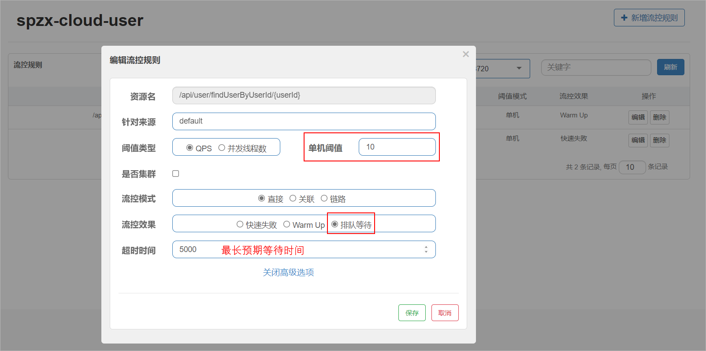 

2、jmeter测试

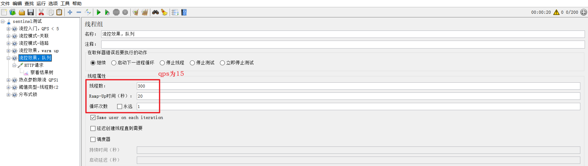

QPS为15，已经超过了我们设定的10。

运行测试用例，察看结果树：

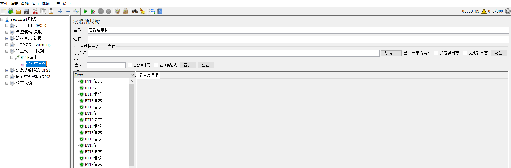

全部都通过了。

再去sentinel查看实时监控的QPS曲线

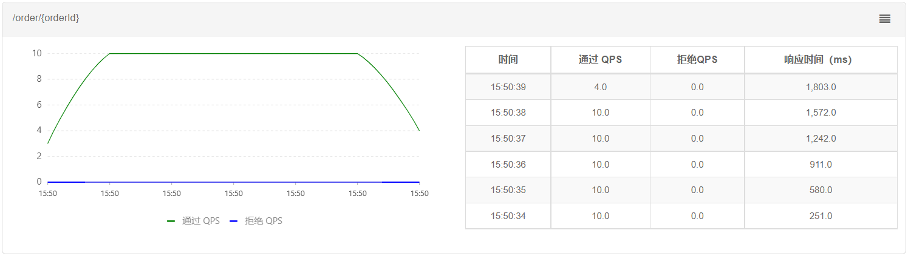

QPS非常平滑，一致保持在10，但是超出的请求没有被拒绝，而是放入队列。因此**响应时间**（等待时间）会越来越长。


### 3.3.5 热点参数限流

#### 配置介绍

之前的限流是统计访问某个资源的所有请求，判断是否超过QPS阈值。而热点参数限流是**分别统计参数值相同的请求**，判断是否超过QPS阈值。

例如，一个根据id查询商品的接口：

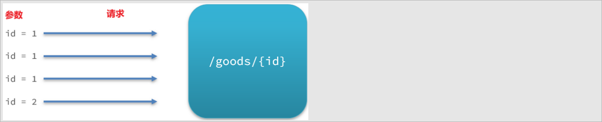 

访问/goods/{id}的请求中，id参数值会有变化，热点参数限流会根据参数值分别统计QPS，统计结果：

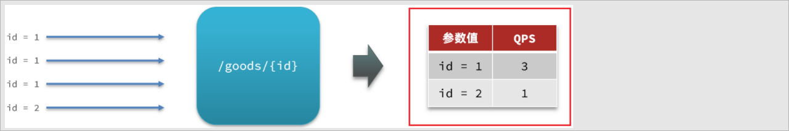 

当id=1的请求触发阈值被限流时，id值不为1的请求不受影响。

配置方式(点击资源中的热点按钮)：

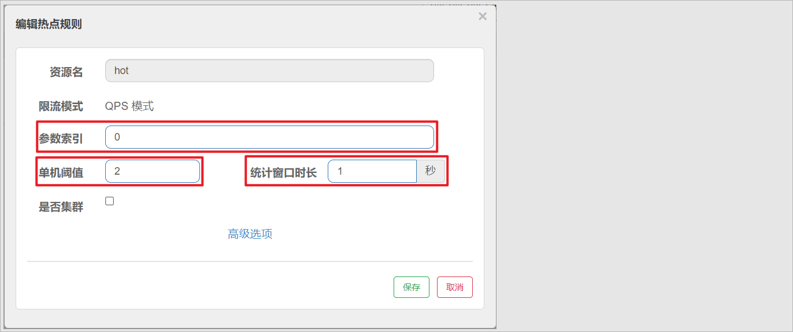 

代表的含义是：对hot这个资源的0号参数（第一个参数）做统计，每1秒**相同参数值**的请求数不能超过2。这种配置是对查询商品这个接口的所有商品一视同仁，QPS都限定为5。而在实际开发中，可能部分商品是热点商品，例如秒杀商品，我们希望这部分商品的QPS限制与其它商品不一样，高一些。那就需要配置热点参数限流的高级选项了：

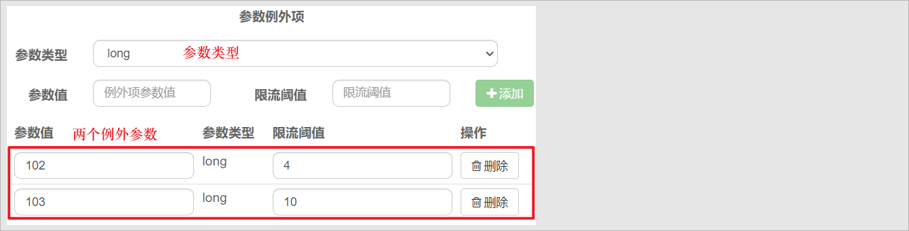 

#### 案例演示

**案例需求**：给/api/user/findUserByUserId/{userId}这个资源添加热点参数限流，规则如下：

1、默认的热点参数规则是每1秒请求量不超过2

2、给2这个参数设置例外：每1秒请求量不超过4

3、给3这个参数设置例外：每1秒请求量不超过10

**注意事项**：热点参数限流对默认的spring mvc资源无效，需要利用@SentinelResource注解标记资源


实现步骤：

1、标记资源

给UserController中的/api/user/findUserByUserId/{userId}资源添加注解：

```java
@SentinelResource("hot")  // 声明资源名称
@GetMapping(value = "/findUserByUserId/{userId}")
public User findUserByUserId(@PathVariable(value = "userId") Long userId ,
                             @RequestHeader(name = "Truth" , required = false)String header) {
    log.info("UserController...findUserByUserId方法执行了... ,header: {} , dateformat: {} " , header , patternProperties.getDateformat());
    return userService.findUserByUserId(userId) ;
}
```

2、热点参数限流规则

访问该接口，可以看到我们标记的hot资源出现了

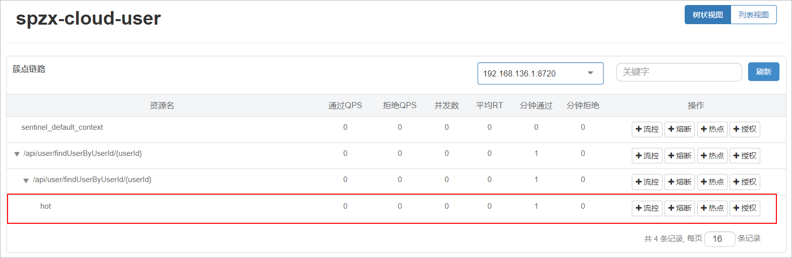 

这里不要点击hot后面的按钮，页面有BUG

点击左侧菜单中**热点规则**菜单：

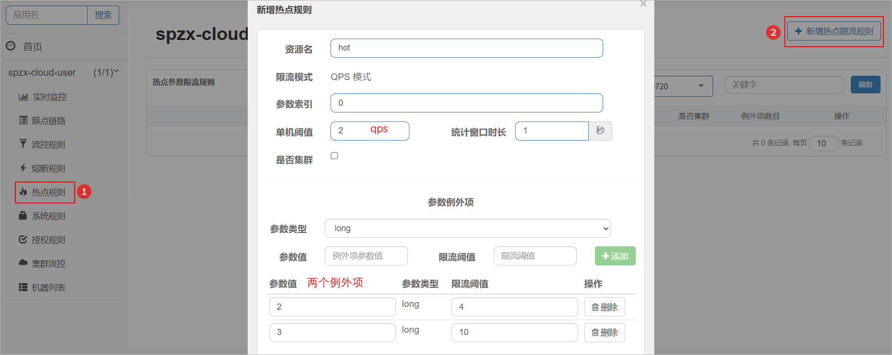 

3、jmeter测试

选择《热点参数限流 QPS1》

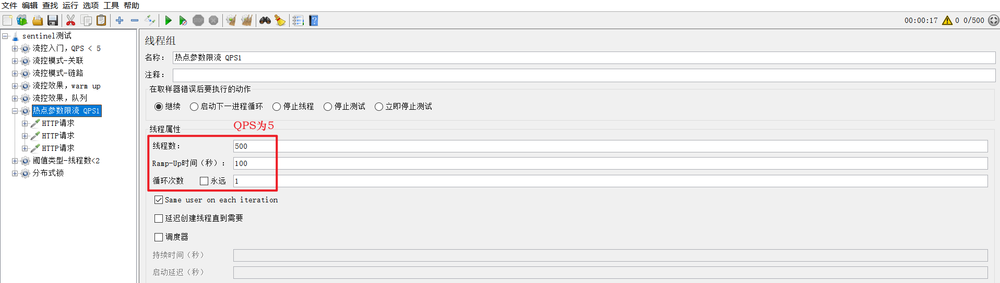

这里发起请求的QPS为5。

包含三个请求，参数分别为：101 ， 102 ， 103，运行测试程序，察看结果树：


| 101  | 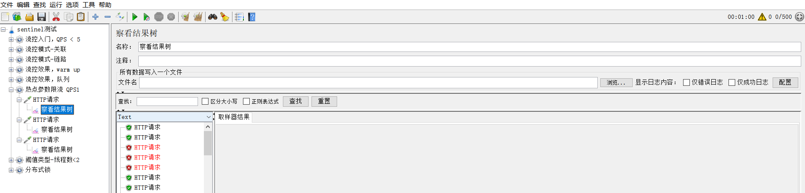 |
| ---- | ------------------------------------------------------------ |
| 102  | 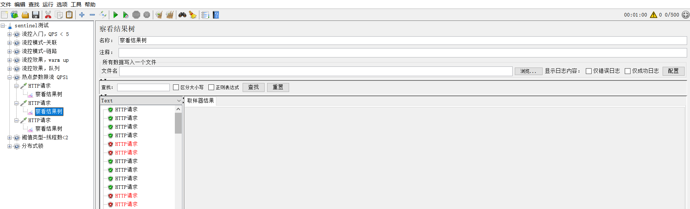 |
| 103  | 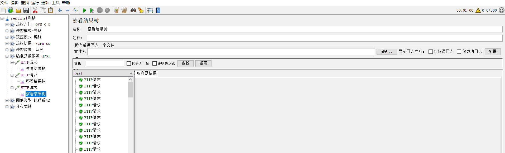 |


