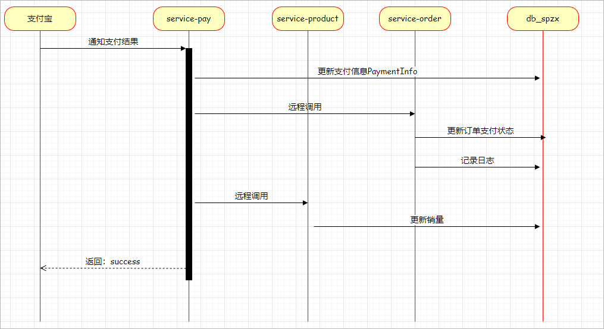
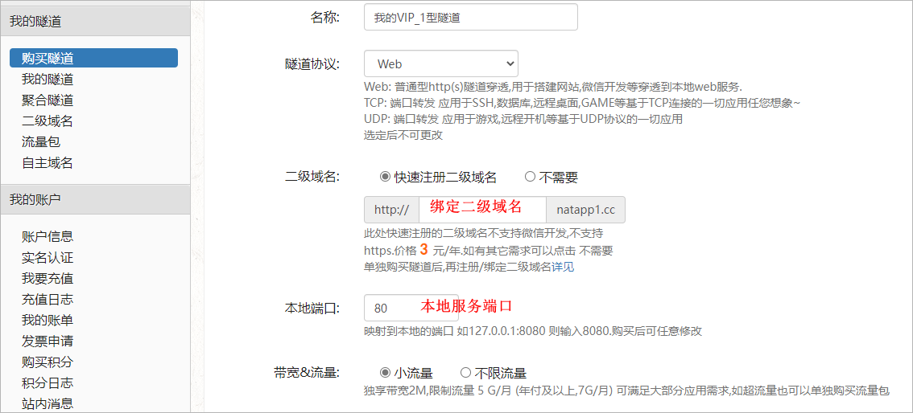
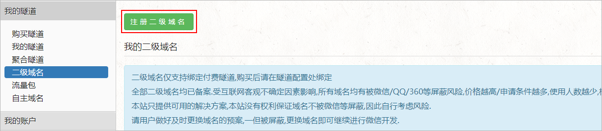
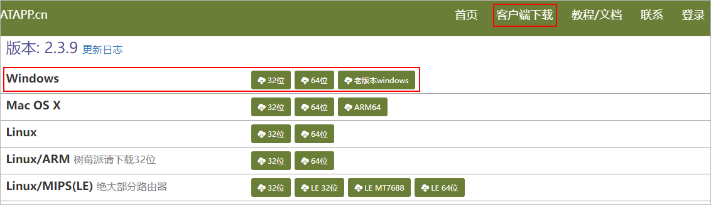
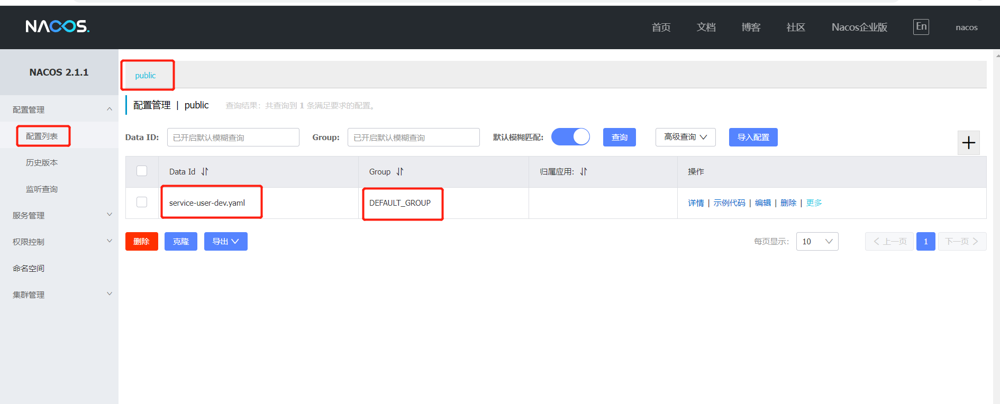
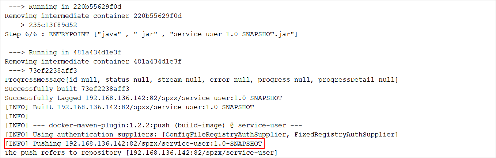
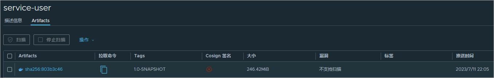

# 1 支付

## 1.1 支付接口

### 1.1.1 实现支付接口

#### pom.xml

在service-pay微服务中添加alipay的依赖：

```xml
<dependency>
    <groupId>com.alipay.sdk</groupId>
    <artifactId>alipay-sdk-java</artifactId>
</dependency>
```

#### application-alipay.yml

支付宝示例demo：https://opendocs.alipay.com/open/203/105285?pathHash=ada1de5b

将支付宝所需要的参数定义配置文件中，以提高代码的维护性：

```properties
spzx:
  alipay:
    alipay_url: https://openapi.alipay.com/gateway.do
    app_id: 2021001163617452
    app_private_key: MIIEvQIBADANBgkqhkiG9w0BAQEFAASCBKcwggSjAgEAAoIBAQC8Z7EZmanxyFGsK4LrIUeKKrrGxWAHIgPmUV8TtZDs+jeplJSw1ckSY63QhEU444D5qd6xruJHBuB33HG+ik4n8N8nRWi3AtMgpC061oq2DcgtIKMmQHO7/poYDwbpDZrOWXIyiNshFfUOSTUpnrS8UvEks6n6xR/G72r2FG07oZzO7g3XsPMr73wpYajMYC/bhTm6CJGEWZikONNDFkQpVHa+zgitwsqlBuvBvVwGwOHA9B8aRfokwAMl6BDXKoH8BNnSEMpWSTRSwbssayXAQWNU7XKDKGozbn4U2dEbl8GCFzikI/T7ybTNm5gs46ZZBGlq/YB4+v4D3t74Vl6nAgMBAAECggEAOidzhehliYkAlLk1huhV0bMQxewEkQ8RzxTM2SORIWS2q7R+FPtYPkHgU92QFFg85lNltsi5dZ0MylKUFXFRYIi8CL4m7V6E1q12fJPeawVkBXHuig8Y6i1TWRvCUUtuvkTjt++AW/0QECHOtBMVzI95eY+vZwVToq8h/+UcNmxKyVt66Qpo4+r+cUvlvGX5mXgQVC5Ftf/MtHA1i+kjtzBITC0xAvmSXKzjN1YhtcS9rXyMHXBiFhXLdmvOXjkn0Okosr2+tmesXfSwDGhH3ZlOdHzit4D602RNl0nTA1dOUWHuCncs1TrWbriax86P/EYvmzMiHWCVTmmNJC0bMQKBgQD0HAXKNsYsdjCQOV4t3SMqOKaul67x/KA20PmMZVfQ2sQkyjyFgWpL8C16Rzf3zI7df+zF5SkvhFY4+LRZVwX5okEFYTzAZ/NYouj1/DABYOPq0E0sY18/xtq7FJ/CIk8qmCqcczqoyaoxoaC1zAt9E4CYE89iEOnO+GhcI3H3LwKBgQDFlQzvbXhWRyRFkeft/a52XLnyj6t9iP7wNGbGCSeoMDrAu3ZgoqacUPWj5MgSFZdT48H9rF4pPixXoe3jfUNsWBUHqD1F2drDz7lpL0PbpSsgy6ei+D4RwTADsuyXwrkvrWrGro+h6pNJFyly3nea/gloDtJTzfhFFwtNfmqyCQKBgBXzMx4UwMscsY82aV6MZO4V+/71CrkdszZaoiXaswPHuB1qxfhnQ6yiYyR8pO62SR5ns120Fnj8WFh1HJpv9cyVp20ZakIO1tXgiDweOh7VnIjvxBC6usTcV6y81QS62w2Ec0hwIBUvVQtzciUGvP25NDX4igxSYwPGWHP4h/XnAoGAcQN2aKTnBgKfPqPcU4ac+drECXggESgBGof+mRu3cT5U/NS9Oz0Nq6+rMVm1DpMHAdbuqRikq1aCqoVWup51qE0hikWy9ndL6GCynvWIDOSGrLWQZ2kyp5kmy5bWOWAJ6Ll6r7Y9NdIk+NOkw614IFFaNAj2STUw4uPxdRvwD3ECgYEArwOZxR3zl/FZfsvVCXfK8/fhuZXMOp6Huwqky4tNpVLvOyihpOJOcIFj6ZJhoVdmiL8p1/1S+Sm/75gx1tpFurKMNcmYZbisEC7Ukx7RQohZhZTqMPgizlVBTu5nR3xkheaJC9odvyjrWQJ569efXo30gkW04aBp7A15VNG5Z/U=
    alipay_public_key: MIIBIjANBgkqhkiG9w0BAQEFAAOCAQ8AMIIBCgKCAQEAkWs+3gXMosiWG+EbfRyotWB0waqU3t7qMQSBxU0r3JZoND53jvWQfzrGZ8W+obMc+OgwupODDVxhG/DEKVBIptuUQYdvAjCSH98m2hclFcksspuCy9xS7PyflPE47pVzS6vA3Slvw5OFQ2qUcku4paWnBxguLUGPjEncij5NcyFyk+/k57MmrVJwCZaI+lFOS3Eq2IXc07tWXO4s/2SWr3EJiwJutOGBdA1ddvv1Urrl0pWpEFg30pJB6J7YteuxdEL90kuO5ed/vnTK5qgQRvEelROkUW44xONk1784v28OJXmGICmNL1+KyM/SFbFOSgJZSV1tEXUzvL/xvzFpLwIDAQAB
    return_payment_url: http://192.168.254.153/#/pages/money/paySuccess
    notify_payment_url: http://pk5qjq.natappfree.cc/api/order/alipay/callback/notify
```

在application-dev.yml文件中导入该配置：

```yml
spring:
  config:
    import: application-alipay.yml
```

#### AlipayProperties

定义一个实体类读取配置文件内

```java
// com.atguigu.spzx.pay.properties;
@Data
@ConfigurationProperties(prefix = "spzx.alipay")
public class AlipayProperties {

    private String alipayUrl;
    private String appPrivateKey;
    public  String alipayPublicKey;
    private String appId;
    public  String returnPaymentUrl;
    public  String notifyPaymentUrl;

    public final static String format="json";
    public final static String charset="utf-8";
    public final static String sign_type="RSA2";

}
```

#### 修改启动类(PayApplication)

在启动类上添加**@EnableConfigurationProperties**注解，开启通过实体类读取配置文件内容封装数据功能：

```java
@EnableConfigurationProperties(value = { AlipayProperties.class })
```

#### AlipayConfiguration

定义一个AlipayConfiguration的配置类，配置发送请求的核心对象：AlipayClient

```java
//  com.atguigu.spzx.pay.configuration;
@Configuration
public class AlipayConfiguration {

    @Autowired
    private AlipayProperties alipayProperties ;

    @Bean
    public AlipayClient alipayClient(){
        AlipayClient alipayClient = new DefaultAlipayClient(alipayProperties.getAlipayUrl() ,
                alipayProperties.getAppId() ,
                alipayProperties.getAppPrivateKey() ,
                AlipayProperties.format ,
                AlipayProperties.charset ,
                alipayProperties.getAlipayPublicKey() ,
                AlipayProperties.sign_type );
        return alipayClient;
    }

}
```

#### AlipayController

```java
// com.atguigu.spzx.pay.controller
@Controller
@RequestMapping("/api/order/alipay")
public class AlipayController {

    @Autowired
    private AlipayService alipayService;

    @Operation(summary="支付宝下单")
    @GetMapping("submitAlipay/{orderNo}")
    @ResponseBody
    public Result<String> submitAlipay(@Parameter(name = "orderNo", description = "订单号", required = true) @PathVariable(value = "orderNo") String orderNo) {
        String form = alipayService.submitAlipay(orderNo);
        return Result.build(form, ResultCodeEnum.SUCCESS);
    }
}
```

#### AlipayService

```java
//业务接口
public interface AlipayService {
    String submitAlipay(String orderNo);
}

//业务接口实现
// com.atguigu.spzx.pay.service.impl;
@Slf4j
@Service
public class AlipayServiceImpl implements AlipayService {

    @Autowired
    private AlipayClient alipayClient;

    @Autowired
    private PaymentInfoService paymentInfoService;

    @Autowired
    private AlipayProperties alipayProperties ;

    @SneakyThrows  // lombok的注解，对外声明异常
    @Override
    public String submitAlipay(String orderNo) {

        //保存支付记录
        PaymentInfo paymentInfo = paymentInfoService.savePaymentInfo(orderNo);

        //创建API对应的request
        AlipayTradeWapPayRequest alipayRequest = new AlipayTradeWapPayRequest();

        // 同步回调
        alipayRequest.setReturnUrl(alipayProperties.getReturnPaymentUrl());

        // 异步回调
        alipayRequest.setNotifyUrl(alipayProperties.getNotifyPaymentUrl());

        // 准备请求参数 ，声明一个map 集合
        HashMap<String, Object> map = new HashMap<>();
        map.put("out_trade_no",paymentInfo.getOrderNo());
        map.put("product_code","QUICK_WAP_WAY");
        //map.put("total_amount",paymentInfo.getAmount());
        map.put("total_amount",new BigDecimal("0.01"));
        map.put("subject",paymentInfo.getContent());
        alipayRequest.setBizContent(JSON.toJSONString(map));

        // 发送请求
        AlipayTradeWapPayResponse response = alipayClient.pageExecute(alipayRequest);
        if(response.isSuccess()){
            log.info("调用成功");
            return response.getBody();
        } else {
            log.info("调用失败");
            throw new GuiguException(ResultCodeEnum.DATA_ERROR);
        }
    }

}
```

#### 服务网关

在spzx-server-gateway网关中配置service-pay微服务的路由规则：

```yml
spring:
  cloud:
    gateway:
      routes:
        - id: service-pay
          uri: lb://service-pay
          predicates:
            - Path=/api/order/alipay/**
```


## 1.2 异步回调

### 1.2.1 支付宝异步回调概述

#### 异步通知说明

官网地址：https://opendocs.alipay.com/open/203/105286?pathHash=022a439c&ref=api

 

#### 通知流程说明

当用户支付成功以后，支付宝系统会调用我们系统的接口通知支付结果，整体流程如下所示：

 


### 1.2.2 配置内网穿透

#### 内网穿透介绍

在service-pay微服务中开发一个接口供支付宝进行调用：

```java
// com.atguigu.spzx.pay.controller.AlipayController
@RequestMapping("callback/notify")
@ResponseBody
public String alipayNotify(@RequestParam Map<String, String> paramMap, HttpServletRequest request) {
    log.info("AlipayController...alipayNotify方法执行了...");
    return "success" ;
}
```

当支付成功以后支付宝无法调用本地接口，因为本地接口是位于一个私有IP地址范围内，并且被路由器或防火墙等设备保护起来。这个私有的网络设备无法直接从公共网络访问，该问题的解决可以使用内网穿透技术。


内网穿透：内网穿透（Intranet Port Forwarding）是一种将本地网络中的服务暴露给公共网络访问的技术。

内网穿透通过在公共网络上建立一个中转服务器，使得公共网络上的设备可以通过该中转服务器访问内网中的设备和服务。具体而言，内网穿透技术允许您在公共网络上使用一个公网IP地址和端口号来映射到内网中的某个设备或服务的私有IP地址和端口号。

 

常见的内网穿透工具包括**natapp**、**Ngrok**、frp、花生壳等。


#### 配置内网穿透(ngrok)

##### （1）注册用户

网址：https://ngrok.cc/login/register


##### （2）实名认证

* 注册成功之后，登录系统，进行实名认证，认证费2元，认证通过后才能开通隧道


##### （3）开通隧道

* 选择隧道管理 -> 开通隧道

**最后一个是免费服务器，建议选择付费服务器，10元/月，因为免费服务器使用人数很多，经常掉线**


* 点击立即购买 -> 输入相关信息


* 开通成功后，查看开通的隧道

**这里开通了两个隧道，一个用于后端接口调用，一个用于公众号前端调用**


##### （4）启动隧道

* 下载客户端工具


* 选择windows版本


* 解压，找到bat文件，双击启动


* 输入隧道id，多个使用逗号隔开，最后回车就可以启动


#### 配置内网穿透（natapp）

官网地址：https://natapp.cn/

试用步骤：

1、注册用户

2、购买隧道

 

3、购买二级域名，绑定隧道

 

4、下载客户端

 

5、客户端使用教程：https://natapp.cn/article/nohup

```java
natapp.exe -authtoken=xxxxx
```

authtoken信息获取:

 


### 1.2.3 验证签名

支付宝回传过来的数据需要进行合法性的校验，校验通过以后才可以走后续的流程，具体代码如下所示：

```java
// com.atguigu.spzx.pay.controller.AlipayController
@Operation(summary="支付宝异步回调")
@RequestMapping("callback/notify")
@ResponseBody
public String alipayNotify(@RequestParam Map<String, String> paramMap, HttpServletRequest request) {
    log.info("AlipayController...alipayNotify方法执行了...");
    boolean signVerified = false; //调用SDK验证签名
    try {
        signVerified = AlipaySignature.rsaCheckV1(paramMap, alipayProperties.getAlipayPublicKey(), AlipayProperties.charset, AlipayProperties.sign_type);
    } catch (AlipayApiException e) {
        e.printStackTrace();
    }

    // 交易状态
    String trade_status = paramMap.get("trade_status");

    // true
    if (signVerified) {

        // TODO 验签成功后，按照支付结果异步通知中的描述，对支付结果中的业务内容进行二次校验，校验成功后在response中返回success并继续商户自身业务处理，校验失败返回failure
        if ("TRADE_SUCCESS".equals(trade_status) || "TRADE_FINISHED".equals(trade_status)) {
            // 正常的支付成功，我们应该更新交易记录状态
            paymentInfoService.updatePaymentStatus(paramMap, 2);
            return "success";
        }

    } else {
        // TODO 验签失败则记录异常日志，并在response中返回failure.
        return "failure";
    }

    return "failure";
}
```


### 1.2.4 更新支付信息

#### PaymentInfoService

```java
//业务接口
void updatePaymentStatus(Map<String, String> map, Integer payType);


@Transactional
@Override
public void updatePaymentStatus(Map<String, String> map, Integer payType) {
    
    // 查询PaymentInfo
    PaymentInfo paymentInfo = paymentInfoMapper.getByOrderNo(map.get("out_trade_no"));
    if (paymentInfo.getPaymentStatus() == 1) {
        return;
    }

    //更新支付信息
    paymentInfo.setPaymentStatus(1);
    paymentInfo.setOutTradeNo(map.get("trade_no"));
    paymentInfo.setCallbackTime(new Date());
    paymentInfo.setCallbackContent(JSON.toJSONString(map));
    paymentInfoMapper.updateById(paymentInfo);

}
```

#### PaymentInfoMapper

```java
void updateById(PaymentInfo paymentInfo);
```

#### PaymentInfoMapper.xml

```xml
<update id="updateById" >
   update payment_info set
   <if test="userId != null and userId != ''">
      user_id = #{userId},
   </if>
   <if test="orderNo != null and orderNo != ''">
      order_no = #{orderNo},
   </if>
   <if test="payType != null">
      pay_type = #{payType},
   </if>
   <if test="outTradeNo != null and outTradeNo != ''">
      out_trade_no = #{outTradeNo},
   </if>
   <if test="amount != null and amount != ''">
      amount = #{amount},
   </if>
   <if test="content != null and content != ''">
      content = #{content},
   </if>
   <if test="paymentStatus != null">
      payment_status = #{paymentStatus},
   </if>
   <if test="callbackTime != null">
      callback_time = #{callbackTime},
   </if>
   <if test="callbackContent != null and callbackContent != ''">
      callback_content = #{callbackContent},
   </if>
   update_time =  now()
   where
   id = #{id}
</update>
```


### 1.2.5 更新订单支付状态

具体步骤：

1、在service-order微服务中开发一个更新订单支付状态的接口供service-pay微服务进行调用

```java
// com.atguigu.spzx.order.controller.OrderInfoController
@Operation(summary = "获取订单分页列表")
@GetMapping("auth/updateOrderStatusPayed/{orderNo}/{orderStatus}")
public Result updateOrderStatus(@PathVariable(value = "orderNo") String orderNo , @PathVariable(value = "orderStatus") Integer orderStatus) {
    orderInfoService.updateOrderStatus(orderNo , orderStatus);
    return Result.build(null , ResultCodeEnum.SUCCESS) ;
}

// com.atguigu.spzx.order.service.impl.OrderInfoServiceImpl
@Transactional
@Override
public void updateOrderStatus(String orderNo, Integer orderStatus) {

    // 更新订单状态
    OrderInfo orderInfo = orderInfoMapper.getByOrderNo(orderNo);
    orderInfo.setOrderStatus(1);
    orderInfo.setPayType(orderStatus);
    orderInfo.setPaymentTime(new Date());
    orderInfoMapper.updateById(orderInfo);

    // 记录日志
    OrderLog orderLog = new OrderLog();
    orderLog.setOrderId(orderInfo.getId());
    orderLog.setProcessStatus(1);
    orderLog.setNote("支付宝支付成功");
    orderLogMapper.save(orderLog);
}

// com.atguigu.spzx.order.mapper.OrderInfoMapper
void updateById(OrderInfo orderInfo);
```

OrderInfoMapper.xml映射文件中添加sql语句：

```xml
<update id="updateById" >
    update order_info set
    <if test="userId != null and userId != ''">
        user_id = #{userId},
    </if>
    <if test="nickName != null and nickName != ''">
        nick_name = #{nickName},
    </if>
    <if test="orderNo != null and orderNo != ''">
        order_no = #{orderNo},
    </if>
    <if test="couponId != null and couponId != ''">
        coupon_id = #{couponId},
    </if>
    <if test="totalAmount != null and totalAmount != ''">
        total_amount = #{totalAmount},
    </if>
    <if test="couponAmount != null and couponAmount != ''">
        coupon_amount = #{couponAmount},
    </if>
    <if test="originalTotalAmount != null and originalTotalAmount != ''">
        original_total_amount = #{originalTotalAmount},
    </if>
    <if test="feightFee != null and feightFee != ''">
        feight_fee = #{feightFee},
    </if>
    <if test="payType != null">
        pay_type = #{payType},
    </if>
    <if test="orderStatus != null">
        order_status = #{orderStatus},
    </if>
    <if test="receiverName != null and receiverName != ''">
        receiver_name = #{receiverName},
    </if>
    <if test="receiverPhone != null and receiverPhone != ''">
        receiver_phone = #{receiverPhone},
    </if>
    <if test="receiverTagName != null and receiverTagName != ''">
        receiver_tag_name = #{receiverTagName},
    </if>
    <if test="receiverProvince != null and receiverProvince != ''">
        receiver_province = #{receiverProvince},
    </if>
    <if test="receiverCity != null and receiverCity != ''">
        receiver_city = #{receiverCity},
    </if>
    <if test="receiverDistrict != null and receiverDistrict != ''">
        receiver_district = #{receiverDistrict},
    </if>
    <if test="receiverAddress != null and receiverAddress != ''">
        receiver_address = #{receiverAddress},
    </if>
    <if test="paymentTime != null">
        payment_time = #{paymentTime},
    </if>
    <if test="deliveryTime != null">
        delivery_time = #{deliveryTime},
    </if>
    <if test="receiveTime != null">
        receive_time = #{receiveTime},
    </if>
    <if test="remark != null and remark != ''">
        remark = #{remark},
    </if>
    <if test="cancelTime != null and cancelTime != ''">
        cancel_time = #{cancelTime},
    </if>
    <if test="cancelReason != null and cancelReason != ''">
        cancel_reason = #{cancelReason},
    </if>
    update_time =  now()
    where
    id = #{id}
</update>
```

2、openFeign远程调用接口定义

```java
// com.atguigu.spzx.feign.order.OrderFeignClient
@FeignClient(value = "service-order")
public interface OrderFeignClient {

    @GetMapping("/api/order/orderInfo/auth/updateOrderStatusPayed/{orderNo}/{orderStatus}")
    public abstract Result updateOrderStatus(@PathVariable(value = "orderNo") String orderNo , @PathVariable(value = "orderStatus") Integer orderStatus) ;
}
```

3、PaymentInfoService业务代码修改

```java
// com.atguigu.spzx.pay.service.impl.PaymentInfoServiceImpl
@Transactional
@Override
public void updatePaymentStatus(Map<String, String> map, Integer payType) {

    // 1、查询PaymentInfo
    // 2、更新支付信息
    // 3、更新订单的支付状态
    orderFeignClient.updateOrderStatus(paymentInfo.getOrderNo() , payType) ;

}
```


### 1.2.6 更新商品销量

操作模块：service-product

#### SkuSaleDto

定义远程调用传输的数据的实体类：

```java
@Data
public class SkuSaleDto {

   private Long skuId;
   private Integer num;

}
```

#### ProductController

表现层代码：

```java
@Operation(summary = "更新商品sku销量")
@PostMapping("updateSkuSaleNum")
public Boolean updateSkuSaleNum(@RequestBody List<SkuSaleDto> skuSaleDtoList) {
   return productService.updateSkuSaleNum(skuSaleDtoList);
}
```

#### ProductService

业务层代码实现：

```java
//业务接口
Boolean updateSkuSaleNum(List<SkuSaleDto> skuSaleDtoList);

//业务接口实现
@Transactional
@Override
public Boolean updateSkuSaleNum(List<SkuSaleDto> skuSaleDtoList) {
    if(!CollectionUtils.isEmpty(skuSaleDtoList)) {
        for(SkuSaleDto skuSaleDto : skuSaleDtoList) {
            productSkuMapper.updateSale(skuSaleDto.getSkuId(), skuSaleDto.getNum());
        }
    }
    return true;
}
```

#### ProductSkuMapper

```java
void updateSale(@Param("skuId") Long skuId, @Param("num") Integer num);
```

#### ProductSkuMapper.xml

```xml
<update id="updateSale" >
   update product_sku set sale_num = sale_num + #{num}, stock_num = stock_num - #{num}, update_time =  now() where id = #{skuId}
</update>
```

#### ProductFeignClient

操作模块：service-product-client

远程调用Feign接口

```java
/**
 * 更新商品sku销量
 * @param skuSaleDtoList
 * @return
 */
@PostMapping("/api/product/updateSkuSaleNum")
Boolean updateSkuSaleNum(@RequestBody List<SkuSaleDto> skuSaleDtoList);
```

#### PaymentInfoService

修改PaymentInfoService业务代码修改

```java
@Transactional
@Override
public void updatePaymentStatus(Map<String, String> map, Integer payType) {

    // 1、查询PaymentInfo
    // 2、更新支付信息
    // 3、更新订单的支付状态
    // 4、更新商品销量
    OrderInfo orderInfo = orderFeignClient.getOrderInfoByOrderNo(paymentInfo.getOrderNo()).getData();
    List<SkuSaleDto> skuSaleDtoList = orderInfo.getOrderItemList().stream().map(item -> {
        SkuSaleDto skuSaleDto = new SkuSaleDto();
        skuSaleDto.setSkuId(item.getSkuId());
        skuSaleDto.setNum(item.getSkuNum());
        return skuSaleDto;
    }).collect(Collectors.toList());
    productFeignClient.updateSkuSaleNum(skuSaleDtoList) ;

}
```


# 2 项目部署

## 2.1 安装redis mysql nacos

### 安装redis

```shell
#1 拉取镜像
docker pull redis:7.0.10

#2 在宿主机的 /var/lib/docker/volumes/redis-config/_data/目录下创建一个redis的配置文件，
vim redis.conf
# 内容如下所示
#开启持久化
appendonly yes
port 6379
# requirepass 1234
bind 0.0.0.0

#3 如果/var/lib/docker/volumes没有redis-config，创建数据卷 
docker volume create redis-config

#4 创建容器
docker run -d -p 6379:6379 --restart=always \
-v redis-config:/etc/redis/config \
-v redis-data:/data \
--name redis redis \
redis-server /etc/redis/config/redis.conf
```


### 安装mysql

```shell
# 拉取镜像
docker pull mysql:8.0.30

# 创建容器
docker run -d --name mysql -p 3306:3306 -v mysql_data:/var/lib/mysql -v mysql_conf:/etc/mysql --restart=always --privileged=true -e MYSQL_ROOT_PASSWORD=1234 mysql:8.0.30
```

Linux下 mysql -uroot -p 登录你的 MySQL 数据库，然后 执行这条SQL：

```sql
ALTER USER 'root'@'%' IDENTIFIED WITH mysql_native_password BY '123456';
```

然后再重新配置SQLyog的连接，重新填写密码，则可连接成功了。 

~~~
大约在0.6版，privileged被引入docker。
使用该参数，container内的root拥有真正的root权限。
否则，container内的root只是外部的一个普通用户权限。
~~~


### 安装nacos

```shell
# 拉取镜像
docker pull nacos/nacos-server:v2.2.2

# 创建容器
docker run --name nacos -e MODE=standalone -p 8848:8848 -p 9848:9848 -d nacos/nacos-server:v2.2.2

# nacos2.x的版本新增了一个客户端与服务端的gRpc的通讯端口号9848
```

打开浏览器访问nacos的所提供的后端管理界面：http://ip:8848/nacos


## 2.2 将配置文件导入Nacos

以service-user为例，其他模块类似

### 2.2.1 引入依赖

spzx-service模块引入依赖

```xml
<!-- 服务配置 -->
<dependency>
    <groupId>com.alibaba.cloud</groupId>
    <artifactId>spring-cloud-starter-alibaba-nacos-config</artifactId>
</dependency>
```


### 2.2.2 添加nacos配置文件

在nacos服务器添加配置文件



将application-dev.yml文件中的内容复制到nacos的service-user-dev.yml配置中：

```yaml
server:
  port: 8512

spring:
  application:
    name: service-user
  cloud:
    nacos:
      discovery:
        server-addr: 192.168.6.131:8848
    sentinel:
      transport:
        dashboard: localhost:8080
  datasource:
    type: com.zaxxer.hikari.HikariDataSource
    driver-class-name: com.mysql.cj.jdbc.Driver
    url: jdbc:mysql://192.168.6.131:3306/db_spzx?serverTimezone=UTC&characterEncoding=utf8&useUnicode=true&useSSL=true
    username: root
    password: 1234
  data:
    redis:
      host: 192.168.6.131
      port: 6379

mybatis:
  config-location: classpath:mybatis-config.xml
  mapper-locations: classpath:mapper/*/*.xml
```


### 2.2.3 修改application.yml

修改application.yml文件的内容如下所示：

```yaml
spring:
  cloud:
    nacos:
      config:
        server-addr: 192.168.6.131:8848
  config:
    import:
      - nacos:service-user-dev.yml
```


### 2.2.4 启动项目测试

正常运行，接口正常访问

**说明：**

1、service-cart、service-pay、service-product、service-order按以上步骤调整（不需再次引入依赖）

2、spzx-server-gateway服务网关也是类似，注意单独引入依赖


# 3 Spring Boot项目部署

本章节主要讲解的就是如何把一个Spring Boot项目使用docker进行部署，以减少整个项目的维护成本。

## 3.1 dockerfile

### 3.1.1 dockerfile简介

之前我们所使用的镜像都是别人构建好的，但是别人构建好的镜像不一定能满足我们的需求。为了满足我们自己的某一些需求，此时我们就需要构建自己的镜像，怎么构建？使用dockerfile。

dockerfile就是一个**文本文件**，在这个文本文件中可以使用docker所提供的一些指令来指定我们构建镜像的细节，后面就可以使用这个dockerfile文件来构建自己的镜像。

dockerfile文件内容一般分为4部分：

1、基础镜像信息(必选)

2、维护者信息(可选)

3、镜像操作指令(可选)

4、容器启动时执行的指令(可选)

常用命令

|    指令    | 用法                                   | 作用                                                         |
| :--------: | :------------------------------------- | :----------------------------------------------------------- |
|    FROM    | FROM  image_name:tag                   | 指定一个构建镜像的基础源镜像，如果本地没有就会从公共库中拉取，没有指定镜像的标签会使用默认的latest标签，可以出现多次，如果需要在一个dockerfile中构建多个镜像。 |
| MAINTAINER | MAINTAINER user_name                   | 描述镜像的创建者，名称和邮箱                                 |
|    RUN     | RUN "command" "param1" "param2"        | 用来执行一些命令，可以写多条                                 |
|    ENV     | ENV key value                          | 设置容器的环境变量，可以写多条。                             |
|    ADD     | ADD source_dir/file                    | 将宿主机的文件复制到容器内，如果是压缩文件，则复制后自动解压 |
| ENTRYPOINT | ENTRYPOINT "command" "param1" "param2" | 用来指定容器启动时所执行的命令                               |

### 3.1.2 入门案例

需求：使用dockerfile来构建一个包含Jdk17的centos7镜像

分析：

1、基础的镜像的应该选择centos:7

2、在自己所构建的镜像中需要包含Jdk17，就需要把Jdk17添加到centos:7的基础镜像中

3、为了方便的去使用自己构建的镜像中的Jdk17，就需要去配置环境变量

4、因为Jdk17仅仅是一个开发工具，并不是一个服务进程，因此在启动容器的时候可以不指定任何的执行命令

实现步骤：

1、将Jdk17的安装包上传到linux服务器的指定目录下

2、在Jdk17所在的目录下创建一个dockerfile文件

3、使用docker build命令构建镜像

4、使用docker images查看镜像构建情况

5、使用自己所构建的镜像创建容器，测试Jdk17的安装情况


代码实现

```shell
# 1、创建目录
mkdir –p /usr/local/dockerfilejdk17
cd /usr/local/dockerfilejdk17
  
# 2、下载jdk-17_linux-x64_bin.tar.gz并上传到服务器（虚拟机）中的/usr/local/dockerfilejdk17目录
# 3、在/usr/local/dockerfilejdk17目录下创建dockerfile文件，文件内容如下：
vim dockerfile

FROM centos:7
MAINTAINER atguigu
RUN mkdir -p /usr/local/java
ADD jdk-17_linux-x64_bin.tar.gz /usr/local/java/
ENV JAVA_HOME=/usr/local/java/jdk-17.0.8
ENV PATH=$PATH:$JAVA_HOME/bin

# 4、执行命令构建镜像；不要忘了后面的那个 .
docker build -t centos7-jdk17 .

# 5、查看镜像是否建立完成
docker images

# 6、创建容器
docker run -it --name atguigu-centos centos7-jdk17 /bin/bash
```


## 3.2 案例介绍与需求分析

需求：将提供的Spring Boot项目使用容器化进行部署

分析：

1、Spring Boot项目中使用到了Mysql环境，因此需要先使用docker部署mysql环境

2、要将Spring Boot项目使用docker容器进行部署，就需要将Spring Boot项目构建成一个docker镜像

实现步骤：

1、使用docker部署mysql

2、使用dockerfile构建Spring Boot镜像

* 将Spring Boot打包成一个Jar包
* 把Jar包上传到Linux服务器上
* 编写dockerfile文件
* 构建Spring Boot镜像

3、创建容器进行测试


## 3.3 docker部署Mysql

使用docker部署Mysql步骤如下所示：

```shell
# 创建容器。 -e: 设置环境变量	--privileged=true 开启root用户权限
docker run -di --name=mysql -p --restart=always 3306:3306 -v mysql_data:/var/lib/mysql -v mysql_conf:/etc/mysql --privileged=true -e MYSQL_ROOT_PASSWORD=123456 mysql:8.0.30

# 进入容器
docker exec -it mysql /bin/bash
mysql -uroot -p								# 登录mysql
```


问题：如果sqlyog出现2058的异常

~~~
ALTER USER 'root'@'%' IDENTIFIED WITH mysql_native_password BY '123456';
~~~

并创建对一个的数据库和数据库表

创建数据库：docker

创建表：

```sql
CREATE TABLE `tb_school` (
  `id` int(11) NOT NULL AUTO_INCREMENT,
  `name` varchar(255) DEFAULT NULL,
  `address` varchar(255) DEFAULT NULL,
  PRIMARY KEY (`id`)
) ENGINE=InnoDB DEFAULT CHARSET=utf8;
```

添加测试数据

~~~sql
INSERT INTO `tb_school` VALUES (1, '尚硅谷-北京校区', '北京市昌平区宏福科技园2号楼3层');
INSERT INTO `tb_school` VALUES (2, '尚硅谷-上海校区', '上海市松江区谷阳北路166号大江商厦3层');
INSERT INTO `tb_school` VALUES (3, '尚硅谷-深圳校区', '深圳市宝安区西部硅谷大厦B座C区一层');
INSERT INTO `tb_school` VALUES (4, '尚硅谷-西安校区', '西安市雁塔区和发智能大厦B座3层');
INSERT INTO `tb_school` VALUES (5, '尚硅谷-成都校区', '成都市成华区北辰星拱青创园综合楼3层');
INSERT INTO `tb_school` VALUES (6, '尚硅谷-武汉校区', '武汉市东湖高新区东湖网谷6号楼4层');
~~~


## 3.4 dockerfile构建镜像

### 3.4.1 项目打包

具体步骤：

1、在idea中部署资料\基础项目\ebuy-docker项目，并启动项目访问：http://localhost:8081/

2、执行mvn package命令进行项目打包

3、上传jar包到linux服务器上

### 3.4.2 dockerfile文件

dockerfile文件的内容如下所示：

```shell
FROM centos7-jdk17
MAINTAINER atguigu

# 声明容器内主进程所对应的端口
EXPOSE 8081
ADD ebuy-docker-1.0-SNAPSHOT.jar /ebuy-docker-1.0-SNAPSHOT.jar

# 相当于windows中的cd命令
WORKDIR /      
ENTRYPOINT ["java" , "-jar" , "ebuy-docker-1.0-SNAPSHOT.jar"]
```

目录结构如下所示：

 

### 3.4.3 构建镜像

命令如下所示： 

```shell
docker build -t ebuy-docker:v1.0 .
```

执行效果如下所示：

 


## 3.5 创建容器

命令如下所示：

```shell
docker run -d --name ebuy-docker -p 8081:8081 ebuy-docker:v1.0
```

访问测试: http://192.168.6.131:8081


# 4 Maven的docker插件

刚才的构建过程是手动镜像构建的过程。使用Maven的docker插件可以实现镜像的自动化部署。

步骤：

1、在pom.xml文件中添加Maven的docker插件

2、开启docker服务端的远程访问

3、在工程的根目录下创建dockerfile文件

4、使用maven的打包命令进行打包

5、创建容器并访问

实操：

1、在pom.xml文件中添加Maven的docker插件

```xml
<plugin>
                
    <groupId>com.spotify</groupId>
    <artifactId>docker-maven-plugin</artifactId>
    <version>1.2.2</version>

    <!--将插件绑定在某个phase执行-->
    <executions>
        <execution>
            <id>build-image</id>
            <!--将插件绑定在package这个phase(阶段)上。也就是说，用户只需执行mvn package，就会自动执行mvn docker:build-->
            <phase>package</phase>
            <goals>
                <goal>build</goal>
            </goals>
        </execution>
    </executions>

    <configuration>

        <!--指定生成的镜像名-->
        <imageName>${project.artifactId}</imageName>

        <!--指定标签,也就是版本号,可以自定义-->
        <imageTags>
            <imageTag>v2.0</imageTag>
        </imageTags>
        
        <!--指定远程 docker api地址 也就是服务器ip+docker的端口号-->
        <dockerHost>http://192.168.6.131:2375</dockerHost>

        <!-- 指定 dockerfile 路径-->
        <dockerDirectory>${project.basedir}</dockerDirectory>
        
        <!-- 是否跳过docker构建 -->
         <skipDockerBuild>false</skipDockerBuild>
     

    </configuration>

</plugin>
```

2、docker服务端开启远程访问

```shell
#修改该文件
vim /lib/systemd/system/docker.service

#找到ExecStart行，修改成如下内容
ExecStart=/usr/bin/dockerd -H tcp://0.0.0.0:2375 -H fd:// --containerd=/run/containerd/containerd.sock

systemctl daemon-reload				#重启守护进程
systemctl restart docker			#重启docker
```

说明：2375端口是Docker的API端口，它允许开发者通过RESTful API进行容器和镜像的管理


3、编写dockerfile文件

注意：

1、该文件的位置必须是和pom.xml处于同一个目录

2、关闭防火墙

```shell
FROM centos7-jdk17
MAINTAINER atguigu
EXPOSE 8081
ADD target/ebuy-docker-1.0-SNAPSHOT.jar /ebuy-docker-1.0-SNAPSHOT.jar

WORKDIR /
ENTRYPOINT ["java" , "-jar" , "ebuy-docker-1.0-SNAPSHOT.jar"]
```

4、执行maven的打包命令

!!!使用idea的install就行了

```shell
mvn clean package -DskipTests								# 打包跳过测试
mvn clean package -DskipTests -DskipdockerBuild				# 打包跳过测试的同时提高构建
```

5、创建容器并进行访问

```shell
docker run -d --name ebuy-docker-latest -p 8082:8081 ebuy-docker:latest
```


# 5 docker compose

### 5.1 docker compose简介

1、Docker Compose是一个工具，用于定义和运行多容器应用程序的工具；

2、Docker Compose通过yml文件定义多容器的docker应用；

3、Docker Compose通过一条命令根据yml文件的定义去创建或管理多容器；

如下图所示：

 

Docker Compose 是用来做Docker 的多容器控制，有了 Docker Compose 你可以把所有繁复的 Docker 操作全都一条命令，自动化的完成。

官网地址：https://docs.docker.com/compose/install/linux/


### 5.2 下载与安装

下载与安装：

* 在安装docker时候已经完成了安装，直接查看版本号，查看是否安装成功

```shell
# 创建指定目录存储docker compose
mkdir -p /usr/local/lib/docker/cli-plugins

# 下载并移动
curl -SL https://github.com/docker/compose/releases/download/v2.14.2/docker-compose-linux-x86_64 -o /usr/local/lib/docker/cli-plugins/docker-compose

# 给docker-compose文件赋予可执行权限
sudo chmod +x /usr/local/lib/docker/cli-plugins/docker-compose

# 查看docker compose的版本
docker compose version
```


### 5.3 入门案例

需求：使用docker compose部署redis

docker-compose.yml文件的内容如下所示：

```yml
services:
  redis:
    image: redis:7.0.10
    container_name: redis
    ports:
      - "6379:6379"
    volumes:
      - redis-data:/data
volumes:
  redis-data: {}
```

docker compose相关命令：  

```shell
# 启动容器(如果不存在容器就创建、存在则修改)
docker compose -f docker-compose.yml up -d

# 删除所有容器
docker compose -f docker-compose.yml down

# 停止所有容器
docker compose -f docker-compose.yml stop

# 启动所有容器
docker compose -f docker-compose.yml start

# 重启所有容器
docker compose -f docker-compose.yml restart
```

docker compose文件中其他的常见指令参考官方文档：https://docs.docker.com/compose/compose-file/05-services/


### 5.4 编排Spring Boot项目

需求：使用docker compose部署第六章的spring boot项目

docker-compose.yml文件的内容如下所示：

```yaml
services:
  mysql:
    container_name: mysql
    image: mysql:8.0.30
    ports:
      - "3306:3306"
    volumes:
      - mysql_data:/var/lib/mysql
      - mysql_conf:/etc/mysql
    privileged: true
    environment:
      - "MYSQL_ROOT_PASSWORD=1234"
  ebuy:
    container_name: ebuy
    image: ebuy-docker
    ports:
      - "8081:8081"
volumes:
  mysql_data: {}
  mysql_conf: {}
```


# 6 docker镜像仓库

### 6.1 镜像仓库简介

镜像仓库作用：存储镜像，可以通过镜像仓库实现镜像的共享

镜像仓库的使用流程：

 

镜像仓库分类：

1、公有镜像仓库：可以理解成云仓库、公有仓库，是由某个组织、公司维护的仓库，对互联网开放，所有人共享。如官方的仓库docker hub。

2、私有镜像仓库：不对外开放。一般情况下只在公司内网中使用，用于加快镜像拉取速度、维护公司资产。

私有镜像仓库种类：

1、Registry是Docker自带的镜像仓库，部署运行非常简洁，非常适合在测试时使用。

2、Harbor

### 6.2 Harbor简介

Harbor是VMware公司开源的企业级DockerRegistry项目，其目标是帮助用户迅速搭建一个企业级的Dockerregistry服务。它以Docker公司开源的registry为基础，提供了管理UI，基于角色的访问控制(Role Based Access Control)，AD/LDAP集成、以及审计日志(Auditlogging) 等企业用户需求的功能，同时还原生支持中文。


### 6.3 下载

Harbor被部署为多个Docker容器，因此可以部署在任何支持Docker的Linux服务器上，且需要Docker和Docker Compose才能安装。

下载地址：https://github.com/goharbor/harbor/releases

 

这里我们下载在线安装包：

```
wget https://github.com/goharbor/harbor/releases/download/v2.8.0/harbor-online-installer-v2.8.0.tgz
```


### 6.4 安装

具体步骤如下所示：

**1、解压并修改配置文件**

```
tar -zxvf harbor-online-installer-v2.8.0.tgz     # 解压tgz包
cp harbor.yml.tmpl harbor.yml                    # 创建一个配置文件
vim harbor.yml                                   # 修改配置文件
```

配置的文件的修改如下所示：


**2、安装Harbor**

```shell
# 1、 进入到Harbor的解压目录
# 2、执行安装脚本
sh install.sh
```


注意：如果安装的时候报错了，可以给docker配置多个镜像地址：

```json
// 编辑文件
vim /etc/docker/daemon.json

// 文件内容
{
  "registry-mirrors": ["https://registry.docker-cn.com","http://hub-mirror.c.163.com","http://f1361db2.m.daocloud.io","https://mirror.ccs.tencentyun.com","https://phtv51hj.mirror.aliyuncs.com"]
}
```


**3、启动关闭命令**

```
docker compose -f docker-compose.yml up -d            启动 Harbor
docker compose -f docker-compose.yml stop             关闭 Harbor
```


**4、访问Harbor**

* 访问地址：http://192.168.6.131/


* 用户名/密码：admin/Harbor12345


### 2.4.5 Harbor使用

#### （1）上传镜像

需求：将本地的ebuy-docker镜像上传到Harbor中

实现步骤：

1、在Harbor上创建一个项目

 

2、docker添加安全访问权限

```shell
# 编辑/etc/docker/daemon.json文件
vim /etc/docker/daemon.json

# 添加安全访问权限->修改属性,不要全覆盖了
{
  "insecure-registries":["http://192.168.6.131"] 
}

# 重启Docker
systemctl restart docker
```

3、推送docker镜像到该项目中

```shell
docker login -u admin -p Harbor12345 192.168.6.131         			 # 登录到Harbor
docker tag ebuy-docker 192.168.6.131/ebuy-docker/ebuy-docker:latest    # 给镜像重新打一个标签
docker push 192.168.6.131/ebuy-docker/ebuy-docker:latest               # 推送镜像到Harbor中
```

推送完毕以后，在ebuy-docker项目中会自动创建一个ebuy-docker的镜像仓库：

 


#### （2）拉取镜像

命令操作如下所示：

```shell
docker login -u admin -p Harbor12345 192.168.6.131         # 登录到Harbor
docker pull 192.168.6.131/ebuy-docker/ebuy-docker:latest   # 拉取镜像
```


# 7.尚                      品甄选-docker部署

基于第一天docker环境及Harbor部署

以service-user为例，其他模块类似

### 7.1 settings.xml

在maven的settings.xml文件中配置harbor服务的账号信息：

```xml
<server>
    <id>harbor</id>
    <username>admin</username>
    <password>Harbor12345</password>
    <configuration>
        <email>123456@aliyun.com</email>
    </configuration>
</server>
```


### 7.2 引入依赖插件

pom.xml文件添加docker插件

```xml
<properties>
    <docker.repostory>192.168.6.131</docker.repostory>
    <docker.registry.name>spzx</docker.registry.name>
</properties>

<build>
    <plugins>
        <plugin>
            <groupId>org.springframework.boot</groupId>
            <artifactId>spring-boot-maven-plugin</artifactId>
        </plugin>
        <plugin>
            <groupId>com.spotify</groupId>
            <artifactId>docker-maven-plugin</artifactId>
            <version>1.2.2</version>

            <!--将插件绑定在某个phase执行-->
            <executions>
                <execution>
                    <id>build-image</id>
                    <!--将插件绑定在package这个phase(阶段)上。也就是说，用户只需执行mvn package，就会自动执行mvn docker:build-->
                    <phase>package</phase>
                    <goals>
                        <goal>build</goal>
                        <goal>push</goal>
                    </goals>
                </execution>
            </executions>

            <configuration>

                <serverId>harbor</serverId>
                <registryUrl>http://${docker.repostory}</registryUrl>
                <dockerHost>http://192.168.6.131:2375</dockerHost>  <!-- 配置docker主机地址 -->

                <!--指定生成的镜像名-->
            <imageName>${docker.repostory}/${docker.registry.name}/${project.artifactId}:${project.version}</imageName>

                <!-- 指定 dockerfile 路径-->
                <dockerDirectory>${project.basedir}</dockerDirectory>

                <!-- 是否跳过docker构建 -->
                <skipDockerBuild>false</skipDockerBuild>

            </configuration>

        </plugin>
    </plugins>
</build>
```

**插件原理**：就是在docker主机上构建docker对应的镜像，然后将构建的镜像推送到harbor远程仓库中。


### 7.3 docker服务端开启远程访问

```shell
#修改该文件
vim /lib/systemd/system/docker.service

#找到ExecStart行，修改成如下内容
ExecStart=/usr/bin/dockerd -H tcp://0.0.0.0:2375 -H fd:// --containerd=/run/containerd/containerd.sock

systemctl daemon-reload				#重启守护进程
systemctl restart docker			#重启docker
```

注意：关闭防火墙[systemctl stop firewalld.service]


### 7.4 编写dockerfile文件

该文件的位置必须是和pom.xml处于同一个目录

```shell
FROM centos7-jdk17
MAINTAINER atguigu
EXPOSE 8512
ADD target/service-user-1.0-SNAPSHOT.jar /service-user-1.0-SNAPSHOT.jar

WORKDIR /
ENTRYPOINT ["java" , "-jar" , "service-user-1.0-SNAPSHOT.jar"]
```


### 7.5 执行maven的打包命令

* 在父工程目录下面执行命令

```shell
mvn clean package -DskipTests								# 打包跳过测试
mvn clean package -DskipTests -DskipdockerBuild				# 打包跳过测试的同时提高构建
```

控制台打印如图：

 

Harbor查看镜像：

 

注意：需要先在Harbor上将spzx项目创建出来


### 7.6  拉取镜像部署

#### 部署

使用docker compose部署

service-user.yml文件的内容如下所示：

```yaml
services:
  service-user:
    container_name: service-user
    image: 192.168.6.131/spzx/service-user:1.0-SNAPSHOT
    ports:
      - "8512:8512" 
```

**注意：**拉取失败，请在docker中添加安全访问权限

```shell
# 编辑/etc/docker/daemon.json文件
vim /etc/docker/daemon.json

# 添加安全访问权限
{
  "insecure-registries":["http://192.168.6.131"]
}

# 重启Docker
systemctl restart docker
```

docker compose相关命令复习  

```shell
# 启动容器(如果不存在容器就创建、存在则修改)
docker compose -f docker-compose.yml up -d

# 删除所有容器
docker compose -f docker-compose.yml down

# 停止所有容器
docker compose -f docker-compose.yml stop

# 启动所有容器
docker compose -f docker-compose.yml start

# 重启所有容器
docker compose -f docker-compose.yml restart
```

#### 启动

docker compose相关命令：  

```shell
# 启动容器(如果不存在容器就创建、存在则修改)
docker compose -f service-user.yml up -d
```

