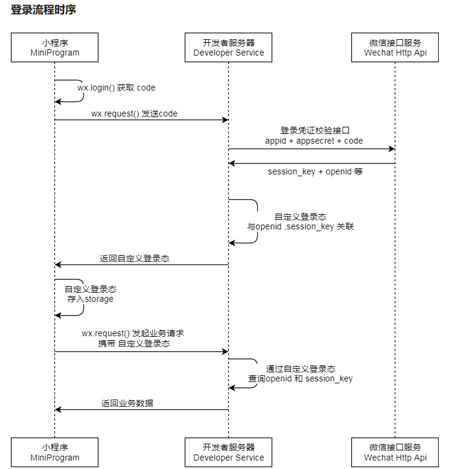
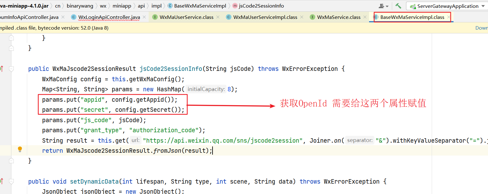

# 谷粒随享

当用户在查询专辑列表的时候，就应该让用户登录，所以在此我们自定义一个注解来表示访问此功能时必须要登录！

思路：

编写一个自定义注解：GuiGuLogin，使用这个注解去拦截，当用户未登录的时候，查看专辑或声音列表时，需要给前端发起一个提示信息。前端根据这个提示信息[ResultCodeEnum.LOGIN_AUTH]，就能够跳转到登录页面！

## 添加登录注解

在 service-util 模块中添加登录注解

注解作用：哪些需要登录才能访问必须要添加，那些需要获取到用户Id 也必须加这个注解.

```java
package com.atguigu.tingshu.common.login;

import java.lang.annotation.*;

@Documented
@Retention(RetentionPolicy.RUNTIME)
@Target(ElementType.METHOD)
public @interface GuiGuLogin {

    /**
     * 是否必须要登录
     * @return
     */
    boolean required() default true;
}
```

切面类 GuiGuLoginAspect 中要获取到请求对象HttpServletRequest，通过这个对象获取到用户登录时存储的token 数据，这样才能判断用户是否登录。

RequestContextHolder 类持有上下文的Request容器。

用法：

```java
//  获取请求对象
RequestAttributes requestAttributes = RequestContextHolder.getRequestAttributes();
//  转化为ServletRequestAttributes
ServletRequestAttributes sra = (ServletRequestAttributes) requestAttributes;
//  获取到HttpServletRequest 对象
HttpServletRequest request = sra.getRequest();
//	获取到HttpServletResponse 对象
HttpServletResponse response = sra.getResponse();
```

request 和 response 如何与 当前进行挂钩的？看底层源码

首先分析 RequestContextHolder这个类,里面有两个ThreadLocal 保存当前线程下的request

```java
public abstract class RequestContextHolder {
    // 得到存储进去的request
    private static final ThreadLocal<RequestAttributes> requestAttributesHolder = new NamedThreadLocal("Request attributes");
    //可被子线程继承的reques
    private static final ThreadLocal<RequestAttributes> inheritableRequestAttributesHolder = new NamedInheritableThreadLocal("Request context");		
}  
```

再看getRequestAttributes() 方法，相当于直接获取ThreadLocal里面的值,这样就保证了每一次获取到的Request是该请求的request.

```java
@Nullable
public static RequestAttributes getRequestAttributes() {
    RequestAttributes attributes = (RequestAttributes)requestAttributesHolder.get();
    if (attributes == null) {
        attributes = (RequestAttributes)inheritableRequestAttributesHolder.get();
    }
    return attributes;
}
```

request和response等是什么时候设置进去的?

springMVC 核心类DispatcherServlet 继承关系


1. `HttpServletBean` 进行初始化工作
2. `FrameworkServlet` 初始化 `WebApplicationContext`,并提供service方法预处理请
3. `DispatcherServlet` 具体分发处理.

那么就可以在`FrameworkServlet`查看到该类重写了service(),doGet(),doPost()...等方法,这些实现里面都有一个预处理方法`processRequest(request, response);`,所以定位到了我们要找的位置

查看`processRequest(request, response);`的实现,具体可以分为三步:

1. 获取上一个请求的参数
2. 重新建立新的参数
3. 设置到XXXContextHolder
4. 父类的service()处理请求
5. 恢复request
6. 发布

自定义切面类

```java
package com.atguigu.tingshu.common.login;

import com.atguigu.tingshu.common.constant.RedisConstant;
import com.atguigu.tingshu.common.execption.GuiguException;
import com.atguigu.tingshu.common.result.ResultCodeEnum;
import com.atguigu.tingshu.common.util.AuthContextHolder;
import com.atguigu.tingshu.model.user.UserInfo;
import jakarta.servlet.http.HttpServletRequest;
import lombok.SneakyThrows;
import org.aspectj.lang.ProceedingJoinPoint;
import org.aspectj.lang.annotation.Around;
import org.aspectj.lang.annotation.Aspect;
import org.springframework.beans.factory.annotation.Autowired;
import org.springframework.data.redis.core.RedisTemplate;
import org.springframework.http.server.ServletServerHttpRequest;
import org.springframework.stereotype.Component;
import org.springframework.util.StringUtils;
import org.springframework.web.context.request.RequestAttributes;
import org.springframework.web.context.request.RequestContextHolder;
import org.springframework.web.context.request.ServletRequestAttributes;

/**
 * @author atguigu-mqx
 * @ClassName GuiGuLoginAspect
 * @description: TODO
 * @date 2023年05月19日
 * @version: 1.0
 */
@Aspect
@Component
public class GuiGuLoginAspect {

    @Autowired
    private RedisTemplate redisTemplate;

    @SneakyThrows
    @Around("execution(* com.atguigu.tingshu.*.api.*.*(..)) && @annotation(guiGuLogin)")
    public Object loginAspect(ProceedingJoinPoint point,GuiGuLogin guiGuLogin){
        //  获取请求对象
        RequestAttributes requestAttributes = RequestContextHolder.getRequestAttributes();
        //  转化为ServletRequestAttributes
        ServletRequestAttributes sra = (ServletRequestAttributes) requestAttributes;
        //  获取到HttpServletRequest
        HttpServletRequest request = sra.getRequest();
        String token = request.getHeader("token");
        //  判断是否需要登录
        if (guiGuLogin.required()){
            //  必须要登录，token 为空是抛出异常
            if (StringUtils.isEmpty(token)){
                //  没有token 要抛出异常
                throw new GuiguException(ResultCodeEnum.LOGIN_AUTH);
            }
            //  如果token 不为空，从缓存中获取信息.
            UserInfo userInfo = (UserInfo) this.redisTemplate.opsForValue().get(RedisConstant.USER_LOGIN_KEY_PREFIX + token);
            //  判断对象是否为空
            if (null == userInfo){
                //  抛出异常信息
                throw new GuiguException(ResultCodeEnum.LOGIN_AUTH);
            }
        }
        //  不需要强制登录,但是，有可能需要用信息.
        if (!StringUtils.isEmpty(token)){
            //  如果token 不为空，从缓存中获取信息.
            UserInfo userInfo = (UserInfo) this.redisTemplate.opsForValue().get(RedisConstant.USER_LOGIN_KEY_PREFIX + token);
            if (null != userInfo){
                //  将用户信息存储到请求头中
                AuthContextHolder.setUserId(userInfo.getId());
                AuthContextHolder.setUsername(userInfo.getNickname());
            }
        }
        //  执行业务逻辑
        return point.proceed();
    }
}
```

在查看专辑列表的时候，添加注解。在点击查看专辑列表的时候，就会提示我们需要进行登录！


## 登录控制器

### 用户登录流程

[小程序登录 | 微信开放文档 (qq.com)](https://developers.weixin.qq.com/miniprogram/dev/framework/open-ability/login.html)



说明

1. 调用 [wx.login()](https://developers.weixin.qq.com/miniprogram/dev/api/open-api/login/wx.login.html) 获取 **临时登录凭证code** ，并回传到开发者服务器。
2. 调用 [auth.code2Session](https://developers.weixin.qq.com/miniprogram/dev/OpenApiDoc/user-login/code2Session.html) 接口，换取 **用户唯一标识 OpenID** 、 用户在微信开放平台账号下的**唯一标识UnionID**（若当前小程序已绑定到微信开放平台账号） 和 **会话密钥 session_key**。

之后开发者服务器可以根据用户标识来生成自定义登录态，用于后续业务逻辑中前后端交互时识别用户身份。

注意事项

1. 会话密钥 `session_key` 是对用户数据进行 [加密签名](https://developers.weixin.qq.com/miniprogram/dev/framework/open-ability/signature.html) 的密钥。为了应用自身的数据安全，开发者服务器**不应该把会话密钥下发到小程序，也不应该对外提供这个密钥**。
2. 临时登录凭证 code 只能使用一次

登录思路：

1. 根据微信的WxMaService 对象获取到openId
2. 根据openId 获取查看是否有用户信息
   1. 如果不存在，则注册用户，将用户的昵称，用户的头像，openId 等保存到数据库表中，并**发送消息**初始化账户信息
   2. 如果存在，将用户信息保存的缓存中,并返回token 给前端页面。

### 登录控制器

```java
package com.atguigu.tingshu.user.api;

import cn.binarywang.wx.miniapp.api.WxMaService;
import cn.binarywang.wx.miniapp.bean.WxMaJscode2SessionResult;
import com.atguigu.tingshu.common.constant.RedisConstant;
import com.atguigu.tingshu.common.result.Result;
import com.atguigu.tingshu.model.user.UserInfo;
import com.atguigu.tingshu.user.service.UserInfoService;
import com.baomidou.mybatisplus.core.conditions.query.LambdaQueryWrapper;
import io.swagger.v3.oas.annotations.Operation;
import io.swagger.v3.oas.annotations.tags.Tag;
import lombok.extern.slf4j.Slf4j;
import me.chanjar.weixin.common.error.WxErrorException;
import org.springframework.beans.factory.annotation.Autowired;
import org.springframework.data.redis.core.RedisTemplate;
import org.springframework.web.bind.annotation.GetMapping;
import org.springframework.web.bind.annotation.PathVariable;
import org.springframework.web.bind.annotation.RequestMapping;
import org.springframework.web.bind.annotation.RestController;

import java.util.HashMap;
import java.util.UUID;
import java.util.concurrent.TimeUnit;

@Tag(name = "微信授权登录接口")
@RestController
@RequestMapping("/api/user/wxLogin")
@Slf4j
public class WxLoginApiController {

    @Autowired
    private UserInfoService userInfoService;

    @Autowired
    private RedisTemplate redisTemplate;

    @Autowired
    private WxMaService wxMaService;

    @Operation(summary = "小程序授权登录")
    @GetMapping("/wxLogin/{code}")
    public Result wxLogin(@PathVariable String code) throws WxErrorException {
        //  获取openId
        WxMaJscode2SessionResult sessionInfo = wxMaService.getUserService().getSessionInfo(code);
        //  学生端可以直接使用 wxcc651fcbab275e33 教师的 OPENID 即可
        String openId = sessionInfo.getOpenid();
        UserInfo userInfo = userInfoService.getOne(new LambdaQueryWrapper<UserInfo>().eq(UserInfo::getWxOpenId, openId));
        //  如果数据库中没有这个对象
        if (null == userInfo){
            //  创建对象
            userInfo = new UserInfo();
            //  赋值用户昵称
            userInfo.setNickname("听友"+System.currentTimeMillis());
            //  赋值用户头像图片
 userInfo.setAvatarUrl("https://oss.aliyuncs.com/aliyun_id_photo_bucket/default_handsome.jpg");
            //  赋值wxOpenId
            userInfo.setWxOpenId(openId);
            //  保存用户信息
            userInfoService.save(userInfo);
            //  初始化账户信息
            kafkaService.sendMessage(KafkaConstant.QUEUE_USER_REGISTER, userInfo.getId().toString());
        }

        //  创建 token
        String token = UUID.randomUUID().toString().replaceAll("-","");
        //  将这两个数据存储到缓存中。
        redisTemplate.opsForValue().set(RedisConstant.USER_LOGIN_KEY_PREFIX+token, userInfo, RedisConstant.USER_LOGIN_KEY_TIMEOUT, TimeUnit.SECONDS);
       
        //  将这个数据存储到map中并返回
        HashMap<String, Object> map = new HashMap<>();
        map.put("token",token);
        //  返回数据
        return Result.ok(map);
    }
}
```

### 创建WxMaService 服务对象

创建WechatAccountConfig配置类 ，因为getSessionInfo() 方法底层需要两个key




```java
package com.atguigu.tingshu.user.config;

import lombok.Data;
import org.springframework.boot.context.properties.ConfigurationProperties;
import org.springframework.stereotype.Component;

@Data
@Component
@ConfigurationProperties(prefix = "wechat.login")
@RefreshScope
public class WechatAccountConfig {
    //  公众平台的appId
    private String appId;
    //  小程序微信公众平台秘钥
    private String appSecret;
}
```

将WxMaService 注入到spring 容器中

```java
package com.atguigu.tingshu.user.config;

import cn.binarywang.wx.miniapp.api.WxMaService;
import cn.binarywang.wx.miniapp.api.impl.WxMaCloudServiceImpl;
import cn.binarywang.wx.miniapp.api.impl.WxMaServiceImpl;
import cn.binarywang.wx.miniapp.config.WxMaConfig;
import cn.binarywang.wx.miniapp.config.impl.WxMaDefaultConfigImpl;
import org.springframework.beans.factory.annotation.Autowired;
import org.springframework.context.annotation.Bean;
import org.springframework.stereotype.Component;

/**
 * @author atguigu-mqx
 * @ClassName WeChatMpConfig
 * @description: TODO
 * @date 2023年05月20日
 * @version: 1.0
 */
@Component
public class WeChatMpConfig {

    @Autowired
    private WechatAccountConfig wechatAccountConfig;

    @Bean
    public WxMaService wxMaService(){
        //  创建对象
        WxMaDefaultConfigImpl wxMaConfig =  new WxMaDefaultConfigImpl();
        wxMaConfig.setAppid(wechatAccountConfig.getAppId());
        wxMaConfig.setSecret(wechatAccountConfig.getAppSecret());
        wxMaConfig.setMsgDataFormat("JSON");
        //  创建 WxMaService 对象
        WxMaService service = new WxMaServiceImpl();
        //  给 WxMaService 设置配置选项
        service.setWxMaConfig(wxMaConfig);
        return service;
    }
}
```

### 编写KafkaService发送方法

```java
package com.atguigu.tingshu.common.service;

import com.alibaba.fastjson.JSON;
import org.slf4j.Logger;
import org.slf4j.LoggerFactory;
import org.springframework.beans.factory.annotation.Autowired;
import org.springframework.kafka.core.KafkaTemplate;
import org.springframework.stereotype.Service;

import java.util.concurrent.CompletableFuture;

@Service
public class KafkaService {

    private static final Logger logger = LoggerFactory.getLogger(KafkaService.class);

    @Autowired
    private KafkaTemplate kafkaTemplate;

    /**
     * 发送消息方法
     * @param topic
     * @param value
     * @return
     */
    public boolean sendMessage(String topic,Object value){
        //  调用发送消息方法
        return this.sendMessage(topic,null,value);
    }

    /**
     * 封装发送消息方法
     * @param topic
     * @param key
     * @param value
     * @return
     */
    private boolean sendMessage(String topic, String key, Object value) {
        // 发送消息对象
        CompletableFuture completableFuture = kafkaTemplate.send(topic, key, value);
        //  执行成功回调方法
        completableFuture.thenAccept(result->{
            logger.debug("发送消息成功: topic={}，key={},value={}",topic,key, JSON.toJSONString(value));
        }).exceptionally(e->{
            logger.error("发送消息失败: topic={}，key={},value={}",topic,key, JSON.toJSONString(value));
            return false;
        });
        return true;
    }
}
```

### 在service-acount 中监听消息

```java
package com.atguigu.tingshu.account.receiver;

@Component
public class AccountReceiver {
    //  注入服务层对象
    @Autowired
    UserAccountService userAccountService;

    /**
     * 监听消息并添加账户信息
     * @param record
     */
    @KafkaListener(topics = KafkaConstant.QUEUE_USER_REGISTER)
    public void addUserAccount(ConsumerRecord<String,String> record){
        //  获取用户Id
        Long userId = Long.parseLong(record.value());
        if (null == userId){
            return;
        }
        //  添加账户信息
        userAccountService.addUserAccount(userId);
    }
}
```

初始化账户信息：

接口

```
public interface UserAccountService extends IService<UserAccount> {

    /**
     * 添加账户信息
     * @param userId
     */
    void addUserAccount(Long userId);
}
```

实现类：

```java
@Service
@SuppressWarnings({"unchecked", "rawtypes"})
public class UserAccountServiceImpl extends ServiceImpl<UserAccountMapper, UserAccount> implements UserAccountService {

   @Autowired
   private UserAccountMapper userAccountMapper;

   @Override
   public void addUserAccount(Long userId) {
      // user_account
      UserAccount userAccount = new UserAccount();
      userAccount.setUserId(userId);
      userAccountMapper.insert(userAccount);
   }
}
```

### 获取用户登录信息

http://127.0.0.1/api/user/wxLogin/getUserInfo 获取用户信息 ，将查询到的信息放入这个实体类UserInfoVo中

WxLoginApiController 控制器

思路：

 	1.	需要从请求头中获取token
 	2.	利用token 生成换成的key，从缓存中获取数据，并放入ThreadLocl 中，这样才能使用AuthContextHolder获取用户Id

```java
/**
 * 根据用户Id获取到用户数据
 * @return
 */
@GuiGuLogin
@Operation(summary = "获取登录信息")
@GetMapping("getUserInfo")
public Result getUserInfo(){
  //  获取到用户Id
  Long userId = AuthContextHolder.getUserId();
  //  调用服务层方法
  UserInfoVo userInfoVo = userInfoService.getUserInfoVoByUserId(userId);
  //  返回数据
  return Result.ok(userInfoVo);
}
```

接口：

```java
package com.atguigu.tingshu.user.service;

import com.atguigu.tingshu.model.user.UserInfo;
import com.atguigu.tingshu.vo.user.UserInfoVo;
import com.baomidou.mybatisplus.extension.service.IService;

public interface UserInfoService extends IService<UserInfo> {
    /**
     * 根据userId 获取用户登录信息
     * @param userId
     * @return
     */
    UserInfoVo getUserInfoVoByUserId(Long userId);
}
```

实现类：

```java
package com.atguigu.tingshu.user.service.impl;

import com.atguigu.tingshu.model.user.UserInfo;
import com.atguigu.tingshu.user.mapper.UserInfoMapper;
import com.atguigu.tingshu.user.service.UserInfoService;
import com.atguigu.tingshu.vo.user.UserInfoVo;
import com.baomidou.mybatisplus.extension.service.impl.ServiceImpl;
import lombok.extern.slf4j.Slf4j;
import org.springframework.beans.BeanUtils;
import org.springframework.beans.factory.annotation.Autowired;
import org.springframework.stereotype.Service;

@Slf4j
@Service
@SuppressWarnings({"unchecked", "rawtypes"})
public class UserInfoServiceImpl extends ServiceImpl<UserInfoMapper, UserInfo> implements UserInfoService {

	@Autowired
	private UserInfoMapper userInfoMapper;

	@Override
	public UserInfoVo getUserInfoVoByUserId(Long userId) {
		//	获取到用户信息对象
		UserInfo userInfo = this.getById(userId);
		//	创建UserInfoVo 对象
		UserInfoVo userInfoVo = new UserInfoVo();
		//	属性拷贝
		BeanUtils.copyProperties(userInfo,userInfoVo);
		return userInfoVo;
	}
}
```

## 更新用户信息方法

登录成功之后，可以修改用户相关信息。

```java
/**
 * 更新用户信息
 * @param userInfoVo
 * @return
 */
@GuiGuLogin
@Operation(summary = "更新用户信息")
@PostMapping("updateUser")
public Result updateUser(@RequestBody UserInfoVo userInfoVo){
  //  获取到用户Id
  Long userId = AuthContextHolder.getUserId();
  UserInfo userInfo = new UserInfo();
  userInfo.setId(userId);
  userInfo.setNickname(userInfoVo.getNickname());
  userInfo.setAvatarUrl(userInfoVo.getAvatarUrl());

  //  执行更新方法
  userInfoService.updateById(userInfo);
  return Result.ok();
}
```

