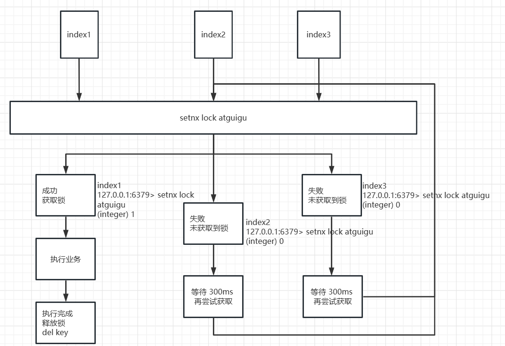
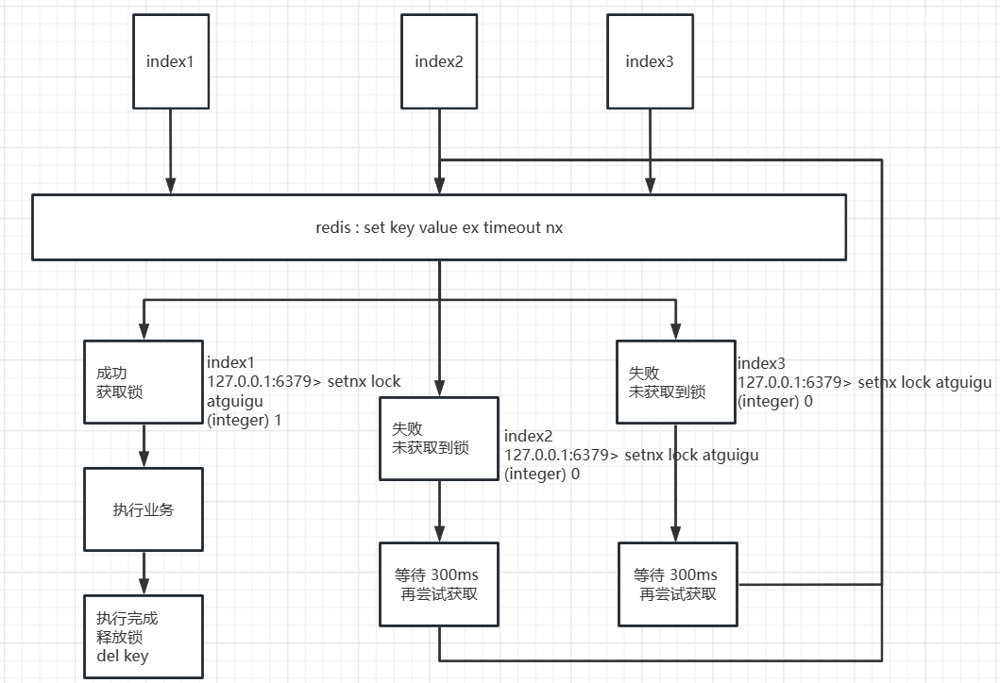
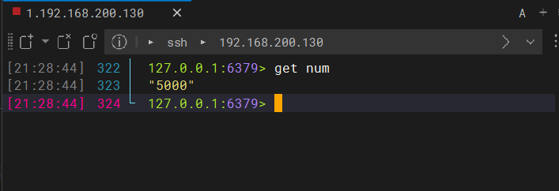

# 谷粒随享

## 详情优化

虽然咱们实现了页面需要的功能，但是考虑到该页面是被用户高频访问的，所以性能需要优化。一般一个系统最大的性能瓶颈，就是数据库的io操作。从数据库入手也是调优性价比最高的切入点。

一般分为两个层面：

- 一是提高数据库sql本身的性能
- 二是尽量避免直接查询数据库

重点要讲的是另外一个层面：尽量避免直接查询数据库。

解决办法就是：**缓存**


缓存常见问题：

缓存最常见的3个问题： 面试

1. 缓存穿透
2. 缓存雪崩
3. 缓存击穿

**缓存穿透**: 是指查询一个不存在的数据，由于缓存无法命中，将去查询数据库，但是数据库也无此记录，并且出于容错考虑，我们没有将这次查询的null写入缓存，这将导致这个不存在的数据每次请求都要到存储层去查询，失去了缓存的意义。在流量大时，可能DB就挂掉了，要是有人利用不存在的key频繁攻击我们的应用，这就是漏洞。

- 解决1 ：空结果也进行缓存，但它的过期时间会很短，最长不超过五分钟，但是不能防止随机穿透。
- 解决2 ：使用布隆过滤器来解决随机穿透问题。


**缓存雪崩**:是指在我们设置缓存时采用了相同的过期时间，导致缓存在某一时刻同时失效，请求全部转发到DB，DB瞬时压力过重雪崩。

- 解决1：原有的失效时间基础上增加一个随机值，比如1-5分钟随机，这样每一个缓存的过期时间的重复率就会降低，就很难引发集体失效的事件。
- 解决2：如果单节点宕机，可以采用集群部署方式防止雪崩

**缓存击穿**: 是指对于一些设置了过期时间的key，如果这些key可能会在某些时间点被超高并发地访问，是一种非常“热点”的数据。这个时候，需要考虑一个问题：如果这个key在大量请求同时进来之前正好失效，那么所有对这个key的数据查询都落到db，我们称为缓存击穿。

与缓存雪崩的区别：

1. 击穿是一个热点key失效
2. 雪崩是很多key集体失效

- 解决：锁


### 本地锁的局限性

之前，我们学习过synchronized 及lock锁，这些锁都是本地锁。接下来写一个案例，演示本地锁的问题

在service-album 微服务中添加 TestController 控制器：

```java
package com.atguigu.tingshu.album.controller;

import com.atguigu.tingshu.album.service.TestService;
import com.atguigu.tingshu.common.result.Result;
import org.springframework.beans.factory.annotation.Autowired;
import org.springframework.web.bind.annotation.GetMapping;
import org.springframework.web.bind.annotation.RequestMapping;
import org.springframework.web.bind.annotation.RestController;

/**
 * @author atguigu-mqx
 * @ClassName TestController
 * @description: TODO
 * @date 2023年08月22日
 * @version: 1.0
 */
@RestController
@RequestMapping("api/album/test")
public class TestController {

    //  注入服务层方法
    @Autowired
    private TestService testService;

    /**
     * 测试分布式锁
     * @return
     */
    @GetMapping("testLock")
    public Result testLock(){
        testService.testLock();
        return Result.ok();
    }
}
```

接口与实现类：

```java
public interface TestService {
    /**
     * 测试分布式锁
     */
    void testLock();

}
```

本地锁实现：

```java
@Autowired
private StringRedisTemplate stringRedisTemplate;

@Override
public synchronized void testLock() {
  try {
    //1.从Redis缓存中获取key="num"的值  保证redis中存在"num"(手动提前在redis中创建key)
    String value = stringRedisTemplate.opsForValue().get("num");
    if (StringUtils.isBlank(value)) {
      return;
    }
    //2.对获取到值进行+1操作
    int num = Integer.parseInt(value);
    stringRedisTemplate.opsForValue().set("num", String.valueOf(++num));

  } catch (NumberFormatException e) {
    e.printStackTrace();
  }
}
```

启动三个微服务端口号分别为 8501、8601、8701 然后通过网关复杂均衡访问控制器


测试本地锁：

在linux 系统中安装 ab 压力测试工具 httpd-tools（yum install -y httpd-tools）

命令语法：ab  -n（一次发送的请求数）  -c（请求的并发数） 访问路径

```
ab  -n 5000 -c 100 http://192.168.200.1/api/album/test/testLock
```

发现结果不是5000 ，说明本地锁是锁不住资源的；因此要使用分布式锁！


### 分布式锁

随着业务发展的需要，原单体单机部署的系统被演化成分布式集群系统后，由于分布式系统多线程、多进程并且分布在不同机器上，这将使原单机部署情况下的并发控制锁策略失效，单纯的Java API并不能提供分布式锁的能力。为了解决这个问题就需要一种跨JVM的互斥机制来控制共享资源的访问，这就是分布式锁要解决的问题！

分布式锁主流的实现方案：

1. 基于数据库实现分布式锁
2. 基于缓存（ Redis等）
3. 基于Zookeeper

每一种分布式锁解决方案都有各自的优缺点：

1. 性能：Redis最高
2. 可靠性：zookeeper最高

### 使用redis脚本实现分布式锁

#### 使用 setnx 命令实现




1. 多个客户端同时获取锁（setnx）

2. 获取成功，执行业务逻辑{从db获取数据，放入缓存，执行完成释放锁（del）}

3. 其他客户端等待重试

   ```java
   /**
    * 原理：执行业务方法前先尝试获取锁（setnx存入key val），如果获取锁成功再执行业务代码，业务执行完毕后将锁释放(del key)
    */
   @Override
   public void testLock() {

       //0.先尝试获取锁 setnx key val
       Boolean flag = stringRedisTemplate.opsForValue().setIfAbsent("lock", "lock");
       if(flag){
           //获取锁成功，执行业务代码
           //1.先从redis中通过key num获取值  key提前手动设置 num 初始值：0
           String value = stringRedisTemplate.opsForValue().get("num");
           //2.如果值为空则非法直接返回即可
           if (StringUtils.isBlank(value)) {
               return;
           }
           //3.对num值进行自增加一
           int num = Integer.parseInt(value);
           stringRedisTemplate.opsForValue().set("num", String.valueOf(++num));

           //4.将锁释放
           stringRedisTemplate.delete("lock");

       }else{
           try {
               Thread.sleep(100);
               this.testLock();
           } catch (InterruptedException e) {
               e.printStackTrace();
           }
       }
   }
   ```

   进行测试：运行结果应该是5000。

   可能出现的问题：

   问题：setnx刚好获取到锁，业务逻辑出现异常，导致锁无法释放

   解决：设置过期时间，自动释放锁。

#### 使用setex给锁设置过期时间

1. 首先想到通过expire设置过期时间（缺乏原子性：如果在setnx和expire之间出现异常，锁也无法释放）
2. 在set时指定过期时间（推荐）




将上锁代码改为：

```java
Boolean flag = stringRedisTemplate.opsForValue().setIfAbsent("lock", "lock", 3, TimeUnit.SECONDS);
```

测试结果应该是5000

问题：可能会释放其他服务器的锁。

场景：如果业务逻辑的执行时间是7s。执行流程如下

1. index1业务逻辑没执行完，3秒后锁被自动释放。
2. index2获取到锁，执行业务逻辑，3秒后锁被自动释放。
3. index3获取到锁，执行业务逻辑
   1. index1业务逻辑执行完成，开始调用del释放锁，这时释放的是index3的锁，导致index3的业务只执行1s就被别人释放。

最终等于没锁的情况。

解决：setnx获取锁时，设置一个指定的唯一值（例如：uuid）；释放前获取这个值，判断是否自己的锁。

#### 使用UUID 防止误删锁

修改代码：

```java
@Override
public synchronized void testLock() {
    //  声明uuid
    String uuid = UUID.randomUUID().toString();
    //  将uuid 存储到缓存中
    Boolean flag = stringRedisTemplate.opsForValue().setIfAbsent("lock", uuid, 3, TimeUnit.SECONDS);
    if (flag){
        try {
            //1.从Redis缓存中获取key="num"的值  保证redis中存在"num"(手动提前在redis中创建key)
            String value = stringRedisTemplate.opsForValue().get("num");
            if (StringUtils.isBlank(value)) {
                return;
            }
            //2.对获取到值进行+1操作
            int num = Integer.parseInt(value);
            stringRedisTemplate.opsForValue().set("num", String.valueOf(++num));
            //  判断uuid 是否与缓存中的数据相等
            if (uuid.equals(stringRedisTemplate.opsForValue().get("lock"))){
                //  如果相等，删除锁
                stringRedisTemplate.delete("lock");
            }

        } catch (NumberFormatException e) {
            e.printStackTrace();
        }
    }else {
        try {
            Thread.sleep(100);
            this.testLock();
        } catch (InterruptedException e) {
            e.printStackTrace();
        }
    }

}
```

问题：删除操作缺乏原子性。

场景：

1. index1执行删除时，查询到的lock值确实和uuid相等
2. index1执行删除前，lock刚好过期时间已到，被Redis自动释放 在Redis中没有了锁。


3. index2获取了lock,index2线程获取到了cpu的资源，开始执行方法
4. index1执行删除，此时会把index2的lock删除

index1 因为已经在方法中了，所以不需要重新上锁。index1有执行的权限。index1已经比较完成了，这个时候，开始执行删除的是index2的锁！

解决方案：使用lua脚本保证删除锁具有原子性操作

#### LUA脚本保证删除具有原子性

```java
/**
 * 采用SpringDataRedis实现分布式锁
 * 原理：执行业务方法前先尝试获取锁（setnx存入key val），如果获取锁成功再执行业务代码，业务执行完毕后将锁释放(del key)
 */
@Override
public void testLock() {

    //0.先尝试获取锁 setnx key val
    //问题：锁可能存在线程间相互释放
    //Boolean flag = stringRedisTemplate.opsForValue().setIfAbsent("lock", "lock", 10, TimeUnit.SECONDS);
    //解决：锁值设置为uuid
    String uuid = UUID.randomUUID().toString();
    Boolean flag = stringRedisTemplate.opsForValue().setIfAbsent("lock", uuid, 10, TimeUnit.SECONDS);

    if(flag){
        //获取锁成功，执行业务代码
        //1.先从redis中通过key num获取值  key提前手动设置 num 初始值：0
        String value = stringRedisTemplate.opsForValue().get("num");
        //2.如果值为空则非法直接返回即可
        if (StringUtils.isBlank(value)) {
            return;
        }
        //3.对num值进行自增加一
        int num = Integer.parseInt(value);
        stringRedisTemplate.opsForValue().set("num", String.valueOf(++num));

        //4.将锁释放 判断uuid
        //问题：删除操作缺乏原子性。
        //if(uuid.equals(stringRedisTemplate.opsForValue().get("lock"))){ //线程一：判断是满足是当前线程锁的值
        //    //条件满足，此时锁正好到期，redis锁自动释放了线程2获取锁成功，线程1将线程2的锁删除
        //    stringRedisTemplate.delete("lock");
        //}
        //解决：redis执行lua脚本保证原子，lua脚本执行会作为一个整体执行

        //执行脚本参数 参数1：脚本对象封装lua脚本，参数二：lua脚本中需要key参数（KEYS[i]）  参数三：lua脚本中需要参数值 ARGV[i]
        //4.1 先创建脚本对象 DefaultRedisScript泛型脚本语言返回值类型 Long 0：失败 1：成功
        DefaultRedisScript<Long> redisScript = new DefaultRedisScript<>();
        //4.2设置脚本文本
        String script = "if redis.call(\"get\",KEYS[1]) == ARGV[1]\n" +
                "then\n" +
                "    return redis.call(\"del\",KEYS[1])\n" +
                "else\n" +
                "    return 0\n" +
                "end";
        redisScript.setScriptText(script);
        //4.3 设置响应类型
        redisScript.setResultType(Long.class);
        stringRedisTemplate.execute(redisScript, Arrays.asList("lock"), uuid);
    }else{
        try {
            //睡眠
            Thread.sleep(100);
            //自旋重试
            this.testLock();
        } catch (InterruptedException e) {
            e.printStackTrace();
        }
    }
}
```

总结：

为了确保分布式锁可用，我们至少要确保锁的实现同时满足以下四个条件：

- 互斥性。在任意时刻，只有一个客户端能持有锁。
- 不会发生死锁。即使有一个客户端在持有锁的期间崩溃而没有主动解锁，也能保证后续其他客户端能加锁。
- 解铃还须系铃人。加锁和解锁必须是同一个客户端，客户端自己不能把别人加的锁给解了。
- 加锁和解锁必须具有原子性。


### 使用 redisson 解决分布式锁

**Redisson是一个在Redis的基础上实现的Java驻内存数据网格**（In-Memory Data Grid）。它不仅提供了一系列的分布式的Java常用对象，还提供了许多分布式服务。其中包括(BitSet, Set, Multimap, SortedSet, Map, List, Queue, BlockingQueue, Deque, BlockingDeque, Semaphore, Lock, AtomicLong, CountDownLatch, Publish / Subscribe, Bloom filter, Remote service, Spring cache, Executor service, Live Object service, Scheduler service) Redisson提供了使用Redis的最简单和最便捷的方法。Redisson的**宗旨是促进使用者对Redis的关注分离**（Separation of Concern），从而让使用者能够将精力更集中地放在处理业务逻辑上。

官方文档地址：[https://github.com/Redisson/Redisson/wiki](https://github.com/Redisson/Redisson/wiki "https://github.com/Redisson/Redisson/wiki")

实现步骤：

1. 在service-util 模块中解开redisson相关依赖

```java
<dependency>
    <groupId>org.redisson</groupId>
    <artifactId>redisson-spring-boot-starter</artifactId>
</dependency>
```

2. 在service-util 模块中添加配置类

```java
package com.atguigu.tingshu.common.config.redssion;

import lombok.Data;
import org.redisson.Redisson;
import org.redisson.api.RedissonClient;
import org.redisson.config.Config;
import org.redisson.config.SingleServerConfig;
import org.springframework.boot.context.properties.ConfigurationProperties;
import org.springframework.context.annotation.Bean;
import org.springframework.context.annotation.Configuration;
import org.springframework.util.StringUtils;

/**
 * redisson配置信息
 */
@Data
@Configuration
@ConfigurationProperties("spring.data.redis")
public class RedissonConfig {

    private String host;

    private String password;

    private String port;

    private int timeout = 3000;
    private static String ADDRESS_PREFIX = "redis://";

    /**
     * 自动装配
     *
     */
    @Bean
    RedissonClient redissonSingle() {
        Config config = new Config();

        if(StringUtils.isEmpty(host)){
            throw new RuntimeException("host is  empty");
        }
        SingleServerConfig serverConfig = config.useSingleServer()
                .setAddress(ADDRESS_PREFIX + this.host + ":" + port)
                .setTimeout(this.timeout);
        if(!StringUtils.isEmpty(this.password)) {
            serverConfig.setPassword(this.password);
        }
        return Redisson.create(config);
    }
}
```

3. 优化代码

```java
package com.atguigu.tingshu.album.service.impl;

import com.alibaba.cloud.commons.lang.StringUtils;
import com.atguigu.tingshu.album.service.TestService;
import org.redisson.api.RLock;
import org.redisson.api.RedissonClient;
import org.springframework.beans.factory.annotation.Autowired;
import org.springframework.data.redis.core.StringRedisTemplate;
import org.springframework.stereotype.Service;

/**
 * @author atguigu-mqx
 * @ClassName TestServiceImpl
 * @description: TODO
 * @date 2023年08月22日
 * @version: 1.0
 */
@Service
public class TestServiceImpl implements TestService {

    @Autowired
    private StringRedisTemplate stringRedisTemplate;

    @Autowired
    private RedissonClient redissonClient;

    @Override
    public void testLock() {
        //0.1 创建锁对象
        RLock lock = redissonClient.getLock("lock");

        //0.2 获取锁
        //0.2.1 一直等待到获取锁,如果获取锁成功,锁的有效时间为:30s,底层启动"看门狗"线程(如果业务有超时风险)可以延迟锁有效时间
        lock.lock();

        //0.2.2 一直等待到获取锁,如果获取锁成功,自定义锁有效时间
        //lock.lock(10, TimeUnit.SECONDS);

        //0.2.3 尝试获取锁 参数1:等待获取锁时间,超时则放弃获取  参数2:如果获取锁成功,锁的有效时间 参数3:时间单位
        //boolean b = lock.tryLock(3, 10, TimeUnit.SECONDS);
        try {
            //1.从Redis缓存中获取key="num"的值  保证redis中存在"num"(手动提前在redis中创建key)
            String value = stringRedisTemplate.opsForValue().get("num");
            if (StringUtils.isBlank(value)) {
                return;
            }
            //2.对获取到值进行+1操作
            int num = Integer.parseInt(value);
            stringRedisTemplate.opsForValue().set("num", String.valueOf(++num));

        } catch (NumberFormatException e) {
            e.printStackTrace();
        } finally {
            //3. 释放锁
            lock.unlock();
        }
    }
}
```

分布式锁：

```
ab  -n 5000 -c 100 http://192.168.200.1/api/album/test/testLock
```



### 分布式锁整合业务

#### 使用redis 分布式锁整合业务

```java
@Override
public AlbumInfo getAlbumInfoById(Long id) {
  //	创建专辑对象
  AlbumInfo albumInfo = new AlbumInfo();
  //	声明缓存key
  String albumKey = RedisConstant.ALBUM_INFO_PREFIX+id;
  try {
    albumInfo = (AlbumInfo) redisTemplate.opsForValue().get(albumKey);
    if (null == albumInfo){
      //	查询数据库
      String albumLockKey = RedisConstant.ALBUM_INFO_PREFIX+id+ ":lock";
      //	声明一个uuid
      String uuid = UUID.randomUUID().toString();
      Boolean result = this.redisTemplate.opsForValue().setIfAbsent(albumLockKey, uuid, RedisConstant.ALBUM_LOCK_EXPIRE_PX1, TimeUnit.SECONDS);
      if (result){
        try {
          //	获取到锁
          albumInfo = getAlbumInfoDB(id);
          if (null == albumInfo){
            //	设置控制存储到缓存
            AlbumInfo albumInfo1 = new AlbumInfo();
            redisTemplate.opsForValue().set(albumKey,albumInfo1,RedisConstant.ALBUM_TEMPORARY_TIMEOUT,TimeUnit.SECONDS);
            return albumInfo1;
          }
          //	将数据写入缓存
 redisTemplate.opsForValue().set(albumKey,albumInfo,RedisConstant.ALBUM_TIMEOUT,TimeUnit.SECONDS);
          return albumInfo;
        } finally {
          //	使用lua脚本删除锁
          delRedisKey(albumLockKey, uuid);
        }
      } else {
        //	没有获取到锁的线程，自旋
        return getAlbumInfoById(id);
      }
    } else {
      //	缓存不为空，直接返回数据
      return albumInfo;
    }
  } catch (Exception e) {
    e.printStackTrace();
  }
  //	如果有异常，最后查询数据库
  return getAlbumInfoDB(id);
}
//  删除缓存的key
private void delRedisKey(String albumLockKey, String uuid) {
  DefaultRedisScript<Long> redisScript = new DefaultRedisScript<>();
  //4.2设置脚本文本
  String script = "if redis.call(\"get\",KEYS[1]) == ARGV[1]\n" +
    "then\n" +
    "    return redis.call(\"del\",KEYS[1])\n" +
    "else\n" +
    "    return 0\n" +
    "end";
  redisScript.setScriptText(script);
  //4.3 设置响应类型
  redisScript.setResultType(Long.class);
  redisTemplate.execute(redisScript, Arrays.asList(albumLockKey), uuid);
}
```

#### 使用redisson整合分布式锁

```java
@Override
public AlbumInfo getAlbumInfoById(Long id) {
  //	创建专辑对象
  AlbumInfo albumInfo = new AlbumInfo();
  //	声明缓存key
  String albumKey = RedisConstant.ALBUM_INFO_PREFIX+ id;
  try {
    albumInfo = (AlbumInfo) redisTemplate.opsForValue().get(albumKey);
    if (null == albumInfo){
      //	查询数据库，声明锁
      String albumLockKey = RedisConstant.ALBUM_INFO_PREFIX+ id + ":lock";
      //	获取锁对象
      RLock lock = redissonClient.getLock(albumLockKey);
      boolean result = lock.tryLock(RedisConstant.ALBUM_LOCK_EXPIRE_PX1, RedisConstant.ALBUM_LOCK_EXPIRE_PX2, TimeUnit.SECONDS);
      if (result){
        try {
          //	获取到锁
          albumInfo = getAlbumInfoDB(id);
          if (null == albumInfo){
            //	设置控制存储到缓存
            AlbumInfo albumInfo1 = new AlbumInfo();
 redisTemplate.opsForValue().set(albumKey,albumInfo1,RedisConstant.ALBUM_TEMPORARY_TIMEOUT,TimeUnit.SECONDS);
            return albumInfo1;
          }
          //	将数据写入缓存
          redisTemplate.opsForValue().set(albumKey,albumInfo,RedisConstant.ALBUM_TIMEOUT,TimeUnit.SECONDS);
          return albumInfo;
        } finally {
          //	使用lua脚本删除锁
          lock.unlock();
        }
      } else {
        //	没有获取到锁的线程，自旋
        return getAlbumInfoById(id);
      }
    } else {
      //	缓存不为空，直接返回数据
      return albumInfo;
    }
  } catch (Exception e) {
    e.printStackTrace();
  }
  //	如果有异常，最后查询数据库
  return getAlbumInfoDB(id);
}
```

### Aop与分布式锁整合

专辑详情中很多数据接口需要查询缓存，那么分布式锁的业务逻辑代码就会出现大量的重复。因此，我们可以借助Spring框架事务注解来实现简化代码。只要类上添加了一个注解，那么这个注解就会自带分布式锁的功能。

实现如下：

在service-util 模块中添加一个注解，

#### 自定义注解

```java
package com.atguigu.tingshu.common.cache;
import java.lang.annotation.*;

@Target({ElementType.METHOD})
@Retention(RetentionPolicy.RUNTIME)
@Documented
public @interface GuiGuCache {
    /**
     * 缓存key的前缀
     * @return
     */
    String prefix() default "cache";
}
```


#### 自定义切面类

```java
package com.atguigu.tingshu.common.cache;

import com.alibaba.fastjson.JSONObject;
import com.atguigu.tingshu.common.constant.RedisConstant;
import lombok.SneakyThrows;
import org.apache.ibatis.binding.MapperMethod;
import org.aspectj.lang.ProceedingJoinPoint;
import org.aspectj.lang.Signature;
import org.aspectj.lang.annotation.Around;
import org.aspectj.lang.annotation.Aspect;
import org.aspectj.lang.reflect.MethodSignature;
import org.redisson.api.RLock;
import org.redisson.api.RedissonClient;
import org.springframework.beans.factory.annotation.Autowired;
import org.springframework.data.redis.core.RedisTemplate;
import org.springframework.stereotype.Component;

import java.util.Arrays;
import java.util.concurrent.TimeUnit;

/**
 * @ClassName GuiGuCacheAspect
 * @description: TODO
 * @version: 1.0
 */
@Component
@Aspect
public class GuiGuCacheAspect {

    @Autowired
    private RedisTemplate redisTemplate;

    @Autowired
    private RedissonClient redissonClient;

    @SneakyThrows
    @Around("@annotation(com.atguigu.tingshu.common.cache.GuiGuCache)")
    public Object cacheAspect(ProceedingJoinPoint point){
        Object obj = null;
        //  获取参数列表
        Object[] args = point.getArgs();
        //  获取方法上的主键
        MethodSignature methodSignature  = (MethodSignature) point.getSignature();
        GuiGuCache guiGuCache = methodSignature.getMethod().getAnnotation(GuiGuCache.class);
        //  获取主键前缀
        String prefix = guiGuCache.prefix();
        //  组成缓存的key
        String key = prefix + Arrays.asList(args).toString();
        try {
            //  获取缓存数据
            obj = this.redisTemplate.opsForValue().get(key);
            if (obj==null){
                //  声明分布式锁key
                RLock lock = redissonClient.getLock(key + ":lock");
                boolean result = lock.tryLock(RedisConstant.CACHE_LOCK_EXPIRE_PX1, RedisConstant.CACHE_LOCK_EXPIRE_PX2, TimeUnit.SECONDS);
                if (result){
                    try {
                        //  执行带有注解的方法体
                        obj = point.proceed(args);
                        if (null == obj){
                            // 并把结果放入缓存
                            Object o = new Object();
                            this.redisTemplate.opsForValue().set(key, o, RedisConstant.CACHE_TEMPORARY_TIMEOUT, TimeUnit.SECONDS);
                            return o;
                        }
                        // 并把结果放入缓存
                        this.redisTemplate.opsForValue().set(key, obj, RedisConstant.CACHE_TIMEOUT, TimeUnit.SECONDS);
                        return obj;
                    }finally {
                        //  释放资源
                        lock.unlock();
                    }
                }else {
                    //  没有获取到锁的用户自旋
                    return cacheAspect(point);
                }
            }else {
                return obj;
            }
        } catch (Throwable e) {
            e.printStackTrace();
        }
        //  如果缓存实现了异常，暂时从数据库获取数据
        return point.proceed(args);
    }
}
```

#### 测试分布式锁

在这个实现类AlbumInfoServiceImpl中添加注解：

```java
@GuiguCache(prefix = RedisConstant.ALBUM_INFO_PREFIX)
@Override
public AlbumInfo getAlbumInfoById(Long id) {
  return this.getAlbumInfoDb(id);
}

@Override
@GuiGuCache(prefix = "albumStat:")
public AlbumStatVo getAlbumStatVoByAlbumId(Long albumId) {
  //	调用mapper 层方法
  return albumInfoMapper.selectAlbumStat(albumId);
}
```

在BaseCategoryServiceImpl实现类中添加注解：

```java
@GuiguCache(prefix = "category:")
@Override
public BaseCategoryView getCategoryViewByCategory3Id(Long category3Id) {
  return baseCategoryViewMapper.selectById(category3Id);
}
```

在UserInfoServiceImpl 实现类中添加注解：

```java
@Override
@GuiGuCache(prefix = "userInfo:")
public UserInfo getUserInfoById(Long userId) {
   // 根据主键Id 获取用户信息。
   return userInfoMapper.selectById(userId);
}
```

## 布隆过滤器

###  什么是布隆过滤器

布隆过滤器（Bloom Filter），是1970年，由一个叫布隆的小伙子提出的，距今已经五十年了。它实际上是一个很长的[二进制](https://baike.baidu.com/item/二进制/361457 "二进制")向量和一系列随机映射函数。布隆过滤器可以用于[检索](https://baike.baidu.com/item/检索/11003896 "检索")一个元素是否在一个[集合](https://baike.baidu.com/item/集合/2908117 "集合")中。它的优点是空间效率和查询时间都比一般的算法要好的多，缺点是有一定的误识别率和删除困难。二进制大家应该都清楚，存储的数据不是0就是1，默认是0。

主要用于判断一个元素是否在一个集合中，0代表不存在某个数据，1代表存在某个数据。

总结： **判断一个元素一定不存在 或者 可能存在！** 存在一定的误判率{通过代码调节}

Bit 数组：

| 0    | 0    | 0    | 0    | 0    | 0    | 0    | 0    | 0    |
| ---- | ---- | ---- | ---- | ---- | ---- | ---- | ---- | ---- |
|      |      |      |      |      |      |      |      |      |

###  布隆过滤器使用场景

大数据量的时候, 判断一个元素是否在一个集合中。解决缓存穿透问题

###  原理

存入过程

布隆过滤器上面说了，就是一个二进制数据的集合。当一个数据加入这个集合时，经历如下：

通过K个哈希函数计算该数据，返回K个计算出的hash值

这些K个hash值映射到对应的K个二进制的数组下标

将K个下标对应的二进制数据改成1。

如图所示：


查询过程

布隆过滤器主要作用就是查询一个数据，在不在这个二进制的集合中，查询过程如下：

1、通过K个哈希函数计算该数据，对应计算出的K个hash值

2、通过hash值找到对应的二进制的数组下标

3、判断：如果存在一处位置的二进制数据是0，那么该数据不存在。如果都是1，该数据**可能**存在集合中。

### 布隆过滤器的优缺点

优点

1. 由于存储的是二进制数据，所以占用的空间很小
2. 它的插入和查询速度是非常快的，时间复杂度是O（K），空间复杂度：O (M)。
   - K: 是哈希函数的个数
   - M: 是二进制位的个数
3. 保密性很好，因为本身不存储任何原始数据，只有二进制数据

缺点

添加数据是通过计算数据的hash值，那么很有可能存在这种情况：两个不同的数据计算得到相同的hash值。


例如图中的“张三”和“张三丰”，假如最终算出hash值相同，那么他们会将同一个下标的二进制数据改为1。

这个时候，你就不知道下标为1的二进制，到底是代表“张三”还是“张三丰”。

一、存在误判

假如上面的图没有存 "张三"，只存了 "张三丰"，那么用"张三"来查询的时候，会判断"张三"存在集合中。

因为“张三”和“张三丰”的hash值是相同的，通过相同的hash值，找到的二进制数据也是一样的，都是1。

误判率：

​	受三个因素影响： 二进制位的个数m, 哈希函数的个数k, 数据规模n (添加到布隆过滤器中的函数)


已知误判率p, 数据规模n, 求二进制的个数m，哈希函数的个数k {m,k 程序会自动计算 ，你只需要告诉我数据规模，误判率就可以了}


ln: 自然对数是以常数e为[底数](https://baike.baidu.com/item/底数/5416651 "底数")的[对数](https://baike.baidu.com/item/对数/91326 "对数")，记作lnN（N>0）。在物理学，生物学等自然科学中有重要的意义，一般表示方法为lnx。数学中也常见以logx表示自然对数。

二、删除困难

还是用上面的举例，因为“张三”和“张三丰”的hash值相同，对应的数组下标也是一样的。

如果你想去删除“张三”，将下标为1里的二进制数据，由1改成了0。

那么你是不是连“张三丰”都一起删了呀。


### 初始化布隆过滤器

在service-album 模块的启动类中添加

```java
@SpringBootApplication
@EnableDiscoveryClient
@EnableFeignClients
public class ServiceAlbumApplication implements CommandLineRunner {

  @Autowired
  private RedissonClient redissonClient;

  public static void main(String[] args) {
    SpringApplication.run(ServiceAlbumApplication.class, args);
  }

  /**
     * Springboot应用初始化后会执行一次该方法
     * @param args
     * @throws Exception
     */
  @Override
  public void run(String... args) throws Exception {
    //初始化布隆过滤器
    RBloomFilter<Object> bloomFilter = redissonClient.getBloomFilter(RedisConstant.ALBUM_BLOOM_FILTER);
    //设置数据规模 误判率 预计统计元素数量为100000，期望误差率为0.01
    bloomFilter.tryInit(100000, 0.01);
  }
}
```

### 上架专辑的时候，添加将数据添加到布隆过滤器中

SearchServiceImpl 的上架方法中添加

```java
//将新增的商品SKUID存入布隆过滤器
//获取布隆过滤器，将新增skuID存入布隆过滤器
RBloomFilter<Object> bloomFilter = redissonClient.getBloomFilter(RedisConstant.ALBUM_BLOOM_FILTER);
bloomFilter.add(albumInfo.getId());
```

### 查看专辑的时候判断布隆过滤器中是否存在

```java
//远程调用接口之前 提前知道用户访问的专辑id是否存在与布隆过滤器
RBloomFilter<Object> bloomFilter = redissonClient.getBloomFilter(RedisConstant.ALBUM_BLOOM_FILTER);
if (!bloomFilter.contains(albumId)) {
  log.error("用户查询专辑不存在：{}", albumId);
  //查询数据不存在直接返回空对象
  return result;
}
```

## mysql 与 redis 数据一致性

在后台修改专辑名称时，数据库中的数据发生了变化，但是缓存中数据确没有变化！为了保证数据一致性，此处可以使用延迟双删来保证缓存与数据库数据一致性！

AlbumInfoServiceImpl类的修改方法添加代码

```java
@Override
@Transactional(rollbackFor = Exception.class)
public void updateAlbumInfo(Long albumId,AlbumInfoVo albumInfoVo) {
   // 先删除缓存的key: album:info:[1599]
   String albumInfoKey = RedisConstant.ALBUM_INFO_PREFIX+"["+albumId+"]";
   this.redisTemplate.delete(albumInfoKey);
   // 之前业务代码
   ....

   try {
      Thread.sleep(100);
   } catch (InterruptedException e) {
      throw new RuntimeException(e);
   }
   // 删除
   this.redisTemplate.delete(albumInfoKey);
   // 判断
   if ("1".equals(albumInfoVo.getIsOpen())){
      // 上架发生消息 -- 发送的内容是由谁来决定? 消费者
      kafkaService.sendMsg(KafkaConstant.QUEUE_ALBUM_UPPER,albumInfo.getId().toString());
   } else {
      // 下架
      kafkaService.sendMsg(KafkaConstant.QUEUE_ALBUM_LOWER,albumInfo.getId().toString());
   }
}
```

