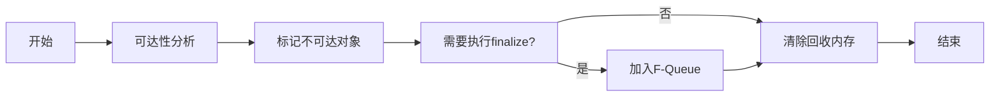
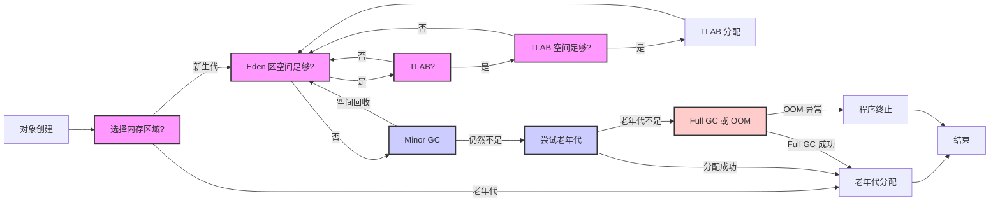

# JVM运行时内存区域划分
## 堆内存
	用于存储应用程序创建的实例对象
1. 所有线程共享
2. JVM启动时创建堆
3. 是GC垃圾回收器主要管理区域，当对象不再被引用时会被垃圾回收器回收
## 非堆内存
1. 方法区/类方法区（==用来存储已经加载的类信息结构，如类结构、运行时常量池、字段和方法数据、方法代码等==）
	1. 所有线程共享
	2. Java8之后被元空间取代，==因为在Java8之前方法区在jvm中的实现是永久代，内存大小固定，在加载大量对象或者动态生成大量对象时容易发生OOM==，因此Java8使用的元空间不再在JVM中分配内存，而是使用本地内存
	3. 逻辑上是堆，但是为了区分，通常被划分为“非堆”
2. 程序计数器 PC（==记录当前线程执行的字节码指令地址（指针）==）
	1. 线程私有
	2. JVM通过程序计数器来选取下一条需要执行的字节码指令
3. 虚拟机栈（==每个线程创建时都会创建一个虚拟机栈，用来存储栈帧==）
	1. 线程私有
	2. 一个方法从调用到执行完成，对应着一个栈帧在虚拟机栈中的入栈到出栈的过程
	3. 栈帧中存储着被调用的方法所执行的数据结构，包括局部变量表、操作数栈等等
4. 本地方法栈（与虚拟机栈类似）
	1. 线程私有
	2. JVM执行`Native`方法时使用
<svg version="1.1" xmlns="http://www.w3.org/2000/svg" viewBox="0 0 677.1597900390625 507.5874131509885" width="677.1597900390625" height="507.5874131509885">
  <!-- svg-source:excalidraw -->
  
  <defs>
    
    
  </defs>
  <rect x="0" y="0" width="677.1597900390625" height="507.5874131509885" fill="#ffffff"></rect><g stroke-linecap="round" transform="translate(10 10) rotate(0 328.57989501953125 204.56866455078125)"><path d="M32 0 C209.17 2.35, 387.45 2.3, 625.16 0 M32 0 C217.71 1, 402.93 1.26, 625.16 0 M625.16 0 C646.63 1.49, 655.32 11.43, 657.16 32 M625.16 0 C646.75 1.28, 655.22 9.49, 657.16 32 M657.16 32 C656.7 102.24, 657.33 172.78, 657.16 377.14 M657.16 32 C657.09 127.06, 656.78 221.85, 657.16 377.14 M657.16 377.14 C655.68 396.51, 646.36 409.39, 625.16 409.14 M657.16 377.14 C654.97 396.47, 646.76 408.74, 625.16 409.14 M625.16 409.14 C400.26 410.7, 177.03 410.41, 32 409.14 M625.16 409.14 C388.98 408.43, 152.58 408.2, 32 409.14 M32 409.14 C10.45 410.34, -1.87 396.58, 0 377.14 M32 409.14 C10.72 411.17, 0.54 398.48, 0 377.14 M0 377.14 C-0.3 252.99, 0.05 128.14, 0 32 M0 377.14 C-2.25 251.07, -2.71 125.73, 0 32 M0 32 C0.29 12.51, 12.43 1.47, 32 0 M0 32 C1.09 9.92, 12.49 0.86, 32 0" stroke="#1e1e1e" stroke-width="2" fill="none"></path></g><g stroke-linecap="round" transform="translate(62.828125 64.63333129882812) rotate(0 73.66278076171875 80.04718017578125)"><path d="M32 0 C48.65 0.58, 68.92 0.29, 115.33 0 M32 0 C54.44 0.62, 76.61 1.24, 115.33 0 M115.33 0 C135.64 1.29, 148.15 11.46, 147.33 32 M115.33 0 C134.83 -2.08, 145.8 8.99, 147.33 32 M147.33 32 C147.04 61.53, 147.77 90.93, 147.33 128.09 M147.33 32 C146.74 61.1, 148.51 92.42, 147.33 128.09 M147.33 128.09 C146.22 150.44, 136.55 159.31, 115.33 160.09 M147.33 128.09 C148.42 149.14, 137.41 160.3, 115.33 160.09 M115.33 160.09 C90.73 161.33, 67.34 162.33, 32 160.09 M115.33 160.09 C89.97 160.15, 63.39 160.11, 32 160.09 M32 160.09 C8.94 161.63, 0.76 150.04, 0 128.09 M32 160.09 C11.05 162.15, 0.16 149.74, 0 128.09 M0 128.09 C-0.35 97.82, 2.09 69.98, 0 32 M0 128.09 C0.28 90.79, 0.75 54.93, 0 32 M0 32 C-1.13 10.71, 11.91 0.78, 32 0 M0 32 C0.1 9.62, 10.63 1.11, 32 0" stroke="#1e1e1e" stroke-width="2" fill="none"></path></g><g transform="translate(106.49092102050781 132.18051147460938) rotate(0 29.999984741210938 12.5)"><text x="29.999984741210938" y="17.619999999999997" font-family="Excalifont, Xiaolai, Segoe UI Emoji" font-size="20px" fill="#1e1e1e" text-anchor="middle" style="white-space: pre;" direction="ltr" dominant-baseline="alphabetic">堆空间</text></g><g stroke-linecap="round" transform="translate(283.90511871215 39.678774667945675) rotate(0 168.48272705078125 159.93319702148438)"><path d="M32 0 C112.72 -0.72, 192.69 -0.07, 304.97 0 M32 0 C91.63 0.07, 150.19 0.79, 304.97 0 M304.97 0 C325.84 1.98, 336.15 11.49, 336.97 32 M304.97 0 C326.81 -1.33, 339.06 10.91, 336.97 32 M336.97 32 C334.6 95.39, 335.71 158.53, 336.97 287.87 M336.97 32 C334.91 125.69, 334.68 218.24, 336.97 287.87 M336.97 287.87 C337.53 307.73, 327.04 319.18, 304.97 319.87 M336.97 287.87 C336.45 307.57, 327.49 321.19, 304.97 319.87 M304.97 319.87 C210.74 319.85, 115.31 318.17, 32 319.87 M304.97 319.87 C203.54 319.47, 100.24 319.47, 32 319.87 M32 319.87 C10.44 317.99, 1.56 310.68, 0 287.87 M32 319.87 C11.04 319.11, -1.68 307.22, 0 287.87 M0 287.87 C-0.48 198.94, -2 107.53, 0 32 M0 287.87 C0.23 218.51, 1.61 147.53, 0 32 M0 32 C-0.68 11.26, 9.39 0.9, 32 0 M0 32 C0.49 11.59, 8.6 2.05, 32 0" stroke="#1e1e1e" stroke-width="2" fill="none"></path></g><g stroke-linecap="round" transform="translate(344.24542236328125 85.72250366210938) rotate(0 94.400634765625 26.220123291015625)"><path d="M13.11 0 C66.85 1.94, 124.43 1.61, 175.69 0 M13.11 0 C78.08 1.65, 143.19 1.15, 175.69 0 M175.69 0 C183.23 0.86, 187.14 5.47, 188.8 13.11 M175.69 0 C185.85 1.47, 190.71 2.79, 188.8 13.11 M188.8 13.11 C187.59 22.32, 187.89 31, 188.8 39.33 M188.8 13.11 C188.79 20.15, 189.34 29.25, 188.8 39.33 M188.8 39.33 C189.56 46.94, 182.75 52.52, 175.69 52.44 M188.8 39.33 C186.65 46.79, 183.74 54.36, 175.69 52.44 M175.69 52.44 C128.46 52.36, 85.6 50.88, 13.11 52.44 M175.69 52.44 C111.53 51.18, 49.84 52.77, 13.11 52.44 M13.11 52.44 C2.95 53.86, 0.52 49.75, 0 39.33 M13.11 52.44 C3.74 51.75, 0.58 47.21, 0 39.33 M0 39.33 C-1.45 29.46, 0.18 20, 0 13.11 M0 39.33 C-0.93 30.53, 0 23.04, 0 13.11 M0 13.11 C-1.8 3.18, 5.68 -1.56, 13.11 0 M0 13.11 C1.88 6.66, 3.33 1.76, 13.11 0" stroke="#1e1e1e" stroke-width="2" fill="none"></path></g><g transform="translate(388.6460876464844 99.442626953125) rotate(0 49.999969482421875 12.5)"><text x="49.999969482421875" y="17.619999999999997" font-family="Excalifont, Xiaolai, Segoe UI Emoji" font-size="20px" fill="#1e1e1e" text-anchor="middle" style="white-space: pre;" direction="ltr" dominant-baseline="alphabetic">程序计数器</text></g><g stroke-linecap="round" transform="translate(343.86466278466753 153.00645863896932) rotate(0 94.400634765625 26.220123291015625)"><path d="M13.11 0 C60.53 0.79, 109.2 -2.76, 175.69 0 M13.11 0 C70.45 -0.53, 127.99 -0.82, 175.69 0 M175.69 0 C183.3 -1.21, 187.33 3.31, 188.8 13.11 M175.69 0 C186.28 -1.52, 188.03 5.14, 188.8 13.11 M188.8 13.11 C186.99 19.82, 187.81 25.48, 188.8 39.33 M188.8 13.11 C188.41 21.78, 189.45 29.33, 188.8 39.33 M188.8 39.33 C190.14 48.66, 183.54 51.96, 175.69 52.44 M188.8 39.33 C190.68 50.28, 184.46 51.76, 175.69 52.44 M175.69 52.44 C126.49 53.17, 80.49 53.39, 13.11 52.44 M175.69 52.44 C132.16 52.24, 87.99 51.28, 13.11 52.44 M13.11 52.44 C4.64 53.62, 1.8 49.48, 0 39.33 M13.11 52.44 C6.51 51.85, 0.69 49.01, 0 39.33 M0 39.33 C1.29 31.48, 1.17 24.98, 0 13.11 M0 39.33 C0.8 28.91, 0.73 19.86, 0 13.11 M0 13.11 C0.84 5.07, 3.12 0.08, 13.11 0 M0 13.11 C2.08 4.11, 4.75 -0.16, 13.11 0" stroke="#1e1e1e" stroke-width="2" fill="none"></path></g><g transform="translate(397.7653204384761 166.72658192998495) rotate(0 40.499977111816406 12.5)"><text x="40.499977111816406" y="17.619999999999997" font-family="Excalifont, Xiaolai, Segoe UI Emoji" font-size="20px" fill="#1e1e1e" text-anchor="middle" style="white-space: pre;" direction="ltr" dominant-baseline="alphabetic">虚拟机栈</text></g><g stroke-linecap="round" transform="translate(346.4484556985889 220.64926427422614) rotate(0 94.400634765625 26.220123291015625)"><path d="M13.11 0 C51.66 2.8, 91 0.53, 175.69 0 M13.11 0 C68.19 0.09, 122.19 0.5, 175.69 0 M175.69 0 C185.97 0.28, 187.68 3.77, 188.8 13.11 M175.69 0 C183.87 1.01, 190.64 3.83, 188.8 13.11 M188.8 13.11 C188.4 24.36, 190.8 32.36, 188.8 39.33 M188.8 13.11 C188.72 19.87, 189.22 28.23, 188.8 39.33 M188.8 39.33 C189.88 47.49, 186.14 52.22, 175.69 52.44 M188.8 39.33 C190.06 48, 185.49 50.17, 175.69 52.44 M175.69 52.44 C126.16 55.77, 73.29 54.51, 13.11 52.44 M175.69 52.44 C119.55 52.47, 64.97 52.4, 13.11 52.44 M13.11 52.44 C6.02 54.02, -1.91 49.46, 0 39.33 M13.11 52.44 C5.63 51.33, 1.12 49.02, 0 39.33 M0 39.33 C-0.01 32.18, -0.32 21.74, 0 13.11 M0 39.33 C0.53 32.14, -0.29 24.61, 0 13.11 M0 13.11 C1.24 4.66, 3.98 0.44, 13.11 0 M0 13.11 C1.22 2.89, 6.29 -1.79, 13.11 0" stroke="#1e1e1e" stroke-width="2" fill="none"></path></g><g transform="translate(389.849120981792 234.36938756524177) rotate(0 50.999969482421875 12.5)"><text x="50.999969482421875" y="17.619999999999997" font-family="Excalifont, Xiaolai, Segoe UI Emoji" font-size="20px" fill="#1e1e1e" text-anchor="middle" style="white-space: pre;" direction="ltr" dominant-baseline="alphabetic">本地方法栈</text></g><g transform="translate(256.260030927563 16.22230989312112) rotate(0 79.26994323730469 12.5)"><text x="0" y="17.619999999999997" font-family="Excalifont, Xiaolai, Segoe UI Emoji" font-size="20px" fill="#1e1e1e" text-anchor="start" style="white-space: pre;" direction="ltr" dominant-baseline="alphabetic">JVM运行时数据区</text></g><g transform="translate(414.42315673828125 59.648895263671875) rotate(0 20.99999237060547 12.5)"><text x="0" y="17.619999999999997" font-family="Excalifont, Xiaolai, Segoe UI Emoji" font-size="20px" fill="#1e1e1e" text-anchor="start" style="white-space: pre;" direction="ltr" dominant-baseline="alphabetic">非堆</text></g><g stroke-linecap="round" transform="translate(353.630220645378 288.08993967595393) rotate(0 90.07278326067433 30)"><path d="M15 0 C67.56 1.96, 122.32 -0.75, 165.15 0 M165.15 0 C176.77 1.87, 178.96 5.26, 180.15 15 M180.15 15 C178.26 23.55, 178.06 37.17, 180.15 45 M180.15 45 C181.72 56.4, 175.84 61.94, 165.15 60 M165.15 60 C133.91 60.56, 103.58 63.29, 15 60 M15 60 C3.65 61.98, 0.63 55.94, 0 45 M0 45 C1.21 37.83, 0.08 25.23, 0 15 M0 15 C1.17 4.6, 6.57 -1.19, 15 0" stroke="#1e1e1e" stroke-width="2.5" fill="none" stroke-dasharray="1.5 8"></path></g><g transform="translate(373.6830530393531 293.08993967595393) rotate(0 70.01995086669922 25)"><text x="70.01995086669922" y="17.619999999999997" font-family="Excalifont, Xiaolai, Segoe UI Emoji" font-size="20px" fill="#1e1e1e" text-anchor="middle" style="white-space: pre;" direction="ltr" dominant-baseline="alphabetic">方法区（jdk8删</text><text x="70.01995086669922" y="42.62" font-family="Excalifont, Xiaolai, Segoe UI Emoji" font-size="20px" fill="#1e1e1e" text-anchor="middle" style="white-space: pre;" direction="ltr" dominant-baseline="alphabetic">除）</text></g><g stroke-linecap="round" transform="translate(11.313884211032189 439.2411907425684) rotate(0 322.03163779888416 29.173111204210045)"><path d="M14.59 0 C225.85 1.06, 437.59 0.79, 629.48 0 M14.59 0 C247.91 -1.8, 481.57 -1.93, 629.48 0 M629.48 0 C639.74 1.12, 644.15 4.52, 644.06 14.59 M629.48 0 C638.26 -0.74, 645.65 3.83, 644.06 14.59 M644.06 14.59 C642.79 23.86, 643.27 32.51, 644.06 43.76 M644.06 14.59 C644.51 25.05, 644.01 36.47, 644.06 43.76 M644.06 43.76 C642.14 53.01, 640.79 57.33, 629.48 58.35 M644.06 43.76 C645.41 52.68, 640.43 57.08, 629.48 58.35 M629.48 58.35 C485.55 59.34, 342.42 59.51, 14.59 58.35 M629.48 58.35 C407.79 61.01, 186.2 60.69, 14.59 58.35 M14.59 58.35 C5.84 56.86, 0.19 51.63, 0 43.76 M14.59 58.35 C4.54 56.84, 1.57 52.58, 0 43.76 M0 43.76 C-1.35 37.48, 0.16 31.94, 0 14.59 M0 43.76 C0.79 35.63, -0.03 28.94, 0 14.59 M0 14.59 C-0.54 3.16, 4.03 -1.02, 14.59 0 M0 14.59 C0.92 6.41, 5.53 -2.05, 14.59 0" stroke="#1e1e1e" stroke-width="2" fill="none"></path></g><g transform="translate(278.65143174033847 463.8030630261092) rotate(0 29.999984741210938 12.5)"><text x="0" y="17.619999999999997" font-family="Excalifont, Xiaolai, Segoe UI Emoji" font-size="20px" fill="#1e1e1e" text-anchor="start" style="white-space: pre;" direction="ltr" dominant-baseline="alphabetic">元空间</text></g></svg>
# 类加载过程
1. 加载(Loading)
	1. **查找字节码**：JVM根据类的全限定名（如：`com.zzh.User`），查找对应的`.class`文件。（可以是来自文件系统、网络、JAR包）
	2. **创建数据结构**：将字节码文件内容读取到内存中，转化为JVM内部的数据结构，也就是元空间中的运行时数据结构
	3. 创建`Class`**对象**：在内存中创建该类的`java.lang.Class`对象。
2. 链接(Linking)
	负责将类的字节码数据合并到JVM运行时环境中
	1. 验证(Verification)：验证类的字节码是否符合JVM规范，并且是安全的
		1. 文件格式验证
		2. 元数据验证
		3. 字节码验证
		4. 符号引用验证
	2. 准备（Preparation）：为类的static变量分配内存，并设置非static字段初始值（如int类型为0、boolean类型为false等）。
	3. 解析（Resolution）：将常量池中的符号引用替换为直接引用
3. 初始化（initialization）
	执行类构造器`<clinit>()`方法：
	1. `<clinit>()`方法是编译器自动收集类中所有==静态变量的赋值动作和静态代码块==（`static{}`）中的语句合并产生。
	2. 如果类中没有静态变量赋值和静态代码块，则可以没有`<clinit>()`方法
	3. JVM会保证在多线程环境下，一个类的`<clinit>()`方法只会被执行一次，并且会等待`<clinit>()`方法执行完成后，其他线程才能够使用该类。
# 对象创建过程
1. **类加载检查**：已经加载则直接拿来使用，反之则执行类加载过程
2. **内存分配**：在堆内存中分配对象所需要的内存空间。
3. **初始化零值**（==非static字段==）：将分配到的内存空间中的对象的字段初始化为零值，确保没有显式赋值也能有默认值
4. **设置对象头**：设置存储对象的运行时元数据信息，如：哈希码、GC信息（年龄）、锁状态、类型指针等
5. 执行`<init>`方法：类的构造器方法，进一步初始化
6. 对象引用返回：将创建好的对象返回给应用，完成对象的创建
<svg version="1.1" xmlns="http://www.w3.org/2000/svg" viewBox="0 0 872.5208951376002 967.2000552403761" width="872.5208951376002" height="967.2000552403761">
  <!-- svg-source:excalidraw -->
  
  <defs>
    
    <clipPath id="OmuU805GyJ7etoe9FvgNt">
            <rect transform="translate(0 0) rotate(0 436.2604475688001 483.60002762018803)" width="872.5208951376002" height="967.2000552403762">
          </rect>
        </clipPath>
  </defs>
  <rect x="0" y="0" width="872.5208951376002" height="967.2000552403761" fill="#ffffff"></rect><g clip-path="url(#OmuU805GyJ7etoe9FvgNt)"><g stroke-linecap="round" transform="translate(179.5722355736089 73.08649116210796) rotate(0 76.06901757405197 26.68909707411342)"><path d="M13.34 0 C60.73 1.03, 110.5 -1.34, 138.79 0 C145.62 -0.11, 155.27 1.53, 152.14 13.34 C151.99 23.52, 155.48 33.38, 152.14 40.03 C149.03 48.39, 146.89 56.21, 138.79 53.38 C103.21 53.12, 63.15 52.18, 13.34 53.38 C4.02 53.25, 1.49 45.69, 0 40.03 C3 33.2, -2.01 17.7, 0 13.34 C2.14 2.01, 6.89 -3.33, 13.34 0" stroke="none" stroke-width="0" fill="#b2f2bb"></path><path d="M13.34 0 C49.36 -0.52, 86.2 0.38, 138.79 0 M13.34 0 C48.62 0.64, 85.61 0.61, 138.79 0 M138.79 0 C147.98 -1.62, 153.65 2.51, 152.14 13.34 M138.79 0 C146.5 -1.08, 150.6 3.91, 152.14 13.34 M152.14 13.34 C150.59 23.26, 151.46 31.19, 152.14 40.03 M152.14 13.34 C153 21.14, 151.29 30.36, 152.14 40.03 M152.14 40.03 C152.5 47.26, 146.02 51.39, 138.79 53.38 M152.14 40.03 C153.04 49.78, 147.82 52.33, 138.79 53.38 M138.79 53.38 C109.65 51.97, 79.65 51.82, 13.34 53.38 M138.79 53.38 C93.48 53.49, 48.85 53.66, 13.34 53.38 M13.34 53.38 C3.46 51.97, 1.01 48.34, 0 40.03 M13.34 53.38 C4.09 53.34, -1.17 49.1, 0 40.03 M0 40.03 C-0.31 33.64, -0.55 22.75, 0 13.34 M0 40.03 C-0.54 33.75, 0.14 26.14, 0 13.34 M0 13.34 C-0.04 3.94, 3.18 -0.6, 13.34 0 M0 13.34 C-1.43 4.85, 5.11 -1.85, 13.34 0" stroke="#1e1e1e" stroke-width="2" fill="none"></path></g></g><g clip-path="url(#OmuU805GyJ7etoe9FvgNt)"><g transform="translate(214.08128610664528 87.27558823622138) rotate(0 41.559967041015625 12.5)"><text x="41.559967041015625" y="17.619999999999997" font-family="Excalifont, Xiaolai, Segoe UI Emoji" font-size="20px" fill="#1e1e1e" text-anchor="middle" style="white-space: pre;" direction="ltr" dominant-baseline="alphabetic">new 对象</text></g></g><g clip-path="url(#OmuU805GyJ7etoe9FvgNt)"><g stroke-linecap="round" transform="translate(133.38893558965714 176.3398372038343) rotate(0 128.65752035490706 35)"><path d="M161.25 9 C179.75 14.46, 194.38 19.64, 225.07 27 C257.67 38.07, 257.23 39.25, 225.07 45 C205.04 51.88, 177.55 55.54, 161.25 61 C131.52 72.02, 131.14 67.27, 96.75 61 C80.19 51.95, 57.13 46.99, 32.25 45 C-2.69 35.98, -1.22 35.97, 32.25 27 C54.77 23.85, 76.62 15.31, 96.75 9 C132.03 -3.42, 130.75 -1.36, 161.25 9" stroke="none" stroke-width="0" fill="#a5d8ff"></path><path d="M161.25 9 C179.52 11.99, 198.53 18.58, 225.07 27 M161.25 9 C185.94 16.58, 209.22 23.05, 225.07 27 M225.07 27 C256.03 35.76, 257.25 36.83, 225.07 45 M225.07 27 C255.24 37.23, 259.33 34.55, 225.07 45 M225.07 45 C198.05 52.23, 173.41 58.71, 161.25 61 M225.07 45 C212.22 47.64, 198.96 52.25, 161.25 61 M161.25 61 C129.54 71.99, 129.43 69.78, 96.75 61 M161.25 61 C127.68 70.77, 127.37 69.06, 96.75 61 M96.75 61 C73.82 53.75, 53.93 49.37, 32.25 45 M96.75 61 C72.03 53.95, 45.74 48.45, 32.25 45 M32.25 45 C-0.76 34.36, 1.66 37.23, 32.25 27 M32.25 45 C1.66 34.53, 1.16 34.3, 32.25 27 M32.25 27 C54.44 19.29, 74.27 16.15, 96.75 9 M32.25 27 C53 22.04, 74.38 14.67, 96.75 9 M96.75 9 C129.56 -0.88, 130.97 -0.86, 161.25 9 M96.75 9 C130.5 -1.71, 130.98 -1.17, 161.25 9" stroke="#1e1e1e" stroke-width="2" fill="none"></path></g></g><g clip-path="url(#OmuU805GyJ7etoe9FvgNt)"><g transform="translate(212.2177262846888 198.8398372038343) rotate(0 49.999969482421875 12.5)"><text x="49.999969482421875" y="17.619999999999997" font-family="Excalifont, Xiaolai, Segoe UI Emoji" font-size="20px" fill="#1e1e1e" text-anchor="middle" style="white-space: pre;" direction="ltr" dominant-baseline="alphabetic">类加载检查</text></g></g><g clip-path="url(#OmuU805GyJ7etoe9FvgNt)"><g stroke-linecap="round"><g transform="translate(259.20529105688166 133.18075074074324) rotate(0 -0.2022140740479017 19.241294166898)"><path d="M-0.5 -0.2 C-0.55 6.3, 0.13 32.37, 0.09 38.88 M0.24 -0.78 C0.13 5.58, 0.16 31.65, -0.09 38.12" stroke="#1e1e1e" stroke-width="2" fill="none"></path></g><g transform="translate(259.20529105688166 133.18075074074324) rotate(0 -0.2022140740479017 19.241294166898)"><path d="M-6.38 19.94 C-4.42 27.59, -1.03 32.93, -0.09 38.12 M-6.38 19.94 C-3.84 26.88, -1.69 33.6, -0.09 38.12" stroke="#1e1e1e" stroke-width="2" fill="none"></path></g><g transform="translate(259.20529105688166 133.18075074074324) rotate(0 -0.2022140740479017 19.241294166898)"><path d="M6.78 20.15 C3.85 27.66, 2.35 32.92, -0.09 38.12 M6.78 20.15 C4.37 27.01, 1.57 33.65, -0.09 38.12" stroke="#1e1e1e" stroke-width="2" fill="none"></path></g></g><mask></mask></g><g clip-path="url(#OmuU805GyJ7etoe9FvgNt)"><g stroke-linecap="round" transform="translate(588.8107875634746 178.69827464671567) rotate(0 73.97875287306977 28.868967571066833)"><path d="M14.43 0 C51.66 1.94, 90.84 1.03, 133.52 0 C145.02 -0.7, 146.58 3.06, 147.96 14.43 C147.35 23.32, 151.88 32.9, 147.96 43.3 C147.04 56.13, 140.7 60.25, 133.52 57.74 C96.67 62.66, 58.61 62.09, 14.43 57.74 C1.56 56.53, 2.28 50.85, 0 43.3 C-2.67 33.57, 1.6 31.55, 0 14.43 C3.33 5.9, 7.22 -0.12, 14.43 0" stroke="none" stroke-width="0" fill="#b2f2bb"></path><path d="M14.43 0 C60.99 1.85, 106.3 0.11, 133.52 0 M14.43 0 C39.95 0.5, 64.05 0.1, 133.52 0 M133.52 0 C141.31 1.74, 147.73 3.15, 147.96 14.43 M133.52 0 C143.54 -2.18, 145.9 4.68, 147.96 14.43 M147.96 14.43 C149.61 25.34, 147.53 34.25, 147.96 43.3 M147.96 14.43 C147.79 21.16, 148.23 28.47, 147.96 43.3 M147.96 43.3 C148.65 52.06, 143.52 57.67, 133.52 57.74 M147.96 43.3 C148.77 52, 143.62 57.94, 133.52 57.74 M133.52 57.74 C106.42 57.71, 82.1 59.02, 14.43 57.74 M133.52 57.74 C88.2 59.52, 42.68 58, 14.43 57.74 M14.43 57.74 C6.29 56.73, 0.33 53.24, 0 43.3 M14.43 57.74 C4.21 58.14, -0.96 52.56, 0 43.3 M0 43.3 C1.11 35.99, -0.85 29.37, 0 14.43 M0 43.3 C0.71 34.62, -0.28 25.69, 0 14.43 M0 14.43 C-1.81 3.51, 5.59 -0.31, 14.43 0 M0 14.43 C1.91 2.81, 4.47 1.32, 14.43 0" stroke="#1e1e1e" stroke-width="2" fill="none"></path></g></g><g clip-path="url(#OmuU805GyJ7etoe9FvgNt)"><g transform="translate(602.789578583517 195.0672422177825) rotate(0 59.999961853027344 12.5)"><text x="59.999961853027344" y="17.619999999999997" font-family="Excalifont, Xiaolai, Segoe UI Emoji" font-size="20px" fill="#1e1e1e" text-anchor="middle" style="white-space: pre;" direction="ltr" dominant-baseline="alphabetic">类加载全过程</text></g></g><g clip-path="url(#OmuU805GyJ7etoe9FvgNt)"><g mask="url(#mask-c7diahVl-vkp507RjAwG0)" stroke-linecap="round"><g transform="translate(394.0211177709016 211.26652211190304) rotate(0 92.0722434528654 1.610784043396336)"><path d="M-1.08 -0.92 C29.61 -0.65, 152.46 1.99, 183.18 2.8 M0.55 1.21 C31.69 2.16, 154.53 3.99, 185.38 4.11" stroke="#1e1e1e" stroke-width="2" fill="none"></path></g><g transform="translate(394.0211177709016 211.26652211190304) rotate(0 92.0722434528654 1.610784043396336)"><path d="M161.8 12.41 C165.4 9.18, 171.44 7.43, 185.38 4.11 M161.8 12.41 C170.21 8.85, 178.03 6.7, 185.38 4.11" stroke="#1e1e1e" stroke-width="2" fill="none"></path></g><g transform="translate(394.0211177709016 211.26652211190304) rotate(0 92.0722434528654 1.610784043396336)"><path d="M161.98 -4.69 C165.7 -4.14, 171.7 -2.12, 185.38 4.11 M161.98 -4.69 C170.45 -2.15, 178.21 1.8, 185.38 4.11" stroke="#1e1e1e" stroke-width="2" fill="none"></path></g></g><mask id="mask-c7diahVl-vkp507RjAwG0"><rect x="0" y="0" fill="#fff" width="678.1656046766324" height="314.4880901986957"></rect><rect x="461.6833804498412" y="200.37730615529927" fill="#000" width="48.81996154785156" height="25" opacity="1"></rect></mask></g><g clip-path="url(#OmuU805GyJ7etoe9FvgNt)"><g transform="translate(461.6833804498412 200.37730615529927) rotate(0 24.487189507461153 12.482776485928355)"><text x="24.40998077392578" y="17.619999999999997" font-family="Excalifont, Xiaolai, Segoe UI Emoji" font-size="20px" fill="#1e1e1e" text-anchor="middle" style="white-space: pre;" direction="ltr" dominant-baseline="alphabetic">false</text></g></g><g clip-path="url(#OmuU805GyJ7etoe9FvgNt)"><g stroke-linecap="round" transform="translate(157.41747112224272 348.38038688442526) rotate(0 102.52758207076081 31.874486357516275)"><path d="M15.94 0 C66.46 3.54, 107.57 -0.72, 189.12 0 C202.97 2.06, 202.02 4.19, 205.06 15.94 C202.76 26.55, 207.89 33.07, 205.06 47.81 C206.79 61.91, 198.57 66.37, 189.12 63.75 C138.98 64.74, 92.95 63.2, 15.94 63.75 C4.33 60.43, 0.29 59.25, 0 47.81 C0.7 37.05, 0.41 31.42, 0 15.94 C0.58 3.23, 3.64 0.57, 15.94 0" stroke="none" stroke-width="0" fill="#b2f2bb"></path><path d="M15.94 0 C75.27 1.17, 133.21 -0.17, 189.12 0 M15.94 0 C80.24 1.22, 143.69 0.22, 189.12 0 M189.12 0 C198.89 -1.42, 206.91 4.75, 205.06 15.94 M189.12 0 C201.46 1.33, 206.53 6.19, 205.06 15.94 M205.06 15.94 C207.01 25.4, 206.49 34.64, 205.06 47.81 M205.06 15.94 C204.88 23.66, 205.77 30.21, 205.06 47.81 M205.06 47.81 C205.03 57.44, 198.37 64.58, 189.12 63.75 M205.06 47.81 C205.08 56.56, 199.06 63.09, 189.12 63.75 M189.12 63.75 C146.88 64.09, 104.8 66.42, 15.94 63.75 M189.12 63.75 C146.86 63.71, 103.49 65.1, 15.94 63.75 M15.94 63.75 C6.51 65.29, 1.76 56.78, 0 47.81 M15.94 63.75 C6.15 64.67, -1.75 58.87, 0 47.81 M0 47.81 C-0.47 35.27, -0.02 21.81, 0 15.94 M0 47.81 C0.13 39.61, 1.06 31.07, 0 15.94 M0 15.94 C-0.72 4.3, 7.14 -1.02, 15.94 0 M0 15.94 C0.75 4.48, 3.48 -0.11, 15.94 0" stroke="#1e1e1e" stroke-width="2" fill="none"></path></g></g><g clip-path="url(#OmuU805GyJ7etoe9FvgNt)"><g transform="translate(219.94507608118715 367.75487324194154) rotate(0 39.999977111816406 12.5)"><text x="39.999977111816406" y="17.619999999999997" font-family="Excalifont, Xiaolai, Segoe UI Emoji" font-size="20px" fill="#1e1e1e" text-anchor="middle" style="white-space: pre;" direction="ltr" dominant-baseline="alphabetic">分配内存</text></g></g><g clip-path="url(#OmuU805GyJ7etoe9FvgNt)"><g mask="url(#mask-82ocbZB9nIzLETgZ7Vp_k)" stroke-linecap="round"><g transform="translate(264.5926557336717 255.79168379146796) rotate(0 -2.05596092797758 44.21055121247207)"><path d="M-1.13 0.12 C-1.73 14.68, -3.47 72.81, -3.78 87.61 M0.48 -0.86 C-0.24 13.81, -3.95 74.11, -4.55 88.72" stroke="#1e1e1e" stroke-width="2" fill="none"></path></g><g transform="translate(264.5926557336717 255.79168379146796) rotate(0 -2.05596092797758 44.21055121247207)"><path d="M-11.85 64.81 C-9.51 72.29, -8.97 80.5, -4.55 88.72 M-11.85 64.81 C-9.94 73.2, -6.61 81.04, -4.55 88.72" stroke="#1e1e1e" stroke-width="2" fill="none"></path></g><g transform="translate(264.5926557336717 255.79168379146796) rotate(0 -2.05596092797758 44.21055121247207)"><path d="M5.23 65.71 C2.66 72.78, -1.7 80.73, -4.55 88.72 M5.23 65.71 C1.35 73.7, -1.1 81.24, -4.55 88.72" stroke="#1e1e1e" stroke-width="2" fill="none"></path></g></g><mask id="mask-82ocbZB9nIzLETgZ7Vp_k"><rect x="0" y="0" fill="#fff" width="368.70457758962687" height="444.2127862164121"></rect><rect x="241.90671281106518" y="287.5022350039401" fill="#000" width="41.25996398925781" height="25" opacity="1"></rect></mask></g><g clip-path="url(#OmuU805GyJ7etoe9FvgNt)"><g transform="translate(241.90671281106518 287.50223500394) rotate(0 20.6511683544051 12.216772756176056)"><text x="20.629981994628906" y="17.619999999999997" font-family="Excalifont, Xiaolai, Segoe UI Emoji" font-size="20px" fill="#1e1e1e" text-anchor="middle" style="white-space: pre;" direction="ltr" dominant-baseline="alphabetic">true</text></g></g><g clip-path="url(#OmuU805GyJ7etoe9FvgNt)"><g stroke-linecap="round"><g transform="translate(262.41318789929824 417.06702574507796) rotate(0 1.0213162616338423 22.82294004506474)"><path d="M-0.14 -0.14 C0.22 7.63, 1.7 38.53, 2.11 46.17 M0.8 -0.68 C1.08 6.99, 1.5 37.64, 1.72 45.48" stroke="#1e1e1e" stroke-width="2" fill="none"></path></g><g transform="translate(262.41318789929824 417.06702574507796) rotate(0 1.0213162616338423 22.82294004506474)"><path d="M-6.53 24.17 C-4.4 30.66, -0.74 37.39, 1.72 45.48 M-6.53 24.17 C-4.02 30.71, -1.16 37.72, 1.72 45.48" stroke="#1e1e1e" stroke-width="2" fill="none"></path></g><g transform="translate(262.41318789929824 417.06702574507796) rotate(0 1.0213162616338423 22.82294004506474)"><path d="M9.1 23.86 C6.56 30.42, 5.56 37.24, 1.72 45.48 M9.1 23.86 C6.75 30.49, 4.77 37.6, 1.72 45.48" stroke="#1e1e1e" stroke-width="2" fill="none"></path></g></g><mask></mask></g><g clip-path="url(#OmuU805GyJ7etoe9FvgNt)"><g stroke-linecap="round"><g transform="translate(259.9952702380725 541.0907947363839) rotate(0 0.640166505277179 15.192766566547618)"><path d="M0.45 0.34 C0.57 5.46, 1.12 25.75, 1.21 30.78 M0.02 0.04 C0.01 5.01, 0.39 24.83, 0.74 30.02" stroke="#1e1e1e" stroke-width="2" fill="none"></path></g><g transform="translate(259.9952702380725 541.0907947363839) rotate(0 0.640166505277179 15.192766566547618)"><path d="M-5.03 15.95 C-2.27 21.4, 0.09 26.62, 0.74 30.02 M-5.03 15.95 C-3.57 20.27, -1.55 25.28, 0.74 30.02" stroke="#1e1e1e" stroke-width="2" fill="none"></path></g><g transform="translate(259.9952702380725 541.0907947363839) rotate(0 0.640166505277179 15.192766566547618)"><path d="M5.37 15.54 C4 21.19, 2.25 26.58, 0.74 30.02 M5.37 15.54 C3.46 20.04, 2.12 25.18, 0.74 30.02" stroke="#1e1e1e" stroke-width="2" fill="none"></path></g></g><mask></mask></g><g clip-path="url(#OmuU805GyJ7etoe9FvgNt)"><g stroke-linecap="round"><g transform="translate(249.08069019694926 649.9144911729816) rotate(0 0.11594382335428577 26.09473344903836)"><path d="M0.17 -1.07 C0.3 7.82, -0.42 44.38, -0.29 53.27 M-1.19 0.98 C-1.17 9.57, -1.8 42.95, -1.51 51.71" stroke="#1e1e1e" stroke-width="2" fill="none"></path></g><g transform="translate(249.08069019694926 649.9144911729816) rotate(0 0.11594382335428577 26.09473344903836)"><path d="M-10.16 28.26 C-10.14 32.33, -4.72 39.36, -1.51 51.71 M-10.16 28.26 C-6.61 35.67, -5.88 43.38, -1.51 51.71" stroke="#1e1e1e" stroke-width="2" fill="none"></path></g><g transform="translate(249.08069019694926 649.9144911729816) rotate(0 0.11594382335428577 26.09473344903836)"><path d="M6.94 28.18 C3.35 32.3, 5.16 39.34, -1.51 51.71 M6.94 28.18 C5.29 35.49, 0.81 43.22, -1.51 51.71" stroke="#1e1e1e" stroke-width="2" fill="none"></path></g></g><mask></mask></g><g clip-path="url(#OmuU805GyJ7etoe9FvgNt)"><g stroke-linecap="round"><g transform="translate(249.6684515284047 779.4233740306174) rotate(0 4.168555560416721 29.693500248203918)"><path d="M0.01 -0.54 C0.9 4.26, 3.13 18.69, 4.54 28.49 C5.94 38.29, 7.99 53.31, 8.44 58.28 M-1.45 1.79 C-0.59 6.84, 2.38 20.58, 3.91 30.12 C5.44 39.65, 7.23 54.22, 7.72 59.01" stroke="#1e1e1e" stroke-width="2" fill="none"></path></g><g transform="translate(249.6684515284047 779.4233740306174) rotate(0 4.168555560416721 29.693500248203918)"><path d="M0.71 44.98 C1.6 49.04, 4.14 51.61, 7.72 59.01 M0.71 44.98 C2.74 47.26, 3.49 50.38, 7.72 59.01" stroke="#1e1e1e" stroke-width="2" fill="none"></path></g><g transform="translate(249.6684515284047 779.4233740306174) rotate(0 4.168555560416721 29.693500248203918)"><path d="M11.37 43.75 C9.78 48.09, 9.86 50.95, 7.72 59.01 M11.37 43.75 C11.18 46.19, 9.72 49.57, 7.72 59.01" stroke="#1e1e1e" stroke-width="2" fill="none"></path></g></g><mask></mask></g><g clip-path="url(#OmuU805GyJ7etoe9FvgNt)"><g stroke-linecap="round" transform="translate(157.41747112224272 467.0159179798663) rotate(0 102.52758207076081 31.874486357516275)"><path d="M15.94 0 C64.57 -3.1, 112.94 -3.85, 189.12 0 C202.08 0.87, 205.88 4.25, 205.06 15.94 C205.03 24.38, 208.26 34.11, 205.06 47.81 C206.97 58.21, 198.27 65.97, 189.12 63.75 C125.22 67.7, 70.38 64.54, 15.94 63.75 C7.07 65, -3.12 56.06, 0 47.81 C0.64 33.77, 2.83 21.21, 0 15.94 C-1.07 7.73, 6.05 -1.86, 15.94 0" stroke="none" stroke-width="0" fill="#b2f2bb"></path><path d="M15.94 0 C62.71 1.84, 111.74 -0.34, 189.12 0 M15.94 0 C63.47 0.21, 109 -0.64, 189.12 0 M189.12 0 C201.13 -1.62, 203.95 6.26, 205.06 15.94 M189.12 0 C199.39 0.45, 205.31 5.42, 205.06 15.94 M205.06 15.94 C203.86 21.31, 206.07 28.27, 205.06 47.81 M205.06 15.94 C205.68 28.29, 204.86 41.04, 205.06 47.81 M205.06 47.81 C204.03 57.16, 201.21 65.17, 189.12 63.75 M205.06 47.81 C206.57 59.36, 199.25 64.23, 189.12 63.75 M189.12 63.75 C154.12 65.54, 119.84 64.09, 15.94 63.75 M189.12 63.75 C132.55 64.46, 75.86 65.33, 15.94 63.75 M15.94 63.75 C5.61 63.26, -1.35 56.94, 0 47.81 M15.94 63.75 C6.61 63.98, -1.67 59.81, 0 47.81 M0 47.81 C-1.46 35.47, -1.1 23.89, 0 15.94 M0 47.81 C-0.96 41.94, -0.74 34.28, 0 15.94 M0 15.94 C1.92 6.4, 6.07 1.11, 15.94 0 M0 15.94 C-0.5 7.27, 5.39 1.59, 15.94 0" stroke="#1e1e1e" stroke-width="2" fill="none"></path></g></g><g clip-path="url(#OmuU805GyJ7etoe9FvgNt)"><g transform="translate(209.44508371058168 486.39040433738256) rotate(0 50.499969482421875 12.5)"><text x="50.499969482421875" y="17.619999999999997" font-family="Excalifont, Xiaolai, Segoe UI Emoji" font-size="20px" fill="#1e1e1e" text-anchor="middle" style="white-space: pre;" direction="ltr" dominant-baseline="alphabetic">初始化零值</text></g></g><g clip-path="url(#OmuU805GyJ7etoe9FvgNt)"><g stroke-linecap="round" transform="translate(157.41747112224272 581.5171909316939) rotate(0 102.52758207076081 31.874486357516275)"><path d="M15.94 0 C55.69 2.86, 99.87 -2.04, 189.12 0 C197.17 2.18, 204.55 3.65, 205.06 15.94 C207.06 27.98, 203.76 34.17, 205.06 47.81 C207.26 58.67, 199.91 63.36, 189.12 63.75 C118.58 66.35, 53.15 66.09, 15.94 63.75 C3.51 63.89, 0.86 55.13, 0 47.81 C-1.37 44.15, 3.21 32.81, 0 15.94 C-1.19 2.39, 6.28 -1.56, 15.94 0" stroke="none" stroke-width="0" fill="#b2f2bb"></path><path d="M15.94 0 C68.66 -0.42, 124.01 -2.85, 189.12 0 M15.94 0 C85.03 0.43, 152.57 0.44, 189.12 0 M189.12 0 C199.31 1.7, 205.13 6.69, 205.06 15.94 M189.12 0 C199.23 -0.54, 206.18 5.66, 205.06 15.94 M205.06 15.94 C206.43 24.6, 205.59 31.7, 205.06 47.81 M205.06 15.94 C204.95 25.02, 205.84 34.45, 205.06 47.81 M205.06 47.81 C206.12 58.31, 198.92 64.98, 189.12 63.75 M205.06 47.81 C206.22 59.15, 200.08 61.71, 189.12 63.75 M189.12 63.75 C121.34 64.6, 49.88 62.59, 15.94 63.75 M189.12 63.75 C121.75 62.28, 54.73 62.25, 15.94 63.75 M15.94 63.75 C4.72 65.09, 0.41 57.4, 0 47.81 M15.94 63.75 C7.56 62.62, 1.91 56.82, 0 47.81 M0 47.81 C-2.05 39.91, 0.93 30.53, 0 15.94 M0 47.81 C-0.54 36.43, -0.93 23.13, 0 15.94 M0 15.94 C-0.86 6.75, 4.48 -0.66, 15.94 0 M0 15.94 C1.17 3.64, 4.55 2.25, 15.94 0" stroke="#1e1e1e" stroke-width="2" fill="none"></path></g></g><g clip-path="url(#OmuU805GyJ7etoe9FvgNt)"><g transform="translate(209.94509133997622 600.8916772892103) rotate(0 49.999961853027344 12.499999999999943)"><text x="49.999961853027344" y="17.619999999999997" font-family="Excalifont, Xiaolai, Segoe UI Emoji" font-size="20px" fill="#1e1e1e" text-anchor="middle" style="white-space: pre;" direction="ltr" dominant-baseline="alphabetic">设置对象头</text></g></g><g clip-path="url(#OmuU805GyJ7etoe9FvgNt)"><g stroke-linecap="round" transform="translate(150.7083535433207 708.9971579006967) rotate(0 102.52758207076081 31.874486357516275)"><path d="M15.94 0 C82.11 -4.07, 143.14 1.86, 189.12 0 C198.37 -0.91, 203.45 2.89, 205.06 15.94 C202.22 22.07, 204.02 35.59, 205.06 47.81 C201.55 60.62, 197.83 65, 189.12 63.75 C135.31 65.38, 86.1 63.56, 15.94 63.75 C2.18 64.96, -0.68 56.55, 0 47.81 C-2.48 37.02, 1.15 32.97, 0 15.94 C2.75 2.62, 7.38 -0.51, 15.94 0" stroke="none" stroke-width="0" fill="#b2f2bb"></path><path d="M15.94 0 C77.5 -2.36, 142.08 -0.55, 189.12 0 M15.94 0 C69.67 -1.61, 120.64 -0.81, 189.12 0 M189.12 0 C199.36 1.37, 204.05 5.39, 205.06 15.94 M189.12 0 C200.29 -2.11, 203.37 3.24, 205.06 15.94 M205.06 15.94 C206.38 28.38, 204.22 39.81, 205.06 47.81 M205.06 15.94 C205.34 25.77, 204.9 36.75, 205.06 47.81 M205.06 47.81 C203.59 59.23, 199.64 61.81, 189.12 63.75 M205.06 47.81 C205.85 58.23, 198.23 63.2, 189.12 63.75 M189.12 63.75 C130.4 61.82, 73.69 60.34, 15.94 63.75 M189.12 63.75 C132.79 63.69, 76.13 62.36, 15.94 63.75 M15.94 63.75 C7.19 64.29, -1.94 59.04, 0 47.81 M15.94 63.75 C4.86 63.43, 0.49 57.72, 0 47.81 M0 47.81 C-0.91 40.83, 1.3 34.22, 0 15.94 M0 47.81 C-0.22 38.15, -0.82 27.33, 0 15.94 M0 15.94 C0.06 6.63, 3.91 -1.61, 15.94 0 M0 15.94 C-1.56 4.07, 4.34 1.78, 15.94 0" stroke="#1e1e1e" stroke-width="2" fill="none"></path></g></g><g clip-path="url(#OmuU805GyJ7etoe9FvgNt)"><g transform="translate(186.56599848029248 728.3716442582129) rotate(0 66.66993713378906 12.5)"><text x="66.66993713378906" y="17.619999999999997" font-family="Excalifont, Xiaolai, Segoe UI Emoji" font-size="20px" fill="#1e1e1e" text-anchor="middle" style="white-space: pre;" direction="ltr" dominant-baseline="alphabetic">执行&lt;init&gt;方法</text></g></g><g clip-path="url(#OmuU805GyJ7etoe9FvgNt)"><g stroke-linecap="round" transform="translate(150.8964111111241 839.8103745270253) rotate(0 102.52758207076081 31.874486357516275)"><path d="M15.94 0 C50.59 -0.92, 87.4 0.68, 189.12 0 C200.57 2.61, 207.79 2.81, 205.06 15.94 C206.47 26, 201.85 33.45, 205.06 47.81 C201.77 56.61, 197.81 66.06, 189.12 63.75 C123.74 63.83, 61.08 60.42, 15.94 63.75 C6.11 63.25, -1.3 61.68, 0 47.81 C3.22 38.24, -0.19 28.18, 0 15.94 C0.93 7.02, 5.24 1.1, 15.94 0" stroke="none" stroke-width="0" fill="#b2f2bb"></path><path d="M15.94 0 C78.35 1.16, 140.51 -1.79, 189.12 0 M15.94 0 C77.33 0.18, 140.28 -0.68, 189.12 0 M189.12 0 C198.9 -0.57, 203.24 3.85, 205.06 15.94 M189.12 0 C198.1 0.63, 206.08 7.07, 205.06 15.94 M205.06 15.94 C203.84 25.01, 205.69 31.87, 205.06 47.81 M205.06 15.94 C205.3 25.31, 204.89 35.79, 205.06 47.81 M205.06 47.81 C205.73 56.44, 199.98 65.22, 189.12 63.75 M205.06 47.81 C203.25 57.72, 201.56 64.69, 189.12 63.75 M189.12 63.75 C137.15 62.62, 79.87 64.47, 15.94 63.75 M189.12 63.75 C136.03 62.59, 85.06 61.76, 15.94 63.75 M15.94 63.75 C4.7 64.47, -0.4 60.23, 0 47.81 M15.94 63.75 C6.23 64.53, 0.24 58.87, 0 47.81 M0 47.81 C-1.58 38.54, -1.18 34.73, 0 15.94 M0 47.81 C-0.31 38.38, -0.39 29.16, 0 15.94 M0 15.94 C-1.87 6.45, 6.28 -0.51, 15.94 0 M0 15.94 C0.71 5.89, 3.37 2.26, 15.94 0" stroke="#1e1e1e" stroke-width="2" fill="none"></path></g></g><g clip-path="url(#OmuU805GyJ7etoe9FvgNt)"><g transform="translate(163.4240542170412 859.1848608845416) rotate(0 89.99993896484375 12.5)"><text x="89.99993896484375" y="17.619999999999997" font-family="Excalifont, Xiaolai, Segoe UI Emoji" font-size="20px" fill="#1e1e1e" text-anchor="middle" style="white-space: pre;" direction="ltr" dominant-baseline="alphabetic">创建对象应用并返回</text></g></g></svg>

# 说说对象头的作用
	主要存储对象的运行时元数据，这些信息方便于JVM来管理对象（在垃圾回收、线程同步中）
1. Mark Word(标记字段)：保存对象本身的运行时数据，如：HashCode、GC分年龄、锁状态标志、线程ID等
2. Klass Pointer(类型指针)：指向方法区的==对象类型==数据的指针，通过这个指针，JVM可以确定对象所属类（==Class对象==），从而可以获得类信息，从而可以支持多态、方法调用等功能
3. 除此之外，数组类型还有一个额外的数组长度
# 对象销毁的过程了解吗

# 堆内存是如何分配的

