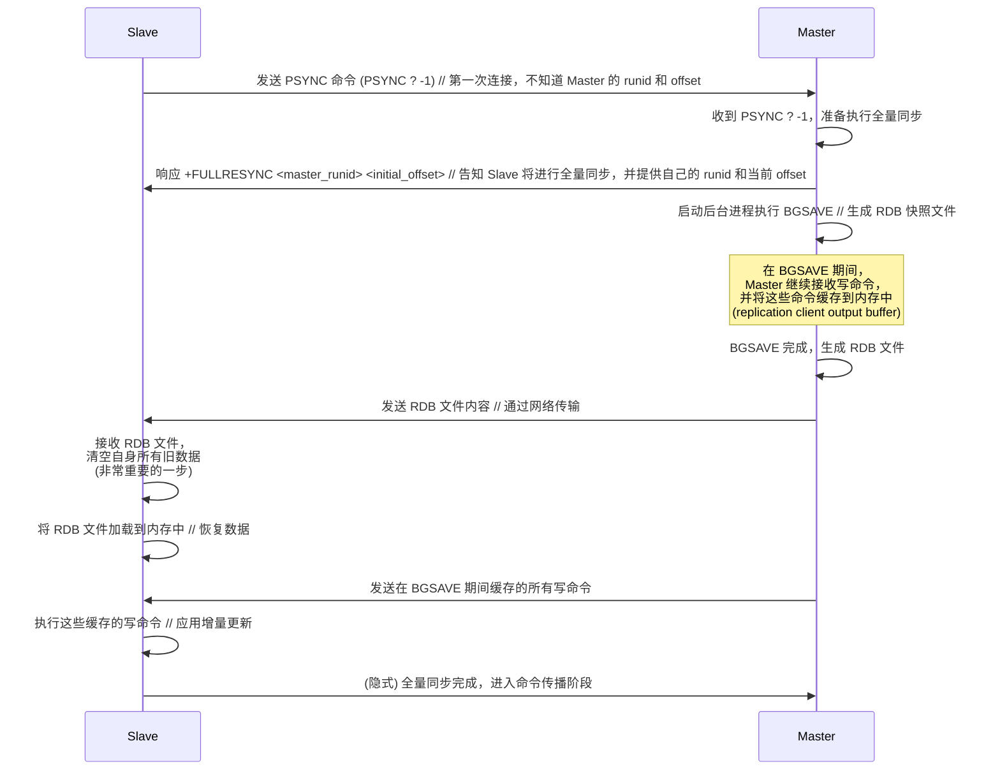
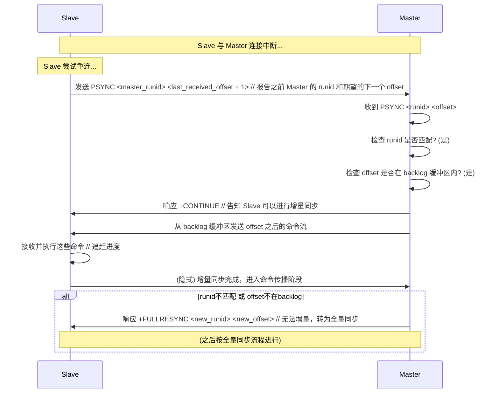
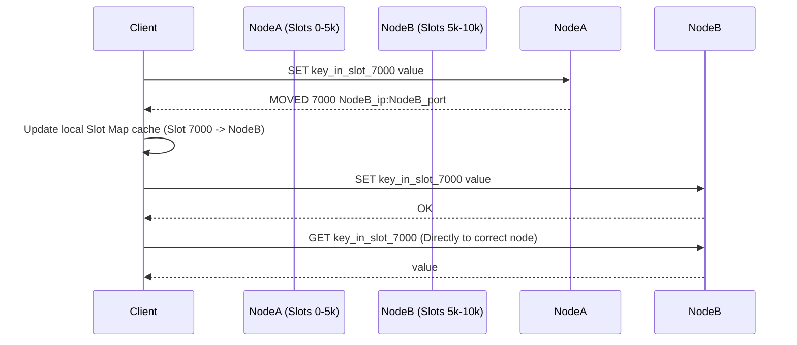

# Redis 持久化策略
## RDB（快照）
>定期将内存数据全量快照到磁盘。优点是文件小、恢复快；缺点是可能丢失上次快照后的数据。

 在指定的时间间隔（这个时间间隔一般比AOF长得多，因为复制整个数据库非常消耗性能）内，或者当满足一定的写操作条件时，Redis 会将**当前时刻内存中的所有数据**生成一个快照（snapshot），并将其保存到一个二进制的 dump 文件（默认是 `dump.rdb`）中。
### 触发方式
主要有两种：
1. **手动触发：** 执行 `SAVE` (阻塞) 或 `BGSAVE` (非阻塞) 命令。
2. **自动触发：** 根据 `redis.conf` 中 `save <seconds> <changes>` 配置的策略，在指定时间内发生指定数量的写操作时自动触发 `BGSAVE`。
其他：
- 主从复制时，从节点初次同步执行全量同步时主节点会执行`BGSAVE`命令生成RDB文件发送至从节点。
- 执行`FLUSHALL`清空数据库时会自动触发RDB（如果配置了）。
---
## AOF（Append Only File）
>记录所有**写命令**到文件。优点是数据更安全（丢失少）；缺点是文件可能较大、恢复相对较慢。

Redis 会将接收到的**每一条写命令**（如 SET, DEL, INCR 等，读命令不会记录）以追加（append）的方式写入到一个文件（默认是 `appendonly.aof`）的末尾。当 Redis 重启时，它会重新执行 AOF 文件中保存的所有写命令，从而恢复数据。
### 工作流程
1. 客户端发送写命令（如 `SET key value`）。
2. Redis 服务器执行命令，并将数据写入内存。
3. Redis 将这条写命令追加到 AOF 缓冲区（in-memory buffer）。
4. 根据配置的同步策略 (`appendfsync` 配置项)，将 AOF 缓冲区的内容写入（`write()`) 到 AOF 文件并同步 (`fsync()`) 到磁盘。
### appendfsync策略
- `always`: **每执行一条写命令**就立即同步到磁盘。最安全，几乎不丢数据，但性能开销最大，严重影响 Redis 吞吐量。
- `everysec` (默认): **每秒钟同步**一次。这是一个很好的折中，性能较好，即使宕机，最多只会丢失上一秒内的数据。
- `no`: 完全依赖操作系统来决定何时同步。速度最快，但数据安全性最低，宕机可能丢失较多数据。
### AOF重写机制（AOF Rewrite）
>为了解决aof文件不断追加命令而变得过大的问题，减小磁盘占用，以及加快恢复速度。

**实现：**
1. Redis `fork` 一个子进程，该子进程读取当前内存中的数据状态，生成能够恢复这些数据的最小化命令集，写入新的临时 AOF 文件。
2. 对于在生成新的AOF文件期间产生的写命令会存到**重写缓冲区**中，待新的AOF创建完成会追加到文件末尾。
3. 然后原子地替换旧AOF文件。
---
## 同时开启两种持久化策略时，默认使用哪个文件来恢复
>会**优先加载 AOF 文件**来恢复数据。因为 AOF 文件通常能提供更完整的数据（丢失更少）。只有在 AOF 关闭或 AOF 文件不存在/损坏时，才会尝试加载 RDB 文件
---
## 持久化对Redis性能的影响
- **RDB:** `BGSAVE` 主要影响在于 `fork()` 操作，它可能导致短暂的 CPU 飙升和内存占用增加（写时复制机制）。数据量越大，影响越明显。**磁盘 I/O** 由子进程负责，对**主进程影响较小**。
- **AOF:**
    - 写命令追加到 AOF 缓冲区是很快的。
    - 主要影响在于 `fsync` 同步操作。`always` 策略对 QPS 影响最大；`everysec` 影响较小；`no` 几乎无影响。
    - AOF 重写也涉及 `fork()` 和磁盘 I/O，影响类似于 `BGSAVE`。
---
## 混合持久化？(Redis4.0开始有的选项)
-  在 AOF 重写时，新的 AOF 文件不再是纯粹的命令序列。它会先将当前内存数据以 **RDB 格式**写入 AOF 文件的开头，然后将**写期间**产生的增量写命令以 **AOF 格式**追加在 RDB 内容的后面。当服务器重启时，就不用加载全量AOF数据。
- **优点：** 结合了 RDB 和 AOF 的优点。加载时，先加载 RDB 部分快速恢复大部分数据，然后加载 AOF 部分恢复增量数据。这样既能保证数据恢复速度快，又能获得 AOF 的高数据安全性。
![[Screenshot_20250413_084918_Obsidian.jpg|636x323]]
--- 
## 各有什么优缺点
**RDB**：
- **优点**：
	- 生成的文件是压缩过的**二进制格式，体积小**，非常适合用于备份。
	- 恢复数据时，直接加载 RDB 文件即可，速度比 AOF 快，适合灾难恢复（要在短时间内重启服务）。
	- 对 Redis 性能影响较小（子进程进行 IO 操作，主进程影响不大，主要是 `fork()` 时刻）。
- **缺点**：
	- **不是实时持久化（或者说实时性不强）**。如果两次快照之间 Redis 宕机，那么这期间修改的数据会全部丢失。丢失的数据量取决于快照的频率（例如，配置为每 5 分钟生成一次快照，那最多可能丢失近 5 分钟的数据）。
	- `fork()` 操作在数据量很大时会比较耗时，且会消耗额外的内存（虽然有写时复制 Copy-on-Write 优化，但在写操作频繁时仍可能消耗较多内存）。
**AOF**：
- **优点**：
	- 数据安全性更高。根据 `appendfsync` 策略，可以做到丢失很少（最多 1 秒）甚至不丢失数据。
	- AOF 文件是追加写入，即使文件写入不完整（如磁盘满了），也可以用 `redis-check-aof` 工具修复。
	- AOF 文件内容是协议文本，可读性较好（虽然不是设计给人直接读的）。
- **缺点**：
	- 对于相同的数据集，AOF 文件通常比 RDB 文件大很多。
	- 恢复数据时需要重新执行所有命令，速度通常比 RDB 慢。
---
## 二者如何选择
- 如果要求可以快速恢复的场景下，可以选择RDB策略，它的回复速度比AOF快得多。但是要能接受数据一致性问题，也就是几分钟之内的数据丢失。
- 如果要求高数据一致性、实时性的场景下，建议选择AOF策略，它的数据集完整性较高，通常只会丢失数秒的数据或者不丢失数据。但是恢复速度较慢。
---
# 主从复制

## 了解
Redis 主从复制是一种**数据同步机制**，允许一个 Redis 服务器（称为 **主节点 Master**）将其数据**单向**复制到一个或多个其他的 Redis 服务器（称为 **从节点 Slaves 或 Replicas**）。从节点会实时地（或接近实时地）维持与主节点数据的一致性。

---
## 应用场景
1. **单点故障 (Single Point of Failure, SPOF):** 单个 Redis 实例一旦宕机，整个服务就不可用，可能导致业务中断。（高可用）
2. **读压力过大:** 如果所有读写请求都集中在一个 Redis 实例上，当读请求量非常大时，单个实例可能无法承受，导致响应变慢。（高并发）
---
1. **高可用 (High Availability, HA):** 当主节点（Master）发生故障时，可以快速将一个从节点（Slave/Replica）提升为新的主节点，继续提供服务，大大缩短服务中断时间。这是构建 Redis Sentinel 和 Redis Cluster 的基础。
2. **读写分离 (Read/Write Splitting):** 主节点负责处理写请求和一部分读请求，而将大部分读请求分散到多个从节点上处理，从而提高整个系统的读并发能力和吞吐量。
---
## 原理
1. **建立连接:** 从节点主动向主节点发起连接请求。
2. **数据同步:**
    - 首次连接或需要全量同步时，主节点会生成一份当前数据的 **RDB 快照**发送给从节点，并将快照生成期间（和发送并接受的时间内）接收到的新写命令**缓存**起来。从节点清空自身数据后加载 RDB 文件，然后主节点再把缓存的命令发送给从节点执行。
    - 如果连接只是短暂中断后恢复，并且条件允许（主节点的复制积压缓冲区够大，中断期间的命令还在缓冲区中），则可能进行**增量同步**，主节点只发送中断期间丢失的写命令给从节点。
3. **命令传播:** 同步完成后，主节点每执行一个会修改数据的写命令，都会**异步地**将这个命令发送给所有连接的从节点，从节点接收并执行相同的命令，从而保持数据同步。
## 数据同步方式
### 全量同步
- 什么时候发生？
	- 一个从节点**第一次**连接到主节点时。
	- 从节点连接到主节点，但主节点的 `runid`（标识） 发生了变化（通常意味着主节点**重启**过）。
	- 从节点断线重连后，请求的**复制偏移量 (`offset`)** 在主节点的**复制积压缓冲区 (replication backlog buffer)** 中已经**不存在**了（说明从节点断线时间太长，或者缓冲区太小，丢失的命令太多了）
- 过程：

1. **Slave 发起同步请求：** 从节点向主节点发送 `PSYNC ? -1` 命令。问号表示不知道主节点的 `runid`，-1 表示请求从头开始的全量复制。
2. **Master 响应全量同步：** 主节点收到请求后，判断需要进行全量同步。它会回复一个 `+FULLRESYNC` 响应，后面跟着主节点当前的 `runid` 和当前的复制偏移量 `offset`。从节点会保存这个 `runid`。
3. **Master 生成 RDB 快照：** 主节点在后台执行 `BGSAVE` 命令，异步地生成一个当前内存数据的 RDB 快照文件。
4. **Master 缓存写命令：** 在 `BGSAVE` 执行期间，主节点仍然可以接收客户端的写命令。这些新的写命令**不会**包含在刚刚生成的 RDB 文件里，所以主节点会将这些命令**缓存**在内存中（专门为这个从节点准备的复制客户端输出缓冲区）。
5. **Master 发送 RDB 文件：** `BGSAVE` 完成后，主节点将生成的 RDB 文件内容通过网络发送给从节点。
6. **Slave 清空并加载 RDB：** 从节点接收到 RDB 文件后，会先**清空自己当前的所有数据**，然后将 RDB 文件加载到内存中。这个加载过程可能会比较耗时，取决于 RDB 文件的大小。
7. **Master 发送缓存的命令：** 当主节点发送完 RDB 文件后，它会接着将在步骤 4 中缓存的写命令，逐一发送给从节点。
8. **Slave 执行缓存的命令：** 从节点执行这些来自主节点的缓存写命令，将其数据状态更新到主节点 RDB 快照生成**之后**的状态。
9. **完成：** 至此，全量同步完成。从节点的数据状态与主节点在某个时间点（发送完缓存命令后）达到一致。之后进入持续的命令传播阶段。

- 痛点：
	全量同步开销很大，涉及磁盘 I/O（`BGSAVE`）、网络 I/O（传输 RDB 文件，可能很大）、CPU（生成 RDB、加载 RDB），并且从节点在加载 RDB 期间可能无法响应请求。应尽量避免频繁触发。
---
### 增量同步
- 什么时候触发？
	- 从节点因为网络等原因**短暂断开**与主节点的连接。
	- 从节点重新连接上主节点后，发现主节点的 `runid` **没有**变化（说明还是原来的那个主节点）。
	- 从节点向主节点报告自己断开连接前的复制偏移量 `offset`。
	- 主节点检查发现，这个 `offset` 之后的数据仍然**存在**于自己的**复制积压缓冲区 (replication backlog buffer)** 内。
- 实现流程

1. **Slave 发起增量同步请求：** 从节点重新连接后，向主节点发送 `PSYNC <master_runid> <next_offset>` 命令。这里 `<master_runid>` 是它断线前连接的那个主节点的 `runid`，`<next_offset>` 是它希望从哪个偏移量开始接收数据（即它已收到的最后一个 offset + 1）。
2. **Master 判断是否可增量：** 主节点收到命令后：
    - 检查命令中的 `<master_runid>` 是否与自己当前的 `runid` 一致。
    - 检查命令中的 `<next_offset>` 是否在自己的复制积压缓冲区（backlog）的有效范围内。
3. **响应 `+CONTINUE` (可增量)：** 如果上述两个条件都满足，主节点判断可以进行增量同步。它会回复一个 `+CONTINUE` 响应给从节点。
4. **Master 发送缺失命令：** 主节点直接从复制积压缓冲区中，读取从 `<next_offset>` 开始的所有写命令，并发送给从节点。
5. **Slave 执行命令：** 从节点接收这些命令并执行，更新自己的数据状态。
6. **完成：** 追赶上进度后，增量同步完成，进入持续的命令传播阶段。
7. **响应 `+FULLRESYNC` (不可增量，转全量)：** 如果 `runid` 不匹配（主节点重启了）或者 `offset` 太旧（数据已不在 backlog 中），主节点会认为无法进行增量同步，此时它会回复一个 `+FULLRESYNC` 响应（类似全量同步的第一步），接下来就会按照**全量同步**的流程进行。
#### 复制积压缓冲区(Replication Backlog Buffer)
这个缓冲区的大小 (`repl-backlog-size` 配置项，默认 1MB) 直接决定了能支持多长时间的断线重连可以进行增量同步（其实它的作用是为了缓冲写AOF文件的）。如果断线时间太长，产生的命令量超过了缓冲区大小，缓冲区就会覆盖旧数据（刷新），导致无法增量同步。
### 命令传播
>当全量同步或增量同步**成功完成之后**，主从节点进入正常的数据同步状态。
主节点把自己执行的**每一个写命令**，实时地、**异步地**发送给所有从节点。
---
## 主从复制的问题
- **故障转移需要手动**（高可用）：Redis 的主从复制机制本身**只负责数据的同步**，并**不具备自动检测主节点故障并进行故障转移的能力**。（可以依赖**外部系统**（如 Redis Sentinel 或 Redis Cluster）来实现自动故障监控和转移。）
- **数据一致性**：主从复制默认是异步的，在主节点执行完命令直接响应客户端，然后异步把命令发送给从节点，存在时间差。
	1. 数据丢失：主节点刚执行完一个写命令，还没来得及把这个命令发送给从节点，就突然宕机了。如果此时进行故障转移，将一个从节点提升为新的主节点，那么刚刚在旧主节点上写入的数据就**永久丢失**了。
	2. **读到旧数据**：在读写分离的架构中，客户端写入主节点后，如果**立即**去从节点读取，可能会读到**旧的**数据，因为写命令还没传播到从节点并执行完毕。
- **写操作瓶颈**：所有的**写操作**都必须经过主节点处理。如果写入量非常大，主节点的 CPU、内存或网络带宽可能成为整个系统的瓶颈。
- 全量复制同步（全量同步痛点）：
	- **主节点压力:** 执行 `BGSAVE` 会消耗主节点的 CPU 和内存（fork 操作），如果数据量大，可能导致主节点短暂卡顿。同时，传输 RDB 文件会消耗大量的网络带宽。
	- **从节点压力:** 从节点在接收 RDB 文件并加载到内存期间，通常会清空旧数据，且加载过程可能阻塞，导致从节点在这段时间内无法提供服务。
	- **复制风暴:** 如果一个主节点挂了很多从节点，当主节点重启恢复后，所有从节点可能同时发起全量同步请求，瞬间给主节点带来巨大的压力（CPU、内存、网络），可能导致主节点再次不稳定。
---
# Redis Sentinel(哨兵机制)
>解决故障转移需要手动的问题，最大限度减少服务不可用时间（停机时间）
## 了解多少
Redis Sentinel 是一个**分布式系统**，由一个或多个 Sentinel节点（进程）组成（提高Sentinel自身的高可用性，和利用投票选举机制防止误判）。它运行在 Redis 集群的**外部**（通常部署在独立的服务器上，或者与 Redis 节点同机但独立进程），负责**监控** Redis 主从集群的状态，并在主节点出现故障时**自动执行故障转移**操作，同时也能**通知**客户端(jedis等Java客户端框架)集群状态的变化，提高了Redis的高可用性。

---
## 应用场景
1. **实现 Redis 高可用 (High Availability, HA):** 当主节点失效时，能自动、快速地完成主从切换，保证 Redis 服务持续可用，**最大限度地减少停机时间**。
2. **服务发现 (Service Discovery):** 为客户端提供当前**主节点**的地址信息。客户端不再直连固定的 Master IP，而是连接 Sentinel 集群，由 Sentinel告知当前谁是 Master。
---
## 核心价值
Sentinel 的核心价值在于**自动化**。它将原来需要人工处理的故障发现、故障确认、节点选举、主从切换、配置更新等一系列复杂操作自动化，极大地提高了 Redis 服务的**数据一致性**和**可用性**。

---
## 原理
1. **监控（Monitoring）**：
	- 每个 Sentinel 实例会**定期**向它监控的所有 Master 和 Slave 节点发送 `PING` 命令，检查节点是否存活。**(心跳检测)**
	- Sentinel 还会向 Master 和 Slave 发送 `INFO` 命令，获取节点的详细信息，如角色（Master/Slave）、复制状态、连接的 Slave 列表等。
	- **Sentinel 节点**之间通过 Redis 的 **Pub/Sub (发布/订阅)** 机制，在特定的频道 (`__sentinel__:hello`) 上**互相广播自己的存在**以及**对 Master 状态的判断**。这使得 Sentinel 能够发现彼此，并了解其他 Sentinel 对 Master 的看法。
2. **故障检测 (Failure Detection):**
	1. **主观下线 (Subjective Down, SDOWN):**
		- 如果一个 Sentinel 实例在配置的 `down-after-milliseconds` 时间内，没有收到某个节点（Master 或 Slave）的有效 PING 回复，Sentinel就会**单方面**认为这个节点**主观下线**了。(tmd,不就是心跳检测超时嘛)
	2. **客观下线 (Objective Down, ODOWN):**
		- 当一个 Sentinel 认为 Master 主观下线后，它会向其他 Sentinel 实例发送 `SENTINEL is-master-down-by-addr` 命令，询问它们是否也认为该 Master 下线了。
		- 如果收到**足够数量**（达到预设的 `quorum` 配置值）的其他 Sentinel 实例也确认该 Master 主观下线，那么这个 Sentinel 就会将该 Master 标记为**客观下线**。
3. **Sentinel的领导者选举 (Leader Election among Sentinels):**
	- 一旦 Master 被判定为 ODOWN（客观下线），所有认为它 ODOWN 的 Sentinel 实例会开始**选举一个领导者 (Leader Sentinel)** 来负责执行具体的故障转移操作。
	- 选举过程基于 **Raft 算法**的一个变种。简单来说，每个 Sentinel 都可以成为候选者，通过投票争取成为 Leader。获得**超过半数** (N/2 + 1，N 是 Sentinel 总数) 选票的 Sentinel 成为 Leader。如果一轮没选出来，会增加选举轮次 (term) 并重新选举。
4. **故障转移 (Failover Execution):**
	- **选出新 Master:** Leader Sentinel 从 ODOWN Master 的所有 Slave 中，按照一定规则（优先级 `replica-priority` 最高 -> 复制偏移量 `offset` 最大（复制主节点内容最多） -> 运行 ID `runid` 最小）挑选一个最合适的 Slave 作为新的 Master。
	- **提升 Slave:** Leader Sentinel 向选中的 Slave 发送 `SLAVEOF NO ONE` (或 `REPLICAOF NO ONE`) 命令，使其断开与旧 Master 的复制关系，转变角色成为新的 Master。
	- **重新指向 (Reconfigure Slaves):** Leader Sentinel 向其他剩余的 Slave 发送 `REPLICAOF new_master_ip new_master_port` 命令，让它们开始从新的 Master 复制数据。
	- **降级旧 Master:** Leader Sentinel 会继续监视那个已经 ODOWN 的旧 Master。如果它后来恢复了，Sentinel 会向它发送 `REPLICAOF` 命令，让它变成新 Master 的 Slave，防止“双主”情况（脑裂）。
5. **通知 (Notification):**
    - Sentinel 会将故障转移的结果（新的 Master 地址）通过发布/订阅机制通知给客户端（如果客户端订阅了相关事件）。Sentinel 感知型的客户端库（如 Jedis、Lettuce 的 Sentinel 模式）能够接收这些通知并自动切换到新的 Master 地址。
---
## Redis Sentinel 领导者选举 (Leader Election)
>在 Redis Sentinel 集群中，当主节点被判定为客观下线（ODOWN）时，需要立即执行故障转移操作（如选择新 Master、重新配置 Slaves）。如果多个 Sentinel 实例同时尝试执行这些操作，可能导致“脑裂”（Split-Brain）问题，即同时有多个 Sentinel 以为自己是领导者，导致数据不一致或操作冲突。

 Sentinel 领导者选举是在一个 Master 节点被判定为 ODOWN 后，由所有监控该 Master 的 Sentinel 实例共同参与的一个**分布式选举过程**。其目标是从这些 Sentinel 中选出一个**唯一的 Leader**，该 Leader 将获得执行后续故障转移操作的**独占权限**。
[[面渣逆袭 Redis 篇.pdf#page=26&selection=216,0,222,13|面渣逆袭 Redis 篇, 页面 26]]
**选举过程**：
- **候选者声明：** 任何检测到 ODOWN 的 Sentinel 可以成为候选者（Candidate）。它会向其他 **Sentinel** 发送投票请求。
- **投票机制：** 每个 Sentinel 只能投票给**第一个**请求投票的候选者（类似“一票制”），并且只能投给自己所在的任期（Epoch轮次）。投票是单向的：一旦投出，就不能收回。
- **多数票决定：** 如果一个候选者获得**超过半数**（N/2 + 1，其中 N 是 Sentinel 总数）的选票，它就成为新的 Leader。如果没有候选者获得多数票，选举失败，所有 Sentinel 会等待一个随机时间后重试。
- **任期（Epoch）管理：** 每个选举轮次都有一个递增的 Epoch 号，确保新选举的任期高于旧的。如果一个 Sentinel 发现自己不是 Leader，它会接受新 Leader 的命令。
---
## Q 
1. **Sentinel 为什么要进行 Leader 选举？**
    
    - **回答:** 为了保证在 Master 故障时，只有一个 Sentinel 实例负责执行故障转移操作，避免多个 Sentinel 同时操作导致冲突、状态混乱和 Failover 失败。确保了故障转移的唯一性、一致性和有序性。
2. **Sentinel Leader 选举的过程是怎样的？**
    
    - **回答:** 基于 Raft 思想的投票机制。Sentinel 发现 Master ODOWN 后，增加自身 `epoch`，成为候选者，向其他 Sentinel 发送带 `epoch` 的拉票请求。其他 Sentinel 基于 `epoch` 检查和“同一 epoch 先到先得”的原则投票。获得超过半数选票的候选者成为 Leader。
3. **Epoch (纪元) 在选举中起什么作用？**
    
    - **回答:** Epoch 用于区分不同的选举轮次或故障转移尝试。它能防止过时的选举请求或投票干扰当前的选举过程。Sentinel 只会处理不低于其当前 `epoch` 的请求，并在同一 `epoch` 内只投一次票，保证了选举的时效性和一致性。
4. **如果一轮选举没有选出 Leader 怎么办？**
    
    - **回答:** 会发生选举超时。未能当选的候选者或未投票的 Sentinel 会等待一个随机的时间，然后增加自己的 `epoch`，发起新一轮的选举。随机延迟有助于错开请求，提高下一轮成功的概率。
5. **Leader 选举如何防止“脑裂”？**
    
    - **回答:** 选举本身要求获得**超过半数**的 Sentinel 投票才能成为 Leader。在发生网络分区时，只有包含**多数派 Sentinel** 的那个分区才有可能选出 Leader 并执行故障转移。少数派分区即使认为 Master ODOWN，也无法获得足够的选票来选举出 Leader，因此不会错误地执行 Failover，从而避免了因 Sentinel 集群分裂而导致的脑裂问题（在 Failover 决策层面）
---
# Redis集群（Redis Cluster）
1. **数据量过大：** 单个 Redis 实例的内存无法容纳全部业务数据。(数据热点集中，资源利用不均匀)
2. **写并发过高：** 单个 Master 节点的写 QPS (Queries Per Second) 达到瓶颈，无法满足业务需求。（因为写操作在主从架构中只能通过主节点来实现单机器写性能瓶颈）
---
## 了解
 Redis Cluster 是 Redis 官方提供的**分布式、去中心化、高可用**的解决方案。它将数据自动**分片 (Sharding)** 到多个 Redis 节点上，每个节点负责一部分数据和集群状态的维护。客户端可以直接连接到集群中的**任意**节点，并被**自动重定向**到正确的节点进行操作。
 
---
## 原理
1. **数据分片 - 哈希槽 (Hash Slots):**
    - Redis Cluster 预设了 **16384 (0 - 16383)** 个哈希槽。
    - 集群中的**每个 Master 节点**负责处理**一部分**哈希槽。例如，3 个 Master 的集群，可能 Node A 负责 0-5460，Node B 负责 5461-10922，Node C 负责 10923-16383。
    - 当需要对一个 Key 进行操作时（如 SET key value），集群会使用 `CRC16(key) % 16384` 算法计算出这个 Key 属于哪个槽。
    - 然后根据集群维护的**槽位映射关系 (Slot Map)**，确定负责这个槽的 Master 节点是哪一个，并将操作请求发送到该节点。
    
2. **节点 (Node):** 集群中的每个 Redis 实例都称为一个节点。节点可以是 Master 或 Replica (Slave)。所有节点都参与维护集群状态。
    
3. **去中心化架构 (Decentralized):**
    - 集群中的所有Redis节点通过**Gossip 协议**互相通信，交换状态信息（如节点存活状态、槽位分配信息、节点角色等）。
    - **没有中心协调节点**（像 ZooKeeper 或 Sentinel 集群那样）。每个节点都保存了**完整**的集群状态信息（主要是槽位到节点的映射）。
    
4. **Gossip 协议:**
    - 用于节点间的**状态同步**和**故障检测**。
    - 每个节点会定期随机选择一些其他节点发送 `PING` 消息，对方回复 `PONG`。消息中携带了该节点自身的状态以及它所知道的部分其他节点的状态。
    - 通过这种方式，节点状态信息（如节点下线、新的槽位分配）会逐渐传播到整个集群。
    - **故障检测:** 如果一个节点在一定时间内无法与大多数其他节点通信，或者大多数节点都认为某个节点 PING 不通，该节点会被标记为**疑似下线 (PFAIL - Possible Fail)** 或**确认下线 (FAIL)**。
    
5. **高可用与故障转移 (Built-in HA):**
    - 每个 Master 节点可以有一个或多个 Replica 节点。
    - 当一个 Master 节点被集群中的**大多数** Master 节点标记为 FAIL 状态后，会触发**自动故障转移**。
    - 该 Master 的所有 Replica 会进行**选举**（类似于 Sentinel 的 Leader 选举，但由集群内部节点完成，基于 Raft 思想），选出一个 Replica 来接替 Master 的角色。
    - 选举出的新 Master 会接管原来 Master 负责的槽位，并开始接受写请求。
    - 整个过程由集群内部节点自动完成，不需要外部 Sentinel。
	
6. **客户端路由 (Client Routing):**
    - 客户端**需要是 Cluster-aware** 的（如 Jedis Cluster, Lettuce 的 Cluster 模式）。
    - 客户端可以连接到集群中的**任意**一个节点发起请求。
    - 如果请求的 Key 所在的槽正好由当前连接的节点负责，则直接处理。
    - 如果 Key 所在的槽不由当前节点负责，该节点会回复一个 **`MOVED` 重定向错误**，告诉客户端这个槽现在由哪个节点 (`ip:port`) 负责。
    - **智能客户端**会缓存这份槽位映射关系 (Slot Map)，后续请求会直接发送到正确的节点。当收到 `MOVED` 时，客户端会更新本地缓存的 Slot Map。
    - 还有一种 `ASK` 重定向，用于在槽位迁移过程中临时将请求导向目标节点。

---
## Q
1. **Redis Cluster 解决了什么问题？相比 Sentinel 有什么优势？**
    
    - **回答:** Cluster 主要解决了**数据分片 (Sharding)** 的问题，突破了单机内存和写性能瓶颈，实现了**水平扩展**。相比 Sentinel（只解决单 Master 集群的 HA），Cluster **内置了高可用**机制，无需额外部署 Sentinel，并且能够管理**分布式**的数据集。
2. **Redis Cluster 是如何进行数据分片的？**
    
    - **回答:** 通过**哈希槽 (Hash Slots)**。预设 16384 个槽，每个 Key 通过 `CRC16(key) % 16384` 计算得到所属的槽。集群中的每个 Master 节点负责一部分槽。客户端根据 Key 计算出槽，再根据集群的槽位映射关系找到负责该槽的 Master 节点进行操作。
3. **Redis Cluster 如何实现高可用和故障转移？**
    
    - **回答:** 每个 Master 可以有多个 Replica(从节点)。节点间通过 **Gossip 协议**监控彼此状态。当一个 Master 被多数 Master 判定为 FAIL 时，其 Replicas 会进行选举（基于 Raft 思想），选出新的 Master 接管槽位。这个过程是集群**内部自动完成**的。
4. **什么是 Gossip 协议？在 Redis Cluster 中起什么作用？**
    
    - **回答:** 一种去中心化的信息传播协议。在 Cluster 中用于：
        - **节点发现:** 新节点加入时通知其他节点。
        - **状态同步:** 传播节点存活状态、角色、负责的槽位等信息。
        - **故障检测:** 通过 PING/PONG 消息判断节点是否存活，为故障转移提供依据。
5. **客户端如何与 Redis Cluster 交互？`MOVED` 和 `ASK` 重定向是什么？**
    
    - **回答:** 客户端需要是 Cluster-aware 的。连接任意节点，如果操作的 Key 不在该节点，会收到 `MOVED` 或 `ASK` 重定向。
        - **`MOVED`:** 表示 Key 所属的槽**永久地**由另一个节点负责，客户端应更新本地槽位缓存，并**重试**到新节点。
        - **`ASK`:** 表示 Key 所属的槽正在**迁移中**，本次请求应**临时**发送到目标节点执行（使用 `ASKING` 命令先声明），但**不更新**本地槽位缓存。
6. **Redis Cluster 对批量操作 (如 MSET/MGET) 有什么限制？**
    
    - **回答:** 原生的 `MSET`/`MGET` 等命令要求所有涉及的 Key 必须在**同一个槽**内。如果 Key 分布在不同槽（通常情况），直接执行会失败。Cluster-aware 的客户端库通常会**拆分**批量操作，按 Slot 分组后分别发送到对应的节点，最后**聚合**结果返回给用户，对用户透明，但性能开销比单实例高。也可以使用 Hash Tags (`{...}`) 将相关的 Key 强制分配到同一个槽。