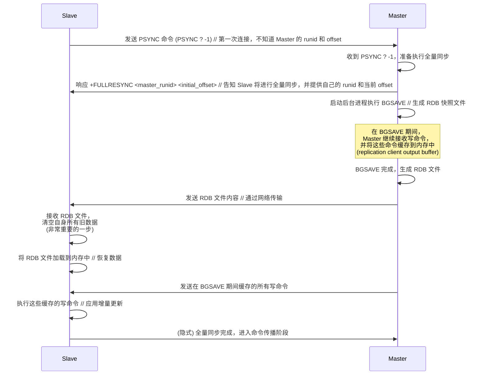
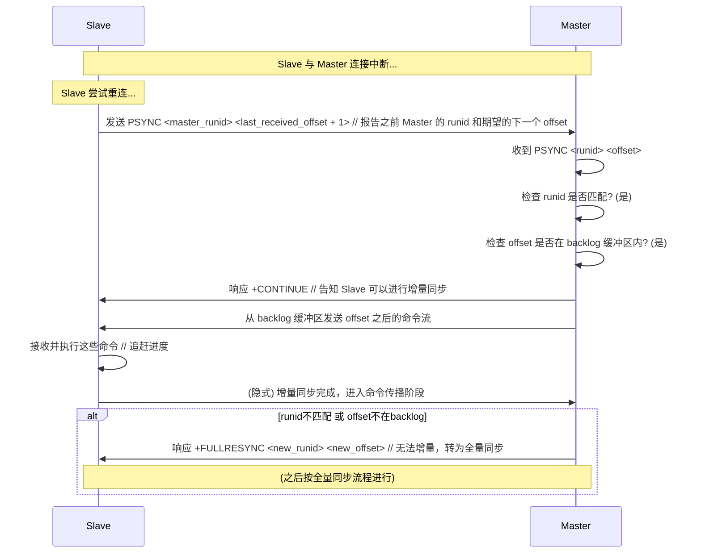
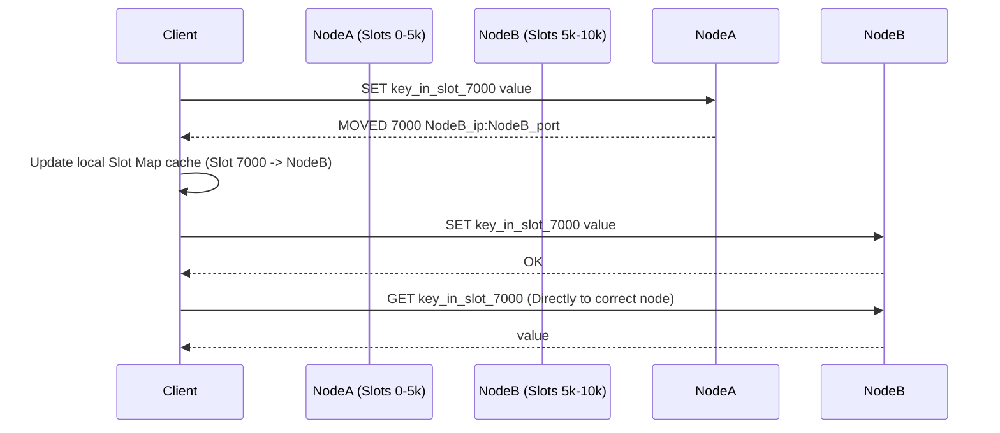
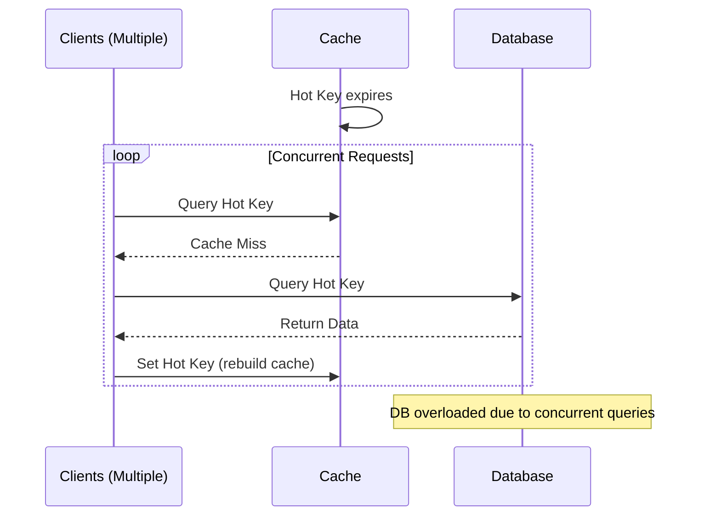
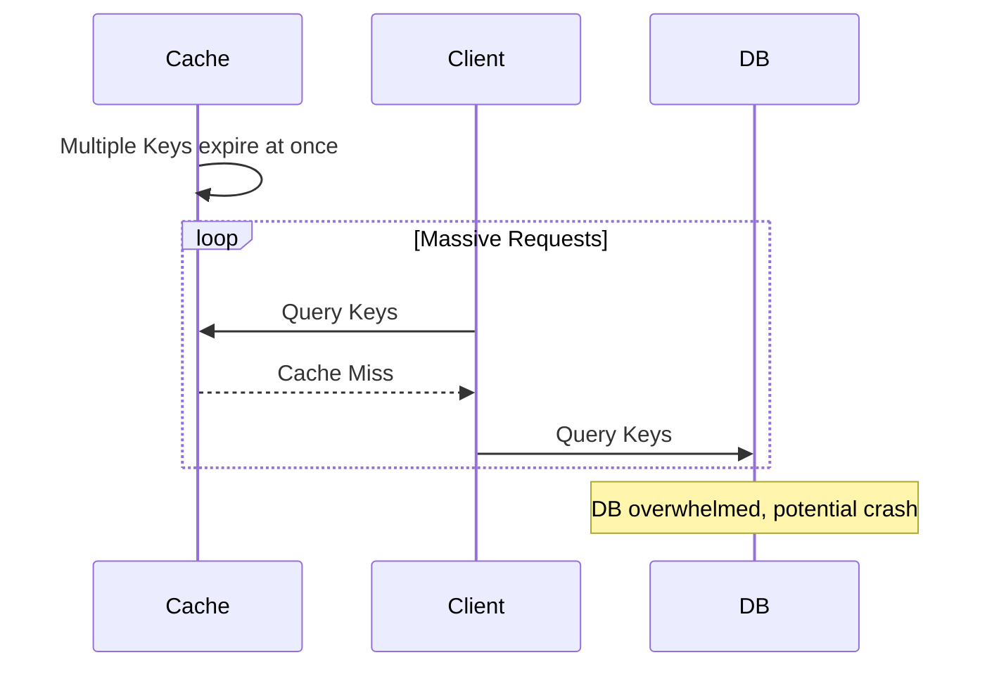
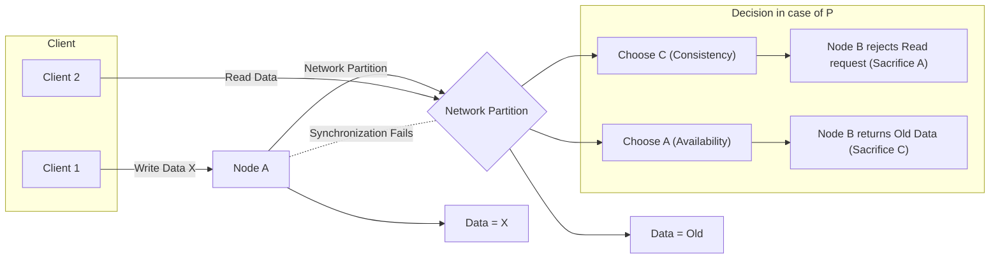
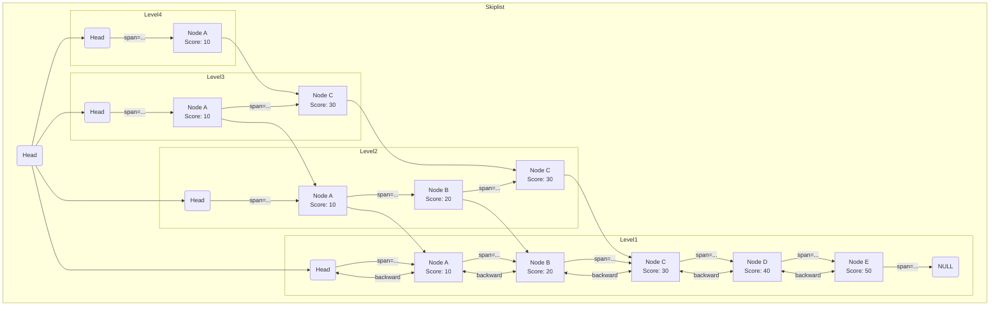

# Redis 持久化策略
## RDB（快照）
>定期将内存数据全量快照到磁盘。优点是文件小、恢复快；缺点是可能丢失上次快照后的数据。

 在指定的时间间隔（这个时间间隔一般比AOF长得多，因为复制整个数据库非常消耗性能）内，或者当满足一定的写操作条件时，Redis 会将**当前时刻内存中的所有数据**生成一个快照（snapshot），并将其保存到一个二进制的 dump 文件（默认是 `dump.rdb`）中。
### 触发方式
主要有两种：
1. **手动触发：** 执行 `SAVE` (阻塞) 或 `BGSAVE` (非阻塞) 命令。
2. **自动触发：** 根据 `redis.conf` 中 `save <seconds> <changes>` 配置的策略，在指定时间内发生指定数量的写操作时自动触发 `BGSAVE`。
其他：
- 主从复制时，从节点初次同步执行全量同步时主节点会执行`BGSAVE`命令生成RDB文件发送至从节点。
- 执行`FLUSHALL`清空数据库时会自动触发RDB（如果配置了）。
---
## AOF（Append Only File）
>记录所有**写命令**到文件。优点是数据更安全（丢失少）；缺点是文件可能较大、恢复相对较慢。

Redis 会将接收到的**每一条写命令**（如 SET, DEL, INCR 等，读命令不会记录）以追加（append）的方式写入到一个文件（默认是 `appendonly.aof`）的末尾。当 Redis 重启时，它会重新执行 AOF 文件中保存的所有写命令，从而恢复数据。
### 工作流程
1. 客户端发送写命令（如 `SET key value`）。
2. Redis 服务器执行命令，并将数据写入内存。
3. Redis 将这条写命令追加到 AOF 缓冲区（in-memory buffer）。
4. 根据配置的同步策略 (`appendfsync` 配置项)，将 AOF 缓冲区的内容写入（`write()`) 到 AOF 文件并同步 (`fsync()`) 到磁盘。
### appendfsync策略
- `always`: **每执行一条写命令**就立即同步到磁盘。最安全，几乎不丢数据，但性能开销最大，严重影响 Redis 吞吐量。
- `everysec` (默认): **每秒钟同步**一次。这是一个很好的折中，性能较好，即使宕机，最多只会丢失上一秒内的数据。
- `no`: 完全依赖操作系统来决定何时同步。速度最快，但数据安全性最低，宕机可能丢失较多数据。
### AOF重写机制（AOF Rewrite）
>为了解决aof文件不断追加命令而变得过大的问题，减小磁盘占用，以及加快恢复速度。

**实现：**
1. Redis `fork` 一个子进程，该子进程读取当前内存中的数据状态，生成能够恢复这些数据的最小化命令集，写入新的临时 AOF 文件。
2. 对于在生成新的AOF文件期间产生的写命令会存到**重写缓冲区**中，待新的AOF创建完成会追加到文件末尾。
3. 然后原子地替换旧AOF文件。
---
## 同时开启两种持久化策略时，默认使用哪个文件来恢复
>会**优先加载 AOF 文件**来恢复数据。因为 AOF 文件通常能提供更完整的数据（丢失更少）。只有在 AOF 关闭或 AOF 文件不存在/损坏时，才会尝试加载 RDB 文件
---
## 持久化对Redis性能的影响
- **RDB:** `BGSAVE` 主要影响在于 `fork()` 操作，它可能导致短暂的 CPU 飙升和内存占用增加（写时复制机制）。数据量越大，影响越明显。**磁盘 I/O** 由子进程负责，对**主进程影响较小**。
- **AOF:**
    - 写命令追加到 AOF 缓冲区是很快的。
    - 主要影响在于 `fsync` 同步操作。`always` 策略对 QPS 影响最大；`everysec` 影响较小；`no` 几乎无影响。
    - AOF 重写也涉及 `fork()` 和磁盘 I/O，影响类似于 `BGSAVE`。
---
## 混合持久化？(Redis4.0开始有的选项)
-  在 AOF 重写时，新的 AOF 文件不再是纯粹的命令序列。它会先将当前内存数据以 **RDB 格式**写入 AOF 文件的开头，然后将**写期间**产生的增量写命令以 **AOF 格式**追加在 RDB 内容的后面。当服务器重启时，就不用加载全量AOF数据。
- **优点：** 结合了 RDB 和 AOF 的优点。加载时，先加载 RDB 部分快速恢复大部分数据，然后加载 AOF 部分恢复增量数据。这样既能保证数据恢复速度快，又能获得 AOF 的高数据安全性。
![[Screenshot_20250413_084918_Obsidian.jpg|636x323]]
--- 
## 各有什么优缺点
**RDB**：
- **优点**：
	- 生成的文件是压缩过的**二进制格式，体积小**，非常适合用于备份。
	- 恢复数据时，直接加载 RDB 文件即可，速度比 AOF 快，适合灾难恢复（要在短时间内重启服务）。
	- 对 Redis 性能影响较小（子进程进行 IO 操作，主进程影响不大，主要是 `fork()` 时刻）。
- **缺点**：
	- **不是实时持久化（或者说实时性不强）**。如果两次快照之间 Redis 宕机，那么这期间修改的数据会全部丢失。丢失的数据量取决于快照的频率（例如，配置为每 5 分钟生成一次快照，那最多可能丢失近 5 分钟的数据）。
	- `fork()` 操作在数据量很大时会比较耗时，且会消耗额外的内存（虽然有写时复制 Copy-on-Write 优化，但在写操作频繁时仍可能消耗较多内存）。
**AOF**：
- **优点**：
	- 数据安全性更高。根据 `appendfsync` 策略，可以做到丢失很少（最多 1 秒）甚至不丢失数据。
	- AOF 文件是追加写入，即使文件写入不完整（如磁盘满了），也可以用 `redis-check-aof` 工具修复。
	- AOF 文件内容是协议文本，可读性较好（虽然不是设计给人直接读的）。
- **缺点**：
	- 对于相同的数据集，AOF 文件通常比 RDB 文件大很多。
	- 恢复数据时需要重新执行所有命令，速度通常比 RDB 慢。
---
## 二者如何选择
- 如果要求可以快速恢复的场景下，可以选择RDB策略，它的回复速度比AOF快得多。但是要能接受数据一致性问题，也就是几分钟之内的数据丢失。
- 如果要求高数据一致性、实时性的场景下，建议选择AOF策略，它的数据集完整性较高，通常只会丢失数秒的数据或者不丢失数据。但是恢复速度较慢。
---
# 主从复制

## 了解
Redis 主从复制是一种**数据同步机制**，允许一个 Redis 服务器（称为 **主节点 Master**）将其数据**单向**复制到一个或多个其他的 Redis 服务器（称为 **从节点 Slaves 或 Replicas**）。从节点会实时地（或接近实时地）维持与主节点数据的一致性。

---
## 应用场景
1. **单点故障 (Single Point of Failure, SPOF):** 单个 Redis 实例一旦宕机，整个服务就不可用，可能导致业务中断。（高可用）
2. **读压力过大:** 如果所有读写请求都集中在一个 Redis 实例上，当读请求量非常大时，单个实例可能无法承受，导致响应变慢。（高并发）
---
1. **高可用 (High Availability, HA):** 当主节点（Master）发生故障时，可以快速将一个从节点（Slave/Replica）提升为新的主节点，继续提供服务，大大缩短服务中断时间。这是构建 Redis Sentinel 和 Redis Cluster 的基础。
2. **读写分离 (Read/Write Splitting):** 主节点负责处理写请求和一部分读请求，而将大部分读请求分散到多个从节点上处理，从而提高整个系统的读并发能力和吞吐量。
---
## 原理
1. **建立连接:** 从节点主动向主节点发起连接请求。
2. **数据同步:**
    - 首次连接或需要全量同步时，主节点会生成一份当前数据的 **RDB 快照**发送给从节点，并将快照生成期间（和发送并接受的时间内）接收到的新写命令**缓存**起来。从节点清空自身数据后加载 RDB 文件，然后主节点再把缓存的命令发送给从节点执行。
    - 如果连接只是短暂中断后恢复，并且条件允许（主节点的复制积压缓冲区够大，中断期间的命令还在缓冲区中），则可能进行**增量同步**，主节点只发送中断期间丢失的写命令给从节点。
3. **命令传播:** 同步完成后，主节点每执行一个会修改数据的写命令，都会**异步地**将这个命令发送给所有连接的从节点，从节点接收并执行相同的命令，从而保持数据同步。
## 数据同步方式
### 全量同步
- 什么时候发生？
	- 一个从节点**第一次**连接到主节点时。
	- 从节点连接到主节点，但主节点的 `runid`（标识） 发生了变化（通常意味着主节点**重启**过）。
	- 从节点断线重连后，请求的**复制偏移量 (`offset`)** 在主节点的**复制积压缓冲区 (replication backlog buffer)** 中已经**不存在**了（说明从节点断线时间太长，或者缓冲区太小，丢失的命令太多了）
- 过程：

1. **Slave 发起同步请求：** 从节点向主节点发送 `PSYNC ? -1` 命令。问号表示不知道主节点的 `runid`，-1 表示请求从头开始的全量复制。
2. **Master 响应全量同步：** 主节点收到请求后，判断需要进行全量同步。它会回复一个 `+FULLRESYNC` 响应，后面跟着主节点当前的 `runid` 和当前的复制偏移量 `offset`。从节点会保存这个 `runid`。
3. **Master 生成 RDB 快照：** 主节点在后台执行 `BGSAVE` 命令，异步地生成一个当前内存数据的 RDB 快照文件。
4. **Master 缓存写命令：** 在 `BGSAVE` 执行期间，主节点仍然可以接收客户端的写命令。这些新的写命令**不会**包含在刚刚生成的 RDB 文件里，所以主节点会将这些命令**缓存**在内存中（专门为这个从节点准备的复制客户端输出缓冲区）。
5. **Master 发送 RDB 文件：** `BGSAVE` 完成后，主节点将生成的 RDB 文件内容通过网络发送给从节点。
6. **Slave 清空并加载 RDB：** 从节点接收到 RDB 文件后，会先**清空自己当前的所有数据**，然后将 RDB 文件加载到内存中。这个加载过程可能会比较耗时，取决于 RDB 文件的大小。
7. **Master 发送缓存的命令：** 当主节点发送完 RDB 文件后，它会接着将在步骤 4 中缓存的写命令，逐一发送给从节点。
8. **Slave 执行缓存的命令：** 从节点执行这些来自主节点的缓存写命令，将其数据状态更新到主节点 RDB 快照生成**之后**的状态。
9. **完成：** 至此，全量同步完成。从节点的数据状态与主节点在某个时间点（发送完缓存命令后）达到一致。之后进入持续的命令传播阶段。

- 痛点：
	全量同步开销很大，涉及磁盘 I/O（`BGSAVE`）、网络 I/O（传输 RDB 文件，可能很大）、CPU（生成 RDB、加载 RDB），并且从节点在加载 RDB 期间可能无法响应请求。应尽量避免频繁触发。
---
### 增量同步
- 什么时候触发？
	- 从节点因为网络等原因**短暂断开**与主节点的连接。
	- 从节点重新连接上主节点后，发现主节点的 `runid` **没有**变化（说明还是原来的那个主节点）。
	- 从节点向主节点报告自己断开连接前的复制偏移量 `offset`。
	- 主节点检查发现，这个 `offset` 之后的数据仍然**存在**于自己的**复制积压缓冲区 (replication backlog buffer)** 内。
- 实现流程

1. **Slave 发起增量同步请求：** 从节点重新连接后，向主节点发送 `PSYNC <master_runid> <next_offset>` 命令。这里 `<master_runid>` 是它断线前连接的那个主节点的 `runid`，`<next_offset>` 是它希望从哪个偏移量开始接收数据（即它已收到的最后一个 offset + 1）。
2. **Master 判断是否可增量：** 主节点收到命令后：
    - 检查命令中的 `<master_runid>` 是否与自己当前的 `runid` 一致。
    - 检查命令中的 `<next_offset>` 是否在自己的复制积压缓冲区（backlog）的有效范围内。
3. **响应 `+CONTINUE` (可增量)：** 如果上述两个条件都满足，主节点判断可以进行增量同步。它会回复一个 `+CONTINUE` 响应给从节点。
4. **Master 发送缺失命令：** 主节点直接从复制积压缓冲区中，读取从 `<next_offset>` 开始的所有写命令，并发送给从节点。
5. **Slave 执行命令：** 从节点接收这些命令并执行，更新自己的数据状态。
6. **完成：** 追赶上进度后，增量同步完成，进入持续的命令传播阶段。
7. **响应 `+FULLRESYNC` (不可增量，转全量)：** 如果 `runid` 不匹配（主节点重启了）或者 `offset` 太旧（数据已不在 backlog 中），主节点会认为无法进行增量同步，此时它会回复一个 `+FULLRESYNC` 响应（类似全量同步的第一步），接下来就会按照**全量同步**的流程进行。
#### 复制积压缓冲区(Replication Backlog Buffer)
这个缓冲区的大小 (`repl-backlog-size` 配置项，默认 1MB) 直接决定了能支持多长时间的断线重连可以进行增量同步（其实它的作用是为了缓冲写AOF文件的）。如果断线时间太长，产生的命令量超过了缓冲区大小，缓冲区就会覆盖旧数据（刷新），导致无法增量同步。
### 命令传播
>当全量同步或增量同步**成功完成之后**，主从节点进入正常的数据同步状态。
主节点把自己执行的**每一个写命令**，实时地、**异步地**发送给所有从节点。
---
## 主从复制的问题
- **故障转移需要手动**（高可用）：Redis 的主从复制机制本身**只负责数据的同步**，并**不具备自动检测主节点故障并进行故障转移的能力**。（可以依赖**外部系统**（如 Redis Sentinel 或 Redis Cluster）来实现自动故障监控和转移。）
- **数据一致性**：主从复制默认是异步的，在主节点执行完命令直接响应客户端，然后异步把命令发送给从节点，存在时间差。
	1. 数据丢失：主节点刚执行完一个写命令，还没来得及把这个命令发送给从节点，就突然宕机了。如果此时进行故障转移，将一个从节点提升为新的主节点，那么刚刚在旧主节点上写入的数据就**永久丢失**了。
	2. **读到旧数据**：在读写分离的架构中，客户端写入主节点后，如果**立即**去从节点读取，可能会读到**旧的**数据，因为写命令还没传播到从节点并执行完毕。
- **写操作瓶颈**：所有的**写操作**都必须经过主节点处理。如果写入量非常大，主节点的 CPU、内存或网络带宽可能成为整个系统的瓶颈。
- 全量复制同步（全量同步痛点）：
	- **主节点压力:** 执行 `BGSAVE` 会消耗主节点的 CPU 和内存（fork 操作），如果数据量大，可能导致主节点短暂卡顿。同时，传输 RDB 文件会消耗大量的网络带宽。
	- **从节点压力:** 从节点在接收 RDB 文件并加载到内存期间，通常会清空旧数据，且加载过程可能阻塞，导致从节点在这段时间内无法提供服务。
	- **复制风暴:** 如果一个主节点挂了很多从节点，当主节点重启恢复后，所有从节点可能同时发起全量同步请求，瞬间给主节点带来巨大的压力（CPU、内存、网络），可能导致主节点再次不稳定。
---
# Redis Sentinel(哨兵机制)
>解决故障转移需要手动的问题，最大限度减少服务不可用时间（停机时间）
## 了解多少
Redis Sentinel 是一个**分布式系统**，由一个或多个 Sentinel节点（进程）组成（提高Sentinel自身的高可用性，和利用投票选举机制防止误判）。它运行在 Redis 集群的**外部**（通常部署在独立的服务器上，或者与 Redis 节点同机但独立进程），负责**监控** Redis 主从集群的状态，并在主节点出现故障时**自动执行故障转移**操作，同时也能**通知**客户端(jedis等Java客户端框架)集群状态的变化，提高了Redis的高可用性。

---
## 应用场景
1. **实现 Redis 高可用 (High Availability, HA):** 当主节点失效时，能自动、快速地完成主从切换，保证 Redis 服务持续可用，**最大限度地减少停机时间**。
2. **服务发现 (Service Discovery):** 为客户端提供当前**主节点**的地址信息。客户端不再直连固定的 Master IP，而是连接 Sentinel 集群，由 Sentinel告知当前谁是 Master。
---
## 核心价值
Sentinel 的核心价值在于**自动化**。它将原来需要人工处理的故障发现、故障确认、节点选举、主从切换、配置更新等一系列复杂操作自动化，极大地提高了 Redis 服务的**数据一致性**和**可用性**。

---
## 原理
1. **监控（Monitoring）**：
	- 每个 Sentinel 实例会**定期**向它监控的所有 Master 和 Slave 节点发送 `PING` 命令，检查节点是否存活。**(心跳检测)**
	- Sentinel 还会向 Master 和 Slave 发送 `INFO` 命令，获取节点的详细信息，如角色（Master/Slave）、复制状态、连接的 Slave 列表等。
	- **Sentinel 节点**之间通过 Redis 的 **Pub/Sub (发布/订阅)** 机制，在特定的频道 (`__sentinel__:hello`) 上**互相广播自己的存在**以及**对 Master 状态的判断**。这使得 Sentinel 能够发现彼此，并了解其他 Sentinel 对 Master 的看法。
2. **故障检测 (Failure Detection):**
	1. **主观下线 (Subjective Down, SDOWN):**
		- 如果一个 Sentinel 实例在配置的 `down-after-milliseconds` 时间内，没有收到某个节点（Master 或 Slave）的有效 PING 回复，Sentinel就会**单方面**认为这个节点**主观下线**了。(tmd,不就是心跳检测超时嘛)
	2. **客观下线 (Objective Down, ODOWN):**
		- 当一个 Sentinel 认为 Master 主观下线后，它会向其他 Sentinel 实例发送 `SENTINEL is-master-down-by-addr` 命令，询问它们是否也认为该 Master 下线了。
		- 如果收到**足够数量**（达到预设的 `quorum` 配置值）的其他 Sentinel 实例也确认该 Master 主观下线，那么这个 Sentinel 就会将该 Master 标记为**客观下线**。
3. **Sentinel的领导者选举 (Leader Election among Sentinels):**
	- 一旦 Master 被判定为 ODOWN（客观下线），所有认为它 ODOWN 的 Sentinel 实例会开始**选举一个领导者 (Leader Sentinel)** 来负责执行具体的故障转移操作。
	- 选举过程基于 **Raft 算法**的一个变种。简单来说，每个 Sentinel 都可以成为候选者，通过投票争取成为 Leader。获得**超过半数** (N/2 + 1，N 是 Sentinel 总数) 选票的 Sentinel 成为 Leader。如果一轮没选出来，会增加选举轮次 (term) 并重新选举。
4. **故障转移 (Failover Execution):**
	- **选出新 Master:** Leader Sentinel 从 ODOWN Master 的所有 Slave 中，按照一定规则（优先级 `replica-priority` 最高 -> 复制偏移量 `offset` 最大（复制主节点内容最多） -> 运行 ID `runid` 最小）挑选一个最合适的 Slave 作为新的 Master。
	- **提升 Slave:** Leader Sentinel 向选中的 Slave 发送 `SLAVEOF NO ONE` (或 `REPLICAOF NO ONE`) 命令，使其断开与旧 Master 的复制关系，转变角色成为新的 Master。
	- **重新指向 (Reconfigure Slaves):** Leader Sentinel 向其他剩余的 Slave 发送 `REPLICAOF new_master_ip new_master_port` 命令，让它们开始从新的 Master 复制数据。
	- **降级旧 Master:** Leader Sentinel 会继续监视那个已经 ODOWN 的旧 Master。如果它后来恢复了，Sentinel 会向它发送 `REPLICAOF` 命令，让它变成新 Master 的 Slave，防止“双主”情况（脑裂）。
5. **通知 (Notification):**
    - Sentinel 会将故障转移的结果（新的 Master 地址）通过发布/订阅机制通知给客户端（如果客户端订阅了相关事件）。Sentinel 感知型的客户端库（如 Jedis、Lettuce 的 Sentinel 模式）能够接收这些通知并自动切换到新的 Master 地址。
---
## Redis Sentinel 领导者选举 (Leader Election)
>在 Redis Sentinel 集群中，当主节点被判定为客观下线（ODOWN）时，需要立即执行故障转移操作（如选择新 Master、重新配置 Slaves）。如果多个 Sentinel 实例同时尝试执行这些操作，可能导致“脑裂”（Split-Brain）问题，即同时有多个 Sentinel 以为自己是领导者，导致数据不一致或操作冲突。

 Sentinel 领导者选举是在一个 Master 节点被判定为 ODOWN 后，由所有监控该 Master 的 Sentinel 实例共同参与的一个**分布式选举过程**。其目标是从这些 Sentinel 中选出一个**唯一的 Leader**，该 Leader 将获得执行后续故障转移操作的**独占权限**。
[[面渣逆袭 Redis 篇.pdf#page=26&selection=216,0,222,13|面渣逆袭 Redis 篇, 页面 26]]
**选举过程**：
- **候选者声明：** 任何检测到 ODOWN 的 Sentinel 可以成为候选者（Candidate）。它会向其他 **Sentinel** 发送投票请求。
- **投票机制：** 每个 Sentinel 只能投票给**第一个**请求投票的候选者（类似“一票制”），并且只能投给自己所在的任期（Epoch轮次）。投票是单向的：一旦投出，就不能收回。
- **多数票决定：** 如果一个候选者获得**超过半数**（N/2 + 1，其中 N 是 Sentinel 总数）的选票，它就成为新的 Leader。如果没有候选者获得多数票，选举失败，所有 Sentinel 会等待一个随机时间后重试。
- **任期（Epoch）管理：** 每个选举轮次都有一个递增的 Epoch 号，确保新选举的任期高于旧的。如果一个 Sentinel 发现自己不是 Leader，它会接受新 Leader 的命令。
---
## Q 
1. **Sentinel 为什么要进行 Leader 选举？**
    
    - **回答:** 为了保证在 Master 故障时，只有一个 Sentinel 实例负责执行故障转移操作，避免多个 Sentinel 同时操作导致冲突、状态混乱和 Failover 失败。确保了故障转移的唯一性、一致性和有序性。
2. **Sentinel Leader 选举的过程是怎样的？**
    
    - **回答:** 基于 Raft 思想的投票机制。Sentinel 发现 Master ODOWN 后，增加自身 `epoch`，成为候选者，向其他 Sentinel 发送带 `epoch` 的拉票请求。其他 Sentinel 基于 `epoch` 检查和“同一 epoch 先到先得”的原则投票。获得超过半数选票的候选者成为 Leader。
3. **Epoch (纪元) 在选举中起什么作用？**
    
    - **回答:** Epoch 用于区分不同的选举轮次或故障转移尝试。它能防止过时的选举请求或投票干扰当前的选举过程。Sentinel 只会处理不低于其当前 `epoch` 的请求，并在同一 `epoch` 内只投一次票，保证了选举的时效性和一致性。
4. **如果一轮选举没有选出 Leader 怎么办？**
    
    - **回答:** 会发生选举超时。未能当选的候选者或未投票的 Sentinel 会等待一个随机的时间，然后增加自己的 `epoch`，发起新一轮的选举。随机延迟有助于错开请求，提高下一轮成功的概率。
5. **Leader 选举如何防止“脑裂”？**
    
    - **回答:** 选举本身要求获得**超过半数**的 Sentinel 投票才能成为 Leader。在发生网络分区时，只有包含**多数派 Sentinel** 的那个分区才有可能选出 Leader 并执行故障转移。少数派分区即使认为 Master ODOWN，也无法获得足够的选票来选举出 Leader，因此不会错误地执行 Failover，从而避免了因 Sentinel 集群分裂而导致的脑裂问题（在 Failover 决策层面）
---
# Redis集群（Redis Cluster）
1. **数据量过大：** 单个 Redis 实例的内存无法容纳全部业务数据。(数据热点集中，资源利用不均匀)
2. **写并发过高：** 单个 Master 节点的写 QPS (Queries Per Second) 达到瓶颈，无法满足业务需求。（因为写操作在主从架构中只能通过主节点来实现单机器写性能瓶颈）
---
## 了解
 Redis Cluster 是 Redis 官方提供的**分布式、去中心化、高可用**的解决方案。它将数据自动**分片 (Sharding)** 到多个 Redis 节点上，每个节点负责一部分数据和集群状态的维护。客户端可以直接连接到集群中的**任意**节点，并被**自动重定向**到正确的节点进行操作。

---
## 原理
1. **数据分片 - 哈希槽 (Hash Slots):**
    - Redis Cluster 预设了 **16384 (0 - 16383)** 个哈希槽。
    - 集群中的**每个 Master 节点**负责处理**一部分**哈希槽。例如，3 个 Master 的集群，可能 Node A 负责 0-5460，Node B 负责 5461-10922，Node C 负责 10923-16383。
    - 当需要对一个 Key 进行操作时（如 SET key value），集群会使用 `CRC16(key) % 16384` 算法计算出这个 Key 属于哪个槽。
    - 然后根据集群维护的**槽位映射关系 (Slot Map)**，确定负责这个槽的 Master 节点是哪一个，并将操作请求发送到该节点。
    
2. **节点 (Node):** 集群中的每个 Redis 实例都称为一个节点。节点可以是 Master 或 Replica (Slave)。所有节点都参与维护集群状态。
    
3. **去中心化架构 (Decentralized):**
    - 集群中的所有Redis节点通过**Gossip 协议**互相通信，交换状态信息（如节点存活状态、槽位分配信息、节点角色等）。
    - **没有中心协调节点**（像 ZooKeeper 或 Sentinel 集群那样）。每个节点都保存了**完整**的集群状态信息（主要是槽位到节点的映射）。
    
4. **Gossip 协议:**
    - 用于节点间的**状态同步**和**故障检测**。
    - **每个节点会定期随机选择一些其他节点发送 `PING` 消息，对方回复 `PONG`。消息中携带了该节点自身的状态以及它所知道的部分其他节点的状态。**
    - 通过这种方式，节点状态信息（如节点下线、新的槽位分配）会逐渐传播到整个集群。
    - **故障检测:** 如果一个节点在一定时间内无法与大多数其他节点通信，或者大多数节点都认为某个节点 PING 不通，该节点会被标记为**疑似下线 (PFAIL - Possible Fail)** 或**确认下线 (FAIL)**。
    
5. **高可用与故障转移 (Built-in HA):**
    - 每个 Master 节点可以有一个或多个 Replica 节点。
    - 当一个 Master 节点被集群中的**大多数** Master 节点标记为 FAIL 状态后，会触发**自动故障转移**。
    - 该 Master 的所有 Replica （从节点）会进行**选举**（类似于 Sentinel 的 Leader 选举，但由集群内部节点完成，基于 Raft 思想），选出一个 Replica 来接替 **Master** （像在Serntinel中，是选举执行故障转移的Sentinel-Leader）的角色。
    - 选举出的新 Master 会接管原来 Master 负责的槽位，并开始接受写请求。
    - 整个过程由集群内部节点自动完成，不需要外部 Sentinel。
	
6. **客户端路由 (Client Routing):**
    - 客户端**需要是 Cluster-aware** 的（如 Jedis Cluster, Lettuce 的 Cluster 模式）。
    - 客户端可以连接到集群中的**任意**一个节点发起请求。
    - 如果请求的 Key 所在的槽正好由当前连接的节点负责，则直接处理。
    - 如果 Key 所在的槽不由当前节点负责，该节点会回复一个 **`MOVED` 重定向错误**，告诉客户端这个槽现在由哪个节点 (`ip:port`) 负责。
    - **智能客户端**会缓存这份槽位映射关系 (Slot Map)，后续请求会直接发送到正确的节点。当收到 `MOVED` 时，客户端会更新本地缓存的 Slot Map。
    - 还有一种 `ASK` 重定向，用于在槽位迁移过程中临时将请求导向目标节点。

---
## Q
1. **Redis Cluster 解决了什么问题？相比 Sentinel 有什么优势？**
    
    - **回答:** Cluster 主要解决了**数据分片 (Sharding)** 的问题，突破了单机内存和写性能瓶颈，实现了**水平扩展**。相比 Sentinel（只解决单 Master 集群的 HA），Cluster **内置了高可用**机制，无需额外部署 Sentinel，并且能够管理**分布式**的数据集。
2. **Redis Cluster 是如何进行数据分片的？**
    
    - **回答:** 通过**哈希槽 (Hash Slots)**。预设 16384 个槽，每个 Key 通过 `CRC16(key) % 16384` 计算得到所属的槽。集群中的每个 Master 节点负责一部分槽。客户端根据 Key 计算出槽，再根据集群的槽位映射关系找到负责该槽的 Master 节点进行操作。
3. **Redis Cluster 如何实现高可用和故障转移？**
    
    - **回答:** 每个 Master 可以有多个 Replica(从节点)。节点间通过 **Gossip 协议**监控彼此状态。当一个 Master 被多数 Master 判定为 FAIL 时，其 Replicas 会进行选举（基于 Raft 思想），选出新的 Master 接管槽位。这个过程是集群**内部自动完成**的。
4. **什么是 Gossip 协议？在 Redis Cluster 中起什么作用？**
    
    - **回答:** 一种去中心化的信息传播协议。在 Cluster 中用于：
        - **节点发现:** 新节点加入时通知其他节点。
        - **状态同步:** 传播节点存活状态、角色、负责的槽位等信息。
        - **故障检测:** 通过 PING/PONG 消息判断节点是否存活，为故障转移提供依据。
5. **客户端如何与 Redis Cluster 交互？`MOVED` 和 `ASK` 重定向是什么？**
    
    - **回答:** 客户端需要是 Cluster-aware 的。连接任意节点，如果操作的 Key 不在该节点，会收到 `MOVED` 或 `ASK` 重定向。
        - **`MOVED`:** 表示 Key 所属的槽**永久地**由另一个节点负责，客户端应更新本地槽位缓存，并**重试**到新节点。
        - **`ASK`:** 表示 Key 所属的槽正在**迁移中**，本次请求应**临时**发送到目标节点执行（使用 `ASKING` 命令先声明），但**不更新**本地槽位缓存。
6. **Redis Cluster 对批量操作 (如 MSET/MGET) 有什么限制？**
    
    - **回答:** 原生的 `MSET`/`MGET` 等命令要求所有涉及的 Key 必须在**同一个槽**内。如果 Key 分布在不同槽（通常情况），直接执行会失败。Cluster-aware 的客户端库通常会**拆分**批量操作，**按 Slot 分组后分别发送到对应的节点**，最后**聚合**结果返回给用户，对用户透明，但性能开销比单实例高。也可以使用 Hash Tags (`{...}`) 将相关的 Key 强制分配到同一个槽。
---
## 集群伸缩
>在实际生产环境中，业务流量和数据量不是一成不变的。
1. **扩容 (Scale Out):** 当现有集群的内存不够用，或者处理能力（特别是写 QPS）达到瓶颈时，需要**添加新的 Master 节点**，并将一部分哈希槽（以及对应的数据）从现有节点迁移到新节点上。
2. **缩容 (Scale In):** 当集群资源过剩（比如业务高峰期过后），为了节省成本，可以**移除 Master 节点**，并将其负责的哈希槽（及数据）迁移到其他节点上。
==TODO==
# 缓存设计
## 缓存穿透
>缓存穿透是指查询的 Key 在缓存中不存在，也不在数据库中，导致请求每次都“穿过”缓存直接查询数据库，造成数据库压力倍增。
### 原理
 缓存通常通过 Key-Value 存储（如 Redis），当请求 Key 时，先查缓存；如果缓存中没有，再查数据库。如果 Key 从未存在过（如恶意查询），缓存不会被填充，请求反复击中数据库。
 ```mermaid
 sequenceDiagram
    participant Client as Client
    participant Cache as Cache (e.g., Redis)
    participant DB as Database

    Client->>Cache: Query Key (e.g., "product:999999")
    Cache-->>Client: Cache Miss (Key not found)
    Client->>DB: Query Key
    DB-->>Client: Key not found (or error if overloaded)
    Note over Client,DB: Repeated queries cause DB overload
    alt Malicious Attack
        Client->>Cache: Multiple queries for non-existent Keys
        Cache-->>Client: Cache Miss each time
        DB-->>Client: DB crashes due to high load
    end

```
### 如何避免
 1. ==使用布隆过滤器预检查 Key 是否可能存在。==
 2. ==缓存空值或默认值（如将不存在的 Key 缓存一段时间）。==
 3. 限流请求（如使用 Redis 的限流插件）。
 4. 监控和报警系统。
```java
import com.google.common.hash.BloomFilter;
import com.google.common.hash.Funnels;
import redis.clients.jedis.Jedis;

import java.nio.charset.Charset;
import java.util.concurrent.TimeUnit;

public class CachePenetrationExample {
    private static BloomFilter<String> bloomFilter = BloomFilter.create(Funnels.stringFunnel(Charset.defaultCharset()), 1000000, 0.01);  // 假设百万级别数据，错误率1%
    private static Jedis jedis = new Jedis("localhost", 6379);  // Redis连接

    public static String getFromCacheOrDB(String key) {
        if (!bloomFilter.mightContain(key)) {  // 1. 先用布隆过滤器检查
            return null;  // Key 不可能存在，直接返回
        }

        String cachedValue = jedis.get(key);  // 2. 查询缓存
        if (cachedValue != null) {
            return cachedValue;  // 缓存命中
        }

        // 3. 缓存未命中，查询数据库（模拟）
        String dbValue = queryDatabase(key);  // 假设这个方法查询数据库
        if (dbValue != null) {
            jedis.setex(key, 60, dbValue);  // 缓存该值，过期时间60秒
        } else {
            // 缓存空值，防止穿透（设置短过期时间）
            jedis.setex(key, 10, "NULL");  // 缓存 "NULL" 10秒
        }
        return dbValue;
    }

    private static String queryDatabase(String key) {
        // 模拟数据库查询，返回 null 如果不存在
        return null;  // In real scenario, query DB here
    }

    public static void main(String[] args) {
        bloomFilter.put("existing_key");  // 预先添加已知存在的 Key 到布隆过滤器
        String result = getFromCacheOrDB("non_existing_key");
        System.out.println("Result: " + result);  // Should return null quickly
    }
}

```
### Q
1. **什么是缓存穿透？如何预防？** 回答：缓存穿透是查询不存在 Key 时击中数据库的场景。预防：用**布隆过滤器或缓存空值。**
2. **布隆过滤器在缓存穿透中的作用？** 回答：它快速判断 Key 是否可能存在(是否在预设范围内)，减少无效数据库查询，但可能有假正例。
3. **如果缓存穿透发生，会对系统有什么影响？** 回答：数据库负载激增，可能导致雪崩效应；解决需结合限流和监控。
---
## 缓存击穿
>在高并发系统中，当==一个==热门 Key（高频访问数据）过期时，大量请求同时击中数据库，导致该 Key 的查询压力瞬间爆发。（与雪崩相似，但更局部化。）
### 原理
>缓存击穿是缓存中一个高热 Key 过期或失效时，瞬间涌入的请求直接击中数据库，造成数据库压力。

### 如何避免
1. ==使用互斥锁重建缓存。==(如果不加锁更新，则可能会有大量的请求同时去查询数据库并写入缓存)
2. 设置随机过期时间。
3. 预加载热门 Key。
```java
import redis.clients.jedis.Jedis;
import redis.clients.jedis.params.SetParams;

public class CacheBreakdownExample {
    private static Jedis jedis = new Jedis("localhost", 6379);

    public static String getHotKey(String key) {
        String value = jedis.get(key);
        if (value != null) {
            return value;  // 缓存命中
        }

        // 加锁重建缓存
        if (jedis.set("lock:" + key, "1", new SetParams().ex(5)) == "OK") {  // 尝试获取锁，5秒过期
            try {
                value = queryDatabase(key);  // 查询数据库
                if (value != null) {
                    jedis.setex(key, 60, value);  // 重新缓存，60秒过期
                }
            } finally {
                jedis.del("lock:" + key);  // 释放锁
            }
        } else {
            // 锁已被占用，等待或重试
            Thread.sleep(50);  // 简单等待
            return getHotKey(key);  // 递归重试
        }
        return value;
    }

    private static String queryDatabase(String key) {
        return "Hot Data";  // 模拟
    }
}

```
### Q
1. **缓存击穿和穿透的区别？** 回答：击穿针对高热 Key 过期，穿透针对不存在 Key。
2. **如何防止缓存击穿？** 回答：用互斥锁或随机过期时间。
---
## 缓存雪崩
> 当大量 Key 同时过期，导致请求雪崩式击中数据库。

### 如何避免
 1. ==随机化过期时间==。
 2. 缓存预热。
 3. 降级策略。
 ```java
 jedis.setex(key, 60 + (int)(Math.random() * 30), value);  // 随机过期
```
---
## 布隆过滤器
>布隆过滤器（Bloom Filter）是一种**空间效率极高**的**概率型**数据结构。它用于判断一个元素**是否可能存在**于一个集合中。
- **空间效率极高**：使用二进制存储数据？
- **概率型**：判断不是100％准确：
	- 当判断不存在则一定不存在
	- 当判断可能存在，但是实际上可能不存在
### 原理
- 用一个很长的位数组 `m` 和 ==`k` 个不同的哈希函数==。
- **添加元素 x：** 用 `k` 个哈希函数分别计算 `x` 的哈希值，得到 `k` 个在位数组中的位置，将这些位置的 bit 置为 1。
- **查询元素 y：** 用 `k` 个哈希函数分别计算 `y` 的哈希值，得到 `k` 个位置。检查这 `k` 个位置上的 bit：
    - 如果**有任何一个 bit 是 0**，则 `y` **绝对不存在**。
    - 如果**所有 bit 都是 1**，则 `y` **可能存在**（有可能是误判）。
### Q
1. **面试官：什么是布隆过滤器？它有什么特点？**
    - **回答要点：** 它是一种节省空间的概率型数据结构，用来判断一个元素是否可能在一个集合中。特点是：空间效率高、查询速度快、允许一定的误判率（False Positive），但绝不会漏判（No False Negative）。即，它说不存在，就一定不存在；它说存在，则可能存在。
2. **面试官：布隆过滤器主要用在什么场景？能解决什么问题？**
    - **回答要点：** 最经典的场景是解决**缓存穿透**问题，防止大量查询不存在数据的请求打垮数据库。还可以用于网页爬虫 URL 去重、垃圾邮件黑名单过滤、检查用户名/邮箱是否已注册等需要快速判断“是否存在”的场景。核心是利用它的“不存在”判断绝对准确的特性，快速过滤掉无效请求/数据。
3. **面试官：布隆过滤器的误判率是怎么产生的？可以控制吗？**
    - **回答要点：** 误判（False Positive）是因为不同的元素经过哈希函数计算后，可能会映射到位数组的相同位置上。当查询一个实际不存在的元素时，如果它对应的所有位都因为其他元素而被置为 1 了，就会误判为“可能存在”。误判率可以通过调整三个参数来控制：位数组大小 `m`、哈希函数个数 `k` 和预计插入元素的数量 `n`。通常 `m` 越大、`k` 越合适（不是越多越好），误判率越低，但空间占用和计算成本会增加。在给`n` 和期望的误判定 率 `p` 后，可以计算出最优的 `m` 和 `k`。
4. **面试官：布隆过滤器能删除元素吗？为什么？**
    - **回答要点：** 标准的布隆过滤器**不能安全地删除元素**。==因为一个位被置为 1 可能是由多个不同的元素哈希映射过来的。==如果直接将某个元素对应的位清零，可能会影响其他共享这些位的元素，导致查询其他元素时出现漏判（False Negative），这是布隆过滤器设计上不允许的。如果需要删除功能，可以考虑使用它的变种，如计数布隆过滤器 (Counting Bloom Filter)，它在每个位上存一个计数器而不是简单的 0/1。
5. **面试官：如何选择布隆过滤器的参数（位数组大小 m, 哈希函数个数 k）？**
    - **回答要点：** 参数的选择是一个权衡过程，主要取决于两个因素：预估要存储的元素数量 `n` 和可接受的最大误判率 `p`。有数学公式可以根据 `n` 和 `p` 计算出最优的 `m` 和 `k`。简单来说：
        - `m` (位数组大小) ≈ `- (n * ln(p)) / (ln(2)^2)`
        - `k` (哈希函数个数) ≈ `(m / n) * ln(2)`
        - 在实际应用中，通常不需要手算，像 Guava 这样的库会自动根据你提供的 `n` 和 `p` 来选择合适的 `m` 和 `k`。关键是理解 `n` 和 `p` 是输入，`m` 和 `k` 是为了达到目标而计算出来的结果。
---
## CAP理论
它指出，在一个 **分布式系统** 中（即数据分布在多台机器上），你不可能同时满足以下三个特性：
1. **一致性 (Consistency)**：指所有节点在同一时间看到的数据是否一致。强一致性要求任何一个写操作完成后，后续任何读操作都能立即读到这个最新的值。（在分布式系统中，数据往往有多个副本。如果一个写操作只成功了一部分副本，或者数据同步需要时间，那么在不同节点读取可能会得到不同的值，这就不是强一致。）
2. **可用性 (Availability)**：指系统在面对任何非全系统宕机的情况时，都能响应客户端的读写请求。简单说，就是系统“一直在线”，服务是可用的。（如果某个节点宕机或网络不通，为了保证**可用性**，其他健康的节点需要能够继续提供服务，即使它们可能没有最新的数据。）
3. **分区容错性 (Partition Tolerance)**：指系统能够容忍网络中断或延迟，即节点之间无法相互通信时，系统仍然能够继续运行。（网络分区是分布式系统中必然会发生的。可能是机房之间光纤断了，可能是交换机故障，可能是网络拥塞导致消息丢失或严重延迟。任何一个分布式系统都必须考虑如何应对网络分区。**因此，几乎所有的分布式系统都必须具备 P 特性**。）
>换句话说，你最多只能同时满足其中两个。
### 核心
- CAP 理论的真正含义是：在 **发生网络分区 (P)** 的情况下，你 **必须在一致性 (C) 和可用性 (A) 之间做出选择**。你不可能同时保证强一致性（所有读都能读到最新写）和 100% 可用性（所有请求都能立即得到响应）。
    
- **为什么不能同时满足 C 和 A 在 P 发生时？**
    
    假设你的数据在两个节点 A 和 B 上有副本，并且最初是一致的。
    
    1. 客户端向节点 A 发起一个写请求，更新数据为新值 X。
    2. 节点 A 成功接收了请求，并更新了自己的数据。
    3. 此时，网络发生分区，节点 A 和节点 B 之间无法通信（P 发生）。
    4. 节点 A 尝试将新值 X 同步给节点 B，但由于网络分区，同步失败。节点 A 有新值 X，节点 B 仍然是旧值。
    5. 现在，另一个客户端向节点 B 发起读请求。
    
    - **如果要保证一致性 (C)：** 节点 B 不能返回旧值。它必须等待节点 A 的数据同步过来。但由于网络分区，可能永远等不到。为了保证一致性，节点 B 此时就必须拒绝服务，或者返回错误。这就牺牲了可用性 (A)。
    - **如果要保证可用性 (A)：** 节点 B 必须响应客户端的请求，不能一直等待。它只能返回自己拥有的旧值。这样，客户端读到的就是旧数据，系统在这一刻就不是强一致的。这就牺牲了一致性 (C)。

_在网络分区发生时，节点 A 和 B 无法通信，如果客户端向 B 读取数据，为了保证一致性，B 必须拒绝服务；为了保证可用性，B 只能返回旧数据。_
### Q
1. **Q: 请解释一下 CAP 理论，并举例说明。**
    - **A:** 解释 C、A、P 的含义，强调在网络分区 (P) 发生时，只能选择 C 或 A。用银行转账或分布式缓存的例子来说明为什么不能同时满足 C 和 A。
2. **Q: Redis Cluster 属于 CAP 中的哪一类？为什么？**
    - **A:** Redis Cluster 属于 **AP 系统**。它为了保证分区容错性 (P) 和可用性 (A)，在网络分区时会牺牲强一致性 (C)。例如，Master 宕机后，如果它的 Slave 还没完全同步最新的数据，但为了尽快恢复服务（保证 A），会选举这个 Slave 为新的 Master，此时就可能丢失少量数据（牺牲 C）。
3. **Q: 你在实际项目中遇到过 CAP 理论相关的权衡吗？是如何处理的？**
    - **A:** 结合你的项目经验来说。比如，如果你的项目使用了 Redis Cluster 作为缓存，可以谈谈如何处理缓存和数据库之间的最终一致性问题（例如：使用延迟双删、消息队列等）。如果使用了 Kafka 或其他消息队列，它们也是 AP 系统，你可以谈谈如何处理消息的顺序性或重复消费问题。_TODO_
4. **Q: 如何在保证高可用的前提下，尽量提高数据一致性？**
    - **A:** 这是一个常见的面试延伸问题。可以从以下几个方面回答：
        - **优化网络环境：** 减少网络分区的可能性和持续时间。
        - **同步复制 vs 异步复制：** 在对一致性要求高的场景，可以考虑同步复制（牺牲部分性能和可用性）或半同步复制。
        - **读写分离 + 读写特定节点：** 读请求只发给 Master 节点（如果确保 Master 健康），写请求也只发给 Master。
        - **版本号或时间戳：** 在数据中加入版本号或时间戳，客户端读取时选择版本号最新的数据。
        - **补偿机制：** 后台定期进行数据校验和修复。
        - **业务层面的处理：** 比如对于电商订单，即使缓存可能不一致，最终以数据库为准，并在关键操作前强制读数据库。
---
## 缓存和数据库的数据一致性
>在高性能的后端系统中，我们通常会使用缓存（如 Redis）来存放热点数据，以减轻数据库压力，并加快数据读取速度。常见的模式是客户端读数据时先查缓存，缓存命中则直接返回；缓存未命中则查询数据库，并将数据放入缓存。写数据时，既要更新数据库，也要处理缓存。
### 痛点
问题就出在 **写操作** 如何处理缓存上。简单地先更新数据库再更新缓存，或者先更新缓存再更新数据库，在高并发场景下，都可能导致缓存中的数据与数据库中的数据不一致。
例如，用户更新了个人资料（数据库），但缓存中的旧资料还在。其他用户读取该资料时，如果命中缓存，就会读到过期的信息。这就是典型的 **缓存脏读（Cache Inconsistency）** 问题。
### 如何做？
>缓存与数据库一致性是指在使用了缓存的系统中，如何通过一定的策略和机制，确保缓存中的数据与后端持久化存储（如数据库）中的数据保持同步或达到**最终一致状态**。
#### Cache Aside(旁路缓存)
1. **先更新数据库，再删除缓存 (Invalidate Cache)**
	- **原理：** 这是最常见的策略之一。执行写操作时，先更新数据库，然后尝试删除缓存中的对应 Key。
	- **优点：** 实现简单。
	- **潜在问题 (Race Condition):** 存在一个低概率的并发问题。
	    1. 线程 A 读取数据，发现缓存中没有，将要去读取数据库。
	    2. 线程 B 更新数据，更新了数据库。
	    3. 线程 B 删除缓存。
	    4. 线程 A 从数据库读取到旧数据。（**线程 A 的读取操作是在线程 B 更新数据库的**整个过程**中发生的。线程 A 的读取请求可能在线程 B 更新完成之前就到达了数据库，或者虽然在更新之后到达，但读取的是一个稍旧的数据快照（取决于数据库的隔离级别），或者仅仅是由于读取操作本身的耗时，导致它最终拿到的结果并没有包含线程 B 的最新修改。**）
	    5. 线程 A 将旧数据写入缓存。 _结果：_ 缓存中存储了旧数据，与数据库不一致。这个场景发生的概率较低，因为步骤 3（删除缓存）通常比步骤 4（读取数据库）和步骤 5（写入缓存）要快。但如果步骤 3 失败了，问题更严重。
```java
// 策略 1: 先更新DB，再删除缓存 (Update DB then Delete Cache)
public void updateUserData(Long userId, UserData newData) {
    // 1. 更新数据库
    boolean dbUpdated = userDb.update(userId, newData);

    if (dbUpdated) {
        // 2. 删除缓存 (这里是关键，需要考虑失败重试)
        String cacheKey = "user:" + userId;
        try {
            redisClient.del(cacheKey);
            System.out.println("Cache key " + cacheKey + " deleted.");
        } catch (Exception e) {
            // !! 注意 !! 缓存删除失败是严重问题，可能导致缓存和DB长时间不一致
            // 生产环境需要加入重试机制，或者报警，或者服务降级处理 (比如短暂停止读缓存)
            System.err.println("Failed to delete cache key " + cacheKey + ": " + e.getMessage());
            // TODO: Add retry logic or send to a dead letter queue for async deletion
        }
    } else {
         System.err.println("Database update failed for user: " + userId);
    }
}

// 读取数据时的辅助方法 (Cache Aside Read)
public UserData getUserData(Long userId) {
     String cacheKey = "user:" + userId;
     UserData userData = null;

     // 1. 读缓存
     try {
         userData = (UserData) redisClient.get(cacheKey); // 假设 Redis 存储的是序列化的对象
         if (userData != null) {
             System.out.println("Cache hit for user: " + userId);
             return userData;
         }
         System.out.println("Cache miss for user: " + userId);
     } catch (Exception e) {
         System.err.println("Error reading from cache: " + e.getMessage());
         // 缓存异常，直接读数据库 (降级处理)
     }


     // 2. 缓存未命中或异常，读数据库
     userData = userDb.get(userId);
     System.out.println("Read from DB for user: " + userId);

     // 3. 将数据写入缓存 (异步或者加入超时时间，避免影响主流程)
     if (userData != null) {
         try {
             redisClient.setex(cacheKey, 60 * 30, userData); // 设置30分钟过期（兜底手段）
             System.out.println("Data written to cache for user: " + userId);
         } catch (Exception e) {
             System.err.println("Error writing to cache: " + e.getMessage());
             // 写入缓存失败通常不影响主流程，可以忽略或记录日志
         }
     }

     return userData;
}

```
2. **先删除缓存，再更新数据库 (Delete Cache then Update DB)**
	- **原理：** 执行写操作时，先删除缓存中的对应 Key，然后更新数据库。
	- **潜在问题 (Race Condition):** 存在一个更高概率的并发问题。
	    1. 线程 A 读取数据，发现缓存中没有。
	    2. 线程 C 更新数据，删除缓存。
	    3. 线程 C 更新数据库。
	    4. 线程 A 从数据库读取到旧数据（在步骤 3 之前读取）。
	    5. 线程 A 将旧数据写入缓存。 _结果：_ 缓存中存储了旧数据，与数据库不一致。这个场景发生的概率相对较高（因为key存在的时间更短，大概率去读取数据库，从而导致读到旧数据的概率就更大），因为步骤 4（读取数据库）可能发生在步骤 3（更新数据库）完成之前。**因此，这个策略通常不推荐使用。**
	    ![[image.png]]
```java
// 策略 2: 先删除缓存，再更新DB (Delete Cache then Update DB) - 通常不推荐，容易出现不一致
public void updateUserData_Bad(Long userId, UserData newData) {
    String cacheKey = "user:" + userId;
    try {
        // 1. 先删除缓存
        redisClient.del(cacheKey);
        System.out.println("Cache key " + cacheKey + " deleted.");
    } catch (Exception e) {
        // 缓存删除失败影响不大，因为后面会更新DB，且读操作会从DB加载
         System.err.println("Error deleting cache key " + cacheKey + ": " + e.getMessage());
    }

    // 2. 再更新数据库 (这里是关键，如果失败，缓存已经删了，DB没更新)
    boolean dbUpdated = userDb.update(userId, newData);
    if (!dbUpdated) {
        // !! 注意 !! 数据库更新失败是严重问题，缓存已经删了，DB还是旧数据
        // 生产环境需要事务回滚 (如果支持)，或者报警，或者补偿机制
        System.err.println("!! Database update failed for user: " + userId + " after deleting cache !!");
        // TODO: Handle DB update failure - rollback cache delete? Impossible easily. Alert!
    }
}

```
3. **延迟双删 (Delayed Double Delete)**
	- **原理：** 针对策略 1 (先更新 DB，再删除缓存) 的并发问题进行优化。更新数据库后，先删除一次缓存，然后等待一小段时间（根据业务读写并发情况估算，比如几十到几百毫秒），再删除一次缓存。
	- **解决的问题：** 假设线程 A 读缓存 miss，去读 DB，在读到旧数据之前，线程 B 更新了 DB 并删除了缓存。线程 A 读到了旧数据并写入缓存。延迟双删中，线程 B 在写入 DB、删除缓存后，延迟一段时间再次删除缓存，就可以删除线程 A 写入的旧数据。
	- **优点：** 解决了策略 1 的并发写导致读到旧数据的场景。
	- **缺点：** 增加了写请求的延迟；需要合理估算延迟时间；不是 100% 解决所有并发问题（理论上存在更复杂的时序问题，但概率极低）；增加了代码逻辑复杂性。
	- **实现方式：** 通常通过异步线程或者消息队列来实现第二次删除。
```java
// 策略 3: 延迟双删 (Update DB, Delete Cache, Wait, Delete Cache again)
// 通常第二次删除是异步进行的
public void updateUserData_DelayedDoubleDelete(Long userId, UserData newData) {
    String cacheKey = "user:" + userId;

    // 1. 更新数据库
    boolean dbUpdated = userDb.update(userId, newData);

    if (dbUpdated) {
        // 2. 删除缓存 (第一次删除)
        try {
            redisClient.del(cacheKey);
            System.out.println("First cache key " + cacheKey + " deleted.");
        } catch (Exception e) {
             System.err.println("Error deleting cache key " + cacheKey + " first time: " + e.getMessage());
             // 第一次删除失败仍然需要重试或报警
        }

        // 3. 异步进行第二次延迟删除
        // 可以使用线程池或者发送消息到 MQ
        // 假设这里使用一个简单的异步任务模拟
        asyncTaskExecutor.execute(() -> {
            try {
                // 延迟一段时间，例如 100ms - 500ms，具体时间需要根据业务场景测试确定
                Thread.sleep(200);
                redisClient.del(cacheKey);
                System.out.println("Second cache key " + cacheKey + " deleted after delay.");
            } catch (InterruptedException e) {
                Thread.currentThread().interrupt(); // Restore interrupt status
                System.err.println("Delayed delete interrupted.");
            } catch (Exception e) {
                System.err.println("Error deleting cache key " + cacheKey + " second time: " + e.getMessage());
                // 第二次删除失败也需要重试或报警
            }
        });

    } else {
         System.err.println("Database update failed for user: " + userId);
    }
}

```
4. **通过消息队列 (MQ) 异步删除缓存**
	- **原理：** 执行写操作时，先更新数据库，然后发送一条消息到消息队列，消息内容包含需要删除的缓存 Key。由独立的消费者服务订阅这个消息队列，接收消息后删除对应的缓存 Key。
	- **优点：**
	    - 解耦：更新数据库和删除缓存的操作解耦，互不影响主流程。
	    - 可靠性：MQ 保证消息的可靠投递，消费者可以失败重试，直到缓存删除成功。
	    - 削峰：如果写并发很高，MQ 可以起到缓冲作用。
	- **缺点：**
	    - 实时性：缓存删除是异步的，存在一定的延迟（MQ 的延迟 + 消费者处理的延迟）。
	    - 复杂性：引入了 MQ 组件，增加了系统的复杂度和运维成本。
	    - 消息顺序性：如果同一个 Key 在短时间内被多次更新，需要保证消息处理的顺序性，否则可能出现后一次更新的数据被前一次删除消息误删的情况。可以通过将 Key 作为 MQ 的路由键（Sharding Key），确保同一个 Key 的消息被同一个消费者顺序处理。
5. **订阅数据库 Binlog (如 Canal/Debezium) 异步删除缓存**
    - **原理：** 不在应用代码中显式删除缓存，而是通过工具（如阿里开源的 Canal，或 Debezium）监听数据库的 Binlog（二进制日志）。**当数据库发生数据变更时，Binlog 工具会捕获这些变更事件，并将事件发送到消息队列。独立的消费者服务订阅这个消息队列，解析 Binlog 事件，然后删除对应的缓存 Key。**
    - **优点：**
        - 对应用代码无侵入：业务代码只管更新数据库，无需关心缓存的更新或删除。
        - 可靠性高：基于数据库的 Binlog，能捕获数据库的所有有效变更。
        - 可以处理更复杂的场景：比如数据库批量更新等。
    - **缺点：**
        - 复杂性最高：需要部署和维护 Binlog 抓取工具和 MQ。
        - 实时性取决于 Binlog 同步、MQ 延迟和消费者处理速度。
        - 同样需要关注消息顺序性问题。
    - **实现方式：** 需要搭建 Canal/Debezium 服务，配置其监听数据库，将变更事件发送到 Kafka/RocketMQ 等。然后编写消费者服务，解析 Binlog 事件格式，执行缓存删除。这部分涉及基础设施搭建，代码示例会比较复杂，这里主要理解其原理和架构。
### Q
1. **Q: 你们项目中缓存和数据库一致性是怎么做的？用了哪种策略？**
    - **A:** 结合你实际项目或你学习掌握的策略来回答。说明选择了哪种策略（比如“先更新 DB，再删除缓存，并配合重试机制和过期时间”或“使用了 MQ 异步删除”），以及选择这个策略的原因（比如考虑到实现简单性、对一致性的要求、团队技术栈等）。
2. **Q: 为什么“先删除缓存，再更新数据库”的策略不好？会带来什么问题？**
    - **A:** 解释上面提到的并发场景：线程 A 读 miss -> 线程 B 删除缓存 -> 线程 B 更新 DB -> 线程 A 读 DB 旧数据 -> 线程 A 写旧数据到缓存。导致**缓存脏读**。
3. **Q: 为什么“先更新数据库，再删除缓存”仍然可能出现不一致？如何解决？**
    - **A:** 解释上面提到的低概率并发场景：线程 A 读 miss -> 线程 B 更新 DB -> 线程 B 删除缓存 -> 线程 A 读 DB 旧数据 -> 线程 A 写旧数据到缓存。解决办法可以提延迟双删、MQ 异步删除或 Binlog 订阅。
4. **Q: 延迟双删是如何解决并发写导致缓存不一致的问题的？**
    - **A:** 详细解释延迟双删的流程，以及第二次删除如何“擦掉”可能被并发读写入的旧数据。强调延迟时间估算的重要性。
5. **Q: 使用消息队列异步删除缓存有什么优缺点？如何保证消息的顺序性？**
    - **A:** 优点是解耦、可靠、可重试。缺点是异步延迟、增加系统复杂性。保证顺序性可以通过将 Key（如用户 ID）作为 MQ 的 Sharding Key，让同一个 Key 的消息进入同一个队列/分区，由同一个消费者顺序处理。
6. **Q: 除了删除缓存，有没有更新缓存的策略？为什么更常用删除而不是更新？**
    - **A:** 有更新缓存的策略（如 Write Through，或者 Cache Aside 写操作时直接更新缓存）。但更新缓存通常比删除缓存更复杂：
        - 更新缓存需要获取最新的数据，可能需要再次查询数据库，增加了写操作的延迟。
        - 如果缓存的是复杂对象或集合，更新部分字段可能需要先读出再修改，可能引入新的并发问题。
        - 删除缓存最简单粗暴，下次读取时强制从 DB 加载最新数据，由读流程负责回填缓存，将复杂性转移到读操作，通常读的并发远高于写。
### 案例
- **场景：** 电商平台的商品详情页价格展示。
- **问题：** 商品价格是热点数据，访问量巨大，需要缓存。价格可能随时被运营人员修改。必须保证用户看到的商品价格是相对准确的。
- **Redis Cluster 应用与一致性策略：**
    1. **缓存结构：** 使用 Redis Cluster，以商品 ID (`productId`) 作为 Key，存储商品价格等信息。利用 Cluster 的数据分片能力分散海量商品数据。
    2. **读流程 (Cache Aside):** 用户访问商品详情页 -> 应用先根据 `productId` 从 Redis Cluster 读取商品信息。命中则直接展示。未命中则从数据库查询，并回填到 Redis Cluster，设置过期时间。
    3. **写流程 (价格更新):** 运营人员在后台修改商品价格。
        - **策略选择：** 通常会选择 **“先更新数据库，再通过消息队列异步删除缓存”** 的策略。
        - **具体实现：** 运营后台调用商品服务 API 修改价格。商品服务：
            1. 更新数据库中的商品价格。
            2. 向消息队列发送一条消息，包含 `productId`。
        - **消费者服务：** 独立的缓存同步服务监听 MQ。
            1. 接收到包含 `productId` 的消息。
            2. 根据 `productId` 删除 Redis Cluster 中对应的缓存 Key。
    - **效果：**
        - 价格更新后，数据库立即是最新值。
        - 缓存会在短暂的延迟（MQ 传输和消费者处理时间）后被删除。
        - 在此期间，用户读到可能是旧价格（如果缓存未过期）。
        - 缓存删除后，下次读请求会强制从数据库加载最新价格，并回填到缓存。
        - 这样，用户在一段时间后（通常是秒级或毫秒级）就能看到最新价格，实现了最终一致性。
        - MQ 保证了删除缓存操作的高可靠性，即使 Redis 暂时不可用或消费者服务宕机，消息也会在 MQ 中保留，等待恢复后处理。
## 缓存预热
1. 单独写一个接口手动调用
2. 在数据量不是很多的时候，系统启动时自动加载
3. 定时任务
## 热点key(s)处理
>Redis 热点 Key 指的是在 Redis 缓存中，某个 Key 在短时间内被访问的频率远高于其他 Key，导致对存储该 Key 的 Redis 实例造成过高负载。
### 热点发现
1. **==Redis 命令监控==：** 使用 Redis 的 `MONITOR` 命令可以实时打印收到的所有命令，通过分析命令频率来发现热点 Key。但 `MONITOR` 会消耗大量资源，不适合生产环境长时间开启。
2. **Redis 自带工具：** Redis 4.0+ 提供了 `redis-cli --hotkeys` 命令，可以分析 RDB 文件，找出热点 Key。这是一个离线分析工具，不会影响线上服务。
3. **网络流量分析：** 通过抓包分析 Redis 实例的网络流量，统计访问频率最高的 Key。
4. **应用日志分析：** 在应用代码中记录 Redis 访问日志，然后进行统计分析。
5. **==Redis Proxy/客户端监控==：** 使用 Redis Proxy (如 Twemproxy, Codis) 或增强型客户端，它们可以在请求到达 Redis 之前进行统计和分析。
6. **云服务商监控：** 如果使用云厂商提供的 Redis 服务，通常会有自带的热点 Key 监控功能。
### 如何处理：
>核心思想是分担服务器压力
1. **使用本地缓存（二级缓存）**：将热点 Key 的数据直接缓存在应用服务实例的本地内存中（使用 Caffeine, Guava Cache 等）。当服务需要访问这个热点 Key 时，优先从本地缓存获取。
	- **数据一致性问题**：如果热点 Key 的数据发生变化，需要一种机制通知所有服务实例更新或失效本地缓存（参考我们刚才讲的本地缓存与分布式缓存一致性，可以使用 Pub/Sub 或 MQ）。（即要保证本地缓存和分布式缓存数据一致性）
	- **本地内存**：如果热点 Key 数量多且数据量大，可能占用大量本地内存。
2. **将热点 Key 分散存储 (数据复制)**：在 Redis 集群模式下，一个 Key 通常只存储在一个 Master 节点上。如果这个 Key 是热点 Key，该 Master 节点压力就会很大。可以通过将热点 Key 的数据复制到多个 Redis 节点，或者为热点 Key 生成多个副本 Key（例如 `hotkey:1`, `hotkey:2`, `hotkey:3`），客户端随机访问其中一个副本 Key。
	- **数据同步和一致性问题：** 如果热点 Key 的数据发生变化，需要更新所有副本 Key 的数据，或者删除所有副本 Key。这增加了写操作的复杂性。
	- **需要修改客户端逻辑：** 客户端需要知道如何生成和访问副本 Key。
	- **资源占用：** 复制数据会占用更多 Redis 存储空间。
### Redis热点重建问题
>假设有一个热点 Key (例如某个爆款商品的库存 Key)，它被缓存到 Redis 中并设置了过期时间。在正常情况下，大量请求访问这个 Key，都直接命中 Redis。

问题出现在 **热点 Key 过期** 的瞬间：
1. **过期：** 热点 Key 在 Redis 中到期失效。
2. **大量并发 Miss：** 在 Key 过期后的极短时间内，会有海量的并发读请求几乎同时到达 Redis，发现 Key 不存在（Cache Miss）。
3. **并发回源：** 这些请求会同时穿透 Redis，去后端数据源（通常是数据库）加载数据。
4. **数据库压力剧增：** 数据库在同一时间收到海量针对同一个数据的查询请求，可能瞬间被打垮，导致服务不可用。
5. **并发写入缓存：** 即使数据库顶住了压力，海量请求从数据库拿到数据后，又会同时尝试将数据写回 Redis。这又可能对 Redis 造成写压力，甚至可能因为并发写入导致一些意想不到的问题（比如某些客户端写入失败，或者写入了稍旧的数据 - 虽然概率较低）。[[Q#Cache Aside(旁路缓存)]]
---
# Redis运维
## Redis内存问题
### 内存不足
1. 更改配置文件，或者使用`set maxmemory`更改
2. 添加Redis集群进行横向扩容
3. ==修改内存淘汰策略==
### 过期key回收策略
>在内存未溢出的时候执行的策略
1. 惰性删除：在访问到key并发现已经过期后删除
2. 定期删除：定期查询数据库，删除其中已经过期的key。但是由于不能轮询，所以只能查询部分key
### 内存淘汰策略
>内存溢出时的策略： 淘汰策略只在 Redis 的内存使用量达到 `maxmemory` 上限，并且有新的写入命令（如 `SET`, `LPUSH`, `HSET` 等）需要分配更多内存时才会触发。读命令（如 `GET`, `LRANGE` 等）不会触发淘汰。
[[面渣逆袭 Redis 篇.pdf#page=58&selection=230,0,244,1|面渣逆袭 Redis 篇, 页面 58]](常见的内存淘汰策略)
---
# Redis应用
## Redis Lua 脚本 vs. 事务
- **典型场景：** 想象一下，你需要执行一个稍微复杂一点的操作，比如：
    1. 检查用户的积分是否足够扣除。
    2. 如果积分足够，就扣除积分。
    3. 同时，给用户的某个成就计数器加一。
    4. 最后，返回操作是否成功以及剩余积分。
- **遇到的问题：** 如果你把这几个步骤拆开，一个命令一个命令地发送给 Redis，可能会出现问题：
    - **竞态条件 (Race Condition):** 在你检查完积分足够后，正准备发送扣除积分的命令时，另一个客户端（可能是用户的另一个操作或恶意请求）也同时在操作这个用户的积分。它可能在你扣除之前先把积分扣完了。这样就会导致你的操作在积分不足的情况下依然进行了扣除，或者两次扣除导致积分变成负数，数据就不一致了。
    - **非原子性：** 如果在执行过程中，只执行了扣除积分，但还没来得及给成就计数器加一，Redis 服务器突然宕机了。那么用户积分被扣了，但成就没加上，操作只完成了一半，数据处于不一致状态。
- **引入事务或 Lua 脚本解决问题：** 为了解决上述问题，我们需要一种机制来保证这一系列操作的**原子性**——==要么全部成功，要么全部失败（或者至少保证在执行过程中不会被其他客户端打断）==。同时，对于更复杂的场景，我们可能还需要在 Redis 服务器端根据前一个命令的结果来决定执行哪个后续命令（**条件逻辑**）。
    
- **事务的局限性：** Redis 事务（`MULTI`/`EXEC`）可以解决原子性问题（在 `EXEC` 执行期间不会被其他命令打断），并且可以通过 `WATCH` 机制实现乐观锁来处理竞态条件。但是，==Redis 事务有一个**致命的局限性**：它**不支持条件逻辑**。==你只能把一系列命令打包发送给 Redis，Redis 会按顺序执行，但你不能说“如果上一步的 GET 命令返回的值大于 0，那么就执行 DECR 命令，否则执行别的”。事务中的命令是预先确定好的，无法根据执行过程中的中间结果动态改变。
- **Lua 脚本的优势：** Lua 脚本弥补了 Redis 事务在条件逻辑上的不足。它允许你在 Redis 服务器端编写一段 Lua 代码，这段代码可以包含多个 Redis 命令，并且可以在脚本内部根据命令的执行结果进行判断、循环等控制流操作。最重要的是，Redis 会将整个 Lua 脚本作为一个**原子单元**来执行。
# Redis底层结构
## 跳表
>Sorted Set (ZSet) 在数据量较大时会使用**跳跃表 (Skiplist)**。
### 了解
跳跃表 (Skiplist) 是一种有序的数据结构，它通过在多个层级上维护有序链表，实现快速的查找、插入和删除操作。它的核心思想是“空间换时间”，通过增加节点额外的指针（索引层）来加速查找。
### 核心原理
1. **多层链表：** 跳跃表由==多层有序链表==组成。最底层（Level 1）包含**所有元素**，并且是按照分数（score）从小到大排序的标准双向链表。
2. **索引层：** 从 Level 2 开始，每一层都是其下一层链表的一个“==子集==”。也就是说，Level i 中的节点都存在于 Level i-1 中。
3. **概率性升级：** 当向跳跃表中插入一个新节点时，该节点会首先被插入到最底层（Level 1）。然后，根据一个**随机的概率**（通常是 0.5，就像抛硬币），决定是否将这个节点也提升到 Level 2。如果提升了，再以同样的概率决定是否提升到 Level 3，以此类推，==直到某个层级提升失败或者达到预设的最大层高。==这种随机性保证了跳跃表在**平均情况**下是“平衡”的，即各层节点数量符合一定比例，从而保证了 O(log N) 的平均性能。
4. **查找过程：** 从==最高层==链表的头部开始查找。在当前层，**向后遍历**，直到找到一个节点，它的分数**大于或等于**要查找的目标分数，或者到达当前层的**末尾**。如果下一个节点的分数大于目标分数（或者到达末尾），则**下降一层**，从当前节点继续向后查找。重复这个过程，直到下降到最底层（Level 1）。在 Level 1，向后遍历直到找到目标节点或确定不存在。
5. **节点结构：** 跳跃表中的每个节点包含：
    - `score`: 用于排序的分数 (double 类型)。
    - `member`: 实际存储的元素 (SDS 字符串)。
    - `backward`: 指向 Level 1 中前一个节点的指针 (只在 Level 1 有效，用于实现双向链表和反向遍历)。
    - `level[]`: 一个数组，包含多个层级的信息。数组的大小就是该节点的层高。`level[i]` 包含：
        - `forward`: 指向 Level i 中下一个节点的指针。
        - `span`: 表示从当前节点到 `forward` 指针指向的下一个节点之间，在 Level 1 中间隔了多少个节点（包括 `forward` 指向的节点自身）。这个 `span` 信息是 Redis 用来高效计算排名的关键。

### Q
1. **Q: 什么是跳跃表？它主要用于 Redis 的哪种数据类型？**
    - **A:** 跳跃表是一种概率型有序数据结构，通过多层链表实现快速查找。在 Redis 中，它主要用于实现 Sorted Set (ZSet) 类型，特别是当 ZSet 元素数量较多时。
2. **Q: 跳跃表相比于平衡树（如红黑树）有什么优势？**
    - **A:** 主要优势在于**实现简单**。虽然平均时间复杂度都是 O(log N)，但跳跃表的插入、删除、查找逻辑比平衡树要简单得多，代码量更少，更不容易出错。此外，跳跃表在实现范围查找和排名操作方面也非常高效。
3. **Q: 跳跃表的查找、插入、删除操作的时间复杂度是多少？为什么？**
    - **A:** 平均时间复杂度是 O(log N)。这是因为通过多层索引，每次查找/插入/删除时，都能以对数级别的步长“跳跃”前进，类似于二分查找。最坏情况时间复杂度是 O(N)，但由于层高是随机决定的，出现最坏情况（所有节点层高都很低或很高）的概率非常小。
4. **Q: 跳跃表的层高是如何确定的？**
    - **A:** 新插入节点的层高是**随机生成**的。通常使用一个概率因子 p (例如 0.5)。从 Level 1 开始，以概率 p 决定是否升级到 Level 2；如果升级成功，再以概率 p 决定是否升级到 Level 3，以此类推，直到升级失败或达到预设的最大层高。
5. **Q: Redis 的 Sorted Set 除了跳跃表，还使用了什么底层结构？为什么？**
    - **A:** 当 Sorted Set 元素数量较多时，Redis 同时使用了**跳跃表**和**哈希表**。
        - **跳跃表：** 用于根据分数进行排序、范围查找 (`ZRANGEBYSCORE`, `ZRANK`, `ZSCORE` 等需要有序性的操作)。
        - **哈希表：** 用于存储 member 到 score 的映射，以及 member 到跳跃表节点的映射。这样可以通过 member 以 O(1) 的平均时间复杂度快速查找其分数 (`ZSCORE`) 或在跳跃表中的节点，进而进行删除等操作。
    - 结合使用是为了兼顾按分数操作的高效性 (跳跃表) 和按 member 操作的高效性 (哈希表)。
6. **Q: 跳跃表如何实现高效的排名查询？**
    - **A:** Redis 的跳跃表节点中存储了 `span` 信息。`span` 表示从当前节点的某个层级的 `forward` 指针指向的下一个节点之间，在 Level 1 中跨越了多少个节点。在进行排名查询时，从最高层开始遍历，每当沿着 `forward` 指针“跳跃”到一个节点时，就将当前节点的 `span` 值累加到排名计数中。这样，无需遍历 Level 1 的所有节点，就能快速计算出目标节点的排名。