## 内核、内核态、用户态
1. **内核 (Kernel)**：
    - 内核是操作系统的核心部分，负责**管理系统的硬件资源**，并提供操作系统最基本的功能。
    - 它包括**进程管理、内存管理、设备驱动、文件系统**等模块。
    - 内核运行在受保护的内存空间，拥有**最高的权限，可以执行任何指令，访问任何内存地址**。
2. **内核态 (Kernel Mode)**：
    - 内核态也称为系统态或特权态。
    - CPU 在内核态下运行时，可以执行所有的指令，访问所有的寄存器和内存区域。
    - 只有操作系统内核代码才能在内核态下运行。
    - 内核态是操作系统最核心的运行模式，拥有最高的权限。
3. **用户态 (User Mode)**：
    - 用户态也称为普通态或非特权态。
    - CPU 在用户态下运行时，只能执行非特权指令，访问受限的寄存器和内存区域。
    - 用户程序（如应用程序、浏览器等）通常在用户态下运行。
    - 用户态的权限受到限制，不能直接访问硬件资源，也不能执行某些敏感的操作。
### 用户态和内核态之间的切换
1. **系统调用 (System Call)**：
    - **用户程序**通过**系统调用**来请求操作系统提供服务，例如**读写文件、创建进程**等。
    - 当用户程序执行系统调用时，CPU 会切换到内核态，执行相应的**内核代码**。
    - 内核代码执行完毕后，CPU 会切换回用户态，继续执行用户程序。
2. **中断 (Interrupt)**：
    - 中断是指 **CPU 接收**到来自**硬件或软件的信号**，例如**时钟中断、I/O 完成中断**等。
    - 当 CPU 接收到中断信号时，会暂停当前执行的程序，切换到内核态，执行相应的**中断处理程序**。
    - 中断处理程序执行完毕后，CPU 会切换回用户态，继续执行被中断的程序。
3. **异常 (Exception)**：
    - 异常是指 CPU 在**执行指令时遇到的错误**，例如除零错误、非法指令等。
    - 当 CPU 遇到异常时，会切换到内核态，执行相应的异常处理程序。
    - 异常处理程序执行完毕后，CPU 可能会切换回用户态，继续执行程序，或者终止程序。
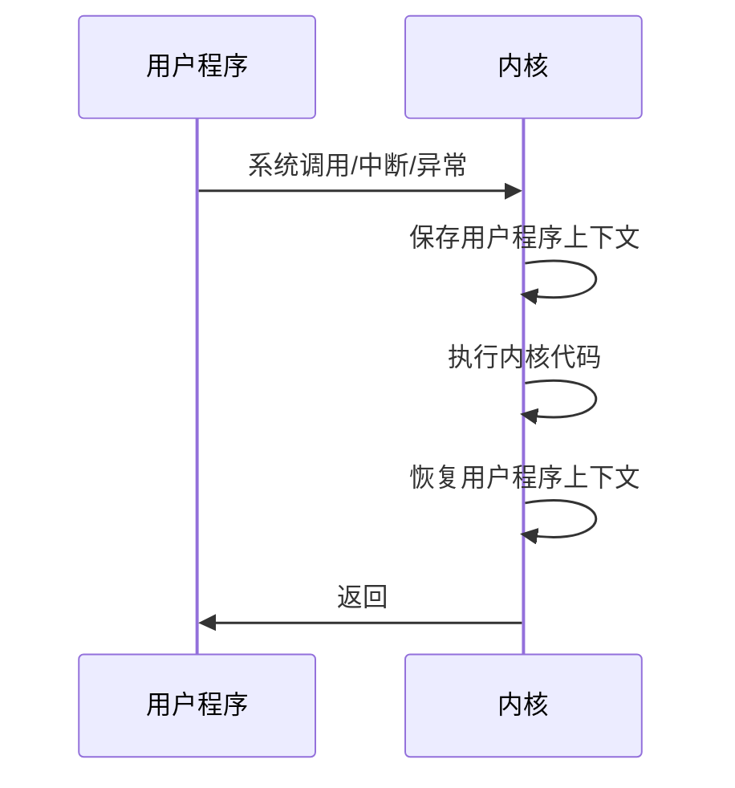
### 为什么要分用户态和内核态
1. **保护系统资源**：因为用户态有权限限制，不能直接访问硬件资源，只能通过系统调用来请求内核来提供服务（防止用户程序恶意或者意外破坏系统资源）
2. **隔离用户资源**：每个用户程序都在独立的地址空间运行，互不干扰，内核来管理各个应用的内存空间，确保来用户应用程序不可以访问其他程序的内存（防止用户程序窃取其他程序的数据）
## 进程有哪些状态
“进程在其生命周期中主要有五个核心状态：

1. **创建状态**：进程刚开始创建，系统正在为其分配资源。
2. **就绪状态**：进程已具备运行条件，分配到了除CPU以外的所有资源，在就绪队列里等待CPU调度。
3. **运行状态**：进程的指令正在CPU上执行。
4. **阻塞状态（或等待状态）**：进程因等待某个事件（比如I/O操作完成或等待锁）而暂时不能执行，即使有CPU也不能运行。
5. **终止状态**：进程执行完毕或被终止，系统会回收其资源。

这些状态之间的转换是由操作系统调度器根据进程的运行情况和等待的事件来管理的，比如从就绪到运行是调度器分配了CPU，从运行到阻塞是进程发起了阻塞操作，从阻塞到就绪是等待的事件完成了。”
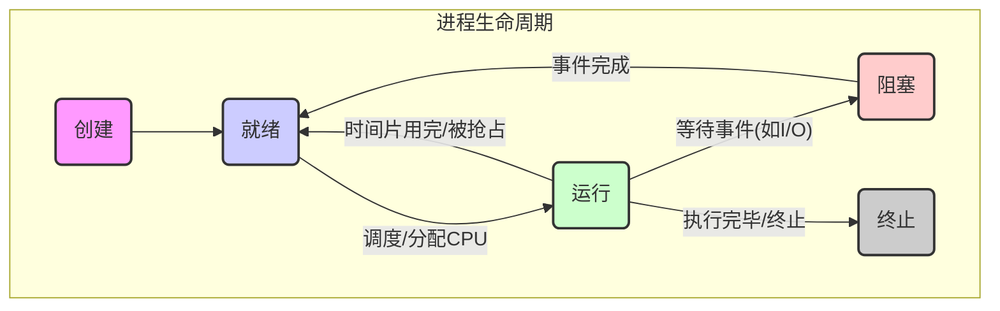
## 僵尸线程？孤儿线程？
>"僵尸线程是指线程已经执行完毕，但其父进程没有调用 `wait()` 或类似函数来回收其资源，导致该线程仍然占用进程表中的一个条目。大量的僵尸线程会导致系统资源耗尽。孤儿线程是指父进程在子线程之前结束，子线程成为孤儿线程后，通常会被 `init` 进程领养，`init` 进程会负责清理这些孤儿线程。"
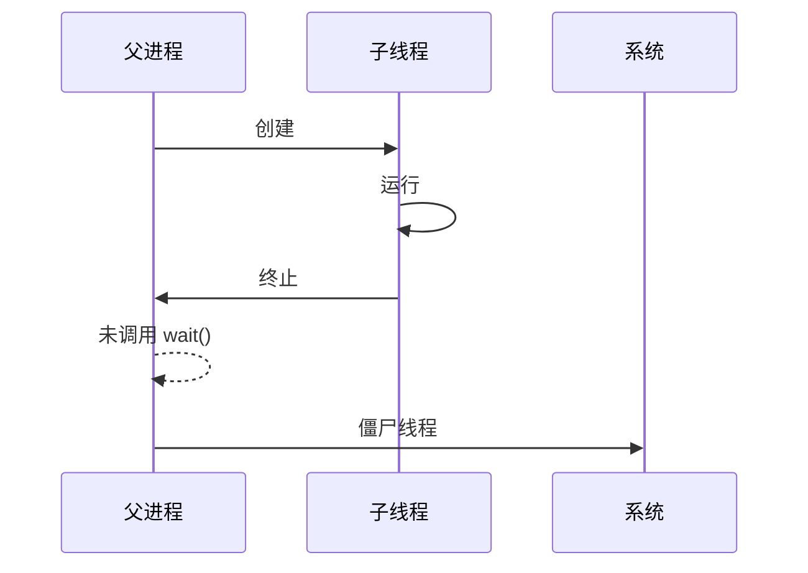
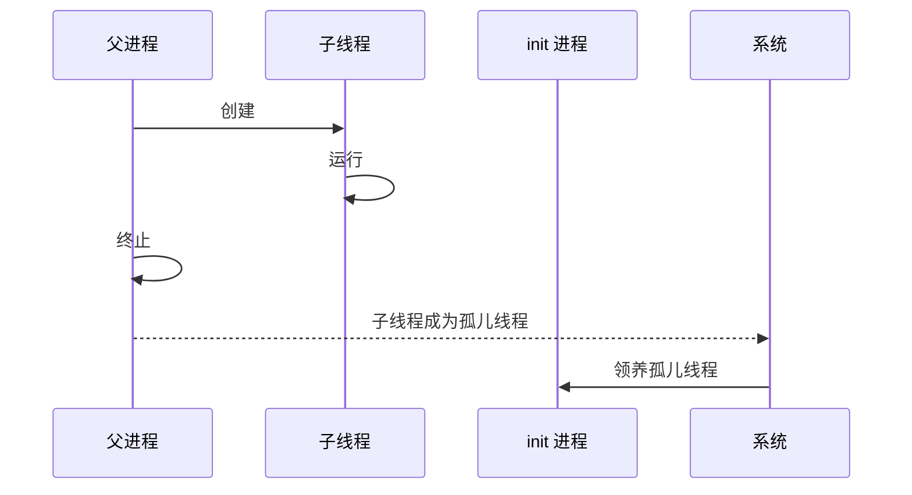
## 常见的线程调度算法
>"常见的进程调度算法包括先来先服务（FCFS）、短作业优先（SJF）、优先级调度、时间片轮转（RR）、多级队列调度和多级反馈队列调度等。
>FCFS (**先来先服务**)简单易实现，但可能导致长作业等待时间过长；
>SJF(**短作业优先**) 可以有效降低平均等待时间，但需要预知进程的运行时间；
>**优先级调度**根据进程的优先级进行调度，可能导致低优先级进程饥饿；
>**时间片轮转**（为每个线程分配不同的CPU时间片，当一个线程用完时间片后进入就绪状态，把CPU让给其他线程，等待CPU调度）适用于分时系统，可以提供较好的响应时间；
>**多级队列调度（多个队列实现不同的调度算法）和多级反馈队列(在多级队列的基础上，队列中的线程可以在不同队列中移动)** 调度则更加灵活，可以适应不同的进程特性。"

## 进程之间有哪些通信方式
>"进程间通信的方式有很多种，常见的包括**管道**、**消息队列**、信号量、**共享内存**、信号和**套接字**等。
>管道是一种半双工的通信方式，适用于父子进程或兄弟进程之间的通信；消息队列允许进程以消息为单位进行通信，可以实现异步通信；
>信号量用于控制多个进程对共享资源的访问，可以实现进程间的同步和互斥；
>共享内存允许多个进程访问同一块物理内存区域，是最快的 IPC 方式；
>套接字可以用于本地进程间通信，也可以实现不同机器上的进程之间的通信。"

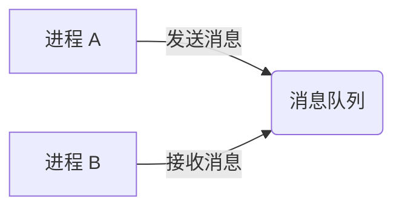
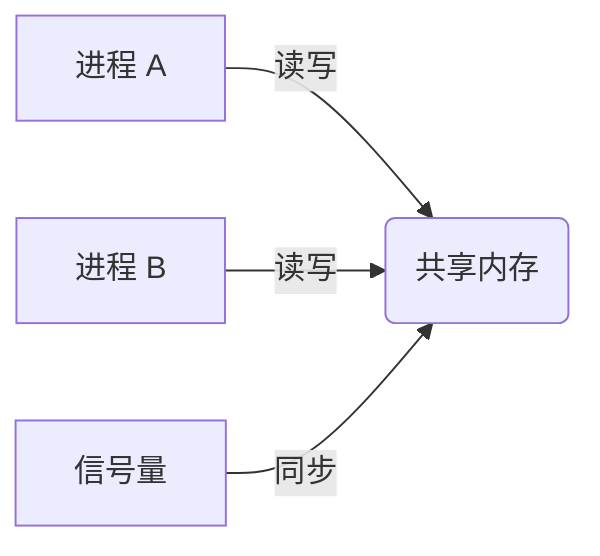
## 进程和线程之间的联系
>"进程和线程都是操作系统中实现**并发执行**的重要概念。
>一个进程可以包含一个或多个线程，线程是进程中实际运行的单位。
>线程共享进程的地址空间和资源，但拥有独立的栈和寄存器。
>进程是**操作系统资源分配**的基本单位，线程是 **CPU 调度**的基本单位。
>创建和销毁进程的开销比线程大，进程间通信需要特殊的机制(管道等)，而线程间可以直接通过共享内存进行通信。
>进程之间相互独立，一个进程的崩溃不会影响其他进程，而一个线程的崩溃可能会导致整个进程崩溃。"
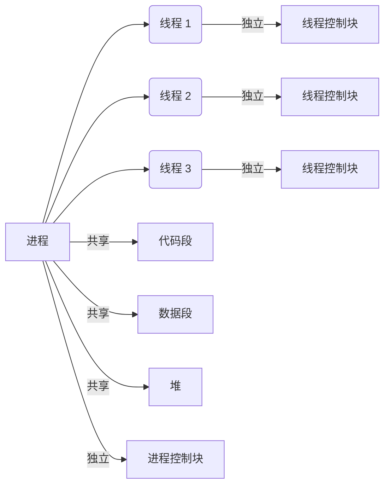
## 线程上下文切换
**线程上下文的主要组成部分：**
1. **寄存器（Registers）**：
    - 通用寄存器：用于存储临时数据、地址等。
    - 程序计数器（Program Counter, PC）：指向下一条要执行的指令的地址。
    - 堆栈指针（Stack Pointer, SP）：指向当前线程的堆栈顶部的地址。
    - 状态寄存器：包含线程的运行状态（如中断使能、条件码等）。
2. **堆栈（Stack）**：
    - 用于存储局部变量、函数调用信息（返回地址、参数等）。
    - 每个线程都有独立的堆栈。
3. **内存管理信息**：
    - 页表（Page Table）：用于将虚拟地址转换为物理地址。
    - 内存段信息：描述进程的内存布局。
4. **线程控制块（Thread Control Block, TCB）**：
    - 包含线程的 ID、优先级、状态等信息。
    - 用于操作系统管理线程。
5. **其他内核数据结构**：
    - 例如，打开的文件列表、信号处理方式等。

>"线程上下文是指 **CPU 在执行线程时所依赖的环境信息**，包括寄存器、堆栈、内存管理信息和线程控制块等。线程上下文切换是指**操作系统在不同的线程之间切换时，保存当前线程的上下文并恢复目标线程的上下文的过程**。线程上下文切换会带来一定的开销，包括保存和恢复上下文的时间、高速缓存失效和 TLB 失效等。为了提高程序的性能，应该尽量减少不必要的线程上下文切换，例如通过减少锁竞争、合理设置线程数量和使用协程等方式。"
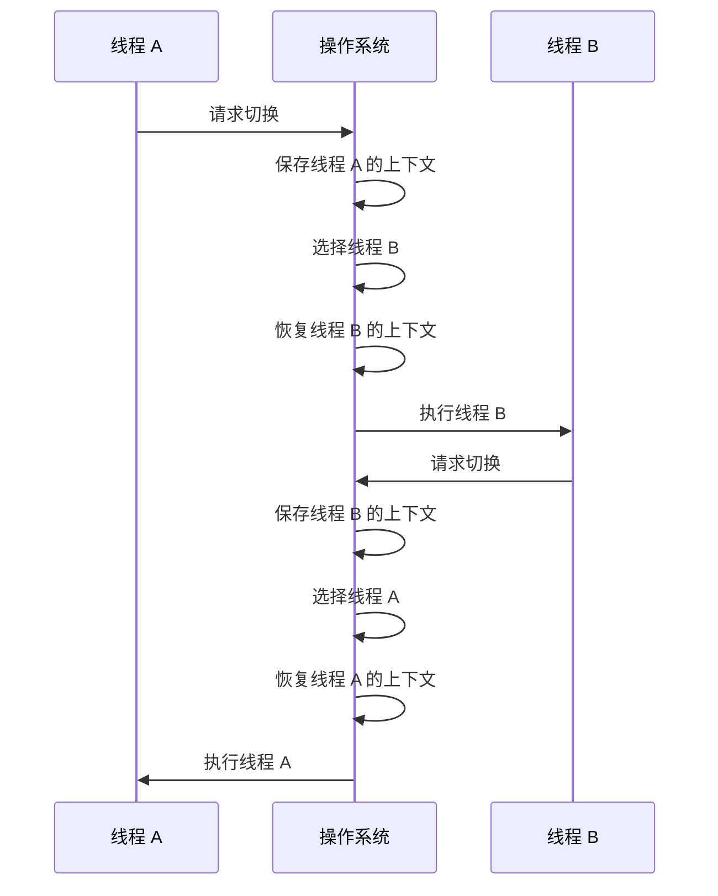
## 线程的实现方式有哪些

1. **用户级线程**：
	- 用户空间的线程库所创建，内核不知道用户线程存在（所以不需要内核参与）
	- 不需要和内核打交道，所以切换时间短，切换速度快
2. **内核级线程**：
	- 由内核直接创建并管理
3. **混合级线程**：
	- 一个进程中可以有多个用户级线程，这些用户级线程可以被映射到少量的内核级线程上。
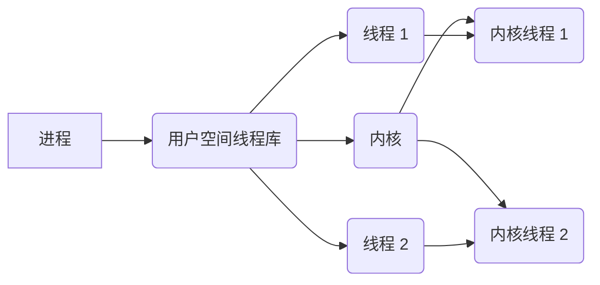
## 线程如何同步
>"线程同步是为了保证多个线程并发访问共享资源时的**数据一致性**和程序的正确性。如果没有线程同步，可能会出现竞态条件，导致程序行为的不确定性；可能会破坏共享数据结构，导致数据不一致（可以想到多个线程同时修改链表，可能导致链表顺序错误）；可能会导致线程执行顺序错误，影响程序逻辑；还可能导致死锁，使程序无法继续执行。（线程 A 持有互斥锁 M1，并尝试获取互斥锁 M2；线程 B 持有互斥锁 M2，并尝试获取互斥锁 M1。）"

| 方法   | 描述                                    | 适用场景                     | 注意事项                                            |
| ---- | ------------------------------------- | ------------------------ | ----------------------------------------------- |
| 互斥锁  | 保护临界区，确保在**任何时刻只有一个线程**可以访问共享资源。      | 保护对共享资源的独占访问。            | 必须由同一个线程获取和释放，应尽量缩短持有互斥锁的时间。                    |
| 条件变量 | 允许线程在**满足特定条件时被阻塞，并在条件发生变化时被唤醒。**     | 线程需要等待特定条件满足才能继续执行的情况。   | 在使用条件变量之前必须先获取互斥锁，在 `wait()` 函数返回后需要重新检查条件是否满足。 |
| 信号量  | 控制多个线程对共享资源的访问。                       | 控制对共享资源的并发访问数量。          | 信号量的值可以大于 1，互斥锁可以看作是信号量的一种特殊情况。                 |
| 读写锁  | 允许多个线程同时读取共享资源，但只允许一个线程写入共享资源。        | 读多写少的场景。                 | 可能会导致写线程饥饿。                                     |
| 自旋锁  | 线程在获取自旋锁失败时，不会立即阻塞，而是会循环尝试获取锁，直到成功为止。 | 锁的持有时间非常短的场景。            | 只适用于单处理器系统或多处理器系统，应尽量缩短持有自旋锁的时间。                |
| 屏障   | 同步多个线程的执行进度，确保所有线程都到达某个点后才能继续执行。      | 需要同步多个线程的执行进度的场景，例如并行计算。 | 需要预先知道参与同步的线程数量，可以重复使用。                         |
## 死锁
>**死锁**是指两个或多个进程（或线程）在执行过程中，因争夺资源而造成的一种互相等待的现象，导致它们都无法继续执行。
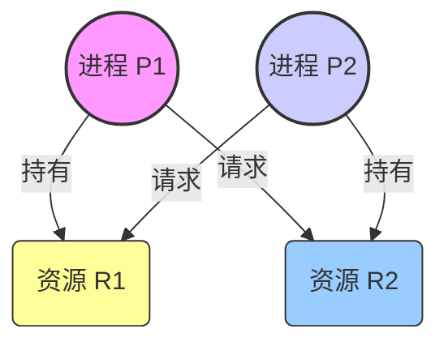
### 产生的四个必要条件
1. **互斥条件 (Mutual Exclusion)**：资源不能被共享，一次只能被一个进程/线程使用。如果别的进程/线程请求该资源，请求者只能等待，直至资源使用完毕被释放。
2. **占有并等待条件 (Hold and Wait)**：一个进程/线程至少占有一个资源，并且在等待获取其他进程/线程持有的资源。
3. **非剥夺条件 (No Preemption)**：**资源不能被强制剥夺**，只能由持有者自愿释放。
4. **循环等待条件 (Circular Wait)**：存在一个进程/线程的**资源等待链**，其中每个进程/线程都在等待下一个进程/线程所持有的资源，形成一个环路。例如，P0 等待 P1 持有的资源，P1 等待 P2 持有的资源，...，Pn 等待 P0 持有的资源。
### 如何避免
- **破坏占有并等待**：例如，要求进程一次性申请所有所需资源。
- **破坏非剥夺**：允许操作系统剥夺进程已持有的资源（较少使用）。
- *==**破坏循环等待**==*：这是最常用的方法，通过**资源有序分配法**，要求进程按固定顺序申请资源，从而打破循环等待链。
## 活锁、饥饿锁
**活锁与死锁的区别：**
- **死锁：** 线程处于阻塞状态，无法继续执行。
- **活锁：** 线程处于运行状态，但没有做任何有用的工作。
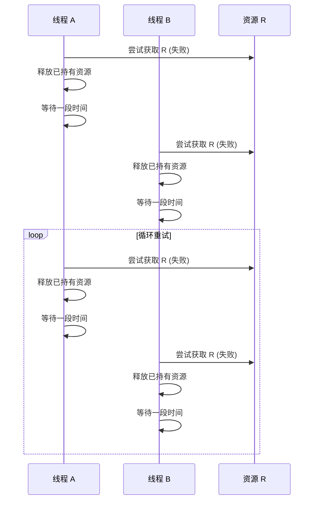
**饥饿锁与死锁的区别：**
- **死锁：** 线程之间互相等待资源，导致所有线程都无法继续执行。
- **饥饿锁：** 某些线程长时间无法获得资源，但其他线程可以正常执行。（和各个线程优先级有关）
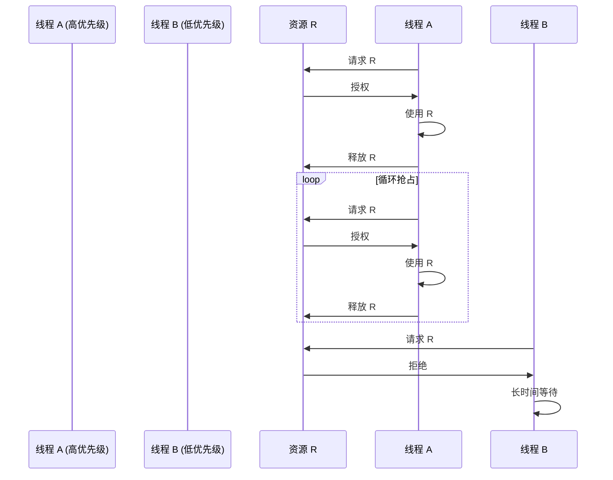
>"活锁是指多个线程为了避免死锁，不断地尝试获取资源，但由于某种原因(可能是两个或多个线程一直相互谦让，导致一直没有线程能够获取资源)，总是无法成功，导致线程一直处于运行状态，但实际上并没有做任何有用的工作。可以通过引入随机性、优先级、退避策略等方法来避免活锁。
饥饿锁是指一个或多个线程因为某种原因，长时间无法获得所需的资源，导致线程一直处于等待状态，无法继续执行。可以使用公平锁、优先级反转等方法来避免饥饿锁。"
