# 设计模式详解

本文档旨在详细介绍23种常见的设计模式，分为创建型、结构型和行为型三大类。每种模式都将包含其核心特点、适用场景、Java示例代码、形象类比以及Mermaid结构图（如果适用），以帮助读者更好地理解和应用这些模式。

## 一、创建型模式 (Creational Patterns)

创建型模式关注对象的创建过程，旨在以一种灵活和可重用的方式创建对象，隐藏创建逻辑的复杂性。

### 1. 单例模式 (Singleton Pattern)

**特点（关键字）：** 保证唯一实例、全局访问点、自行实例化。

**使用场景：**
- 当类只能有一个实例而且客户可以从一个众所周知的访问点访问它时。
- 当这个唯一实例应该是通过子类化可扩展的，并且客户应该无需更改代码就能使用一个扩展的实例时。
- 例如：线程池、缓存、对话框、日志对象、打印机后台处理服务、数据库连接池等。

**示例代码 (Java)：**

```java
/**
 * 单例模式 - 饿汉式 (线程安全)
 * 特点：类加载时就初始化实例，保证了线程安全，但可能造成资源浪费（如果实例一直未使用）。
 */
public class SingletonEager {

    // 1. 私有静态实例，在类加载时就创建
    private static final SingletonEager instance = new SingletonEager();

    // 2. 私有构造函数，防止外部通过new创建实例
    private SingletonEager() {
        // 防止反射破坏单例
        if (instance != null) {
            throw new IllegalStateException("Cannot create new instance of singleton");
        }
        System.out.println("饿汉式单例已创建");
    }

    // 3. 公有静态方法，返回唯一实例
    public static SingletonEager getInstance() {
        return instance;
    }

    // 示例方法
    public void showMessage() {
        System.out.println("Hello from Eager Singleton!");
    }

    public static void main(String[] args) {
        SingletonEager singleton1 = SingletonEager.getInstance();
        SingletonEager singleton2 = SingletonEager.getInstance();

        System.out.println("singleton1 和 singleton2 是否是同一个实例? " + (singleton1 == singleton2));
        singleton1.showMessage();
    }
}

/**
 * 单例模式 - 懒汉式 (双重检查锁定 - 线程安全)
 * 特点：在第一次调用getInstance()时才创建实例，实现了延迟加载，提高了效率。
 * 使用volatile关键字确保多线程环境下的可见性和有序性。
 * 双重检查锁定（DCL）保证了线程安全。
 */
class SingletonLazyDCL {

    // 1. 私有静态volatile实例，初始为null
    // volatile 保证 instance 在所有线程中同步可见，禁止指令重排序优化
    private static volatile SingletonLazyDCL instance = null;

    // 2. 私有构造函数
    private SingletonLazyDCL() {
        // 防止反射破坏单例
        if (instance != null) {
            throw new IllegalStateException("Cannot create new instance of singleton");
        }
        System.out.println("懒汉式DCL单例已创建");
    }

    // 3. 公有静态方法，返回唯一实例
    public static SingletonLazyDCL getInstance() {
        // 第一次检查：如果实例已存在，直接返回，避免不必要的同步开销
        if (instance == null) {
            // 同步块，确保只有一个线程可以进入创建实例的代码
            synchronized (SingletonLazyDCL.class) {
                // 第二次检查：再次检查实例是否存在，因为可能有其他线程在等待锁时已创建实例
                if (instance == null) {
                    instance = new SingletonLazyDCL();
                }
            }
        }
        return instance;
    }

    // 示例方法
    public void showMessage() {
        System.out.println("Hello from Lazy DCL Singleton!");
    }

    public static void main(String[] args) {
        // 多线程测试
        for (int i = 0; i < 5; i++) {
            new Thread(() -> {
                SingletonLazyDCL singleton = SingletonLazyDCL.getInstance();
                System.out.println(Thread.currentThread().getName() + " 获取实例: " + singleton.hashCode());
                singleton.showMessage();
            }).start();
        }
    }
}

/**
 * 单例模式 - 静态内部类 (线程安全，推荐)
 * 特点：利用了类加载机制来保证初始化实例时只有一个线程。
 * 只有在第一次调用getInstance()方法时，才会加载SingletonHolder类，从而初始化instance。
 * 既实现了延迟加载，又保证了线程安全，且实现简单。
 */
class SingletonStaticInnerClass {

    // 1. 私有构造函数
    private SingletonStaticInnerClass() {
        System.out.println("静态内部类单例已创建");
    }

    // 2. 静态内部类，持有外部类的唯一实例
    private static class SingletonHolder {
        private static final SingletonStaticInnerClass INSTANCE = new SingletonStaticInnerClass();
    }

    // 3. 公有静态方法，返回唯一实例
    public static SingletonStaticInnerClass getInstance() {
        return SingletonHolder.INSTANCE;
    }

    // 示例方法
    public void showMessage() {
        System.out.println("Hello from Static Inner Class Singleton!");
    }

    public static void main(String[] args) {
        SingletonStaticInnerClass s1 = SingletonStaticInnerClass.getInstance();
        SingletonStaticInnerClass s2 = SingletonStaticInnerClass.getInstance();
        System.out.println("s1 和 s2 是否是同一个实例? " + (s1 == s2));
        s1.showMessage();
    }
}

/**
 * 单例模式 - 枚举 (线程安全，防止反序列化创建新实例，推荐)
 * 特点：实现简单，天然线程安全，并且能防止反序列化重新创建新的对象。
 * Effective Java 作者 Josh Bloch 推荐的方式。
 */
enum SingletonEnum {
    INSTANCE; // 定义一个枚举元素，它代表了Singleton的一个实例

    // 构造方法在枚举实例化时自动调用，且是私有的
    SingletonEnum() {
        System.out.println("枚举单例已创建");
    }

    public void showMessage() {
        System.out.println("Hello from Enum Singleton!");
    }

    public static void main(String[] args) {
        SingletonEnum singleton1 = SingletonEnum.INSTANCE;
        SingletonEnum singleton2 = SingletonEnum.INSTANCE;

        System.out.println("singleton1 和 singleton2 是否是同一个实例? " + (singleton1 == singleton2));
        singleton1.showMessage();

        // 尝试通过反射创建实例 (会失败)
        try {
            // Enum类型的构造器是特殊的，不能通过反射直接创建
            // Constructor<SingletonEnum> constructor = SingletonEnum.class.getDeclaredConstructor();
            // constructor.setAccessible(true);
            // SingletonEnum singleton3 = constructor.newInstance();
            // System.out.println("通过反射创建的singleton3: " + singleton3.hashCode());
            System.out.println("枚举类型能有效防止反射创建新实例。");
        } catch (Exception e) {
            System.out.println("尝试通过反射创建枚举单例失败: " + e.getMessage());
        }
    }
}
```

**形象类比：**
一个国家只有一个皇帝或总统。无论何时何地，当人们提到“本国皇帝/总统”时，指的都是同一个人。这个“皇帝/总统”就是单例，他自己管理自己（自行实例化），并且提供一个统一的渠道（全局访问点）让大家找到他。

**Mermaid 结构化说明：**

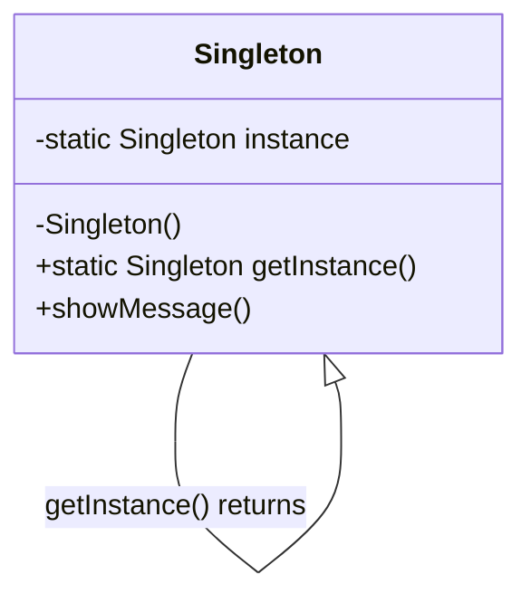

---
### 2. 工厂方法模式 (Factory Method Pattern)

**特点（关键字）：** 定义创建对象的接口、子类决定实例化哪个类、延迟实例化。

**使用场景：**
- 当一个类不知道它所必须创建的对象的类的时候。
- 当一个类希望由它的子类来指定它所创建的对象的时候。
- 当类将创建对象的职责委托给多个帮助子类中的某一个，并且你希望将哪一个帮助子类是代理者这一信息局部化的时候。
- 例如：日志记录器（可以创建文件日志、数据库日志等）、不同类型的文档编辑器（创建Word文档、PDF文档等）。

**示例代码 (Java)：**

```java
/**
 * 产品接口 (Product)
 * 定义了工厂方法所创建的对象的接口。
 */
interface Product {
    void use();
}

/**
 * 具体产品A (ConcreteProductA)
 * 实现了Product接口。
 */
class ConcreteProductA implements Product {
    @Override
    public void use() {
        System.out.println("使用具体产品 A");
    }
}

/**
 * 具体产品B (ConcreteProductB)
 * 实现了Product接口。
 */
class ConcreteProductB implements Product {
    @Override
    public void use() {
        System.out.println("使用具体产品 B");
    }
}

/**
 * 抽象工厂 (Creator)
 * 声明了工厂方法，该方法返回一个Product类型的对象。
 * Creator也可以定义一个工厂方法的默认实现，它返回一个默认的ConcreteProduct对象。
 */
abstract class Creator {
    // 抽象的工厂方法
    public abstract Product factoryMethod();

    // 其他操作，可能依赖于工厂方法创建的产品
    public void someOperation() {
        // 调用工厂方法创建一个产品对象
        Product product = factoryMethod();
        // 使用产品
        product.use();
    }
}

/**
 * 具体工厂A (ConcreteCreatorA)
 * 重写工厂方法以返回一个ConcreteProductA的实例。
 */
class ConcreteCreatorA extends Creator {
    @Override
    public Product factoryMethod() {
        System.out.println("具体工厂 A 正在创建产品 A...");
        return new ConcreteProductA();
    }
}

/**
 * 具体工厂B (ConcreteCreatorB)
 * 重写工厂方法以返回一个ConcreteProductB的实例。
 */
class ConcreteCreatorB extends Creator {
    @Override
    public Product factoryMethod() {
        System.out.println("具体工厂 B 正在创建产品 B...");
        return new ConcreteProductB();
    }
}

/**
 * 客户端代码
 */
public class FactoryMethodClient {
    public static void main(String[] args) {
        System.out.println("--- 使用具体工厂 A ---");
        Creator creatorA = new ConcreteCreatorA();
        creatorA.someOperation(); // 输出: 具体工厂 A 正在创建产品 A...  使用具体产品 A

        System.out.println("\n--- 使用具体工厂 B ---");
        Creator creatorB = new ConcreteCreatorB();
        creatorB.someOperation(); // 输出: 具体工厂 B 正在创建产品 B...  使用具体产品 B

        // 也可以直接调用工厂方法获取产品实例
        Product productA = creatorA.factoryMethod();
        productA.use(); // 输出: 使用具体产品 A

        Product productB = creatorB.factoryMethod();
        productB.use(); // 输出: 使用具体产品 B
    }
}
```

**形象类比：**
想象一个饮料工厂（抽象工厂 Creator）。这个工厂本身不直接生产特定口味的饮料，而是定义了一个“生产饮料”的方法（`factoryMethod`）。
然后，有专门生产可乐的子工厂（ConcreteCreatorA）和专门生产橙汁的子工厂（ConcreteCreatorB）。
当你需要可乐时，你就去找可乐工厂，它会调用“生产饮料”的方法来生产可乐。当你需要橙汁时，就去找橙汁工厂。
核心在于，总工厂定义了生产流程，但具体生产什么由子工厂决定。

**Mermaid 结构化说明：**

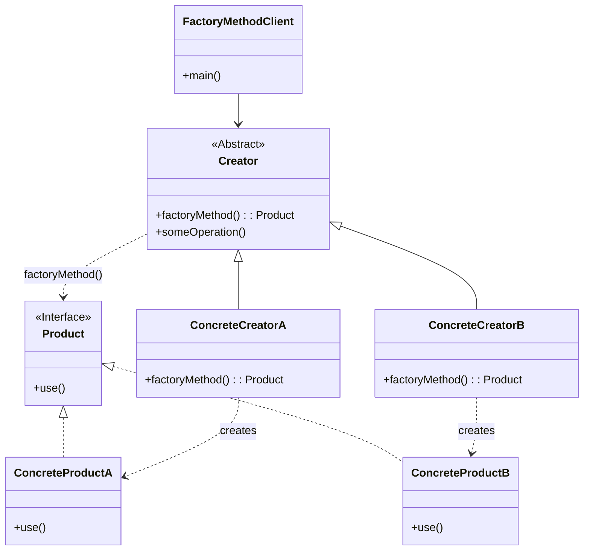

---
### 3. 抽象工厂模式 (Abstract Factory Pattern)

**特点（关键字）：** 提供创建一系列相关或相互依赖对象的接口、无需指定具体类、产品族。

**使用场景：**
- 一个系统要独立于它的产品的创建、组合和表示时。
- 一个系统要由多个产品系列中的一个来配置时。
- 当你要强调一系列相关的产品对象的设计以便进行联合使用时。
- 当你提供一个产品类库，而只想显示它们的接口而不是实现时。
- 例如：更换UI主题（如Windows主题、macOS主题，每个主题下有对应的按钮、文本框等一系列组件）、数据库访问（如同时支持SQL Server和Oracle，每个数据库有对应的Connection、Command等对象）。

**示例代码 (Java)：**

```java
/**
 * 抽象产品A (AbstractProductA)
 * 为一类产品对象声明一个接口。
 */
interface Button {
    void paint();
}

/**
 * 具体产品A1 (ConcreteProductA1)
 * 定义一个将被相应的具体工厂创建的产品对象。
 * 实现AbstractProductA接口。
 */
class WindowsButton implements Button {
    @Override
    public void paint() {
        System.out.println("绘制 Windows 风格按钮");
    }
}

/**
 * 具体产品A2 (ConcreteProductA2)
 */
class MacOSButton implements Button {
    @Override
    public void paint() {
        System.out.println("绘制 macOS 风格按钮");
    }
}

/**
 * 抽象产品B (AbstractProductB)
 */
interface TextField {
    void display();
}

/**
 * 具体产品B1 (ConcreteProductB1)
 */
class WindowsTextField implements TextField {
    @Override
    public void display() {
        System.out.println("显示 Windows 风格文本框");
    }
}

/**
 * 具体产品B2 (ConcreteProductB2)
 */
class MacOSTextField implements TextField {
    @Override
    public void display() {
        System.out.println("显示 macOS 风格文本框");
    }
}

/**
 * 抽象工厂 (AbstractFactory)
 * 声明一个创建抽象产品对象的操作接口集合。
 */
interface GUIFactory {
    Button createButton();
    TextField createTextField();
}

/**
 * 具体工厂1 (ConcreteFactory1)
 * 实现创建具体产品对象的操作。
 * 负责创建属于特定产品族的产品。
 */
class WindowsFactory implements GUIFactory {
    @Override
    public Button createButton() {
        System.out.println("Windows工厂: 创建Windows按钮");
        return new WindowsButton();
    }

    @Override
    public TextField createTextField() {
        System.out.println("Windows工厂: 创建Windows文本框");
        return new WindowsTextField();
    }
}

/**
 * 具体工厂2 (ConcreteFactory2)
 */
class MacOSFactory implements GUIFactory {
    @Override
    public Button createButton() {
        System.out.println("macOS工厂: 创建macOS按钮");
        return new MacOSButton();
    }

    @Override
    public TextField createTextField() {
        System.out.println("macOS工厂: 创建macOS文本框");
        return new MacOSTextField();
    }
}

/**
 * 客户端 (Client)
 * 仅使用由AbstractFactory和AbstractProduct类声明的接口。
 */
class Application {
    private Button button;
    private TextField textField;

    public Application(GUIFactory factory) {
        System.out.println("应用: 使用工厂 " + factory.getClass().getSimpleName() + " 创建UI组件");
        button = factory.createButton();
        textField = factory.createTextField();
    }

    public void renderUI() {
        System.out.println("应用: 开始渲染UI");
        button.paint();
        textField.display();
        System.out.println("应用: UI渲染完成");
    }
}

/**
 * 客户端配置与运行
 */
public class AbstractFactoryClient {
    public static void main(String[] args) {
        String osName = System.getProperty("os.name").toLowerCase();
        GUIFactory factory;

        System.out.println("当前操作系统: " + osName);

        if (osName.contains("win")) {
            System.out.println("检测到Windows系统，使用Windows工厂。");
            factory = new WindowsFactory();
        } else if (osName.contains("mac")) {
            System.out.println("检测到macOS系统，使用macOS工厂。");
            factory = new MacOSFactory();
        } else {
            System.out.println("未知操作系统，默认使用Windows工厂。");
            factory = new WindowsFactory(); // 默认或可以抛出异常
        }

        Application app = new Application(factory);
        app.renderUI();

        System.out.println("\n--- 手动切换到macOS工厂 (示例) ---");
        GUIFactory macFactory = new MacOSFactory();
        Application macApp = new Application(macFactory);
        macApp.renderUI();

        System.out.println("\n--- 手动切换到Windows工厂 (示例) ---");
        GUIFactory winFactory = new WindowsFactory();
        Application winApp = new Application(winFactory);
        winApp.renderUI();
    }
}
```

**形象类比：**
想象你要装修房子，可以选择不同的装修风格，比如“中式风格”或“欧式风格”。
- **抽象工厂 (GUIFactory)** 就像一个“装修风格规范”，它规定了任何一种风格都必须能提供“门”、“窗户”、“地板”等（对应 `createButton`, `createTextField`）。
- **具体工厂 (WindowsFactory, MacOSFactory)** 就像具体的“中式装修队”和“欧式装修队”。
  - “中式装修队”会提供“中式风格的门”、“中式风格的窗户”。
  - “欧式装修队”会提供“欧式风格的门”、“欧式风格的窗户”。
- **抽象产品 (Button, TextField)** 定义了“门”和“窗户”应该有的基本功能（如 `paint`, `display`）。
- **具体产品 (WindowsButton, MacOSButton, WindowsTextField, MacOSTextField)** 就是实际的“中式红木门”、“欧式雕花窗”等。
客户端（你，房主）只需要选择一个装修队（具体工厂），这个装修队就会提供一整套风格匹配的装修组件（产品族）。你不需要关心具体的门窗是如何制造的，只需要知道它们符合你选定的风格。

**Mermaid 结构化说明：**

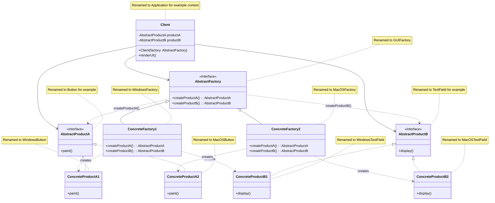

---
### 4. 生成器模式 (Builder Pattern)

**特点（关键字）：** 分步构建复杂对象、相同构建过程创建不同表示、封装构建细节、链式调用。

**使用场景：**
- 当创建复杂对象的算法应该独立于该对象的组成部分以及它们的装配方式时。
- 当构造过程必须允许被构造的对象有不同的表示时。
- 当需要控制复杂对象的构造过程，并且希望一步一步地创建对象的不同部分时。
- 例如：构建复杂的`StringBuilder`对象、`Uri.Builder`、各种配置对象的构建（如`OkHttpClient.Builder`）、创建具有大量可选参数或复杂依赖关系的对象。

**示例代码 (Java)：**

```java
/**
 * 产品类 (Product)
 * 表示被构建的复杂对象。
 * 通常包含多个组成部分。
 */
class Computer {
    private String cpu;
    private String ram;
    private String storage;
    private String graphicsCard; // 可选
    private String operatingSystem; // 可选

    // 私有构造函数，强制通过Builder创建
    private Computer(Builder builder) {
        this.cpu = builder.cpu;
        this.ram = builder.ram;
        this.storage = builder.storage;
        this.graphicsCard = builder.graphicsCard;
        this.operatingSystem = builder.operatingSystem;
    }

    @Override
    public String toString() {
        return "Computer Specs: \n" +
               "CPU: " + cpu + "\n" +
               "RAM: " + ram + "\n" +
               "Storage: " + storage + "\n" +
               (graphicsCard != null ? "Graphics Card: " + graphicsCard + "\n" : "") +
               (operatingSystem != null ? "OS: " + operatingSystem + "\n" : "");
    }

    /**
     * 静态内部Builder类 (Builder)
     * 负责一步一步构建Computer对象。
     */
    public static class Builder {
        // 必要参数
        private final String cpu;
        private final String ram;
        private final String storage;

        // 可选参数
        private String graphicsCard;
        private String operatingSystem;

        /**
         * 构造函数，包含所有必要参数。
         * @param cpu CPU型号
         * @param ram 内存大小
         * @param storage 存储容量
         */
        public Builder(String cpu, String ram, String storage) {
            if (cpu == null || ram == null || storage == null) {
                throw new IllegalArgumentException("CPU, RAM, and Storage cannot be null.");
            }
            this.cpu = cpu;
            this.ram = ram;
            this.storage = storage;
            System.out.println("Builder: 初始化必要组件 CPU=" + cpu + ", RAM=" + ram + ", Storage=" + storage);
        }

        /**
         * 设置可选的显卡。
         * @param graphicsCard 显卡型号
         * @return Builder对象，支持链式调用
         */
        public Builder setGraphicsCard(String graphicsCard) {
            this.graphicsCard = graphicsCard;
            System.out.println("Builder: 添加显卡 " + graphicsCard);
            return this;
        }

        /**
         * 设置可选的操作系统。
         * @param operatingSystem 操作系统名称
         * @return Builder对象，支持链式调用
         */
        public Builder setOperatingSystem(String operatingSystem) {
            this.operatingSystem = operatingSystem;
            System.out.println("Builder: 安装操作系统 " + operatingSystem);
            return this;
        }

        /**
         * 构建并返回Computer对象。
         * @return 构建完成的Computer对象
         */
        public Computer build() {
            System.out.println("Builder: 开始组装电脑...");
            Computer computer = new Computer(this);
            System.out.println("Builder: 电脑组装完成！");
            return computer;
        }
    }
}

/**
 * 指挥者 (Director) - 可选
 * 指挥者类负责按照特定的步骤顺序来构建对象。
 * 客户端可以直接使用Builder，也可以通过Director来构建。
 * Director的存在可以封装复杂的构建逻辑。
 */
class ComputerDirector {
    public Computer buildGamingComputer(Computer.Builder builder) {
        System.out.println("Director: 开始构建游戏电脑...");
        return builder
                .setGraphicsCard("NVIDIA RTX 4090")
                .setOperatingSystem("Windows 11 Pro for Gaming")
                .build();
    }

    public Computer buildOfficeComputer(Computer.Builder builder) {
        System.out.println("Director: 开始构建办公电脑...");
        return builder
                .setOperatingSystem("Windows 11 Home")
                .build(); // 办公电脑可能不需要独立显卡
    }
}


/**
 * 客户端代码
 */
public class BuilderClient {
    public static void main(String[] args) {
        System.out.println("--- 客户直接使用Builder构建自定义电脑 ---");
        // 1. 客户直接使用Builder，逐步构建对象
        Computer customComputer = new Computer.Builder("Intel i9-13900K", "64GB DDR5", "4TB NVMe SSD")
                .setGraphicsCard("NVIDIA RTX 3080")
                .setOperatingSystem("Ubuntu 22.04 LTS")
                .build();
        System.out.println("\n自定义电脑配置完成:");
        System.out.println(customComputer);

        System.out.println("\n--- 客户构建一台只有必要组件的电脑 ---");
        Computer basicComputer = new Computer.Builder("AMD Ryzen 5 5600X", "16GB DDR4", "1TB SATA SSD")
                .build();
        System.out.println("\n基础电脑配置完成:");
        System.out.println(basicComputer);

        System.out.println("\n--- 使用Director构建特定类型的电脑 ---");
        ComputerDirector director = new ComputerDirector();

        // 2. 客户通过Director构建游戏电脑
        // 首先创建一个Builder实例，并传入必要参数
        Computer.Builder gamingBuilder = new Computer.Builder("Intel i7-14700KF", "32GB DDR5", "2TB NVMe SSD");
        Computer gamingComputer = director.buildGamingComputer(gamingBuilder);
        System.out.println("\n游戏电脑配置完成 (Director指导):");
        System.out.println(gamingComputer);

        // 3. 客户通过Director构建办公电脑
        Computer.Builder officeBuilder = new Computer.Builder("Intel i5-13400", "16GB DDR4", "512GB NVMe SSD");
        Computer officeComputer = director.buildOfficeComputer(officeBuilder);
        System.out.println("\n办公电脑配置完成 (Director指导):");
        System.out.println(officeComputer);

        // 演示必要参数检查
        try {
            System.out.println("\n--- 尝试构建缺少必要参数的电脑 ---");
            new Computer.Builder(null, "16GB", "1TB").build();
        } catch (IllegalArgumentException e) {
            System.err.println("构建失败: " + e.getMessage());
        }
    }
}
```

**形象类比：**
就像去赛百味点三明治：
1.  **产品 (Computer)**：你最终得到的三明治。
2.  **抽象生成器 (Builder Interface - 如果有)**：点餐台上的“三明治制作规范”，定义了可以选择面包、肉类、蔬菜、酱料等步骤。
3.  **具体生成器 (Computer.Builder)**：实际操作的服务员。他知道如何根据你的要求一步步添加材料。
    *   `Builder("Intel i9", "64GB", "4TB")`：你告诉服务员基础配置（比如面包类型和主要肉类）。
    *   `.setGraphicsCard("RTX 3080")`：你告诉服务员加特定显卡（比如加双份芝士）。
    *   `.setOperatingSystem("Ubuntu")`：你告诉服务员加特定操作系统（比如加特定酱料）。
    *   `.build()`：服务员把所有选好的材料组装好，递给你三明治。
4.  **指挥者 (Director - 可选)**：赛百味的“套餐菜单”。比如“经典意式BMT套餐”，菜单上已经规定好了该套餐包含哪些面包、肉类、蔬菜和酱料。你只需要告诉服务员你要这个套餐，服务员（Builder）就会按照菜单（Director的指令）来制作。

客户可以直接和服务员（Builder）沟通，定制自己的三明治；也可以直接点套餐（通过Director），让服务员按照预设流程制作。生成器模式使得三明治的制作过程（构建过程）和最终的三明治（产品表示）分离开来。

**Mermaid 结构化说明：**

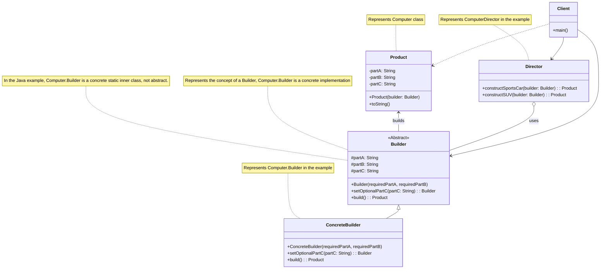

---
### 5. 原型模式 (Prototype Pattern)

**特点（关键字）：** 克隆创建对象、避免重复初始化、提高性能、深拷贝与浅拷贝。

**使用场景：**
- 当一个对象的创建过程非常昂贵（例如，需要大量计算、IO操作或网络请求）时，通过复制现有实例来创建新实例可以显著提高性能。
- 当需要一个对象与现有对象只有一些状态不同，而其他状态都相同时。
- 当一个系统应该独立于它的产品创建、构成和表示时，并且你想动态地指定要创建的对象类型时（通过复制原型）。
- 当需要创建的对象数目较大，或者创建过程比较繁琐时。
- 例如：细胞分裂（一个细胞复制自己）、游戏中复制敌人或道具、复杂报表的复制和修改。

**示例代码 (Java)：**
原型模式通常需要实现 `Cloneable` 接口并重写 `clone()` 方法。需要注意深拷贝和浅拷贝的问题。

```java
/**
 * 抽象原型类 (Prototype)
 * 通常声明一个克隆自身的接口。
 * 在Java中，可以实现 Cloneable 接口并重写 clone() 方法。
 */
abstract class Shape implements Cloneable {
    private String id;
    protected String type;

    abstract void draw();

    public String getType() {
        return type;
    }

    public String getId() {
        return id;
    }

    public void setId(String id) {
        this.id = id;
    }

    /**
     * 重写 clone 方法。
     * Object类的clone()方法是protected的，并且可能抛出CloneNotSupportedException。
     * @return 克隆出的对象
     */
    @Override
    public Object clone() {
        Object clone = null;
        try {
            // 调用父类的clone()方法进行浅拷贝
            clone = super.clone();
            System.out.println("Shape (ID: " + this.id + ", Type: " + this.type + ") 正在被克隆...");
        } catch (CloneNotSupportedException e) {
            // 当类没有实现Cloneable接口时，会抛出此异常
            // 但由于Shape实现了Cloneable，理论上这里不会执行
            System.err.println("克隆失败: " + e.getMessage());
            e.printStackTrace();
        }
        return clone;
    }
}

/**
 * 具体原型类 - 圆形 (ConcretePrototype)
 */
class Circle extends Shape {
    private int radius;

    public Circle(String id, int radius) {
        this.setId(id);
        this.type = "Circle";
        this.radius = radius;
        System.out.println("创建了一个新的 Circle (ID: " + id + ", Radius: " + radius + ")");
    }

    // 如果Circle有引用类型的成员变量，需要考虑深拷贝
    // 例如，如果有一个 Point center 对象，那么在clone方法中需要对center也进行clone
    // private Point center;
    // public Circle(String id, int radius, Point center) { ... this.center = center; }
    // @Override public Object clone() {
    //     Circle clonedCircle = (Circle) super.clone();
    //     clonedCircle.center = (Point) this.center.clone(); // 深拷贝Point对象
    //     return clonedCircle;
    // }


    @Override
    void draw() {
        System.out.println("绘制圆形 (ID: " + getId() + "), 半径: " + radius);
    }

    public int getRadius() {
        return radius;
    }

    public void setRadius(int radius) {
        this.radius = radius;
        System.out.println("Circle (ID: " + getId() + ") 半径更新为: " + radius);
    }
}

/**
 * 具体原型类 - 矩形 (ConcretePrototype)
 */
class Rectangle extends Shape {
    private int width;
    private int height;

    public Rectangle(String id, int width, int height) {
        this.setId(id);
        this.type = "Rectangle";
        this.width = width;
        this.height = height;
        System.out.println("创建了一个新的 Rectangle (ID: " + id + ", Width: " + width + ", Height: " + height + ")");
    }

    @Override
    void draw() {
        System.out.println("绘制矩形 (ID: " + getId() + "), 宽: " + width + ", 高: " + height);
    }

    public int getWidth() {
        return width;
    }

    public void setWidth(int width) {
        this.width = width;
    }

    public int getHeight() {
        return height;
    }

    public void setHeight(int height) {
        this.height = height;
    }
}

/**
 * 原型管理器/注册表 (PrototypeManager/Registry) - 可选
 * 用于存储和检索原型实例。
 */
class ShapeCache {
    private static java.util.Hashtable<String, Shape> shapeMap = new java.util.Hashtable<>();

    public static Shape getShape(String shapeId) {
        Shape cachedShape = shapeMap.get(shapeId);
        if (cachedShape != null) {
            System.out.println("从缓存中获取原型 (ID: " + shapeId + ")");
            // 克隆缓存中的原型实例
            return (Shape) cachedShape.clone();
        }
        System.out.println("缓存中未找到原型 (ID: " + shapeId + "), 返回 null 或进行其他处理");
        return null; // 或者根据shapeId动态创建并缓存
    }

    // 加载初始原型到缓存
    public static void loadCache() {
        System.out.println("开始加载原型到缓存...");
        Circle circle = new Circle("circle_prototype_001", 10);
        shapeMap.put(circle.getId(), circle);
        System.out.println("原型 " + circle.getType() + " (ID: " + circle.getId() + ") 已加载到缓存");

        Rectangle rectangle = new Rectangle("rect_prototype_002", 20, 30);
        shapeMap.put(rectangle.getId(), rectangle);
        System.out.println("原型 " + rectangle.getType() + " (ID: " + rectangle.getId() + ") 已加载到缓存");
        System.out.println("原型缓存加载完毕.\n");
    }
}

/**
 * 客户端代码
 */
public class PrototypeClient {
    public static void main(String[] args) {
        // 加载原型到缓存
        ShapeCache.loadCache();

        System.out.println("--- 从缓存克隆圆形 ---");
        Shape clonedCircle1 = ShapeCache.getShape("circle_prototype_001");
        if (clonedCircle1 != null) {
            clonedCircle1.setId("cloned_circle_101"); // 修改克隆实例的ID
            clonedCircle1.draw();
            // 如果是Circle的具体实例，可以进行类型转换并修改其特有属性
            if (clonedCircle1 instanceof Circle) {
                ((Circle) clonedCircle1).setRadius(15);
                System.out.println("克隆圆形的半径修改为: " + ((Circle) clonedCircle1).getRadius());
            }
        }

        System.out.println("\n--- 再次从缓存克隆圆形 (验证原型未被修改) ---");
        Shape clonedCircle2 = ShapeCache.getShape("circle_prototype_001");
        if (clonedCircle2 != null) {
            clonedCircle2.setId("cloned_circle_102");
            clonedCircle2.draw();
             if (clonedCircle2 instanceof Circle) {
                System.out.println("新克隆圆形的半径 (应为原型半径10): " + ((Circle) clonedCircle2).getRadius());
            }
        }


        System.out.println("\n--- 从缓存克隆矩形 ---");
        Shape clonedRectangle = ShapeCache.getShape("rect_prototype_002");
        if (clonedRectangle != null) {
            clonedRectangle.setId("cloned_rect_201");
            clonedRectangle.draw();
        }

        System.out.println("\n--- 验证原型和克隆对象是不同的实例 ---");
        Shape originalCircle = ShapeCache.getShape("circle_prototype_001"); // 这会再次克隆
        if (originalCircle != null && clonedCircle1 != null) {
            System.out.println("clonedCircle1 和 originalCircle (新克隆的) 是否是同一个对象? " + (clonedCircle1 == originalCircle));
            System.out.println("clonedCircle1 hashcode: " + clonedCircle1.hashCode());
            System.out.println("originalCircle (新克隆的) hashcode: " + originalCircle.hashCode());
        }

        // 直接使用原型进行克隆 (不通过缓存)
        System.out.println("\n--- 直接克隆一个新创建的圆形对象 (不通过缓存) ---");
        Circle originalDirectCircle = new Circle("direct_original_circle_301", 50);
        Circle clonedDirectCircle = (Circle) originalDirectCircle.clone();
        clonedDirectCircle.setId("direct_cloned_circle_302");
        clonedDirectCircle.setRadius(55);

        System.out.println("原始直接创建的圆形:");
        originalDirectCircle.draw();
        System.out.println("克隆后修改的圆形:");
        clonedDirectCircle.draw();
        System.out.println("直接创建的圆形和其克隆是否是同一个对象? " + (originalDirectCircle == clonedDirectCircle));

    }
}
```

**形象类比：**
想象你在用复印机复印文件：
1.  **原型 (Shape)**：你放在复印机上的原始文件（比如一份简历模板）。这份原始文件是可以被复制的（实现了 `Cloneable`）。
2.  **具体原型 (Circle, Rectangle)**：具体的原始文件类型，比如一份“圆形设计稿模板”或一份“矩形布局模板”。
3.  **`clone()` 方法**：复印机的“复印”按钮。按下按钮，就会得到一份和原件内容一样的新文件。
4.  **客户端 (PrototypeClient)**：需要复印件的人。
5.  **原型管理器 (ShapeCache - 可选)**：一个存放常用模板的文件夹。当你需要某种模板时，可以从文件夹里拿出原件去复印，而不是每次都重新制作一份模板。

当你需要多份简历时，你不会每次都从头打字写一份新的，而是拿一份写好的简历模板（原型）去复印（克隆），然后在复印件上修改一些个人信息（修改克隆对象的属性）。这样既快速又方便，而且保证了基本格式的一致性。

**深拷贝与浅拷贝的类比：**
*   **浅拷贝**：你复印了一份文件，这份文件里提到了“附件A在XX抽屉”。复印件也写着“附件A在XX抽屜”。原件和复印件共享同一个附件A。如果有人修改了抽屉里的附件A，那么原件和复印件都会受到影响。
*   **深拷贝**：你复印了一份文件，并且把文件里提到的“附件A”也复印了一份，然后把复印的附件A和复印的文件钉在一起。现在，原件和它自己的附件A是一套，复印件和它自己的附件A是另一套，两者互不影响。

**Mermaid 结构化说明：**

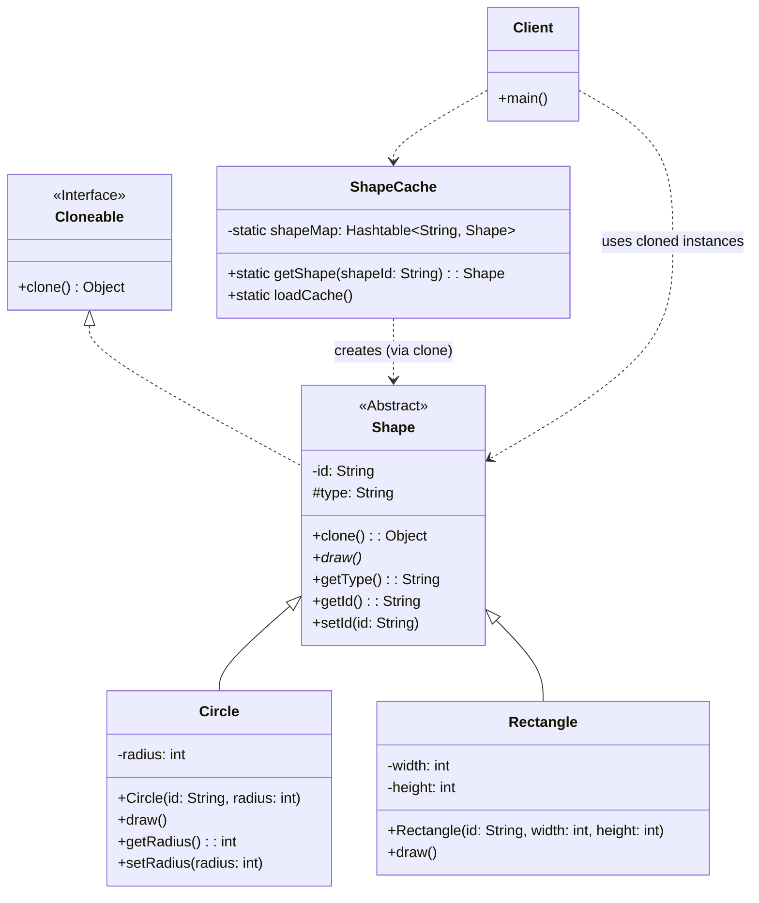

---

## 二、结构型模式 (Structural Patterns)

结构型模式关注类和对象的组合，通过继承、实现和组合等方式，将类或对象组合成更大的结构，使其更灵活、更高效。
### 6. 适配器模式 (Adapter Pattern)

**特点（关键字）：** 接口转换、兼容性、复用现有类、对象适配器、类适配器。

**使用场景：**
- 当你想使用一个已经存在的类，而它的接口不符合你的需求时。
- 当你想创建一个可以复用的类，该类可以与其他不相关的类或不可预见的类（即那些接口可能不一定兼容的类）协同工作时。
- （仅适用于对象适配器）当你想使用一些已经存在的子类，但是不可能对每一个都进行子类化以匹配它们的接口时。对象适配器可以适配它的父类接口。
- 例如：电源适配器（将不同国家的电压和插座标准转换）、读卡器（将SD卡、TF卡等不同存储卡的接口转换成USB接口）、在代码中使用第三方库，但其接口与现有系统不兼容。

**示例代码 (Java)：**

**类适配器模式示例：** (使用继承)

```java
/**
 * 目标接口 (Target)
 * 这是客户端期望使用的接口。
 */
interface MediaPlayer {
    void play(String audioType, String fileName);
}

/**
 * 被适配的类 (Adaptee)
 * 这是一个已经存在的接口，但它的接口与 MediaPlayer 不同。
 * 它有自己特定的播放方法。
 */
class AdvancedMediaPlayer {
    public void playMp4(String fileName) {
        System.out.println("播放 Mp4 文件: " + fileName);
    }

    public void playVlc(String fileName) {
        System.out.println("播放 Vlc 文件: " + fileName);
    }
}

/**
 * 类适配器 (Class Adapter)
 * 通过继承 Adaptee 类并实现 Target 接口来工作。
 * 这种方式下，Adapter 是 Adaptee 的一个子类。
 * Java 不支持多重继承，所以类适配器只能适配一个具体的 Adaptee 类。
 */
class MediaAdapterClassImpl extends AdvancedMediaPlayer implements MediaPlayer {

    @Override
    public void play(String audioType, String fileName) {
        System.out.println("类适配器: 尝试播放 " + audioType + " 类型文件 " + fileName);
        if (audioType.equalsIgnoreCase("mp4")) {
            playMp4(fileName); // 调用继承自AdvancedMediaPlayer的方法
        } else if (audioType.equalsIgnoreCase("vlc")) {
            playVlc(fileName); // 调用继承自AdvancedMediaPlayer的方法
        } else {
            System.out.println("不支持的媒体类型: " + audioType + " (在类适配器中)");
        }
    }
}

/**
 * 客户端代码 - 使用类适配器
 */
class AudioPlayerClassAdapterClient {
    MediaPlayer mediaPlayer;

    public AudioPlayerClassAdapterClient(MediaPlayer mediaPlayer) {
        this.mediaPlayer = mediaPlayer;
    }

    public void playMedia(String audioType, String fileName) {
        System.out.println("客户端(类适配器): 请求播放 " + audioType + " - " + fileName);
        mediaPlayer.play(audioType, fileName);
    }
}
```

**对象适配器模式示例：** (使用组合)

```java
/**
 * 目标接口 (Target) - 复用上面的 MediaPlayer 接口
 */
// interface MediaPlayer {
//     void play(String audioType, String fileName);
// }

/**
 * 被适配的类 (Adaptee) - 复用上面的 AdvancedMediaPlayer 类
 */
// class AdvancedMediaPlayer {
//     public void playMp4(String fileName) { System.out.println("Playing mp4 file. Name: "+ fileName); }
//     public void playVlc(String fileName) { System.out.println("Playing vlc file. Name: "+ fileName); }
// }

/**
 * 具体播放器 (Concrete Player implementing Target)
 * 这是一个实现了目标接口的类，它可以直接播放某些格式。
 */
class DefaultAudioPlayer implements MediaPlayer {
    @Override
    public void play(String audioType, String fileName) {
        if (audioType.equalsIgnoreCase("mp3")) {
            System.out.println("默认播放器: 播放 Mp3 文件: " + fileName);
        } else {
            System.out.println("默认播放器: 不支持的媒体类型 " + audioType + ". 需要适配器。");
        }
    }
}


/**
 * 对象适配器 (Object Adapter)
 * 通过组合（持有一个 Adaptee 的实例）并实现 Target 接口来工作。
 * 这是更灵活的方式，因为 Adapter 可以适配 Adaptee 及其所有子类。
 */
class MediaAdapterObjectImpl implements MediaPlayer {
    AdvancedMediaPlayer advancedMusicPlayer; // 持有被适配者的引用

    public MediaAdapterObjectImpl(String audioType) {
        // 根据音频类型创建合适的被适配者实例
        // 实际场景中，这里可能会更复杂，比如通过工厂创建
        if (audioType.equalsIgnoreCase("mp4") || audioType.equalsIgnoreCase("vlc")) {
            this.advancedMusicPlayer = new AdvancedMediaPlayer();
            System.out.println("对象适配器: 为 " + audioType + " 创建了 AdvancedMediaPlayer 实例");
        } else {
            System.out.println("对象适配器: " + audioType + " 类型不需要 AdvancedMediaPlayer");
        }
    }

    @Override
    public void play(String audioType, String fileName) {
        System.out.println("对象适配器: 尝试播放 " + audioType + " 类型文件 " + fileName);
        if (advancedMusicPlayer != null) {
            if (audioType.equalsIgnoreCase("mp4")) {
                advancedMusicPlayer.playMp4(fileName);
            } else if (audioType.equalsIgnoreCase("vlc")) {
                advancedMusicPlayer.playVlc(fileName);
            }
        } else {
             System.out.println("对象适配器: 没有合适的播放器处理 " + audioType + " 类型文件 " + fileName);
        }
    }
}

/**
 * 客户端使用的播放器，它会根据情况使用默认播放器或适配器
 */
class UniversalAudioPlayer implements MediaPlayer {
    MediaPlayer adapter; // 可以是默认播放器，也可以是适配器

    @Override
    public void play(String audioType, String fileName) {
        System.out.println("通用播放器: 接收到播放请求 " + audioType + " - " + fileName);
        if (audioType.equalsIgnoreCase("mp3")) {
            // 直接使用默认播放器
            new DefaultAudioPlayer().play(audioType, fileName);
        }
        // 对于其他格式，使用适配器
        else if (audioType.equalsIgnoreCase("mp4") || audioType.equalsIgnoreCase("vlc")) {
            System.out.println("通用播放器: 检测到 " + audioType + ", 需要使用适配器。");
            adapter = new MediaAdapterObjectImpl(audioType); // 创建对象适配器
            adapter.play(audioType, fileName);
        } else {
            System.out.println("通用播放器: 不支持的媒体类型 " + audioType);
        }
    }
}


/**
 * 客户端代码 - 使用对象适配器
 */
public class AdapterClient {
    public static void main(String[] args) {
        System.out.println("--- 演示对象适配器 ---");
        UniversalAudioPlayer universalPlayer = new UniversalAudioPlayer();

        universalPlayer.play("mp3", "beyond the horizon.mp3");
        universalPlayer.play("mp4", "alone.mp4");
        universalPlayer.play("vlc", "far far away.vlc");
        universalPlayer.play("avi", "mind me.avi");

        System.out.println("\n--- 演示类适配器 ---");
        // 注意：类适配器直接实现了MediaPlayer，并且继承了AdvancedMediaPlayer
        MediaPlayer classAdapter = new MediaAdapterClassImpl();
        AudioPlayerClassAdapterClient classAdapterClient = new AudioPlayerClassAdapterClient(classAdapter);
        classAdapterClient.playMedia("mp4", "another_movie.mp4");
        classAdapterClient.playMedia("vlc", "another_show.vlc");
        classAdapterClient.playMedia("mp3", "another_song.mp3"); // 类适配器未处理mp3
    }
}
```

**形象类比：**
*   **电源适配器**：你的笔记本电脑需要特定电压（目标接口 `MediaPlayer`），但墙上的插座提供的是另一种电压和插口形状（被适配者 `AdvancedMediaPlayer`）。电源适配器（`MediaAdapter`）就是那个中间件，它将墙上插座的电转换成笔记本电脑能接受的电，使得笔记本电脑可以在不同的电源环境下工作。
*   **翻译官**：你想和一个只说西班牙语的人（被适配者 `AdvancedMediaPlayer`）交流，但你只说中文（客户端期望的接口 `MediaPlayer`）。翻译官（`MediaAdapter`）就是适配器，他能听懂西班牙语，并将其翻译成中文给你；也能听懂你的中文，并将其翻译成西班牙语给对方。这样你们就能顺利沟通了。

**类适配器 vs 对象适配器类比：**
*   **类适配器**：你为了能和西班牙人交流，自己去学了西班牙语，并且还能说中文。你本人（适配器）既是“中国人”（继承了中国人的特性，能说中文 - 实现目标接口），又是“会说西班牙语的人”（继承了西班牙语能力 - 继承被适配类）。缺点是你一次只能精通一种外语（单继承）。
*   **对象适配器**：你雇佣了一个翻译（适配器）。这个翻译（适配器）内部有一个西班牙语专家（持有被适配者实例）。你想和西班牙人交流时，就通过这个翻译。这个翻译更灵活，如果需要和其他语言的人交流，你可以换掉内部的语言专家（可以适配不同的被适配者实例或其子类）。

**Mermaid 结构化说明：**

**类适配器 (Class Adapter):**
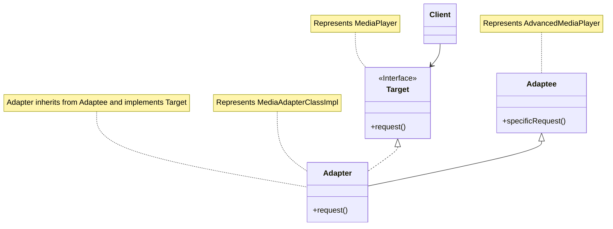

**对象适配器 (Object Adapter):**
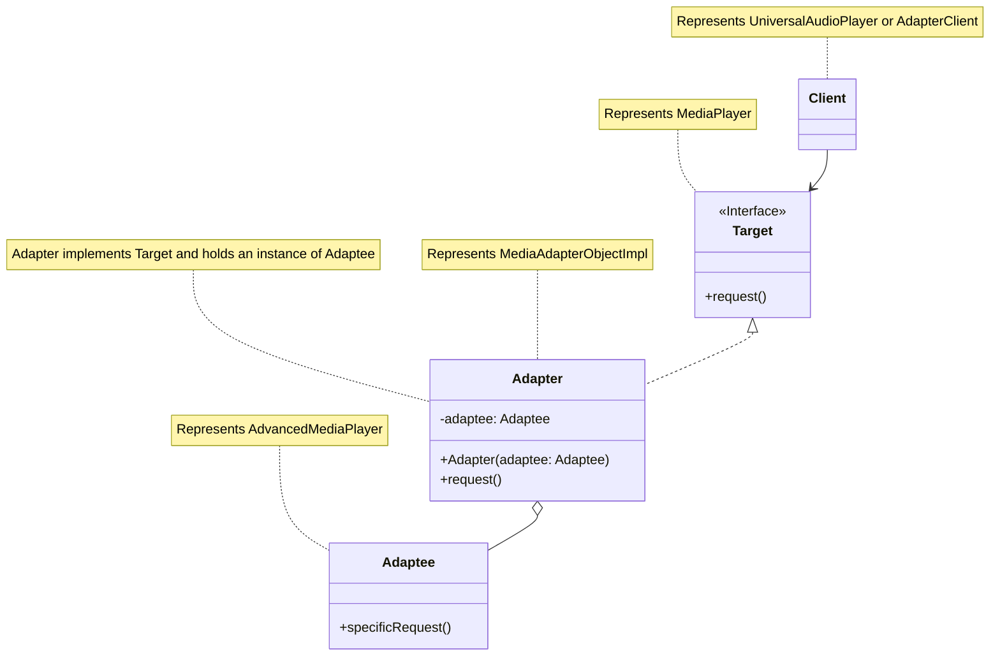

---
### 7. 桥接模式 (Bridge Pattern)

**特点（关键字）：** 解耦抽象与实现、独立变化、组合优于继承、多维度变化。

**使用场景：**
- 当一个类存在两个或多个独立变化的维度，而你希望能够分别扩展这些维度时。
- 当你不想在抽象和它的实现部分之间形成固定的绑定关系时。例如，当需要在运行时选择或切换实现。
- 当对一个抽象的实现部分的修改不应该影响到客户代码时。
- （仅适用于C++）当你想完全隐藏抽象的实现部分时。
- 当类的继承层次结构过于复杂，导致子类数量庞大时，可以考虑使用桥接模式来减少子类的数量。
- 例如：不同类型的遥控器（抽象）控制不同品牌的电视机（实现）、不同形状的图形（抽象）使用不同的颜色绘制（实现）、操作系统（抽象）与设备驱动（实现）的分离。

**示例代码 (Java)：**

```java
/**
 * 实现部分接口 (Implementor)
 * 定义了实现类所必须实现的接口。这个接口不一定和 Abstraction 的接口完全一致。
 * 事实上，这两个接口可以完全不同。一般来讲，Implementor 接口仅提供基本操作，
 * 而 Abstraction 则定义了基于这些基本操作的较高层次的操作。
 */
interface DrawAPI {
    void drawCircle(int radius, int x, int y);
    void drawRectangle(int width, int height, int x, int y); // 新增一个绘制矩形的方法用于演示
}

/**
 * 具体实现A (ConcreteImplementorA)
 * 实现 Implementor 接口并定义它的具体实现。
 */
class RedCircleDrawAPI implements DrawAPI {
    @Override
    public void drawCircle(int radius, int x, int y) {
        System.out.println("用红色画笔绘制圆形: 半径=" + radius + ", 中心点=(" + x + "," + y + ")");
    }

    @Override
    public void drawRectangle(int width, int height, int x, int y) {
        // RedCircleDrawAPI 专注于圆形，但为了完整实现接口，提供一个默认或简单实现
        System.out.println("用红色画笔绘制矩形: 宽=" + width + ", 高=" + height + ", 左上角=(" + x + "," + y + ")");
    }
}

/**
 * 具体实现B (ConcreteImplementorB)
 */
class GreenPenDrawAPI implements DrawAPI {
    @Override
    public void drawCircle(int radius, int x, int y) {
        System.out.println("用绿色画笔绘制圆形: 半径=" + radius + ", 中心点=(" + x + "," + y + ")");
    }
    @Override
    public void drawRectangle(int width, int height, int x, int y) {
        System.out.println("用绿色画笔绘制矩形: 宽=" + width + ", 高=" + height + ", 左上角=(" + x + "," + y + ")");
    }
}

/**
 * 抽象部分 (Abstraction)
 * 定义了抽象类的接口。
 * 维护一个指向 Implementor 类型对象的引用。
 */
abstract class ShapeBridge {
    protected DrawAPI drawAPI; // 持有实现部分的引用

    protected ShapeBridge(DrawAPI drawAPI) {
        this.drawAPI = drawAPI;
        System.out.println("ShapeBridge: 初始化，使用的绘制API是 " + drawAPI.getClass().getSimpleName());
    }

    // 抽象方法，由子类实现
    public abstract void draw();
    public abstract void resize(float factor); // 新增一个调整大小的方法
}

/**
 * 扩充抽象部分 (RefinedAbstraction)
 * 扩展由 Abstraction 定义的接口。
 */
class CircleBridge extends ShapeBridge {
    private int x, y, radius;

    public CircleBridge(int x, int y, int radius, DrawAPI drawAPI) {
        super(drawAPI); // 调用父类构造函数，传入具体的DrawAPI实例
        this.x = x;
        this.y = y;
        this.radius = radius;
        System.out.println("CircleBridge: 创建圆形，中心点=(" + x + "," + y + "), 半径=" + radius);
    }

    @Override
    public void draw() {
        System.out.println("CircleBridge: 请求绘制圆形...");
        drawAPI.drawCircle(radius, x, y); // 调用实现部分的具体绘制方法
    }

    @Override
    public void resize(float factor) {
        int oldRadius = this.radius;
        this.radius = (int) (this.radius * factor);
        System.out.println("CircleBridge: 圆形半径从 " + oldRadius + " 调整为 " + this.radius + " (因子: " + factor + ")");
    }
}

class RectangleBridge extends ShapeBridge {
    private int x, y, width, height;

    public RectangleBridge(int x, int y, int width, int height, DrawAPI drawAPI) {
        super(drawAPI);
        this.x = x;
        this.y = y;
        this.width = width;
        this.height = height;
        System.out.println("RectangleBridge: 创建矩形，左上角=(" + x + "," + y + "), 宽=" + width + ", 高=" + height);
    }

    @Override
    public void draw() {
        System.out.println("RectangleBridge: 请求绘制矩形...");
        drawAPI.drawRectangle(width, height, x, y);
    }

    @Override
    public void resize(float factor) {
        int oldWidth = this.width;
        int oldHeight = this.height;
        this.width = (int) (this.width * factor);
        this.height = (int) (this.height * factor);
        System.out.println("RectangleBridge: 矩形尺寸从 " + oldWidth + "x" + oldHeight + " 调整为 " + this.width + "x" + this.height + " (因子: " + factor + ")");
    }
}


/**
 * 客户端代码
 */
public class BridgeClient {
    public static void main(String[] args) {
        System.out.println("--- 创建一个红色的圆形 ---");
        ShapeBridge redCircle = new CircleBridge(100, 100, 10, new RedCircleDrawAPI());
        redCircle.draw();
        redCircle.resize(2.0f);
        redCircle.draw();

        System.out.println("\n--- 创建一个绿色的圆形 ---");
        ShapeBridge greenCircle = new CircleBridge(50, 50, 5, new GreenPenDrawAPI());
        greenCircle.draw();
        greenCircle.resize(0.5f);
        greenCircle.draw();

        System.out.println("\n--- 创建一个红色的矩形 ---");
        // 注意：RedCircleDrawAPI 对 drawRectangle 的实现可能很简单
        ShapeBridge redRectangle = new RectangleBridge(10, 20, 30, 40, new RedCircleDrawAPI());
        redRectangle.draw();
        redRectangle.resize(1.5f);
        redRectangle.draw();

        System.out.println("\n--- 创建一个绿色的矩形 ---");
        ShapeBridge greenRectangle = new RectangleBridge(5, 15, 25, 35, new GreenPenDrawAPI());
        greenRectangle.draw();
        greenRectangle.resize(3.0f);
        greenRectangle.draw();
    }
}
```

**形象类比：**
想象你有不同类型的“遥控器”（抽象部分 `ShapeBridge`）和不同品牌的“电视机”（实现部分 `DrawAPI`）。
*   **遥控器 (Abstraction)**：可以是“基本遥控器”（只有开关和换台功能）或“智能遥控器”（有上网、点播等高级功能）。这些是 `ShapeBridge` 的子类，如 `CircleBridge`, `RectangleBridge`（这里比喻为不同功能的遥控器或针对不同设备优化的遥控器）。
*   **电视机 (Implementor)**：可以是“索尼电视”、“三星电视”、“小米电视”等。这些是 `DrawAPI` 的具体实现，如 `RedCircleDrawAPI`, `GreenPenDrawAPI`（这里比喻为不同品牌的电视机，它们有各自的开关、换台的具体实现方式）。

桥接模式的作用就像一个万能的连接线（桥），它允许你将任何一个遥控器（抽象）与任何一个品牌的电视机（实现）连接起来。
- 你可以用“智能遥控器”控制“索尼电视”。
- 你也可以用“智能遥控器”控制“三星电视”。
- 你可以用“基本遥控器”控制“索尼电视”。

遥控器的种类（抽象维度）和电视机的品牌（实现维度）可以独立地增加和变化，而不会互相影响。例如，新增一种“语音遥控器”，或者新增一个“LG电视”品牌，都不需要修改已有的遥控器或电视机代码，只需要新增对应的类即可。这种方式避免了为每一种遥控器和每一种电视机的组合都创建一个特定的子类（如“索尼智能遥控器”、“三星基本遥控器”），从而大大减少了类的数量。

**Mermaid 结构化说明：**

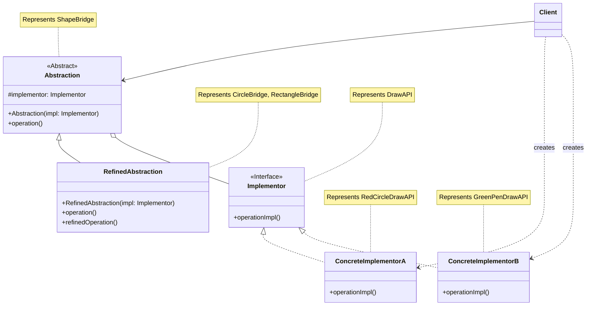

---
### 8. 组合模式 (Composite Pattern)

**特点（关键字）：** 树形结构、统一操作、部分-整体层次、透明性、安全性。

**使用场景：**
- 当你想表示对象的部分-整体层次结构时（树形结构）。
- 当你希望用户可以忽略组合对象与单个对象的不同，统一地使用组合结构中的所有对象时。
- 当需求中是体现部分与整体的层次结构时，以及你希望用户可以忽略组合对象与单个对象的不同，统一地使用组合结构中的所有对象时。
- 例如：文件系统（文件和文件夹）、图形界面中的容器和控件、公司组织架构（部门和员工）。

**示例代码 (Java)：**

```java
import java.util.ArrayList;
import java.util.List;

/**
 * 组件接口 (Component)
 * 为组合中的对象声明接口。
 * 实现所有类共有的接口的默认行为。
 * 声明一个接口用于访问和管理 Component 的子组件 (可选，取决于透明性 vs 安全性)。
 */
interface Graphic {
    void print(String indent); // 打印图形（可能是单个图形或组合图形）
    void add(Graphic graphic); // 添加子图形 (叶子节点通常不支持或为空实现)
    void remove(Graphic graphic); // 移除子图形 (叶子节点通常不支持或为空实现)
    Graphic getChild(int i); // 获取子图形 (叶子节点通常不支持或为空实现)
    String getName(); // 获取图形名称
}

/**
 * 叶子节点 (Leaf)
 * 在组合中表示叶节点对象，叶节点没有子节点。
 * 在组合中定义图元对象的行为。
 */
class Dot implements Graphic {
    private String name;
    private int x, y;

    public Dot(String name, int x, int y) {
        this.name = name;
        this.x = x;
        this.y = y;
        System.out.println("创建点: " + name + " at (" + x + "," + y + ")");
    }

    @Override
    public String getName() {
        return name;
    }

    @Override
    public void print(String indent) {
        System.out.println(indent + "点: " + name + " (" + x + "," + y + ")");
    }

    // 叶子节点不支持管理子节点的操作
    @Override
    public void add(Graphic graphic) {
        System.out.println("错误: 点对象 (" + name + ") 不能添加子图形。");
    }

    @Override
    public void remove(Graphic graphic) {
        System.out.println("错误: 点对象 (" + name + ") 不能移除子图形。");
    }

    @Override
    public Graphic getChild(int i) {
        System.out.println("错误: 点对象 (" + name + ") 没有子图形。");
        return null;
    }
}

class Line implements Graphic {
    private String name;
    private int x1, y1, x2, y2;

    public Line(String name, int x1, int y1, int x2, int y2) {
        this.name = name;
        this.x1 = x1;
        this.y1 = y1;
        this.x2 = x2;
        this.y2 = y2;
        System.out.println("创建线: " + name + " from (" + x1 + "," + y1 + ") to (" + x2 + "," + y2 + ")");
    }

    @Override
    public String getName() {
        return name;
    }

    @Override
    public void print(String indent) {
        System.out.println(indent + "线: " + name + " [(" + x1 + "," + y1 + ")-(" + x2 + "," + y2 + ")]");
    }

    @Override
    public void add(Graphic graphic) {
        System.out.println("错误: 线对象 (" + name + ") 不能添加子图形。");
    }

    @Override
    public void remove(Graphic graphic) {
        System.out.println("错误: 线对象 (" + name + ") 不能移除子图形。");
    }

    @Override
    public Graphic getChild(int i) {
        System.out.println("错误: 线对象 (" + name + ") 没有子图形。");
        return null;
    }
}


/**
 * 组合节点 (Composite)
 * 定义有子部件的那些部件的行为。
 * 存储子部件。
 * 在 Component 接口中实现与子部件有关的操作。
 */
class CompoundGraphic implements Graphic {
    private String name;
    private List<Graphic> children = new ArrayList<>();

    public CompoundGraphic(String name) {
        this.name = name;
        System.out.println("创建复合图形: " + name);
    }

    @Override
    public String getName() {
        return name;
    }

    @Override
    public void add(Graphic graphic) {
        children.add(graphic);
        System.out.println("复合图形 '" + name + "': 添加了子图形 '" + graphic.getName() + "'");
    }

    @Override
    public void remove(Graphic graphic) {
        if (children.remove(graphic)) {
            System.out.println("复合图形 '" + name + "': 移除了子图形 '" + graphic.getName() + "'");
        } else {
            System.out.println("复合图形 '" + name + "': 未找到要移除的子图形 '" + graphic.getName() + "'");
        }
    }

    @Override
    public Graphic getChild(int i) {
        if (i >= 0 && i < children.size()) {
            return children.get(i);
        }
        System.out.println("复合图形 '" + name + "': 索引 " + i + " 超出子图形范围。");
        return null;
    }

    @Override
    public void print(String indent) {
        System.out.println(indent + "复合图形: " + name + " {");
        for (Graphic graphic : children) {
            graphic.print(indent + "  "); // 对每个子组件递归调用print方法
        }
        System.out.println(indent + "}");
    }
}

/**
 * 客户端代码
 */
public class CompositeClient {
    public static void main(String[] args) {
        System.out.println("--- 创建基本图形 ---");
        Graphic dot1 = new Dot("Dot1", 10, 10);
        Graphic line1 = new Line("Line1", 20, 20, 100, 100);
        Graphic dot2 = new Dot("Dot2", 50, 50);

        System.out.println("\n--- 创建一个简单的复合图形 (group1) ---");
        CompoundGraphic group1 = new CompoundGraphic("Group1");
        group1.add(dot1);
        group1.add(line1);

        System.out.println("\n--- 打印 group1 ---");
        group1.print("");

        System.out.println("\n--- 创建另一个复合图形 (group2)，包含 group1 和其他基本图形 ---");
        CompoundGraphic group2 = new CompoundGraphic("Group2 (Main Picture)");
        group2.add(group1); // 将 group1 作为 group2 的子节点
        group2.add(dot2);
        Graphic line2 = new Line("Line2", 0, 0, 5, 5);
        group2.add(line2);

        System.out.println("\n--- 打印 group2 (整个图形结构) ---");
        group2.print("");

        System.out.println("\n--- 从 group1 中移除一个图形 ---");
        group1.remove(dot1);
        System.out.println("\n--- 再次打印 group2 (查看变化) ---");
        group2.print("");

        System.out.println("\n--- 尝试在叶子节点上执行组合操作 ---");
        dot2.add(new Dot("Dot3", 0,0)); // 会输出错误信息
        Graphic child = dot2.getChild(0); // 会输出错误信息

        System.out.println("\n--- 获取 group2 的子节点 ---");
        Graphic firstChildOfGroup2 = group2.getChild(0);
        if (firstChildOfGroup2 != null) {
            System.out.println("Group2的第一个子节点是: " + firstChildOfGroup2.getName());
            if (firstChildOfGroup2 instanceof CompoundGraphic) {
                System.out.println("它是一个复合图形。");
            }
        }
    }
}
```

**形象类比：**
*   **公司组织架构**：
    *   **组件 (Graphic)**：可以是“员工”或“部门”的抽象，它们都有一个共同的操作，比如“获取汇报线路”或“计算薪资总额”。
    *   **叶子节点 (Dot, Line)**：代表单个员工。员工下面没有其他员工或部门。
    *   **组合节点 (CompoundGraphic)**：代表部门。一个部门可以包含多个员工（叶子节点），也可以包含其他子部门（组合节点）。
    当你需要计算整个公司的薪资总额时，你只需要对根节点（CEO所在的顶级部门或整个公司）调用“计算薪资总额”的操作。这个操作会自动递归地传递到所有子部门和员工，最终汇总结果。客户端不需要区分是在和单个员工打交道还是和整个部门打交道，都可以使用统一的接口。

*   **电脑文件夹系统**：
    *   **组件 (Graphic)**：文件或文件夹的抽象，都有“显示名称”、“计算大小”等操作。
    *   **叶子节点 (Dot, Line - 比喻为文件)**：代表单个文件。文件不能包含其他文件或文件夹。
    *   **组合节点 (CompoundGraphic - 比喻为文件夹)**：代表文件夹。文件夹可以包含多个文件（叶子节点），也可以包含其他子文件夹（组合节点）。
    当你计算一个文件夹的大小时，系统会自动计算该文件夹下所有文件和子文件夹的大小，然后加起来。

**透明性 vs 安全性：**
*   **透明方式**：在组件接口中声明所有管理子对象的方法（如`add`, `remove`, `getChild`）。这样客户端可以统一对待所有组件，但叶子节点需要对这些方法提供空实现或抛出异常，这可能不安全。
*   **安全方式**：只在组合节点类中声明管理子对象的方法。这样客户端在调用这些方法前需要判断对象类型，不够透明，但更安全，因为叶子节点根本没有这些方法。
示例代码中采用了偏向透明的方式，但在叶子节点中打印了错误提示。

**Mermaid 结构化说明：**

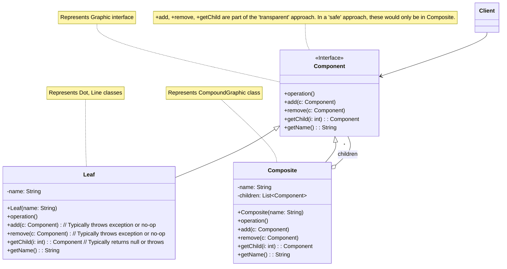

---
### 9. 装饰器模式 (Decorator Pattern)

**特点（关键字）：** 动态添加职责、透明包裹、运行时扩展、继承的替代方案、IO流。

**使用场景：**
- 在不想增加很多子类的情况下，扩展一个类的功能。
- 动态地给一个对象添加一些额外的职责。就增加功能来说，装饰器模式相比生成子类更为灵活。
- 当需要为对象添加一些临时的、可组合的功能时。
- 例如：Java IO 中的 `BufferedInputStream` 包装 `FileInputStream` 来增加缓冲功能、图形界面中给组件添加边框或滚动条、给咖啡添加牛奶或糖。

**示例代码 (Java)：**

```java
/**
 * 组件接口 (Component)
 * 定义了可以被装饰器动态添加功能的对象接口。
 */
interface Coffee {
    String getDescription(); // 获取咖啡描述
    double getCost();        // 获取咖啡价格
}

/**
 * 具体组件 (ConcreteComponent)
 * 实现 Component 接口，是被装饰的基础对象。
 */
class SimpleCoffee implements Coffee {
    public SimpleCoffee() {
        System.out.println("制作了一杯简单咖啡。");
    }

    @Override
    public String getDescription() {
        return "简单咖啡";
    }

    @Override
    public double getCost() {
        return 10.0; // 基础价格
    }
}

/**
 * 抽象装饰器 (Decorator)
 * 继承自 Component (或者实现相同的接口)，并持有一个 Component 对象的引用。
 * 它的接口与 Component 的接口一致，以便透明地包裹 Component 对象。
 */
abstract class CoffeeDecorator implements Coffee {
    protected Coffee decoratedCoffee; // 被包裹的咖啡对象

    public CoffeeDecorator(Coffee coffee) {
        this.decoratedCoffee = coffee;
        System.out.println("应用装饰器: " + this.getClass().getSimpleName() + " 到 " + coffee.getDescription());
    }

    @Override
    public String getDescription() {
        return decoratedCoffee.getDescription(); // 默认行为是调用被包裹对象的描述
    }

    @Override
    public double getCost() {
        return decoratedCoffee.getCost(); // 默认行为是调用被包裹对象的成本
    }
}

/**
 * 具体装饰器A (ConcreteDecoratorA) - 加牛奶
 * 向组件添加新的职责。
 */
class MilkDecorator extends CoffeeDecorator {
    public MilkDecorator(Coffee coffee) {
        super(coffee);
    }

    @Override
    public String getDescription() {
        return super.getDescription() + ", 加牛奶"; // 在原有描述基础上添加
    }

    @Override
    public double getCost() {
        return super.getCost() + 2.0; // 在原有价格基础上增加牛奶的价格
    }
}

/**
 * 具体装饰器B (ConcreteDecoratorB) - 加糖
 */
class SugarDecorator extends CoffeeDecorator {
    public SugarDecorator(Coffee coffee) {
        super(coffee);
    }

    @Override
    public String getDescription() {
        return super.getDescription() + ", 加糖";
    }

    @Override
    public double getCost() {
        return super.getCost() + 1.0;
    }
}

/**
 * 具体装饰器C (ConcreteDecoratorC) - 加奶油
 */
class CreamDecorator extends CoffeeDecorator {
    public CreamDecorator(Coffee coffee) {
        super(coffee);
    }

    @Override
    public String getDescription() {
        return super.getDescription() + ", 加奶油";
    }

    @Override
    public double getCost() {
        return super.getCost() + 3.5;
    }
}


/**
 * 客户端代码
 */
public class DecoratorClient {
    public static void main(String[] args) {
        System.out.println("--- 点一杯简单咖啡 ---");
        Coffee coffee = new SimpleCoffee();
        System.out.println("描述: " + coffee.getDescription());
        System.out.println("价格: $" + coffee.getCost());

        System.out.println("\n--- 点一杯加牛奶的咖啡 ---");
        Coffee milkCoffee = new MilkDecorator(new SimpleCoffee());
        System.out.println("描述: " + milkCoffee.getDescription());
        System.out.println("价格: $" + milkCoffee.getCost());

        System.out.println("\n--- 点一杯加牛奶和糖的咖啡 ---");
        // 多层包裹：SimpleCoffee -> MilkDecorator -> SugarDecorator
        Coffee milkAndSugarCoffee = new SugarDecorator(new MilkDecorator(new SimpleCoffee()));
        System.out.println("描述: " + milkAndSugarCoffee.getDescription());
        System.out.println("价格: $" + milkAndSugarCoffee.getCost());

        System.out.println("\n--- 点一杯加牛奶、糖和奶油的咖啡 ---");
        Coffee fancyCoffee = new CreamDecorator(new SugarDecorator(new MilkDecorator(new SimpleCoffee())));
        System.out.println("描述: " + fancyCoffee.getDescription());
        System.out.println("价格: $" + fancyCoffee.getCost());

        System.out.println("\n--- 点一杯只加糖的咖啡 ---");
        Coffee sugarCoffee = new SugarDecorator(new SimpleCoffee());
        System.out.println("描述: " + sugarCoffee.getDescription());
        System.out.println("价格: $" + sugarCoffee.getCost());

        System.out.println("\n--- 动态地给已有的咖啡对象添加装饰 ---");
        Coffee myCoffee = new SimpleCoffee();
        System.out.println("初始: " + myCoffee.getDescription() + ", $" + myCoffee.getCost());

        myCoffee = new MilkDecorator(myCoffee); // 加牛奶
        System.out.println("加牛奶后: " + myCoffee.getDescription() + ", $" + myCoffee.getCost());

        myCoffee = new SugarDecorator(myCoffee); // 再加糖
        System.out.println("再加糖后: " + myCoffee.getDescription() + ", $" + myCoffee.getCost());
    }
}
```

**形象类比：**
*   **给咖啡加调料**：
    *   **组件 (Coffee)**：一杯基础的“咖啡”。
    *   **具体组件 (SimpleCoffee)**：一杯“黑咖啡”。
    *   **抽象装饰器 (CoffeeDecorator)**：一个“调料杯”，它可以装咖啡，并且本身也像一杯咖啡。
    *   **具体装饰器 (MilkDecorator, SugarDecorator)**：具体的调料，如“牛奶”、“糖”。当你把“牛奶”这个调料（装饰器）加到“黑咖啡”（具体组件）上时，你得到的是一杯“加了牛奶的黑咖啡”。这杯新咖啡仍然是一杯咖啡（接口一致），但它有了新的特性（加了牛奶）和可能变化的价格。你可以继续往这杯“加了牛奶的黑咖啡”上加“糖”（再用糖装饰器包裹）。

*   **穿衣服**：
    *   **组件 (Person)**：一个人。
    *   **具体组件 (NakedPerson)**：一个没穿衣服的人。
    *   **抽象装饰器 (ClothesDecorator)**：衣服的统称，穿上后人还是人。
    *   **具体装饰器 (Shirt, Trousers, Coat)**：具体的衣物，如衬衫、裤子、外套。你可以先给人穿上衬衫（用Shirt装饰器包裹），然后再穿上外套（再用Coat装饰器包裹）。每穿一件衣服，人的外观（功能）就增加一些，但其本质还是一个人。

装饰器模式允许你像套娃一样，一层一层地给对象添加新的功能，而不需要修改对象本身的代码，也避免了因为各种功能组合而导致子类爆炸式增长。

**Mermaid 结构化说明：**

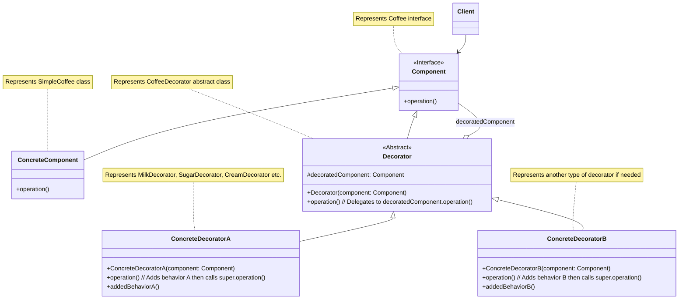

---
### 10. 外观模式 (Facade Pattern)

**特点（关键字）：** 简化接口、高层接口、解耦子系统、单一入口。

**使用场景：**
- 当你需要为一个复杂子系统提供一个简单接口时。外观可以提供一个简化的、高层次的接口，隐藏子系统的复杂性。
- 当客户端与多个子系统之间存在大量的依赖关系时。引入外观可以将客户端与子系统的具体实现解耦，降低耦合度。
- 当你需要构建一个层次化的子系统时，可使用外观模式定义子系统中每层的入口点。如果子系统之间是相互依赖的，你可以让它们仅通过外观进行通讯，从而简化它们之间的依赖关系。
- 例如：电脑开机（按下电源按钮，背后启动了CPU、内存、硬盘、操作系统等一系列复杂操作）、家庭影院一键控制（一个按钮控制DVD播放器、投影仪、音响、灯光等）、银行柜台（客户只需和柜员打交道，柜员内部处理存款、取款、转账等复杂流程）。

**示例代码 (Java)：**

```java
/**
 * 子系统组件 A
 */
class CPU {
    public void freeze() {
        System.out.println("CPU: 冻结程序计数器...");
    }

    public void jump(long position) {
        System.out.println("CPU: 跳转到内存地址 " + position);
    }

    public void execute() {
        System.out.println("CPU: 执行指令...");
    }

    public void stop() {
        System.out.println("CPU: 停止执行。");
    }
}

/**
 * 子系统组件 B
 */
class Memory {
    public void load(long position, byte[] data) {
        System.out.println("内存: 在地址 " + position + " 加载数据，数据大小: " + data.length + "字节");
        // 模拟数据加载
    }

    public void clear() {
        System.out.println("内存: 清理内存。");
    }
}

/**
 * 子系统组件 C
 */
class HardDrive {
    public byte[] read(long lba, int size) {
        System.out.println("硬盘: 从逻辑块地址 " + lba + " 读取 " + size + " 字节数据");
        return new byte[size]; // 模拟读取数据
    }

    public void write(long lba, byte[] data) {
        System.out.println("硬盘: 向逻辑块地址 " + lba + " 写入数据，数据大小: " + data.length + "字节");
    }
}

/**
 * 外观类 (Facade)
 * 为子系统中的一组接口提供一个统一的高层接口。
 * Facade 将客户端请求代理给适当的子系统对象。
 * Facade 知道哪个子系统负责处理请求。
 */
class ComputerFacade {
    private CPU processor;
    private Memory ram;
    private HardDrive hdd;

    public ComputerFacade() {
        this.processor = new CPU();
        this.ram = new Memory();
        this.hdd = new HardDrive();
        System.out.println("电脑外观: 初始化CPU, 内存, 硬盘。");
    }

    /**
     * 启动电脑的复杂流程被封装在此方法中
     */
    public void startComputer() {
        System.out.println("\n电脑外观: 开始启动电脑流程...");
        processor.freeze(); // 1. CPU准备
        byte[] bootData = hdd.read(0, 1024); // 2. 从硬盘读取引导扇区
        ram.load(0, bootData); // 3. 将引导数据加载到内存
        processor.jump(0); // 4. CPU跳转到引导地址
        processor.execute(); // 5. CPU开始执行引导程序
        System.out.println("电脑外观: 电脑启动完成！");
    }

    /**
     * 关闭电脑的简化接口
     */
    public void shutdownComputer() {
        System.out.println("\n电脑外观: 开始关闭电脑流程...");
        processor.stop();
        ram.clear();
        // 可能还有其他关闭步骤，如保存状态到硬盘等
        System.out.println("电脑外观: 电脑关闭完成！");
    }

    /**
     * 运行应用程序的简化接口
     * @param appName 应用程序名称
     */
    public void runApp(String appName) {
        System.out.println("\n电脑外观: 尝试运行应用程序 '" + appName + "'...");
        // 模拟加载和运行应用的复杂过程
        byte[] appData = hdd.read(10000, 2048); // 假设从硬盘读取应用数据
        ram.load(1024, appData); // 加载到内存的某个位置
        processor.jump(1024); // CPU跳转到应用起始地址
        processor.execute();
        System.out.println("电脑外观: 应用程序 '" + appName + "' 正在运行。");
    }
}

/**
 * 客户端代码
 */
public class FacadeClient {
    public static void main(String[] args) {
        // 客户端只需要与 ComputerFacade 交互，而不需要了解 CPU, Memory, HardDrive 的细节
        ComputerFacade computer = new ComputerFacade();

        // 启动电脑
        computer.startComputer();

        // 运行一个应用程序
        computer.runApp("MyAwesomeGame.exe");

        // 关闭电脑
        computer.shutdownComputer();

        // 如果没有Facade，客户端可能需要这样操作：
        // CPU cpu = new CPU();
        // Memory ram = new Memory();
        // HardDrive hdd = new HardDrive();
        // cpu.freeze();
        // byte[] data = hdd.read(0, 1024);
        // ram.load(0, data);
        // cpu.jump(0);
        // cpu.execute();
        // ... 非常复杂且容易出错
        System.out.println("\n客户端: 所有操作通过外观完成，无需关心内部复杂性。");
    }
}
```

**形象类比：**
*   **餐厅点餐**：
    *   **子系统 (CPU, Memory, HardDrive)**：餐厅的后厨，包括厨师、配菜员、洗碗工等，他们各自负责不同的工作环节。
    *   **外观 (ComputerFacade)**：餐厅的服务员。
    *   **客户端 (FacadeClient)**：顾客。
    顾客（客户端）想点餐时，只需要告诉服务员（外观）他要什么菜。服务员会去协调后厨的各个部分（子系统）来完成菜品的制作和上菜。顾客不需要直接和厨师、配菜员打交道，也不需要了解后厨的复杂运作流程。服务员提供了一个简单的接口，屏蔽了后厨的复杂性。

*   **公司前台/客服**：
    *   **子系统**：公司的各个部门，如技术部、销售部、财务部等。
    *   **外观**：公司的前台或客服热线。
    *   **客户端**：外部客户或合作伙伴。
    当客户有问题或需求时，他们通常联系前台或客服（外观）。前台/客服会根据客户的需求，将请求转达给公司内部相应的部门（子系统）处理。客户不需要知道具体是哪个部门在处理，也不需要了解公司内部的组织架构和工作流程。

外观模式提供了一个“单一窗口”，让客户端的交互变得简单直接。

**Mermaid 结构化说明：**

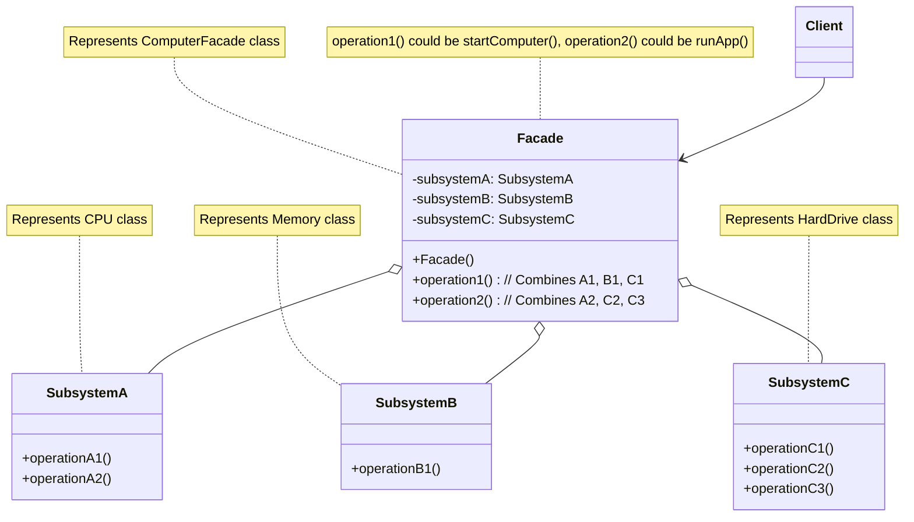

---
### 11. 享元模式 (Flyweight Pattern)

**特点（关键字）：** 共享对象、减少内存占用、细粒度对象、内部状态、外部状态。

**使用场景：**
- 当一个应用程序使用了大量的对象，而这些对象的大部分状态都可以外部化时。
- 当由于使用了大量对象，造成很大的存储开销时。
- 当对象的大多数状态可以变为外部状态，并且只有少数状态可以作为内部状态时。
- 当需要缓存大量相似对象以提高性能时。
- 例如：文本编辑器中的字符（每个字符的字形、大小是内部状态，位置是外部状态）、游戏中的粒子效果或大量重复的NPC（模型、纹理是内部状态，位置、朝向是外部状态）、数据库连接池中的连接对象。

**示例代码 (Java)：**

```java
import java.util.HashMap;
import java.util.Map;

/**
 * 享元接口 (Flyweight)
 * 声明了享元对象可以接收并作用于外部状态的方法。
 */
interface CharacterFlyweight {
    void display(int x, int y, String font, int size); // x, y, font, size 是外部状态
}

/**
 * 具体享元 (ConcreteFlyweight)
 * 实现 Flyweight 接口，并为内部状态（如果有的话）增加存储空间。
 * ConcreteFlyweight 对象必须是可共享的。它所存储的状态必须是内部的；
 * 即，它必须独立于 ConcreteFlyweight 对象的场景。
 */
class ConcreteCharacter implements CharacterFlyweight {
    private final char intrinsicChar; // 内部状态：字符本身

    public ConcreteCharacter(char character) {
        this.intrinsicChar = character;
        System.out.println("创建享元对象 (内部状态): '" + intrinsicChar + "'");
    }

    public char getIntrinsicChar() {
        return intrinsicChar;
    }

    @Override
    public void display(int x, int y, String font, int size) {
        // 使用内部状态 (intrinsicChar) 和外部状态 (x, y, font, size)
        System.out.println("显示字符 '" + intrinsicChar +
                           "' at (" + x + "," + y +
                           ") with font: " + font +
                           ", size: " + size);
    }
}

/**
 * 享元工厂 (FlyweightFactory)
 * 创建并管理 flyweight 对象。
 * 当客户请求一个 flyweight 时，FlyweightFactory 对象提供一个已创建的实例或者创建一个（如果不存在的话）。
 */
class CharacterFactory {
    private Map<Character, CharacterFlyweight> flyweights = new HashMap<>();

    public CharacterFlyweight getCharacter(char key) {
        CharacterFlyweight flyweight = flyweights.get(key);

        if (flyweight == null) {
            flyweight = new ConcreteCharacter(key); // 如果不存在，则创建一个新的享元对象
            flyweights.put(key, flyweight); // 并将其加入池中
            System.out.println("工厂: 为字符 '" + key + "' 创建并缓存了新的享元对象。");
        } else {
            System.out.println("工厂: 从缓存中获取字符 '" + key + "' 的享元对象。");
        }
        return flyweight;
    }

    public int getFlyweightPoolSize() {
        return flyweights.size();
    }
}

/**
 * 客户端 (Client)
 * 维持一个对 flyweight 的引用。
 * 计算或存储一个或多个 flyweight 的外部状态。
 */
public class FlyweightClient {
    public static void main(String[] args) {
        CharacterFactory factory = new CharacterFactory();

        // 模拟渲染一段文本 "ABCA"
        String document = "ABCA";
        String font = "Arial";
        int size = 12;
        int x = 0;
        int y = 0;

        System.out.println("--- 开始渲染文档: " + document + " ---");

        for (char c : document.toCharArray()) {
            CharacterFlyweight character = factory.getCharacter(c);
            // 为每个字符设置外部状态 (位置) 并显示
            character.display(x, y, font, size);
            x += 10; // 简单地将下一个字符向右移动10个单位
        }

        System.out.println("\n--- 再次渲染相同的字符，验证是否从缓存获取 ---");
        CharacterFlyweight charA = factory.getCharacter('A'); // 应从缓存获取
        charA.display(0, 20, "Times New Roman", 14);

        CharacterFlyweight charB = factory.getCharacter('B'); // 应从缓存获取
        charB.display(10, 20, "Times New Roman", 14);

        CharacterFlyweight charC = factory.getCharacter('C'); // 应从缓存获取
        charC.display(20, 20, "Times New Roman", 14);

        CharacterFlyweight newCharD = factory.getCharacter('D'); // 第一次创建 'D'
        newCharD.display(30, 20, "Courier New", 10);


        System.out.println("\n--- 当前享元池中的对象数量 ---");
        System.out.println("享元池大小: " + factory.getFlyweightPoolSize()); // 应该是4 (A, B, C, D)

        // 验证共享
        System.out.println("\n--- 验证对象共享 ---");
        CharacterFlyweight a1 = factory.getCharacter('A');
        CharacterFlyweight a2 = factory.getCharacter('A');
        System.out.println("获取的两个 'A' 享元对象是否相同 (a1 == a2)? " + (a1 == a2)); // 应该为 true

        ConcreteCharacter concreteA1 = (ConcreteCharacter) a1;
        System.out.println("a1 的内部字符: " + concreteA1.getIntrinsicChar());
    }
}
```

**形象类比：**
*   **活字印刷**：
    *   **享元对象 (ConcreteCharacter)**：每一个金属活字（比如“中”、“国”、“梦”）。每个活字本身的字形是固定的（内部状态）。
    *   **享元工厂 (CharacterFactory)**：存放所有活字的字盘。
    *   **外部状态**：活字在印刷版上的位置、使用的墨水颜色、字体大小（如果可以调整的话）。
    当排版工人需要一个“中”字时，他会从字盘（工厂）中取出“中”字这个活字（享元）。如果字盘里已经有“中”字，就直接用；如果没有，就新铸一个（理论上，实际是预先准备好的）。无论这份报纸上出现多少个“中”字，实际上可能只需要少数几个“中”字活字块在不同位置重复使用。这样就大大减少了需要制作的活字总数。

*   **共享单车**：
    *   **享元对象**：每一辆可以被不同人使用的单车。单车的基本属性（品牌、型号、颜色）是内部状态，是共享的。
    *   **享元工厂**：单车调度中心或系统。
    *   **外部状态**：单车当前的位置、被哪个用户使用、使用时长等。
    城市里有很多辆共享单车，但用户并不拥有特定的某一辆。当用户需要用车时，系统会分配一辆可用的单车（享元）。这辆单车被多个用户在不同时间、不同地点共享使用，从而提高了单车的利用率，减少了资源浪费。

享元模式的核心在于区分对象的内部状态（可以共享，不随场景变化）和外部状态（不可以共享，随场景变化，由客户端提供）。通过共享具有相同内部状态的对象，来减少系统中对象的数量，从而节省内存。

**Mermaid 结构化说明：**

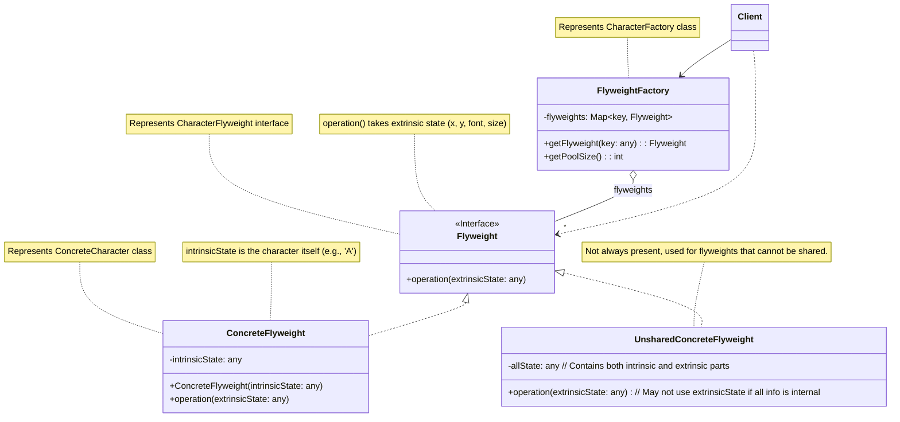

---
### 12. 代理模式 (Proxy Pattern)

**特点（关键字）：** 控制访问、延迟加载、远程代理、虚拟代理、保护代理、智能引用。

**使用场景：**
- **虚拟代理 (Virtual Proxy)**：当创建开销大的对象时，例如加载大图片或初始化复杂资源，虚拟代理可以延迟对象的创建，直到真正需要它的时候。
- **远程代理 (Remote Proxy)**：为一个对象在不同的地址空间提供局部代表。这样可以隐藏对象存在于不同地址空间的事实。例如，RMI 中的 Stub 对象。
- **保护代理 (Protection Proxy)**：控制对原始对象的访问。保护代理用于对象应该有不同访问权限的时候。例如，根据用户角色控制对某些敏感操作的访问。
- **智能引用 (Smart Reference/Pointer)**：当调用真实对象时，代理处理一些附加操作。例如，计算对象的引用次数（用于垃圾回收）、加载持久化对象、锁定真实对象以保证线程安全等。
- 例如：图片懒加载、Web服务客户端存根、权限控制、ORM框架中的延迟加载。

**示例代码 (Java)：** (以虚拟代理为例，实现图片懒加载)

```java
/**
 * 主题接口 (Subject)
 * 定义了 RealSubject 和 Proxy 的共同接口，这样在任何使用 RealSubject 的地方都可以使用 Proxy。
 */
interface Image {
    void display();
    String getFileName();
}

/**
 * 真实主题 (RealSubject)
 * 定义 Proxy 所代表的真实对象。
 * 这是实际执行业务逻辑的类。
 */
class RealImage implements Image {
    private String fileName;

    public RealImage(String fileName) {
        this.fileName = fileName;
        loadFromDisk(fileName); // 构造时即从磁盘加载，这是一个昂贵的操作
    }

    private void loadFromDisk(String fileName) {
        System.out.println("真实图片: 从磁盘加载图片 '" + fileName + "' (这是一个耗时操作)...");
        // 模拟耗时操作
        try {
            Thread.sleep(2000); // 模拟加载延迟
        } catch (InterruptedException e) {
            Thread.currentThread().interrupt();
            System.err.println("加载图片时线程被中断: " + e.getMessage());
        }
        System.out.println("真实图片: 图片 '" + fileName + "' 加载完成。");
    }

    @Override
    public void display() {
        System.out.println("真实图片: 显示图片 '" + fileName + "'");
    }

    @Override
    public String getFileName() {
        return fileName;
    }
}

/**
 * 代理 (Proxy)
 * 保存一个引用使得代理可以访问实体。若 RealSubject 和 Subject 的接口相同，Proxy 会引用 Subject。
 * 提供一个与 Subject 的接口相同的接口，这样代理就可以替代实体。
 * 控制对实体的存取，并可能负责创建和删除它。
 * 其他功能依赖于代理的类型：
 *   - Remote Proxy 负责对请求及其参数进行编码，并向不同地址空间中的实体发送已编码的请求。
 *   - Virtual Proxy 可以缓存实体的附加信息，以便延迟对实体的访问。
 *   - Protection Proxy 检查调用者是否具有实现一个请求所必需的访问权限。
 */
class ProxyImage implements Image {
    private RealImage realImage; // 持有真实对象的引用
    private String fileName;
    private boolean isLoadingNeeded = true; // 标记是否需要加载

    public ProxyImage(String fileName) {
        this.fileName = fileName;
        System.out.println("代理图片: 为 '" + fileName + "' 创建了代理对象。真实图片尚未加载。");
    }

    @Override
    public String getFileName() {
        // 代理可以直接返回文件名，无需加载真实图片
        System.out.println("代理图片: 获取文件名 '" + fileName + "' (无需加载真实图片)。");
        return fileName;
    }

    @Override
    public void display() {
        System.out.println("代理图片: 请求显示图片 '" + fileName + "'...");
        if (isLoadingNeeded || realImage == null) {
            System.out.println("代理图片: 真实图片 '" + fileName + "' 尚未加载或需要重新加载，现在开始加载...");
            realImage = new RealImage(fileName); // 只有在第一次调用display时才创建和加载真实对象
            isLoadingNeeded = false; // 标记已加载
        } else {
            System.out.println("代理图片: 真实图片 '" + fileName + "' 已加载，直接使用缓存的实例。");
        }
        realImage.display(); // 调用真实对象的display方法
    }

    // 假设有一个操作会导致图片需要重新加载
    public void markForReload() {
        this.isLoadingNeeded = true;
        this.realImage = null; // 清除旧的真实图片实例
        System.out.println("代理图片: 图片 '" + fileName + "' 已被标记为需要重新加载。");
    }
}

/**
 * 客户端代码
 */
public class ProxyClient {
    public static void main(String[] args) {
        System.out.println("--- 场景1: 首次显示图片 (通过代理) ---");
        Image image1 = new ProxyImage("photo1.jpg");
        // 此时 RealImage 尚未创建和加载

        System.out.println("\n客户端: 获取图片1的文件名...");
        System.out.println("图片1文件名: " + image1.getFileName()); // 不会触发加载

        System.out.println("\n客户端: 第一次调用 display() 方法，触发真实图片加载...");
        image1.display(); // RealImage 会在此时被创建和加载

        System.out.println("\n客户端: 第二次调用 display() 方法，直接使用已加载的真实图片...");
        image1.display(); // RealImage 不会再次加载

        System.out.println("\n--- 场景2: 创建另一个代理对象 ---");
        Image image2 = new ProxyImage("document.png");
        System.out.println("\n客户端: 显示图片2...");
        image2.display(); // 加载 "document.png"

        System.out.println("\n--- 场景3: 演示保护代理概念 (非代码实现，仅说明) ---");
        // 假设有一个 User 类和 Document 类
        // DocumentProxy(user, document) 可以在 display() 前检查 user 是否有权限查看 document

        System.out.println("\n--- 场景4: 演示智能引用/控制 (通过代理的方法) ---");
        if (image1 instanceof ProxyImage) {
            ProxyImage proxy = (ProxyImage) image1;
            proxy.markForReload(); // 假设图片内容更新，需要重新加载
            System.out.println("\n客户端: 图片1被标记重新加载后，再次显示...");
            proxy.display(); // 会重新加载 RealImage
        }

        System.out.println("\n--- 对比直接使用真实对象 (如果允许) ---");
        // RealImage directImage = new RealImage("direct_load.gif"); // 直接加载，耗时
        // directImage.display();
        System.out.println("客户端: 使用代理可以有效控制对象的创建和访问。");
    }
}
```

**形象类比：**
*   **虚拟代理 (图片懒加载)**：
    *   **真实主题 (RealImage)**：一张高清大图。
    *   **代理 (ProxyImage)**：一个图片的占位符或缩略图。
    当你打开一个有很多图片的网页时，如果所有大图都立即加载，会非常慢。网页会先显示占位符或缩略图（代理）。只有当你滚动到某个图片的位置，或者点击查看大图时，这张图片（真实主题）才会被真正下载和显示。代理在这里起到了延迟加载的作用。

*   **远程代理 (代购/海外中介)**：
    *   **真实主题**：国外的某个商品或服务。
    *   **代理**：国内的代购或中介。
    你想购买国外的商品，但直接购买流程复杂或不方便。你可以通过代购（代理）来完成。代购帮你处理与国外卖家的沟通、支付、物流等问题，你只需要和代购打交道。代理在这里充当了远程对象的本地代表。

*   **保护代理 (门禁系统/保安)**：
    *   **真实主题**：公司内部的某个重要区域或资源。
    *   **代理**：门禁系统或保安。
    不是任何人都可以随意进入公司的重要区域。员工需要刷卡或通过保安的身份验证（代理的检查）才能进入。代理在这里控制了对真实对象的访问权限。

*   **智能引用 (经纪人)**：
    *   **真实主题**：一位明星。
    *   **代理**：明星的经纪人。
    粉丝或商家想联系明星，通常不会直接找到明星本人，而是通过经纪人（代理）。经纪人会处理日程安排、合同洽谈、过滤不必要的骚扰等。经纪人在这里为明星提供了一个更智能的访问接口，并处理一些额外事务。

代理模式的核心是在客户端和真实对象之间引入一个中间层（代理），由代理来控制对真实对象的访问。

**Mermaid 结构化说明：**

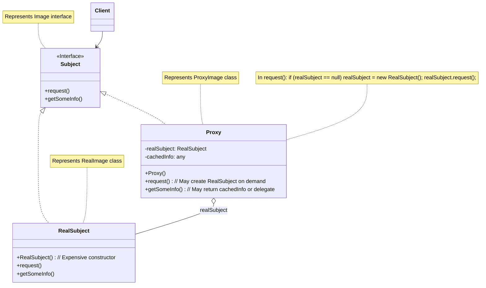

---

## 三、行为型模式 (Behavioral Patterns)

行为型模式关注对象之间的通信和职责分配，旨在使对象之间的协作更加灵活、高效和可维护。
### 13. 责任链模式 (Chain of Responsibility Pattern)

**特点（关键字）：** 请求传递、解耦发送者和接收者、动态组合链、逐级处理。

**使用场景：**
- 当有多个对象可以处理同一个请求，而具体哪个对象处理该请求由运行时动态确定。
- 当你想在不明确指定接收者的情况下，向多个对象中的一个提交一个请求。
- 当可处理一个请求的对象集合应被动态指定。
- 例如：Java Web 中的 Servlet Filter 链、日志系统中的不同级别处理器、审批流程（如请假申请，逐级由组长、经理、总监审批）、异常处理机制。

**示例代码 (Java)：** (以审批流程为例)

```java
/**
 * 请求类 (Request)
 * 包含请求的信息。
 */
class LeaveRequest {
    private String applicantName;
    private int days; // 请假天数
    private String reason;

    public LeaveRequest(String applicantName, int days, String reason) {
        this.applicantName = applicantName;
        this.days = days;
        this.reason = reason;
        System.out.println("创建请假申请: 申请人=" + applicantName + ", 天数=" + days + ", 事由=" + reason);
    }

    public String getApplicantName() {
        return applicantName;
    }

    public int getDays() {
        return days;
    }

    public String getReason() {
        return reason;
    }
}

/**
 * 抽象处理者 (Handler)
 * 定义一个处理请求的接口。
 * （可选）维护一个指向下一个处理者的引用。
 */
abstract class Approver {
    protected Approver nextApprover; // 下一个处理者
    protected String name; // 处理者姓名

    public Approver(String name) {
        this.name = name;
    }

    // 设置责任链中的下一个处理者
    public void setNextApprover(Approver nextApprover) {
        this.nextApprover = nextApprover;
        System.out.println("审批者 '" + this.name + "': 下一级审批者设置为 '" + (nextApprover != null ? nextApprover.name : "无") + "'");
    }

    // 处理请求的抽象方法
    public abstract void processRequest(LeaveRequest request);
}

/**
 * 具体处理者A (ConcreteHandlerA) - 组长
 * 处理它所负责的请求。
 * 可访问它的后继者。
 * 如果可处理该请求，就处理之；否则就把请求转发给它的后继者。
 */
class TeamLeader extends Approver {
    private final int MAX_DAYS_CAN_APPROVE = 3; // 组长最多批准3天

    public TeamLeader(String name) {
        super(name);
    }

    @Override
    public void processRequest(LeaveRequest request) {
        System.out.println("组长 '" + name + "' 正在审批 '" + request.getApplicantName() + "' 的请假申请 (天数: " + request.getDays() + ")");
        if (request.getDays() <= MAX_DAYS_CAN_APPROVE) {
            System.out.println("组长 '" + name + "' 批准了 '" + request.getApplicantName() + "' 的 " + request.getDays() + " 天请假。事由: " + request.getReason());
        } else {
            System.out.println("组长 '" + name + "' 无法处理超过 " + MAX_DAYS_CAN_APPROVE + " 天的请假，转交给下一级审批者。");
            if (nextApprover != null) {
                nextApprover.processRequest(request); // 传递给下一个处理者
            } else {
                System.out.println("没有更高级别的审批者，请假申请 '" + request.getApplicantName() + "' 无法被处理。");
            }
        }
    }
}

/**
 * 具体处理者B (ConcreteHandlerB) - 部门经理
 */
class DepartmentManager extends Approver {
    private final int MAX_DAYS_CAN_APPROVE = 7; // 经理最多批准7天

    public DepartmentManager(String name) {
        super(name);
    }

    @Override
    public void processRequest(LeaveRequest request) {
        System.out.println("部门经理 '" + name + "' 正在审批 '" + request.getApplicantName() + "' 的请假申请 (天数: " + request.getDays() + ")");
        if (request.getDays() <= MAX_DAYS_CAN_APPROVE) {
            System.out.println("部门经理 '" + name + "' 批准了 '" + request.getApplicantName() + "' 的 " + request.getDays() + " 天请假。事由: " + request.getReason());
        } else {
            System.out.println("部门经理 '" + name + "' 无法处理超过 " + MAX_DAYS_CAN_APPROVE + " 天的请假，转交给下一级审批者。");
            if (nextApprover != null) {
                nextApprover.processRequest(request);
            } else {
                System.out.println("没有更高级别的审批者，请假申请 '" + request.getApplicantName() + "' 无法被处理。");
            }
        }
    }
}

/**
 * 具体处理者C (ConcreteHandlerC) - 总监
 */
class Director extends Approver {
    private final int MAX_DAYS_CAN_APPROVE = 15; // 总监最多批准15天

    public Director(String name) {
        super(name);
    }

    @Override
    public void processRequest(LeaveRequest request) {
        System.out.println("总监 '" + name + "' 正在审批 '" + request.getApplicantName() + "' 的请假申请 (天数: " + request.getDays() + ")");
        if (request.getDays() <= MAX_DAYS_CAN_APPROVE) {
            System.out.println("总监 '" + name + "' 批准了 '" + request.getApplicantName() + "' 的 " + request.getDays() + " 天请假。事由: " + request.getReason());
        } else {
            System.out.println("总监 '" + name + "' 无法处理超过 " + MAX_DAYS_CAN_APPROVE + " 天的请假。请假申请被驳回或需要更高级别处理。");
            // 在此示例中，总监是最高级别
            if (nextApprover != null) {
                 System.out.println("理论上总监是最高级，但仍尝试转交...");
                nextApprover.processRequest(request);
            } else {
                 System.out.println("请假天数过多，总监 '" + name + "' 也无法批准。申请 '" + request.getApplicantName() + "' 被拒绝。");
            }
        }
    }
}


/**
 * 客户端代码
 */
public class ChainOfResponsibilityClient {
    public static void main(String[] args) {
        // 创建审批者
        Approver teamLeader = new TeamLeader("张三 (组长)");
        Approver manager = new DepartmentManager("李四 (经理)");
        Approver director = new Director("王五 (总监)");

        // 构建责任链
        System.out.println("--- 构建审批责任链 ---");
        teamLeader.setNextApprover(manager);
        manager.setNextApprover(director);
        // director 是链的末端，其 nextApprover 默认为 null
        System.out.println("审批责任链构建完成: 组长 -> 经理 -> 总监\n");


        // 创建并提交请假申请
        System.out.println("--- 提交请假申请1 (2天) ---");
        LeaveRequest request1 = new LeaveRequest("小明", 2, "参加技术会议");
        teamLeader.processRequest(request1); // 从链头开始处理

        System.out.println("\n--- 提交请假申请2 (5天) ---");
        LeaveRequest request2 = new LeaveRequest("小红", 5, "短期旅行");
        teamLeader.processRequest(request2);

        System.out.println("\n--- 提交请假申请3 (12天) ---");
        LeaveRequest request3 = new LeaveRequest("小刚", 12, "婚假");
        teamLeader.processRequest(request3);

        System.out.println("\n--- 提交请假申请4 (20天) ---");
        LeaveRequest request4 = new LeaveRequest("小华", 20, "长期病假");
        teamLeader.processRequest(request4);

        System.out.println("\n--- 测试没有下一级审批者的情况 (直接让经理处理一个超长假期) ---");
        Approver loneManager = new DepartmentManager("赵六 (独立经理)");
        LeaveRequest request5 = new LeaveRequest("小李", 10, "特殊事假");
        // loneManager.setNextApprover(null); // nextApprover 默认为 null
        loneManager.processRequest(request5);
    }
}
```

**形象类比：**
*   **古代官员上奏折**：
    *   **请求 (LeaveRequest)**：一份奏折。
    *   **处理者 (Approver)**：各级官员（县令、知府、巡抚、尚书、皇帝）。
    *   **责任链**：奏折从低级官员开始，逐级向上传递。
    一份普通的民情奏折可能县令（具体处理者A）就能处理。如果县令处理不了（比如涉及重大案件或需要跨区域协调），就会上报给知府（具体处理者B）。知府处理不了再上报给巡抚，以此类推，直到某个官员能够处理，或者最终上达到皇帝（链的末端）。每个官员只关心自己职责范围内的事情，处理不了就交给上级。发送者（最初写奏折的人）不需要知道最终是哪个级别的官员处理了他的奏折。

*   **客服电话系统**：
    *   **请求**：客户的问题。
    *   **处理者**：一级客服、二级客服（技术支持）、客服主管。
    *   **责任链**：客户电话首先由一级客服接听。如果一级客服能解决（比如简单查询），就直接处理。如果解决不了（比如复杂技术问题），就转接给二级技术支持。如果技术支持也无法解决或客户不满意，可能会升级到客服主管。请求在客服人员之间传递，直到被解决或达到处理上限。

责任链模式使得请求的发送者和接收者解耦，请求沿着链传递，直到有一个对象处理它为止。

**Mermaid 结构化说明：**

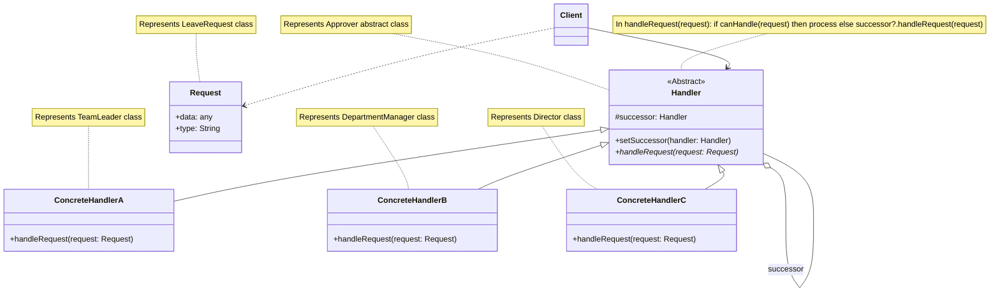

---
### 14. 命令模式 (Command Pattern)

**特点（关键字）：** 请求封装、行为参数化、解耦调用者和接收者、支持撤销/重做、队列请求。

**使用场景：**
- 当需要将请求的发送者和接收者解耦，使得发送者不需要知道接收者的具体实现，也不需要知道请求的具体操作。
- 当需要将操作参数化，即可以将不同的操作作为参数传递给方法。
- 当需要支持撤销（undo）和重做（redo）操作时。命令对象可以保存执行操作所需的所有信息，从而可以恢复到操作执行前的状态。
- 当需要将请求排队、记录日志或实现事务性操作时。
- 例如：GUI按钮点击事件（按钮是调用者，点击操作是命令，具体业务逻辑是接收者）、文本编辑器的操作（复制、粘贴、剪切）、遥控器控制家电、任务队列。

**示例代码 (Java)：** (以遥控器控制灯光为例)

```java
/**
 * 命令接口 (Command)
 * 声明了执行操作的接口。
 */
interface Command {
    void execute();
    void undo(); // 添加undo方法用于撤销操作
}

/**
 * 接收者 (Receiver)
 *知道如何实施与执行一个请求相关的操作。任何类都可能作为一个接收者。
 */
class Light {
    private String location;
    private boolean isOn;

    public Light(String location) {
        this.location = location;
        this.isOn = false;
        System.out.println("创建灯: " + location + " (初始状态: 关闭)");
    }

    public void on() {
        this.isOn = true;
        System.out.println(location + " 灯已打开。");
    }

    public void off() {
        this.isOn = false;
        System.out.println(location + " 灯已关闭。");
    }

    public boolean isOn() {
        return isOn;
    }

    public String getLocation() {
        return location;
    }
}

/**
 * 具体命令A (ConcreteCommandA) - 开灯命令
 * 将一个接收者对象绑定于一个动作。
 * 调用接收者中的相应操作，以实现 Execute。
 */
class LightOnCommand implements Command {
    private Light light; // 持有接收者的引用

    public LightOnCommand(Light light) {
        this.light = light;
    }

    @Override
    public void execute() {
        System.out.println("命令执行: 打开 " + light.getLocation() + " 的灯。");
        light.on();
    }

    @Override
    public void undo() {
        System.out.println("命令撤销: 关闭 " + light.getLocation() + " 的灯 (因为之前是打开操作)。");
        light.off(); // 开灯的撤销操作是关灯
    }
}

/**
 * 具体命令B (ConcreteCommandB) - 关灯命令
 */
class LightOffCommand implements Command {
    private Light light;

    public LightOffCommand(Light light) {
        this.light = light;
    }

    @Override
    public void execute() {
        System.out.println("命令执行: 关闭 " + light.getLocation() + " 的灯。");
        light.off();
    }

    @Override
    public void undo() {
        System.out.println("命令撤销: 打开 " + light.getLocation() + " 的灯 (因为之前是关闭操作)。");
        light.on(); // 关灯的撤销操作是开灯
    }
}

/**
 * 空命令 (Null Object Pattern for Command)
 * 用于表示没有具体操作的命令，避免空指针检查。
 */
class NoCommand implements Command {
    @Override
    public void execute() {
        System.out.println("空命令: 无操作执行。");
    }
    @Override
    public void undo() {
        System.out.println("空命令: 无操作可撤销。");
    }
}


/**
 * 调用者 (Invoker) - 遥控器
 * 要求该命令执行这个请求。
 */
class RemoteControl {
    private Command[] onCommands;
    private Command[] offCommands;
    private Command undoCommand; // 用于记录上一个执行的命令，以便撤销

    public RemoteControl(int numberOfSlots) {
        onCommands = new Command[numberOfSlots];
        offCommands = new Command[numberOfSlots];
        Command noCommand = new NoCommand(); // 使用空命令初始化
        for (int i = 0; i < numberOfSlots; i++) {
            onCommands[i] = noCommand;
            offCommands[i] = noCommand;
        }
        undoCommand = noCommand; // 初始时没有可撤销的命令
        System.out.println("创建遥控器，包含 " + numberOfSlots + " 个插槽。");
    }

    public void setCommand(int slot, Command onCommand, Command offCommand) {
        if (slot >= 0 && slot < onCommands.length) {
            onCommands[slot] = onCommand;
            offCommands[slot] = offCommand;
            System.out.println("遥控器: 插槽 " + slot + " 设置了 ON 命令 (" + onCommand.getClass().getSimpleName() +
                               ") 和 OFF 命令 (" + offCommand.getClass().getSimpleName() + ")");
        } else {
            System.out.println("遥控器: 无效的插槽 " + slot);
        }
    }

    public void onButtonWasPushed(int slot) {
        if (slot >= 0 && slot < onCommands.length) {
            System.out.println("遥控器: 按下插槽 " + slot + " 的 ON 按钮。");
            onCommands[slot].execute();
            undoCommand = onCommands[slot]; // 记录执行的命令
        } else {
            System.out.println("遥控器: 无效的插槽 " + slot + " ON 按钮。");
        }
    }

    public void offButtonWasPushed(int slot) {
        if (slot >= 0 && slot < offCommands.length) {
            System.out.println("遥控器: 按下插槽 " + slot + " 的 OFF 按钮。");
            offCommands[slot].execute();
            undoCommand = offCommands[slot]; // 记录执行的命令
        } else {
            System.out.println("遥控器: 无效的插槽 " + slot + " OFF 按钮。");
        }
    }

    public void undoButtonWasPushed() {
        System.out.println("遥控器: 按下 UNDO 按钮。");
        undoCommand.undo();
        undoCommand = new NoCommand(); // 撤销后，重置undoCommand为NoCommand，避免重复撤销同一个命令
    }

    @Override
    public String toString() {
        StringBuffer stringBuff = new StringBuffer();
        stringBuff.append("\n------ 遥控器状态 ------\n");
        for (int i = 0; i < onCommands.length; i++) {
            stringBuff.append("[插槽 " + i + "] " + onCommands[i].getClass().getSimpleName()
                    + "   " + offCommands[i].getClass().getSimpleName() + "\n");
        }
        stringBuff.append("[撤销] " + undoCommand.getClass().getSimpleName() + "\n");
        stringBuff.append("------------------------\n");
        return stringBuff.toString();
    }
}

/**
 * 客户端代码
 */
public class CommandClient {
    public static void main(String[] args) {
        // 创建接收者对象
        Light livingRoomLight = new Light("客厅");
        Light kitchenLight = new Light("厨房");

        // 创建具体命令对象，并关联接收者
        Command livingRoomLightOn = new LightOnCommand(livingRoomLight);
        Command livingRoomLightOff = new LightOffCommand(livingRoomLight);
        Command kitchenLightOn = new LightOnCommand(kitchenLight);
        Command kitchenLightOff = new LightOffCommand(kitchenLight);

        // 创建调用者对象 (遥控器)
        RemoteControl remote = new RemoteControl(2); // 遥控器有两个插槽

        // 配置遥控器的命令
        System.out.println("\n--- 配置遥控器 ---");
        remote.setCommand(0, livingRoomLightOn, livingRoomLightOff); // 插槽0控制客厅灯
        remote.setCommand(1, kitchenLightOn, kitchenLightOff);   // 插槽1控制厨房灯
        System.out.println(remote);

        // 模拟按下遥控器按钮
        System.out.println("--- 操作客厅灯 ---");
        remote.onButtonWasPushed(0); // 打开客厅灯
        System.out.println("客厅灯状态: " + (livingRoomLight.isOn() ? "开" : "关"));
        remote.offButtonWasPushed(0); // 关闭客厅灯
        System.out.println("客厅灯状态: " + (livingRoomLight.isOn() ? "开" : "关"));

        System.out.println("\n--- 操作厨房灯并撤销 ---");
        remote.onButtonWasPushed(1);  // 打开厨房灯
        System.out.println("厨房灯状态: " + (kitchenLight.isOn() ? "开" : "关"));
        remote.undoButtonWasPushed(); // 撤销打开厨房灯的操作 (即关闭厨房灯)
        System.out.println("厨房灯状态 (撤销后): " + (kitchenLight.isOn() ? "开" : "关"));


        System.out.println("\n--- 再次按下关闭客厅灯并撤销 ---");
        remote.offButtonWasPushed(0); // 关闭客厅灯
        System.out.println("客厅灯状态: " + (livingRoomLight.isOn() ? "开" : "关"));
        remote.undoButtonWasPushed(); // 撤销关闭客厅灯 (即打开客厅灯)
        System.out.println("客厅灯状态 (撤销后): " + (livingRoomLight.isOn() ? "开" : "关"));

        System.out.println("\n--- 测试空命令的撤销 ---");
        remote.undoButtonWasPushed(); // 此时 undoCommand 应该是 NoCommand

        System.out.println(remote);
    }
}
```

**形象类比：**
*   **餐厅点餐（服务员与厨师）**：
    *   **调用者 (Invoker)**：服务员。
    *   **命令 (Command)**：顾客点的菜单项（比如“宫保鸡丁订单”、“鱼香肉丝订单”）。每个订单都是一个命令对象，它知道要做什么菜。
    *   **具体命令 (ConcreteCommand)**：具体的菜品订单，如 `KungPaoChickenCommand`。它内部可能包含了菜品名称、数量、特殊要求等信息，并且知道哪个厨师（接收者）擅长做这道菜。
    *   **接收者 (Receiver)**：厨师。厨师是真正执行做菜动作的人。
    *   **客户端 (Client)**：顾客。顾客创建订单（命令），交给服务员（调用者）。
    服务员（调用者）拿到订单（命令）后，不需要知道这道菜具体怎么做，也不需要知道是哪个厨师（接收者）来做。他只需要把订单贴到厨房的订单板上（执行命令 `command.execute()`）。厨师（接收者）看到订单后，就知道如何制作了。
    这种方式的好处是：
    1.  **解耦**：服务员和厨师解耦。服务员可以接收各种订单，厨师可以专注于做菜。
    2.  **队列/日志**：订单可以排队等待处理，也可以被记录下来用于统计或追踪。
    3.  **撤销**：如果厨师还没开始做，顾客或许可以取消订单（`command.undo()`，比如从订单板上拿掉）。

*   **万能遥控器**：
    *   **调用者**：遥控器上的按钮。
    *   **命令**：每个按钮按下后要执行的动作，比如“打开电视”、“切换到频道5”、“增大音量”。
    *   **接收者**：电视机、音响、DVD播放器等家电设备。
    遥控器按钮（调用者）被按下时，会触发一个命令对象。这个命令对象知道要操作哪个设备（接收者）以及执行什么动作。遥控器本身不需要知道电视机是如何打开的，它只需要发送“打开”这个命令。

命令模式将“请求”封装成一个对象，从而可以用不同的请求对客户进行参数化；对请求排队或记录请求日志，以及支持可撤销的操作。

**Mermaid 结构化说明：**

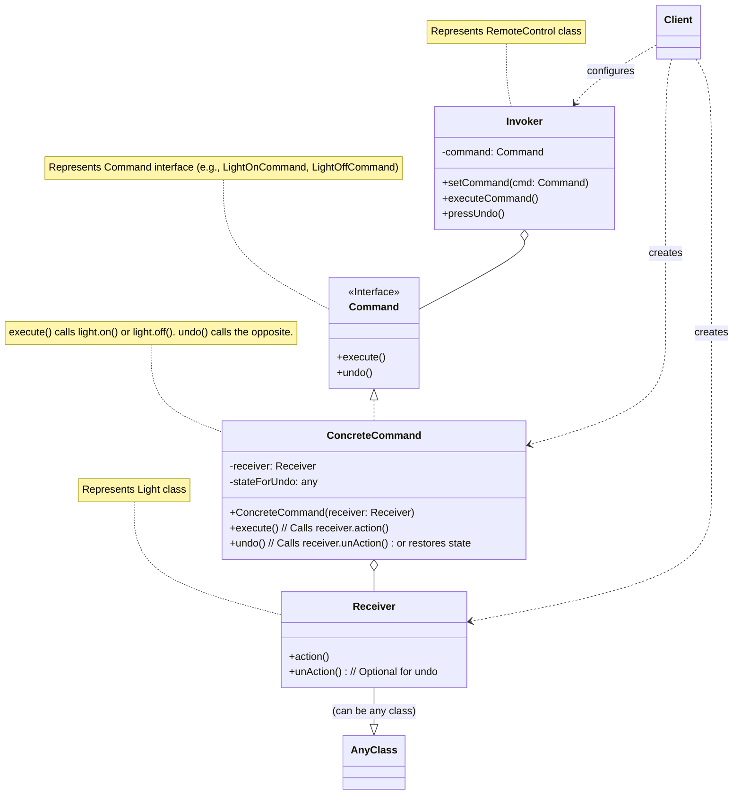

---
### 15. 解释器模式 (Interpreter Pattern)

**特点（关键字）：** 定义语言文法、解释执行、AST（抽象语法树）、递归解释。

**使用场景：**
- 当有一个语言需要解释执行，并且你可将该语言中的句子表示为一个抽象语法树时。
- 当文法简单，效率不是关键问题时。对于复杂的文法，通常使用专门的解析器生成器（如ANTLR, JavaCC）更为合适，因为解释器模式可能会导致类层次结构庞大且难以维护。
- 当你想将一个问题表述为一种简单的语言，并能通过解释这种语言来解决问题时。
- 例如：SQL解析、正则表达式引擎、数学表达式求值器、自定义脚本语言。

**示例代码 (Java)：** (以简单的数学表达式求值器为例：只支持加法和减法，以及数字)

```java
import java.util.Map;
import java.util.HashMap; // For variable context

/**
 * 抽象表达式接口 (AbstractExpression)
 * 声明一个抽象的解释操作，这个接口为抽象语法树中所有的节点所共享。
 */
interface Expression {
    int interpret(Map<String, Integer> context); // 解释方法，上下文可以包含变量等
}

/**
 * 终结符表达式 (TerminalExpression) - 数字
 * 实现与文法中的终结符相关联的解释操作。
 * 一个句子中的每个终结符需要一个 TerminalExpression 类的实例。
 */
class NumberExpression implements Expression {
    private int number;

    public NumberExpression(int number) {
        this.number = number;
        System.out.println("创建数字表达式: " + number);
    }

    @Override
    public int interpret(Map<String, Integer> context) {
        System.out.println("解释数字: " + number);
        return number;
    }
}

/**
 * 终结符表达式 (TerminalExpression) - 变量
 * (为了演示上下文的作用)
 */
class VariableExpression implements Expression {
    private String name;

    public VariableExpression(String name) {
        this.name = name;
        System.out.println("创建变量表达式: " + name);
    }

    @Override
    public int interpret(Map<String, Integer> context) {
        if (context.containsKey(name)) {
            int value = context.get(name);
            System.out.println("解释变量 '" + name + "': 值为 " + value);
            return value;
        }
        System.out.println("解释变量 '" + name + "': 未在上下文中找到，默认为0");
        return 0; // 或者抛出异常
    }
}


/**
 * 非终结符表达式 (NonterminalExpression) - 加法
 * 为文法中的非终结符实现解释操作。
 * 对文法中的每一条规则 R ::= R1 R2 ... Rn 都需要一个 NonterminalExpression 类。
 * 对于规则 R ::= R1 R2 ... Rn，R 的解释操作一般是递归调用 R1, R2, ..., Rn 的解释操作。
 */
class AddExpression implements Expression {
    private Expression leftExpression;
    private Expression rightExpression;

    public AddExpression(Expression left, Expression right) {
        this.leftExpression = left;
        this.rightExpression = right;
        System.out.println("创建加法表达式");
    }

    @Override
    public int interpret(Map<String, Integer> context) {
        System.out.println("解释加法: (左操作数) + (右操作数)");
        int leftValue = leftExpression.interpret(context);
        int rightValue = rightExpression.interpret(context);
        int result = leftValue + rightValue;
        System.out.println("加法结果: " + leftValue + " + " + rightValue + " = " + result);
        return result;
    }
}

/**
 * 非终结符表达式 (NonterminalExpression) - 减法
 */
class SubtractExpression implements Expression {
    private Expression leftExpression;
    private Expression rightExpression;

    public SubtractExpression(Expression left, Expression right) {
        this.leftExpression = left;
        this.rightExpression = right;
        System.out.println("创建减法表达式");
    }

    @Override
    public int interpret(Map<String, Integer> context) {
        System.out.println("解释减法: (左操作数) - (右操作数)");
        int leftValue = leftExpression.interpret(context);
        int rightValue = rightExpression.interpret(context);
        int result = leftValue - rightValue;
        System.out.println("减法结果: " + leftValue + " - " + rightValue + " = " + result);
        return result;
    }
}

/**
 * 上下文 (Context)
 * 包含解释器解释时需要的全局信息。
 * 在本例中，我们使用 Map<String, Integer> 作为上下文来存储变量的值。
 */
// class Context {
//     private Map<String, Integer> variables = new HashMap<>();
//     public void setVariable(String name, int value) {
//         variables.put(name, value);
//     }
//     public int getVariable(String name) {
//         return variables.getOrDefault(name, 0); // Default to 0 if not found
//     }
// }


/**
 * 客户端代码
 * 构建 (或被给定) 一个表示特定语言句子的抽象语法树。
 * 调用解释操作。
 */
public class InterpreterClient {
    public static void main(String[] args) {
        // 上下文，用于存储变量的值
        Map<String, Integer> context = new HashMap<>();
        context.put("a", 10);
        context.put("b", 5);
        context.put("c", 2);
        System.out.println("上下文初始化: a=10, b=5, c=2\n");

        // 构建表达式: (a + b) - c  即 (10 + 5) - 2
        // 对应的抽象语法树：
        //        Subtract
        //        /      \
        //      Add       Var(c)
        //     /   \
        //  Var(a) Var(b)

        System.out.println("--- 构建表达式: (a + b) - c ---");
        Expression expr1 = new AddExpression(new VariableExpression("a"), new VariableExpression("b"));
        Expression finalExpression = new SubtractExpression(expr1, new VariableExpression("c"));

        System.out.println("\n--- 开始解释表达式 (a + b) - c ---");
        int result1 = finalExpression.interpret(context);
        System.out.println("最终结果 for (a + b) - c: " + result1); // 应该输出 13

        System.out.println("\n--- 构建并解释另一个表达式: 20 + (b - 5) ---");
        // 表达式: 20 + (b - 5)  其中 b=5, 结果应为 20 + (5-5) = 20
        // 注意：这里直接使用数字，而不是变量
        Expression expr2_left = new NumberExpression(20);
        Expression expr2_right_left = new VariableExpression("b");
        Expression expr2_right_right = new NumberExpression(5);
        Expression expr2_right = new SubtractExpression(expr2_right_left, expr2_right_right);
        Expression finalExpression2 = new AddExpression(expr2_left, expr2_right);

        System.out.println("\n--- 开始解释表达式 20 + (b - 5) ---");
        int result2 = finalExpression2.interpret(context);
        System.out.println("最终结果 for 20 + (b - 5): " + result2); // 应该输出 20

        System.out.println("\n--- 构建并解释一个只包含数字的表达式: (100 - 20) + 5 ---");
        Expression numExpr = new AddExpression(
                                new SubtractExpression(new NumberExpression(100), new NumberExpression(20)),
                                new NumberExpression(5)
                             );
        System.out.println("\n--- 开始解释表达式 (100 - 20) + 5 ---");
        int result3 = numExpr.interpret(new HashMap<>()); // 使用空上下文，因为没有变量
        System.out.println("最终结果 for (100 - 20) + 5: " + result3); // 应该输出 85

        System.out.println("\n--- 解释一个包含未定义变量的表达式: x + y ---");
        Expression undefinedVarExpr = new AddExpression(new VariableExpression("x"), new VariableExpression("y"));
        System.out.println("\n--- 开始解释表达式 x + y (x, y 未定义) ---");
        int result4 = undefinedVarExpr.interpret(context); // context 中没有 x, y
        System.out.println("最终结果 for x + y: " + result4); // 应该输出 0 (因为默认返回0)
    }
}
```

**形象类比：**
*   **学习一门新语言（如英语）**：
    *   **语言文法**：英语的语法规则（主谓宾、时态、名词单复数等）。
    *   **抽象表达式 (Expression)**：语言中的“句子成分”的抽象概念，比如“名词短语”、“动词短语”。它们都有一个“理解含义”（`interpret`）的方法。
    *   **终结符表达式 (NumberExpression, VariableExpression)**：具体的单词，如 "apple", "run", "I", "10"。这些是构成句子的基本单位。
    *   **非终结符表达式 (AddExpression, SubtractExpression)**：语法规则的体现，比如“主语+谓语+宾语”构成一个简单句，“名词+形容词”构成一个名词短语。这些规则组合了更小的成分。
    *   **上下文 (Context)**：对话的背景、语境、已知的定义（比如 "he" 指代的是谁）。
    当你看到一个英语句子（比如 "I eat an apple"），你的大脑（解释器客户端）会根据英语语法（文法）将其分解成不同的组成部分（抽象语法树），然后逐个理解单词的含义（终结符解释），再根据语法规则组合这些含义（非终结符解释），最终理解整个句子的意思。

*   **乐谱演奏**：
    *   **语言文法**：乐谱的规则（音符、节拍、调号等）。
    *   **抽象表达式**：“音乐片段”的抽象。
    *   **终结符表达式**：单个音符（如Do, Re, Mi）。
    *   **非终结符表达式**：和弦（多个音符的组合）、乐句（多个音符或和弦的序列）。
    *   **上下文**：演奏的乐器、速度、情感等。
    演奏家（解释器客户端）看到乐谱（句子），会根据乐理知识（文法）将其解析成音符和乐句（抽象语法树），然后通过乐器（解释操作）将其演奏出来。

解释器模式通常用于小型、简单的语言。对于复杂的语言，构建和维护解释器会变得非常复杂。

**Mermaid 结构化说明：**

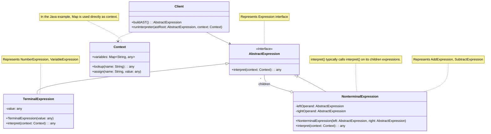

---
### 16. 迭代器模式 (Iterator Pattern)

**特点（关键字）：** 顺序访问、遍历集合、隐藏内部结构、统一遍历接口。

**使用场景：**
- 当你需要访问一个聚合对象（如列表、集合、树等）的内容，而不暴露其内部表示时。
- 当你需要支持对聚合对象的多种遍历方式时（例如，正向遍历、反向遍历）。
- 当你需要为不同的聚合结构提供一个统一的遍历接口时。
- 例如：Java中的 `java.util.Iterator` 和 `java.util.Iterable`、数据库查询结果集的遍历、自定义数据结构的遍历。

**示例代码 (Java)：** (以自定义的书架为例)

```java
import java.util.ArrayList;
import java.util.List;
import java.util.NoSuchElementException; // For iterator implementation

/**
 * 迭代器接口 (Iterator)
 * 定义了访问和遍历元素的接口。
 */
interface CustomIterator<T> {
    boolean hasNext(); // 是否有下一个元素
    T next();        // 返回下一个元素
    // void remove(); // 可选的移除操作，Java Iterator 有此方法
}

/**
 * 聚合接口 (Aggregate)
 * 定义创建相应迭代器对象的接口。
 */
interface BookCollection {
    CustomIterator<Book> createIterator();
    void addBook(Book book);
    int getSize();
}

/**
 * 书籍类 (Element)
 */
class Book {
    private String title;
    private String author;

    public Book(String title, String author) {
        this.title = title;
        this.author = author;
        System.out.println("添加书籍: 《" + title + "》 作者: " + author);
    }

    public String getTitle() {
        return title;
    }

    public String getAuthor() {
        return author;
    }

    @Override
    public String toString() {
        return "《" + title + "》 by " + author;
    }
}

/**
 * 具体聚合类 (ConcreteAggregate) - 书架
 * 实现 Aggregate 接口，返回一个 ConcreteIterator 的实例。
 * 负责存储元素。
 */
class Bookshelf implements BookCollection {
    private List<Book> books; // 使用ArrayList存储书籍

    public Bookshelf() {
        this.books = new ArrayList<>();
        System.out.println("创建了一个新书架。");
    }

    @Override
    public void addBook(Book book) {
        this.books.add(book);
    }

    public Book getBookAt(int index) {
        if (index >= 0 && index < books.size()) {
            return books.get(index);
        }
        return null;
    }

    @Override
    public int getSize() {
        return books.size();
    }

    @Override
    public CustomIterator<Book> createIterator() {
        System.out.println("书架: 创建书籍迭代器。");
        return new BookshelfIterator(this); // 创建并返回该书架的迭代器
    }
}

/**
 * 具体迭代器 (ConcreteIterator)
 * 实现 Iterator 接口。
 * 对聚合进行遍历，并跟踪当前遍历的位置。
 */
class BookshelfIterator implements CustomIterator<Book> {
    private Bookshelf bookshelf;
    private int currentIndex;

    public BookshelfIterator(Bookshelf bookshelf) {
        this.bookshelf = bookshelf;
        this.currentIndex = 0;
        System.out.println("书籍迭代器: 已初始化，准备从索引 0 开始遍历。");
    }

    @Override
    public boolean hasNext() {
        boolean has = currentIndex < bookshelf.getSize();
        System.out.println("书籍迭代器: 检查是否有下一个元素 (当前索引 " + currentIndex + ", 书架大小 " + bookshelf.getSize() + ") -> " + has);
        return has;
    }

    @Override
    public Book next() {
        if (!hasNext()) {
            System.err.println("书籍迭代器: 没有更多元素可供迭代！");
            throw new NoSuchElementException("No more books on the bookshelf.");
        }
        Book book = bookshelf.getBookAt(currentIndex);
        System.out.println("书籍迭代器: 获取元素 " + book + " (在索引 " + currentIndex + ")");
        currentIndex++;
        return book;
    }
}


/**
 * 客户端代码
 */
public class IteratorClient {
    public static void main(String[] args) {
        // 创建聚合对象 (书架)
        BookCollection bookshelf = new Bookshelf();

        // 添加一些书籍
        System.out.println("\n--- 向书架添加书籍 ---");
        bookshelf.addBook(new Book("设计模式:可复用面向对象软件的基础", "Erich Gamma et al."));
        bookshelf.addBook(new Book("Effective Java", "Joshua Bloch"));
        bookshelf.addBook(new Book("代码整洁之道", "Robert C. Martin"));
        bookshelf.addBook(new Book("深入理解Java虚拟机", "周志明"));

        // 获取迭代器
        System.out.println("\n--- 从书架获取迭代器 ---");
        CustomIterator<Book> iterator = bookshelf.createIterator();

        // 使用迭代器遍历书籍
        System.out.println("\n--- 开始遍历书架上的书籍 ---");
        while (iterator.hasNext()) {
            Book book = iterator.next();
            System.out.println("客户端: 读到书籍 - " + book.getTitle() + " by " + book.getAuthor());
        }

        System.out.println("\n--- 尝试在没有更多元素时调用 next() ---");
        try {
            iterator.next(); // 此时应该没有更多元素了
        } catch (NoSuchElementException e) {
            System.err.println("客户端捕获异常: " + e.getMessage());
        }

        System.out.println("\n--- 创建另一个书架和迭代器 ---");
        BookCollection smallShelf = new Bookshelf();
        smallShelf.addBook(new Book("算法图解", "Aditya Bhargava"));
        CustomIterator<Book> smallIterator = smallShelf.createIterator();
        System.out.println("小书架上的第一本书: " + smallIterator.next().getTitle());

        // Java 内置迭代器示例 (对比)
        System.out.println("\n--- 使用 Java 内置迭代器示例 ---");
        List<String> names = new ArrayList<>();
        names.add("Alice");
        names.add("Bob");
        names.add("Charlie");

        java.util.Iterator<String> javaIterator = names.iterator();
        System.out.println("使用Java Iterator遍历名字:");
        while (javaIterator.hasNext()) {
            System.out.println(" - " + javaIterator.next());
        }
    }
}
```

**形象类比：**
*   **电视遥控器**：
    *   **聚合对象 (BookCollection)**：电视频道列表。
    *   **迭代器 (CustomIterator)**：遥控器上的“下一个频道”和“上一个频道”按钮。
    你不需要知道电视台是如何存储和组织这些频道的（是数组、链表还是其他复杂结构）。你只需要通过遥控器上的按钮（迭代器）就可以顺序地切换频道（访问聚合对象的元素）。遥控器隐藏了频道列表的内部实现细节。

*   **餐厅服务员按顺序上菜**：
    *   **聚合对象**：厨房里准备好的一系列菜品。
    *   **迭代器**：服务员。
    服务员知道上菜的顺序（比如先凉菜，再热菜，最后甜点）。顾客（客户端）不需要关心厨房是如何管理这些菜品的，只需要等待服务员一道道地把菜送上来。服务员充当了迭代器的角色，按特定顺序提供菜品。

*   **MP3播放器的播放列表**：
    *   **聚合对象**：播放列表中的歌曲集合。
    *   **迭代器**：“下一首”、“上一首”按钮。
    用户通过这些按钮来遍历播放列表中的歌曲，而无需关心歌曲是如何存储的。

迭代器模式将遍历聚合对象的责任从聚合对象本身分离出来，交给了迭代器对象。这样做的好处是：
1.  **简化聚合接口**：聚合对象不需要再包含遍历自身的方法。
2.  **支持多种遍历方式**：可以为同一个聚合对象提供多种不同的迭代器（如正序、倒序、跳跃等）。
3.  **统一遍历接口**：无论聚合对象的内部结构如何（数组、链表、树等），客户端都可以使用统一的迭代器接口进行遍历。

**Mermaid 结构化说明：**

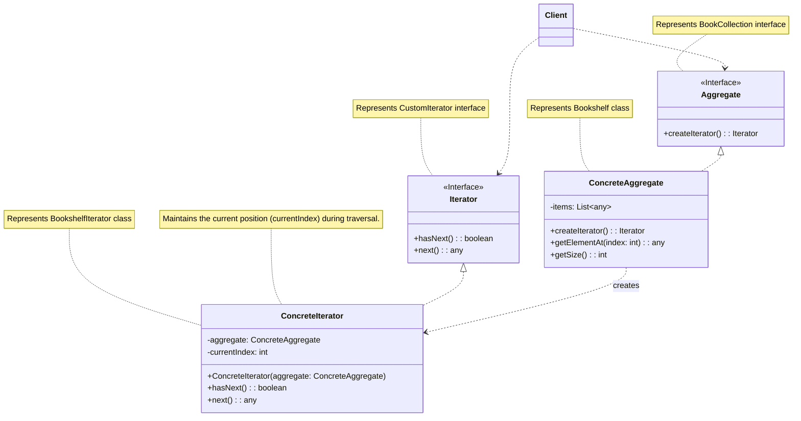

---
### 17. 中介者模式 (Mediator Pattern)

**特点（关键字）：** 集中控制交互、解耦同事对象、简化对象间关系、星型通信结构。

**使用场景：**
- 当一组对象以复杂的方式交互，导致对象之间存在大量相互依赖和耦合时。
- 当你希望复用一个对象，但它需要与许多其他对象交互，而你不想为每种交互都创建一个子类时。
- 当你需要自定义一个分布在多个类中的行为，而又不想生成太多子类时。
- 例如：聊天室（用户之间不直接通信，而是通过聊天室服务器转发）、GUI中的对话框（对话框作为中介者协调其内部的按钮、文本框等控件）、航空交通管制系统（飞机之间不直接通信，由塔台协调）。

**示例代码 (Java)：** (以聊天室为例)

```java
import java.util.ArrayList;
import java.util.List;
import java.util.Date; // For timestamping messages

/**
 * 抽象中介者 (Mediator)
 * 定义了同事对象之间通信的接口。
 */
interface ChatMediator {
    void sendMessage(String message, User sender);
    void addUser(User user);
    void removeUser(User user);
}

/**
 * 抽象同事类 (Colleague)
 * 定义了每个同事对象的接口，通常持有一个中介者对象的引用。
 */
abstract class User {
    protected ChatMediator mediator;
    protected String name;
    protected List<String> receivedMessages; // Store received messages

    public User(ChatMediator mediator, String name) {
        this.mediator = mediator;
        this.name = name;
        this.receivedMessages = new ArrayList<>();
        System.out.println("用户 '" + name + "' 已创建并准备加入聊天室。");
    }

    public String getName() {
        return name;
    }

    // 发送消息，通过中介者
    public abstract void send(String message);

    // 接收消息，由中介者调用
    public abstract void receive(String message, User sender);

    public List<String> getReceivedMessages() {
        return new ArrayList<>(receivedMessages); // Return a copy
    }
}

/**
 * 具体中介者 (ConcreteMediator)
 * 实现 Mediator 接口，协调各个同事对象之间的交互。
 * 它了解并维护它的各个同事。
 */
class ChatRoomMediator implements ChatMediator {
    private List<User> users;

    public ChatRoomMediator() {
        this.users = new ArrayList<>();
        System.out.println("聊天室中介者已创建。");
    }

    @Override
    public void addUser(User user) {
        if (!users.contains(user)) {
            this.users.add(user);
            System.out.println("聊天室中介者: 用户 '" + user.getName() + "' 加入了聊天室。");
            // 通知其他用户新用户加入 (可选)
            // sendMessage(user.getName() + " 加入了聊天室。", new SystemUser(this, "系统"));
        } else {
            System.out.println("聊天室中介者: 用户 '" + user.getName() + "' 已经存在于聊天室中。");
        }
    }

    @Override
    public void removeUser(User user) {
        if (users.remove(user)) {
            System.out.println("聊天室中介者: 用户 '" + user.getName() + "' 离开了聊天室。");
            // 通知其他用户 (可选)
            // sendMessage(user.getName() + " 离开了聊天室。", new SystemUser(this, "系统"));
        } else {
            System.out.println("聊天室中介者: 用户 '" + user.getName() + "' 不在聊天室中，无法移除。");
        }
    }

    @Override
    public void sendMessage(String message, User sender) {
        System.out.println("聊天室中介者: 收到来自 '" + sender.getName() + "' 的消息: \"" + message + "\"。准备转发给其他用户...");
        for (User user : users) {
            // 不将消息发回给发送者自己
            if (user != sender) {
                System.out.println("聊天室中介者: 将消息转发给 '" + user.getName() + "'。");
                user.receive(message, sender);
            }
        }
    }
}

/**
 * 具体同事类 (ConcreteColleague)
 * 实现 Colleague 接口，与其他同事对象通过中介者进行通信。
 */
class ChatUser extends User {
    public ChatUser(ChatMediator mediator, String name) {
        super(mediator, name);
    }

    @Override
    public void send(String message) {
        String timestampedMessage = new Date().toString() + " [" + this.name + "]: " + message;
        System.out.println("用户 '" + this.name + "' 发送消息: \"" + message + "\" (通过中介者)");
        mediator.sendMessage(message, this); // 通过中介者发送消息
    }

    @Override
    public void receive(String message, User sender) {
        String formattedMessage = new Date().toString() + " [" + sender.getName() + " -> " + this.name + "]: " + message;
        System.out.println("用户 '" + this.name + "' 收到来自 '" + sender.getName() + "' 的消息: \"" + message + "\"");
        this.receivedMessages.add(formattedMessage);
    }
}

// (可选) 一个特殊的系统用户，用于发送系统消息
class SystemUser extends User {
    public SystemUser(ChatMediator mediator, String name) {
        super(mediator, name);
    }
    @Override
    public void send(String message) {
        mediator.sendMessage(message, this);
    }
    @Override
    public void receive(String message, User sender) {
        // System users might not need to "receive" in the same way
        System.out.println("系统用户 '" + this.name + "' 记录消息: " + message + " from " + sender.getName());
    }
}


/**
 * 客户端代码
 */
public class MediatorClient {
    public static void main(String[] args) {
        // 1. 创建中介者对象 (聊天室)
        ChatMediator chatRoom = new ChatRoomMediator();

        // 2. 创建同事对象 (用户)，并将它们关联到中介者
        System.out.println("\n--- 创建用户并加入聊天室 ---");
        User user1 = new ChatUser(chatRoom, "Alice");
        User user2 = new ChatUser(chatRoom, "Bob");
        User user3 = new ChatUser(chatRoom, "Charlie");
        User user4 = new ChatUser(chatRoom, "David");

        // 3. 将用户添加到中介者的管理列表
        chatRoom.addUser(user1);
        chatRoom.addUser(user2);
        chatRoom.addUser(user3);
        // David 没有显式加入，但构造时已关联中介者，如果ChatRoomMediator.addUser有检查，可以不重复添加

        System.out.println("\n--- 用户开始聊天 ---");
        // Alice 发送消息，Bob 和 Charlie 会收到
        user1.send("大家好，我是Alice！");

        System.out.println("\n--- Bob 回复 ---");
        // Bob 发送消息，Alice 和 Charlie 会收到
        user2.send("你好 Alice，我是Bob！欢迎！");

        System.out.println("\n--- Charlie 发送消息 ---");
        user3.send("很高兴认识大家！");

        System.out.println("\n--- David (未正式加入但已创建) 发送消息 ---");
        // 如果David没有被addUser到chatRoom的users列表，他的消息将不会被转发
        // 为了让他能发消息并被其他人接收，需要先将他加入
        chatRoom.addUser(user4);
        user4.send("我来晚了，我是David。");


        System.out.println("\n--- 查看用户收到的消息 ---");
        System.out.println(user1.getName() + " 收到的消息: " + user1.getReceivedMessages());
        System.out.println(user2.getName() + " 收到的消息: " + user2.getReceivedMessages());
        System.out.println(user3.getName() + " 收到的消息: " + user3.getReceivedMessages());
        System.out.println(user4.getName() + " 收到的消息: " + user4.getReceivedMessages());

        System.out.println("\n--- Bob 离开聊天室 ---");
        chatRoom.removeUser(user2);

        System.out.println("\n--- Alice 再次发送消息 ---");
        user1.send("Bob去哪了？"); // 只有 Charlie 和 David 会收到

        System.out.println("\n--- 查看用户更新后的消息 ---");
        System.out.println(user1.getName() + " 收到的消息: " + user1.getReceivedMessages());
        System.out.println(user3.getName() + " 收到的消息: " + user3.getReceivedMessages());
        System.out.println(user4.getName() + " 收到的消息: " + user4.getReceivedMessages());
    }
}
```

**形象类比：**
*   **航空交通管制塔台**：
    *   **同事对象 (User)**：天空中的多架飞机。
    *   **中介者 (ChatMediator)**：机场的交通管制塔台。
    飞机之间不直接互相通信来协调航线和起降，这样做会非常混乱且危险。所有飞机都与塔台（中介者）通信，塔台负责协调所有飞机的行动，确保它们安全有序地飞行。塔台集中了飞机之间的交互逻辑。

*   **联合国安理会**：
    *   **同事对象**：各个成员国。
    *   **中介者**：联合国安理会本身或其主席。
    当国家之间发生争端或需要协调国际事务时，它们通常不会直接进行无序的对抗或协商，而是通过联合国这样的国际组织（中介者）来进行沟通和决策。中介者提供了一个平台，使得复杂的国际关系和多边交互能够得到有效的管理。

*   **婚姻介绍所**：
    *   **同事对象**：想找对象的单身男女。
    *   **中介者**：婚姻介绍所的红娘。
    单身男女（同事）将自己的信息和择偶标准告诉红娘（中介者）。红娘根据这些信息进行匹配和安排见面，而不是让所有单身男女自己去大海捞针式地互相联系。红娘简化了匹配过程，减少了不必要的交互。

中介者模式通过引入一个中介对象来封装一系列对象之间的交互。中介者使各个对象不需要显式地相互引用，从而使其耦合松散，并且可以独立地改变它们之间的交互。

**Mermaid 结构化说明：**

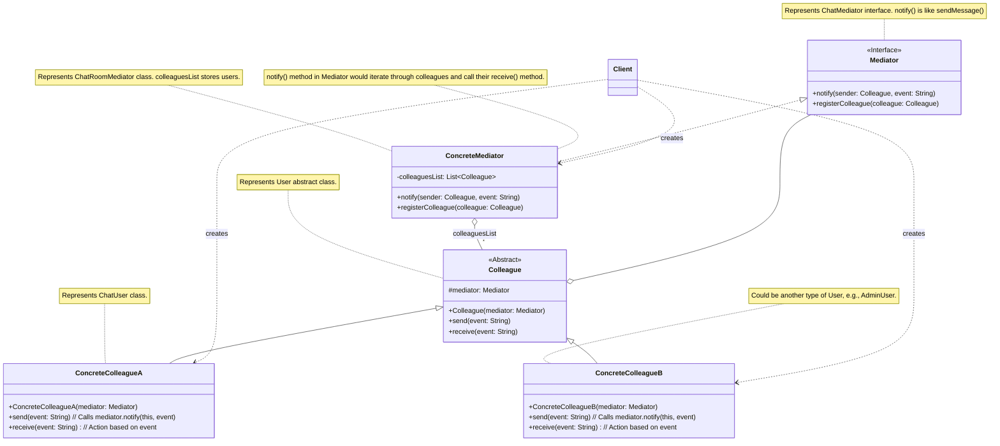

---
### 18. 备忘录模式 (Memento Pattern)

**特点（关键字）：** 状态保存、撤销恢复、封装状态、外部化内部状态。

**使用场景：**
- 当需要保存一个对象在某个时刻的（部分）状态，以便在将来可以将对象恢复到这个状态时。
- 当直接暴露对象的内部状态来实现保存和恢复会破坏对象的封装性时。备忘录模式可以将状态的保存和恢复过程封装起来，对外部隐藏对象的内部细节。
- 例如：文本编辑器的撤销/重做功能、游戏存档和读档、数据库事务的回滚。

**示例代码 (Java)：** (以文本编辑器内容保存与恢复为例)

```java
import java.util.ArrayList;
import java.util.List;
import java.util.Stack; // For Caretaker to manage mementos

/**
 * 备忘录 (Memento)
 * 存储发起人 (Originator) 对象的内部状态。发起人根据需要决定备忘录存储自身的哪些内部状态。
 * 防止发起人以外的其他对象访问备忘录。备忘录实际上有两个接口：
 *   - 管理者 (Caretaker) 只能看到备忘录的窄接口——它只能将备忘录传递给其他对象。
 *   - 发起人 (Originator) 能看到一个宽接口，允许它访问返回到先前状态所需的所有数据。
 * 理想情况下，只有发起人才能产生和消费备忘录。
 *
 * 在Java中，可以通过将Memento作为Originator的内部类，并将其状态设为私有，
 * 或者通过包级私有等方式限制访问。
 * 为了简单起见，这里将状态设为包级私有或通过getter（仅供Originator使用）。
 */
class EditorMemento {
    // 状态应该是不可变的，或者至少不被Caretaker修改
    private final String content; // 编辑器内容
    private final String fontName;
    private final int fontSize;

    // 构造函数由Originator调用
    public EditorMemento(String content, String fontName, int fontSize) {
        this.content = content;
        this.fontName = fontName;
        this.fontSize = fontSize;
        System.out.println("备忘录: 已创建。内容快照='" + content.substring(0, Math.min(content.length(), 10)) + "...', 字体=" + fontName + ", 大小=" + fontSize);
    }

    // Getter方法，理论上只应该被Originator调用来恢复状态
    // 为了简化，这里设为public，但实际应用中应严格控制访问权限
    public String getContent() {
        return content;
    }

    public String getFontName() {
        return fontName;
    }

    public int getFontSize() {
        return fontSize;
    }

    @Override
    public String toString() {
        return "Memento[content='" + content.substring(0, Math.min(content.length(), 10)) + "...', font=" + fontName + ", size=" + fontSize + "]";
    }
}

/**
 * 发起人 (Originator) - 文本编辑器
 * 创建一个备忘录，用以记录当前时刻它的内部状态。
 * 使用备忘录恢复内部状态。
 */
class TextEditor {
    private StringBuilder content; // 当前内容
    private String fontName;
    private int fontSize;

    public TextEditor() {
        this.content = new StringBuilder();
        this.fontName = "Arial";
        this.fontSize = 12;
        System.out.println("文本编辑器: 已初始化。默认字体: " + fontName + ", 大小: " + fontSize);
    }

    public void type(String text) {
        this.content.append(text);
        System.out.println("文本编辑器: 输入了 '" + text + "'. 当前内容: '" + this.content.toString() + "'");
    }

    public void setFont(String fontName, int fontSize) {
        this.fontName = fontName;
        this.fontSize = fontSize;
        System.out.println("文本编辑器: 字体设置为 " + fontName + ", 大小 " + fontSize);
    }

    public String getContent() {
        return content.toString();
    }

    // 创建备忘录，保存当前状态
    public EditorMemento save() {
        System.out.println("文本编辑器: 请求保存当前状态...");
        return new EditorMemento(this.content.toString(), this.fontName, this.fontSize);
    }

    // 从备忘录恢复状态
    public void restore(EditorMemento memento) {
        if (memento != null) {
            this.content = new StringBuilder(memento.getContent());
            this.fontName = memento.getFontName();
            this.fontSize = memento.getFontSize();
            System.out.println("文本编辑器: 从备忘录恢复状态。当前内容: '" + this.content.toString() +
                               "', 字体: " + this.fontName + ", 大小: " + this.fontSize);
        } else {
            System.out.println("文本编辑器: 备忘录为空，无法恢复。");
        }
    }

    public void printState() {
        System.out.println("编辑器当前状态: 内容='" + content.toString() +
                           "', 字体='" + fontName + "', 大小=" + fontSize);
    }
}

/**
 * 管理者 (Caretaker) - 历史记录
 * 负责保存好备忘录。
 * 不能对备忘录的内容进行操作或检查。
 */
class History {
    private Stack<EditorMemento> mementos = new Stack<>(); // 使用栈来存储历史状态，方便撤销

    public void push(EditorMemento memento) {
        if (memento != null) {
            mementos.push(memento);
            System.out.println("历史记录: 已保存一个备忘录 (" + memento + ")。当前历史记录数: " + mementos.size());
        }
    }

    public EditorMemento pop() {
        if (!mementos.isEmpty()) {
            EditorMemento memento = mementos.pop();
            System.out.println("历史记录: 弹出一个备忘录 (" + memento + ")。剩余历史记录数: " + mementos.size());
            return memento;
        }
        System.out.println("历史记录: 没有更多备忘录可供弹出。");
        return null; // 或者抛出异常
    }

    public EditorMemento peek() {
        if (!mementos.isEmpty()) {
            return mementos.peek();
        }
        return null;
    }

    public boolean isEmpty() {
        return mementos.isEmpty();
    }
}


/**
 * 客户端代码
 */
public class MementoClient {
    public static void main(String[] args) {
        // 创建发起人 (编辑器) 和管理者 (历史记录)
        TextEditor editor = new TextEditor();
        History history = new History();

        System.out.println("\n--- 初始编辑 ---");
        editor.type("这是第一行内容。");
        editor.setFont("Times New Roman", 14);
        history.push(editor.save()); // 保存状态1
        editor.printState();

        System.out.println("\n--- 第二次编辑 ---");
        editor.type("这是第二行内容，添加了一些新文本。");
        history.push(editor.save()); // 保存状态2
        editor.printState();

        System.out.println("\n--- 第三次编辑 ---");
        editor.setFont("Consolas", 16);
        editor.type("最后修改了字体和大小。");
        history.push(editor.save()); // 保存状态3
        editor.printState();

        System.out.println("\n--- 开始撤销操作 ---");

        // 撤销到状态2
        System.out.println("\n撤销1 (回到状态2):");
        EditorMemento memento2 = history.pop(); // 弹出状态3的备忘录
        editor.restore(memento2); // 编辑器恢复到状态3 (因为pop的是最近的，所以是状态3)
                                  // 这里应该是 editor.restore(history.pop()) 或者先pop再restore
                                  // 为了清晰，我们先pop，再用下一个pop的结果来restore
        // 正确的撤销逻辑：
        // history.pop(); // 弹出并丢弃当前状态 (状态3) 的备忘录，因为我们想恢复到它之前的状态
        // editor.restore(history.peek()); // 查看并恢复到栈顶的状态 (状态2)
        // 或者更常见的：
        editor.restore(history.pop()); // 弹出状态3的备忘录，并用它恢复 (这是错误的撤销逻辑，应该是恢复到上一个状态)
                                       // 正确：先弹出当前状态的备忘录，再用下一个弹出的备忘录恢复
        // 修正撤销逻辑：
        // 假设当前是状态3，我们要撤销到状态2
        // history.pop(); // 弹出状态3的备忘录 (当前状态)
        // editor.restore(history.pop()); // 弹出状态2的备忘录并恢复
        // 为了简单演示，我们直接用pop出的memento恢复，表示恢复到该memento记录的状态

        // 让我们重新模拟正确的撤销：
        // 当前编辑器是状态3，历史中有 状态1, 状态2, 状态3 的备忘录
        System.out.println("\n撤销 (回到上一个状态 - 状态2):");
        editor.restore(history.pop()); // history.pop() 返回状态3的备忘录，编辑器恢复到状态3 (这仍然是恢复到最近保存的)
                                       // 实际上，Caretaker通常只负责存储，客户端决定何时保存和恢复
                                       // 撤销通常是恢复到 "上一个" 状态，所以需要pop两次或pop一次然后用peek
        // 让我们采用更标准的撤销：
        // 当前编辑器是状态3，历史栈顶是状态3的备忘录
        // 想要撤销到状态2：
        // 1. 获取状态2的备忘录
        // 2. 编辑器用状态2的备忘录恢复
        // 假设我们已经执行了三次编辑并保存了三次。
        // history 栈: [memento1, memento2, memento3(栈顶)]
        // editor 当前是状态3

        System.out.println("\n--- 正确的撤销演示 ---");
        // 撤销到上一个状态 (状态2)
        if (!history.isEmpty()) {
            System.out.println("撤销操作: 恢复到上一个保存点。");
            editor.restore(history.pop()); // 弹出状态3的备忘录，并用它恢复。这会使编辑器回到状态3。
                                           // 如果要回到状态2，应该是 history.pop() 丢弃状态3，然后 editor.restore(history.pop())
                                           // 或者 editor.restore(history.peek()) 如果不想从历史中移除
        }
        // 为了演示逐级撤销，我们假设pop就是恢复到那个弹出的状态
        // 当前栈: [memento1, memento2] 编辑器状态是memento3对应的状态
        editor.printState();


        // 撤销到状态1
        if (!history.isEmpty()) {
            System.out.println("\n再次撤销 (恢复到再上一个保存点 - 状态1):");
            editor.restore(history.pop()); // 弹出状态2的备忘录，编辑器恢复到状态2
        }
        editor.printState();

        // 再次撤销
        if (!history.isEmpty()) {
            System.out.println("\n再次撤销 (恢复到最初始的保存点 - 状态0或初始):");
            editor.restore(history.pop()); // 弹出状态1的备忘录，编辑器恢复到状态1
        }
        editor.printState();

        // 历史记录已空
        if (!history.isEmpty()) {
            editor.restore(history.pop());
        } else {
            System.out.println("\n历史记录已空，无法再撤销。");
        }
        editor.printState();

        System.out.println("\n--- 尝试在历史记录为空时恢复 ---");
        editor.restore(history.pop()); // 应该返回null或提示错误
        editor.printState();
    }
}
```
**注意：** 上述客户端的撤销逻辑为了简化，直接使用了`history.pop()`返回的备忘录进行恢复。在更完善的撤销/重做系统中，`Caretaker`可能需要维护两个栈（一个用于撤销，一个用于重做），或者客户端在调用`restore`前，先从`Caretaker`获取合适的备忘录。简单起见，这里的`pop()`可以理解为“获取并移除最近的存档点”，然后用这个存档点来恢复。

**形象类比：**
*   **游戏存档/读档**：
    *   **发起人 (Originator)**：游戏角色或整个游戏世界。它包含了角色的等级、装备、位置，以及世界的状态等。
    *   **备忘录 (Memento)**：一个游戏存档文件。这个文件保存了游戏在某个特定时间点的所有相关状态。
    *   **管理者 (Caretaker)**：游戏存档管理器或玩家自己。它负责保存多个存档文件（备忘录），并在需要时选择一个存档来恢复游戏。
    玩家在游戏的关键节点（比如打败一个Boss后）会创建一个存档（发起人创建备忘录，管理者保存）。如果之后玩家角色死亡或者想回到之前的状态，就可以选择一个存档文件（管理者提供备忘录），游戏角色（发起人）就会恢复到那个存档点时的状态。存档文件对玩家来说是黑盒，玩家不能直接修改存档文件的内容，只能通过游戏程序来加载它。

*   **浏览器历史记录的“后退”按钮**：
    *   **发起人**：浏览器当前显示的网页状态（URL、滚动位置、表单内容等）。
    *   **备忘录**：每次访问新页面或页面状态改变时，浏览器记录的一个历史条目。
    *   **管理者**：浏览器的历史记录管理器（通常是一个栈）。
    当你点击“后退”按钮时，浏览器会从历史记录栈中取出上一个备忘录，并将当前页面恢复到那个备忘录所记录的状态。

备忘录模式的核心在于封装对象的状态，并将其存储在发起人对象之外，同时又不破坏发起人的封装性。管理者（Caretaker）只负责保管备忘录，不关心其内容。

**Mermaid 结构化说明：**

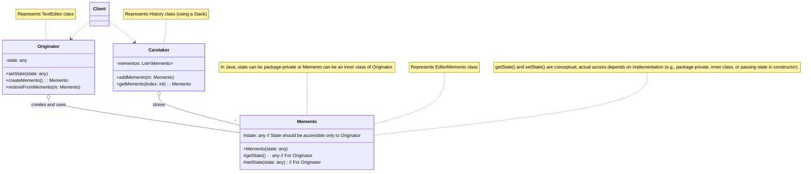

---
### 19. 观察者模式 (Observer Pattern)

**特点（关键字）：** 发布-订阅、一对多依赖、状态变更通知、松耦合。

**使用场景：**
- 当一个对象的改变需要同时改变其他对象，而不知道具体有多少对象有待改变时。
- 当一个抽象模型有两个方面，其中一个方面依赖于另一个方面。将这两者封装在独立的对象中以允许它们各自独立地改变和复用。
- 当一个对象（发布者/主题）的状态发生变化时，所有依赖于它的对象（订阅者/观察者）都应该得到通知并自动更新。
- 例如：GUI事件处理（按钮点击后，多个监听器响应）、消息队列、股票价格变动通知订阅者、社交媒体中关注用户后收到其动态更新。

**示例代码 (Java)：** (以天气预报站为例)

```java
import java.util.ArrayList;
import java.util.List;

/**
 * 观察者接口 (Observer)
 * 定义了一个更新接口，用于在主题状态发生改变时通知观察者。
 */
interface WeatherObserver {
    void update(float temperature, float humidity, float pressure); // 当天气数据更新时调用
    String getObserverName();
}

/**
 * 主题接口 (Subject / Observable)
 * 定义了注册、移除和通知观察者的方法。
 */
interface WeatherSubject {
    void registerObserver(WeatherObserver observer);
    void removeObserver(WeatherObserver observer);
    void notifyObservers(); // 通知所有注册的观察者
}

/**
 * 具体主题 (ConcreteSubject) - 天气数据站
 * 存储状态，并在状态发生改变时向所有已注册的观察者发出通知。
 */
class WeatherDataStation implements WeatherSubject {
    private List<WeatherObserver> observers;
    private float temperature;
    private float humidity;
    private float pressure;

    public WeatherDataStation() {
        this.observers = new ArrayList<>();
        System.out.println("天气数据站: 已启动。");
    }

    @Override
    public void registerObserver(WeatherObserver observer) {
        if (observer != null && !observers.contains(observer)) {
            observers.add(observer);
            System.out.println("天气数据站: 观察者 '" + observer.getObserverName() + "' 已注册。");
        } else if (observer != null) {
            System.out.println("天气数据站: 观察者 '" + observer.getObserverName() + "' 已存在，无需重复注册。");
        }
    }

    @Override
    public void removeObserver(WeatherObserver observer) {
        if (observers.remove(observer)) {
            System.out.println("天气数据站: 观察者 '" + observer.getObserverName() + "' 已移除。");
        } else {
            System.out.println("天气数据站: 未找到观察者 '" + (observer != null ? observer.getObserverName() : "null") + "'，无法移除。");
        }
    }

    @Override
    public void notifyObservers() {
        System.out.println("天气数据站: 准备通知 " + observers.size() + " 个观察者天气变化...");
        if (observers.isEmpty()) {
            System.out.println("天气数据站: 没有观察者需要通知。");
            return;
        }
        for (WeatherObserver observer : observers) {
            System.out.println("天气数据站: 通知观察者 '" + observer.getObserverName() + "'...");
            observer.update(temperature, humidity, pressure);
        }
        System.out.println("天气数据站: 所有观察者通知完毕。");
    }

    // 当天气数据发生变化时调用此方法
    public void setMeasurements(float temperature, float humidity, float pressure) {
        System.out.println("\n天气数据站: 收到新的气象数据 - 温度: " + temperature + "°C, 湿度: " + humidity + "%, 气压: " + pressure + "hPa");
        this.temperature = temperature;
        this.humidity = humidity;
        this.pressure = pressure;
        measurementsChanged();
    }

    // 内部方法，当数据变化时触发通知
    private void measurementsChanged() {
        System.out.println("天气数据站: 气象数据已更新，即将通知观察者。");
        notifyObservers();
    }

    // Getters for state (optional, for pull-style updates or direct access)
    public float getTemperature() { return temperature; }
    public float getHumidity() { return humidity; }
    public float getPressure() { return pressure; }
}

/**
 * 具体观察者A (ConcreteObserverA) - 当前状况显示板
 * 实现 Observer 接口，以便在主题状态改变时更新自身状态。
 */
class CurrentConditionsDisplay implements WeatherObserver {
    private String name = "当前状况显示板";
    private float temperature;
    private float humidity;
    private WeatherSubject weatherStation; // 可选，用于取消注册或拉取数据

    public CurrentConditionsDisplay(WeatherSubject weatherStation) {
        this.weatherStation = weatherStation;
        weatherStation.registerObserver(this); // 构造时自动注册
        System.out.println(name + ": 已创建并注册到天气数据站。");
    }

    @Override
    public void update(float temperature, float humidity, float pressure) {
        this.temperature = temperature;
        this.humidity = humidity;
        System.out.println(name + ": 收到更新 -> 当前温度: " + temperature + "°C, 湿度: " + humidity + "%");
        display();
    }

    public void display() {
        System.out.println(name + " 显示: 温度 " + temperature + "°C, 湿度 " + humidity + "%");
    }

    @Override
    public String getObserverName() {
        return name;
    }

    public void deregister() {
        weatherStation.removeObserver(this);
        System.out.println(name + ": 已从天气数据站取消注册。");
    }
}

/**
 * 具体观察者B (ConcreteObserverB) - 天气预报显示板
 */
class ForecastDisplay implements WeatherObserver {
    private String name = "天气预报显示板";
    private float currentPressure;
    private float lastPressure;
    private WeatherSubject weatherStation;

    public ForecastDisplay(WeatherSubject weatherStation) {
        this.weatherStation = weatherStation;
        this.currentPressure = 0.0f; // Initialize
        this.lastPressure = 0.0f;
        weatherStation.registerObserver(this);
        System.out.println(name + ": 已创建并注册到天气数据站。");
    }

    @Override
    public void update(float temperature, float humidity, float pressure) {
        lastPressure = currentPressure;
        currentPressure = pressure;
        System.out.println(name + ": 收到更新 -> 当前气压: " + currentPressure + "hPa (上次气压: " + lastPressure + "hPa)");
        display();
    }

    public void display() {
        System.out.print(name + " 预报: ");
        if (currentPressure > lastPressure && lastPressure != 0.0f) {
            System.out.println("天气正在好转！");
        } else if (currentPressure < lastPressure && lastPressure != 0.0f) {
            System.out.println("注意，天气可能变差，留意降雨。");
        } else if (currentPressure == lastPressure && lastPressure != 0.0f) {
            System.out.println("天气持续稳定。");
        } else {
            System.out.println("气压数据不足，无法准确预报。");
        }
    }
     @Override
    public String getObserverName() {
        return name;
    }
}


/**
 * 客户端代码
 */
public class ObserverClient {
    public static void main(String[] args) {
        // 1. 创建具体主题对象 (天气数据站)
        WeatherDataStation weatherStation = new WeatherDataStation();

        // 2. 创建具体观察者对象，并将它们注册到主题
        System.out.println("\n--- 创建并注册观察者 ---");
        CurrentConditionsDisplay currentDisplay = new CurrentConditionsDisplay(weatherStation);
        ForecastDisplay forecastDisplay = new ForecastDisplay(weatherStation);
        // 可以创建更多不同类型的观察者
        // StatisticsDisplay statisticsDisplay = new StatisticsDisplay(weatherStation);

        // 3. 模拟天气数据变化，主题会自动通知所有观察者
        System.out.println("\n--- 第一次天气数据更新 ---");
        weatherStation.setMeasurements(25.0f, 65.0f, 1012.5f);

        System.out.println("\n--- 第二次天气数据更新 ---");
        weatherStation.setMeasurements(26.5f, 70.0f, 1010.0f);

        System.out.println("\n--- 一个观察者取消注册 ---");
        currentDisplay.deregister(); // 当前状况显示板不再接收更新

        System.out.println("\n--- 第三次天气数据更新 (currentDisplay 不应收到) ---");
        weatherStation.setMeasurements(22.0f, 60.0f, 1015.0f);

        System.out.println("\n--- 尝试移除一个未注册的观察者 ---");
        weatherStation.removeObserver(currentDisplay); // 应该提示未找到

        System.out.println("\n--- 再次注册 currentDisplay ---");
        weatherStation.registerObserver(currentDisplay);

        System.out.println("\n--- 第四次天气数据更新 (所有观察者都应收到) ---");
        weatherStation.setMeasurements(28.0f, 55.0f, 1008.0f);
    }
}
```

**形象类比：**
*   **报纸/杂志订阅**：
    *   **主题 (WeatherSubject)**：报社或杂志社。
    *   **具体主题 (WeatherDataStation)**：某个特定的报纸（如《人民日报》）或杂志（如《读者》）。
    *   **观察者 (WeatherObserver)**：订阅者。
    *   **具体观察者 (CurrentConditionsDisplay, ForecastDisplay)**：张三、李四等具体的订阅了该报纸/杂志的人。
    当报社（主题）出版了新的一期报纸（状态变更）时，它会通知所有订阅了这份报纸的读者（观察者），并将报纸邮寄给他们（调用观察者的`update`方法）。读者不需要每天去报社问有没有新报纸，报社会主动通知。读者可以随时订阅或取消订阅。

*   **微信公众号关注**：
    *   **主题**：微信公众号平台。
    *   **具体主题**：某个具体的公众号（如“技术胖”、“码农翻身”）。
    *   **观察者**：微信用户。
    *   **具体观察者**：关注了该公众号的用户。
    当公众号发布了新的文章（状态变更）时，所有关注了该公众号的用户（观察者）都会收到推送通知。用户可以自由关注或取关公众号。

观察者模式定义了对象之间的一对多依赖关系，当一个对象（主题）的状态发生改变时，所有依赖于它的对象（观察者）都会得到通知并自动更新。这使得主题和观察者之间的耦合度降低。

**推模型 (Push Model) vs. 拉模型 (Pull Model):**
*   **推模型**：主题在通知观察者时，主动将所有变化的数据（或观察者可能需要的数据）推送给观察者（如示例中的`update(temperature, humidity, pressure)`）。观察者被动接收。优点是观察者简单，缺点是如果观察者只需要部分数据，可能会造成不必要的传输。
*   **拉模型**：主题在通知观察者时，只告诉观察者“状态变了”，观察者自己决定何时以及从主题那里拉取哪些数据。观察者在`update`方法中会持有一个主题的引用，通过这个引用调用主题的`getState()`等方法获取数据。优点是按需获取，缺点是观察者需要知道主题的接口，耦合度相对高一些。
示例代码主要演示了推模型。

**Mermaid 结构化说明：**

```mermaid
classDiagram
    Subject <|.. ConcreteSubject
    Observer <|.. ConcreteObserverA
    Observer <|.. ConcreteObserverB
    ConcreteSubject o-- "*" Observer : observersList
    Client ..> ConcreteSubject
    Client ..> ConcreteObserverA
    Client ..> ConcreteObserverB

    class Subject {
        <<Interface>>
        +registerObserver(o: Observer)
        +removeObserver(o: Observer)
        +notifyObservers()
    }
    class ConcreteSubject {
        -observersList: List~Observer~
        -state: any
        +registerObserver(o: Observer)
        +removeObserver(o: Observer)
        +notifyObservers()
        +getState(): any
        +setState(newState: any) // Triggers notifyObservers()
    }
    class Observer {
        <<Interface>>
        +update(state: any) // Push model
        // +update(subject: Subject) // Pull model
    }
    class ConcreteObserverA {
        -observerState: any
        +update(state: any)
        // +update(subject: Subject) { this.observerState = subject.getState(); }
    }
    class ConcreteObserverB {
        -observerState: any
        +update(state: any)
    }
    class Client {
    }

    note for Subject "Represents WeatherSubject interface"
    note for ConcreteSubject "Represents WeatherDataStation class"
    note for Observer "Represents WeatherObserver interface"
    note for ConcreteObserverA "Represents CurrentConditionsDisplay"
    note for ConcreteObserverB "Represents ForecastDisplay"
    note for ConcreteSubject "setState() internally calls notifyObservers()"
    note for Observer "The update method can pass specific state (push) or the subject itself (pull)."
```

---
### 20. 状态模式 (State Pattern)

**特点（关键字）：** 行为随状态改变、封装状态相关行为、避免大量条件判断、状态转换。

**使用场景：**
- 当一个对象的行为取决于它的状态，并且它必须在运行时根据状态改变它的行为时。
- 当一个操作中含有庞大的多分支条件语句，且这些分支依赖于该对象的状态时。状态模式将每个条件分支放入独立的类中，使得你可以根据对象当前的状态改变其行为，而无需改变对象的类。
- 例如：自动售货机的状态（空闲、已投币、已选择商品、售罄）、TCP连接的状态（LISTEN, SYN-SENT, ESTABLISHED, FIN-WAIT等）、订单状态（待支付、已支付、已发货、已完成、已取消）。

**示例代码 (Java)：** (以自动售货机为例)

```java
/**
 * 状态接口 (State)
 * 定义一个接口以封装与 Context 的一个特定状态相关的行为。
 */
interface VendingMachineState {
    void insertCoin(VendingMachine machine);    // 投币
    void pressButton(VendingMachine machine);   // 按下按钮选择商品
    void dispenseItem(VendingMachine machine);  // 出货
    void refill(VendingMachine machine, int itemCount); // 补货 (通常由管理员操作，可能不属于标准用户流程)
    String getStateName();
}

/**
 * 具体状态A (ConcreteStateA) - 空闲状态 (NoCoinState)
 * 每一个子类实现一个与 Context 的一个状态相关的行为。
 */
class NoCoinState implements VendingMachineState {
    @Override
    public void insertCoin(VendingMachine machine) {
        System.out.println("空闲状态: 已投币。");
        machine.addCoin();
        if (machine.getItemCount() > 0) {
            machine.setState(machine.getHasCoinState()); // 转换到已投币状态
            System.out.println("状态转换: 空闲 -> 已投币");
        } else {
            System.out.println("空闲状态: 商品已售罄，请勿投币。正在退币...");
            machine.returnCoin(); // 即使投币了，如果售罄也应退币
            // 状态保持在NoCoinState，但提示售罄
        }
    }

    @Override
    public void pressButton(VendingMachine machine) {
        System.out.println("空闲状态: 请先投币再选择商品。");
    }

    @Override
    public void dispenseItem(VendingMachine machine) {
        System.out.println("空闲状态: 请先投币并选择商品。");
    }

    @Override
    public void refill(VendingMachine machine, int itemCount) {
        System.out.println("空闲状态: 管理员正在补货 " + itemCount + " 件。");
        machine.addItem(itemCount);
        if (machine.getItemCount() > 0 && machine.getCoinCount() == 0) {
             // 如果补货后有商品且无币，则保持NoCoinState
        } else if (machine.getItemCount() > 0 && machine.getCoinCount() > 0) {
            machine.setState(machine.getHasCoinState()); // 如果有币，则转到HasCoinState
            System.out.println("状态转换: 空闲 -> 已投币 (因补货时已有币)");
        }
        // 如果补货后仍售罄 (itemCount为0)，则保持NoCoinState并提示售罄
    }

    @Override
    public String getStateName() { return "空闲状态 (NoCoinState)"; }
}

/**
 * 具体状态B (ConcreteStateB) - 已投币状态 (HasCoinState)
 */
class HasCoinState implements VendingMachineState {
    @Override
    public void insertCoin(VendingMachine machine) {
        System.out.println("已投币状态: 您已投币，请勿重复投币。");
        machine.addCoin(); // 允许多次投币，或在此处设计退还多余硬币的逻辑
        System.out.println("已投币状态: 又投入一枚硬币，当前硬币数: " + machine.getCoinCount());
    }

    @Override
    public void pressButton(VendingMachine machine) {
        System.out.println("已投币状态: 您按下了按钮，准备出货...");
        if (machine.getItemCount() > 0) {
            machine.setState(machine.getSoldState()); // 转换到售出状态
            System.out.println("状态转换: 已投币 -> 售出商品");
            // machine.dispenseItem(); // 实际出货动作在SoldState中处理，或者由Context在状态转换后调用
        } else {
            System.out.println("已投币状态: 商品已售罄。正在退币...");
            machine.returnCoin();
            machine.setState(machine.getNoCoinState()); // 转换回无币状态
            System.out.println("状态转换: 已投币 -> 空闲 (因售罄)");
        }
    }

    @Override
    public void dispenseItem(VendingMachine machine) {
        System.out.println("已投币状态: 请先按下按钮选择商品。");
    }

    @Override
    public void refill(VendingMachine machine, int itemCount) {
        System.out.println("已投币状态: 管理员正在补货 " + itemCount + " 件。当前操作不影响已投币状态。");
        machine.addItem(itemCount);
    }
    @Override
    public String getStateName() { return "已投币状态 (HasCoinState)"; }
}

/**
 * 具体状态C (ConcreteStateC) - 售出商品状态 (SoldState)
 */
class SoldState implements VendingMachineState {
    @Override
    public void insertCoin(VendingMachine machine) {
        System.out.println("售出商品状态: 请稍等，正在出货，无法投币。");
    }

    @Override
    public void pressButton(VendingMachine machine) {
        System.out.println("售出商品状态: 请稍等，正在出货，请勿重复按按钮。");
    }

    @Override
    public void dispenseItem(VendingMachine machine) {
        System.out.println("售出商品状态: 正在出货...");
        machine.releaseItem(); // 实际减少商品数量
        machine.useCoin();   // 消耗硬币
        if (machine.getItemCount() > 0) {
            if (machine.getCoinCount() > 0) { // 如果还有剩余硬币（例如支持一次购买多个）
                machine.setState(machine.getHasCoinState());
                System.out.println("状态转换: 售出商品 -> 已投币 (仍有余额或可继续购买)");
            } else {
                machine.setState(machine.getNoCoinState());
                System.out.println("状态转换: 售出商品 -> 空闲");
            }
        } else {
            machine.setState(machine.getSoldOutState());
            System.out.println("状态转换: 售出商品 -> 已售罄");
            if(machine.getCoinCount() > 0) { // 如果出完最后一个商品后还有币，则退币
                System.out.println("商品已售罄，退还剩余硬币。");
                machine.returnCoin();
            }
        }
    }
    @Override
    public void refill(VendingMachine machine, int itemCount) {
        System.out.println("售出商品状态: 正在出货，管理员请稍后补货。");
    }
    @Override
    public String getStateName() { return "售出商品状态 (SoldState)"; }
}

/**
 * 具体状态D (ConcreteStateD) - 商品售罄状态 (SoldOutState)
 */
class SoldOutState implements VendingMachineState {
    @Override
    public void insertCoin(VendingMachine machine) {
        System.out.println("已售罄状态: 商品已售罄，请勿投币。");
        // 应该有退币逻辑，如果机器设计为接受投币后才发现售罄
        // machine.returnCoin(); // 假设投币动作会先被NoCoinState处理，如果售罄会直接退币
    }

    @Override
    public void pressButton(VendingMachine machine) {
        System.out.println("已售罄状态: 商品已售罄，按按钮无效。");
    }

    @Override
    public void dispenseItem(VendingMachine machine) {
        System.out.println("已售罄状态: 商品已售罄，无法出货。");
    }

    @Override
    public void refill(VendingMachine machine, int itemCount) {
        System.out.println("已售罄状态: 管理员正在补货 " + itemCount + " 件。");
        machine.addItem(itemCount);
        if (machine.getItemCount() > 0) {
            if (machine.getCoinCount() > 0) { // 如果之前有用户投币但因售罄未成功
                machine.setState(machine.getHasCoinState());
                System.out.println("状态转换: 已售罄 -> 已投币 (补货后，且之前有币)");
            } else {
                machine.setState(machine.getNoCoinState());
                System.out.println("状态转换: 已售罄 -> 空闲 (补货后)");
            }
        } else {
            System.out.println("补货数量为0或无效，仍处于售罄状态。");
        }
    }
    @Override
    public String getStateName() { return "已售罄状态 (SoldOutState)"; }
}


/**
 * 上下文 (Context) - 自动售货机
 * 定义客户感兴趣的接口。
 * 维护一个 ConcreteState 子类的实例，这个实例定义当前状态。
 */
class VendingMachine {
    private VendingMachineState noCoinState;
    private VendingMachineState hasCoinState;
    private VendingMachineState soldState;
    private VendingMachineState soldOutState;

    private VendingMachineState currentState;
    private int itemCount = 0; // 商品数量
    private int coinCount = 0; // 当前投入的硬币数量 (简化为1元1件商品)

    public VendingMachine(int initialItemCount) {
        noCoinState = new NoCoinState();
        hasCoinState = new HasCoinState();
        soldState = new SoldState();
        soldOutState = new SoldOutState();

        this.itemCount = initialItemCount;
        if (initialItemCount > 0) {
            currentState = noCoinState;
        } else {
            currentState = soldOutState;
        }
        System.out.println("自动售货机: 初始化完成。商品数量: " + itemCount + ", 当前状态: " + currentState.getStateName());
    }

    // 行为委托给当前状态对象
    public void insertCoin() {
        System.out.println("\n售货机操作: 投币");
        currentState.insertCoin(this);
        printMachineStatus();
    }

    public void pressButton() {
        System.out.println("\n售货机操作: 按下按钮");
        currentState.pressButton(this);
        // 注意：dispenseItem通常在状态转换后由新状态（如SoldState）或Context自身调用
        if (currentState instanceof SoldState) { // 如果状态变为SoldState，则立即尝试出货
            currentState.dispenseItem(this);
        }
        printMachineStatus();
    }

    // dispenseItem 由 SoldState 内部调用，或者由 Context 在转换到 SoldState 后调用
    // public void dispense() { // 这个方法可能不需要公开给客户端直接调用
    //     currentState.dispenseItem(this);
    // }

    public void refill(int numItems) {
        System.out.println("\n售货机操作: 管理员补货 " + numItems + " 件");
        currentState.refill(this, numItems);
        printMachineStatus();
    }


    // 内部方法，供状态对象调用以改变Context的状态
    void setState(VendingMachineState state) {
        this.currentState = state;
    }

    // Getters for states, so states can transition the context
    public VendingMachineState getNoCoinState() { return noCoinState; }
    public VendingMachineState getHasCoinState() { return hasCoinState; }
    public VendingMachineState getSoldState() { return soldState; }
    public VendingMachineState getSoldOutState() { return soldOutState; }

    // Getters and setters for item count and coin count
    public int getItemCount() { return itemCount; }
    public void addItem(int count) { this.itemCount += count; }
    public void releaseItem() { if (this.itemCount > 0) this.itemCount--; }

    public int getCoinCount() { return coinCount; }
    public void addCoin() { this.coinCount++; }
    public void useCoin() { if (this.coinCount > 0) this.coinCount--; } // 假设一次交易消耗一个硬币
    public void returnCoin() {
        if (this.coinCount > 0) {
            System.out.println("退回 " + this.coinCount + " 个硬币。");
            this.coinCount = 0;
        }
    }

    public void printMachineStatus() {
        System.out.println("售货机当前状态: " + currentState.getStateName() +
                           ", 商品剩余: " + itemCount +
                           ", 已投币数: " + coinCount);
    }
}


/**
 * 客户端代码
 */
public class StateClient {
    public static void main(String[] args) {
        // 初始化一台有5件商品的售货机
        VendingMachine machine = new VendingMachine(2); // 为了快速测试售罄，初始2件
        machine.printMachineStatus();

        System.out.println("\n--- 第一次购买 ---");
        machine.insertCoin();    // 投币 (NoCoin -> HasCoin)
        machine.pressButton();   // 按按钮 (HasCoin -> Sold -> NoCoin/SoldOut)

        System.out.println("\n--- 第二次购买 ---");
        machine.insertCoin();    // 投币
        machine.pressButton();   // 按按钮 (此时应该售罄了)

        System.out.println("\n--- 尝试在售罄后操作 ---");
        machine.insertCoin();    // 投币 (应提示售罄并可能退币)
        machine.pressButton();   // 按按钮 (应提示售罄)

        System.out.println("\n--- 管理员补货 ---");
        machine.refill(3);       // 补货3件 (SoldOut -> NoCoin)

        System.out.println("\n--- 补货后第一次购买 ---");
        machine.insertCoin();
        machine.pressButton();

        System.out.println("\n--- 连续投币 ---");
        machine.insertCoin(); // 第一次投币
        machine.insertCoin(); // 第二次投币 (HasCoinState允许多次投币)
        machine.pressButton(); // 购买

        System.out.println("\n--- 测试直接在已投币状态下补货 ---");
        machine.insertCoin(); // 确保是HasCoinState
        machine.refill(1);    // 在已投币状态下补货
        machine.pressButton(); // 购买
    }
}
```

**形象类比：**
*   **一个人的不同情绪状态**：
    *   **上下文 (VendingMachine)**：一个人。
    *   **状态 (State)**：情绪的抽象，如“开心”、“悲伤”、“愤怒”。
    *   **具体状态 (NoCoinState, HasCoinState等)**：具体的“开心状态”、“悲伤状态”、“愤怒状态”。
    当一个人处于“开心状态”时，他对外界的刺激（比如听到一个笑话）的反应可能是大笑（`handleRequest()`的一种实现）。当他处于“悲伤状态”时，对同一个笑话的反应可能是沉默或哭泣。当他处于“愤怒状态”时，反应可能是咆哮。
    这个人的行为（对同一事件的反应）随着他的内部情绪状态（具体状态对象）的改变而改变。状态的转换（比如从开心到悲伤）是由某些事件触发的。

*   **交通信号灯**：
    *   **上下文**：交通信号灯控制器。
    *   **状态**：“红灯亮”、“黄灯亮”、“绿灯亮”的抽象。
    *   **具体状态**：`RedLightState`, `YellowLightState`, `GreenLightState`。
    当信号灯处于`RedLightState`时，它的行为是“禁止通行”。经过一段时间后，它会自动转换到`GreenLightState`（或先到`YellowLightState`）。在`GreenLightState`时，行为是“允许通行”。每个状态都封装了该状态下的行为和转换逻辑。

状态模式允许一个对象在其内部状态改变时改变其行为，对象看起来似乎修改了它的类。它将与特定状态相关的行为局部化，并且将不同状态的行为分割开来。

**Mermaid 结构化说明：**

```mermaid
classDiagram
    Context o-- State
    State <|.. ConcreteStateA
    State <|.. ConcreteStateB
    Client ..> Context

    class State {
        <<Interface>>
        +handle(context: Context)
        +getStateName(): String
    }
    class ConcreteStateA {
        +handle(context: Context) // Implements behavior for state A
                                 // May change context's state: context.setState(new ConcreteStateB())
        +getStateName(): String
    }
    class ConcreteStateB {
        +handle(context: Context) // Implements behavior for state B
        +getStateName(): String
    }
    class Context {
        -currentState: State
        +Context(initialState: State)
        +setState(state: State)
        +request() // Delegates to currentState.handle(this)
        +printStatus()
    }
    class Client {
    }

    note for State "Represents VendingMachineState interface. handle() corresponds to insertCoin, pressButton etc."
    note for ConcreteStateA "Represents NoCoinState, HasCoinState, etc."
    note for Context "Represents VendingMachine class. request() corresponds to user actions like insertCoin(), pressButton()."
    note for ConcreteStateA "handle() method in ConcreteState often calls context.setState() to transition to another state."
```

---
### 21. 策略模式 (Strategy Pattern)

**特点（关键字）：** 定义算法族、封装算法、可互换算法、运行时选择算法、消除条件语句。

**使用场景：**
- 当你有许多相关的类，它们之间的区别仅仅是行为不同时。策略模式提供了一种用多个行为中的一个来配置一个类的方法。
- 当你需要一个算法的不同变体时。例如，你可能会定义一些算法，它们都完成相同的工作，但在速度、空间或精度方面有不同的权衡。
- 当算法使用客户不应该知道的数据时。可使用策略模式以避免暴露复杂的、与算法相关的数据结构。
- 当一个类定义了多种行为，并且这些行为以多个条件语句的形式出现时。将相关的条件分支移入它们各自的 Strategy 类中，以代替这些条件语句。
- 例如：支付方式选择（支付宝、微信支付、银行卡支付）、排序算法选择（冒泡排序、快速排序、归并排序）、出行方式选择（公交、地铁、出租车、自行车）。

**示例代码 (Java)：** (以支付方式为例)

```java
/**
 * 策略接口 (Strategy)
 * 定义所有支持的算法的公共接口。Context 使用这个接口来调用某个 ConcreteStrategy 定义的算法。
 */
interface PaymentStrategy {
    void pay(double amount); // 支付方法
    String getStrategyName();
}

/**
 * 具体策略A (ConcreteStrategyA) - 信用卡支付
 * 实现 Strategy 接口，封装具体的算法或行为。
 */
class CreditCardPayment implements PaymentStrategy {
    private String cardNumber;
    private String cardHolderName;
    private String cvv;
    private String expiryDate;

    public CreditCardPayment(String cardNumber, String cardHolderName, String cvv, String expiryDate) {
        this.cardNumber = cardNumber;
        this.cardHolderName = cardHolderName;
        this.cvv = cvv;
        this.expiryDate = expiryDate;
        System.out.println("初始化信用卡支付策略: 持卡人=" + cardHolderName + ", 卡号 (部分隐藏)=" + cardNumber.substring(0,4) + "********" + cardNumber.substring(cardNumber.length()-4));
    }

    @Override
    public void pay(double amount) {
        System.out.println("使用信用卡支付: 金额 $" + amount);
        System.out.println("  持卡人: " + cardHolderName);
        System.out.println("  卡号: " + cardNumber); // 实际应用中不应直接打印完整卡号
        System.out.println("  CVV: " + cvv + ", 有效期: " + expiryDate);
        System.out.println("信用卡支付成功！");
    }

    @Override
    public String getStrategyName() {
        return "信用卡支付";
    }
}

/**
 * 具体策略B (ConcreteStrategyB) - PayPal支付
 */
class PayPalPayment implements PaymentStrategy {
    private String email;
    private String password; // 实际应用中不应直接存储明文密码

    public PayPalPayment(String email, String password) {
        this.email = email;
        this.password = password;
        System.out.println("初始化PayPal支付策略: 邮箱=" + email);
    }

    @Override
    public void pay(double amount) {
        System.out.println("使用PayPal支付: 金额 $" + amount);
        System.out.println("  PayPal账户邮箱: " + email);
        // 模拟PayPal认证和支付过程
        System.out.println("PayPal支付成功！");
    }

    @Override
    public String getStrategyName() {
        return "PayPal支付";
    }
}

/**
 * 具体策略C (ConcreteStrategyC) - 比特币支付
 */
class BitcoinPayment implements PaymentStrategy {
    private String bitcoinAddress;

    public BitcoinPayment(String bitcoinAddress) {
        this.bitcoinAddress = bitcoinAddress;
        System.out.println("初始化比特币支付策略: 地址=" + bitcoinAddress);
    }

    @Override
    public void pay(double amount) {
        System.out.println("使用比特币支付: 金额 $" + amount + " (等值比特币)");
        System.out.println("  支付到比特币地址: " + bitcoinAddress);
        // 模拟比特币交易过程
        System.out.println("比特币支付已发起 (等待网络确认)。");
    }
    @Override
    public String getStrategyName() {
        return "比特币支付";
    }
}


/**
 * 上下文 (Context) - 购物车或订单
 * 配置一个 ConcreteStrategy 对象。
 * 维护一个对 Strategy 对象的引用。
 * 可定义一个接口，让 Strategy 访问它的数据。
 */
class ShoppingCart {
    private double totalAmount;
    private PaymentStrategy paymentStrategy; // 持有当前选择的支付策略

    public ShoppingCart(double totalAmount) {
        this.totalAmount = totalAmount;
        System.out.println("创建购物车，总金额: $" + totalAmount);
    }

    public void setPaymentStrategy(PaymentStrategy paymentStrategy) {
        this.paymentStrategy = paymentStrategy;
        System.out.println("购物车: 设置支付策略为 '" + (paymentStrategy != null ? paymentStrategy.getStrategyName() : "无") + "'");
    }

    public void checkout() {
        if (paymentStrategy == null) {
            System.out.println("购物车: 请先选择支付策略！");
            return;
        }
        System.out.println("购物车: 开始结算，总金额 $" + totalAmount);
        paymentStrategy.pay(totalAmount); // 调用策略对象的支付方法
        System.out.println("购物车: 结算完成。");
    }

    public double getTotalAmount() {
        return totalAmount;
    }
}

/**
 * 客户端代码
 */
public class StrategyClient {
    public static void main(String[] args) {
        // 创建购物车
        ShoppingCart cart = new ShoppingCart(150.75);

        // 场景1: 用户选择信用卡支付
        System.out.println("\n--- 场景1: 用户选择信用卡支付 ---");
        PaymentStrategy creditCard = new CreditCardPayment("1234-5678-9012-3456", "John Doe", "123", "12/25");
        cart.setPaymentStrategy(creditCard);
        cart.checkout();

        // 场景2: 用户切换到PayPal支付
        System.out.println("\n--- 场景2: 用户切换到PayPal支付 ---");
        // 假设购物车金额发生变化
        // cart = new ShoppingCart(200.00); // 或者修改原cart的金额
        PaymentStrategy payPal = new PayPalPayment("john.doe@example.com", "securePassword123");
        cart.setPaymentStrategy(payPal);
        cart.checkout();

        // 场景3: 用户选择比特币支付
        System.out.println("\n--- 场景3: 用户选择比特币支付 ---");
        PaymentStrategy bitcoin = new BitcoinPayment("1A1zP1eP5QGefi2DMPTfTL5SLmv7DivfNa");
        cart.setPaymentStrategy(bitcoin);
        cart.checkout();

        // 场景4: 未选择支付策略
        System.out.println("\n--- 场景4: 未选择支付策略 ---");
        ShoppingCart newCart = new ShoppingCart(50.00);
        newCart.checkout(); // 应提示选择策略

        System.out.println("\n--- 动态改变策略示例 ---");
        ShoppingCart dynamicCart = new ShoppingCart(99.99);
        System.out.println("用户初始选择PayPal支付...");
        dynamicCart.setPaymentStrategy(new PayPalPayment("user@test.com", "pwd"));
        dynamicCart.checkout();

        System.out.println("\n用户在结算前改变主意，选择信用卡支付...");
        dynamicCart.setPaymentStrategy(new CreditCardPayment("9876-5432-1098-7654", "Jane Smith", "456", "11/26"));
        dynamicCart.checkout();
    }
}
```

**形象类比：**
*   **出行旅游选择交通工具**：
    *   **上下文 (ShoppingCart)**：你（准备出行的旅客）。
    *   **策略接口 (PaymentStrategy)**：“交通方式”的抽象，都有一个“前往目的地”（`execute`或`pay`）的方法。
    *   **具体策略 (CreditCardPayment, PayPalPayment等)**：具体的交通工具，如“飞机策略”、“火车策略”、“自驾策略”。
    当你计划去某个地方旅游时（上下文），你可以根据距离、预算、时间等因素选择不同的交通工具（具体策略）。
    - 如果去国外，你可能会选择“飞机策略”。
    - 如果去邻近城市，你可能会选择“火车策略”。
    - 如果想自由行，你可能会选择“自驾策略”。
    你（上下文）持有一个选定的交通策略，并调用其“前往目的地”的方法。交通工具（策略）是可互换的，你可以在运行时改变你的选择。

*   **古代将军打仗选择计策**：
    *   **上下文**：将军。
    *   **策略接口**：“计策”的抽象，都有一个“执行计策”的方法。
    *   **具体策略**：“火攻计”、“水淹计”、“空城计”、“美人计”。
    将军（上下文）在面对不同的敌情和战场环境时，会选择不同的计策（具体策略）来应对。选择好计策后，就命令士兵执行。如果一个计策行不通，将军可以更换另一个计策。

策略模式使得算法可以独立于使用它的客户而变化。它将算法封装在独立的策略类中，使得它们可以相互替换。

**Mermaid 结构化说明：**

```mermaid
classDiagram
    Context o-- Strategy
    Strategy <|.. ConcreteStrategyA
    Strategy <|.. ConcreteStrategyB
    Strategy <|.. ConcreteStrategyC
    Client ..> Context
    Client ..> ConcreteStrategyA : creates
    Client ..> ConcreteStrategyB : creates
    Client ..> ConcreteStrategyC : creates

    class Strategy {
        <<Interface>>
        +algorithmInterface()
        +getStrategyName(): String
    }
    class ConcreteStrategyA {
        +algorithmInterface() // Implements algorithm A
        +getStrategyName(): String
    }
    class ConcreteStrategyB {
        +algorithmInterface() // Implements algorithm B
        +getStrategyName(): String
    }
    class ConcreteStrategyC {
        +algorithmInterface() // Implements algorithm C
        +getStrategyName(): String
    }
    class Context {
        -strategy: Strategy
        +Context()
        +setStrategy(strategy: Strategy)
        +contextInterface() // Calls strategy.algorithmInterface()
    }
    class Client {
    }

    note for Strategy "Represents PaymentStrategy interface. algorithmInterface() is pay()"
    note for ConcreteStrategyA "Represents CreditCardPayment"
    note for ConcreteStrategyB "Represents PayPalPayment"
    note for ConcreteStrategyC "Represents BitcoinPayment"
    note for Context "Represents ShoppingCart class. contextInterface() is checkout()"
```

---
### 22. 模板方法模式 (Template Method Pattern)

**特点（关键字）：** 定义算法骨架、延迟步骤到子类、固定流程、钩子方法、代码复用。

**使用场景：**
- 当一次性实现一个算法的不变部分，并将可变的行为留给子类来实现时。
- 当各个子类中公共的行为应被提取出来并集中到一个公共父类中以避免代码重复时。首先识别现有代码中的不同之处，并将不同之处分离为新的操作。最后，用一个调用这些新操作的模板方法来替换这些不同的代码。
- 当需要控制子类扩展时。模板方法只在特定点调用“钩子”操作（hook operations），这就允许在这些点进行扩展，而不是在其他地方。
- 例如：泡茶和泡咖啡（基本流程相似：烧水、冲泡、倒入杯中、加调料，但具体冲泡内容和调料不同）、简历制作（基本模块固定，具体内容由个人填写）、框架中的生命周期方法（如Servlet的`doGet`/`doPost`由`service`方法调用）。

**示例代码 (Java)：** (以制作饮料为例：咖啡和茶)

```java
/**
 * 抽象类 (AbstractClass)
 * 定义了一个或多个抽象操作，子类将实现它们。这些抽象操作是模板方法的组成部分。
 * 实现一个模板方法，定义一个算法的骨架。该模板方法调用原始操作以及其他在 AbstractClass 中定义的操作。
 */
abstract class BeverageMaker {

    // 模板方法，定义了制作饮料的算法骨架
    // final 修饰，防止子类重写算法流程
    public final void prepareBeverage() {
        System.out.println("\n--- 开始制作饮料 ---");
        boilWater();        // 步骤1: 烧水 (通用)
        brew();             // 步骤2: 冲泡 (子类实现)
        pourInCup();        // 步骤3: 倒入杯中 (通用)
        if (customerWantsCondiments()) { // 钩子方法，子类可选择是否覆盖
            addCondiments();    // 步骤4: 加调料 (子类实现)
        } else {
            System.out.println("顾客不需要调料。");
        }
        System.out.println("--- 饮料制作完成 ---");
    }

    // 具体方法 (通用步骤)
    private void boilWater() {
        System.out.println("步骤1: 把水烧开");
    }

    private void pourInCup() {
        System.out.println("步骤3: 把饮料倒入杯子");
    }

    // 抽象方法 (需要子类实现的特定步骤)
    protected abstract void brew();          // 冲泡
    protected abstract void addCondiments(); // 加调料

    // 钩子方法 (Hook Method)
    // 子类可以选择性地覆盖它，以改变算法的某些步骤
    // 默认需要调料
    protected boolean customerWantsCondiments() {
        System.out.println("钩子方法: 检查顾客是否需要调料 (默认: 是)");
        return true;
    }

    // 获取饮料名称，方便打印
    public abstract String getBeverageName();
}

/**
 * 具体类A (ConcreteClassA) - 制作咖啡
 * 实现 AbstractClass 以完成算法中与特定子类相关的步骤。
 */
class CoffeeMaker extends BeverageMaker {
    @Override
    protected void brew() {
        System.out.println("步骤2 (咖啡): 用沸水冲泡咖啡粉");
    }

    @Override
    protected void addCondiments() {
        System.out.println("步骤4 (咖啡): 加糖和牛奶");
    }

    @Override
    public String getBeverageName() {
        return "咖啡";
    }

    // 覆盖钩子方法，假设做咖啡时总是询问顾客
    @Override
    protected boolean customerWantsCondiments() {
        // 实际应用中可能会有更复杂的逻辑，比如从用户输入读取
        boolean wants = Math.random() > 0.3; // 模拟70%的概率需要调料
        System.out.println("钩子方法 (咖啡): 顾客是否需要糖和牛奶? " + (wants ? "是" : "否"));
        return wants;
    }
}

/**
 * 具体类B (ConcreteClassB) - 制作茶
 */
class TeaMaker extends BeverageMaker {
    @Override
    protected void brew() {
        System.out.println("步骤2 (茶): 用沸水浸泡茶叶");
    }

    @Override
    protected void addCondiments() {
        System.out.println("步骤4 (茶): 加柠檬");
    }

    @Override
    public String getBeverageName() {
        return "茶";
    }

    // 茶可以选择不覆盖钩子方法，使用父类的默认实现 (总是加调料)
    // 或者覆盖它，例如：泡茶默认不加调料
    @Override
    protected boolean customerWantsCondiments() {
        System.out.println("钩子方法 (茶): 顾客是否需要柠檬? (默认: 否，除非特别要求)");
        return false; // 假设默认清茶
    }
}

/**
 * 具体类C (ConcreteClassC) - 制作不加调料的热水
 */
class HotWaterMaker extends BeverageMaker {
    @Override
    protected void brew() {
        System.out.println("步骤2 (热水): 无需特殊冲泡，水已烧开。");
    }

    @Override
    protected void addCondiments() {
        // 此方法理论上不会被调用，因为钩子方法返回false
        System.out.println("步骤4 (热水): 不添加任何调料。");
    }

    @Override
    public String getBeverageName() {
        return "热水";
    }

    // 覆盖钩子方法，明确表示不需要调料
    @Override
    protected boolean customerWantsCondiments() {
        System.out.println("钩子方法 (热水): 热水不需要调料。");
        return false;
    }
}


/**
 * 客户端代码
 */
public class TemplateMethodClient {
    public static void main(String[] args) {
        System.out.println("--- 制作一杯咖啡 ---");
        BeverageMaker coffeeMaker = new CoffeeMaker();
        coffeeMaker.prepareBeverage();
        System.out.println("您点的 " + coffeeMaker.getBeverageName() + " 好了！");

        System.out.println("\n--- 制作一杯茶 ---");
        BeverageMaker teaMaker = new TeaMaker();
        teaMaker.prepareBeverage();
        System.out.println("您点的 " + teaMaker.getBeverageName() + " 好了！");

        System.out.println("\n--- 制作一杯热水 (不加调料) ---");
        BeverageMaker hotWaterMaker = new HotWaterMaker();
        hotWaterMaker.prepareBeverage();
        System.out.println("您点的 " + hotWaterMaker.getBeverageName() + " 好了！");

        System.out.println("\n--- 再次制作咖啡 (随机调料) ---");
        BeverageMaker coffeeMaker2 = new CoffeeMaker();
        coffeeMaker2.prepareBeverage();
        System.out.println("您点的 " + coffeeMaker2.getBeverageName() + " 好了！");
    }
}
```

**形象类比：**
*   **食谱制作菜肴**：
    *   **抽象类 (BeverageMaker)**：一本通用的“烹饪指南”或一个“菜系总纲”。它定义了做一类菜（比如“炒菜”）的基本步骤框架（模板方法 `prepareBeverage`）：1. 准备食材；2. 切配食材；3. 热锅烧油；4. 下锅翻炒（抽象方法 `brew`）；5. 加调料（抽象方法 `addCondiments`）；6. 出锅装盘。
    *   **具体类 (CoffeeMaker, TeaMaker)**：具体的菜谱，比如“鱼香肉丝菜谱”、“宫保鸡丁菜谱”。这些具体菜谱遵循“炒菜”的基本步骤框架，但在“下锅翻炒”和“加调料”这两个特定步骤上有自己的独特做法。
    *   **模板方法**：炒菜的整体流程（1-6步）。这个流程是固定的。
    *   **抽象方法**：需要具体菜谱来实现的步骤，如“具体炒什么内容”、“具体加什么调料”。
    *   **钩子方法**：可选步骤，比如“是否勾芡？”。指南中可能默认勾芡，但某个具体菜谱（如清炒时蔬）可以覆盖这个钩子，选择不勾芡。
    厨师（客户端）拿到一本“鱼香肉丝菜谱”（具体类），按照菜谱上的流程（模板方法）一步步操作，就能做出鱼香肉丝。

*   **填写标准表格**：
    *   **抽象类**：一份标准化的表格模板（比如“入学申请表”）。表格上已经印好了一些固定的栏目和填写说明（模板方法）。
    *   **具体类**：每个申请人。
    *   **模板方法**：填写表格的整体流程和固定部分。
    *   **抽象方法/可变部分**：需要申请人自己填写的个人信息栏，如“姓名”、“年龄”、“住址”（对应 `brew`, `addCondiments`）。
    *   **钩子方法**：表格上的可选填写项，比如“是否有过敏史？”（对应 `customerWantsCondiments`）。申请人可以根据自身情况选择是否填写。
    每个申请人（具体类）拿到表格模板（抽象类），按照固定的格式和流程（模板方法）填写自己的信息（实现抽象方法），完成申请。

模板方法模式在一个方法中定义一个算法的骨架，而将一些步骤延迟到子类中。模板方法使得子类可以不改变一个算法的结构即可重定义该算法的某些特定步骤。

**Mermaid 结构化说明：**

```mermaid
classDiagram
    AbstractClass <|-- ConcreteClassA
    AbstractClass <|-- ConcreteClassB
    Client ..> AbstractClass

    class AbstractClass {
        <<Abstract>>
        +templateMethod() final
        #primitiveOperation1()*
        #primitiveOperation2()*
        #concreteOperation()
        #hookMethod() virtual // virtual indicates it can be overridden
    }
    class ConcreteClassA {
        +primitiveOperation1()
        +primitiveOperation2()
        +hookMethod() // Optional override
    }
    class ConcreteClassB {
        +primitiveOperation1()
        +primitiveOperation2()
        // May or may not override hookMethod
    }
    class Client {
    }

    note for AbstractClass "Represents BeverageMaker. templateMethod() is prepareBeverage()"
    note for AbstractClass "primitiveOperation1() is brew(), primitiveOperation2() is addCondiments()"
    note for AbstractClass "concreteOperation() are boilWater(), pourInCup()"
    note for AbstractClass "hookMethod() is customerWantsCondiments()"
    note for ConcreteClassA "Represents CoffeeMaker"
    note for ConcreteClassB "Represents TeaMaker"
    note for AbstractClass "templateMethod() calls primitive operations, concrete operations, and hook methods in a defined order."
```

---
### 23. 访问者模式 (Visitor Pattern)

**特点（关键字）：** 操作与结构分离、双重分派、扩展操作、不修改元素类。

**使用场景：**
- 当你需要对一个对象结构中的对象进行很多不同的并且不相关的操作，而你希望避免让这些操作“污染”这些对象的类时。访问者模式使得你可以将相关的操作集中起来定义在一个类中。
- 当对象结构包含很多类对象，而你希望对这些对象实施一些依赖于其具体类型的操作时。
- 当需要作用于一个复杂对象结构的不同部分时，而你希望在不修改对象结构的前提下，增加新的操作。
- 当类层次结构稳定，但经常需要在此结构上定义新的操作时。
- 例如：编译器中对抽象语法树 (AST) 的操作（如类型检查、代码生成、优化等，每种操作是一个访问者）、对复杂XML/JSON文档结构进行多种处理、计算一个由多种几何图形组成的图形的总面积或总周长。

**缺点：**
- 增加新的元素类很困难。如果对象结构经常变化，则不适合使用访问者模式，因为每增加一个新的元素类，都需要在所有访问者接口和具体访问者类中添加相应的`visit`方法。
- 破坏封装。访问者需要访问元素对象的内部状态才能执行操作，这可能需要元素类暴露更多的内部细节。

**示例代码 (Java)：** (以电脑组件为例，计算价格或收集信息)

```java
import java.util.ArrayList;
import java.util.List;

/**
 * 访问者接口 (Visitor)
 * 为对象结构中的每一种 ConcreteElement 声明一个 visit 操作。
 * 该操作的名称和特征标识了发送 visit 请求给该访问者的那个类。
 * 这使得访问者可以确定被访问元素的具体的类。
 */
interface ComputerPartVisitor {
    void visit(Computer computer);
    void visit(Keyboard keyboard);
    void visit(Monitor monitor);
    void visit(Mouse mouse);
    // 如果有新的ComputerPart子类，这里需要添加新的visit方法
}

/**
 * 元素接口 (Element)
 * 定义一个 accept 操作，它以一个访问者为参数。
 */
interface ComputerPart {
    void accept(ComputerPartVisitor visitor); // 接受访问者
    String getName(); // 获取组件名称
}

/**
 * 具体元素A (ConcreteElementA) - 键盘
 * 实现 Element 接口的 accept 操作。
 */
class Keyboard implements ComputerPart {
    private String name = "键盘";
    private double price = 50.0;

    @Override
    public void accept(ComputerPartVisitor visitor) {
        System.out.println(name + ": 接受访问者 " + visitor.getClass().getSimpleName());
        visitor.visit(this); // 双重分派：调用访问者对应本类型的方法
    }

    @Override
    public String getName() { return name; }
    public double getPrice() { return price; }
}

/**
 * 具体元素B (ConcreteElementB) - 显示器
 */
class Monitor implements ComputerPart {
    private String name = "显示器";
    private double price = 200.0;
    private String resolution = "1920x1080";

    @Override
    public void accept(ComputerPartVisitor visitor) {
        System.out.println(name + ": 接受访问者 " + visitor.getClass().getSimpleName());
        visitor.visit(this);
    }
    @Override
    public String getName() { return name; }
    public double getPrice() { return price; }
    public String getResolution() { return resolution; }
}

/**
 * 具体元素C (ConcreteElementC) - 鼠标
 */
class Mouse implements ComputerPart {
    private String name = "鼠标";
    private double price = 20.0;

    @Override
    public void accept(ComputerPartVisitor visitor) {
        System.out.println(name + ": 接受访问者 " + visitor.getClass().getSimpleName());
        visitor.visit(this);
    }
    @Override
    public String getName() { return name; }
    public double getPrice() { return price; }
}

/**
 * 对象结构 (ObjectStructure) - 电脑
 * Computer 可以是一个组合元素 (Composite Element)，它包含其他 ComputerPart。
 * 它可以枚举它的元素。
 * 它可以提供一个高层的接口以允许该访问者访问它的元素。
 */
class Computer implements ComputerPart {
    private String name = "电脑整机";
    private List<ComputerPart> parts; // 电脑由多个部件组成

    public Computer() {
        parts = new ArrayList<>();
        // 通常电脑本身也有一个基础价格，或者其价格是部件价格之和
        System.out.println("创建电脑整机对象。");
    }

    public void addPart(ComputerPart part) {
        parts.add(part);
        System.out.println(name + ": 添加部件 '" + part.getName() + "'");
    }

    public void removePart(ComputerPart part) {
        if (parts.remove(part)) {
            System.out.println(name + ": 移除部件 '" + part.getName() + "'");
        }
    }

    public List<ComputerPart> getParts() {
        return new ArrayList<>(parts); // 返回副本
    }

    @Override
    public void accept(ComputerPartVisitor visitor) {
        System.out.println(name + ": 接受访问者 " + visitor.getClass().getSimpleName() + "，并将访问请求传递给所有部件...");
        // 首先让访问者访问电脑本身 (如果电脑本身也需要被访问)
        visitor.visit(this);
        // 然后让访问者访问电脑的各个部件
        for (ComputerPart part : parts) {
            part.accept(visitor); // 每个部件接受访问者
        }
    }
    @Override
    public String getName() { return name; }
    // 电脑本身的价格可以是0，或者是一个基础价格，总价由访问者计算
    public double getBasePrice() { return 100.0; } // 假设机箱、主板等基础价格
}


/**
 * 具体访问者A (ConcreteVisitorA) - 计算价格的访问者
 * 实现 Visitor 接口声明的每一个操作。
 * 每一个操作实现本算法的一部分，而该算法片段乃是对应于结构中对象的类。
 * ConcreteVisitor 为该算法提供了上下文并存储它的局部状态。
 * 这个状态常常在遍历该结构的过程中累积结果。
 */
class PriceCalculatorVisitor implements ComputerPartVisitor {
    private double totalPrice = 0;

    @Override
    public void visit(Computer computer) {
        System.out.println("价格计算器: 访问电脑 '" + computer.getName() + "'。基础价格: $" + computer.getBasePrice());
        totalPrice += computer.getBasePrice(); // 加上电脑本身的基础价格
    }

    @Override
    public void visit(Keyboard keyboard) {
        System.out.println("价格计算器: 访问键盘 '" + keyboard.getName() + "'。价格: $" + keyboard.getPrice());
        totalPrice += keyboard.getPrice();
    }

    @Override
    public void visit(Monitor monitor) {
        System.out.println("价格计算器: 访问显示器 '" + monitor.getName() + "'。价格: $" + monitor.getPrice());
        totalPrice += monitor.getPrice();
    }

    @Override
    public void visit(Mouse mouse) {
        System.out.println("价格计算器: 访问鼠标 '" + mouse.getName() + "'。价格: $" + mouse.getPrice());
        totalPrice += mouse.getPrice();
    }

    public double getTotalPrice() {
        System.out.println("价格计算器: 计算完成，总价格为: $" + totalPrice);
        return totalPrice;
    }
}

/**
 * 具体访问者B (ConcreteVisitorB) - 收集信息的访问者
 */
class PartInfoCollectorVisitor implements ComputerPartVisitor {
    private List<String> partInfos = new ArrayList<>();

    @Override
    public void visit(Computer computer) {
        String info = "电脑整机: " + computer.getName() + " (包含 " + computer.getParts().size() + " 个主要部件)";
        System.out.println("信息收集器: 访问电脑 '" + computer.getName() + "'。信息: " + info);
        partInfos.add(info);
    }

    @Override
    public void visit(Keyboard keyboard) {
        String info = "键盘: " + keyboard.getName() + ", 价格: $" + keyboard.getPrice();
        System.out.println("信息收集器: 访问键盘 '" + keyboard.getName() + "'。信息: " + info);
        partInfos.add(info);
    }

    @Override
    public void visit(Monitor monitor) {
        String info = "显示器: " + monitor.getName() + ", 价格: $" + monitor.getPrice() + ", 分辨率: " + monitor.getResolution();
        System.out.println("信息收集器: 访问显示器 '" + monitor.getName() + "'。信息: " + info);
        partInfos.add(info);
    }

    @Override
    public void visit(Mouse mouse) {
        String info = "鼠标: " + mouse.getName() + ", 价格: $" + mouse.getPrice();
        System.out.println("信息收集器: 访问鼠标 '" + mouse.getName() + "'。信息: " + info);
        partInfos.add(info);
    }

    public void printCollectedInfo() {
        System.out.println("\n--- 收集到的部件信息 ---");
        for (String info : partInfos) {
            System.out.println(info);
        }
        System.out.println("------------------------");
    }
}


/**
 * 客户端代码
 * 通常创建一个 ConcreteVisitor 对象，然后遍历该对象结构，并用该访问者访问每一个元素。
 */
public class VisitorClient {
    public static void main(String[] args) {
        // 1. 创建对象结构 (电脑及其部件)
        System.out.println("--- 组装电脑 ---");
        Computer computer = new Computer();
        computer.addPart(new Keyboard());
        computer.addPart(new Monitor());
        computer.addPart(new Mouse());
        // 可以添加更复杂的结构，比如主板，主板上又有CPU、内存等

        // 2. 创建具体访问者
        System.out.println("\n--- 使用价格计算访问者 ---");
        PriceCalculatorVisitor priceVisitor = new PriceCalculatorVisitor();
        // 3. 让对象结构接受访问者
        computer.accept(priceVisitor);
        double total = priceVisitor.getTotalPrice();
        System.out.println("客户端: 电脑总价为: $" + total);

        System.out.println("\n--- 使用信息收集访问者 ---");
        PartInfoCollectorVisitor infoVisitor = new PartInfoCollectorVisitor();
        computer.accept(infoVisitor);
        infoVisitor.printCollectedInfo();

        // 演示如果只访问单个部件
        System.out.println("\n--- 单独访问一个键盘 (使用价格计算器) ---");
        Keyboard singleKeyboard = new Keyboard();
        PriceCalculatorVisitor singlePartPriceVisitor = new PriceCalculatorVisitor();
        singleKeyboard.accept(singlePartPriceVisitor); // 键盘接受访问
        System.out.println("客户端: 单个键盘价格: $" + singlePartPriceVisitor.getTotalPrice());

        System.out.println("\n--- 单独访问一个显示器 (使用信息收集器) ---");
        Monitor singleMonitor = new Monitor();
        PartInfoCollectorVisitor singlePartInfoVisitor = new PartInfoCollectorVisitor();
        singleMonitor.accept(singlePartInfoVisitor);
        singlePartInfoVisitor.printCollectedInfo();
    }
}
```

**形象类比：**
*   **体检中心给不同的人做检查**：
    *   **对象结构 (Computer)**：一群等待体检的人（包含男人、女人、小孩等）。
    *   **元素 (ComputerPart)**：每一个人（男人、女人、小孩）。
    *   **访问者接口 (ComputerPartVisitor)**：“体检项目”的抽象，比如“身高体重检查”、“视力检查”、“血液检查”。
    *   **具体访问者 (PriceCalculatorVisitor, PartInfoCollectorVisitor)**：具体的体检医生或科室，比如“身高体重测量员”、“眼科医生”、“抽血护士”。
    当一群人（对象结构）来到体检中心时：
    1.  他们首先会去“身高体重测量处”（一个具体访问者）。测量员会对每个人（元素）进行身高体重测量（`visit(Man)`, `visit(Woman)`, `visit(Child)`，测量员知道对不同类型的人可能需要不同的注意点或记录方式）。
    2.  然后他们可能会去“眼科”（另一个具体访问者）。眼科医生会对每个人进行视力检查。
    体检项目（访问者）是独立于人（元素）的。如果新增一个体检项目（比如“听力检查”），只需要新增一个“听力检查员”（新的具体访问者），而不需要修改“人”这个类的结构。每个人（元素）都有一个`accept(Visitor)`方法，当医生（访问者）来了，人就调用这个方法说“医生，请给我检查”，然后医生会根据这个人的类型（男人、女人、小孩）执行相应的检查操作。这就是所谓的“双重分派”：首先，`accept`方法的调用将控制权交给了元素；然后，元素内部调用访问者的`visit(this)`方法，将具体元素类型告诉访问者，访问者再根据这个类型选择合适的处理逻辑。

*   **税务审计员审计不同类型的公司**：
    *   **对象结构**：一个地区的所有公司。
    *   **元素**：不同类型的公司（如科技公司、制造公司、服务公司）。
    *   **访问者接口**：“审计操作”的抽象。
    *   **具体访问者**：专门审计科技公司的审计员、专门审计制造公司的审计员，或者一个通用的审计员，但他知道对不同类型的公司要检查不同的账目和合规项。
    当审计员（访问者）去审计一家公司（元素）时，公司会“接受”审计员的审计（`company.accept(auditor)`）。审计员会根据公司的类型（`auditor.visit(TechCompany)`或`auditor.visit(ManufacturingCompany)`）执行特定的审计流程。

访问者模式的核心思想是将数据结构（元素）和对数据结构的操作（访问者）分离开来。这使得可以在不改变数据结构的前提下，方便地增加新的操作。

**双重分派 (Double Dispatch) 的解释：**
在访问者模式中，最终执行哪个操作取决于两个因素：
1.  调用的是哪个元素的 `accept` 方法（第一次分派，确定了元素的实际类型）。
2.  传递给 `accept` 方法的是哪个访问者对象，以及该访问者内部调用的是哪个重载的 `visit` 方法（第二次分派，基于第一次分派确定的元素类型，调用访问者中对应的方法）。
例如，`monitor.accept(priceVisitor)`：
3.  第一次分派：Java运行时知道 `monitor` 是 `Monitor` 类型的实例，所以调用 `Monitor` 类中的 `accept` 方法。
4.  第二次分派：在 `Monitor.accept(ComputerPartVisitor visitor)` 方法内部，执行 `visitor.visit(this)`。这里的 `this` 是 `Monitor` 类型，`visitor` 是 `PriceCalculatorVisitor` 类型。Java会根据 `visitor` 的实际类型 (`PriceCalculatorVisitor`) 和 `this` 的编译时类型 (`Monitor`)，选择调用 `PriceCalculatorVisitor` 类中 `visit(Monitor monitor)` 这个具体的方法。

**Mermaid 结构化说明：**

```mermaid
classDiagram
    Visitor <|.. ConcreteVisitorA
    Visitor <|.. ConcreteVisitorB
    Element <|-- ConcreteElementA
    Element <|-- ConcreteElementB
    ObjectStructure o-- "*" Element
    Client ..> ObjectStructure
    Client ..> Visitor

    class Visitor {
        <<Interface>>
        +visitConcreteElementA(element: ConcreteElementA)
        +visitConcreteElementB(element: ConcreteElementB)
        // ... one visit method for each ConcreteElement type
    }
    class ConcreteVisitorA {
        +visitConcreteElementA(element: ConcreteElementA)
        +visitConcreteElementB(element: ConcreteElementB)
    }
    class ConcreteVisitorB {
        +visitConcreteElementA(element: ConcreteElementA)
        +visitConcreteElementB(element: ConcreteElementB)
    }
    class Element {
        <<Interface>>
        +accept(visitor: Visitor)
    }
    class ConcreteElementA {
        +accept(visitor: Visitor) // Calls visitor.visitConcreteElementA(this)
        +operationA() // Element-specific operation
    }
    class ConcreteElementB {
        +accept(visitor: Visitor) // Calls visitor.visitConcreteElementB(this)
        +operationB() // Element-specific operation
    }
    class ObjectStructure {
        -elements: List~Element~
        +attach(element: Element)
        +detach(element: Element)
        +acceptAll(visitor: Visitor) // Iterates and calls element.accept(visitor)
    }
    class Client {
    }

    note for Visitor "Represents ComputerPartVisitor interface"
    note for ConcreteVisitorA "Represents PriceCalculatorVisitor"
    note for ConcreteVisitorB "Represents PartInfoCollectorVisitor"
    note for Element "Represents ComputerPart interface"
    note for ConcreteElementA "Represents Keyboard, Monitor, Mouse"
    note for ConcreteElementB "Represents another type of ComputerPart if any"
    note for ObjectStructure "Represents Computer class (as a collection of parts)"
    note for ConcreteElementA "accept(visitor) method implements the first part of double dispatch."
    note for Visitor "visitConcreteElementA(element) implements the second part of double dispatch."
```

---